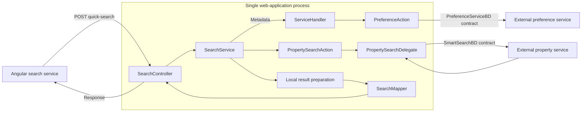

# Backend Application Architecture

[Backend](index.md) | [Project context](../project-context.md) | [Module dependencies](module-dependencies.md) | [API map](api-and-feature-map.md)

## Host, startup and discovery

**Confirmed at `RP-10188` / `a6f611ae0`:** `Application.main` starts Spring Boot; component scanning covers `com.facl.uaf`, allowing included library projects to contribute beans. Repository/entity scans include the web and reports packages. The web build packages the Phoenix and User Guide outputs into the executable JAR.

Evidence: `realist\web\src\main\java\com\facl\uaf\realist\Application.java:11-31`; `realist\web\build.gradle:17-28,41-73`. The [delivery chapter](../development/build-and-deployment.md) owns the complete task/artifact explanation.

The incoming application is servlet/MVC. An outbound `WebClient` dependency does not turn every controller into a reactive server. Configuration explicitly selects servlet mode; commerce consumes some client responses using blocking calls. Evidence: `realist\web\src\main\resources\application.yml:9-38`; `realist\web\src\main\java\com\facl\uaf\realist\rest\controller\StoreController.java:337-359`.

## Responsibility vocabulary

For compact references in this page:

- `W` = `realist\web\src\main\java\com\facl\uaf\realist`
- `S` = `uaf-propertysearch\action\src\main\java\com\facl\uaf\propertysearch`
- `P` = `uaf-preference\action\src\main\java\com\facl\uaf\preference`

| Responsibility | Actual role | Example and evidence |
| --- | --- | --- |
| Security filter/provider | Establish identity before ordinary controller handling | `W\rest\security\filters\MlsGroupAuthenticationFilter.java:24-46` |
| Controller | Bind a request and select an operation; some also normalize or enforce feature conditions | `W\rest\controller\SearchController.java:58-119,137-223` |
| Service | Coordinate feature inputs, state, transformations and integration calls | `W\service\SearchService.java:127-186` |
| Facade | Gather shared orchestration behind a convenient interface | `W\action\ServiceHandler.java:1001-1033`; this is a role, not a universal layer |
| Action | Adapt session/user context and application inputs to library/provider operations | `S\action\PropertySearchAction.java:222-263` |
| Delegate | Wrap provider operations and sometimes perform substantial preparation/postprocessing | `S\action\delegate\PropertySearchDelegate.java:307-384` |
| Client | Implement an outbound transport contract | `W\store\StoreApiClient.java:57-111` |
| Mapper | Convert model shapes, including generated MapStruct mappings | `W\rest\mapper\SearchMapper.java:17-34` |
| Converter | Interpret report representations into browser-facing structures | `W\rest\converter\DefaultConverter.java:21-27` |
| Repository/entity | Read/write application-owned persistent state | [Database and migrations](../cross-cutting/database-and-migrations.md) |

These terms are a map for reading the repository, not an enforced uniform architecture. Methods and package identity matter more than suffixes.

## Representative request boundary

The library calls inside the host are in-process. The named IFC contracts mark the limit of local evidence; their downstream database/transport implementation is not inferred.

Evidence: `W\service\SearchService.java:130-185`; `S\action\PropertySearchAction.java:251-263`; `S\action\delegate\PropertySearchDelegate.java:307-343`; `W\rest\controller\SearchController.java:58-70`. The [search sequence](../feature-flows/property-search.md) owns the full branch and result-handling detail.

## Important exceptions to a universal pipeline

| Operation | Actual path distinction | Evidence under `W` unless stated |
| --- | --- | --- |
| Standard login | Filter -> provider -> user-access action -> success-handler initialization | [Login lifecycle](../feature-flows/login-and-session-lifecycle.md) |
| Search | Metadata comes through `ServiceHandler`, execution calls the search action directly | `service\SearchService.java:130-154` |
| Count | Host service can invoke the property-search delegate directly | `service\SearchService.java:297-345` |
| Map property lookup | Controller invokes `MapAction` | `rest\controller\MapController.java:83-90` |
| Cart update | Controller coordinates local `CartService` and external `StoreApiClient` | `rest\controller\StoreController.java:337-359` |
| Shared-link creation | Controller invokes `SharedLinkService`; branding resolution can separately use preferences | `rest\controller\SharedLinkController.java:43-68` |
| Document images | Controller invokes reports-module `DocumentImageService` | `rest\controller\DocumentImageController.java:45-55,85-113` |
| AI-summary retrieval | Host helper owns reuse/orchestration, common integration supplies provider access | `rest\controller\ReportController.java:179-192`; [common module](modules/uaf-common.md) |
| WMS relay | A controller inside the map library owns `/spring/wmsrc` | `uaf-map\action\src\main\java\com\facl\uaf\map\action\WMSRelayController.java:63-109,219-236` |

Do not add a `ServiceHandler`, action or database box to a sequence if the code does not call it.

## Data representations and state

Different boundaries have different shapes. A browser search field uses `operatorValues`; IFC mapping uses the differently spelled `operaterValues`. A property report can pass from provider records through template-driven XML into a report DTO. A PDF flow may cache a model and render later, while a customized PDF may cache already-rendered bytes.

Sources: `W\rest\mapper\SearchFieldsMapper.java:11-19`; [property report flow](../feature-flows/property-details-and-reports.md); [PDF flow](../feature-flows/pdf-generation-and-download.md).

Application-owned relational data, Redis/session data and provider-owned state must remain separate. A remote active cart can be combined with local saved-for-later rows; saved search definitions use preference contracts rather than an assumed local saved-query table.

See [database](../cross-cutting/database-and-migrations.md), [Redis](../cross-cutting/redis-caching-and-sessions.md), [saved items](../feature-flows/saved-searches-and-favorites.md) and [commerce](../feature-flows/cart-checkout-and-report-credits.md).

## Error and access behavior

There is no uniform success/failure shape. For example, host Quick Search wraps exceptions, action `mySearch` can catch/log and return null, template operations map provider status into 204/502 outcomes, and premium report handlers can return shells or 204 for specific conditions.

Evidence: `W\service\SearchService.java:183-185`; `S\action\PropertySearchAction.java:222-240`; `W\rest\service\PreferenceService.java:41-66`; [report availability](../frontend/reports/availability-and-access-rules.md).

Frontend guards, server security, feature conditions, user entitlement, provider coverage and purchase/accounting are distinct. The presence of one check does not establish the rest. [Authentication](../cross-cutting/authentication-and-authorization.md) owns chain/profile details.

## Practical debugging order

1. Identify the actual browser method/path and match class-level plus method-level mappings.
2. Determine whether a security filter or controller handles the request.
3. Compare incoming DTO fields with session-derived and server-configured values.
4. Follow local transformations before the external call.
5. Separate provider outcome from conversion, cache, persistence or usage side effects.
6. Follow the returned HTTP/body shape into its effect/direct subscription and rendered state.

**Unknown:** external provider internals, effective configuration, runtime concurrency guarantees not proven by source, and production topology. Read [common changes](../development/making-common-changes.md) before modifying multiple layers.
