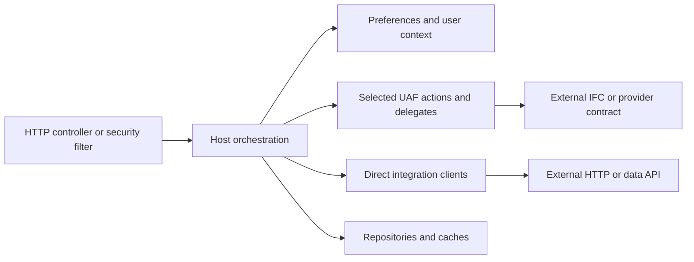

# Backend: Application Host and Library Modules

[Project context](../project-context.md) | [Feature flows](../feature-flows/index.md) | [Repository map](../overview/repository-and-technology-map.md)

## Start with the runtime boundary

Realist has one Spring Boot application host, `realist:web`. The included UAF action projects are Java libraries used inside that application, not independently deployed microservices. The host combines property research, user configuration, report conversion, commerce, sharing, and external integrations.

**Confirmed baseline:** branch `RP-10188`, revision `a6f611ae0`; source research 2026-09-25, documentation recovery 2026-09-26. Evidence: `settings.gradle:19-30`, `realist\web\build.gradle:17-28,97-103`, and `realist\web\src\main\java\com\facl\uaf\realist\Application.java:11-31`.

This describes an application boundary, not the number of instances running in production. No build, test, server or provider call was executed for this guide.

## Reading map

| Chapter | Responsibility and reason to read it |
| --- | --- |
| [Application architecture](application-architecture.md) | Processing responsibilities, entry points, transformations and important exceptions |
| [Module dependencies](module-dependencies.md) | Direct Gradle edges versus runtime/provider calls |
| [API and feature map](api-and-feature-map.md) | HTTP families, mapped browser callers, controller ownership and contract caveats |
| [Realist web](modules/realist-web.md) | Executable host, controllers, orchestration, conversion and application state |
| [Common](modules/uaf-common.md) | Shared action foundation, context/cache helpers, lookup and integration clients |
| [User access](modules/uaf-useraccess.md) | Passport identity, entitlement, user information and usage contracts |
| [Preferences](modules/uaf-preference.md) | Templates, lookup metadata, user hierarchy and preference writes |
| [Property search](modules/uaf-propertysearch.md) | Search preparation/delegation, property retrieval and label data |
| [Maps](modules/uaf-map.md) | Coordinate lookup, map/geocoder clients, imagery and WMS relay |
| [Reports](modules/uaf-reports.md) | Report data/XML, document images, report limits and credit accounting |
| [Activity](modules/uaf-activity.md) | Included activity wrapper whose active application callers are not established |
| [FARES model status](modules/uaf-faresmodel.md) | Included source-empty project; no invented domain-model ownership |
| [Support status](modules/uaf-support-status.md) | Historical/manual artifacts outside the included Gradle projects |

For a first backend reading session, use architecture -> dependencies -> web -> property search -> preferences -> reports. Read the other modules when their boundary appears in the selected feature.

## A useful responsibility map

Arrows are responsibility categories, not a mandatory pipeline. Login can start in a filter; commerce can call a client directly; a map relay is itself a controller inside a library. The detailed architecture chapter cites those paths.

## Cross-layer ownership

Full browser-to-provider walkthroughs belong to the [feature-flow section](../feature-flows/index.md). In particular:

- [Search](../feature-flows/property-search.md) and [saved searches/favorites](../feature-flows/saved-searches-and-favorites.md) connect metadata, forms, actions and remote contracts.
- [Property reports](../feature-flows/property-details-and-reports.md), [PDF](../feature-flows/pdf-generation-and-download.md) and [exports/labels](../feature-flows/exports-and-mailing-labels.md) separate source data from output transformations.
- [Commerce/credits](../feature-flows/cart-checkout-and-report-credits.md) distinguishes active cart, saved items, purchases, monthly usage and subscription credits.
- [Shared links](../feature-flows/shared-report-links.md) documents creation/email/cleanup and the unlocated recipient reader.
- [Login/session](../feature-flows/login-and-session-lifecycle.md) separates browser entry, server authentication and user-data initialization.

Schemas, Redis, security and external configuration are authoritative in [cross-cutting documentation](../cross-cutting/index.md); setup and commands are in [development](../development/index.md).

## Five rules for reading this backend

1. A build dependency is not an HTTP call or a separate deployment.
2. `ServiceHandler` is a shared facade for selected operations, not every request.
3. Action and delegate classes can contain meaningful transformations and branch logic.
4. A source-present class, included project or schema table does not prove an active runtime consumer.
5. Null results, business status fields, exceptions and HTTP errors coexist; inspect the actual operation.

**Unknown boundaries:** external IFC implementations, deployed configuration, provider coverage, production topology and runtime guarantees not established by local code. Specific questions and source caveats are preserved in each module and the [gap register](../onboarding/known-gaps-and-team-questions.md).
