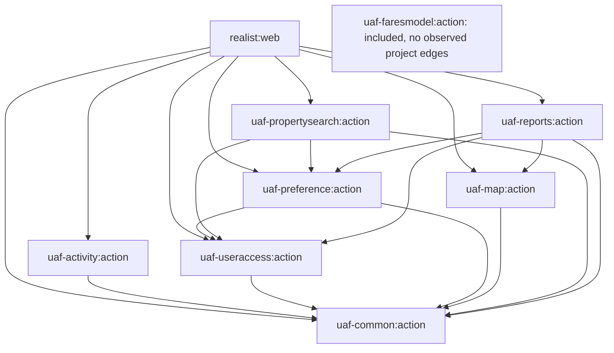

# Module Dependencies and Runtime Boundaries

[Backend](index.md) | [Project context](../project-context.md) | [Application architecture](application-architecture.md)

## What an edge means

The graph below shows direct `implementation project(...)` declarations at revision `a6f611ae0`, not HTTP calls, complete transitive dependencies or independently deployed services. Runtime call relationships are explained in module pages and [feature flows](../feature-flows/index.md).

The isolated FARES-model node is intentional: inclusion is confirmed, but no direct project consumer or current implementation source was found. `uaf-support` is outside the included project list and therefore outside this dependency graph.

## Direct declarations and source evidence

| Project | Direct local project dependencies | Evidence |
| --- | --- | --- |
| `realist:web` | common, preference, propertysearch, useraccess, activity, map, reports | `realist\web\build.gradle:97-103` |
| `uaf-common:action` | No sibling project declaration found | `uaf-common\action\build.gradle:24-110` |
| `uaf-activity:action` | common | `uaf-activity\action\build.gradle:15` |
| `uaf-useraccess:action` | common | `uaf-useraccess\action\build.gradle:15` |
| `uaf-preference:action` | common, useraccess | `uaf-preference\action\build.gradle:16-17` |
| `uaf-propertysearch:action` | common, preference, useraccess | `uaf-propertysearch\action\build.gradle:25-27` |
| `uaf-map:action` | common | `uaf-map\action\build.gradle:25` |
| `uaf-reports:action` | common, map, preference, useraccess | `uaf-reports\action\build.gradle:21-24` |
| `uaf-faresmodel:action` | No sibling project declaration or direct consumer found | `uaf-faresmodel\action\build.gradle:13-19`; project-declaration search |

The settings inclusion list is `settings.gradle:21-30`. Common being dependency-light locally does not make it externally dependency-free. It supplies many dependency-provided interfaces, clients and shared framework types.

## Three additional dependency categories

### Frontend asset task dependencies

`phoenix` is included in settings, but its connection to web packaging is a build-task/output relationship. Web tasks copy the main frontend and User Guide outputs; `bootJar` and main-class resolution depend on those inputs.

Evidence: `realist\web\build.gradle:17-28,41-56`. Do not draw this as a Java `implementation project` edge. See [build/deployment](../development/build-and-deployment.md).

### External and inherited libraries

Each project has explicit artifact declarations, and the root `subprojects` block contributes shared dependency management/framework dependencies. An inherited Spring dependency does not make a library executable.

Examples include IFC artifacts for common, preferences, lookup, property images, smart search, user access and activity. The source boundaries are documented in [external integrations](../cross-cutting/external-integrations.md) and individual modules.

Evidence: `build.gradle:49-59,180-238`; the module build references above. Versions expressed through build properties are declarations, not proof of a resolved runtime graph.

### Generated integration clients

Common, map and property-search builds include client-generation work. Common also configures DGS client generation. Generated types support outbound contracts; their existence does not prove an inbound GraphQL API.

Evidence: `uaf-common\action\build.gradle:122-160`; `uaf-map\action\build.gradle:62-206`; `uaf-propertysearch\action\build.gradle:88-120`.

## Participation is a separate question

| Evidence | What it proves | What it does not prove |
| --- | --- | --- |
| Included settings project | Gradle recognizes that project | The web runtime consumes its JAR |
| Direct implementation dependency | A build-time dependency is declared | Every class has an active caller |
| Component annotation plus broad scan | A class can be discovered under applicable conditions | Every method is invoked |
| Source call site | A concrete caller/callee relationship | That branch occurs in a given deployment |
| External interface call | Local code crosses a contract boundary | Provider implementation or database ownership |

The [activity wrapper](modules/uaf-activity.md), [FARES-model status](modules/uaf-faresmodel.md), and [support artifacts](modules/uaf-support-status.md) illustrate these distinctions.

## Versions, changes and unknowns

Current root declarations include Java 21, Spring Boot `3.5.15` and Spring Cloud `2025.0.3` (`build.gradle:5,13-19,90`). The [technology map](../overview/repository-and-technology-map.md) owns the complete declared-stack overview.

When changing module ownership, inspect direct project declarations, inherited libraries, generated sources, scanning and actual callers separately. **Unknown:** the resolved dependency graph and deployed classpath; no dependency-resolution or execution task was run for this documentation.
