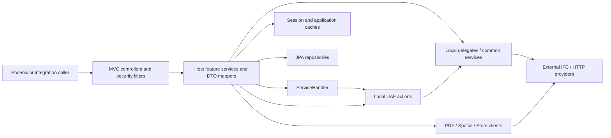
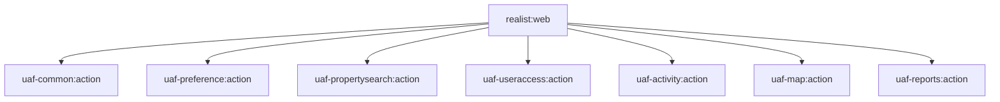

# `realist:web`: the application host

[Backend](../index.md) · [Main context](../../project-context.md) · [API and feature map](../api-and-feature-map.md)

**Source baseline:** revision `a6f611ae0`, RP-10188; focused static source inspection, 2026-09-25. No application execution or environment verification was performed.

## What this module owns

`realist:web` is the executable Spring Boot host, not just a REST adapter and not a separately deployed service for each feature. It packages the Phoenix application and help application, receives browser and integration requests, authenticates users, assembles user/session context, translates wire models, orchestrates searches/reports, and serves prepared downloads. It also owns application-specific commerce, announcement, AI-summary and shared-link persistence. The `uaf-*:action` projects are local libraries in this process; their delegates/clients can cross remote service boundaries.

The project is included at `settings.gradle:29`. Start with `realist\web\build.gradle:17-27,41-50`: `bootJar` is named `res-realist-phoenix`, depends on Phoenix bundling and copies the main UI into `public` and help into `public/help`. The ordinary jar is disabled at lines 7-9. Presence of Java packages is not evidence of a separate deployment.

### Entry point and component discovery

`realist\web\src\main\java\com\facl\uaf\realist\Application.java:11-31` is the executable entry:

* `SpringApplication.run(Application.class, args)` starts the host.
* `@ComponentScan("com.facl.uaf")` discovers host **and action-library** Spring components, including controllers outside the host's controller folders.
* JPA repository scanning includes `com.facl.uaf.realist.repository` **and** `com.facl.uaf.report.repository`; entity scanning includes the host REST models and `com.facl.uaf.report.entity`.
* Servlet component scanning is enabled. Default `SecurityAutoConfiguration` is excluded; this does **not** mean security is disabled. Explicit filter-chain configuration lives in `rest.security.configuration.MultipleLoginSecurityConfig`.

Two concrete examples of scanned controllers **outside** the host source are `uaf-map\action\src\main\java\com\facl\uaf\map\action\WMSRelayController.java:63,219` (`/spring/wmsrc`) and `uaf-reports\action\src\main\java\com\facl\uaf\report\util\ZoningMapController.java:25,36` (`/zoningMap`). They remain owned by their action-library chapters.

`controller\FrontendRoutesController.java:9-56` forwards main application deep links to `/index.html`, redirects historical help entries to `/help`, and forwards help routes to `/help/index.html`. These are GET document routes, distinct from JSON API calls.

**Citation convention below:** paths beginning `action\`, `controller\`, `rest\`, `service\`, `store\`, `repository\`, `config\` or `util\` are relative to `realist\web\src\main\java\com\facl\uaf\realist\`. A suffix `:N` is a source line, not a documentation line.

## Read the host by responsibility

| Area | Important symbols / source anchors | Responsibility and callers |
|---|---|---|
| HTTP entry | `rest\controller\SearchController.java:39-134`; `rest\controller\ReportController.java:169-179`; complete list in the [API map](../api-and-feature-map.md) | Accept browser DTOs, choose feature service, return report sections, search data, links, bytes or errors. The API map distinguishes constrained verbs from unrestricted mappings. |
| Authentication and bootstrap | `rest\security\configuration\MultipleLoginSecurityConfig.java:116-135,163-248`; `rest\controller\LoginAllData.java:99-139`; `rest\service\LoginService.java:103-128` | Security filters handle login, then bootstrap services compose preferences, templates, entitlement/credit, feature and identity data. `LoginAllData` is a real controller despite its name. |
| Session-aware orchestration | `action\ServiceHandler.java:97-168,174-195,260-295` | A broad `BaseAction` subclass wrapping preference, search, map, access, report and lookup actions. Splits cacheable startup/preferences from work that still needs a service call. Not a universal dispatcher. |
| Search | `service\SearchService.java:83-127,154-178,297-366` | Builds action inputs, applies geography and field transformation, calls search actions/delegates and sorts/maps results. Used by search endpoints and favorite/recent-property hydration. |
| Preferences and wire mapping | `rest\mapper\SearchMapper.java:17-18`; `rest\mapper\ExportMapper.java:19-20`; `rest\controller\PreferenceController.java:81-164,307-436` | MapStruct Spring mappers adapt browser fields/templates to IFC/action models. Preference endpoints manage saved templates, regions, report criteria, favorites, widgets and Property Intelligence preferences. |
| Report assembly | `rest\service\report\PropertyDetailsService.java:67-87,128-175`; `rest\service\ecommerce\EcommerceReportsService.java:51-108,235` | Per-report services obtain data and convert XML/legacy outputs into `Report` headers and sections. Commerce-aware paths make availability/purchase decisions; not every report is free or identical. |
| Downloads and rendering | `rest\controller\FileBaseController.java:25-27,46-110`; `service\reports\pdf\ReportPdfService.java:72-100` | Prepare a link, retrieve cached inputs, choose the report renderer, and serve bytes. PDF/PNG/download endpoints are distinct contracts. |
| Export and labels | `rest\controller\ExportController.java:57-83,138-171`; `service\ExportService.java:75-102,133-158,218-220` | Build CSV from selected properties/fields, account usage, cache files, optionally hand CSV to RealMailers. Labels have their own controller and action-backed preparation. |
| Mapping and analytics | `rest\service\SpatialApiService.java:100-112,699-784`; `rest\service\PropertyIntelligenceService.java:74-80,175-238` | Spatial requests use an HTTP client; analytics services compose common-module market/listing/rental/HPI responses into charts. These are not all `ServiceHandler` calls. |
| Commerce | `rest\controller\StoreController.java:337-362,478,681`; `store\StoreApiClient.java:36-113`; `rest\service\CartService.java:50-104` | Remote active cart/order operations coexist with local saved-for-later records. Credit/report ledgers additionally live in `uaf-reports`. |
| Sharing | `rest\controller\SharedLinkController.java:43`; `rest\service\sharedlink\SharedLinkService.java:52-71,97-145`; `rest\service\sharedlink\SharedLinkCleanupService.java:57-62` | Persist report snapshots and link metadata, publish events, compose recipient URLs, and clean up expired links with a distributed scheduling lock. Creation is not evidence that this host serves recipient pages. |
| AI report summary | `rest\controller\ReportController.java:179-191`; `rest\service\report\AiSummaryHelper.java:125-168,531-562` | Accept property ID plus serialized report extraction, call common `LiteLlmService`, cache a nonempty summary and persist summary/checksum through `AiSummaryRepository`. This is an additional remote and local-persistence path, not a plain report XML mapper. |

There are two similarly named report-service areas: `rest.service.ReportService` handles search-view report preparation, footer/commerce helpers, while `rest.service.report.ReportService` is the base for individual report services. Likewise, `service.SearchService` is the host orchestrator, not the remote SmartSearch implementation. Always resolve the import before following a symbol.

## Actual call shapes: handlers, actions, delegates and clients

This is a **runtime responsibility sketch**, not a Gradle dependency graph and not a promise that each request follows every arrow.

* **Through the handler:** preference/template work can use `ServiceHandler` to merge cached and fresh data. `getTemplate` checks `preferencesUseCache` before calling `PreferenceAction`, then refreshes the cache (`action\ServiceHandler.java:260-295`). MLS lookup data similarly consults `StartupStorage` (`:174-195`).
* **Action bypass:** `SearchService.quickSearch` calls `PropertySearchAction.quickSearch` directly (`service\SearchService.java:154,178`). The count/search path can call `PropertySearchDelegate.mySearch` directly (`:297-344`). Do not insert an invented handler hop.
* **Host service bypass:** `PropertyIntelligenceService` calls `MarketTrendsService.getMarkets`, `getListings`, `getRentalTrends`, `getHPI` and `getHPIForecast` (`rest\service\PropertyIntelligenceService.java:195-238`). The common-module service is the next source boundary, not an inbound GraphQL endpoint.
* **Direct HTTP boundary:** `PdfClient.generate` POSTs a `PdfRequest` to a configured renderer and returns bytes (`service\reports\pdf\PdfClient.java:19-34`). `StoreApiClient` wraps remote cart/order HTTP operations (`store\StoreApiClient.java:57-113`). `SpatialApiService` owns another HTTP boundary.
* **Local persistence bypass:** shared-link creation calls JPA repositories in a transaction (`rest\service\sharedlink\SharedLinkService.java:70-145`). `CartService.saveForLater` updates local rows (`rest\service\CartService.java:50-83`).

Here **facade** describes the role of `ServiceHandler` and feature services, not a verified separate `facade` package or mandatory class layer. The concrete next-hop symbols include `PreferenceDelegate` and `PropertySearchDelegate`; a Java action/delegate call is still in-process until its provider/client makes an external call. Read [common](uaf-common.md), [search](uaf-propertysearch.md), [reports](uaf-reports.md), [preferences](uaf-preference.md), [user access](uaf-useraccess.md), [map](uaf-map.md) and [activity](uaf-activity.md) for those ownership boundaries. This host's observed inbound API is Spring MVC; use of GraphQL/DGS-related clients deeper in a provider path must not be described as a browser GraphQL/DGS server without separate evidence.

## Contracts and transformations that matter

### Search and preferences

`SearchController.quickSearch` normalizes APN search fields before invoking the service and maps the returned `SearchResultData` to `QuickSearchOutput` (`rest\controller\SearchController.java:58-70`). My Search returns `PropertySearchOutput` and also normalizes lender values (`:96-105,137-165`). Count is a separate operation returning `{count: number}`, capped at 10,000 by the controller (`:108-119`); it is not proof that the grid contains that many rows.

Saved searches are **templates**, whereas favorite properties are **property identifiers in preferences**. Template CRUD enters `PreferenceService` with the My Search component code (`rest\controller\SearchController.java:73-88`); favorite retrieval goes through property search (`:125-128`). Browser owners are `phoenix\src\app\search\services\preference.service.ts:33-42` and `phoenix\src\app\saved-properties\services\saved-properties.service.ts:13-18`.

The bootstrap model is deliberately not the IFC model unchanged: `rest\mapper\LoginDataMapper.java:21-57` maps data elements, validation information and templates into browser DTOs; `rest\mapper\PreferenceMapper.java:23-59` maps preference groups/elements and parses template additional information. `SearchMapper.toQuickSearchOutput` and `ExportMapper.toPropertySearchInput` are concrete opposite-direction adapters (`rest\controller\SearchController.java:70`; `rest\controller\ExportController.java:59,82-83`). Report converters are a separate XML/section transformation layer, not MapStruct aliases.

### Reports, PDF and exports

Property details combine action output, custom footnotes, XML conversion and identity fields (`rest\service\report\PropertyDetailsService.java:128-175`). `PropertyIdentifier`, CLIP, APN and county identifiers are not interchangeable; inspect the specific report input and current availability/credit checks when extending one.

PDF is usually **prepare → link → GET → render/load bytes**, not a single POST returning a finished PDF. `FileBaseController` has separate report/dashboard namespaces and uses `ReportPdfService.generateFromCache` on download (`rest\controller\FileBaseController.java:25-27,53-70`). The dispatch supports property details, comparables, neighbors, neighborhood profile, market trends, permits, foreclosure, sketch, premium flood, hazard, customized reports and Property Intelligence (`service\reports\pdf\ReportPdfService.java:72-100`). Some cases retrieve already generated bytes; others render cached typed inputs. The renderer's external failure can return `null` (`service\reports\pdf\PdfClient.java:29-74`), while absent cached artifacts become 404 at the file-controller boundary.

CSV is **not merely serializing the visible grid**. `ExportInput` is mapped back to `PropertySearchInput`, export fields are adjusted, and `ExportService.getProperties` delegates to `TableService.loadProperties` (`rest\controller\ExportController.java:79-138`; `service\ExportService.java:133-158`). `service\dashboard\table\TableService.java:64-83,139-173` expands fields, calls `PropertySearchAction.getPropertyInformationList` and restores requested ordering. Successful nonempty export updates usage and stores CSV before producing a download link (`service\ExportService.java:75-102,218-220`). Mailing labels and RealMailers are related but separate contracts.

## Data, cache and session boundaries

| State | Host responsibility / evidence | Do not confuse with |
|---|---|---|
| Authentication/session context | Explicit security-context repository/filter chains; `LoginService` composes bootstrap data using `SessionStateUtil` (`rest\security\configuration\MultipleLoginSecurityConfig.java:61-66,163-248`; `rest\service\LoginService.java:105-128`). | Browser storage or a stateless bearer-only application. See the platform owner for effective session serialization/expiry. |
| Startup and preference cache | `StartupStorage` and preference cache access in `ServiceHandler` (`action\ServiceHandler.java:174-195,260-295`). | Property records permanently owned by this database. |
| Prepared report cache | `ReportCachingService.insert` passes session ID to storage, but its actual key contains `REPORT_PREFIX`, passport user ID and unique output name (`service\reports\pdf\ReportCachingService.java:32-70,99-114`). | A durable shared report snapshot, guaranteed permanent file URL, or automatic per-session key namespace. |
| Export/download content | CSV enters `LocalStorage`; `FileService` loads a cached string/base64 payload and constructs `/api/download-file/{fileName}` (`service\ExportService.java:94-102`; `rest\service\FileService.java:24,41-59`). | Files guaranteed to exist on the host filesystem. `LocalStorage` is a cache abstraction, despite its name. |
| Commerce | Active cart reads/updates/submissions use `StoreApiClient`; `CartService` stores saved-for-later rows. Product lists can be serialized into Redis via `StoreService` (`store\StoreApiClient.java:57-113`; `rest\service\CartService.java:50-104`; `rest\service\StoreService.java:31-53`). | “Cart is local JPA only,” or “an order is the same as a report credit.” |
| Shared snapshots | Transactional link/report repositories and cleanup orchestration (`rest\service\sharedlink\SharedLinkService.java:70-145`; `rest\service\sharedlink\SharedLinkCleanupService.java:57-62`). | User-associated, expiring PDF preparation cache. |

`LocalStorage` is Redis-backed, not process-local storage. Its implementation serializes/compresses values and writes the supplied key with a configured TTL; the `sessionId` argument does **not** automatically namespace that key (`uaf-common\action\src\main\java\com\facl\uaf\common\shared\util\LocalStorage.java:22-30,37-83`). Session context, prepared-output cache, shared snapshots and scheduler locks are separate responsibilities.

The host enables repositories/entities in the report library as well as its own (`Application.java:14-21`). Thus report usage/credit persistence can participate in this process without its entities being under `realist\web`. Consult platform/data owners for Redis configuration, database migrations, expiration and external service bindings; source annotations alone do not establish deployed values.

## Direct build dependencies

These are **declared direct project edges**, verified at `realist\web\build.gradle:97-103`; they are not remote network edges.

Neither `uaf-faresmodel:action` nor `uaf-support` is in that host direct-project list. Do not add a direct edge because a type or historical source directory exists; see the dependency-map owner for transitive inclusion.

Important **direct external declarations** in this build:

* MapStruct and its annotation processors (`:111-115`); generated mappers are Spring beans rather than handwritten controllers.
* Google Maps services (`:116`); useraccess, administration, preference, utility, propertyimage, smartsearch, lookup and common IFC artifacts with exclusions (`:119-156`). Their implementations are not established by this repository's interface imports.
* JOSE/JWT, cryptographic and Ping agent libraries (`:167-170`), distinct from provider configuration and credential values.
* PostgreSQL, Spring Data JPA and Flyway (`:174-177`); ShedLock Spring/Redis (`:180-184`); Store API starter and OAuth (`:186-187`).
* Chart/SVG, HTML sanitization, HTTP client, APM, Cloud Foundry environment and Elasticsearch client dependencies (`:189-198`).

This is not the full resolved classpath. The config-keystore dependency has a dedicated non-transitive **build-time** configuration (`:75-80,95`); it must not be depicted as a restored runtime starter. No configuration secret or keystore contents were inspected.

## Where to extend and debug

| Symptom / change | First stop | Next decision |
|---|---|---|
| Request hits wrong endpoint or returns 405 | [API map](../api-and-feature-map.md), controller mapping and browser service call | Resolve class + method path, actual browser verb and security filter before changing a service. Unrestricted mappings are not GET declarations. |
| Login succeeds but UI has wrong flags/templates | `rest\controller\LoginAllData.java:131-139` → `rest\service\LoginService.java:103-128` | Compare bootstrap composition, session identity and preference cache; distinguish login authentication from post-login loading. |
| Incorrect APN/lender or search count | `rest\controller\SearchController.java:108-119,137-220` → `service\SearchService.java:297-366` | Check transformed fields, county restrictions and delegate inputs, not only Angular state. |
| Correct report data, wrong visible section | `rest\service\report\PropertyDetailsService.java:149-175` → `rest.converter` | Separate provider output, XML/HTML conversion and frontend rendering. |
| Download link exists, PDF fails | `rest\controller\FileBaseController.java:67-110` → `service\reports\pdf\ReportPdfService.java:72-100` → `service\reports\pdf\PdfClient.java:29-74` | Separate cache miss/expiry from rendering and external failure; inspect logs without exposing report payloads. |
| Export differs from grid | `rest\controller\ExportController.java:79-138` → `service\ExportService.java:133-158` | Check export fields/re-query and formatting, then usage accounting; do not “fix” the grid as a substitute. |
| Cart or paid report state disagrees | `rest\controller\StoreController.java:337-362,478,681`; `rest\service\ecommerce\EcommerceReportsService.java:51-108` | Distinguish remote cart, saved-for-later rows, order state and transaction/credit ledger. |
| Shared link creation or cleanup fails | `rest\service\sharedlink\SharedLinkService.java:70-145`; `rest\service\sharedlink\SharedLinkCleanupService.java:57-62` | Follow transactional snapshot persistence, feature gating and lock/cleanup owner. Never log bearer links. |

For a new endpoint, follow the owning feature's existing DTO/service path rather than enlarging `ServiceHandler` by default. A new report may need separate browser-report conversion, preparation cache type, `ReportType` dispatch, renderer/template and entitlement/usage integration. A change in only the JSON controller is not necessarily complete.

## Authoritative related reading and limits

Detailed sequences belong to [login/session](../../feature-flows/login-and-session-lifecycle.md), [property search](../../feature-flows/property-search.md), [saved searches/favorites](../../feature-flows/saved-searches-and-favorites.md), [property details/reports](../../feature-flows/property-details-and-reports.md), [PDF preparation/download](../../feature-flows/pdf-generation-and-download.md), [exports/labels](../../feature-flows/exports-and-mailing-labels.md), [maps/lookups](../../feature-flows/maps-and-property-lookup.md), [cart/credits](../../feature-flows/cart-checkout-and-report-credits.md) and [shared links](../../feature-flows/shared-report-links.md).

Use [frontend ownership](../../frontend/index.md), [Dashboard](../../frontend/dashboard/index.md), [search](../../frontend/search/index.md), [Property Intelligence](../../frontend/property-intelligence/index.md), and [platform/cross-cutting ownership](../../cross-cutting/index.md) instead of duplicating UI state or security/configuration walkthroughs here. In particular, [authentication](../../cross-cutting/authentication-and-authorization.md), [Redis/sessions](../../cross-cutting/redis-caching-and-sessions.md), [database/migrations](../../cross-cutting/database-and-migrations.md) and [integrations](../../cross-cutting/external-integrations.md) own the platform details. Some linked owner pages may be written in parallel with this chapter.

**Unverified:** effective deployed configuration/feature flags, external IFC/provider implementations, deployment topology, cache lifetimes at runtime, partner use of historical direct/server-rendered routes, and the recipient application's deployed shared-link behavior. Controller presence is source evidence, not traffic evidence. The API map explicitly marks untraced callers and observed browser/backend mismatches rather than declaring them live successful journeys.
