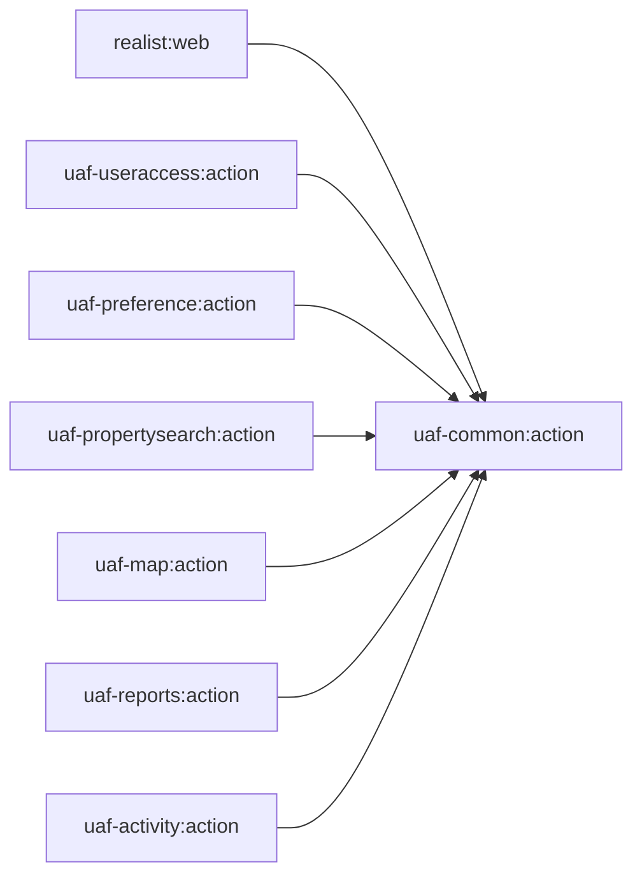

# `uaf-common:action`

[Backend index](../index.md) · [Project context](../../project-context.md)

Documentation snapshot: revision `a6f611ae0`, branch `RP-10188`. This page explains representative source-level wiring, not a verified running deployment. Configuration is described through consumers and property names, never deployment credentials or values.

## 1. What belongs here?

Think of common as the **shared backend library and integration-adapter layer**, not as the web application or a separate service-tier implementation. It supplies session-aware action helpers, lookup/geography adapters, shared request/response models, Redis helpers, IFC client factories, and newer HTTP/GraphQL clients. The host scans `com.facl.uaf`, while concrete host services import and call common classes. Evidence: `realist\web\src\main\java\com\facl\uaf\realist\Application.java:11-21`; `realist\web\src\main\java\com\facl\uaf\realist\rest\service\EmailService.java:3-11,41-74`; `realist\web\src\main\java\com\facl\uaf\realist\rest\service\report\SdpMarketTrendsService.java:3-18,107-131`.

**Status: included, source-present, and actively referenced by the runtime host.** Inclusion is explicit at `settings.gradle:22-22`; the artifact is named `uaf-common-action`, and the host declares it as an implementation dependency. This is stronger evidence than merely finding an old action XML file. Evidence: `uaf-common\action\build.gradle:1-13`; `realist\web\build.gradle:97-103`; `realist\web\src\main\java\com\facl\uaf\realist\rest\controller\PreferenceController.java:307-315`.

The important business outcomes are search-field suggestions and county resolution, preference reuse, report/market-data enrichment, report email delivery, and Property Insights generation. Follow the corresponding concrete chains below rather than assuming every feature passes through `ServiceHandler`. Evidence: `realist\web\src\main\java\com\facl\uaf\realist\action\ServiceHandler.java:1591-1625`; `uaf-propertysearch\action\src\main\java\com\facl\uaf\propertysearch\util\SpatialUtils.java:230-230,330-330,361-361`; `uaf-preference\action\src\main\java\com\facl\uaf\preference\action\delegate\PreferenceDelegate.java:388-409`; `realist\web\src\main\java\com\facl\uaf\realist\rest\controller\ReportController.java:179-192,561-564`; `realist\web\src\main\java\com\facl\uaf\realist\rest\service\EmailService.java:61-74`.

## 2. Build dependencies are not runtime call edges

The diagram shows only direct Gradle `implementation project(...)` edges **into common**. Common's own dependency block contains external artifacts, but **no project implementation edges**; in particular, common does not depend on `uaf-map:action` just because both use GPL Locator. Evidence: `uaf-common\action\build.gradle:24-116`.

Every diagram edge is declared respectively in `realist\web\build.gradle:97-97`, `uaf-useraccess\action\build.gradle:15-15`, `uaf-preference\action\build.gradle:16-16`, `uaf-propertysearch\action\build.gradle:25-25`, `uaf-map\action\build.gradle:25-25`, `uaf-reports\action\build.gradle:21-21`, and `uaf-activity\action\build.gradle:15-15`. The full graph belongs to [module dependencies](../module-dependencies.md); this is the common-centered slice.

### External artifacts and version ownership

These are **declared versions**, not a freshly resolved dependency report. The version properties below were inspected selectively.

| Dependency family | Declaration and version evidence | Why a newcomer should care |
| --- | --- | --- |
| Preference, lookup, common model/rest support | `com.corelogic.service.preference:preference-ifc:${preference_ifc}` = `8.2.20`; `com.corelogic.service.lookup:lookup-ifc:${lookup_ifc}` = `8.2.29`; `com.corelogic.service.common:common:${common}` = `8.5.20`. `uaf-common\action\build.gradle:31-44`; `gradle.properties:28-30`. | These provide the `com.fares.*` interfaces/models used at the remote boundary; the local lookup factory calls `RestClientFactory.clientOf`, not a local database implementation. `uaf-common\action\src\main\java\com\facl\uaf\common\shared\configuration\LookupConfiguration.java:3-18`. |
| Other IFC artifacts | `utility-ifc:${utility_ifc}` = `8.1.40`; `activity-ifc:${activity_ifc}` = `8.2.60`; `smartsearch-ifc:${smartsearch_ifc}` = `8.0.379`; `propertyimage-ifc:${propertyimage_ifc}` = `8.3.58`, under their respective `com.corelogic.service.*` groups. `uaf-common\action\build.gradle:45-53,63-78`; `gradle.properties:26-26,31-32,34-34`. | The build excludes selected transitive common/startup/legacy dependencies; adding an IFC jar is not permission to restore those exclusions. The precise exclusions are in the cited dependency blocks. |
| Spring infrastructure inherited from the root | `spring_boot_version = 3.5.15`; web, Redis, WebFlux, OAuth2 client and Spring Session dependencies are added in the root subproject configuration. `build.gradle:13-13,49-55,180-217`. | Common uses host-provided Spring infrastructure; it is not self-contained merely because it builds a jar. The CLIP WebClient bean, for example, lives in the host. `realist\web\src\main\java\com\facl\uaf\realist\rest\security\configuration\Oauth2Config.java:73-96`. |
| GraphQL | DGS codegen plugin `6.3.0`, DGS platform `10.2.1`, client and extended scalars; Jackson `${jacksonVersion}` = `2.21.5`, including the root's Kotlin module dependency. `build.gradle:8-8,203-206`; `uaf-common\action\build.gradle:61-61,93-95`; `gradle.properties:48-48`. | Generated query/projection types feed the outbound GraphQL client. `uaf-common\action\src\main\java\com\facl\uaf\common\shared\service\MarketTrendsService.java:63-95`. |
| SOAP generation/runtime | CXF tools, JAX-WS frontend and HTTP transport use root property `${cxfVersion}` = `4.1.7`; JAXB API is explicitly `4.0.2`. `uaf-common\action\build.gradle:15-28,97-111`; `gradle.properties:49-49`. | Generated Locator types use the Jakarta XML Binding namespace; the build comments explain why a pre-Jakarta JAXB API is incompatible. `uaf-common\action\build.gradle:98-102`. |
| Compatibility and utility support | Root forces commons-lang3 `3.20.0`; common adds commons-text `1.12.0`, jsoup `${jsoupVersion}` = `1.23.1`, Google Maps services `1.0.1`, MapStruct `1.5.5.Final` and OWASP encoder `1.2.3`. `build.gradle:154-170`; `uaf-common\action\build.gradle:55-55,80-91,103-103`; `gradle.properties:54-54`. | The lang2 bridge relies on lang3 and commons-text; do not mistake it for a second bundled lang2 dependency. `uaf-common\action\src\main\java\org\apache\commons\lang\StringUtils.java:1-23`; `uaf-common\action\src\main\java\org\apache\commons\lang\StringEscapeUtils.java:1-20`. |

**Code generation is part of the contract.** DGS generates clients under `com.facl.uaf.common.shared.graphql.generated`, mapping `BigDecimal` to `java.math.BigDecimal`. CXF's `generateLocatorCxfStubs` consumes the source WSDLs, declares the generated source directory, and is a prerequisite of `compileJava`. The generated output was not inspected; change source schemas/WSDLs and generation settings, not generated Java. Evidence: `uaf-common\action\build.gradle:122-161`. The actual consumer imports CXF Locator types and invokes `getShapeLocations`; this is not merely an unused build plugin. Evidence: `uaf-common\action\src\main\java\com\facl\uaf\common\shared\util\GplLocator.java:3-10,104-112`.

## 3. Package map and boundary vocabulary

| Area | Responsibility and representative contracts |
| --- | --- |
| `com.facl.uaf.common.shared.action` | `BaseAction` reads session user/entitlement state and derives feature-code strings; it is a helper superclass, not an HTTP controller. `getFeatureCodeList` returns an empty list when entitlement information is absent. `GeoAction` delegates county operations; `LookupAction` routes token-specific lookups. Evidence: `uaf-common\action\src\main\java\com\facl\uaf\common\shared\action\BaseAction.java:36-50,63-110,139-161`; `uaf-common\action\src\main\java\com\facl\uaf\common\shared\action\GeoAction.java:18-64`; `uaf-common\action\src\main\java\com\facl\uaf\common\shared\action\LookupAction.java:33-61,75-138`. |
| `shared.action.CacheDictionary` | Names and key-building rules, not a cache server: lookup/preference/report/token namespaces, template/preference allowlists, and `generateCacheKey`. Its allowlists must not be confused with `CacheService`'s separate cacheability policy. Evidence: `uaf-common\action\src\main\java\com\facl\uaf\common\shared\action\CacheDictionary.java:17-55,59-119,124-172`; `uaf-common\action\src\main\java\com\facl\uaf\common\shared\util\CacheService.java:79-94`. |
| `shared.service` | Outbound adapters such as `ClipService`, `MarketTrendsService`, `CommonEmailService`, and `LiteLlmService`. Inputs are local DTOs or IFC models; outputs are mapped responses, not ownership of the remote provider's implementation. Evidence: `uaf-common\action\src\main\java\com\facl\uaf\common\shared\service\ClipService.java:26-84`; `uaf-common\action\src\main\java\com\facl\uaf\common\shared\service\MarketTrendsService.java:58-122`; `uaf-common\action\src\main\java\com\facl\uaf\common\shared\service\CommonEmailService.java:94-127`; `uaf-common\action\src\main\java\com\facl\uaf\common\shared\service\LiteLlmService.java:87-137`. |
| `shared.configuration` | IFC factories, Redis serialization/TTL policies, qualified HTTP clients, and property binding. `PhoenixProperties` binds the `phoenix` prefix, including navigation/action configuration and MLS mappings; it is not the holder of all `service.tier.*` URLs. Evidence: `uaf-common\action\src\main\java\com\facl\uaf\common\shared\configuration\PhoenixProperties.java:11-42,59-83`; `uaf-common\action\src\main\java\com\facl\uaf\common\shared\configuration\RestTemplateConfig.java:16-87`; `uaf-common\action\src\main\java\com\facl\uaf\common\shared\configuration\RedisConfiguration.java:33-90`. |
| `shared.util` / `shared.data` | Session/cache access and geographic adaptation. `GplLocator` accepts `MapShapeBase` objects, transforms them to CXF evaluation shapes, calls SOAP, and converts results to `GeoCounty` lists. “Util” therefore does **not** imply pure local computation. Evidence: `uaf-common\action\src\main\java\com\facl\uaf\common\shared\util\GplLocator.java:89-152`. |
| `shared.model`, `shared.model.market`, `clip.model` | Shared contracts rather than proof of local persistence. `UAFUserInfo` is serializable and wraps external passport/entitlement models; its password field is JSON-ignored. `SdpMarketTrendsInput` carries geography, CLIP/APN and period fields. `Email` becomes an `EmailRequest` before delivery; `SearchByApnRequest` becomes query parameters before CLIP lookup. Evidence: `uaf-common\action\src\main\java\com\facl\uaf\common\shared\model\UAFUserInfo.java:5-36`; `uaf-common\action\src\main\java\com\facl\uaf\common\shared\model\market\SdpMarketTrendsInput.java:1-25`; `uaf-common\action\src\main\java\com\facl\uaf\common\shared\action\delegate\EmailDelegate.java:129-175`; `uaf-common\action\src\main\java\com\facl\uaf\common\shared\service\ClipService.java:35-53,106-130`. |

### Shared IFC beans: local proxies, external service operations

The following `@Configuration` classes expose `@Bean` methods using `RestClientFactory.clientOf(interface, configuredUrl)`. Bean construction is local; service behavior beyond that proxy belongs to the external tier, not to this repository's common module. Evidence is the factory implementation in each row.

| Factory / bean method | Interface and property consumer | Evidence |
| --- | --- | --- |
| `LookupConfiguration.lookupServiceBD` | `LookupServiceBD`, `service.tier.lookup` | `uaf-common\action\src\main\java\com\facl\uaf\common\shared\configuration\LookupConfiguration.java:10-18` |
| `PreferenceConfiguration.preferenceServiceBD` | `PreferenceServiceBD`, `service.tier.preference` | `uaf-common\action\src\main\java\com\facl\uaf\common\shared\configuration\PreferenceConfiguration.java:9-17` |
| `ActivityConfiguration.activityBD` | `ActivityBD`, `service.tier.activity` | `uaf-common\action\src\main\java\com\facl\uaf\common\shared\configuration\ActivityConfiguration.java:9-16` |
| `SmartSearchConfiguration.smartSearchBD` | `SmartSearchBD`, `service.tier.smart.search` | `uaf-common\action\src\main\java\com\facl\uaf\common\shared\configuration\SmartSearchConfiguration.java:9-17` |
| `PropertyImageConfiguration.propertyImageBD` | `PropertyImageBD`, `service.tier.property.image` | `uaf-common\action\src\main\java\com\facl\uaf\common\shared\configuration\PropertyImageConfiguration.java:10-18` |
| `EmailConfiguration.utilityBd` | `UtilityBD`, `service.tier.utility` | `uaf-common\action\src\main\java\com\facl\uaf\common\shared\configuration\EmailConfiguration.java:9-17` |

The host's package scan makes these configurations discoverable; this is **not an XML-import claim**. Concrete consumers include `LookupAction` constructor injection, `PreferenceDelegate`'s preference fetch, and the map delegate's injected `SmartSearchBD`. Also, do not infer that current email delivery uses `UtilityBD` merely because `EmailConfiguration` defines it: `EmailDelegate` injects `CommonEmailService`. Evidence: `realist\web\src\main\java\com\facl\uaf\realist\Application.java:11-21`; `uaf-common\action\src\main\java\com\facl\uaf\common\shared\action\LookupAction.java:38-61`; `uaf-preference\action\src\main\java\com\facl\uaf\preference\action\delegate\PreferenceDelegate.java:398-409`; `uaf-map\action\src\main\java\com\facl\uaf\map\action\delegate\PropertySearchDelegate.java:25-31`; `uaf-common\action\src\main\java\com\facl\uaf\common\shared\action\delegate\EmailDelegate.java:32-58`.

## 4. Representative active call chains

### A. Dynamic lookup: HTTP input → county scope → IFC suggestions

1. `PreferenceController.getLookupByToken` receives `GetTokenLookupInData` at `/api/preference/get-lookup-by-token` and forwards token number, county type, search text and maximum limit to `ServiceHandler`. This is a flow where `ServiceHandler` really is involved. Evidence: `realist\web\src\main\java\com\facl\uaf\realist\rest\controller\PreferenceController.java:307-315`.
2. `ServiceHandler.getTokenLookup` builds county FIPS inputs: type `1` uses entitled counties; type `2` reads selected MyRegion counties from preferences. It then calls common's `LookupAction`. Evidence: `realist\web\src\main\java\com\facl\uaf\realist\action\ServiceHandler.java:1591-1625`.
3. `LookupAction.getTokenLookup` dispatches city, ZIP/mailing ZIP, subdivision, building, school district, neighborhood and lender tokens. An unhandled token returns the initially empty string list. City/ZIP calls construct `GeoLookupInData` with county constraints, prefix and maximum results, call `LookupServiceBD.lookupGeoValues`, then extract names/labels and deduplicate/sort locally. Evidence: `uaf-common\action\src\main\java\com\facl\uaf\common\shared\action\LookupAction.java:43-58,75-118,193-247`.
4. Lender lookup is deliberately different: blank text avoids the external call, non-positive limits become `100`, larger limits are capped at `100`, and each result becomes `label (code)`. Exceptions are logged and leave an empty/partially built result. Separately, state token `780` is supported by `getLookupByTokenNumber`, mapping state code/name to `LookupData`; its failed lookup can return `null`. Evidence: `uaf-common\action\src\main\java\com\facl\uaf\common\shared\action\LookupAction.java:50-58,126-181,384-420`.

For search UX ownership, continue to [dynamic fields and lookups](../../frontend/search/dynamic-fields-and-lookups.md) and [property search](../../feature-flows/property-search.md), not a duplicate endpoint catalogue here.

### B. Geography: common normalizes results, providers find counties

`SpatialUtils` in property search calls `GeoAction` for shapes, ZIPs and cities. `GeoAction` forwards to `GeoDelegate`; the delegate lazily creates IFC proxies if necessary. City/ZIP operations call the external lookup service, then translate lookup rows into nested `GeoCounty` lists. ZIP conversion preallocates one result list per input ZIP and matches returned ZIPs to input positions. Lookup exceptions are logged and the initialized empty result is returned. Evidence: `uaf-propertysearch\action\src\main\java\com\facl\uaf\propertysearch\util\SpatialUtils.java:230-230,330-330,361-361`; `uaf-common\action\src\main\java\com\facl\uaf\common\shared\action\GeoAction.java:46-59`; `uaf-common\action\src\main\java\com\facl\uaf\common\shared\action\delegate\GeoDelegate.java:41-49,77-123,185-224`.

Shapes take a different remote route: `GeoDelegate` calls `GplLocator`, which combines the `gpl.server.url` and `locator.ws.path` consumers, converts shapes, creates a CXF proxy and invokes `getShapeLocations`. Output rows become county objects grouped by shape ID through a `HashMap`; do **not** promise output order matches input shape order. Failures are caught and logged, returning the current county list. Evidence: `uaf-common\action\src\main\java\com\facl\uaf\common\shared\action\delegate\GeoDelegate.java:152-162`; `uaf-common\action\src\main\java\com\facl\uaf\common\shared\util\GplLocator.java:35-38,89-152`.

Owners: [property-search module](uaf-propertysearch.md), [map module](uaf-map.md), and [maps and property lookup](../../feature-flows/maps-and-property-lookup.md).

### C. Market reports: CLIP resolution → SDP GraphQL → host report assembly

The runtime chain is `ReportController` → host `SdpMarketTrendsService` → common `ClipService` / `MarketTrendsService`. The controller accepts `SdpMarketTrendsInput`; the host service imports the common clients and models, resolves CBSA, and builds report structures. There is no `ServiceHandler` hop in this chain. Evidence: `realist\web\src\main\java\com\facl\uaf\realist\rest\controller\ReportController.java:561-564`; `realist\web\src\main\java\com\facl\uaf\realist\rest\service\report\SdpMarketTrendsService.java:3-18,117-161,252-284`.

- **CLIP boundary:** reuse a provided CLIP unless empty or `"N"`; otherwise the host constructs an APN/county request. Common sends formatted APN as `apn` and forces `legacyCountySource=true`, then extracts the first property's CLIP. Missing/invalid APN or caught lookup failures can produce `null`. This is an HTTP lookup, not a local identifier algorithm. Evidence: `realist\web\src\main\java\com\facl\uaf\realist\rest\service\report\SdpMarketTrendsService.java:252-265`; `uaf-common\action\src\main\java\com\facl\uaf\common\shared\service\ClipService.java:35-84`.
- **Host-supplied authentication:** common injects the qualified `clipWebClient`; the host creates it with an OAuth2 filter, `cliplookup` client registration, and configured CLIP base URL. The registration uses client credentials. Inspect this wiring before changing common's URL field: requests use the WebClient's base URL. Evidence: `uaf-common\action\src\main\java\com\facl\uaf\common\shared\service\ClipService.java:19-32`; `realist\web\src\main\java\com\facl\uaf\realist\rest\security\configuration\Oauth2Config.java:36-41,73-96`.
- **GraphQL boundary:** `getCbsaCodeByClip` serializes a generated site-location query, POSTs with an API-key header, maps the JSON response and prefers a CBSA division when supplied. It returns an empty `CbsaData` for empty input or caught failures. Property/CLIP endpoints and the key are consumed by `MarketTrendsConfig`; their deployment values are not established here. Evidence: `uaf-common\action\src\main\java\com\facl\uaf\common\shared\service\MarketTrendsService.java:58-122`; `uaf-common\action\src\main\java\com\facl\uaf\common\shared\configuration\MarketTrendsConfig.java:7-20`.
- **Local assembly and a debugging trap:** the host creates separate ZIP/CBSA/county requests. `getMarkets` performs the HTTP request before returning a completed future; its return type alone does not prove asynchronous I/O. It rewrites old Miami-Dade FIPS `12025` to `12086` and calls itself again regardless of GraphQL error status; caught exceptions return `null`, not an exceptionally completed future. Evidence: `realist\web\src\main\java\com\facl\uaf\realist\rest\service\report\SdpMarketTrendsService.java:269-295`; `uaf-common\action\src\main\java\com\facl\uaf\common\shared\service\MarketTrendsService.java:53-54,125-164`.

The same common market client is called by dashboard and property-intelligence services for market/listing, rental and HPI data. Evidence: `realist\web\src\main\java\com\facl\uaf\realist\rest\service\DashboardService.java:619-620`; `realist\web\src\main\java\com\facl\uaf\realist\rest\service\PropertyIntelligenceService.java:195-196,216-216,237-238`. UI/data-flow owners: [dashboard widgets](../../frontend/dashboard/widgets-and-data-flow.md), [property-intelligence analytics](../../frontend/property-intelligence/analytics-and-data-flow.md), and [property details and reports](../../feature-flows/property-details-and-reports.md).

### D. Email: host policy → local payload conversion → common email API

The controller checks the legacy email limit, calls host `EmailService`, then maps success to HTTP 200 and failure to 502. The host maps `EmailDto` to common `Email`, optionally generates an attachment from cached report data, and calls `EmailDelegate`. Evidence: `realist\web\src\main\java\com\facl\uaf\realist\rest\controller\EmailController.java:25-44`; `realist\web\src\main\java\com\facl\uaf\realist\rest\service\EmailService.java:61-74`.

`EmailDelegate.fillEmailInData` trims inputs, substitutes subject when message is null, splits semicolon-separated recipients, removes case-insensitive duplicates in To → CC → BCC priority, and Base64-encodes attachment bytes. `CommonEmailService` obtains a cached/acquired bearer token and POSTs the resulting `EmailRequest` to `/emails`; the delegate converts a non-null response into `EmailOutData.success=true`. This indicates a received submission response, **not independently verified final mailbox delivery**. Evidence: `uaf-common\action\src\main\java\com\facl\uaf\common\shared\action\delegate\EmailDelegate.java:48-92,129-211`; `uaf-common\action\src\main\java\com\facl\uaf\common\shared\service\CommonEmailService.java:94-127,365-410`.

Shared-link email intentionally uses another path: host identity/feature checks and content generation precede `sendEmailSensitive`, with attachments/file names/PDF URLs cleared. The delegate carries a random correlation ID and avoids logging message-derived data; ordinary `sendEmail` has verbose failure logging. Preserve that distinction when extending email. Evidence: `realist\web\src\main\java\com\facl\uaf\realist\rest\service\EmailService.java:89-117`; `uaf-common\action\src\main\java\com\facl\uaf\common\shared\action\delegate\EmailDelegate.java:62-89,107-126`; `uaf-common\action\src\main\java\com\facl\uaf\common\shared\service\CommonEmailService.java:128-166`. See [shared report links](../../feature-flows/shared-report-links.md) and [report rendering/actions](../../frontend/reports/report-rendering-and-actions.md).

### E. Property Insights: host owns reuse/persistence, common owns LLM transport

Do not conflate the initial report with generation. `PropertyDetailsService` calls `AiSummaryHelper.addAiSummary`; that helper checks MLS exclusions, then Redis, then a database summary's TTL/checksum. A miss inserts a “being generated” section. A separate controller request calls `getSummaryContent`, which invokes the LLM and writes a valid result to cache and database. Evidence: `realist\web\src\main\java\com\facl\uaf\realist\rest\service\report\PropertyDetailsService.java:201-201`; `realist\web\src\main\java\com\facl\uaf\realist\rest\service\report\AiSummaryHelper.java:75-137`; `realist\web\src\main\java\com\facl\uaf\realist\rest\controller\ReportController.java:179-192`.

The host builds system/user messages and parses the returned summary. Common's `LiteLlmService.completion` validates that an API key is configured, supplies the default model when necessary, serializes `LiteLlmRequest`, POSTs with bearer authorization, and returns `LiteLlmResponse`; `getMessageContent` selects the first choice or returns null. Remote failures are wrapped in an exception; the host endpoint maps failure to a generic HTTP 500 message. Evidence: `realist\web\src\main\java\com\facl\uaf\realist\rest\service\report\AiSummaryHelper.java:140-202`; `uaf-common\action\src\main\java\com\facl\uaf\common\shared\service\LiteLlmService.java:87-169`; `realist\web\src\main\java\com\facl\uaf\realist\rest\controller\ReportController.java:179-192`.

### Other integration entry points worth recognizing

`ApigeeService` consumes endpoint/token properties and performs photo/document/building/zoning requests; report delegates actually call its building-list, photo and zoning methods. Community Insights PDF requests call common's `LocationApiService`; building-permit report assembly calls `BuildingPermitsApiService`. These are additional boundaries, not evidence that common owns provider-side databases. Evidence: `uaf-common\action\src\main\java\com\facl\uaf\common\shared\service\ApigeeService.java:55-71,94-110,121-139,144-188,196-216`; `uaf-reports\action\src\main\java\com\facl\uaf\report\action\delegate\ReportDelegate.java:548-548,683-683,734-734`; `realist\web\src\main\java\com\facl\uaf\realist\rest\controller\ReportController.java:672-672`; `realist\web\src\main\java\com\facl\uaf\realist\rest\service\report\BuildingPermitsService.java:32-32`. Provider-wide details belong to [external integrations](../../cross-cutting/external-integrations.md).

## 5. Data, cache and session: distinguish the layers

| Layer | Actual behavior and scope |
| --- | --- |
| Servlet session through `SessionStateUtil` | Uses `RequestContextHolder` to obtain the request's `HttpSession`; default access does not create a session. Large attributes become compressed JSON bytes; smaller attributes remain the supplied objects. Typed reads decompress when needed. This helper does not itself establish the host's session persistence backend. Evidence: `uaf-common\action\src\main\java\com\facl\uaf\common\shared\util\SessionStateUtil.java:19-68,95-128`. |
| `LocalStorage` | Despite its name, uses `RedisTemplate`, **not browser storage or an in-process map**. The caller's key is stored as-is. Passing `sessionId` does not make the data session-scoped; callers must encode the required isolation into the key. Writes serialize JSON and optionally GZIP it, with TTL from `cache.local-storage.ttl` or an explicit argument. Evidence: `uaf-common\action\src\main\java\com\facl\uaf\common\shared\util\LocalStorage.java:22-83`. |
| `StartupStorage` | Also Redis-backed; prefixes keys with the startup cache name, supports configured or explicit TTL, and stores JSON/GZIP content. It is not restricted to startup execution: email tokens and AI summaries use it during requests. Evidence: `uaf-common\action\src\main\java\com\facl\uaf\common\shared\util\StartupStorage.java:18-78`; `uaf-common\action\src\main\java\com\facl\uaf\common\shared\service\CommonEmailService.java:365-410`; `realist\web\src\main\java\com\facl\uaf\realist\rest\service\report\AiSummaryHelper.java:125-135`. |
| Spring cache manager / Redis template | `RedisConfiguration` creates named caches and TTL policies, plus a template with string keys and JDK-serialized values. The direct storage helpers apply their own keys/TTL and JSON/GZIP transformation before handing values to that template; do not infer a helper's key prefix from the cache-manager bean name. Evidence: `uaf-common\action\src\main\java\com\facl\uaf\common\shared\configuration\RedisConfiguration.java:52-120,132-137`; `uaf-common\action\src\main\java\com\facl\uaf\common\shared\util\LocalStorage.java:56-78`; `uaf-common\action\src\main\java\com\facl\uaf\common\shared\util\StartupStorage.java:43-64`. |
| External IFC data and local caching | `PreferenceServiceBD` fetches/updates the remote preference contract; `CacheService` stores selected returned groups in Redis. An external IFC artifact is not the Redis server, and these local operations do not reveal provider-side persistence. Evidence: `uaf-common\action\src\main\java\com\facl\uaf\common\shared\configuration\PreferenceConfiguration.java:12-17`; `uaf-preference\action\src\main\java\com\facl\uaf\preference\action\delegate\PreferenceDelegate.java:398-409,467-484`; `uaf-common\action\src\main\java\com\facl\uaf\common\shared\util\CacheService.java:136-164`. |

**Preference lifecycle.** `splitPreferenceRequest` mutates the input to retain non-cacheable or uncached groups. The caller preserves requested group codes, optionally skips the remote call, and invokes `syncPreferences` to merge cached groups with returned data. The single `PG_RL_PREFERENCES` startup request bypasses this split. Keys combine the preference group and MLS group ID, not the session ID. On successful remote update (`statusCode == "0"`), the delegate evicts affected cacheable groups; this is separate from the user-keyed `CacheDictionary` path. Evidence: `uaf-common\action\src\main\java\com\facl\uaf\common\shared\util\CacheService.java:93-147,203-265`; `uaf-preference\action\src\main\java\com\facl\uaf\preference\action\delegate\PreferenceDelegate.java:388-409,467-489`.

**Sensitive state constraint.** `BaseAction.setEcommerceInfo` clears card, authorization-response and transaction-response fields only when `clearTransactionInfo` is true; do not describe this as unconditional removal. Evidence: `uaf-common\action\src\main\java\com\facl\uaf\common\shared\action\BaseAction.java:270-297`. Session lifecycle and storage policy belong to [login/session flow](../../feature-flows/login-and-session-lifecycle.md), [Redis caching and sessions](../../cross-cutting/redis-caching-and-sessions.md), and [authentication/authorization](../../cross-cutting/authentication-and-authorization.md). Host database ownership is covered by [database and migrations](../../cross-cutting/database-and-migrations.md); the AI helper, not common's LLM transport, holds `AiSummaryRepository` and invokes persistence. Evidence: `realist\web\src\main\java\com\facl\uaf\realist\rest\service\report\AiSummaryHelper.java:48-70,104-135`.

## 6. Compatibility and historical source

The `org.apache.commons.lang.*` source is intentional binary compatibility support for external jars compiled against lang2. `StringUtils` extends lang3 but also supplies explicit `String`-parameter bridges because lang3's `CharSequence` descriptors differ at bytecode level. `StringEscapeUtils` delegates to commons-text. The root excludes the old lang2 artifact; removing these classes simply because owned code imports lang3 risks breaking external callers. Evidence: `uaf-common\action\src\main\java\org\apache\commons\lang\StringUtils.java:1-43`; `uaf-common\action\src\main\java\org\apache\commons\lang\StringEscapeUtils.java:1-40`; `build.gradle:154-170`.

The common build also documents Jackson 1.x annotation stubs for reflective inspection of external `Address` metadata. This is compatibility support, not evidence that Jackson 1.x mapper libraries should be restored. Evidence: `uaf-common\action\build.gradle:4-10,38-44`.

Historical XML is weaker runtime evidence than the host scan and current callers. `CommonActions.xml` defines `ecommerceUtil`; `GeoActions.xml` defines `geoDelegateBean`; `LookUpActions.xml` names `com.facl.uaf.common.shared.action.LookUpAction`, whereas the inspected active class is **`LookupAction`** with `@Service` and constructor injection. These resources alone do not establish that the host loads them; this page does not claim they are active imports or safe to delete. Evidence: `uaf-common\action\src\main\resources\com\facl\uaf\common\CommonActions.xml:10-16`; `uaf-common\action\src\main\resources\com\facl\uaf\common\GeoActions.xml:10-18`; `uaf-common\action\src\main\resources\com\facl\uaf\common\LookUpActions.xml:2-15`; `uaf-common\action\src\main\java\com\facl\uaf\common\shared\action\LookupAction.java:33-61`; `realist\web\src\main\java\com\facl\uaf\realist\Application.java:11-21`.

## 7. Extension/debugging checklist and precise gaps

- **Trace an empty lookup across both local and external branches.** An unsupported token, blank lender prefix, no entitled counties, and a caught provider exception are different causes. The city/ZIP branch logs exceptions and can still return an empty list; do not diagnose every empty response as “no matching data.” Check county selection, token dispatch and proxy URL consumers first. Evidence: `realist\web\src\main\java\com\facl\uaf\realist\action\ServiceHandler.java:1591-1625`; `uaf-common\action\src\main\java\com\facl\uaf\common\shared\action\LookupAction.java:75-118,193-229,384-420`; `uaf-common\action\src\main\java\com\facl\uaf\common\shared\configuration\LookupConfiguration.java:13-18`.
- **Verify cache isolation and invalidation, not just TTL.** `LocalStorage` ignores session ID for key construction; preference cache policy and update eviction must change together. Read failures in its typed getter catch `IOException` and return null; the uncompressed byte-array branch parses without returning the parsed object, so not every null proves a Redis miss. Evidence: `uaf-common\action\src\main\java\com\facl\uaf\common\shared\util\LocalStorage.java:37-83,102-120`; `uaf-preference\action\src\main\java\com\facl\uaf\preference\action\delegate\PreferenceDelegate.java:467-489`.
- **Observed email retry gap, not a verified incident:** the 401 branch says it invalidates the token but calls `startupStorage.insert(key, null)`. `StartupStorage.insert` returns immediately for null and does not delete. Therefore this branch does not itself evict the cached token; the retry may reuse it unless the time-based refresh condition independently triggers. Confirm intended behavior with the integration owner rather than documenting guaranteed refresh. Evidence: `uaf-common\action\src\main\java\com\facl\uaf\common\shared\service\CommonEmailService.java:136-156,370-376`; `uaf-common\action\src\main\java\com\facl\uaf\common\shared\util\StartupStorage.java:38-46,141-143`.
- **Request/session assumptions need care.** `SessionStateUtil` is a service with a mutable `sessionId` field; reads prefer that field over the cookie fallback, while request access uses `RequestContextHolder`. This is not proof of per-request/session bean scope or safe use from an arbitrary worker thread. Cross-request behavior and deployed session configuration were not exercised. Evidence: `uaf-common\action\src\main\java\com\facl\uaf\common\shared\util\SessionStateUtil.java:19-27,100-143,150-176`.
- **Timeout settings are client-specific.** The primary `RestTemplate` is constructed without explicit timeout settings here; the qualified LiteLLM client applies `litellm.timeout` to connect/read timeouts, and Spatial API uses different connect/read properties. Market trends constructs its own `RestTemplate`. Changing one configuration bean cannot be assumed to change every outbound call. Evidence: `uaf-common\action\src\main\java\com\facl\uaf\common\shared\configuration\RestTemplateConfig.java:24-54,81-87`; `uaf-common\action\src\main\java\com\facl\uaf\common\shared\service\MarketTrendsService.java:49-52`. See [configuration and feature flags](../../cross-cutting/configuration-and-feature-flags.md).
- **Generation and binary compatibility have separate failure modes.** Missing generated Locator/DGS symbols point to the declared generation pipeline; legacy lang2 linkage failures point to shim method descriptors and excluded dependencies. This inspection does not prove that all external IFC execution paths are covered by the shims or that generated output compiles in every environment. Evidence: `uaf-common\action\build.gradle:122-161`; `uaf-common\action\src\main\java\org\apache\commons\lang\StringUtils.java:3-23`; `build.gradle:154-170`.
- **External/deployment unknowns:** provider implementations, their database schemas, actual endpoint availability, effective secrets/feature flags/TTL values and production retry outcomes cannot be derived from these consumers. The evidence establishes configured client boundaries and local behavior only; no network, build or runtime validation was performed for this page. Boundary evidence: `uaf-common\action\src\main\java\com\facl\uaf\common\shared\configuration\PreferenceConfiguration.java:12-17`; `uaf-common\action\src\main\java\com\facl\uaf\common\shared\configuration\MarketTrendsConfig.java:11-20`; `uaf-common\action\src\main\java\com\facl\uaf\common\shared\configuration\RedisConfiguration.java:38-50`.

## 8. Continue with the owning pages

Use [realist-web](realist-web.md) for host orchestration; [user access](uaf-useraccess.md) for identity/session flows; [preferences](uaf-preference.md) for preference lifecycle; [reports](uaf-reports.md) for report ownership; and [activity](uaf-activity.md) for usage activity. The direct build relationships are cited in section 2; runtime examples are in sections 3–5.

This page intentionally stops at common's responsibilities. Full routes belong to [API and feature map](../api-and-feature-map.md), architecture to [application architecture](../application-architecture.md), and PDF behavior to [PDF generation/download](../../feature-flows/pdf-generation-and-download.md). These navigation destinations follow the documentation ownership map in `kt-docs\kt-generation-prompt.md:119-152`; a prescribed destination may still be pending in this documentation snapshot.
