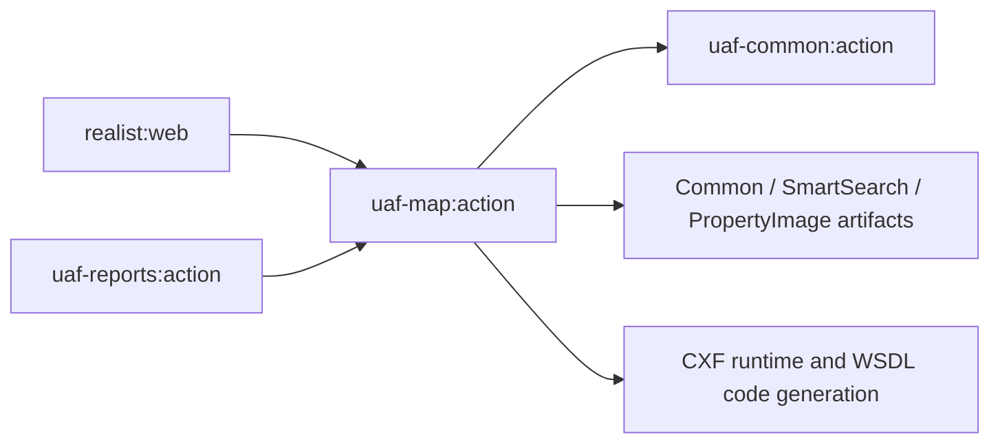
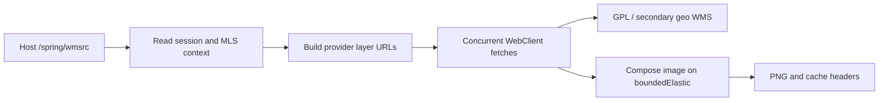

# uaf-map: map lookup and imagery adapters

[Backend index](../index.md) · [Project context](../../project-context.md)

Source baseline: **a6f611ae0 (RP-10188)**, investigated 2026-09-25. This chapter describes source and declared build wiring, not a verified deployment or resolved dependency graph.

## Purpose and runtime position

**Confirmed:** `uaf-map:action` is a Java library incorporated into the Realist web application, not an independently deployed map microservice. It supplies map property identification, parcel dimensions, thematic legends, WMS layer composition, and report imagery adapters. Gradle includes the action project, names its JAR `uaf-map-action`, and declares consumers in both `realist:web` and `uaf-reports:action`. Source evidence: `settings.gradle:26-29`; `uaf-map/action/build.gradle:1-5,25`; `realist/web/build.gradle:102`; `uaf-reports/action/build.gradle:22`. Concrete runtime methods and callers are detailed below.

The host `MapController` calls `MapAction` directly for `/api/property-information`, `/api/get-lot-dimensions`, and `/api/map-legend`; these calls do not pass through `ServiceHandler`. The controller also has spatial-tile operations handled by the **host's** `SpatialApiService`, and its MLS photo service is imported from **reports**, not the similarly named map class. Do not assign everything called “map” to this library. Evidence: `realist/web/src/main/java/com/facl/uaf/realist/rest/controller/MapController.java:11-25,65-90,98-104,170-173,176-224`.

## Build and provider boundary

The action project directly depends on `uaf-common:action`. Its build generates five CXF/JAX-WS client families from checked-in WSDLs: Locator v27, Map v21, Geocoder v17, Imagery v7, and VE Imager v11. Generated sources are added to compilation and code generation is a `compileJava` dependency. Generated build output is not evidence of successful execution. Evidence: `uaf-map/action/build.gradle:25,62-206`.

`GpLocatorConfiguration` constructs the five proxy beans from `gpl.server.url` plus the corresponding `locator.ws.path`, `map.ws.path`, `geocoder.ws.path`, `imagery.ws.path`, or `veimager.ws.path`. This is the external GPL boundary: provider storage, availability, and deployment internals are not implemented here. No configuration values are reproduced. Evidence: `uaf-map/action/src/main/java/com/facl/uaf/map/configuration/GpLocatorConfiguration.java:18-79`.

The root applies Java and dependency management to subprojects, sets Java compatibility to 21, and places JARs in each project's `build` directory. The host's `Application` scans `com.facl.uaf`, discovering map services, configuration, and the WMS controller. **Confirmed source wiring**, not proof of a running environment. Evidence: `build.gradle:49-59,88-101`; `realist/web/src/main/java/com/facl/uaf/realist/Application.java:11-31`.

Arrows above mean **declared Gradle dependencies**, not network calls. Evidence: `realist/web/build.gradle:102`; `uaf-reports/action/build.gradle:22`; `uaf-map/action/build.gradle:17-59`.

### Declared external dependencies

These are declarations, **not resolved versions**. `${common}`, `${propertyimage_ifc}`, `${smartsearch_ifc}`, and `${cxfVersion}` remain property references here; property files and private configuration were not inspected.

| Declaration in the action build | Role / exclusions |
| --- | --- |
| `com.corelogic.service.common:common:${common}` | Provider shared contracts; excludes `slf4j-api`. Distinct from the local `uaf-common` module. |
| `com.corelogic.service.propertyimage:propertyimage-ifc:${propertyimage_ifc}` | Photo contracts used by the map servlet source; excludes provider common, propertysearch IFC, Gson. |
| `com.corelogic.service.smartsearch:smartsearch-ifc:${smartsearch_ifc}` | `SmartSearchBD` and search DTOs; excludes startup, provider common, retrends IFC, Flex messaging, CLP CLIP lookup starter. |
| CXF `cxf-tools-wsdlto-core`, `cxf-tools-wsdlto-frontend-jaxws`, `cxf-tools-wsdlto-databinding-jaxb`, `cxf-tools-common`, all `${cxfVersion}` | Dedicated `cxfCodegen` configuration. |
| CXF `cxf-rt-frontend-jaxws`, `cxf-rt-transports-http`, both `${cxfVersion}` | SOAP client runtime. |
| `wsdl4j:wsdl4j:1.6.3`; `jakarta.annotation:jakarta.annotation-api:1.3.5`; `jakarta.xml.bind:jakarta.xml.bind-api:4.0.2` | XML/API declarations; build explicitly requires Jakarta JAXB namespace compatibility with generated clients. |
| `ezmorph:ezmorph:1.0.4`; `org.owasp.encoder:encoder:1.2.3`; `org.apache.httpcomponents:httpclient:4.5.14` | Remaining utility/client declarations; WMS's current implementation uses WebClient, not this Apache client. |
| `org.projectlombok:lombok-mapstruct-binding:0.2.0`; `junit:junit:4.13.2` | Annotation processor and test dependency respectively. |

Evidence: `uaf-map/action/build.gradle:13-59`. Shared root declarations additionally supply Spring Web/WebFlux, security, validation, Redis/session support, Lombok, and Spring test infrastructure; their presence does **not** establish that this module owns a database or session store. Root dependency management/exclusions can override transitive artifacts. Evidence: `build.gradle:53-85,130-178,180-242`.

## Concepts, source map, and real callers

- **GPL** is the external mapping boundary represented here by generated SOAP interfaces and HTTP WMS endpoints.
- **APN / `taxId`** identifies the assessor parcel used for SmartSearch enrichment. **FIPS / `countyId`** scopes the county; locator state and county codes are concatenated.
- **WMS** returns map image layers; this module can combine them into a PNG. A **style** selects provider rendering behavior; it is not just a browser CSS style.
- **Geometry** here is provider text converted into nested lists of coordinate strings, not a GeoJSON contract.

Evidence: `uaf-map/action/src/main/java/com/facl/uaf/map/action/MapAction.java:180-255,805-831,1151-1167,1217-1239`; `uaf-map/action/src/main/java/com/facl/uaf/map/action/WMSRelayController.java:384-465,1026-1080`.

| Package / symbol | Responsibility and confirmed caller |
| --- | --- |
| `com.facl.uaf.map.action.MapAction` (`@Service`, extends common `BaseAction`) | Host `MapController` property lookup, dimensions, legend, parcel disclaimer; `ReportController` thematic/flood popup data; `ServiceHandler` region geocoding. |
| `action.delegate.PropertySearchDelegate` (`mapPropertySearchDelegate`) | Qualified dependency of `MapAction`; calls external `SmartSearchBD.searchProperty`. This is not `uaf-propertysearch:action`. |
| `action.MapImage` (`@Service`) | Raw report-map bytes for `ReportAction` and `report.imagefetcher.ImageGrabber`; imagery and VE Imager adapters. |
| `action.WMSRelayController` (`@Controller`) | Owns `/spring/wmsrc` directly inside the host; no intervening `ServiceHandler`. |
| `configuration.GpLocatorConfiguration` | Five generated SOAP proxy beans. |
| `model.*` | Nine local DTOs: `MapPropertyInfo`, `LatLong`, `LotDimension`, `RegionValue`, `RangeInfo`, `TrendsInfo`, `FloodZoneInfo`, `OnboardNeighborHoodInfo`, `DisclaimerInfo`. |
| `action.PhotoService`, `action.SLDParser`, `exception.MapException` | Source-present helpers with no current host use established; see limited-reachability section below. |

Entry-point evidence:

| Host entry / caller | Module method and contract |
| --- | --- |
| GET `/api/property-information` | `getPropertyInfo(latitude, longitude, displayFields)` → `MapPropertyInfo`; host supplies default field codes first. |
| POST `/api/get-lot-dimensions` | `getLotDimensions(latLong, countyId, parcelId, parcelSeq, simplifyLogicSet)` → list or `null`. |
| POST `/api/map-legend` | `fetchLegendData(RegionValue)` → `List<RangeInfo>`. |
| `/api/map/get-parcel-map-disclaimer` (no HTTP-method restriction in annotation) | Latitude/longitude query parameters → `fetchMapParcelDisclaimer` → heading/content list. |
| POST `/api/reports/market-trends-popup`, `/api/reports/flood-map-info-popup` | `ReportController.getRegionValue` → `fetchMapCtrlClickValues`; controller shapes report popup output. |
| `ServiceHandler.getRegionGeocodes(String[])` | `MapAction.getRegionGeocodes` → comma-separated bounds; host wraps caching. |
| `ReportAction.getPropertyMapImage`, `getLotDimensionsMapImage`; `ImageGrabber` equivalents | `MapImage` returns bytes; `ReportAction` converts valid bytes into `[width, height, base64Image]`. |

Evidence: `realist/web/src/main/java/com/facl/uaf/realist/rest/controller/MapController.java:83-104,170-174,251-257`; `realist/web/src/main/java/com/facl/uaf/realist/rest/controller/ReportController.java:504-558,566-568`; `realist/web/src/main/java/com/facl/uaf/realist/action/ServiceHandler.java:554-586`; `uaf-reports/action/src/main/java/com/facl/uaf/report/action/ReportAction.java:1501-1597`; `uaf-reports/action/src/main/java/com/facl/uaf/report/imagefetcher/ImageGrabber.java:124-219`.

## Contracts and local transformations

### Property lookup: locate first, enrich second

1. Parse latitude/longitude strings into a Locator `Point`, wrap a `SpatialFilter` with ID `parcel-boundary`, and call `locateGeom`.
2. Empty results return a DTO containing the supplied coordinates. Multiple results set `hasMultipleProperties` and `multiplePropertyAPN`, but the first property's address, owner, identifiers, and first geometry supply the primary detail.
3. Build a one-record SmartSearch request using county and `APN IS taxId`. The supplied display-field list is **mutated**: add `MLS_STATUS`, default photo/listing/owner fields, and conditional MLS bedroom/bathroom fields.
4. The delegate applies the session MLS group and `KEYSTONE_MLS`, invokes `searchProperty`, normalizes a zero-result summary to an empty list, and applies common HICMLS status and active-listing sell-score corrections.
5. Copy the first summary into the DTO: bedroom/bathroom counts, sale/listing data, photo metadata, owner names, foreclosure and premium fields. SmartSearch can overwrite locator parcel/county identifiers and sale price.

Evidence: `uaf-map/action/src/main/java/com/facl/uaf/map/action/MapAction.java:130-170,180-266,805-832,941-1029,1098-1167`; `uaf-map/action/src/main/java/com/facl/uaf/map/action/delegate/PropertySearchDelegate.java:47-89`.

`MapPropertyInfo` is a broad, string-heavy DTO, not a persistence entity. Preserve existing spellings such as `parcelGoemetry`; changing them can change serialization compatibility. `formatGoemetry` recognizes the literal `MULTIPOLYGON(((` wrapper and splits text into nested lists without parsing coordinates numerically or performing spatial validation. It is **not a general WKT parser**. Evidence: `uaf-map/action/src/main/java/com/facl/uaf/map/model/MapPropertyInfo.java:13-85`; `uaf-map/action/src/main/java/com/facl/uaf/map/action/MapAction.java:1217-1239`.

### Dimensions, legends, popup values, and geocoding

| Operation | Transformation / boundary |
| --- | --- |
| `getLotDimensions` | Blank parcel ID or sequence returns `null`; sequence is left-padded to three characters. Parses `simplifyLogicSet` as integer. Calls Locator; sums line lengths. For mode `"2"`, more than seven segments and perimeter over 700 trigger another call with mode `"1"`. Maps start/end/center geocodes and line length into `LotDimension`; units are not established locally. |
| `fetchLegendData` | Copies `RegionValue.minX/minY/maxX/maxY` into `Geoextent`. Styles containing `"mls"` case-insensitively choose MLS subset metadata with the current user's MLS group; others choose ordinary subset metadata. Maps text/description/color into `RangeInfo`. |
| `fetchMapCtrlClickValues` | Mutates and returns `RegionValue`; flags independently enable trends, flood, neighborhood calls. Trends style containing `param_mls_trend` selects MLS-specific metadata; both trends paths request geometry. Flood maps zone/panel/community/date fields. Neighborhood filters provider results to the requested level. |
| `fetchMapParcelDisclaimer` | Uses center `[latitude, longitude]`, scale 8000, 600×800 format, `en-US`; maps provider heading/content pairs. |
| `getFaultLineDesclaimer` | Source-present Map SOAP adapter: scale 145000, 740×460, `en-US`; returns the last citation content or `null`. No real host caller found in reviewed source. |
| `getRegionGeocodes` | Converts address strings into `Place` requests, inserting `" County,"`; empty results trigger county-name and city/county fallback retries. Retry logic mutates the supplied array. Envelope parsing uses corners 0 and 2 of `POLYGON((...))`; outputs `minLatitude,minLongitude,maxLatitude,maxLongitude`, despite internal X/Y names. Empty input array returns `""`. |

Evidence: `uaf-map/action/src/main/java/com/facl/uaf/map/action/MapAction.java:278-420,429-629,649-795,843-931,1249-1282,1314-1365`; DTO request/response fields: `uaf-map/action/src/main/java/com/facl/uaf/map/model/RegionValue.java:15-28`; `uaf-map/action/src/main/java/com/facl/uaf/map/model/LotDimension.java:5-8`; `uaf-map/action/src/main/java/com/facl/uaf/map/model/LatLong.java:5-6`.

### Report imagery

`MapImage.getMapImage(width, height, parcelStyle, zoomLevel, mapStyle, imageType, geoCodes)` selects Imagery only when `mapimage.service` equals `"imagery"`; all other values select VE Imager. Each `geoCodes` element is `[latitude, longitude]`. The first point sets the center and subject pushpin; later points get provider-specific comparable icons. `h/a/r` map to Hybrid/Aerial/Road; unrecognized styles become Road. Imagery defaults to **no parcel layer** when parcel style is blank, whereas VE defaults to a parcel layer.

`getImageryLotDimensionsMapImage` always uses Imagery, regardless of the ordinary image selector. It supplies parcel identifiers and dimension drawing settings. `mapimage.lot.dimension.overlay.enabled` controls adding the parcel layer; no zoom is set, and `showPushpins` is `"false"` even when a pushpin list was constructed. These methods return raw image bytes or `null`; Base64 encoding belongs to report callers. Per-request dimensions/styles remain method locals rather than shared mutable bean fields.

Evidence: `uaf-map/action/src/main/java/com/facl/uaf/map/action/MapImage.java:31-115,128-247,261-377,394-596`; `uaf-reports/action/src/main/java/com/facl/uaf/report/action/ReportAction.java:1526-1549,1572-1596`.

## WMS relay: runtime behavior inside the host

This diagram shows **runtime processing**, not Gradle dependencies. Session access and parameter reading occur before asynchronous work. URL fetches preserve array positions for composition; composition runs off the Reactor event loop. Source evidence: `uaf-map/action/src/main/java/com/facl/uaf/map/action/WMSRelayController.java:219-236,289-364,384-465,984-1080`.

- **Input:** `BBOX` (fallback `bbox`), `STYLES` (fallback `GplStyleName`), `LAYERS`, `LAYERTYPE`, distressed-duration parameters `PF/AU/BO/REO/SS`, and `filterList`. MLS group and optional alias come from the session, not request-supplied MLS identity.
- **Routing:** default layers use `gpl.server.url` plus `wms.service.path`; selected zoning, school, neighborhood, board-specific, fault-line, groundwater, USDA, and land-use layers use `geo.server2.url` plus `geo2.service.path`. `wms.request.params` contributes the shared request suffix.
- **Special transformations:** sold/expired styles become parameterized MLS status/time-frame calls; different sold and expired periods require separate URLs. Active and pending may combine. MLS area prefers an alias MLS ID. Distressed durations create dynamic styles. Median MLS sale price expects an adjacent boundary layer/style pair. Premium styles use `filterList` in the alternate branch, removing the source marker and EPSG:3857 parameter.
- **Network lifetime:** one Reactor Netty connection pool per bean, disposed on destruction. `httpclient.maxTotalConnections` becomes `maxConnections`; despite its old name, `httpclient.maxConnectionsPerHost` becomes the pending-acquire count. Redirect following is disabled. `gplTileLayerTimeout` bounds fetches; the servlet `DeferredResult` allows an extra five seconds.
- **Response:** 2xx upstream status plus exact `image/png` or `application/octet-stream` content type is accepted. Composition requires compatible dimensions; boundary/median cases use `DST_ATOP`, others `SRC_OVER`. Success writes `image/png`.

Evidence: `uaf-map/action/src/main/java/com/facl/uaf/map/action/WMSRelayController.java:79-107,135-162,295-336,439-465,490-943,946-974,984-1080`.

**Important failure distinction:** logs mention 401/502/503, but the relevant handlers resolve `DeferredResult` to `null` without setting those response status codes. Do not document these logs as guaranteed HTTP error responses. Individual fetch failures are intended to leave a blank slot; however, current `composeTiles` does not skip null slots, and `readImageFromBytes` constructs a stream from the slot directly. Thus a missing/invalid layer can fail the composite rather than preserve good layers. A single failed layer can also produce a null mapping result. These are source-level caveats, not verified production incidents.

Evidence: `uaf-map/action/src/main/java/com/facl/uaf/map/action/WMSRelayController.java:186-194,224-232,252-277,337-362,400-425,1033-1072`.

## Provider, state, and ownership boundaries

| Concern | Owner and module behavior |
| --- | --- |
| Property/geometry/legend/image data | External GPL responses. Local code adapts DTOs and pixels; it does not maintain authoritative parcel or imagery storage. |
| SmartSearch enrichment | Common configuration constructs `SmartSearchBD` using `RestClientFactory` and key `service.tier.smart.search`. The map delegate calls its interface; downstream service internals and persistence remain external. |
| Identity / MLS scope | `MapAction` reads inherited `BaseAction.getPassportUserInfo`; WMS reads `SessionStateUtil` and entitlement/alias data. The module consumes session state, not login/session lifecycle ownership. |
| Region-bounds cache | Host `ServiceHandler` checks `geoCodeUseCache`, uses `CACHEKEY_REGIONBOUNDS` for at most one county, and inserts only nonempty results through common `StartupStorage`. That storage uses Redis and its own TTL configuration. The geocoder action itself does not cache. |
| WMS caching | HTTP response headers, not a local tile cache: default `tileCacheExpires` is 86400 seconds, with `PUBLIC, max-age=..., must-revalidate`. `Expires` uses `Calendar.roll(SECOND, seconds)`, so it must not be assumed to equal now plus max-age. Shared-cache isolation of session-dependent tiles needs deployment confirmation. |
| Reports | Map returns bytes. Reports owns encoding and subsequent rendering/image handling; this chapter does not assign report cache/session ownership to map. |
| Database / migrations | No map entity, repository, or migration ownership was found in the inspected action source. Host entity/repository scans name host and report packages, not map. |

Evidence: `uaf-map/action/src/main/java/com/facl/uaf/map/configuration/GpLocatorConfiguration.java:31-79`; `uaf-common/action/src/main/java/com/facl/uaf/common/shared/configuration/SmartSearchConfiguration.java:12-17`; `uaf-common/action/src/main/java/com/facl/uaf/common/shared/action/BaseAction.java:63-83`; `realist/web/src/main/java/com/facl/uaf/realist/action/ServiceHandler.java:554-586`; `uaf-common/action/src/main/java/com/facl/uaf/common/shared/util/StartupStorage.java:24-63`; `uaf-map/action/src/main/java/com/facl/uaf/map/action/WMSRelayController.java:95,295-307,984-1007`; `realist/web/src/main/java/com/facl/uaf/realist/Application.java:14-21`.

## Constraints, errors, and debugging/change points

| Symptom / intended change | Start here; important existing behavior |
| --- | --- |
| Wrong property or sparse popup | `MapAction.getLocationInfo`, `getSmartSearchInputData`, `addToMapPropertyInfo`; compare first locator result against first search result and the requested fields. Locator failures become common `PropertySearchException`; delegate wraps search failures. Host `PreferencesExceptionHandler` maps that exception to HTTP 400 with an error body. |
| Expired-session property lookup | The attempted `userInfo != null` guard occurs **after** `getSmartSearchInputData` dereferences user/MLS data. Do not assume the action gracefully returns partial data for an expired session. |
| Missing geometry / wrong initial bounds | `formatGoemetry` requires its exact multipolygon text shape; geocoder bounds assume rectangular polygon corner positions. Blank geometry yields an empty list; malformed nonblank text can throw. Check coordinate order before changing either adapter. |
| Missing dimensions | Blank identifiers return `null`; `simplifyLogicSet` parsing occurs outside the provider-call catch. Remote exceptions are logged and may yield `null`; invalid input is not uniformly normalized. The retry threshold uses provider line lengths without local unit conversion. |
| Empty legend / unchanged popup | Most Map SOAP metadata methods catch and log provider/other exceptions and return an empty list or the existing `RegionValue`. Empty data is not proof that the provider had no results. Flags can request several calls; null `RegionValue` is not guarded at entry. |
| Incorrect report image sizing | All three image paths assign `width = MAP_HEIGHT` when `height == -1`, leaving height unchanged. This is actual source behavior, not a valid default-height guarantee. |
| Missing report image | Image methods usually return `null` on provider/parse errors; lot imagery suppresses an error log for messages containing “No lot dimensions found”. Confirm which provider `mapimage.service` selected before changing image rendering. |
| Missing / opaque tiles | Trace `buildTileUrls`, `fetchTile`, `composeTiles`, and deferred completion. Layer/style index alignment matters; missing styles, invalid images, mismatched sizes, and null slots can abort processing. Some failures finish with an empty response rather than an error status. |
| Adding a provider layer | Update routing/style transformation and relevant board/school lists, then examine combination ordering and alpha composition; adding a style name alone may route it to the wrong server. |

Evidence: `uaf-map/action/src/main/java/com/facl/uaf/map/action/MapAction.java:130-168,257-266,278-330,571-586,782-795,805-831,856-918,1217-1239`; `uaf-map/action/src/main/java/com/facl/uaf/map/action/delegate/PropertySearchDelegate.java:77-89`; `realist/web/src/main/java/com/facl/uaf/realist/exception/handler/PreferencesExceptionHandler.java:12-16`; `uaf-map/action/src/main/java/com/facl/uaf/map/action/MapImage.java:138-144,269-274,405-410,574-579`; `uaf-map/action/src/main/java/com/facl/uaf/map/action/WMSRelayController.java:490-943,1026-1080`.

Use sanitized inputs when debugging: existing debug/trace paths serialize provider requests, responses, and sometimes user context. HTML encoding or CR/LF stripping is **not redaction**. Evidence: `uaf-map/action/src/main/java/com/facl/uaf/map/action/delegate/PropertySearchDelegate.java:90-101`; `uaf-map/action/src/main/java/com/facl/uaf/map/action/MapAction.java:198-211,704-713`; `uaf-map/action/src/main/java/com/facl/uaf/map/action/WMSRelayController.java:932-940`.

### Source-present helpers with limited established reachability

- `action.PhotoService` extends `HttpServlet` and implements GET/POST thumbnail retrieval through common `ApigeeService.getMlsPhotosByData`; missing images fall back to a same-host placeholder fetch. It has no controller/servlet annotation in the class. No registration/import for this map servlet was found in the inspected host Java/XML. **Inferred legacy/unwired in this host**, not proven unreachable in every deployment. The active host MLS-photo endpoint imports `com.facl.uaf.report.imagefetcher.PhotoService` instead.
- `SLDParser.getSLDForMLS` merges `NamedLayer` DOM nodes, inserts an MLS group literal into matching equality filters, and serializes XML; `getDOMFromXML` returns null on caught parse errors. No caller was found in reviewed map/host/report Java. This is source presence, not evidence that WMS currently uses SLD XML parsing.
- `com.facl.uaf.map.exception.MapException` extends common `BaseException` but is not the exception used by the reviewed active adapters. The similarly named zoning exception imported by reports is from `com.fares.propertyimage.ifc.exceptions`.

Evidence: `uaf-map/action/src/main/java/com/facl/uaf/map/action/PhotoService.java:34-56,97-186,189-239`; `realist/web/src/main/java/com/facl/uaf/realist/rest/controller/MapController.java:25,107-153`; `uaf-map/action/src/main/java/com/facl/uaf/map/action/SLDParser.java:29-151`; `uaf-map/action/src/main/java/com/facl/uaf/map/exception/MapException.java:16-29`; `realist/web/src/main/java/com/facl/uaf/realist/rest/controller/ReportController.java:75,469`.

## Precise unknowns and verification limits

1. **Unknown: runtime reachability, production latency, provider data coverage, effective endpoints/timeouts, and resolved versions.** Only declarations/consumers were read; no application, Gradle, test, network, or deployment execution was performed. SOAP factory code has no explicit per-operation timeout/retry policy; do not infer WMS's timeout applies to SOAP. Evidence: `uaf-map/action/src/main/java/com/facl/uaf/map/configuration/GpLocatorConfiguration.java:31-79`; `uaf-map/action/build.gradle:10,17-59`.
2. **Unknown: provider guarantees** for line-length units, precise geometry formatting, null response shapes, downstream authorization, and backing databases. Current adapters depend on those contracts but do not define provider internals. Evidence: `uaf-map/action/src/main/java/com/facl/uaf/map/action/MapAction.java:843-918,1217-1239`; `uaf-map/action/src/main/java/com/facl/uaf/map/action/delegate/PropertySearchDelegate.java:47-68`.
3. **Unknown: deployment-level authentication and cache isolation for WMS.** Local session checks and public cache headers are visible; this focused review did not audit the host security chain or reverse proxy. Evidence: `uaf-map/action/src/main/java/com/facl/uaf/map/action/WMSRelayController.java:295-310,1000-1007`.
4. **Unknown: external/manual users of source-present helper APIs.** The limited caller search above is not proof of global non-use. Evidence anchors: `uaf-map/action/src/main/java/com/facl/uaf/map/action/PhotoService.java:36`; `uaf-map/action/src/main/java/com/facl/uaf/map/action/SLDParser.java:29`; `uaf-map/action/src/main/java/com/facl/uaf/map/action/MapAction.java:1249`.

Existing investigation entry points, **not executed**: `uaf-map/action/src/test/java/com/facl/uaf/map/action/MapActionCharacterizationTest.java`, `MapActionGeocoderCharacterizationTest.java`, `MapActionMapServiceCharacterizationTest.java`, `MapImageCharacterizationTest.java`, and `WMSRelayControllerTest.java` in that same directory. Their existence is not a claim that current behavior or the caveats above have passing coverage.

## Key source links

- [Module build](https://github.com/corelogic-private/real_estate_us-realist-phoenix/blob/a6f611ae0654e2bf62deec0a7d5c1d333348d6be/uaf-map/action/build.gradle)
- [MapAction](https://github.com/corelogic-private/real_estate_us-realist-phoenix/blob/a6f611ae0654e2bf62deec0a7d5c1d333348d6be/uaf-map/action/src/main/java/com/facl/uaf/map/action/MapAction.java)
- [MapImage](https://github.com/corelogic-private/real_estate_us-realist-phoenix/blob/a6f611ae0654e2bf62deec0a7d5c1d333348d6be/uaf-map/action/src/main/java/com/facl/uaf/map/action/MapImage.java)
- [WMSRelayController](https://github.com/corelogic-private/real_estate_us-realist-phoenix/blob/a6f611ae0654e2bf62deec0a7d5c1d333348d6be/uaf-map/action/src/main/java/com/facl/uaf/map/action/WMSRelayController.java)
- [Provider configuration](https://github.com/corelogic-private/real_estate_us-realist-phoenix/blob/a6f611ae0654e2bf62deec0a7d5c1d333348d6be/uaf-map/action/src/main/java/com/facl/uaf/map/configuration/GpLocatorConfiguration.java)
- [Host MapController](https://github.com/corelogic-private/real_estate_us-realist-phoenix/blob/a6f611ae0654e2bf62deec0a7d5c1d333348d6be/realist/web/src/main/java/com/facl/uaf/realist/rest/controller/MapController.java)

## Related documentation

- [Maps and property lookup](../../feature-flows/maps-and-property-lookup.md)
- [Property search flow](../../feature-flows/property-search.md)
- [Frontend search](../../frontend/search/index.md)
- [Reports module](uaf-reports.md)
- [Common module](uaf-common.md)

Documentation-link check at writing time: `../index.md` and `uaf-common.md` were not yet present; the other linked files existed. These intended navigation targets are retained for the parallel documentation work. Citation paths and line ranges were checked read-only; this does not constitute build, test, provider, or deployment verification.
