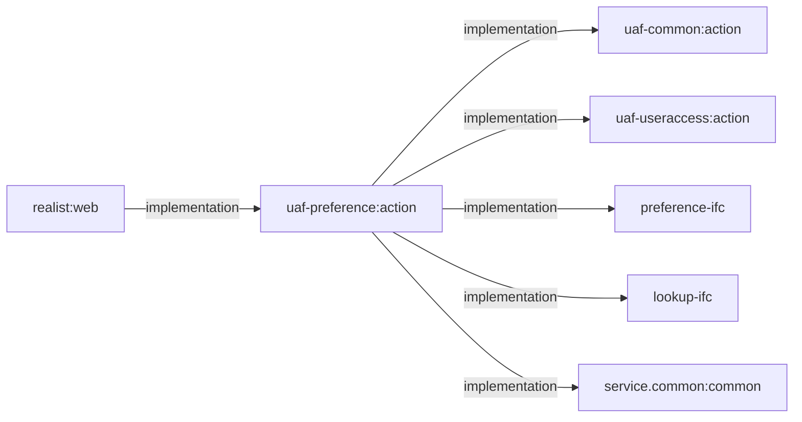

# `uaf-preference:action`

[Backend index](../index.md) · [Project context](../../project-context.md) · [Common module](uaf-common.md) · [User-access module](uaf-useraccess.md)

## Scope and mental model

Source baseline: **`a6f611ae0`, branch `RP-10188`**. Source citations below link to repository-relative files and revision-specific line ranges; this is a source-reading guide, not a claim of runtime verification.

This module adapts Realist's user context into preference-service requests. Think of two distinct objects: **preference groups** contain preference elements/values, while **templates** contain data elements and operator values. `PreferenceAction` prepares/extracts these objects; `PreferenceDelegate` calls the external preference/lookup IFC delegates. Neither class is the host REST controller. Evidence: [PreferenceDelegate.java:3–48](https://github.com/corelogic-private/real_estate_us-realist-phoenix/blob/a6f611ae0654e2bf62deec0a7d5c1d333348d6be/uaf-preference/action/src/main/java/com/facl/uaf/preference/action/delegate/PreferenceDelegate.java#L3-L48), [PreferenceAction.java:60–84](https://github.com/corelogic-private/real_estate_us-realist-phoenix/blob/a6f611ae0654e2bf62deec0a7d5c1d333348d6be/uaf-preference/action/src/main/java/com/facl/uaf/preference/action/PreferenceAction.java#L60-L84), [PreferenceAction.java:627–703](https://github.com/corelogic-private/real_estate_us-realist-phoenix/blob/a6f611ae0654e2bf62deec0a7d5c1d333348d6be/uaf-preference/action/src/main/java/com/facl/uaf/preference/action/PreferenceAction.java#L627-L703).

Use this page for module behavior and its immediate callers. Follow the owning pages for [saved searches and favorites](../../feature-flows/saved-searches-and-favorites.md), [Redis caching and sessions](../../cross-cutting/redis-caching-and-sessions.md), [external integrations](../../cross-cutting/external-integrations.md), [dashboard personalization](../../frontend/dashboard/configuration-and-personalization.md), and [frontend search](../../frontend/search/index.md), particularly [dynamic fields and lookups](../../frontend/search/dynamic-fields-and-lookups.md). Those pages own end-to-end journeys, infrastructure, and UI behavior; this page is not the host architecture or API catalogue.

## Build inclusion, source, and dependency boundaries

`settings.gradle` includes `uaf-preference:action`; its build names the JAR `uaf-preference-action`, declares group `com.facl.uaf.preference`, and declares `baseVersion = "1.20.1"`. The root applies Java/dependency management to subprojects, sets Java source compatibility to 21, and sets JAR output to each project's `build` directory. The declared base version alone is **not** evidence of the resolved artifact version: root version assignment also considers project properties. [settings.gradle:21–30](https://github.com/corelogic-private/real_estate_us-realist-phoenix/blob/a6f611ae0654e2bf62deec0a7d5c1d333348d6be/settings.gradle#L21-L30), [module build.gradle:1–10](https://github.com/corelogic-private/real_estate_us-realist-phoenix/blob/a6f611ae0654e2bf62deec0a7d5c1d333348d6be/uaf-preference/action/build.gradle#L1-L10), [root build.gradle:49–58](https://github.com/corelogic-private/real_estate_us-realist-phoenix/blob/a6f611ae0654e2bf62deec0a7d5c1d333348d6be/build.gradle#L49-L58), [root build.gradle:88–101](https://github.com/corelogic-private/real_estate_us-realist-phoenix/blob/a6f611ae0654e2bf62deec0a7d5c1d333348d6be/build.gradle#L88-L101).

This is source-bearing, not an empty included module: its action and delegate are Spring `@Service` classes, and it contains utility/model Java sources and a Spring XML resource. The host declares an implementation dependency on it. [PreferenceAction.java:60–84](https://github.com/corelogic-private/real_estate_us-realist-phoenix/blob/a6f611ae0654e2bf62deec0a7d5c1d333348d6be/uaf-preference/action/src/main/java/com/facl/uaf/preference/action/PreferenceAction.java#L60-L84), [PreferenceDelegate.java:47–71](https://github.com/corelogic-private/real_estate_us-realist-phoenix/blob/a6f611ae0654e2bf62deec0a7d5c1d333348d6be/uaf-preference/action/src/main/java/com/facl/uaf/preference/action/delegate/PreferenceDelegate.java#L47-L71), [PreferenceGroupUtil.java:16–46](https://github.com/corelogic-private/real_estate_us-realist-phoenix/blob/a6f611ae0654e2bf62deec0a7d5c1d333348d6be/uaf-preference/action/src/main/java/com/facl/uaf/preference/util/PreferenceGroupUtil.java#L16-L46), [PreferenceActions.xml:13–27](https://github.com/corelogic-private/real_estate_us-realist-phoenix/blob/a6f611ae0654e2bf62deec0a7d5c1d333348d6be/uaf-preference/action/src/main/resources/com/facl/uaf/preference/PreferenceActions.xml#L13-L27), [host build.gradle:93–103](https://github.com/corelogic-private/real_estate_us-realist-phoenix/blob/a6f611ae0654e2bf62deec0a7d5c1d333348d6be/realist/web/build.gradle#L93-L103).

### Verified Gradle edges — not runtime calls



All edges above are declarations, not a resolved/transitive dependency graph: [host build.gradle:97–103](https://github.com/corelogic-private/real_estate_us-realist-phoenix/blob/a6f611ae0654e2bf62deec0a7d5c1d333348d6be/realist/web/build.gradle#L97-L103), [module build.gradle:16–27](https://github.com/corelogic-private/real_estate_us-realist-phoenix/blob/a6f611ae0654e2bf62deec0a7d5c1d333348d6be/uaf-preference/action/build.gradle#L16-L27). The common edge supplies types such as `BaseAction`, cache/session helpers, and `PreferencesException`; the user-access edge has a concrete source use in `PreferenceGroupUtil.getPreferenceGroupForUser(UserAccessOutput, ...)`. [PreferenceAction.java:3–14](https://github.com/corelogic-private/real_estate_us-realist-phoenix/blob/a6f611ae0654e2bf62deec0a7d5c1d333348d6be/uaf-preference/action/src/main/java/com/facl/uaf/preference/action/PreferenceAction.java#L3-L14), [PreferenceGroupUtil.java:18–30](https://github.com/corelogic-private/real_estate_us-realist-phoenix/blob/a6f611ae0654e2bf62deec0a7d5c1d333348d6be/uaf-preference/action/src/main/java/com/facl/uaf/preference/util/PreferenceGroupUtil.java#L18-L30), [PreferenceGroupUtil.java:182–213](https://github.com/corelogic-private/real_estate_us-realist-phoenix/blob/a6f611ae0654e2bf62deec0a7d5c1d333348d6be/uaf-preference/action/src/main/java/com/facl/uaf/preference/util/PreferenceGroupUtil.java#L182-L213).

| Direct module artifact declaration | What to retain when reading/upgrading |
| --- | --- |
| `com.corelogic.service.preference:preference-ifc:${preference_ifc}` | Excludes service `common` and `slf4j-api`; the delegate imports `com.fares.preference.ifc` contracts. |
| `com.corelogic.service.lookup:lookup-ifc:${lookup_ifc}` | Excludes service `common`; supplies the imported lookup contracts. |
| `com.corelogic.service.common:common:${common}` | Explicit common artifact; excludes `slf4j-api`. |
| `jakarta.annotation:jakarta.annotation-api:1.3.5`; `jakarta.xml.bind:jakarta.xml.bind-api:2.3.3`; `jaxrpc:jaxrpc:1.1`; `wsdl4j:wsdl4j:1.6.3` | Declared compatibility APIs, not proof that this module implements a transport or SOAP endpoint. |
| `org.owasp.encoder:encoder:1.2.3`; `org.json:json:20250517`; `org.apache.commons:commons-collections4:4.4`; `org.apache.commons:commons-lang3:3.20.0` | Explicit module implementations. |
| `org.projectlombok:lombok-mapstruct-binding:0.2.0`; `junit:junit:4.13.2` | Annotation processor and test dependency respectively, not production service calls. |

Evidence for the entire declaration table: [module build.gradle:13–37](https://github.com/corelogic-private/real_estate_us-realist-phoenix/blob/a6f611ae0654e2bf62deec0a7d5c1d333348d6be/uaf-preference/action/build.gradle#L13-L37); IFC imports: [PreferenceDelegate.java:6–23](https://github.com/corelogic-private/real_estate_us-realist-phoenix/blob/a6f611ae0654e2bf62deec0a7d5c1d333348d6be/uaf-preference/action/src/main/java/com/facl/uaf/preference/action/delegate/PreferenceDelegate.java#L6-L23). Root `subprojects` also adds shared dependencies, including web, Redis, validation, security, session, and test support; do not mistake the module file for its complete classpath. [root build.gradle:180–237](https://github.com/corelogic-private/real_estate_us-realist-phoenix/blob/a6f611ae0654e2bf62deec0a7d5c1d333348d6be/build.gradle#L180-L237). IFC version variables are deliberately left symbolic here; no sensitive configuration or resolved artifacts were inspected.

## Package and class reading map

| Package/class | Responsibility and useful entry points |
| --- | --- |
| `com.facl.uaf.preference.action.PreferenceAction` | Context-aware facade: template reads/writes, preference reads/writes/reset, lookup data, searchable fields, access-map reads, cache insertion/eviction. Its collaborators are injected through the constructor. [60–84](https://github.com/corelogic-private/real_estate_us-realist-phoenix/blob/a6f611ae0654e2bf62deec0a7d5c1d333348d6be/uaf-preference/action/src/main/java/com/facl/uaf/preference/action/PreferenceAction.java#L60-L84), [151–204](https://github.com/corelogic-private/real_estate_us-realist-phoenix/blob/a6f611ae0654e2bf62deec0a7d5c1d333348d6be/uaf-preference/action/src/main/java/com/facl/uaf/preference/action/PreferenceAction.java#L151-L204), [665–747](https://github.com/corelogic-private/real_estate_us-realist-phoenix/blob/a6f611ae0654e2bf62deec0a7d5c1d333348d6be/uaf-preference/action/src/main/java/com/facl/uaf/preference/action/PreferenceAction.java#L665-L747), [931–1039](https://github.com/corelogic-private/real_estate_us-realist-phoenix/blob/a6f611ae0654e2bf62deec0a7d5c1d333348d6be/uaf-preference/action/src/main/java/com/facl/uaf/preference/action/PreferenceAction.java#L931-L1039). |
| `action.delegate.PreferenceDelegate` | IFC boundary: injects `PreferenceServiceBD`, `LookupServiceBD`, `ObjectMapper`, and `CacheService`; adds request tracking and some cache coordination. [47–100](https://github.com/corelogic-private/real_estate_us-realist-phoenix/blob/a6f611ae0654e2bf62deec0a7d5c1d333348d6be/uaf-preference/action/src/main/java/com/facl/uaf/preference/action/delegate/PreferenceDelegate.java#L47-L100), [378–432](https://github.com/corelogic-private/real_estate_us-realist-phoenix/blob/a6f611ae0654e2bf62deec0a7d5c1d333348d6be/uaf-preference/action/src/main/java/com/facl/uaf/preference/action/delegate/PreferenceDelegate.java#L378-L432). |
| `util.PreferenceGroupUtil` | Builds a group request from `UserAccessOutput`; flattens preference elements into a code-keyed map; selects values and report display defaults. Not a recursive tree flattener: with children, it reads immediate children's elements instead of the parent's. Later duplicate codes overwrite earlier ones. [182–261](https://github.com/corelogic-private/real_estate_us-realist-phoenix/blob/a6f611ae0654e2bf62deec0a7d5c1d333348d6be/uaf-preference/action/src/main/java/com/facl/uaf/preference/util/PreferenceGroupUtil.java#L182-L261), [269–345](https://github.com/corelogic-private/real_estate_us-realist-phoenix/blob/a6f611ae0654e2bf62deec0a7d5c1d333348d6be/uaf-preference/action/src/main/java/com/facl/uaf/preference/util/PreferenceGroupUtil.java#L269-L345). |
| `util.PreferenceConversionUtil` | Static request/hierarchy helper containing a fixed user hierarchy in two methods. Do **not** use it as a production session-context resolver; the main action instead accepts the caller's hierarchy. [17–42](https://github.com/corelogic-private/real_estate_us-realist-phoenix/blob/a6f611ae0654e2bf62deec0a7d5c1d333348d6be/uaf-preference/action/src/main/java/com/facl/uaf/preference/util/PreferenceConversionUtil.java#L17-L42), [PreferenceAction.java:834–839](https://github.com/corelogic-private/real_estate_us-realist-phoenix/blob/a6f611ae0654e2bf62deec0a7d5c1d333348d6be/uaf-preference/action/src/main/java/com/facl/uaf/preference/action/PreferenceAction.java#L834-L839). |
| `model.CommonPreference` | Boolean `displayMailingAddress`, initially false; `getCommonPreference` sets it for accessible groups whose `PREF_ADDRESS_LABELS_DO_NOT_MAIL` value is `"Y"`—retain the actual code mapping rather than interpreting the name. [CommonPreference.java:10–24](https://github.com/corelogic-private/real_estate_us-realist-phoenix/blob/a6f611ae0654e2bf62deec0a7d5c1d333348d6be/uaf-preference/action/src/main/java/com/facl/uaf/preference/model/CommonPreference.java#L10-L24), [PreferenceGroupUtil.java:328–345](https://github.com/corelogic-private/real_estate_us-realist-phoenix/blob/a6f611ae0654e2bf62deec0a7d5c1d333348d6be/uaf-preference/action/src/main/java/com/facl/uaf/preference/util/PreferenceGroupUtil.java#L328-L345). |
| `model.LookupDataList` | Mutable pair of MLS lookup-ID list and string-keyed lookup-data map, initially empty. Its presence is not evidence that the current controller returns this wrapper. [LookupDataList.java:9–35](https://github.com/corelogic-private/real_estate_us-realist-phoenix/blob/a6f611ae0654e2bf62deec0a7d5c1d333348d6be/uaf-preference/action/src/main/java/com/facl/uaf/preference/model/LookupDataList.java#L9-L35). |
| `model.PropertyDetailPreference` | `displayMap`/`displayPhoto` booleans, initially false. Its converter in `PreferenceGroupUtil` is commented out, so that converter is not an active report flow. [PropertyDetailPreference.java:10–33](https://github.com/corelogic-private/real_estate_us-realist-phoenix/blob/a6f611ae0654e2bf62deec0a7d5c1d333348d6be/uaf-preference/action/src/main/java/com/facl/uaf/preference/model/PropertyDetailPreference.java#L10-L33), [PreferenceGroupUtil.java:353–380](https://github.com/corelogic-private/real_estate_us-realist-phoenix/blob/a6f611ae0654e2bf62deec0a7d5c1d333348d6be/uaf-preference/action/src/main/java/com/facl/uaf/preference/util/PreferenceGroupUtil.java#L353-L380). |

## Contracts and local transformations

### Templates

1. `getAllTemplates(componentId, withDetails, userInfo)` constructs `PreferenceInData` with the supplied hierarchy, requested component, detail flag, and feature codes; it returns the matching component's template list. The explicit-user overload still obtains entitlements from current context. Exceptions are logged and collapse to `null`. [PreferenceAction.java:164–204](https://github.com/corelogic-private/real_estate_us-realist-phoenix/blob/a6f611ae0654e2bf62deec0a7d5c1d333348d6be/uaf-preference/action/src/main/java/com/facl/uaf/preference/action/PreferenceAction.java#L164-L204).
2. `getTemplate` requests a template code with details and feature codes, then accepts status `"0"` and returns the first `otherPreferences.templateList` entry. Its `componentId` is used for diagnostics, not added to this request. Missing data, non-success status, and caught exceptions all end as `null`. The list form `getTemplatesByTemplateCode` extracts `otherPreferences.templateList` without the same status check. [PreferenceAction.java:92–116](https://github.com/corelogic-private/real_estate_us-realist-phoenix/blob/a6f611ae0654e2bf62deec0a7d5c1d333348d6be/uaf-preference/action/src/main/java/com/facl/uaf/preference/action/PreferenceAction.java#L92-L116), [PreferenceAction.java:228–278](https://github.com/corelogic-private/real_estate_us-realist-phoenix/blob/a6f611ae0654e2bf62deec0a7d5c1d333348d6be/uaf-preference/action/src/main/java/com/facl/uaf/preference/action/PreferenceAction.java#L228-L278).
3. `createOrUpdateTemplate` chooses update whenever `templateCode != null` (including an empty string); otherwise it creates. `prepareTemplate` wraps one template and one component code. `createTemplate` returns `PreferenceOutData`; update/create-or-update return a status-derived boolean. Successful update also calls `putTemplatesInCache`. [PreferenceAction.java:389–477](https://github.com/corelogic-private/real_estate_us-realist-phoenix/blob/a6f611ae0654e2bf62deec0a7d5c1d333348d6be/uaf-preference/action/src/main/java/com/facl/uaf/preference/action/PreferenceAction.java#L389-L477).
4. Before IFC create/update, the delegate **mutates the request**: values whose exact class is `LookupData` become `value.toString()`. This is not a general conversion for subclasses or JSON-shaped maps. It tolerates null nested lists but assumes a usable request/preference-data object. It also replaces the request track ID with a UUID. [PreferenceDelegate.java:87–127](https://github.com/corelogic-private/real_estate_us-realist-phoenix/blob/a6f611ae0654e2bf62deec0a7d5c1d333348d6be/uaf-preference/action/src/main/java/com/facl/uaf/preference/action/delegate/PreferenceDelegate.java#L87-L127), [PreferenceDelegate.java:156–184](https://github.com/corelogic-private/real_estate_us-realist-phoenix/blob/a6f611ae0654e2bf62deec0a7d5c1d333348d6be/uaf-preference/action/src/main/java/com/facl/uaf/preference/action/delegate/PreferenceDelegate.java#L156-L184).
5. Delete wraps IDs as `Template` objects and calls IFC `deleteTemplates`; null/empty ID lists throw `TemplateException`. The result is true only for a non-null response with status `"0"`; this method has no corresponding template-cache eviction. [PreferenceAction.java:489–533](https://github.com/corelogic-private/real_estate_us-realist-phoenix/blob/a6f611ae0654e2bf62deec0a7d5c1d333348d6be/uaf-preference/action/src/main/java/com/facl/uaf/preference/action/PreferenceAction.java#L489-L533).

### Preference groups and batch writes

The session-oriented `getPreferenceData` overload overwrites hierarchy and feature codes, while the explicit-user overload sends the supplied request as-is. Extraction selects the **first component's** groups when component codes and returned components are present; otherwise it selects `otherPreferences.preferenceGroups`. `getPreferenceAndTemplateData` similarly returns the first component's combined data, forces details, and assumes at least one requested component. These are caller preconditions, not general multi-component aggregation. [PreferenceAction.java:613–703](https://github.com/corelogic-private/real_estate_us-realist-phoenix/blob/a6f611ae0654e2bf62deec0a7d5c1d333348d6be/uaf-preference/action/src/main/java/com/facl/uaf/preference/action/PreferenceAction.java#L613-L703).

`updatePreferences` reduces `PreferenceOutData` to a boolean. `updatePreferencesList` performs sequential writes, counts successes, optionally returns response details, and may throw `PreferencesException` carrying the number already saved. There is no rollback in this loop; a non-success/null response marks aggregate failure, while caught preference exceptions are retained for a later throw. `sessionId` is used for logging, not to select a different user's passport. [PreferenceAction.java:711–800](https://github.com/corelogic-private/real_estate_us-realist-phoenix/blob/a6f611ae0654e2bf62deec0a7d5c1d333348d6be/uaf-preference/action/src/main/java/com/facl/uaf/preference/action/PreferenceAction.java#L711-L800).

Reset fills hierarchy/features, calls IFC `resetPreferences`, and extracts groups using the same component/other-preferences rule. Access checks pass template/group codes plus feature codes to IFC `checkAccess` and return a `Map<String, Boolean>`; the action logs and returns null on exception. App-component template/group mappings are separate delegate pass-throughs. [PreferenceAction.java:941–971](https://github.com/corelogic-private/real_estate_us-realist-phoenix/blob/a6f611ae0654e2bf62deec0a7d5c1d333348d6be/uaf-preference/action/src/main/java/com/facl/uaf/preference/action/PreferenceAction.java#L941-L971), [PreferenceDelegate.java:579–653](https://github.com/corelogic-private/real_estate_us-realist-phoenix/blob/a6f611ae0654e2bf62deec0a7d5c1d333348d6be/uaf-preference/action/src/main/java/com/facl/uaf/preference/action/delegate/PreferenceDelegate.java#L579-L653).

### Search fields and lookup values

- `getLookupId(fieldCode)` scans searchable fields, returning display-info lookup ID or `0`; field/FIPS lookup returns null for `0`. The formatting overload changes each returned label using common `DataFormatter`. [PreferenceAction.java:536–605](https://github.com/corelogic-private/real_estate_us-realist-phoenix/blob/a6f611ae0654e2bf62deec0a7d5c1d333348d6be/uaf-preference/action/src/main/java/com/facl/uaf/preference/action/PreferenceAction.java#L536-L605).
- `getAllSearchableElements` reads `StartupStorage`, fetches IFC data on a null miss, then filters `"INCL"` operators except for the enumerated premium-map field codes. Important nuance: it replaces the operator list only when the filtered list is nonempty, so a field containing only `"INCL"` retains it. The filtering occurs after the try/catch and can dereference null after a failed fetch. [PreferenceAction.java:291–365](https://github.com/corelogic-private/real_estate_us-realist-phoenix/blob/a6f611ae0654e2bf62deec0a7d5c1d333348d6be/uaf-preference/action/src/main/java/com/facl/uaf/preference/action/PreferenceAction.java#L291-L365).
- Explicit MLS lookup IDs produce `Map<Integer, List<MLSLookupData>>`; the delegate calls `getMLSlookups` **only for a nonempty ID list**. The no-list action overload passes null, so at this revision its normal result is an empty map, not “fetch all MLS lookups.” Its conversion loop would copy only code/label to base `LookupData` and stringify keys if entries existed. [PreferenceDelegate.java:542–562](https://github.com/corelogic-private/real_estate_us-realist-phoenix/blob/a6f611ae0654e2bf62deec0a7d5c1d333348d6be/uaf-preference/action/src/main/java/com/facl/uaf/preference/action/delegate/PreferenceDelegate.java#L542-L562), [PreferenceAction.java:846–922](https://github.com/corelogic-private/real_estate_us-realist-phoenix/blob/a6f611ae0654e2bf62deec0a7d5c1d333348d6be/uaf-preference/action/src/main/java/com/facl/uaf/preference/action/PreferenceAction.java#L846-L922).
- Geo suggestions accept `GeoLookupInData` and return `GeoLookupOutData` via `LookupServiceBD.lookupGeoValues`; geographic filtering itself is not implemented here. [PreferenceDelegate.java:514–529](https://github.com/corelogic-private/real_estate_us-realist-phoenix/blob/a6f611ae0654e2bf62deec0a7d5c1d333348d6be/uaf-preference/action/src/main/java/com/facl/uaf/preference/action/delegate/PreferenceDelegate.java#L514-L529).

## Runtime entry and the remote IFC boundary

The host scans `com.facl.uaf`, which includes the module's annotated services. Common-module Java configuration creates both IFC clients with `RestClientFactory.clientOf(...)`, using the property names `service.tier.preference` and `service.tier.lookup`. That establishes the client boundary without exposing environment URLs or assuming the service's implementation. [Application.java:11–31](https://github.com/corelogic-private/real_estate_us-realist-phoenix/blob/a6f611ae0654e2bf62deec0a7d5c1d333348d6be/realist/web/src/main/java/com/facl/uaf/realist/Application.java#L11-L31), [PreferenceConfiguration.java:9–18](https://github.com/corelogic-private/real_estate_us-realist-phoenix/blob/a6f611ae0654e2bf62deec0a7d5c1d333348d6be/uaf-common/action/src/main/java/com/facl/uaf/common/shared/configuration/PreferenceConfiguration.java#L9-L18), [LookupConfiguration.java:10–19](https://github.com/corelogic-private/real_estate_us-realist-phoenix/blob/a6f611ae0654e2bf62deec0a7d5c1d333348d6be/uaf-common/action/src/main/java/com/facl/uaf/common/shared/configuration/LookupConfiguration.java#L10-L19), [PreferenceDelegate.java:47–71](https://github.com/corelogic-private/real_estate_us-realist-phoenix/blob/a6f611ae0654e2bf62deec0a7d5c1d333348d6be/uaf-preference/action/src/main/java/com/facl/uaf/preference/action/delegate/PreferenceDelegate.java#L47-L71).

```text
Verified runtime call families (not Gradle edges):

Host PreferenceService / PreferenceController / GridTemplateService
  -> PreferenceAction -> PreferenceDelegate -> PreferenceServiceBD or LookupServiceBD

Host ServiceHandler
  -> PreferenceAction and, on selected read branches, PreferenceDelegate directly

Host DataUtil.getAllCounties
  -> PreferenceDelegate.getLookupGeoValues -> LookupServiceBD
```

Call evidence: [PreferenceService.java:41–54](https://github.com/corelogic-private/real_estate_us-realist-phoenix/blob/a6f611ae0654e2bf62deec0a7d5c1d333348d6be/realist/web/src/main/java/com/facl/uaf/realist/rest/service/PreferenceService.java#L41-L54), [PreferenceController.java:158–161](https://github.com/corelogic-private/real_estate_us-realist-phoenix/blob/a6f611ae0654e2bf62deec0a7d5c1d333348d6be/realist/web/src/main/java/com/facl/uaf/realist/rest/controller/PreferenceController.java#L158-L161), [GridTemplateService.java:43–65](https://github.com/corelogic-private/real_estate_us-realist-phoenix/blob/a6f611ae0654e2bf62deec0a7d5c1d333348d6be/realist/web/src/main/java/com/facl/uaf/realist/rest/service/GridTemplateService.java#L43-L65), [ServiceHandler.java:367–403](https://github.com/corelogic-private/real_estate_us-realist-phoenix/blob/a6f611ae0654e2bf62deec0a7d5c1d333348d6be/realist/web/src/main/java/com/facl/uaf/realist/action/ServiceHandler.java#L367-L403), [DataUtil.java:135–141](https://github.com/corelogic-private/real_estate_us-realist-phoenix/blob/a6f611ae0654e2bf62deec0a7d5c1d333348d6be/realist/web/src/main/java/com/facl/uaf/realist/util/DataUtil.java#L135-L141), [PreferenceDelegate.java:521–529](https://github.com/corelogic-private/real_estate_us-realist-phoenix/blob/a6f611ae0654e2bf62deec0a7d5c1d333348d6be/uaf-preference/action/src/main/java/com/facl/uaf/preference/action/delegate/PreferenceDelegate.java#L521-L529). Do not insert `ServiceHandler` into direct callers' paths.

**Local responsibilities:** request assembly, value conversion, status interpretation, response extraction, entitlement-code forwarding, logging, and cache coordination. **Remote-facing operations:** template CRUD, preference read/update/reset, searchable-element retrieval, access checks, component mappings, and lookup retrieval through the IFC clients. The methods stop at delegate calls; there is no basis here to describe remote tables, transactions, precedence resolution, validation, retries, or endpoint paths. [PreferenceAction.java:416–477](https://github.com/corelogic-private/real_estate_us-realist-phoenix/blob/a6f611ae0654e2bf62deec0a7d5c1d333348d6be/uaf-preference/action/src/main/java/com/facl/uaf/preference/action/PreferenceAction.java#L416-L477), [PreferenceDelegate.java:270–354](https://github.com/corelogic-private/real_estate_us-realist-phoenix/blob/a6f611ae0654e2bf62deec0a7d5c1d333348d6be/uaf-preference/action/src/main/java/com/facl/uaf/preference/action/delegate/PreferenceDelegate.java#L270-L354), [PreferenceDelegate.java:456–653](https://github.com/corelogic-private/real_estate_us-realist-phoenix/blob/a6f611ae0654e2bf62deec0a7d5c1d333348d6be/uaf-preference/action/src/main/java/com/facl/uaf/preference/action/delegate/PreferenceDelegate.java#L456-L653).

The resource `PreferenceActions.xml` is **not proof of the active wiring**: it declares a one-argument action constructor and property injection, unlike the current five-argument constructor, and comments out the IFC bean declarations. Prefer the verified annotation/client-factory path when debugging; activation of this XML was not established. [PreferenceActions.xml:10–27](https://github.com/corelogic-private/real_estate_us-realist-phoenix/blob/a6f611ae0654e2bf62deec0a7d5c1d333348d6be/uaf-preference/action/src/main/resources/com/facl/uaf/preference/PreferenceActions.xml#L10-L27), [PreferenceAction.java:72–84](https://github.com/corelogic-private/real_estate_us-realist-phoenix/blob/a6f611ae0654e2bf62deec0a7d5c1d333348d6be/uaf-preference/action/src/main/java/com/facl/uaf/preference/action/PreferenceAction.java#L72-L84).

## Features and verified host callers

These are navigation anchors to concrete calls, not a complete endpoint inventory.

| Feature | Verified host-to-module path and ownership |
| --- | --- |
| Saved My Searches | `SearchController` calls host `PreferenceService` with `COMP_MY_SEARCH`; that service calls action template create/update/delete. The host translates normal results to HTTP responses and extracts the created template code from `responseCode`. See the [saved-search/favorites flow](../../feature-flows/saved-searches-and-favorites.md). [SearchController.java:72–90](https://github.com/corelogic-private/real_estate_us-realist-phoenix/blob/a6f611ae0654e2bf62deec0a7d5c1d333348d6be/realist/web/src/main/java/com/facl/uaf/realist/rest/controller/SearchController.java#L72-L90), [PreferenceService.java:41–66](https://github.com/corelogic-private/real_estate_us-realist-phoenix/blob/a6f611ae0654e2bf62deec0a7d5c1d333348d6be/realist/web/src/main/java/com/facl/uaf/realist/rest/service/PreferenceService.java#L41-L66). |
| Saved export templates; grid/card personalization | `ExportController` uses `COMP_EXPORT` through the same host service. `GridTemplateService` calls `createOrUpdateTemplate(null, template)` and clears its own cached objects on success; reads use `ServiceHandler.getTemplate`. [ExportController.java:141–157](https://github.com/corelogic-private/real_estate_us-realist-phoenix/blob/a6f611ae0654e2bf62deec0a7d5c1d333348d6be/realist/web/src/main/java/com/facl/uaf/realist/rest/controller/ExportController.java#L141-L157), [GridTemplateService.java:43–65](https://github.com/corelogic-private/real_estate_us-realist-phoenix/blob/a6f611ae0654e2bf62deec0a7d5c1d333348d6be/realist/web/src/main/java/com/facl/uaf/realist/rest/service/GridTemplateService.java#L43-L65). |
| Favorites and last-viewed persistence | `PreferenceController.updateFavProperties` assigns favorite group/element codes; `ServiceHandler` builds the preference payload and calls its action-backed update method. The module receives preference values, not a property entity repository. Keep property-key serialization in the [feature-flow owner](../../feature-flows/saved-searches-and-favorites.md). [PreferenceController.java:145–150](https://github.com/corelogic-private/real_estate_us-realist-phoenix/blob/a6f611ae0654e2bf62deec0a7d5c1d333348d6be/realist/web/src/main/java/com/facl/uaf/realist/rest/controller/PreferenceController.java#L145-L150), [ServiceHandler.java:1702–1750](https://github.com/corelogic-private/real_estate_us-realist-phoenix/blob/a6f611ae0654e2bf62deec0a7d5c1d333348d6be/realist/web/src/main/java/com/facl/uaf/realist/action/ServiceHandler.java#L1702-L1750), [ServiceHandler.java:981–983](https://github.com/corelogic-private/real_estate_us-realist-phoenix/blob/a6f611ae0654e2bf62deec0a7d5c1d333348d6be/realist/web/src/main/java/com/facl/uaf/realist/action/ServiceHandler.java#L981-L983). |
| User settings, report criteria, map preferences, region/email changes | Controller methods construct/accept preference requests and pass them to `ServiceHandler`; its batch/single update wrappers invoke the action. Host `PreferenceService` separately assembles user-facing groups and requests reset through `restorePreferenceGroups`. [PreferenceController.java:81–136](https://github.com/corelogic-private/real_estate_us-realist-phoenix/blob/a6f611ae0654e2bf62deec0a7d5c1d333348d6be/realist/web/src/main/java/com/facl/uaf/realist/rest/controller/PreferenceController.java#L81-L136), [ServiceHandler.java:950–983](https://github.com/corelogic-private/real_estate_us-realist-phoenix/blob/a6f611ae0654e2bf62deec0a7d5c1d333348d6be/realist/web/src/main/java/com/facl/uaf/realist/action/ServiceHandler.java#L950-L983), [PreferenceService.java:79–94](https://github.com/corelogic-private/real_estate_us-realist-phoenix/blob/a6f611ae0654e2bf62deec0a7d5c1d333348d6be/realist/web/src/main/java/com/facl/uaf/realist/rest/service/PreferenceService.java#L79-L94). |
| Dashboard widgets and RSS selection | Controller delegates to `ServiceHandler`; widget/feed-specific payload assembly stays there, followed by `updatePreferences`. This module is the generic persistence adapter, not the widget-layout engine. See [dashboard configuration](../../frontend/dashboard/configuration-and-personalization.md). [PreferenceController.java:409–416](https://github.com/corelogic-private/real_estate_us-realist-phoenix/blob/a6f611ae0654e2bf62deec0a7d5c1d333348d6be/realist/web/src/main/java/com/facl/uaf/realist/rest/controller/PreferenceController.java#L409-L416), [ServiceHandler.java:1757–1824](https://github.com/corelogic-private/real_estate_us-realist-phoenix/blob/a6f611ae0654e2bf62deec0a7d5c1d333348d6be/realist/web/src/main/java/com/facl/uaf/realist/action/ServiceHandler.java#L1757-L1824), [ServiceHandler.java:981–983](https://github.com/corelogic-private/real_estate_us-realist-phoenix/blob/a6f611ae0654e2bf62deec0a7d5c1d333348d6be/realist/web/src/main/java/com/facl/uaf/realist/action/ServiceHandler.java#L981-L983). |
| Search field metadata, choices, login access data | `LoginService` requests searchable fields and template/group access maps; `PreferenceController` requests explicit MLS lookup IDs and numeric lookup IDs. Presentation/render-ID behavior belongs to [frontend search](../../frontend/search/dynamic-fields-and-lookups.md). [LoginService.java:598–604](https://github.com/corelogic-private/real_estate_us-realist-phoenix/blob/a6f611ae0654e2bf62deec0a7d5c1d333348d6be/realist/web/src/main/java/com/facl/uaf/realist/rest/service/LoginService.java#L598-L604), [LoginService.java:669–679](https://github.com/corelogic-private/real_estate_us-realist-phoenix/blob/a6f611ae0654e2bf62deec0a7d5c1d333348d6be/realist/web/src/main/java/com/facl/uaf/realist/rest/service/LoginService.java#L669-L679), [PreferenceController.java:226–263](https://github.com/corelogic-private/real_estate_us-realist-phoenix/blob/a6f611ae0654e2bf62deec0a7d5c1d333348d6be/realist/web/src/main/java/com/facl/uaf/realist/rest/controller/PreferenceController.java#L226-L263). |
| Report preferences/templates and helper values | `PropertyDetailsService` reads preference groups and templates, and `ComparablesService` reads groups directly from the action. Direct-link report utilities also call `PreferenceGroupUtil.createPreferenceMap`. These calls do not make this module a report renderer. [PropertyDetailsService.java:455–470](https://github.com/corelogic-private/real_estate_us-realist-phoenix/blob/a6f611ae0654e2bf62deec0a7d5c1d333348d6be/realist/web/src/main/java/com/facl/uaf/realist/rest/service/report/PropertyDetailsService.java#L455-L470), [PropertyDetailsService.java:505–515](https://github.com/corelogic-private/real_estate_us-realist-phoenix/blob/a6f611ae0654e2bf62deec0a7d5c1d333348d6be/realist/web/src/main/java/com/facl/uaf/realist/rest/service/report/PropertyDetailsService.java#L505-L515), [ComparablesService.java:325–336](https://github.com/corelogic-private/real_estate_us-realist-phoenix/blob/a6f611ae0654e2bf62deec0a7d5c1d333348d6be/realist/web/src/main/java/com/facl/uaf/realist/rest/service/report/ComparablesService.java#L325-L336), [DirectLinkCompsReportUtil.java:49–55](https://github.com/corelogic-private/real_estate_us-realist-phoenix/blob/a6f611ae0654e2bf62deec0a7d5c1d333348d6be/realist/web/src/main/java/com/facl/uaf/realist/util/DirectLinkCompsReportUtil.java#L49-L55). |
| County lookup and component mappings | `DataUtil.getAllCounties` calls the delegate's geo lookup; its mapping methods call the delegate's app-component mapping methods. [DataUtil.java:135–141](https://github.com/corelogic-private/real_estate_us-realist-phoenix/blob/a6f611ae0654e2bf62deec0a7d5c1d333348d6be/realist/web/src/main/java/com/facl/uaf/realist/util/DataUtil.java#L135-L141), [DataUtil.java:228–261](https://github.com/corelogic-private/real_estate_us-realist-phoenix/blob/a6f611ae0654e2bf62deec0a7d5c1d333348d6be/realist/web/src/main/java/com/facl/uaf/realist/util/DataUtil.java#L228-L261). |

## Session, data, and cache branches

### Context is part of the contract

`BaseAction` obtains passport and entitlement data via `SessionStateUtil`/`UAFCommonUtil` when a session is available; it can return null. The action commonly dereferences the passport before reaching a guarded delegate call, so a missing session is not uniformly converted into an empty response. Explicit-context overloads are useful, but are not universally session-independent: `getAllTemplates(..., userInfo)` and reset still consult current entitlements. [BaseAction.java:63–110](https://github.com/corelogic-private/real_estate_us-realist-phoenix/blob/a6f611ae0654e2bf62deec0a7d5c1d333348d6be/uaf-common/action/src/main/java/com/facl/uaf/common/shared/action/BaseAction.java#L63-L110), [PreferenceAction.java:164–183](https://github.com/corelogic-private/real_estate_us-realist-phoenix/blob/a6f611ae0654e2bf62deec0a7d5c1d333348d6be/uaf-preference/action/src/main/java/com/facl/uaf/preference/action/PreferenceAction.java#L164-L183), [PreferenceAction.java:665–670](https://github.com/corelogic-private/real_estate_us-realist-phoenix/blob/a6f611ae0654e2bf62deec0a7d5c1d333348d6be/uaf-preference/action/src/main/java/com/facl/uaf/preference/action/PreferenceAction.java#L665-L670), [PreferenceAction.java:941–949](https://github.com/corelogic-private/real_estate_us-realist-phoenix/blob/a6f611ae0654e2bf62deec0a7d5c1d333348d6be/uaf-preference/action/src/main/java/com/facl/uaf/preference/action/PreferenceAction.java#L941-L949).

Despite its name, common `LocalStorage` is Redis-backed, serializes objects as JSON, may compress them, and expires entries using an injected TTL. Passing a `sessionId` to `insert` does **not** add it to the cache key. `StartupStorage` is also Redis-backed and prepends its own cache namespace. Thus “local processing” means processing in this application's code, not “all data stays in process memory.” TTL values and deployed flags were not inspected. [LocalStorage.java:18–83](https://github.com/corelogic-private/real_estate_us-realist-phoenix/blob/a6f611ae0654e2bf62deec0a7d5c1d333348d6be/uaf-common/action/src/main/java/com/facl/uaf/common/shared/util/LocalStorage.java#L18-L83), [StartupStorage.java:18–64](https://github.com/corelogic-private/real_estate_us-realist-phoenix/blob/a6f611ae0654e2bf62deec0a7d5c1d333348d6be/uaf-common/action/src/main/java/com/facl/uaf/common/shared/util/StartupStorage.java#L18-L64).

### Three cache paths must not be conflated

| Path | Read/write behavior and key scope |
| --- | --- |
| Searchable fields and lookup data | Searchable fields use startup key `CACHEKEY_ALL_SEARCHABLE_ELEMENTS`. Numeric lookup reads use `LOOKUP_PREFIX + ":" + generateCacheKey(CACHEKEY_MLS_PREFIX, lookupId)` in `LocalStorage`; the key argument here is a lookup ID, not a user/group identity. Host `ServiceHandler.getLookupDataList` separately caches the no-ID MLS map in `StartupStorage` keyed using passport group ID, refreshing null/empty maps. [PreferenceAction.java:291–304](https://github.com/corelogic-private/real_estate_us-realist-phoenix/blob/a6f611ae0654e2bf62deec0a7d5c1d333348d6be/uaf-preference/action/src/main/java/com/facl/uaf/preference/action/PreferenceAction.java#L291-L304), [PreferenceAction.java:580–594](https://github.com/corelogic-private/real_estate_us-realist-phoenix/blob/a6f611ae0654e2bf62deec0a7d5c1d333348d6be/uaf-preference/action/src/main/java/com/facl/uaf/preference/action/PreferenceAction.java#L580-L594), [ServiceHandler.java:174–194](https://github.com/corelogic-private/real_estate_us-realist-phoenix/blob/a6f611ae0654e2bf62deec0a7d5c1d333348d6be/realist/web/src/main/java/com/facl/uaf/realist/action/ServiceHandler.java#L174-L194). |
| `CacheDictionary` template/preference path | Host reads are gated by `preferences.useCache`. Action insertion uses group ID for cacheable templates/groups; only the `else if` user-cacheable group branch uses login ID. Keys use `templates:`/`preferences:` plus `CACHEKEY_<id>_<code>`. Allow-lists—not the presence of a `loginID` argument—decide scope. [ServiceHandler.java:285–295](https://github.com/corelogic-private/real_estate_us-realist-phoenix/blob/a6f611ae0654e2bf62deec0a7d5c1d333348d6be/realist/web/src/main/java/com/facl/uaf/realist/action/ServiceHandler.java#L285-L295), [PreferenceAction.java:1006–1039](https://github.com/corelogic-private/real_estate_us-realist-phoenix/blob/a6f611ae0654e2bf62deec0a7d5c1d333348d6be/uaf-preference/action/src/main/java/com/facl/uaf/preference/action/PreferenceAction.java#L1006-L1039), [CacheDictionary.java:17–24](https://github.com/corelogic-private/real_estate_us-realist-phoenix/blob/a6f611ae0654e2bf62deec0a7d5c1d333348d6be/uaf-common/action/src/main/java/com/facl/uaf/common/shared/action/CacheDictionary.java#L17-L24), [CacheDictionary.java:141–172](https://github.com/corelogic-private/real_estate_us-realist-phoenix/blob/a6f611ae0654e2bf62deec0a7d5c1d333348d6be/uaf-common/action/src/main/java/com/facl/uaf/common/shared/action/CacheDictionary.java#L141-L172). |
| Delegate `CacheService` group cache | Separately gated by `realist.preferences.cache.enabled`. Uses `preferences:PREFERENCE_GROUP_CACHE_<groupId>_<code>`, not the preceding key namespace. A request containing only exact group code `PG_RL_PREFERENCES` bypasses this cache. Otherwise the delegate captures original group codes, splits the request, calls IFC only if components/groups remain, and merges cached groups into the response. [PreferenceDelegate.java:378–410](https://github.com/corelogic-private/real_estate_us-realist-phoenix/blob/a6f611ae0654e2bf62deec0a7d5c1d333348d6be/uaf-preference/action/src/main/java/com/facl/uaf/preference/action/delegate/PreferenceDelegate.java#L378-L410), [CacheService.java:28–35](https://github.com/corelogic-private/real_estate_us-realist-phoenix/blob/a6f611ae0654e2bf62deec0a7d5c1d333348d6be/uaf-common/action/src/main/java/com/facl/uaf/common/shared/util/CacheService.java#L28-L35), [CacheService.java:93–127](https://github.com/corelogic-private/real_estate_us-realist-phoenix/blob/a6f611ae0654e2bf62deec0a7d5c1d333348d6be/uaf-common/action/src/main/java/com/facl/uaf/common/shared/util/CacheService.java#L93-L127), [CacheService.java:203–261](https://github.com/corelogic-private/real_estate_us-realist-phoenix/blob/a6f611ae0654e2bf62deec0a7d5c1d333348d6be/uaf-common/action/src/main/java/com/facl/uaf/common/shared/util/CacheService.java#L203-L261). |

The split operation mutates `preferenceInData.preferenceData.preferenceGroups`; a request object reused after a read may no longer contain its original groups. Cache synchronization appends missing cached groups under `otherPreferences` and can construct a response when the IFC call was unnecessary. It is not a general component-response merger. [CacheService.java:104–127](https://github.com/corelogic-private/real_estate_us-realist-phoenix/blob/a6f611ae0654e2bf62deec0a7d5c1d333348d6be/uaf-common/action/src/main/java/com/facl/uaf/common/shared/util/CacheService.java#L104-L127), [CacheService.java:203–261](https://github.com/corelogic-private/real_estate_us-realist-phoenix/blob/a6f611ae0654e2bf62deec0a7d5c1d333348d6be/uaf-common/action/src/main/java/com/facl/uaf/common/shared/util/CacheService.java#L203-L261).

Cache-read failures are not automatically converted to remote fallbacks: the delegate's `getPreferenceInfo` catch rethrows exceptions from splitting, fetching, or synchronizing. There is also a shape-sensitive edge: when no explicit group codes were supplied, `preferenceGroupCodes` is null, yet synchronization calls `.stream()` on it if the remote response contains nonempty `otherPreferences` groups. Whether a component-only remote request produces that response shape is an IFC-contract question, not established here. [PreferenceDelegate.java:388–417](https://github.com/corelogic-private/real_estate_us-realist-phoenix/blob/a6f611ae0654e2bf62deec0a7d5c1d333348d6be/uaf-preference/action/src/main/java/com/facl/uaf/preference/action/delegate/PreferenceDelegate.java#L388-L417), [CacheService.java:213–219](https://github.com/corelogic-private/real_estate_us-realist-phoenix/blob/a6f611ae0654e2bf62deec0a7d5c1d333348d6be/uaf-common/action/src/main/java/com/facl/uaf/common/shared/util/CacheService.java#L213-L219).

### Write invalidation and consistency limits

- On successful IFC preference update, the delegate evicts each non-null, cacheable group from the **group cache** when its flag is enabled. Each eviction has its own catch: a cache failure warns but does not discard the successful remote response, and subsequent groups are attempted. [PreferenceDelegate.java:466–489](https://github.com/corelogic-private/real_estate_us-realist-phoenix/blob/a6f611ae0654e2bf62deec0a7d5c1d333348d6be/uaf-preference/action/src/main/java/com/facl/uaf/preference/action/delegate/PreferenceDelegate.java#L466-L489).
- After the delegate returns, the action separately iterates requested groups and removes **user-keyed `CacheDictionary` entries** when `preferences.useCache` and the user allow-list permit it. This happens without checking remote status first. It does not remove the group-keyed `CacheDictionary` entry. These are separate invalidation paths, not interchangeable calls. [PreferenceAction.java:803–831](https://github.com/corelogic-private/real_estate_us-realist-phoenix/blob/a6f611ae0654e2bf62deec0a7d5c1d333348d6be/uaf-preference/action/src/main/java/com/facl/uaf/preference/action/PreferenceAction.java#L803-L831), [PreferenceAction.java:1034–1039](https://github.com/corelogic-private/real_estate_us-realist-phoenix/blob/a6f611ae0654e2bf62deec0a7d5c1d333348d6be/uaf-preference/action/src/main/java/com/facl/uaf/preference/action/PreferenceAction.java#L1034-L1039).
- Scope overlap deserves attention: `PG_RL_PRICE_PER_SQ_FT_SETTINGS` appears in both `CacheDictionary` group and user lists; insertion chooses the group branch first, whereas user eviction removes a login-keyed entry. This is a source-visible invalidation mismatch to investigate, not proof of a reproduced stale-value incident. [CacheDictionary.java:59–66](https://github.com/corelogic-private/real_estate_us-realist-phoenix/blob/a6f611ae0654e2bf62deec0a7d5c1d333348d6be/uaf-common/action/src/main/java/com/facl/uaf/common/shared/action/CacheDictionary.java#L59-L66), [CacheDictionary.java:114–119](https://github.com/corelogic-private/real_estate_us-realist-phoenix/blob/a6f611ae0654e2bf62deec0a7d5c1d333348d6be/uaf-common/action/src/main/java/com/facl/uaf/common/shared/action/CacheDictionary.java#L114-L119), [PreferenceAction.java:1016–1039](https://github.com/corelogic-private/real_estate_us-realist-phoenix/blob/a6f611ae0654e2bf62deec0a7d5c1d333348d6be/uaf-preference/action/src/main/java/com/facl/uaf/preference/action/PreferenceAction.java#L1016-L1039).
- Reset itself calls IFC without delegate group-cache eviction; the host reset wrapper repopulates only its `CacheDictionary` path when enabled. Template creation/deletion also lack the update method's cache-refresh call. Do not assume universal invalidation from “save/reset succeeded.” [PreferenceDelegate.java:579–593](https://github.com/corelogic-private/real_estate_us-realist-phoenix/blob/a6f611ae0654e2bf62deec0a7d5c1d333348d6be/uaf-preference/action/src/main/java/com/facl/uaf/preference/action/delegate/PreferenceDelegate.java#L579-L593), [ServiceHandler.java:950–970](https://github.com/corelogic-private/real_estate_us-realist-phoenix/blob/a6f611ae0654e2bf62deec0a7d5c1d333348d6be/realist/web/src/main/java/com/facl/uaf/realist/action/ServiceHandler.java#L950-L970), [PreferenceAction.java:389–392](https://github.com/corelogic-private/real_estate_us-realist-phoenix/blob/a6f611ae0654e2bf62deec0a7d5c1d333348d6be/uaf-preference/action/src/main/java/com/facl/uaf/preference/action/PreferenceAction.java#L389-L392), [PreferenceAction.java:463–477](https://github.com/corelogic-private/real_estate_us-realist-phoenix/blob/a6f611ae0654e2bf62deec0a7d5c1d333348d6be/uaf-preference/action/src/main/java/com/facl/uaf/preference/action/PreferenceAction.java#L463-L477), [PreferenceAction.java:519–533](https://github.com/corelogic-private/real_estate_us-realist-phoenix/blob/a6f611ae0654e2bf62deec0a7d5c1d333348d6be/uaf-preference/action/src/main/java/com/facl/uaf/preference/action/PreferenceAction.java#L519-L533).

For infrastructure lifecycle and session ownership, continue in [Redis caching and sessions](../../cross-cutting/redis-caching-and-sessions.md), not by treating these helpers as another database.

## Error behavior and a practical debugging route

| Symptom | First source checks |
| --- | --- |
| “Template not found” with no exception | Distinguish status failure, empty response data, and caught exceptions: `getTemplate` returns null for all three. `getAllTemplates` also returns null after a catch. [PreferenceAction.java:183–203](https://github.com/corelogic-private/real_estate_us-realist-phoenix/blob/a6f611ae0654e2bf62deec0a7d5c1d333348d6be/uaf-preference/action/src/main/java/com/facl/uaf/preference/action/PreferenceAction.java#L183-L203), [PreferenceAction.java:248–278](https://github.com/corelogic-private/real_estate_us-realist-phoenix/blob/a6f611ae0654e2bf62deec0a7d5c1d333348d6be/uaf-preference/action/src/main/java/com/facl/uaf/preference/action/PreferenceAction.java#L248-L278). |
| Save returns false / batch partially succeeds | Inspect the IFC status and null result first. `PreferenceDelegate.updatePreferenceInfo` catches upstream exceptions and can return null, despite its declared exception types; the action only wraps exceptions that escape or occur during invalidation. Batch writes are not atomic. [PreferenceDelegate.java:456–511](https://github.com/corelogic-private/real_estate_us-realist-phoenix/blob/a6f611ae0654e2bf62deec0a7d5c1d333348d6be/uaf-preference/action/src/main/java/com/facl/uaf/preference/action/delegate/PreferenceDelegate.java#L456-L511), [PreferenceAction.java:724–800](https://github.com/corelogic-private/real_estate_us-realist-phoenix/blob/a6f611ae0654e2bf62deec0a7d5c1d333348d6be/uaf-preference/action/src/main/java/com/facl/uaf/preference/action/PreferenceAction.java#L724-L800), [PreferenceAction.java:813–828](https://github.com/corelogic-private/real_estate_us-realist-phoenix/blob/a6f611ae0654e2bf62deec0a7d5c1d333348d6be/uaf-preference/action/src/main/java/com/facl/uaf/preference/action/PreferenceAction.java#L813-L828). |
| Save persisted but API reports an error | Action invalidation dereferences `preferenceData.preferenceGroups` after the IFC write without null guards; a malformed/element-only payload can fail after persistence. The delegate's null-group tolerance does not make the full action path null-safe. Also, host template creation dereferences `result.responseCode` before checking success, so a null response is not safely translated to its normal bad-gateway branch. [PreferenceAction.java:813–828](https://github.com/corelogic-private/real_estate_us-realist-phoenix/blob/a6f611ae0654e2bf62deec0a7d5c1d333348d6be/uaf-preference/action/src/main/java/com/facl/uaf/preference/action/PreferenceAction.java#L813-L828), [PreferenceService.java:41–66](https://github.com/corelogic-private/real_estate_us-realist-phoenix/blob/a6f611ae0654e2bf62deec0a7d5c1d333348d6be/realist/web/src/main/java/com/facl/uaf/realist/rest/service/PreferenceService.java#L41-L66). |
| MLS choices empty | Check whether the caller passed explicit lookup IDs. The no-ID path and empty-ID path do not call IFC; a caught exception in the explicit-ID action path returns null instead. [PreferenceDelegate.java:542–562](https://github.com/corelogic-private/real_estate_us-realist-phoenix/blob/a6f611ae0654e2bf62deec0a7d5c1d333348d6be/uaf-preference/action/src/main/java/com/facl/uaf/preference/action/delegate/PreferenceDelegate.java#L542-L562), [PreferenceAction.java:858–887](https://github.com/corelogic-private/real_estate_us-realist-phoenix/blob/a6f611ae0654e2bf62deec0a7d5c1d333348d6be/uaf-preference/action/src/main/java/com/facl/uaf/preference/action/PreferenceAction.java#L858-L887). |
| Search metadata error after logged fetch failure | The action catches cache/fetch errors but then unconditionally iterates the resulting list. Check null list and the `"INCL"` filtering nuance before blaming frontend rendering. [PreferenceAction.java:291–355](https://github.com/corelogic-private/real_estate_us-realist-phoenix/blob/a6f611ae0654e2bf62deec0a7d5c1d333348d6be/uaf-preference/action/src/main/java/com/facl/uaf/preference/action/PreferenceAction.java#L291-L355). |
| New value reverts on a later read | Identify both flags, exact code, group/login key scope, and the caller's read path. A successful remote write and a successful cache eviction are separate outcomes. Follow the cache branches above. [PreferenceDelegate.java:475–489](https://github.com/corelogic-private/real_estate_us-realist-phoenix/blob/a6f611ae0654e2bf62deec0a7d5c1d333348d6be/uaf-preference/action/src/main/java/com/facl/uaf/preference/action/delegate/PreferenceDelegate.java#L475-L489), [PreferenceAction.java:1006–1039](https://github.com/corelogic-private/real_estate_us-realist-phoenix/blob/a6f611ae0654e2bf62deec0a7d5c1d333348d6be/uaf-preference/action/src/main/java/com/facl/uaf/preference/action/PreferenceAction.java#L1006-L1039). |

Start a trace at the **actual host caller**, inspect hierarchy/feature-code presence and request shape, then follow action → delegate → IFC. Many preference operations generate a UUID `trackId` and timing logs; not every lookup method does. Some debug/trace paths serialize `PreferenceArgumentHolder`, including passport/request content: use approved redacted diagnostics rather than copying raw payloads into tickets. [PreferenceDelegate.java:87–98](https://github.com/corelogic-private/real_estate_us-realist-phoenix/blob/a6f611ae0654e2bf62deec0a7d5c1d333348d6be/uaf-preference/action/src/main/java/com/facl/uaf/preference/action/delegate/PreferenceDelegate.java#L87-L98), [PreferenceDelegate.java:129–143](https://github.com/corelogic-private/real_estate_us-realist-phoenix/blob/a6f611ae0654e2bf62deec0a7d5c1d333348d6be/uaf-preference/action/src/main/java/com/facl/uaf/preference/action/delegate/PreferenceDelegate.java#L129-L143), [PreferenceDelegate.java:341–354](https://github.com/corelogic-private/real_estate_us-realist-phoenix/blob/a6f611ae0654e2bf62deec0a7d5c1d333348d6be/uaf-preference/action/src/main/java/com/facl/uaf/preference/action/delegate/PreferenceDelegate.java#L341-L354), [PreferenceDelegate.java:418–429](https://github.com/corelogic-private/real_estate_us-realist-phoenix/blob/a6f611ae0654e2bf62deec0a7d5c1d333348d6be/uaf-preference/action/src/main/java/com/facl/uaf/preference/action/delegate/PreferenceDelegate.java#L418-L429).

## Extending this module safely

1. **Choose the right contract first.** A new saved field/operator arrangement belongs in a template; a preference setting follows group/element/value request assembly. Keep widget, favorite-property, and UI-specific transformation in the existing host owners instead of duplicating it in the delegate. Existing anchors: [PreferenceAction.java:427–437](https://github.com/corelogic-private/real_estate_us-realist-phoenix/blob/a6f611ae0654e2bf62deec0a7d5c1d333348d6be/uaf-preference/action/src/main/java/com/facl/uaf/preference/action/PreferenceAction.java#L427-L437), [ServiceHandler.java:1702–1750](https://github.com/corelogic-private/real_estate_us-realist-phoenix/blob/a6f611ae0654e2bf62deec0a7d5c1d333348d6be/realist/web/src/main/java/com/facl/uaf/realist/action/ServiceHandler.java#L1702-L1750), [ServiceHandler.java:1757–1792](https://github.com/corelogic-private/real_estate_us-realist-phoenix/blob/a6f611ae0654e2bf62deec0a7d5c1d333348d6be/realist/web/src/main/java/com/facl/uaf/realist/action/ServiceHandler.java#L1757-L1792).
2. **Preserve context and mutation assumptions.** Avoid reusing requests after lookup-value conversion or cache splitting. For non-session callers, check the exact overload rather than assuming every explicit-passport overload supplies independent entitlements. [PreferenceDelegate.java:156–184](https://github.com/corelogic-private/real_estate_us-realist-phoenix/blob/a6f611ae0654e2bf62deec0a7d5c1d333348d6be/uaf-preference/action/src/main/java/com/facl/uaf/preference/action/delegate/PreferenceDelegate.java#L156-L184), [CacheService.java:104–127](https://github.com/corelogic-private/real_estate_us-realist-phoenix/blob/a6f611ae0654e2bf62deec0a7d5c1d333348d6be/uaf-common/action/src/main/java/com/facl/uaf/common/shared/util/CacheService.java#L104-L127), [PreferenceAction.java:168–173](https://github.com/corelogic-private/real_estate_us-realist-phoenix/blob/a6f611ae0654e2bf62deec0a7d5c1d333348d6be/uaf-preference/action/src/main/java/com/facl/uaf/preference/action/PreferenceAction.java#L168-L173).
3. **Decide cache scope with the common owner.** Review both allow-lists and both invalidation paths before adding a preference code. Do not use group-wide keys for user-specific data merely because a similarly named helper already exists. [CacheDictionary.java:59–119](https://github.com/corelogic-private/real_estate_us-realist-phoenix/blob/a6f611ae0654e2bf62deec0a7d5c1d333348d6be/uaf-common/action/src/main/java/com/facl/uaf/common/shared/action/CacheDictionary.java#L59-L119), [CacheService.java:79–94](https://github.com/corelogic-private/real_estate_us-realist-phoenix/blob/a6f611ae0654e2bf62deec0a7d5c1d333348d6be/uaf-common/action/src/main/java/com/facl/uaf/common/shared/util/CacheService.java#L79-L94), [PreferenceAction.java:1016–1039](https://github.com/corelogic-private/real_estate_us-realist-phoenix/blob/a6f611ae0654e2bf62deec0a7d5c1d333348d6be/uaf-preference/action/src/main/java/com/facl/uaf/preference/action/PreferenceAction.java#L1016-L1039).
4. **Extend existing focused coverage, not remote assumptions.** `PreferenceDelegateTest` uses JUnit Jupiter/Mockito and mock IFC/cache collaborators. It covers success/non-success, upstream exceptions, mixed cacheable groups, eviction failure isolation, passport group-ID scoping, disabled caching, null preference data, and null group entries. These are unit contracts for delegate update eviction, not evidence of remote persistence or full host/session behavior. [PreferenceDelegateTest.java:13–61](https://github.com/corelogic-private/real_estate_us-realist-phoenix/blob/a6f611ae0654e2bf62deec0a7d5c1d333348d6be/uaf-preference/action/src/test/java/com/facl/uaf/preference/action/delegate/PreferenceDelegateTest.java#L13-L61), [PreferenceDelegateTest.java:114–255](https://github.com/corelogic-private/real_estate_us-realist-phoenix/blob/a6f611ae0654e2bf62deec0a7d5c1d333348d6be/uaf-preference/action/src/test/java/com/facl/uaf/preference/action/delegate/PreferenceDelegateTest.java#L114-L255), [PreferenceDelegateTest.java:258–307](https://github.com/corelogic-private/real_estate_us-realist-phoenix/blob/a6f611ae0654e2bf62deec0a7d5c1d333348d6be/uaf-preference/action/src/test/java/com/facl/uaf/preference/action/delegate/PreferenceDelegateTest.java#L258-L307).

Recommended future regression cases, derived from the branches above: empty/no-ID MLS lookup; all-`INCL` operator list; null metadata fetch; reused request after cache split; post-write null groups; partial batch failure; reset/delete invalidation; and overlapping group/user cache scope. These are recommendations, not claims of existing passing tests.

## Precise unknowns and handoff questions

- **Remote implementation:** IFC clients are created by an external `RestClientFactory`; the inspected source does not establish service endpoint paths, schema, hierarchy precedence, transactionality, retries/timeouts, or server authorization guarantees. Confirm with the [external-integration owner](../../cross-cutting/external-integrations.md), using [PreferenceConfiguration.java:12–17](https://github.com/corelogic-private/real_estate_us-realist-phoenix/blob/a6f611ae0654e2bf62deec0a7d5c1d333348d6be/uaf-common/action/src/main/java/com/facl/uaf/common/shared/configuration/PreferenceConfiguration.java#L12-L17), [LookupConfiguration.java:13–18](https://github.com/corelogic-private/real_estate_us-realist-phoenix/blob/a6f611ae0654e2bf62deec0a7d5c1d333348d6be/uaf-common/action/src/main/java/com/facl/uaf/common/shared/configuration/LookupConfiguration.java#L13-L18), and [module build.gradle:18–27](https://github.com/corelogic-private/real_estate_us-realist-phoenix/blob/a6f611ae0654e2bf62deec0a7d5c1d333348d6be/uaf-preference/action/build.gradle#L18-L27) as the boundary evidence.
- **Deployed behavior:** actual IFC artifact versions, endpoint values, both cache-flag values, Redis TTLs, and service availability remain unverified. Property injection is visible; values were intentionally not inspected. [PreferenceDelegate.java:64–71](https://github.com/corelogic-private/real_estate_us-realist-phoenix/blob/a6f611ae0654e2bf62deec0a7d5c1d333348d6be/uaf-preference/action/src/main/java/com/facl/uaf/preference/action/delegate/PreferenceDelegate.java#L64-L71), [PreferenceAction.java:69–70](https://github.com/corelogic-private/real_estate_us-realist-phoenix/blob/a6f611ae0654e2bf62deec0a7d5c1d333348d6be/uaf-preference/action/src/main/java/com/facl/uaf/preference/action/PreferenceAction.java#L69-L70), [LocalStorage.java:26–30](https://github.com/corelogic-private/real_estate_us-realist-phoenix/blob/a6f611ae0654e2bf62deec0a7d5c1d333348d6be/uaf-common/action/src/main/java/com/facl/uaf/common/shared/util/LocalStorage.java#L26-L30), [StartupStorage.java:26–30](https://github.com/corelogic-private/real_estate_us-realist-phoenix/blob/a6f611ae0654e2bf62deec0a7d5c1d333348d6be/uaf-common/action/src/main/java/com/facl/uaf/common/shared/util/StartupStorage.java#L26-L30).
- **Legacy versus live helpers:** XML activation and current callers for `PreferenceConversionUtil`, `LookupDataList`, and `PropertyDetailPreference` were not established by the targeted caller investigation. Their source presence is not evidence of a live feature. The property-detail converter is explicitly commented out. [PreferenceActions.xml:10–27](https://github.com/corelogic-private/real_estate_us-realist-phoenix/blob/a6f611ae0654e2bf62deec0a7d5c1d333348d6be/uaf-preference/action/src/main/resources/com/facl/uaf/preference/PreferenceActions.xml#L10-L27), [PreferenceConversionUtil.java:14–42](https://github.com/corelogic-private/real_estate_us-realist-phoenix/blob/a6f611ae0654e2bf62deec0a7d5c1d333348d6be/uaf-preference/action/src/main/java/com/facl/uaf/preference/util/PreferenceConversionUtil.java#L14-L42), [LookupDataList.java:9–35](https://github.com/corelogic-private/real_estate_us-realist-phoenix/blob/a6f611ae0654e2bf62deec0a7d5c1d333348d6be/uaf-preference/action/src/main/java/com/facl/uaf/preference/model/LookupDataList.java#L9-L35), [PreferenceGroupUtil.java:353–380](https://github.com/corelogic-private/real_estate_us-realist-phoenix/blob/a6f611ae0654e2bf62deec0a7d5c1d333348d6be/uaf-preference/action/src/main/java/com/facl/uaf/preference/util/PreferenceGroupUtil.java#L353-L380).
- **Behavior requiring owner confirmation:** is empty output for no-ID MLS lookup intended? Should reset/delete and overlapping preference scopes invalidate additional caches? Should the searchable-field filter remove a sole `"INCL"` operator? The cited branches demonstrate these questions, not their intended business answers. [PreferenceDelegate.java:542–562](https://github.com/corelogic-private/real_estate_us-realist-phoenix/blob/a6f611ae0654e2bf62deec0a7d5c1d333348d6be/uaf-preference/action/src/main/java/com/facl/uaf/preference/action/delegate/PreferenceDelegate.java#L542-L562), [PreferenceAction.java:338–350](https://github.com/corelogic-private/real_estate_us-realist-phoenix/blob/a6f611ae0654e2bf62deec0a7d5c1d333348d6be/uaf-preference/action/src/main/java/com/facl/uaf/preference/action/PreferenceAction.java#L338-L350), [PreferenceAction.java:1016–1039](https://github.com/corelogic-private/real_estate_us-realist-phoenix/blob/a6f611ae0654e2bf62deec0a7d5c1d333348d6be/uaf-preference/action/src/main/java/com/facl/uaf/preference/action/PreferenceAction.java#L1016-L1039), [PreferenceDelegate.java:579–593](https://github.com/corelogic-private/real_estate_us-realist-phoenix/blob/a6f611ae0654e2bf62deec0a7d5c1d333348d6be/uaf-preference/action/src/main/java/com/facl/uaf/preference/action/delegate/PreferenceDelegate.java#L579-L593).

**Validation boundary:** documentation-only source review. No builds, tests, dependency resolution, network/service calls, or sensitive configuration inspection were performed. Existing test source was read, not executed. Linked sibling/owner pages may be produced separately; this task owns only this module page.
