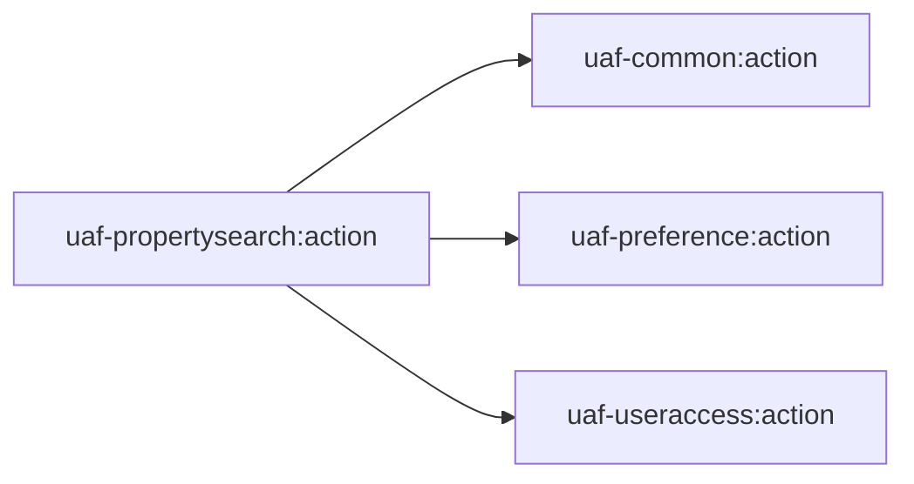
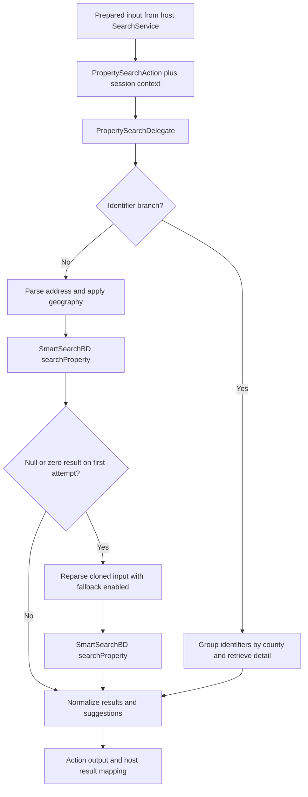

# uaf-propertysearch: Search Execution and Property Retrieval

[Backend](../index.md) | [Project context](../../project-context.md) | [Search flow](../../feature-flows/property-search.md)

## Purpose and participation

`uaf-propertysearch:action` turns prepared property criteria and session context into provider search/detail requests. It also supplies property data for exports and mailing labels. It is an included, source-bearing Java library inside the application, not an independently deployed search service or a local property database.

**Confirmed baseline:** `RP-10188` / `a6f611ae0`. Inclusion: `settings.gradle:27`; web consumer: `realist\web\build.gradle:99`; module declarations: `uaf-propertysearch\action\build.gradle:25-79`.

## Dependencies

Arrows are direct Gradle project edges (`uaf-propertysearch\action\build.gradle:25-27`). External declarations include smartsearch, propertyimage, lookup, preference/common interfaces, Google Maps and CXF/geocoder support. Generated client setup is in the same build file at `88-120`.

Report-data retrieval can use the same external SmartSearch contract without depending on this local action module; [reports](uaf-reports.md) has its own delegate and dependency list.

## Source and caller map

Prefixes below are repository-relative:

- `S` = `uaf-propertysearch\action\src\main\java\com\facl\uaf\propertysearch`
- `W` = `realist\web\src\main\java\com\facl\uaf\realist`

| Source | Responsibility / caller |
| --- | --- |
| `S\action\PropertySearchAction.java:188-289` | Property information, My Search, Quick Search and mailing-label operations; adds session/user context |
| `S\action\delegate\PropertySearchDelegate.java:307-384,430-489` | SmartSearch request execution/detail retrieval and local result preparation |
| `S\action\delegate\PropertySearchDelegate.java:606-735,920-1024` | Quick/My Search parsing, geography, identifiers, suggestions and retries |
| `W\service\SearchService.java:127-289,348-463` | Host preparation of templates, preferences, fields, geography and limits |
| `W\rest\controller\SearchController.java:58-135,137-223` | HTTP mappings and APN/lender normalization |
| `W\service\dashboard\table\TableService.java:64-83` | Property data retrieval used by export/table processing |
| `W\util\PropertySearchTransformer.java:59-145` | Host transformation/preferences/display-field preparation |

The map module also has a class named `PropertySearchDelegate`; it is a different package and responsibility. See [maps](uaf-map.md).

## Contracts and local transformations

Browser `SearchField` data carries a field code and `operatorValues`. The host expands APN-related fields, strips an eligible lender display suffix, maps values to IFC model fields, and prepares `PropertySearchInput`. The IFC spelling `operaterValues` differs from the browser spelling.

The action supplies Passport/session context, invokes the delegate and returns a `PropertySearchOutput` containing result/status information. The host can map Quick Search to a flatter response, while My Search retains its wrapper.

Evidence: `W\rest\mapper\SearchFieldsMapper.java:11-19`; `W\rest\controller\SearchController.java:58-119,137-223`; `S\action\PropertySearchAction.java:222-263`.

| Operation | Input / output distinction | Boundary |
| --- | --- | --- |
| Quick Search | Template-driven criteria or selected property identifiers; returns search results/suggestions | Identifier requests can use multi-county detail retrieval rather than ordinary text search |
| My Search | Criteria plus preferences/template/geography and mode/range flags | Address/geographic processing precedes SmartSearch |
| Count | Search count request and returned count | Host uses the delegate directly; controller caps returned count at 10,000 |
| Property information | Identifier list and requested display fields | External detail retrieval, used by output preparation as well as screens |
| Mailing labels | Prepared property/input data with mailing/order flags | Retrieves label data and records eligible export usage |

Sources: `W\service\SearchService.java:127-345`; `S\action\PropertySearchAction.java:188-289`; `S\action\delegate\PropertySearchDelegate.java:430-489,606-735`.

The [search walkthrough](../../feature-flows/property-search.md) owns sanitized browser examples and the full caller-to-result sequence; do not substitute an example's display fields or record count for authoritative server preparation.

## Runtime flow and alternate paths

This shows selected Quick/My Search responsibilities; it is not a general HTTP retry policy. Fallback parsing permits Google parsing under specific conditions, but does not mean every retry invokes Google. Additional host handling can rerun a single-property suggestion after geography adjustment.

Evidence: `S\action\delegate\PropertySearchDelegate.java:606-735,920-1024,1066-1125`; `W\service\SearchService.java:171-238,270-289`.

## Limits, state and errors

- Session MLS/Passport context and entitled/provisioned geography affect requests; local code does not establish the provider's complete authorization implementation.
- Search limits are not universal: non-export limits derive from preferences, export preparation uses its own limit, count response caps differ, and browser/mobile display decisions are another layer.
- `mySearch` catches/logs exceptions and can return null; other delegate/host paths throw or wrap `PropertySearchException`. An empty result and an exception are not interchangeable.
- Favorites are read from preference keys and re-searched for current summaries, not loaded as a local immutable property snapshot.
- Mailing-label retrieval can record export usage when returned data is present. It is not merely serialization of displayed grid rows.

Evidence: `W\service\SearchService.java:297-345,385-463,466-509,536-580`; `S\action\PropertySearchAction.java:222-289`; [saved/favorite flow](../../feature-flows/saved-searches-and-favorites.md); [exports/labels](../../feature-flows/exports-and-mailing-labels.md).

## Debugging and extension route

Compare browser criteria, host-prepared IFC input, provider result status/list/suggestion fields, then mapped UI results. Inspect APN expansion, selected versus entitled geography, address parsing, pending/export flags and requested fields before blaming provider ranking.

For a new field, coordinate metadata/renderer support with host field conversion and provider contract support. For output changes, inspect detail re-fetch and requested field lists separately from search display state. Existing source tests include `realist\web\src\test\java\com\facl\uaf\realist\rest\controller\SearchControllerTest.java`; no execution result is asserted here.

**Unknown:** SmartSearch algorithms, provider storage, live data freshness, deployed thresholds and geocoder coverage. The locally traced branches are documented; unavailable provider internals are not invented.

Related: [dynamic fields](../../frontend/search/dynamic-fields-and-lookups.md), [results/grid/map](../../frontend/search/results-grid-map-and-actions.md), [preference module](uaf-preference.md), [user-access module](uaf-useraccess.md), [API map](../api-and-feature-map.md).
