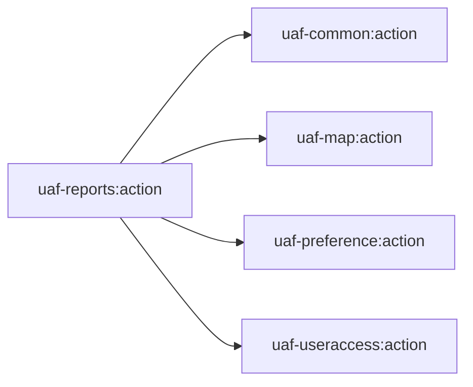
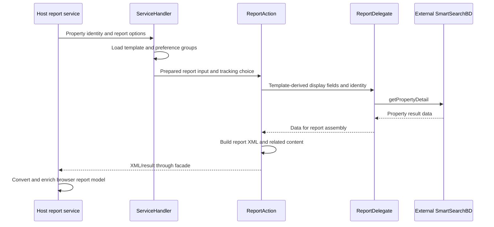

# uaf-reports: report assembly and supporting services

[Backend index](../index.md) · [Project context](../../project-context.md)

## Purpose and current status

`uaf-reports:action` assembles property report data, preferences, images and template-driven XML for the Realist host. It also contains report usage, credit/transaction and document-image services. A report here is not synonymous with a PDF: host-owned converters and services prepare HTML; the host's PDF client delegates final rendering outside this repository.

**Confirmed at revision `a6f611ae0` (RP-10188), researched 2026-09-25:** this is an included, source-bearing Java library, not evidence of an independently deployed reports service. `settings.gradle:21-29` includes it alongside `realist:web`; `uaf-reports/action/build.gradle:1-5` names its JAR `uaf-reports-action`. Root `build.gradle:49-59,88-101` applies Java/dependency management and Java 21 compilation to subprojects. Runtime observations and resolved dependency versions have not been verified; no build, test or service was run.

## Dependency boundary

The **direct local Gradle dependencies** are common, map, preference and useraccess, **not propertysearch** (`uaf-reports/action/build.gradle:21-24`). Consuming smart-search contracts does not imply a dependency on the local propertysearch action module.

Arrows mean declared Gradle project dependencies, not network calls. Evidence: `uaf-reports/action/build.gradle:21-24`.

## Source and feature ownership

Repository-relative prefixes used below:

- `R` = `uaf-reports\action\src\main\java\com\facl\uaf\report`
- `W` = `realist\web\src\main\java\com\facl\uaf\realist`

| Source | Responsibility and consumers |
| --- | --- |
| `R\action\ReportAction.java:296-578,943-966` | Report preparation, data/template validation, fields and XML; called from host orchestration |
| `R\action\delegate\ReportDelegate.java:148-164` | External SmartSearch property-detail boundary |
| `R\action\EcommerceAction.java:57` and `R\action\delegate\EcommerceDelegate.java:31-56` | Legacy report authorization/pricing/activity integration |
| `R\service\ReportLimitUsageService.java:49-197` | Provider-backed or local monthly report allowance/usage path |
| `R\service\CreditProcessingService.java:58-193` | Entitlements/products, subscription accrual/revocation and credit processing |
| `R\service\TransactionLedgerService.java:113-156` | Ledger access and report/product consumption state |
| `R\documentimage\DocumentImageService.java:86-125,154-184,211-232` | Document parameters, cache/access/usage and PDF retrieval |
| `R\entity` and `R\repository` | Report limits, usage, products and transaction ledger persistence |

These are separate responsibilities. A report action generating XML, an external purchase and a subscription-credit debit are not one universally atomic operation.

## Report input, transformation and output

For a Property Details report, the host `ServiceHandler` obtains report templates/preferences and invokes `ReportAction`. The action derives requested display fields, retrieves property detail through its delegate, and assembles template-driven XML. Host services then apply footnotes/conversion/enrichment to create the browser's report DTO.

This diagram describes the established Property Details path, not every report family. Community Insights, map files, permits and direct report paths have additional/different contracts documented in the [catalogue](../../frontend/reports/report-catalogue.md).

Evidence: `W\action\ServiceHandler.java:1001-1033`; `R\action\ReportAction.java:480-578,943-966`; `R\action\delegate\ReportDelegate.java:148-164`; `W\rest\service\report\PropertyDetailsService.java:128-201`.

The `regenerateReport` choice affects the tracking argument supplied through `ServiceHandler`; regeneration must not be casually described as another billable view. PDF HTML preparation and the remote renderer remain host-owned, outside this action's XML responsibility.

## Three accounting mechanisms

| Concern | Local behavior | Important boundary |
| --- | --- | --- |
| Provider feature usage | User-access calls and report action/delegate usage operations | The provider's accounting implementation is external |
| Monthly report limits | `ReportLimitUsageService` uses local report-limit/usage repositories when enabled | A missing local monthly record may be initialized from provider usage |
| Subscription credits | Credit processing and ledger services use product/entitlement/accrual/consumption state | This is not the same transaction as external store checkout |

When `realist.report.limits.enabled` is false, usage retrieval delegates to user-access behavior. When enabled, local monthly state participates. New usage paths check existing records, persist usage, record transaction information and decrement applicable limits.

Evidence: `R\service\ReportLimitUsageService.java:49-112,115-197`; `R\service\CreditProcessingService.java:58-124,137-193`. The [commerce/credits flow](../../feature-flows/cart-checkout-and-report-credits.md) owns exact matching, repeated-use, debit and failure/atomicity caveats.

Do not infer a universal concurrency/idempotency guarantee from these class names or a single transaction annotation. The [database chapter](../../cross-cutting/database-and-migrations.md) documents actual constraints and mapping discrepancies.

## Document-image contract

The module's `DocumentImageService` parses document parameters, examines cache/access/usage conditions, obtains PDF bytes, applies usage recording where relevant and caches the result. Host `DocumentImageController` exposes preparation/download operations; cached-download absence can produce 204.

Evidence: `R\documentimage\DocumentImageService.java:86-125,154-184,211-232`; `W\rest\controller\DocumentImageController.java:85-113`.

An important current behavior is that `/api/document-image/eligible-for-free-credit` returns `eligible=false`; earlier eligibility logic is commented out (`W\rest\controller\DocumentImageController.java:57-82`). A method name or old comment is not proof of active free-credit eligibility.

## State, providers and access

- The module uses session/user context and template preferences; external data is not converted into proof of locally owned property storage.
- Report-related entities/repositories are scanned by the web application; persistence ownership crosses module boundaries (`W\Application.java:14-21`).
- Some report actions retain subject/report context for subsequent related operations. Read the feature flow before assuming requests are stateless.
- `EcommerceDelegate` can use the external activity contract directly; the separately included `uaf-activity` wrapper is not necessarily the active accounting path.
- Entitlement, feature flag, property coverage, payment, allowance and PDF admission must be evaluated separately for each family.

See [availability](../../frontend/reports/availability-and-access-rules.md), [Redis](../../cross-cutting/redis-caching-and-sessions.md), and [activity status](uaf-activity.md).

## Errors, debugging and extension guidance

Debug the template/data/XML/DTO stages independently. If the browser shows no report, distinguish absent provider records, template validation, conversion failure, payment-required output, and report-specific no-data behavior. If a PDF fails, also inspect the host's preparation/cache/HTML/renderer stages rather than only `ReportAction`.

For usage discrepancies, identify which accounting mechanism and report/product key are in use before inspecting repositories. Different report families record usage at different stages; [availability](../../frontend/reports/availability-and-access-rules.md) and [PDF differences](../../feature-flows/pdf-generation-and-download.md#important-enforcement-differences) preserve those source-specific distinctions.

For document images, compare cache-hit, missing-image, purchase and eligibility branches. For new report sections, coordinate template field selection, XML generation, host conversion, frontend rendering and supported output/sharing contracts.

**Unknown:** provider algorithms/coverage, deployed preferences and limits, and runtime concurrency outcomes not established by source. Existing module tests include report-limit, credit-processing, ledger, document-image and enrichment tests; none were executed by this documentation work.

## Related documentation

- Sibling ownership: [host](realist-web.md), [common](uaf-common.md), [map](uaf-map.md), [preference](uaf-preference.md), [user access](uaf-useraccess.md), [property search](uaf-propertysearch.md).
- Cross-layer flows: [property details and reports](../../feature-flows/property-details-and-reports.md), [PDF generation and download](../../feature-flows/pdf-generation-and-download.md), [maps and property lookup](../../feature-flows/maps-and-property-lookup.md).
- Browser catalogue: [report catalogue](../../frontend/reports/report-catalogue.md).
- Shared concerns: [external integrations](../../cross-cutting/external-integrations.md), [Redis caching and sessions](../../cross-cutting/redis-caching-and-sessions.md), [database and migrations](../../cross-cutting/database-and-migrations.md), [authentication and authorization](../../cross-cutting/authentication-and-authorization.md), [configuration and feature flags](../../cross-cutting/configuration-and-feature-flags.md).
