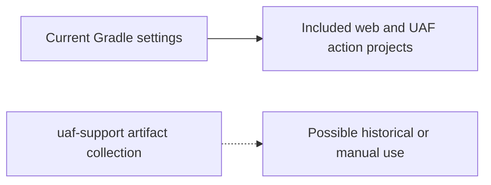

# uaf-support: Historical and Manual Support Artifacts

[Backend](../index.md) | [Project context](../../project-context.md) | [Module dependencies](../module-dependencies.md)

## Established status

At baseline `RP-10188` / `a6f611ae0`, `uaf-support` is a repository directory with `dev`, `docs` and `sso` subdirectories. It is **not** in `settings.gradle`'s included project list. No build definition under it or active reference to its inspected PMD/extractor artifacts was established in the Gradle declaration search.

Evidence: `settings.gradle:21-30`; `uaf-support` directory inventory; repository Gradle references. This is narrower than asserting that no person or external script ever uses the directory.

## Non-secret artifacts and their significance

| Artifact area | Confirmed observation | What not to infer |
| --- | --- | --- |
| `uaf-support\dev\PMD templates\k2ruleset.xml` | A Flex/ActionScript PMD ruleset containing Adobe architecture/MXML rules | It is not the current Angular/Java lint configuration merely because it is a ruleset |
| `uaf-support\dev\Matrix 360\Source` | A Custom Template Extractor source archive is present | Archive presence does not establish current invocation or supported behavior |
| Related Matrix 360 runnable archive | A runnable-JAR ZIP is present in the support collection | It was not extracted, executed or treated as an active application service |
| `uaf-support\docs\Developer Notes` | Historical Flex/BlazeDS, template, integration and architecture document filenames exist | Their architecture claims are not automatically valid for the current Angular/Spring Boot application |
| `uaf-support\sso` | An SSO-related support directory exists | Credential/keystore contents were not read; its name does not prove the active security wiring |

Ruleset evidence: `uaf-support\dev\PMD templates\k2ruleset.xml:1-14,69-85`. Other rows are directory/archive-name observations, not claims about unavailable document/archive contents.

## Relationship to the active application

The dotted edge means an **Inferred** use category, not a confirmed invocation. There is intentionally no runtime or Gradle dependency edge connecting support artifacts to the application.

No active application classes, HTTP contracts, persistence operations, transformations, or runtime integrations were established from this directory. Consequently it should not appear as another deployed service in the architecture diagram.

## How a newcomer should use it

Start with current source and [development documentation](../../development/index.md). Use a support artifact only when an owner confirms its purpose, version and applicability. A historical template document can suggest terminology to investigate, but current template/action/provider code remains the implementation evidence.

Before running an extractor or changing/removing this directory, obtain its owner and consumer history. This guide does not recommend executing old archives or opening credential material.

## Unknowns and owner questions

- Which support artifacts, if any, are still run manually or by pipelines outside this repository?
- Who owns the template extractor and its expected input/output format?
- Which historical documents remain useful, and which describe superseded Flex/BlazeDS architecture?
- Is retention required for support, audit or external tooling?

These are historical/operational evidence gaps, not missing active-module implementation details.
