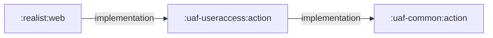

# `uaf-useraccess:action` — Passport access and usage adapter

[Backend index](../index.md) · [Project context](../../project-context.md) · [Common](uaf-common.md) · [Preferences](uaf-preference.md)

## Scope and reading convention

This page describes source at **`a6f611ae0`**, branch **`RP-10188`**. It owns the module explanation, not the host architecture or HTTP API catalogue. Read the [login/session flow](../../feature-flows/login-and-session-lifecycle.md), [authentication and authorization](../../cross-cutting/authentication-and-authorization.md), [Redis/session ownership](../../cross-cutting/redis-caching-and-sessions.md), and [external integrations](../../cross-cutting/external-integrations.md) for those wider concerns. Frontend behavior belongs to the [frontend index](../../frontend/index.md), [dashboard](../../frontend/dashboard/index.md), and [property-intelligence](../../frontend/property-intelligence/index.md) owners.

Evidence links below use repository source paths and line ranges at that revision. Two recurring abbreviations keep the reading path manageable:

- **A** = `uaf-useraccess/action/src/main/java/com/facl/uaf/useraccess/action/UserAccessAction.java`.
- **D** = `uaf-useraccess/action/src/main/java/com/facl/uaf/useraccess/action/delegate/UserAccessDelegate.java`.

**Verification scope:** source citation targets and line bounds were checked, and inspected source paths had no changes against the stated revision. This is static source documentation, not runtime verification; no builds, tests, dependency resolution, or network calls were run. Prescribed owner-page links are retained even where their pages were not yet present at authoring.

## 1. Business purpose and ownership

Think of this module as a **web-aware adapter around Passport/service-tier contracts**. It starts or reuses a login, adapts returned user/entitlement information into application session objects, logs out, and supports feature usage, pricing, contacts, and EULA acceptance. It does not implement the remote authentication or charging engine: the delegate invokes injected `UserAccessBD` and `UserServiceBD` clients created by `RestClientFactory`. [A:729–783](https://github.com/corelogic-private/real_estate_us-realist-phoenix/blob/a6f611ae0654e2bf62deec0a7d5c1d333348d6be/uaf-useraccess/action/src/main/java/com/facl/uaf/useraccess/action/UserAccessAction.java#L729-L783), [D:271–375](https://github.com/corelogic-private/real_estate_us-realist-phoenix/blob/a6f611ae0654e2bf62deec0a7d5c1d333348d6be/uaf-useraccess/action/src/main/java/com/facl/uaf/useraccess/action/delegate/UserAccessDelegate.java#L271-L375), [UserAccessConfiguration.java:13–27](https://github.com/corelogic-private/real_estate_us-realist-phoenix/blob/a6f611ae0654e2bf62deec0a7d5c1d333348d6be/uaf-useraccess/action/src/main/java/com/facl/uaf/useraccess/configuration/UserAccessConfiguration.java#L13-L27).

The business distinction matters: authenticating a user, retrieving entitlements, asking for feature pricing/authorization, and recording usage are different operations. A local `USER` authority is not a county entitlement or a purchase approval; `UserAccessOutput` always exposes that one authority, while the delegate separately calls `authorizeAndPrice` and `trackUsage`. [UserAccessOutput.java:109–154](https://github.com/corelogic-private/real_estate_us-realist-phoenix/blob/a6f611ae0654e2bf62deec0a7d5c1d333348d6be/uaf-useraccess/action/src/main/java/com/facl/uaf/useraccess/model/UserAccessOutput.java#L109-L154), [Authority.java:5–12](https://github.com/corelogic-private/real_estate_us-realist-phoenix/blob/a6f611ae0654e2bf62deec0a7d5c1d333348d6be/uaf-useraccess/action/src/main/java/com/facl/uaf/useraccess/model/Authority.java#L5-L12), [D:318–418](https://github.com/corelogic-private/real_estate_us-realist-phoenix/blob/a6f611ae0654e2bf62deec0a7d5c1d333348d6be/uaf-useraccess/action/src/main/java/com/facl/uaf/useraccess/action/delegate/UserAccessDelegate.java#L318-L418).

## 2. Build inclusion, source, and runtime

`settings.gradle` includes `:uaf-useraccess:action`. Its Java-library JAR is named `uaf-useraccess-action`, with group `com.facl.uaf.useraccess` and a declared base version `1.20.1`; root conventions apply Java 21, dependency management, and JAR output under each project's `build` directory. This is an included, source-bearing module, not a standalone Boot entry point: its action/delegate are Spring services and its configuration creates client beans. [settings.gradle:19–30](https://github.com/corelogic-private/real_estate_us-realist-phoenix/blob/a6f611ae0654e2bf62deec0a7d5c1d333348d6be/settings.gradle#L19-L30), [module build.gradle:1–15](https://github.com/corelogic-private/real_estate_us-realist-phoenix/blob/a6f611ae0654e2bf62deec0a7d5c1d333348d6be/uaf-useraccess/action/build.gradle#L1-L15), [root build.gradle:49–59](https://github.com/corelogic-private/real_estate_us-realist-phoenix/blob/a6f611ae0654e2bf62deec0a7d5c1d333348d6be/build.gradle#L49-L59), [root build.gradle:88–101](https://github.com/corelogic-private/real_estate_us-realist-phoenix/blob/a6f611ae0654e2bf62deec0a7d5c1d333348d6be/build.gradle#L88-L101), [A:53–79](https://github.com/corelogic-private/real_estate_us-realist-phoenix/blob/a6f611ae0654e2bf62deec0a7d5c1d333348d6be/uaf-useraccess/action/src/main/java/com/facl/uaf/useraccess/action/UserAccessAction.java#L53-L79), [D:47–63](https://github.com/corelogic-private/real_estate_us-realist-phoenix/blob/a6f611ae0654e2bf62deec0a7d5c1d333348d6be/uaf-useraccess/action/src/main/java/com/facl/uaf/useraccess/action/delegate/UserAccessDelegate.java#L47-L63), [UserAccessConfiguration.java:10–27](https://github.com/corelogic-private/real_estate_us-realist-phoenix/blob/a6f611ae0654e2bf62deec0a7d5c1d333348d6be/uaf-useraccess/action/src/main/java/com/facl/uaf/useraccess/configuration/UserAccessConfiguration.java#L10-L27).

### Verified Gradle edges — not a call graph

These are the scoped direct **project dependency** edges: the host declares the module, and the module declares common. There is no direct preference-module edge in the useraccess dependency block; runtime collaboration with preference code must not be drawn as such an edge. [realist/web/build.gradle:93–103](https://github.com/corelogic-private/real_estate_us-realist-phoenix/blob/a6f611ae0654e2bf62deec0a7d5c1d333348d6be/realist/web/build.gradle#L93-L103), [uaf-useraccess/action/build.gradle:12–40](https://github.com/corelogic-private/real_estate_us-realist-phoenix/blob/a6f611ae0654e2bf62deec0a7d5c1d333348d6be/uaf-useraccess/action/build.gradle#L12-L40).

### Direct external declarations

The following are declarations, **not a resolved runtime dependency report**. Property-backed versions are intentionally left symbolic; no dependency resolution or environment configuration inspection was performed. [uaf-useraccess/action/build.gradle:12–40](https://github.com/corelogic-private/real_estate_us-realist-phoenix/blob/a6f611ae0654e2bf62deec0a7d5c1d333348d6be/uaf-useraccess/action/build.gradle#L12-L40).

| Artifact | Declared version / notable exclusion |
|---|---|
| `org.projectlombok:lombok-mapstruct-binding` | Annotation processor `0.2.0`. |
| `com.fasterxml.jackson.jaxrs:jackson-jaxrs-json-provider` | `${jacksonVersion}`. |
| `jakarta.annotation:jakarta.annotation-api` | `1.3.5`. |
| `jakarta.xml.bind:jakarta.xml.bind-api` | `2.3.3`. |
| `com.corelogic.service.common:common` | `${common}`; excludes SLF4J API, commons-logging, commons-lang. |
| `com.corelogic.service.smartsearch:smartsearch-ifc` | `${smartsearch_ifc}`; excludes startup, common, Flex messaging, retrends IFC, CLIP lookup starter. |
| `com.corelogic.service.useraccess:useraccess-ifc` | `${useraccess_ifc}`; excludes common and administration IFC. |
| `com.corelogic.service.administration:administration-ifc` | `${administration_ifc}`; excludes common and preference IFC. |
| `org.owasp.encoder:encoder` | `1.2.3`. |

Root `subprojects` also supplies the shared platform: Boot web/security/validation/Redis and other starters, Spring Session, Jakarta APIs, Lombok, and the existing test platform. Consequently, the module's short dependency block is not its entire classpath. Root BOMs and exclusions can affect resolution; in particular, root excludes commons-lang and describes a common-module compatibility bridge. [root build.gradle:49–85](https://github.com/corelogic-private/real_estate_us-realist-phoenix/blob/a6f611ae0654e2bf62deec0a7d5c1d333348d6be/build.gradle#L49-L85), [root build.gradle:130–178](https://github.com/corelogic-private/real_estate_us-realist-phoenix/blob/a6f611ae0654e2bf62deec0a7d5c1d333348d6be/build.gradle#L130-L178), [root build.gradle:180–242](https://github.com/corelogic-private/real_estate_us-realist-phoenix/blob/a6f611ae0654e2bf62deec0a7d5c1d333348d6be/build.gradle#L180-L242).

## 3. Packages and contracts

| Package / class | What a newcomer should understand | Evidence |
|---|---|---|
| `action.UserAccessAction` | Extends common `BaseAction`; obtains request/session context, orchestrates login and cleanup, prepares activity payloads. Constructor dependencies are `SessionStateUtil`, delegate, `LocalStorage`, and `PhoenixProperties`; a declared dependency does not by itself prove active use (`localStorage` is assigned here). | [A:53–102](https://github.com/corelogic-private/real_estate_us-realist-phoenix/blob/a6f611ae0654e2bf62deec0a7d5c1d333348d6be/uaf-useraccess/action/src/main/java/com/facl/uaf/useraccess/action/UserAccessAction.java#L53-L102), [A:390–449](https://github.com/corelogic-private/real_estate_us-realist-phoenix/blob/a6f611ae0654e2bf62deec0a7d5c1d333348d6be/uaf-useraccess/action/src/main/java/com/facl/uaf/useraccess/action/UserAccessAction.java#L390-L449). |
| `action.delegate.UserAccessDelegate` | Spring service wrapping the external IFC clients; prepares Passport input, adapts responses, and has method-specific exception behavior. | [D:47–63](https://github.com/corelogic-private/real_estate_us-realist-phoenix/blob/a6f611ae0654e2bf62deec0a7d5c1d333348d6be/uaf-useraccess/action/src/main/java/com/facl/uaf/useraccess/action/delegate/UserAccessDelegate.java#L47-L63), [D:84–188](https://github.com/corelogic-private/real_estate_us-realist-phoenix/blob/a6f611ae0654e2bf62deec0a7d5c1d333348d6be/uaf-useraccess/action/src/main/java/com/facl/uaf/useraccess/action/delegate/UserAccessDelegate.java#L84-L188). |
| `configuration.UserAccessConfiguration` | Creates `UserAccessBD` using `${service.tier.user.access}` and `UserServiceBD` using `${service.tier.administration}`. These are configuration keys, not documented endpoint values. | [UserAccessConfiguration.java:10–27](https://github.com/corelogic-private/real_estate_us-realist-phoenix/blob/a6f611ae0654e2bf62deec0a7d5c1d333348d6be/uaf-useraccess/action/src/main/java/com/facl/uaf/useraccess/configuration/UserAccessConfiguration.java#L10-L27). |
| `model.UserAccessOutput` | Extends `BaseOutput`, implements Spring Security `UserDetails`; holds `UAFUserInfo`, a second `PassportUserInfo` reference, timeout, prior-session metadata, SecureLink flag, and the misspelled `platfomrId` contract. `getUserKey()` combines user ID, login ID, and MLS group. | [UserAccessOutput.java:21–106](https://github.com/corelogic-private/real_estate_us-realist-phoenix/blob/a6f611ae0654e2bf62deec0a7d5c1d333348d6be/uaf-useraccess/action/src/main/java/com/facl/uaf/useraccess/model/UserAccessOutput.java#L21-L106). |
| `model.SessionInfo` | Serializable three-string carrier: `appSessionId`, `appHostId`, `appPort`. It does not invalidate a session itself. | [SessionInfo.java:10–19](https://github.com/corelogic-private/real_estate_us-realist-phoenix/blob/a6f611ae0654e2bf62deec0a7d5c1d333348d6be/uaf-useraccess/action/src/main/java/com/facl/uaf/useraccess/model/SessionInfo.java#L10-L19), [D:476–491](https://github.com/corelogic-private/real_estate_us-realist-phoenix/blob/a6f611ae0654e2bf62deec0a7d5c1d333348d6be/uaf-useraccess/action/src/main/java/com/facl/uaf/useraccess/action/delegate/UserAccessDelegate.java#L476-L491). |
| `model.Authority` | `GrantedAuthority` enum with only `USER`, returning its name. `UserDetails` account/credential status methods always return true; password and authorities have `@JsonIgnore`, but this is not proof that every nested user field is serialization-safe. | [Authority.java:5–12](https://github.com/corelogic-private/real_estate_us-realist-phoenix/blob/a6f611ae0654e2bf62deec0a7d5c1d333348d6be/uaf-useraccess/action/src/main/java/com/facl/uaf/useraccess/model/Authority.java#L5-L12), [UserAccessOutput.java:109–154](https://github.com/corelogic-private/real_estate_us-realist-phoenix/blob/a6f611ae0654e2bf62deec0a7d5c1d333348d6be/uaf-useraccess/action/src/main/java/com/facl/uaf/useraccess/model/UserAccessOutput.java#L109-L154). |

The resource `UserAccessActions.xml` also declares legacy-looking setter-based beans. Do not treat it as equivalent wiring: it sets `serviceTierUserAccessUrl` on the delegate and supplies properties to the action, whereas current Java source uses injected clients and a required constructor. Its presence alone does not establish an active import. [UserAccessActions.xml:10–31](https://github.com/corelogic-private/real_estate_us-realist-phoenix/blob/a6f611ae0654e2bf62deec0a7d5c1d333348d6be/uaf-useraccess/action/src/main/resources/com/facl/uaf/useraccess/UserAccessActions.xml#L10-L31), [A:57–79](https://github.com/corelogic-private/real_estate_us-realist-phoenix/blob/a6f611ae0654e2bf62deec0a7d5c1d333348d6be/uaf-useraccess/action/src/main/java/com/facl/uaf/useraccess/action/UserAccessAction.java#L57-L79), [D:47–63](https://github.com/corelogic-private/real_estate_us-realist-phoenix/blob/a6f611ae0654e2bf62deec0a7d5c1d333348d6be/uaf-useraccess/action/src/main/java/com/facl/uaf/useraccess/action/delegate/UserAccessDelegate.java#L47-L63).

## 4. Verified host callers — runtime edges

The host `Application` scans `com.facl.uaf`, which covers the module's annotated services and configuration. This, the host dependency, and actual callers establish runtime relevance without requiring an XML import. [Application.java:11–31](https://github.com/corelogic-private/real_estate_us-realist-phoenix/blob/a6f611ae0654e2bf62deec0a7d5c1d333348d6be/realist/web/src/main/java/com/facl/uaf/realist/Application.java#L11-L31), [realist/web/build.gradle:97–103](https://github.com/corelogic-private/real_estate_us-realist-phoenix/blob/a6f611ae0654e2bf62deec0a7d5c1d333348d6be/realist/web/build.gradle#L97-L103), [A:53–79](https://github.com/corelogic-private/real_estate_us-realist-phoenix/blob/a6f611ae0654e2bf62deec0a7d5c1d333348d6be/uaf-useraccess/action/src/main/java/com/facl/uaf/useraccess/action/UserAccessAction.java#L53-L79), [UserAccessConfiguration.java:10–27](https://github.com/corelogic-private/real_estate_us-realist-phoenix/blob/a6f611ae0654e2bf62deec0a7d5c1d333348d6be/uaf-useraccess/action/src/main/java/com/facl/uaf/useraccess/configuration/UserAccessConfiguration.java#L10-L27).

Read these as **method-call edges**, not Gradle dependencies or a complete API list:

| Caller | Verified interaction | Evidence |
|---|---|---|
| `MlsAuthenticationProvider.retrieveUser` → `MlsGroupUserDetailsService.loadUser` | Builds `UAFUserInfo` from username/password/MLS group and calls `UserAccessAction.doLogin`. | [MlsAuthenticationProvider.java:29–36](https://github.com/corelogic-private/real_estate_us-realist-phoenix/blob/a6f611ae0654e2bf62deec0a7d5c1d333348d6be/realist/web/src/main/java/com/facl/uaf/realist/rest/security/providers/MlsAuthenticationProvider.java#L29-L36), [MlsGroupUserDetailsService.java:33–40](https://github.com/corelogic-private/real_estate_us-realist-phoenix/blob/a6f611ae0654e2bf62deec0a7d5c1d333348d6be/realist/web/src/main/java/com/facl/uaf/realist/rest/security/services/MlsGroupUserDetailsService.java#L33-L40). |
| `DirectAuthenticationProvider.retrieveUser` → `MlsGroupUserDetailsService.commonLogin` | Adds login type and agent/broker names, takes the current request, and calls `doCommonLogin`; provider wraps `BaseException`. | [DirectAuthenticationProvider.java:30–44](https://github.com/corelogic-private/real_estate_us-realist-phoenix/blob/a6f611ae0654e2bf62deec0a7d5c1d333348d6be/realist/web/src/main/java/com/facl/uaf/realist/rest/security/providers/DirectAuthenticationProvider.java#L30-L44), [MlsGroupUserDetailsService.java:43–56](https://github.com/corelogic-private/real_estate_us-realist-phoenix/blob/a6f611ae0654e2bf62deec0a7d5c1d333348d6be/realist/web/src/main/java/com/facl/uaf/realist/rest/security/services/MlsGroupUserDetailsService.java#L43-L56). |
| `PhoenixLogoutHandler.logout` | Calls `doLogout`, catching `ServletException`. | [PhoenixLogoutHandler.java:24–31](https://github.com/corelogic-private/real_estate_us-realist-phoenix/blob/a6f611ae0654e2bf62deec0a7d5c1d333348d6be/realist/web/src/main/java/com/facl/uaf/realist/rest/security/handlers/PhoenixLogoutHandler.java#L24-L31). |
| `PassportUserController` | Accepts affirmative EULA status through `updateEULAAcceptance`, otherwise invokes logout; contacts delegate to `getContacts`. | [PassportUserController.java:36–55](https://github.com/corelogic-private/real_estate_us-realist-phoenix/blob/a6f611ae0654e2bf62deec0a7d5c1d333348d6be/realist/web/src/main/java/com/facl/uaf/realist/rest/controller/PassportUserController.java#L36-L55), [PassportUserController.java:74–78](https://github.com/corelogic-private/real_estate_us-realist-phoenix/blob/a6f611ae0654e2bf62deec0a7d5c1d333348d6be/realist/web/src/main/java/com/facl/uaf/realist/rest/controller/PassportUserController.java#L74-L78). |
| `PreExportLabelController`, `PreCustomExportController` → `DataUtil` | Read export feature usage through `UserAccessAction.getFeatureUsageInfo`; the custom-grid caller separately accesses preferences/templates. | [PreExportLabelController.java:19–22](https://github.com/corelogic-private/real_estate_us-realist-phoenix/blob/a6f611ae0654e2bf62deec0a7d5c1d333348d6be/realist/web/src/main/java/com/facl/uaf/realist/rest/controller/PreExportLabelController.java#L19-L22), [PreCustomExportController.java:47–56](https://github.com/corelogic-private/real_estate_us-realist-phoenix/blob/a6f611ae0654e2bf62deec0a7d5c1d333348d6be/realist/web/src/main/java/com/facl/uaf/realist/rest/controller/PreCustomExportController.java#L47-L56), [DataUtil.java:546–549](https://github.com/corelogic-private/real_estate_us-realist-phoenix/blob/a6f611ae0654e2bf62deec0a7d5c1d333348d6be/realist/web/src/main/java/com/facl/uaf/realist/util/DataUtil.java#L546-L549). |
| `ExportService.updateExportUsage` | Supplies user, property identifiers, null label type, and list size to action usage tracking. | [ExportService.java:218–221](https://github.com/corelogic-private/real_estate_us-realist-phoenix/blob/a6f611ae0654e2bf62deec0a7d5c1d333348d6be/realist/web/src/main/java/com/facl/uaf/realist/service/ExportService.java#L218-L221). |
| `ServiceHandler.getBuildingSketchReport` | Asks `isEcommerceEnabled` to determine its report-regeneration flag. This is a verified `ServiceHandler` intersection, **not** the login dispatch path. | [ServiceHandler.java:1292–1304](https://github.com/corelogic-private/real_estate_us-realist-phoenix/blob/a6f611ae0654e2bf62deec0a7d5c1d333348d6be/realist/web/src/main/java/com/facl/uaf/realist/action/ServiceHandler.java#L1292-L1304), [MlsGroupUserDetailsService.java:33–56](https://github.com/corelogic-private/real_estate_us-realist-phoenix/blob/a6f611ae0654e2bf62deec0a7d5c1d333348d6be/realist/web/src/main/java/com/facl/uaf/realist/rest/security/services/MlsGroupUserDetailsService.java#L33-L56). |
| `SamlServiceProviderConfigurationComponent.getProviders`, `SecureLinkService.getSecureLinkConfigurationInternal` | Call delegate `getGroupDataForApp(applicationCode, false)`; the SecureLink caller then uses the matching group for preference lookup. These host services, not this module, own provider/configuration assembly. | [SamlServiceProviderConfigurationComponent.java:55–68](https://github.com/corelogic-private/real_estate_us-realist-phoenix/blob/a6f611ae0654e2bf62deec0a7d5c1d333348d6be/realist/web/src/main/java/com/facl/uaf/realist/rest/security/providers/SamlServiceProviderConfigurationComponent.java#L55-L68), [SecureLinkService.java:118–138](https://github.com/corelogic-private/real_estate_us-realist-phoenix/blob/a6f611ae0654e2bf62deec0a7d5c1d333348d6be/realist/web/src/main/java/com/facl/uaf/realist/rest/service/SecureLinkService.java#L118-L138). |
| `EmailService.syncUserEmail` | Calls delegate `getUserEmail` and caches the result under its own `USREMLCNFG:<mls>:<user>` key. That email-cache policy is host-owned. | [EmailService.java:271–291](https://github.com/corelogic-private/real_estate_us-realist-phoenix/blob/a6f611ae0654e2bf62deec0a7d5c1d333348d6be/realist/web/src/main/java/com/facl/uaf/realist/rest/service/EmailService.java#L271-L291). |

One important output consumer is `DirectLoginService.authenticate`: it copies user, Passport, timeout, prior-session metadata, flags, and status into another `UserAccessOutput`, then clears user/Passport fields from the authentication principal. Do not assume the returned output, session copy, and Spring Security principal retain identical contents. Its post-login preparation calls `ServiceHandler.prepareEcommerceInfo`, and alias-group preparation uses preferences; those are host responsibilities. [DirectLoginService.java:58–102](https://github.com/corelogic-private/real_estate_us-realist-phoenix/blob/a6f611ae0654e2bf62deec0a7d5c1d333348d6be/realist/web/src/main/java/com/facl/uaf/realist/rest/security/services/DirectLoginService.java#L58-L102).

## 5. Follow one login through the module

### Step A — establish input and choose reuse versus remote login

`doLogin(UAFUserInfo)` obtains the request, sets `ipFilteringLoginId` and `ipFilteringGroupId` request attributes, and enters `doCommonLogin` as `APPLICATION`. Setting these attributes is not itself IP filtering. A caught `BaseException` is logged and produces a **null** return. Direct/AutoPop entry instead supplies a login type through `doCommonLogin`. [A:87–102](https://github.com/corelogic-private/real_estate_us-realist-phoenix/blob/a6f611ae0654e2bf62deec0a7d5c1d333348d6be/uaf-useraccess/action/src/main/java/com/facl/uaf/useraccess/action/UserAccessAction.java#L87-L102), [A:729–750](https://github.com/corelogic-private/real_estate_us-realist-phoenix/blob/a6f611ae0654e2bf62deec0a7d5c1d333348d6be/uaf-useraccess/action/src/main/java/com/facl/uaf/useraccess/action/UserAccessAction.java#L729-L750).

“Existing session” means an HTTP session exists, its requested ID matches `SessionStateUtil.getSessionId()` case-insensitively, and it contains `userAccessOutput`. The following table is the actual branch behavior, not a recommended authentication policy. Credential matching compares user/group case-insensitively, then accepts a null stored password or a case-insensitive password match. [A:805–815](https://github.com/corelogic-private/real_estate_us-realist-phoenix/blob/a6f611ae0654e2bf62deec0a7d5c1d333348d6be/uaf-useraccess/action/src/main/java/com/facl/uaf/useraccess/action/UserAccessAction.java#L805-L815), [A:858–871](https://github.com/corelogic-private/real_estate_us-realist-phoenix/blob/a6f611ae0654e2bf62deec0a7d5c1d333348d6be/uaf-useraccess/action/src/main/java/com/facl/uaf/useraccess/action/UserAccessAction.java#L858-L871).

| Situation | Result |
|---|---|
| Existing session, `AUTOPOP`, credentials do not match | Return status `-1`, message `Invalid Login`; no new Passport call. |
| Existing session, neither `DIRECT` nor `AUTOPOP` | Reuse the stored output, even if the computed credential-match result is false. |
| Existing session, `DIRECT`, or matching `AUTOPOP` | Continue to a fresh Passport call rather than simply returning the old output. |
| No qualifying existing session | Obtain/create an HTTP session, then continue to Passport. |

Evidence for all four branches: [A:734–758](https://github.com/corelogic-private/real_estate_us-realist-phoenix/blob/a6f611ae0654e2bf62deec0a7d5c1d333348d6be/uaf-useraccess/action/src/main/java/com/facl/uaf/useraccess/action/UserAccessAction.java#L734-L758), [A:790–795](https://github.com/corelogic-private/real_estate_us-realist-phoenix/blob/a6f611ae0654e2bf62deec0a7d5c1d333348d6be/uaf-useraccess/action/src/main/java/com/facl/uaf/useraccess/action/UserAccessAction.java#L790-L795), [BaseAction.java:200–222](https://github.com/corelogic-private/real_estate_us-realist-phoenix/blob/a6f611ae0654e2bf62deec0a7d5c1d333348d6be/uaf-common/action/src/main/java/com/facl/uaf/common/shared/action/BaseAction.java#L200-L222). See the [authentication owner](../../cross-cutting/authentication-and-authorization.md) for the surrounding security controls; this local branch analysis alone does not prove their overall effectiveness.

### Step B — transform application input into Passport input

1. `prepareUserInfo` selects the input app code or configured `${app.code}`, creates a fresh `PassportUserInfo`, and sets client IP from `request.getRemoteAddr()`. It replaces any previous Passport object in the input user. [A:882–890](https://github.com/corelogic-private/real_estate_us-realist-phoenix/blob/a6f611ae0654e2bf62deec0a7d5c1d333348d6be/uaf-useraccess/action/src/main/java/com/facl/uaf/useraccess/action/UserAccessAction.java#L882-L890), [BaseAction.java:265–268](https://github.com/corelogic-private/real_estate_us-realist-phoenix/blob/a6f611ae0654e2bf62deec0a7d5c1d333348d6be/uaf-common/action/src/main/java/com/facl/uaf/common/shared/action/BaseAction.java#L265-L268).
2. `DIRECT` and `AUTOPOP` set `autoCreate=true`; only `AUTOPOP` sets bypass-session-count. The delegate copies app/user/client IP and MLS group. Auto-create additionally copies first/last/broker names, clears MLS subgroup, and converts a blank password to null. [A:824–849](https://github.com/corelogic-private/real_estate_us-realist-phoenix/blob/a6f611ae0654e2bf62deec0a7d5c1d333348d6be/uaf-useraccess/action/src/main/java/com/facl/uaf/useraccess/action/UserAccessAction.java#L824-L849), [A:748–750](https://github.com/corelogic-private/real_estate_us-realist-phoenix/blob/a6f611ae0654e2bf62deec0a7d5c1d333348d6be/uaf-useraccess/action/src/main/java/com/facl/uaf/useraccess/action/UserAccessAction.java#L748-L750), [A:902–917](https://github.com/corelogic-private/real_estate_us-realist-phoenix/blob/a6f611ae0654e2bf62deec0a7d5c1d333348d6be/uaf-useraccess/action/src/main/java/com/facl/uaf/useraccess/action/UserAccessAction.java#L902-L917), [D:199–224](https://github.com/corelogic-private/real_estate_us-realist-phoenix/blob/a6f611ae0654e2bf62deec0a7d5c1d333348d6be/uaf-useraccess/action/src/main/java/com/facl/uaf/useraccess/action/delegate/UserAccessDelegate.java#L199-L224).
3. `setApplicationInfo` starts with request server name/port. With a configured Tomcat domain and resolvable local host, it constructs the host/domain and parses the configured port. The port travels in `customAttrib`; outgoing app session ID is `SessionStateUtil` ID plus `_` plus current milliseconds. `UnknownHostException` is logged, but malformed port text is not handled there. [D:429–469](https://github.com/corelogic-private/real_estate_us-realist-phoenix/blob/a6f611ae0654e2bf62deec0a7d5c1d333348d6be/uaf-useraccess/action/src/main/java/com/facl/uaf/useraccess/action/delegate/UserAccessDelegate.java#L429-L469).
4. The remote boundary is `userAccessBD.passportLoginWithEntitlement(preparedPassportUser, password, autoCreate)`. The local code does not show password verification, remote account creation, or session-limit enforcement implementations. [D:95–116](https://github.com/corelogic-private/real_estate_us-realist-phoenix/blob/a6f611ae0654e2bf62deec0a7d5c1d333348d6be/uaf-useraccess/action/src/main/java/com/facl/uaf/useraccess/action/delegate/UserAccessDelegate.java#L95-L116), [UserAccessConfiguration.java:19–22](https://github.com/corelogic-private/real_estate_us-realist-phoenix/blob/a6f611ae0654e2bf62deec0a7d5c1d333348d6be/uaf-useraccess/action/src/main/java/com/facl/uaf/useraccess/configuration/UserAccessConfiguration.java#L19-L22).

### Step C — adapt response and publish session state

The delegate clears returned MLS photo directory when MLS data is present, copies returned first/last names and Passport/entitlement objects into the input `UAFUserInfo`, sets login time locally, and calculates possible prior-session metadata. A null remote `sessionID` sets output status `-1` and leaves output user/Passport fields unset; otherwise it fills those fields, prefixes four-character county FIPS with `0`, and copies remote status/message. `UserAccessException` also becomes status `-1` plus the exception message. These checks do not comprehensively guard null nested remote fields. [D:124–186](https://github.com/corelogic-private/real_estate_us-realist-phoenix/blob/a6f611ae0654e2bf62deec0a7d5c1d333348d6be/uaf-useraccess/action/src/main/java/com/facl/uaf/useraccess/action/delegate/UserAccessDelegate.java#L124-L186).

`generateSessionInfo` returns the *returned* host/session/port when those values are present and its session ID differs from the newly prepared one; otherwise it returns null. The action later records servlet timeout and overwrites the output Passport's app session ID with the actual HTTP session ID. Distinguish **remote Passport session ID**, **outgoing timestamp-suffixed app session ID**, **current servlet session ID**, and **possible prior-session descriptor** when debugging. This method produces metadata, not a remote invalidation request. [D:465–491](https://github.com/corelogic-private/real_estate_us-realist-phoenix/blob/a6f611ae0654e2bf62deec0a7d5c1d333348d6be/uaf-useraccess/action/src/main/java/com/facl/uaf/useraccess/action/delegate/UserAccessDelegate.java#L465-L491), [A:909–923](https://github.com/corelogic-private/real_estate_us-realist-phoenix/blob/a6f611ae0654e2bf62deec0a7d5c1d333348d6be/uaf-useraccess/action/src/main/java/com/facl/uaf/useraccess/action/UserAccessAction.java#L909-L923), [SessionInfo.java:12–19](https://github.com/corelogic-private/real_estate_us-realist-phoenix/blob/a6f611ae0654e2bf62deec0a7d5c1d333348d6be/uaf-useraccess/action/src/main/java/com/facl/uaf/useraccess/model/SessionInfo.java#L12-L19).

Only status **exactly `0`** makes this action publish successful login state. It optionally maps request `agentOrigin` through `PhoenixProperties` into MLS subgroup, then stores `userAccessOutput` and `UAFUserInfo`. The “safe attribute” check admits the known DTO types or null without recursively validating fields; login-type strings use known values or an allowed-character check. Do not substitute `BaseOutput.isSuccess()` here: common defines that as `statusCode >= 0`, a different rule. [A:751–760](https://github.com/corelogic-private/real_estate_us-realist-phoenix/blob/a6f611ae0654e2bf62deec0a7d5c1d333348d6be/uaf-useraccess/action/src/main/java/com/facl/uaf/useraccess/action/UserAccessAction.java#L751-L760), [A:957–1034](https://github.com/corelogic-private/real_estate_us-realist-phoenix/blob/a6f611ae0654e2bf62deec0a7d5c1d333348d6be/uaf-useraccess/action/src/main/java/com/facl/uaf/useraccess/action/UserAccessAction.java#L957-L1034), [BaseOutput.java:32–36,81–84](https://github.com/corelogic-private/real_estate_us-realist-phoenix/blob/a6f611ae0654e2bf62deec0a7d5c1d333348d6be/uaf-common/action/src/main/java/com/facl/uaf/common/shared/model/BaseOutput.java#L32-L84).

## 6. Other inputs, transformations, and outputs

### Usage queries, authorization, and accounting

| Entry point | Local work and remote contract | Evidence |
|---|---|---|
| `getFeatureUsageInfo`, `getDocImageFeatureUsageInfo` | Resolve a `FeatureCode` from entitlements, call delegate with Passport and code, return `FeatureUsageInfo`. Document-image lookup uses explicitly supplied `UAFUserInfo`; the ordinary method reads session context. Missing/null/error outcomes differ; see §8. | [A:278–325](https://github.com/corelogic-private/real_estate_us-realist-phoenix/blob/a6f611ae0654e2bf62deec0a7d5c1d333348d6be/uaf-useraccess/action/src/main/java/com/facl/uaf/useraccess/action/UserAccessAction.java#L278-L325), [D:271–305](https://github.com/corelogic-private/real_estate_us-realist-phoenix/blob/a6f611ae0654e2bf62deec0a7d5c1d333348d6be/uaf-useraccess/action/src/main/java/com/facl/uaf/useraccess/action/delegate/UserAccessDelegate.java#L271-L305). |
| `getFeatureUsageInfoBatch(List<String>)` | Captures Passport/entitlements on the request thread, resolves feature objects once, then performs a separate asynchronous delegate call for each found code and joins them. This is **local fan-out**, not one remote batch endpoint. Null/empty input returns an empty map; missing entitlements/codes and null delegate responses produce empty `FeatureUsageInfo` values. | [A:336–380](https://github.com/corelogic-private/real_estate_us-realist-phoenix/blob/a6f611ae0654e2bf62deec0a7d5c1d333348d6be/uaf-useraccess/action/src/main/java/com/facl/uaf/useraccess/action/UserAccessAction.java#L336-L380). |
| Delegate `authorizeAndPrice` / `getProductCodePricingInfo` | Pass Passport, feature list, and quantity to IFC, returning `ProductCodesPricingInfo`. The helper turns one code into a list but does not reject a null feature lookup. Pricing/limit rules remain remote. | [D:318–355](https://github.com/corelogic-private/real_estate_us-realist-phoenix/blob/a6f611ae0654e2bf62deec0a7d5c1d333348d6be/uaf-useraccess/action/src/main/java/com/facl/uaf/useraccess/action/delegate/UserAccessDelegate.java#L318-L355), [D:555–591](https://github.com/corelogic-private/real_estate_us-realist-phoenix/blob/a6f611ae0654e2bf62deec0a7d5c1d333348d6be/uaf-useraccess/action/src/main/java/com/facl/uaf/useraccess/action/delegate/UserAccessDelegate.java#L555-L591). |
| Action `updateUsage`, `updateEcommerceUsage`, `updateDocImageUsage`, `updateExportUsage`, `updatePrintPropertyDetailUsage` | Construct `PassportActivityInfo`, collect the relevant entitled feature, and call delegate `trackUsage` with quantity. Missing feature skips tracking in these action methods; tracking is not itself a preceding authorization check. | [A:390–485](https://github.com/corelogic-private/real_estate_us-realist-phoenix/blob/a6f611ae0654e2bf62deec0a7d5c1d333348d6be/uaf-useraccess/action/src/main/java/com/facl/uaf/useraccess/action/UserAccessAction.java#L390-L485), [A:509–596](https://github.com/corelogic-private/real_estate_us-realist-phoenix/blob/a6f611ae0654e2bf62deec0a7d5c1d333348d6be/uaf-useraccess/action/src/main/java/com/facl/uaf/useraccess/action/UserAccessAction.java#L509-L596). |

The positional `String[] args` overloads are easy to misuse. Their contracts differ:

- `updateUsage(UAFUserInfo, quantity, args)`: `[0]` APN, `[1]` feature, `[2]` parsed record-download count, `[3]` FIPS, optional `[4]` custom attribute/export filename. [A:390–409](https://github.com/corelogic-private/real_estate_us-realist-phoenix/blob/a6f611ae0654e2bf62deec0a7d5c1d333348d6be/uaf-useraccess/action/src/main/java/com/facl/uaf/useraccess/action/UserAccessAction.java#L390-L409).
- Session-based `updateUsage`: `[0]` APN, `[1]` feature, `[3]` FIPS, optional `[4]` custom attribute; it does **not** parse `[2]`. `updateEcommerceUsage` instead requires `[4]` parcel ID. These methods apply ecommerce purchase-type logic. [A:417–485](https://github.com/corelogic-private/real_estate_us-realist-phoenix/blob/a6f611ae0654e2bf62deec0a7d5c1d333348d6be/uaf-useraccess/action/src/main/java/com/facl/uaf/useraccess/action/UserAccessAction.java#L417-L485).
- `updateDocImageUsage`: `[0]` becomes custom attribute rather than APN, `[1]` feature, `[3]` FIPS. Purchase type becomes `C` and document number is populated only when the caller enables ecommerce **and** supplies a nonblank document number. [A:504–534](https://github.com/corelogic-private/real_estate_us-realist-phoenix/blob/a6f611ae0654e2bf62deec0a7d5c1d333348d6be/uaf-useraccess/action/src/main/java/com/facl/uaf/useraccess/action/UserAccessAction.java#L504-L534).

Activity defaults are current timestamp, status string `"0"`, purchase type `"S"`, and a new address. `setEcommerceFlag` changes purchase type to `"C"` only for entitled ecommerce-enabled FloodMap, AssessorMap, BuildingSketchReport, or ForeclosureOrDistressed features. These local flags do not establish whether a charge was accepted remotely. [A:488–501](https://github.com/corelogic-private/real_estate_us-realist-phoenix/blob/a6f611ae0654e2bf62deec0a7d5c1d333348d6be/uaf-useraccess/action/src/main/java/com/facl/uaf/useraccess/action/UserAccessAction.java#L488-L501), [A:643–652](https://github.com/corelogic-private/real_estate_us-realist-phoenix/blob/a6f611ae0654e2bf62deec0a7d5c1d333348d6be/uaf-useraccess/action/src/main/java/com/facl/uaf/useraccess/action/UserAccessAction.java#L643-L652).

Export and property-detail print tracking group `PropertyIdentifier` objects by FIPS and convert per-county counts to `MultiCountyRecordCounts`. Export uses feature `Exports`, optional label type, and the separately supplied `size`; print uses `PropertyDetailReport` and list size. **Export quantity can differ from the sum of county counts if the caller supplies a different size.** [A:544–640](https://github.com/corelogic-private/real_estate_us-realist-phoenix/blob/a6f611ae0654e2bf62deec0a7d5c1d333348d6be/uaf-useraccess/action/src/main/java/com/facl/uaf/useraccess/action/UserAccessAction.java#L544-L640).

### Contacts, EULA, groups, tokens, and email

| Entry point | Contract / transformation | Evidence |
|---|---|---|
| `getContacts()` | Return `UAFUserInfo.contacts` when nonnull; otherwise remotely fetch `List<ContactInfo>`, attach it, and rewrite the user session attribute. No logged-in user yields null. A failed/null fetch is not a durable negative cache. | [A:660–674](https://github.com/corelogic-private/real_estate_us-realist-phoenix/blob/a6f611ae0654e2bf62deec0a7d5c1d333348d6be/uaf-useraccess/action/src/main/java/com/facl/uaf/useraccess/action/UserAccessAction.java#L660-L674), [D:501–519](https://github.com/corelogic-private/real_estate_us-realist-phoenix/blob/a6f611ae0654e2bf62deec0a7d5c1d333348d6be/uaf-useraccess/action/src/main/java/com/facl/uaf/useraccess/action/delegate/UserAccessDelegate.java#L501-L519). |
| `updateEULAAcceptance` | Call remote `updateUserEulaStatus`; only a nonnull response with status `0` updates local state. Rewrite both user and output session attributes, including both nested Passport representations. | [A:681–717](https://github.com/corelogic-private/real_estate_us-realist-phoenix/blob/a6f611ae0654e2bf62deec0a7d5c1d333348d6be/uaf-useraccess/action/src/main/java/com/facl/uaf/useraccess/action/UserAccessAction.java#L681-L717), [D:528–535](https://github.com/corelogic-private/real_estate_us-realist-phoenix/blob/a6f611ae0654e2bf62deec0a7d5c1d333348d6be/uaf-useraccess/action/src/main/java/com/facl/uaf/useraccess/action/delegate/UserAccessDelegate.java#L528-L535). |
| `getGroupDataForApp` | Action adds configured app code; delegate returns remote `Map<Long, GroupOutData>` for app/subgroup flag, or null on `UserAccessException`. | [A:1037–1040](https://github.com/corelogic-private/real_estate_us-realist-phoenix/blob/a6f611ae0654e2bf62deec0a7d5c1d333348d6be/uaf-useraccess/action/src/main/java/com/facl/uaf/useraccess/action/UserAccessAction.java#L1037-L1040), [D:538–545](https://github.com/corelogic-private/real_estate_us-realist-phoenix/blob/a6f611ae0654e2bf62deec0a7d5c1d333348d6be/uaf-useraccess/action/src/main/java/com/facl/uaf/useraccess/action/delegate/UserAccessDelegate.java#L538-L545). |
| `generateSessionToken`, `forgotPassword` | Thin delegate pass-throughs taking/returning `PassportUserInfo`; `UserAccessException` propagates. Do not infer token format, delivery channel, or a locally implemented recovery workflow from these names. | [D:594–608](https://github.com/corelogic-private/real_estate_us-realist-phoenix/blob/a6f611ae0654e2bf62deec0a7d5c1d333348d6be/uaf-useraccess/action/src/main/java/com/facl/uaf/useraccess/action/delegate/UserAccessDelegate.java#L594-L608). |
| `getUserEmail(UAFUserInfo)` | Build administration `UserInData`: contract/group IDs from Passport, status `A`, search string user ID, user type `M`, order `" last_name, first_name "`, search mode `CC`. Call `UserServiceBD.searchUsers`, choose the first case-insensitive login-ID match, and extract contact email; empty/no match yields null. `AdministrationException` propagates. | [D:625–644](https://github.com/corelogic-private/real_estate_us-realist-phoenix/blob/a6f611ae0654e2bf62deec0a7d5c1d333348d6be/uaf-useraccess/action/src/main/java/com/facl/uaf/useraccess/action/delegate/UserAccessDelegate.java#L625-L644). |

## 7. Session, cache, and data boundaries

### Local state versus remote state

| State | Owner and behavior | Evidence |
|---|---|---|
| Application login snapshots | Action writes `UAF_USER_INFO_SESSION` (`UAFUserInfo`) and `UAF_USER_ACCESS_OUTPUT_INFO_SESSION` (`userAccessOutput`). Common reconstructs `PassportUserEntitlementInfo` from the stored user's Passport and entitlement fields rather than fetching it remotely on each read. | [A:968–980](https://github.com/corelogic-private/real_estate_us-realist-phoenix/blob/a6f611ae0654e2bf62deec0a7d5c1d333348d6be/uaf-useraccess/action/src/main/java/com/facl/uaf/useraccess/action/UserAccessAction.java#L968-L980), [UAFConstants.java:14–18](https://github.com/corelogic-private/real_estate_us-realist-phoenix/blob/a6f611ae0654e2bf62deec0a7d5c1d333348d6be/uaf-common/action/src/main/java/com/facl/uaf/common/shared/util/UAFConstants.java#L14-L18), [UAFCommonUtil.java:1472–1494](https://github.com/corelogic-private/real_estate_us-realist-phoenix/blob/a6f611ae0654e2bf62deec0a7d5c1d333348d6be/uaf-common/action/src/main/java/com/facl/uaf/common/shared/util/UAFCommonUtil.java#L1472-L1494). |
| Serialization / HTTP session access | `SessionStateUtil` resolves the request-bound HTTP session. It serializes to measure size, storing compressed JSON bytes above its configured threshold or the original object below it; reads decompress and deserialize when appropriate. Re-setting modified attributes is important: compressed reads are reconstructed objects, not shared mutable originals. | [SessionStateUtil.java:29–68](https://github.com/corelogic-private/real_estate_us-realist-phoenix/blob/a6f611ae0654e2bf62deec0a7d5c1d333348d6be/uaf-common/action/src/main/java/com/facl/uaf/common/shared/util/SessionStateUtil.java#L29-L68), [SessionStateUtil.java:95–112](https://github.com/corelogic-private/real_estate_us-realist-phoenix/blob/a6f611ae0654e2bf62deec0a7d5c1d333348d6be/uaf-common/action/src/main/java/com/facl/uaf/common/shared/util/SessionStateUtil.java#L95-L112). |
| Standalone property-intelligence cache cleanup | Delegate logout checks and deletes `SAPI:<userId>:<groupCode>`. `LocalStorage` is server-side Redis-backed storage, **not browser localStorage**; its delete/exists operations use `RedisTemplate`. This key is user/group-scoped, not session-ID-scoped. | [D:234–251](https://github.com/corelogic-private/real_estate_us-realist-phoenix/blob/a6f611ae0654e2bf62deec0a7d5c1d333348d6be/uaf-useraccess/action/src/main/java/com/facl/uaf/useraccess/action/delegate/UserAccessDelegate.java#L234-L251), [CacheDictionary.java:52–52](https://github.com/corelogic-private/real_estate_us-realist-phoenix/blob/a6f611ae0654e2bf62deec0a7d5c1d333348d6be/uaf-common/action/src/main/java/com/facl/uaf/common/shared/action/CacheDictionary.java#L52-L52), [LocalStorage.java:17–34](https://github.com/corelogic-private/real_estate_us-realist-phoenix/blob/a6f611ae0654e2bf62deec0a7d5c1d333348d6be/uaf-common/action/src/main/java/com/facl/uaf/common/shared/util/LocalStorage.java#L17-L34), [LocalStorage.java:139–150](https://github.com/corelogic-private/real_estate_us-realist-phoenix/blob/a6f611ae0654e2bf62deec0a7d5c1d333348d6be/uaf-common/action/src/main/java/com/facl/uaf/common/shared/util/LocalStorage.java#L139-L150). |
| Email cache | Host `EmailService`, not the useraccess delegate, owns caching of the administration lookup result. `LocalStorage` applies a configurable TTL to insertions; passing a session ID does not automatically namespace the key. | [EmailService.java:271–291](https://github.com/corelogic-private/real_estate_us-realist-phoenix/blob/a6f611ae0654e2bf62deec0a7d5c1d333348d6be/realist/web/src/main/java/com/facl/uaf/realist/rest/service/EmailService.java#L271-L291), [LocalStorage.java:26–49](https://github.com/corelogic-private/real_estate_us-realist-phoenix/blob/a6f611ae0654e2bf62deec0a7d5c1d333348d6be/uaf-common/action/src/main/java/com/facl/uaf/common/shared/util/LocalStorage.java#L26-L49), [LocalStorage.java:56–83](https://github.com/corelogic-private/real_estate_us-realist-phoenix/blob/a6f611ae0654e2bf62deec0a7d5c1d333348d6be/uaf-common/action/src/main/java/com/facl/uaf/common/shared/util/LocalStorage.java#L56-L83). |
| Passport authentication, usage, pricing, EULA persistence; administration lookup | The observable contract ends at the two REST client interfaces. The module assembles DTOs and interprets returns; these call sites do not reveal service-tier tables, transactions, pricing algorithms, mail delivery, or remote cache policy. | [UserAccessConfiguration.java:13–27](https://github.com/corelogic-private/real_estate_us-realist-phoenix/blob/a6f611ae0654e2bf62deec0a7d5c1d333348d6be/uaf-useraccess/action/src/main/java/com/facl/uaf/useraccess/configuration/UserAccessConfiguration.java#L13-L27), [D:114–137](https://github.com/corelogic-private/real_estate_us-realist-phoenix/blob/a6f611ae0654e2bf62deec0a7d5c1d333348d6be/uaf-useraccess/action/src/main/java/com/facl/uaf/useraccess/action/delegate/UserAccessDelegate.java#L114-L137), [D:318–375](https://github.com/corelogic-private/real_estate_us-realist-phoenix/blob/a6f611ae0654e2bf62deec0a7d5c1d333348d6be/uaf-useraccess/action/src/main/java/com/facl/uaf/useraccess/action/delegate/UserAccessDelegate.java#L318-L375), [D:528–545](https://github.com/corelogic-private/real_estate_us-realist-phoenix/blob/a6f611ae0654e2bf62deec0a7d5c1d333348d6be/uaf-useraccess/action/src/main/java/com/facl/uaf/useraccess/action/delegate/UserAccessDelegate.java#L528-L545), [D:625–644](https://github.com/corelogic-private/real_estate_us-realist-phoenix/blob/a6f611ae0654e2bf62deec0a7d5c1d333348d6be/uaf-useraccess/action/src/main/java/com/facl/uaf/useraccess/action/delegate/UserAccessDelegate.java#L625-L644). |

Keep Redis connection setup, session repository configuration, serialization policy, and operational TTL values in [Redis/session documentation](../../cross-cutting/redis-caching-and-sessions.md) and [common](uaf-common.md). The module's `SessionInfo` is only a DTO and must not be confused with the common `SessionStateUtil` service. [SessionInfo.java:10–19](https://github.com/corelogic-private/real_estate_us-realist-phoenix/blob/a6f611ae0654e2bf62deec0a7d5c1d333348d6be/uaf-useraccess/action/src/main/java/com/facl/uaf/useraccess/model/SessionInfo.java#L10-L19), [SessionStateUtil.java:19–45](https://github.com/corelogic-private/real_estate_us-realist-phoenix/blob/a6f611ae0654e2bf62deec0a7d5c1d333348d6be/uaf-common/action/src/main/java/com/facl/uaf/common/shared/util/SessionStateUtil.java#L19-L45).

### Logout ordering and partial cleanup

`doLogout()` reads existing session user/entitlements. If Passport entitlement data is absent it sets an expired-session message on a local output and returns immediately. Otherwise it removes user/output/ecommerce/search/`SAVED_SUBJECT_PROPERTY_VALUES` attributes **before** the remote logout, invokes the delegate, repeats those removals, clears request cookies, and calls `request.logout()`. The method returns `void`; the newly created “User is logged out” output at its end is not returned or stored. There is no explicit `session.invalidate()` in this method. Do not equate it with proof of whole-system session invalidation; follow the [lifecycle owner](../../feature-flows/login-and-session-lifecycle.md). [A:211–275](https://github.com/corelogic-private/real_estate_us-realist-phoenix/blob/a6f611ae0654e2bf62deec0a7d5c1d333348d6be/uaf-useraccess/action/src/main/java/com/facl/uaf/useraccess/action/UserAccessAction.java#L211-L275).

Delegate logout copies remote Passport status/message and then removes the SAPI cache key after the remote call returns, without checking its numeric status. If that call throws `UserAccessException`, the delegate catches it, sets `-1`, and skips cache removal; the action does not examine the returned status and can continue local cleanup. `clearCookies` sets max age `0`, path `/`, HttpOnly and Secure, but iterates the cookie array without a null-array guard. These are concrete partial-failure paths, not a claim that every logout fails. [D:234–268](https://github.com/corelogic-private/real_estate_us-realist-phoenix/blob/a6f611ae0654e2bf62deec0a7d5c1d333348d6be/uaf-useraccess/action/src/main/java/com/facl/uaf/useraccess/action/delegate/UserAccessDelegate.java#L234-L268), [A:235–256](https://github.com/corelogic-private/real_estate_us-realist-phoenix/blob/a6f611ae0654e2bf62deec0a7d5c1d333348d6be/uaf-useraccess/action/src/main/java/com/facl/uaf/useraccess/action/UserAccessAction.java#L235-L256), [A:110–125](https://github.com/corelogic-private/real_estate_us-realist-phoenix/blob/a6f611ae0654e2bf62deec0a7d5c1d333348d6be/uaf-useraccess/action/src/main/java/com/facl/uaf/useraccess/action/UserAccessAction.java#L110-L125).

## 8. Error behavior and debugging playbook

### Return values are not uniform

| Boundary | Failure behavior to allow for | Evidence |
|---|---|---|
| Login | Remote `UserAccessException` or absent remote session ID becomes status `-1`; outer `doLogin` returns null when it catches `BaseException`. Unchecked failures are not all converted into these outputs. | [D:148–186](https://github.com/corelogic-private/real_estate_us-realist-phoenix/blob/a6f611ae0654e2bf62deec0a7d5c1d333348d6be/uaf-useraccess/action/src/main/java/com/facl/uaf/useraccess/action/delegate/UserAccessDelegate.java#L148-L186), [A:96–101](https://github.com/corelogic-private/real_estate_us-realist-phoenix/blob/a6f611ae0654e2bf62deec0a7d5c1d333348d6be/uaf-useraccess/action/src/main/java/com/facl/uaf/useraccess/action/UserAccessAction.java#L96-L101). |
| Single usage query | Delegate returns null on caught remote error. The action starts with an empty object but assigns the delegate return directly, so callers can see **null or an empty object**, not one guaranteed fallback. | [D:271–305](https://github.com/corelogic-private/real_estate_us-realist-phoenix/blob/a6f611ae0654e2bf62deec0a7d5c1d333348d6be/uaf-useraccess/action/src/main/java/com/facl/uaf/useraccess/action/delegate/UserAccessDelegate.java#L271-L305), [A:278–324](https://github.com/corelogic-private/real_estate_us-realist-phoenix/blob/a6f611ae0654e2bf62deec0a7d5c1d333348d6be/uaf-useraccess/action/src/main/java/com/facl/uaf/useraccess/action/UserAccessAction.java#L278-L324). |
| Batch usage query | Outer runtime catch logs and returns the map accumulated so far. Worker completions mutate an ordinary `HashMap`; duplicate entitlement codes can fail `Collectors.toMap` without a merge function. Null/missing-feature fallbacks do not guarantee a complete map after every exception. | [A:336–380](https://github.com/corelogic-private/real_estate_us-realist-phoenix/blob/a6f611ae0654e2bf62deec0a7d5c1d333348d6be/uaf-useraccess/action/src/main/java/com/facl/uaf/useraccess/action/UserAccessAction.java#L336-L380). |
| Pricing / contacts / EULA / groups | Caught `UserAccessException` results in null (and EULA local state is unchanged unless returned status is `0`). Host group consumers call `.values()` directly, so an upstream failure can emerge as a downstream null dereference. | [D:324–355](https://github.com/corelogic-private/real_estate_us-realist-phoenix/blob/a6f611ae0654e2bf62deec0a7d5c1d333348d6be/uaf-useraccess/action/src/main/java/com/facl/uaf/useraccess/action/delegate/UserAccessDelegate.java#L324-L355), [D:501–545](https://github.com/corelogic-private/real_estate_us-realist-phoenix/blob/a6f611ae0654e2bf62deec0a7d5c1d333348d6be/uaf-useraccess/action/src/main/java/com/facl/uaf/useraccess/action/delegate/UserAccessDelegate.java#L501-L545), [A:686–692](https://github.com/corelogic-private/real_estate_us-realist-phoenix/blob/a6f611ae0654e2bf62deec0a7d5c1d333348d6be/uaf-useraccess/action/src/main/java/com/facl/uaf/useraccess/action/UserAccessAction.java#L686-L692), [SecureLinkService.java:118–125](https://github.com/corelogic-private/real_estate_us-realist-phoenix/blob/a6f611ae0654e2bf62deec0a7d5c1d333348d6be/realist/web/src/main/java/com/facl/uaf/realist/rest/service/SecureLinkService.java#L118-L125), [SamlServiceProviderConfigurationComponent.java:55–56](https://github.com/corelogic-private/real_estate_us-realist-phoenix/blob/a6f611ae0654e2bf62deec0a7d5c1d333348d6be/realist/web/src/main/java/com/facl/uaf/realist/rest/security/providers/SamlServiceProviderConfigurationComponent.java#L55-L56). |
| Usage write | `trackUsage` logs/swallow-catches `UserAccessException` and returns the original Passport value if assignment never completed; other exceptions are logged and rethrown. Action wrappers generally ignore returned Passport status. A void action return is **not an accounting acknowledgment**. | [D:368–418](https://github.com/corelogic-private/real_estate_us-realist-phoenix/blob/a6f611ae0654e2bf62deec0a7d5c1d333348d6be/uaf-useraccess/action/src/main/java/com/facl/uaf/useraccess/action/delegate/UserAccessDelegate.java#L368-L418), [A:400–409](https://github.com/corelogic-private/real_estate_us-realist-phoenix/blob/a6f611ae0654e2bf62deec0a7d5c1d333348d6be/uaf-useraccess/action/src/main/java/com/facl/uaf/useraccess/action/UserAccessAction.java#L400-L409), [A:558–568](https://github.com/corelogic-private/real_estate_us-realist-phoenix/blob/a6f611ae0654e2bf62deec0a7d5c1d333348d6be/uaf-useraccess/action/src/main/java/com/facl/uaf/useraccess/action/UserAccessAction.java#L558-L568). |
| Tokens / password recovery / email | Token/recovery methods propagate `UserAccessException`; administration lookup propagates `AdministrationException`. Email extraction assumes usable nested contact details on a matched result. | [D:594–608](https://github.com/corelogic-private/real_estate_us-realist-phoenix/blob/a6f611ae0654e2bf62deec0a7d5c1d333348d6be/uaf-useraccess/action/src/main/java/com/facl/uaf/useraccess/action/delegate/UserAccessDelegate.java#L594-L608), [D:625–644](https://github.com/corelogic-private/real_estate_us-realist-phoenix/blob/a6f611ae0654e2bf62deec0a7d5c1d333348d6be/uaf-useraccess/action/src/main/java/com/facl/uaf/useraccess/action/delegate/UserAccessDelegate.java#L625-L644). |

### Where to stop in a debugger

1. **Wrong login reused or unexpected remote login:** stop at `doCommonLogin`, inspect only the branch-relevant login type, session presence/ID relationship, and credential-match boolean; then follow `isSessionAlreadyExist` and `matchUserCredentials`. Do not print passwords to diagnose this. [A:734–758](https://github.com/corelogic-private/real_estate_us-realist-phoenix/blob/a6f611ae0654e2bf62deec0a7d5c1d333348d6be/uaf-useraccess/action/src/main/java/com/facl/uaf/useraccess/action/UserAccessAction.java#L734-L758), [A:805–871](https://github.com/corelogic-private/real_estate_us-realist-phoenix/blob/a6f611ae0654e2bf62deec0a7d5c1d333348d6be/uaf-useraccess/action/src/main/java/com/facl/uaf/useraccess/action/UserAccessAction.java#L805-L871).
2. **Remote success but missing application state:** inspect remote status and nested response completeness, then `isLoginSuccess`/`updateSessionInfo`. Common's session writer logs and swallows exceptions, so follow its write path rather than assuming a returned action output proves both attributes persisted. [D:124–173](https://github.com/corelogic-private/real_estate_us-realist-phoenix/blob/a6f611ae0654e2bf62deec0a7d5c1d333348d6be/uaf-useraccess/action/src/main/java/com/facl/uaf/useraccess/action/delegate/UserAccessDelegate.java#L124-L173), [A:957–980](https://github.com/corelogic-private/real_estate_us-realist-phoenix/blob/a6f611ae0654e2bf62deec0a7d5c1d333348d6be/uaf-useraccess/action/src/main/java/com/facl/uaf/useraccess/action/UserAccessAction.java#L957-L980), [SessionStateUtil.java:29–44](https://github.com/corelogic-private/real_estate_us-realist-phoenix/blob/a6f611ae0654e2bf62deec0a7d5c1d333348d6be/uaf-common/action/src/main/java/com/facl/uaf/common/shared/util/SessionStateUtil.java#L29-L44).
3. **EULA dialog reappears after refresh:** inspect the remote `0` response and all Passport copies rewritten in `setEULAInPassportUserInfo`; compressed session storage makes “mutate one reference” insufficient as a general update strategy. [A:686–716](https://github.com/corelogic-private/real_estate_us-realist-phoenix/blob/a6f611ae0654e2bf62deec0a7d5c1d333348d6be/uaf-useraccess/action/src/main/java/com/facl/uaf/useraccess/action/UserAccessAction.java#L686-L716), [SessionStateUtil.java:29–59](https://github.com/corelogic-private/real_estate_us-realist-phoenix/blob/a6f611ae0654e2bf62deec0a7d5c1d333348d6be/uaf-common/action/src/main/java/com/facl/uaf/common/shared/util/SessionStateUtil.java#L29-L59).
4. **Usage missing or counts wrong:** inspect exact feature-code membership, positional arguments, county grouping, quantity, and purchase type before `trackUsage`. Short arrays and nonnumeric `[2]` in the explicit-user overload are not validated before indexing/parsing. [A:390–409](https://github.com/corelogic-private/real_estate_us-realist-phoenix/blob/a6f611ae0654e2bf62deec0a7d5c1d333348d6be/uaf-useraccess/action/src/main/java/com/facl/uaf/useraccess/action/UserAccessAction.java#L390-L409), [A:427–501](https://github.com/corelogic-private/real_estate_us-realist-phoenix/blob/a6f611ae0654e2bf62deec0a7d5c1d333348d6be/uaf-useraccess/action/src/main/java/com/facl/uaf/useraccess/action/UserAccessAction.java#L427-L501), [A:544–652](https://github.com/corelogic-private/real_estate_us-realist-phoenix/blob/a6f611ae0654e2bf62deec0a7d5c1d333348d6be/uaf-useraccess/action/src/main/java/com/facl/uaf/useraccess/action/UserAccessAction.java#L544-L652).
5. **Failure off the request thread:** session helpers depend on `RequestContextHolder`; even overloads receiving an `HttpSession` can still consult `SessionStateUtil` for entitlements. Follow the batch method's pattern of resolving request-bound inputs before worker dispatch, while addressing its shared-map concurrency risk before extending it. [D:575–591](https://github.com/corelogic-private/real_estate_us-realist-phoenix/blob/a6f611ae0654e2bf62deec0a7d5c1d333348d6be/uaf-useraccess/action/src/main/java/com/facl/uaf/useraccess/action/delegate/UserAccessDelegate.java#L575-L591), [D:611–622](https://github.com/corelogic-private/real_estate_us-realist-phoenix/blob/a6f611ae0654e2bf62deec0a7d5c1d333348d6be/uaf-useraccess/action/src/main/java/com/facl/uaf/useraccess/action/delegate/UserAccessDelegate.java#L611-L622), [SessionStateUtil.java:100–106](https://github.com/corelogic-private/real_estate_us-realist-phoenix/blob/a6f611ae0654e2bf62deec0a7d5c1d333348d6be/uaf-common/action/src/main/java/com/facl/uaf/common/shared/util/SessionStateUtil.java#L100-L106), [A:343–375](https://github.com/corelogic-private/real_estate_us-realist-phoenix/blob/a6f611ae0654e2bf62deec0a7d5c1d333348d6be/uaf-useraccess/action/src/main/java/com/facl/uaf/useraccess/action/UserAccessAction.java#L343-L375).

**Logging caution:** exception/debug branches serialize user or Passport payloads. CR/LF cleanup and output encoding are not field redaction; use sanitized diagnostics rather than copying those payloads into tickets or new documentation. [D:174–184](https://github.com/corelogic-private/real_estate_us-realist-phoenix/blob/a6f611ae0654e2bf62deec0a7d5c1d333348d6be/uaf-useraccess/action/src/main/java/com/facl/uaf/useraccess/action/delegate/UserAccessDelegate.java#L174-L184), [D:381–413](https://github.com/corelogic-private/real_estate_us-realist-phoenix/blob/a6f611ae0654e2bf62deec0a7d5c1d333348d6be/uaf-useraccess/action/src/main/java/com/facl/uaf/useraccess/action/delegate/UserAccessDelegate.java#L381-L413), [A:305–318](https://github.com/corelogic-private/real_estate_us-realist-phoenix/blob/a6f611ae0654e2bf62deec0a7d5c1d333348d6be/uaf-useraccess/action/src/main/java/com/facl/uaf/useraccess/action/UserAccessAction.java#L305-L318).

## 9. Extension guidance and precise unknowns

### Safe change boundaries

- Keep request/session adaptation in the action and external calls/IFC response adaptation in the delegate. New remote operations need an established external contract; do not implement imagined Passport business rules locally. These boundaries are visible in login and EULA handling. [A:902–923](https://github.com/corelogic-private/real_estate_us-realist-phoenix/blob/a6f611ae0654e2bf62deec0a7d5c1d333348d6be/uaf-useraccess/action/src/main/java/com/facl/uaf/useraccess/action/UserAccessAction.java#L902-L923), [D:95–137](https://github.com/corelogic-private/real_estate_us-realist-phoenix/blob/a6f611ae0654e2bf62deec0a7d5c1d333348d6be/uaf-useraccess/action/src/main/java/com/facl/uaf/useraccess/action/delegate/UserAccessDelegate.java#L95-L137), [A:686–716](https://github.com/corelogic-private/real_estate_us-realist-phoenix/blob/a6f611ae0654e2bf62deec0a7d5c1d333348d6be/uaf-useraccess/action/src/main/java/com/facl/uaf/useraccess/action/UserAccessAction.java#L686-L716), [D:528–535](https://github.com/corelogic-private/real_estate_us-realist-phoenix/blob/a6f611ae0654e2bf62deec0a7d5c1d333348d6be/uaf-useraccess/action/src/main/java/com/facl/uaf/useraccess/action/delegate/UserAccessDelegate.java#L528-L535).
- When extending session DTOs, account for Java serialization, JSON/compressed-session reconstruction, duplicated Passport representations, and host copying. A new field can be lost if only the module model is changed but the host's explicit copy remains unchanged. [UserAccessOutput.java:21–32](https://github.com/corelogic-private/real_estate_us-realist-phoenix/blob/a6f611ae0654e2bf62deec0a7d5c1d333348d6be/uaf-useraccess/action/src/main/java/com/facl/uaf/useraccess/model/UserAccessOutput.java#L21-L32), [SessionStateUtil.java:29–59](https://github.com/corelogic-private/real_estate_us-realist-phoenix/blob/a6f611ae0654e2bf62deec0a7d5c1d333348d6be/uaf-common/action/src/main/java/com/facl/uaf/common/shared/util/SessionStateUtil.java#L29-L59), [DirectLoginService.java:85–102](https://github.com/corelogic-private/real_estate_us-realist-phoenix/blob/a6f611ae0654e2bf62deec0a7d5c1d333348d6be/realist/web/src/main/java/com/facl/uaf/realist/rest/security/services/DirectLoginService.java#L85-L102).
- For future validation, cover the reuse branch matrix, malformed/null IFC responses, exact-zero login success, both EULA snapshots, logout with/without cookies, array argument bounds, remote usage failure, and batch concurrency/partial results. These scenarios follow the existing branches above; this documentation task did not execute tests or change code. [A:110–125](https://github.com/corelogic-private/real_estate_us-realist-phoenix/blob/a6f611ae0654e2bf62deec0a7d5c1d333348d6be/uaf-useraccess/action/src/main/java/com/facl/uaf/useraccess/action/UserAccessAction.java#L110-L125), [A:336–409](https://github.com/corelogic-private/real_estate_us-realist-phoenix/blob/a6f611ae0654e2bf62deec0a7d5c1d333348d6be/uaf-useraccess/action/src/main/java/com/facl/uaf/useraccess/action/UserAccessAction.java#L336-L409), [A:686–760](https://github.com/corelogic-private/real_estate_us-realist-phoenix/blob/a6f611ae0654e2bf62deec0a7d5c1d333348d6be/uaf-useraccess/action/src/main/java/com/facl/uaf/useraccess/action/UserAccessAction.java#L686-L760), [D:148–186](https://github.com/corelogic-private/real_estate_us-realist-phoenix/blob/a6f611ae0654e2bf62deec0a7d5c1d333348d6be/uaf-useraccess/action/src/main/java/com/facl/uaf/useraccess/action/delegate/UserAccessDelegate.java#L148-L186).

### What this repository evidence does not establish

| Open question | Precisely established boundary / next owner |
|---|---|
| How does Passport verify credentials, auto-create accounts, limit sessions, calculate prices, persist usage/EULA, or generate/deliver tokens and recovery messages? | Only IFC invocations are established here. Ask the service-tier owner; remote implementation, schemas, and operational policies are not shown by these wrappers. [D:114–116](https://github.com/corelogic-private/real_estate_us-realist-phoenix/blob/a6f611ae0654e2bf62deec0a7d5c1d333348d6be/uaf-useraccess/action/src/main/java/com/facl/uaf/useraccess/action/delegate/UserAccessDelegate.java#L114-L116), [D:318–375](https://github.com/corelogic-private/real_estate_us-realist-phoenix/blob/a6f611ae0654e2bf62deec0a7d5c1d333348d6be/uaf-useraccess/action/src/main/java/com/facl/uaf/useraccess/action/delegate/UserAccessDelegate.java#L318-L375), [D:528–545](https://github.com/corelogic-private/real_estate_us-realist-phoenix/blob/a6f611ae0654e2bf62deec0a7d5c1d333348d6be/uaf-useraccess/action/src/main/java/com/facl/uaf/useraccess/action/delegate/UserAccessDelegate.java#L528-L545), [D:594–608](https://github.com/corelogic-private/real_estate_us-realist-phoenix/blob/a6f611ae0654e2bf62deec0a7d5c1d333348d6be/uaf-useraccess/action/src/main/java/com/facl/uaf/useraccess/action/delegate/UserAccessDelegate.java#L594-L608). |
| What are deployed service URLs, resolved IFC versions, retries/timeouts, session/cache TTLs, and transport guarantees? | Java config shows property keys/client construction; Gradle shows symbolic artifact versions; common shows configurable TTL/threshold. No values or remote-client implementation were inspected, and no dependency resolution/runtime verification was performed. Route to [external integrations](../../cross-cutting/external-integrations.md) and [Redis/session ownership](../../cross-cutting/redis-caching-and-sessions.md). [UserAccessConfiguration.java:13–27](https://github.com/corelogic-private/real_estate_us-realist-phoenix/blob/a6f611ae0654e2bf62deec0a7d5c1d333348d6be/uaf-useraccess/action/src/main/java/com/facl/uaf/useraccess/configuration/UserAccessConfiguration.java#L13-L27), [module build.gradle:16–39](https://github.com/corelogic-private/real_estate_us-realist-phoenix/blob/a6f611ae0654e2bf62deec0a7d5c1d333348d6be/uaf-useraccess/action/build.gradle#L16-L39), [LocalStorage.java:26–30](https://github.com/corelogic-private/real_estate_us-realist-phoenix/blob/a6f611ae0654e2bf62deec0a7d5c1d333348d6be/uaf-common/action/src/main/java/com/facl/uaf/common/shared/util/LocalStorage.java#L26-L30). |
| Does the prior `SessionInfo` cause another host/session to be terminated? | Generation and host copying are verified; neither operation shown performs that termination. No such consumer was established in this scoped investigation. Follow the [lifecycle owner](../../feature-flows/login-and-session-lifecycle.md), not the historical method comment alone. [D:472–491](https://github.com/corelogic-private/real_estate_us-realist-phoenix/blob/a6f611ae0654e2bf62deec0a7d5c1d333348d6be/uaf-useraccess/action/src/main/java/com/facl/uaf/useraccess/action/delegate/UserAccessDelegate.java#L472-L491), [DirectLoginService.java:85–102](https://github.com/corelogic-private/real_estate_us-realist-phoenix/blob/a6f611ae0654e2bf62deec0a7d5c1d333348d6be/realist/web/src/main/java/com/facl/uaf/realist/rest/security/services/DirectLoginService.java#L85-L102). |
| Are all public methods active host features? | Verified callers are listed in §4. No host call was found in the inspected `realist/web/src/main/java` scope for `getFeatureUsageInfoBatch`, `authorizeAndPrice`/`getProductCodePricingInfo`, `generateSessionToken`, or `forgotPassword`; their source presence is **not** a verified end-to-end feature. This is not a repository-wide dead-code declaration. [A:336–380](https://github.com/corelogic-private/real_estate_us-realist-phoenix/blob/a6f611ae0654e2bf62deec0a7d5c1d333348d6be/uaf-useraccess/action/src/main/java/com/facl/uaf/useraccess/action/UserAccessAction.java#L336-L380), [D:318–355](https://github.com/corelogic-private/real_estate_us-realist-phoenix/blob/a6f611ae0654e2bf62deec0a7d5c1d333348d6be/uaf-useraccess/action/src/main/java/com/facl/uaf/useraccess/action/delegate/UserAccessDelegate.java#L318-L355), [D:555–608](https://github.com/corelogic-private/real_estate_us-realist-phoenix/blob/a6f611ae0654e2bf62deec0a7d5c1d333348d6be/uaf-useraccess/action/src/main/java/com/facl/uaf/useraccess/action/delegate/UserAccessDelegate.java#L555-L608). |
| Is the old XML wiring used elsewhere or historical only? | Resource presence and mismatch with present constructor/client injection are verified; activation was not established. Current host annotation scanning is established. Do not remove/revive the XML based solely on this page. [UserAccessActions.xml:10–31](https://github.com/corelogic-private/real_estate_us-realist-phoenix/blob/a6f611ae0654e2bf62deec0a7d5c1d333348d6be/uaf-useraccess/action/src/main/resources/com/facl/uaf/useraccess/UserAccessActions.xml#L10-L31), [A:70–79](https://github.com/corelogic-private/real_estate_us-realist-phoenix/blob/a6f611ae0654e2bf62deec0a7d5c1d333348d6be/uaf-useraccess/action/src/main/java/com/facl/uaf/useraccess/action/UserAccessAction.java#L70-L79), [D:53–63](https://github.com/corelogic-private/real_estate_us-realist-phoenix/blob/a6f611ae0654e2bf62deec0a7d5c1d333348d6be/uaf-useraccess/action/src/main/java/com/facl/uaf/useraccess/action/delegate/UserAccessDelegate.java#L53-L63), [Application.java:11–13](https://github.com/corelogic-private/real_estate_us-realist-phoenix/blob/a6f611ae0654e2bf62deec0a7d5c1d333348d6be/realist/web/src/main/java/com/facl/uaf/realist/Application.java#L11-L13). |

**Suggested first reading:** module build → Java client configuration → host `MlsGroupUserDetailsService` → `doCommonLogin` → delegate login/response transformation → common session writer → EULA/logout branches. Use the citations above as the reading map; leave complete frontend flows, host security policy, and API inventories with their linked owners.
