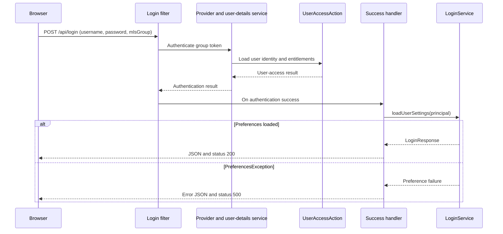
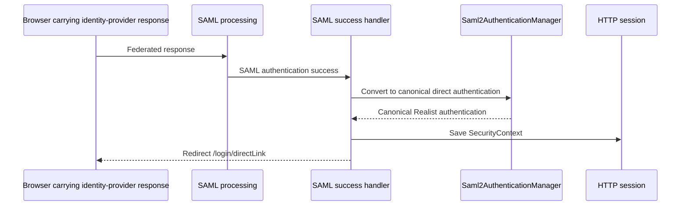

# Authentication and authorization

[Main project context](../project-context.md) · [Parent: Cross-cutting](index.md) · [Login lifecycle](../feature-flows/login-and-session-lifecycle.md) · [Redis](redis-caching-and-sessions.md) · [Configuration](configuration-and-feature-flags.md)

**Research baseline:** `RP-10188`, revision `a6f611ae0`, 2026-09-25. **Verified** = source-inspected/Confirmed, not executed behavior; **Inferred** = a source-supported conclusion requiring runtime confirmation; **Unknown** = missing or unreviewed evidence. No login, test, or external call was executed.

**Local citation prefixes:**

- `W/` = `realist\web\src\main\java\com\facl\uaf\realist\`
- `C/` = `uaf-common\action\src\main\java\com\facl\uaf\common\shared\`
- `F/` = `phoenix\src\app\`
- `R/` = `realist\web\src\main\resources\`
- `WT/` = `realist\web\src\test\java\com\facl\uaf\realist\`

Suffixes identify repository-relative files; `:n–m` identifies source lines.

## Summary

Authentication establishes the caller's identity. Authorization determines what that identity may do. Realist has several incoming authentication paths; none should be confused with the outbound OAuth credentials used to call other services. MLS means Multiple Listing Service; `mlsGroup` supplies the group context for the login, not merely a UI label.

## Current security chains

**Verified:** `W/rest/security/configuration/MultipleLoginSecurityConfig.java` defines:

| Order | Profiles | Scope and important differences |
| --- | --- | --- |
| 0 | `ping`, `dr`, `reg`, `prd`, `uat` | Matches `/ping/**` and `/success`; Ping OpenToken processing |
| 1 | `dr`, `reg`, `prd`, `uat` | Production-style main chain; selected test endpoints/pages require `ADMIN` |
| 2 | `default`, `local`, `sbx`, `dev`, `prf`, `int` | Preproduction main chain; explicitly permits `/api/tests/**` and selected development/direct-link paths |

Evidence: `W/rest/security/configuration/MultipleLoginSecurityConfig.java:139–246,271–372,397–442`.

Both main chains:

- Deny `/env` and `/actuator/env`.
- Permit specified static resources and frontend routes.
- Require authentication for `/api/**`, `/pdf/report/**`, and parcel-map paths, subject to earlier exceptions.
- Register standard-login, direct-link, SAML, and logout processing.
- Disable Cross-Site Request Forgery (CSRF) protection.
- Configure Content Security Policy (CSP) from `http.security.contentSecurityPolicy.allowedFrom`.
- Disable frame-options headers.

**Watch point — Verified:** static-file-extension rules precede protected API rules. New endpoints must be checked against matcher order rather than assuming every `/api/` URL receives the same treatment.

**Watch point — Verified:** `prod` and `production` are bootstrap-fallback guard names, not the production main-chain profile names. Activating `prod` is not equivalent to activating `prd`. The fallback processor is a configuration-decryption concern, not an alternate authentication chain (`W/config/LocalConfigKeystoreEnvironmentPostProcessor.java:54–63,91–99,129–138`).

**Unknown:** the deployed combination of profiles. A profile named `ping` alone establishes the scoped Ping chain; it does not prove that either main chain is selected.

## Incoming paths

### Standard login

**Verified:** POST `/api/login` is handled by `MlsGroupAuthenticationFilter`, not a normal login controller. It reads JSON fields `username`, `password`, and `mlsGroup`, then delegates through:

`MlsAuthenticationProvider → MlsGroupUserDetailsService.loadUser → UserAccessAction`

Sources:

- `W/rest/security/filters/MlsGroupAuthenticationFilter.java:24–46`
- `W/rest/security/providers/MlsAuthenticationProvider.java:19–41`
- `W/rest/security/services/MlsGroupUserDetailsService.java:33–40`
- Filter registration: `W/rest/security/configuration/MultipleLoginSecurityConfig.java:128–136`

The external user-access delegate supplies identity and entitlement information. The success handler subsequently loads preferences and application settings, so “authentication succeeded” does not guarantee that application initialization succeeded.

The sequence deliberately separates identity validation from post-login initialization; it does not depict provider internals. Its inputs are field names only, not credentials. Evidence is the filter/provider chain above and `W/rest/security/handlers/PhoenixAuthenticationSuccessHandler.java:33–53`. Malformed login JSON is a separate filter failure (`W/rest/security/filters/MlsGroupAuthenticationFilter.java:39–46`).

### SAML

**Verified:** SAML—Security Assertion Markup Language—accepts an identity-provider assertion, translates its attributes into Realist's canonical direct-login identity, saves that security context to the HTTP session, and redirects to `/login/directLink`.

This shows the successful conversion/session boundary, not every SAML validation branch. Failure before conversion must not be diagnosed as a frontend route failure. The HTTP session uses Redis under the inspected local configuration; that backing store is configuration-dependent, not a separate assertion in the sequence.

Evidence:

- `W/controller/SamlController.java:80–154`
- `W/rest/security/services/saml2/Saml2AuthenticationManager.java:81–164`
- `W/rest/security/services/saml2/CustomSaml2AuthenticationSuccessHandler.java:61–90`
- Local backing: `R/application-local.yml:785–789`

The old `CustomSamlAuthenticationRequestFilter.java` is commented-out code, not evidence of the active implementation. Request/RelayState correlation has its own five-minute Redis lifetime; see [SAML correlation](redis-caching-and-sessions.md#saml-correlation).

### Ping

**Verified:** `/success` uses the Ping agent to read an OpenToken and checks membership against a configured directory group. Failure redirects to `/401.html` (`W/rest/security/filters/PingFederateAuthenticationFilter.java:36–72`).

This path should not be described as the same protocol or canonical-principal conversion as SAML.

### Direct links

**Verified:** there are distinct mechanisms:

- GET `/pdf/report` receives the direct-link authentication filter.
- `/spring/propertylink` processes incoming property-link data, outage rules, secure-link preferences, and token validation.
- `/api/directLogin` restores application data from existing session/direct-link state; its name does not mean it independently validates a supplied password.

Sources: `W/rest/security/configuration/MultipleLoginSecurityConfig.java:116–125`; `W/controller/LoginController.java:119–245`; `W/rest/controller/LoginAllData.java:99–128`.

Shared-snapshot link creation is a separate feature, not synonymous with these login mechanisms. No recipient-facing reader or lead-capture execution path was found in the inspected source, so public/anonymous reader authorization is not established. See the [shared-report evidence boundary](../feature-flows/shared-report-links.md).

## Authorization and EULA

**Verified:** Angular's `AuthGuard` checks frontend state and a browser restoration marker. It is not server authorization. `EulaGuard` loads the End User License Agreement (EULA) and asks for acceptance; refusal dispatches logout.

Sources: `F/shared/guards/auth.guard.ts:22–60`; `F/shared/guards/eula.guard.ts:28–54`; `F/store/user/user.effects.ts:262–267`.

Feature switches, user entitlements, property coverage, and purchase/credit requirements remain separate decisions. See [report availability](../frontend/reports/availability-and-access-rules.md).

**Unknown:** a universal server-side EULA enforcement rule was not established by this review. Do not treat the route guard as proof of such a rule.

## Cookies, sessions, restoration, and logout

**Verified:**

- Main chains persist security context through `HttpSessionSecurityContextRepository`.
- Local configuration declares Redis-backed sessions.
- A cookie helper appends `SameSite=None` or `SameSite=Lax` based on request URL, and may append the literal `Secure=true`.
- Local cookie configuration separately declares `same-site: none` and `secure: true`.
- CSRF is explicitly disabled, including in the Ping chain.

Sources: `W/rest/security/configuration/MultipleLoginSecurityConfig.java:65–68,163–168,243,369,418`; `C/util/UAFCommonUtil.java:1444–1469`; `R/application-local.yml:635–638,785–789`.

**Inferred:** cookie behavior can vary behind TLS termination or local HTTP proxying. Inspect actual response headers and browser acceptance before attributing login loops to credentials.

**Verified discrepancy:** `PreSessionDeserializationErrorFilter` clears `JSESSIONID`, while security integration tests expect a `SESSION` cookie. This is a recovery-path concern, not proof that every session fails.

Sources: `W/rest/security/filters/PreSessionDeserializationErrorFilter.java:24–48`; `WT/rest/controller/SecurityConfigIntegrationTest.java:121–134`.

**Verified:** browser restoration and warning timers are separate from server session expiry. The restart effect calls `keepSession`, reads runtime timeout/warning settings, and initializes a timer. The warning dialog chooses keep-session or logout; this UI behavior cannot resurrect an already-invalid server session (`F/store/user/user.effects.ts:167–216,350–404`). Server idle lifetime is configured through `spring.session.timeout`; do not infer it from the warning countdown alone (`R/application-local.yml:785–789`).

**Verified:** both main chains configure `/api/logout` and an HTTP-200 logout-success handler. The custom `PhoenixLogoutHandler` calls `UserAccessAction.doLogout` and logs a `ServletException`; Ping separately uses `/ping/logout` with a redirect to `/`. Evidence: `W/rest/security/configuration/MultipleLoginSecurityConfig.java:239–243,365–369,424–426`; `W/rest/security/handlers/PhoenixLogoutHandler.java:24–31`.

**Unknown:** provider-side logout guarantees and deployed timeout/cookie settings. An HTTP-200 logout response alone does not prove all external identity-provider sessions were destroyed. See the [login lifecycle](../feature-flows/login-and-session-lifecycle.md) for the complete browser flow.

## Outbound OAuth is separate

**Verified:** CLIP lookup and store registrations use `CLIENT_CREDENTIALS`. These identify the application when it calls providers; they do not authenticate the browser user (`W/rest/security/configuration/Oauth2Config.java:34–70`).

Likewise, configuration-server credentials and configuration-decryption material are neither browser authentication nor SAML signing/decryption credentials. See [configuration](configuration-and-feature-flags.md).

## Debugging and next checks

| Symptom | Source-backed check |
| --- | --- |
| Credentials accepted, then login returns 500 | `PhoenixAuthenticationSuccessHandler` preference-error branch, then `LoginService`; separate upstream authentication from preference initialization |
| Only one environment exposes a test route | Active profile combination and ordered matchers in `MultipleLoginSecurityConfig`, including earlier static-extension exceptions |
| SAML redirect fails after identity-provider success | Registration/attribute conversion, Redis correlation expiry, explicit context save, accepted session cookie |
| Browser reload loses access | `/api/directLogin` session state, browser marker versus real server session, cookie recovery-name discrepancy |
| User sees a menu but cannot open a report | Separate server authentication, feature switch, entitlement, coverage, and payment decisions |

- Confirm deployed active-profile combinations and cookie/header behavior; never collect credentials or raw assertions in support notes.
- Verify expired-session and missing-session responses on `/api/directLogin`.
- Review `W/rest/security/services/SpringSecurityAuthenticationService.java:26–30`: `getUserAccess` contains `true || isAuthenticated()`, so it always attempts session lookup.
- Review security tests before changing matchers; test source is evidence of intended cases, not proof of deployed enforcement.
- **Unknown:** runtime outcomes for the above discrepancies. This documentation records current source, not security fixes or an executed penetration test.
