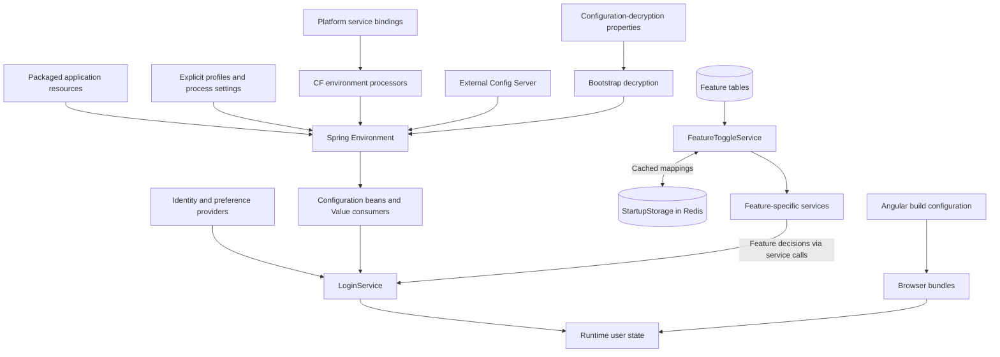
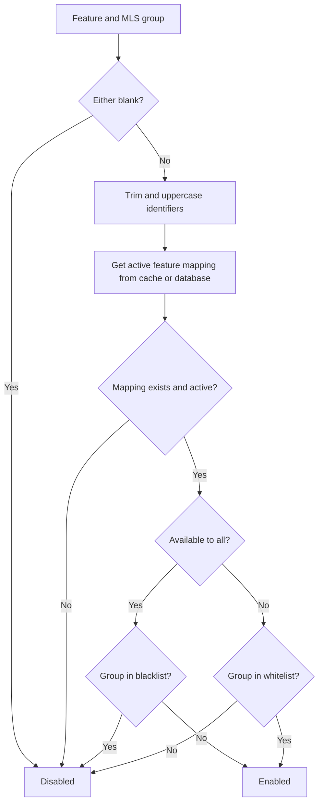

# Configuration and feature flags

[Main project context](../project-context.md) · [Parent: Cross-cutting](index.md) · [Authentication](authentication-and-authorization.md) · [Database](database-and-migrations.md) · [Local setup](../development/local-setup.md)

**Research baseline:** `RP-10188`, revision `a6f611ae0`, 2026-09-25. **Verified** = source-inspected/Confirmed, not resolved runtime configuration; **Inferred** = a source-supported conclusion needing confirmation; **Unknown** = unavailable or unreviewed evidence. No configuration server, credential store, keystore contents, application process, build, or test was accessed/executed.

**Local citation prefixes:**

- `W/` = `realist\web\src\main\java\com\facl\uaf\realist\`
- `C/` = `uaf-common\action\src\main\java\com\facl\uaf\common\shared\`
- `F/` = `phoenix\src\app\`
- `SQL/` = `realist\web\src\main\resources\db\migration\`
- `R/` = `realist\web\src\main\resources\`

Append suffixes to obtain repository-relative source paths; `:n–m` identifies lines. Only key names and conceptual sources are documented; no resolved credential, cipher, or key material is included.

## Summary

Realist configuration comes from packaged resources, profile selection, platform/config-server integration, database switches, and user-specific provider data. Angular's build configuration is only one layer.

A **profile** selects server configuration/beans. A **feature flag** determines availability for a feature/group. A **user entitlement** is an access decision supplied or interpreted for a user. A **build-time replacement** changes the shipped browser bundle. These mechanisms can combine but are not interchangeable.

## Configuration sources

This is a **source map, not a universal precedence chart**. The runtime-settings path and browser-build path meet in the UI; neither replaces the other. Feature decisions reach login through feature-specific services, not a claimed direct `LoginService → FeatureToggleService` call. Redis caches mappings; PostgreSQL owns those rows. Effective deployed overrides remain **Unknown**.

Evidence:

- Bootstrap/dependency/source registration: `build.gradle:5–14,188–201`; `R/META-INF/spring.factories:1–5`; `W/config/KeystoreCfEnvProcessor.java:30–74`.
- Feature/cache loading: `W/rest/service/FeatureToggleService.java:42–43,52–115`.
- Ecom feature consumer and login enrichment: `W/rest/service/ecommerce/EcomService.java:72,102`; `W/rest/service/LoginService.java:347–447`.
- Runtime browser state: `F/store/user/user.reducer.ts:58–148`.
- Build replacements: `phoenix\angular.json:84–111,256–284`.

## Bootstrap and platform behavior

**Verified:**

- Root build declares Spring Boot `3.5.15` and Spring Cloud `2025.0.3`. These are declared versions, not a report of resolved or installed artifacts.
- Config-client, bootstrap, Spring Cloud Services, and CF environment dependencies are declared.
- `META-INF/spring.factories` registers the local fallback environment processor and keystore service-binding processor.
- `KeystoreCfEnvProcessor` maps qualifying service credentials to `encrypt.key-store.*` and legacy `encrypt.keyStore.*` names.
- A build-only dependency supplies a specific production configuration-decryption resource during `processResources`; that old starter is not thereby restored to the runtime classpath.

Sources: `build.gradle:5–14,188–201`; `R/META-INF/spring.factories:1–5`; `W/config/KeystoreCfEnvProcessor.java:30–74`; `realist\web\build.gradle:59–81,95`.

CF here refers to Cloud Foundry environment/service-binding integration. Presence of those processors does not establish the full hosting topology or exact deployed bindings.

**Security distinction:** configuration decryption makes encrypted application properties usable during bootstrap. SAML signing/decryption credentials concern federated assertions/messages. Outbound OAuth credentials identify provider clients, and browser sessions identify incoming users. Do not exchange their key locations, treat them as the same lifecycle, or copy secret values into troubleshooting notes.

## Profile mismatch to remember

**Verified:** the local fallback is suppressed when Cloud Foundry is detected, an existing keystore-location property is present, or an active profile is `prod`/`production`.

Source: `W/config/LocalConfigKeystoreEnvironmentPostProcessor.java:54–63,91–99,129–138`.

Main security instead uses `prd`, `uat`, `reg`, and `dr` for its production-style chain. These decisions are not aligned by a shared profile list.

| Decision | Recognized profiles / condition | Meaning |
| --- | --- | --- |
| Configuration-decryption fallback suppression | `prod`, `production`; platform detection or existing location also suppresses | Prevents installing the local fallback in these circumstances |
| Production-style main security chain | `dr`, `reg`, `prd`, `uat` | Main-chain authentication and selected admin-only routes |
| Preproduction main security chain | `default`, `local`, `sbx`, `dev`, `prf`, `int` | Different permitted test/development routes |
| Scoped Ping chain | `ping`, `dr`, `reg`, `prd`, `uat` | `/ping/**` and `/success`, not a universal main-chain profile |
| Angular `production` build configuration | Workspace build selection, not a Spring profile | Build-time environment file replacement and bundle settings |

Security evidence: `W/rest/security/configuration/MultipleLoginSecurityConfig.java:139–246,271–372,397–442`. Angular evidence: `phoenix\angular.json:84–111`.

**Inferred:** an off-platform process using `prd` without explicit decryption configuration can behave differently from what a developer expects from the word “production.” Confirm the intended profile contract before deployment changes. Conversely, a profile named `prod` is not evidence that the `prd` security chain is active.

**Unknown:** deployed profile combinations and external override ordering. Do not treat a repository `application-local.yml` declaration as proof of production behavior.

## Build-time versus runtime configuration

| Layer | When it takes effect | Source-backed consequence |
| --- | --- | --- |
| Angular workspace replacement | Browser build | Main app replaces `src/environments/environment.ts` with its production counterpart; User Guide has its own replacement (`phoenix\angular.json:84–90,256–262`) |
| Resource packaging | `processResources` | Build-only decryption resource handling differs from runtime dependency inclusion (`realist\web\build.gradle:59–81,95`) |
| Spring profiles, property sources and binding processors | Server bootstrap/runtime consumption | Changes configuration beans and security-chain selection; not automatically a browser rebuild |
| User preferences, templates and login data | Login and after-login responses | Populate browser state for the current user/group (`W/rest/service/LoginService.java:192–260,347–447`) |
| Database feature mappings and cache | Service lookup, then cache retention/eviction | A row update need not be visible until the cached mapping is replaced (`W/rest/service/FeatureToggleService.java:72–104`) |

No hot-reload, automatic cache invalidation, or dynamic refresh guarantee is inferred from the mere presence of Spring Cloud dependencies.

## Runtime UI configuration

**Verified:** `LoginService` combines provider login results, preferences/templates, geography, navigation, report settings, and user-experience information. Additional data arrives after login.

Sources: `W/rest/service/LoginService.java:192–260,347–447`.

Angular's reducer stores these values in user state, including access maps, templates, navigation, and later report-sharing availability (`F/store/user/user.reducer.ts:58–148`).

Consequently, a missing field or menu can be caused by runtime user/MLS configuration, not just a missing Angular component. MLS means Multiple Listing Service. Compare sanitized response field presence and feature decisions before assuming a bundle regression.

The after-login response also exposes browser timeout/warning durations (`W/rest/service/LoginService.java:445–447`). These UI timers are not themselves the server's session lifetime; see [authentication](authentication-and-authorization.md#cookies-sessions-restoration-and-logout).

## Database feature switches

**Verified:** `FeatureToggleService.isFeatureEnabledForMls`:

1. Rejects blank feature/group identifiers.
2. Trims and normalizes identifiers to uppercase.
3. Returns false for missing/inactive features.
4. For “available to all,” excludes blacklist entries.
5. Otherwise requires whitelist membership.

Source: `W/rest/service/FeatureToggleService.java:52–65,107–115`.

The diagram shows feature availability, **not** the complete report-authorization or data-coverage decision. It follows `W/rest/service/FeatureToggleService.java:52–65`; comma-separated list normalization is at `:107–115`. Whitelist and blacklist are alternate branches, not two sequential tests.

Active mappings are loaded from PostgreSQL and cached through `StartupStorage`; eviction is explicit (`W/rest/service/FeatureToggleService.java:72–104`). Eviction catches/logs failures; cache-write failure is logged after database loading. This does not establish universal graceful fallback for every Redis read exception.

Migrations seed `SharedLink`, then `Ecom` and `Branding`, initially disabled:

- `SQL/V20260710120000__create_mls_feature_toggle.sql:34–40`
- `SQL/V20260804120000__add_ecom_branding_mls_feature.sql:1–9`

**Unknown:** deployed switch values. Migration defaults do not establish current environment availability.

**Verified:** `EcomProperties.enabled` and `mlsEnabled` are marked obsolete; do not assume they remain the feature authority (`W/config/EcomProperties.java:9–16`). Ecom calls `FeatureToggleService` at `W/rest/service/ecommerce/EcomService.java:102`; sharing has its own consumer at `W/rest/service/sharedlink/SharedLinkFeatureService.java:28–37`.

## Key families to inspect safely

| Keys | Purpose / source to start from |
| --- | --- |
| `spring.session.*`, `session.timeout.*` | Server idle interval versus browser timing; `R/application-local.yml:785–789`; `W/rest/service/LoginService.java:139–144,445–447` |
| `spring.data.redis.*`, `cache.*` | Connection versus cache/serialization behavior; `C/configuration/RedisConfiguration.java:38–90`; Redis connection values are not reproduced |
| `saml.*`, `direct-link.sso.enabled` | SSO registration/routing; `W/rest/security/services/saml2/CustomRelyingPartyRegistrationRepository.java:74–82,126`; `W/controller/SamlController.java:39` |
| `pingfederate.*` | OpenToken agent and group-check configuration; `W/rest/security/configuration/properties/PingFederateProperties.java:15–60` |
| `http.security.contentSecurityPolicy.allowedFrom` | CSP declaration consumed by the main security chains; `W/rest/security/configuration/MultipleLoginSecurityConfig.java:139–246,271–372` |
| `data-api.*`, `pdf.url`, `storeapiservice.url`, `rcsl.*`, `spatial-api.*` | Provider client configuration; see the [integration evidence map](external-integrations.md#evidence-map) |
| `encrypt.key-store.*`, legacy `encrypt.keyStore.*` | Configuration-decryption bootstrap properties, not SAML assertion credentials; `W/config/KeystoreCfEnvProcessor.java:30–74` |
| `shared-report-link.cleanup.*` | Cleanup scheduling, enablement, batch/grace/lease behavior; `W/rest/service/sharedlink/SharedLinkCleanupService.java:57–89` |

Never copy resolved credentials, tokens, cipher values, real account configuration, or service-binding payloads into documentation.

## Debugging and next checks

| Symptom | Targeted investigation |
| --- | --- |
| Bootstrap decryption fails | Which property processor ran, platform detection, active profiles, canonical/legacy property presence; do not inspect or print key material |
| Profile change unexpectedly changes endpoint access | Compare security-chain profile lists and matcher order; do not substitute `prod` for `prd` |
| Feature row updated but menu stays stale | Active row and normalized group, cache eviction outcome, subsequent login/after-login state; distinguish server state from an already-open browser |
| Menu differs between users | Runtime templates/access/navigation and feature-specific service decisions before build-time configuration |
| Feature enabled but report denied/empty | Entitlement, purchase/credits, provider coverage and server enforcement are independent; see [report access rules](../frontend/reports/availability-and-access-rules.md) |
| Session warning does not match expiry | Compare browser timing fields to server session configuration and accepted cookie |

**Unknown:** how the external admin deployment triggers cache eviction after updating feature rows. The comment at `W/rest/service/FeatureToggleService.java:67–70` identifies that expectation; it does not prove external wiring exists.

**Unknown:** effective deployed overrides, binding contents, feature-row values, and configuration refresh/restart procedures. Ask the platform/admin owners for sanitized provenance and process details rather than requesting secret values. This page documents source contracts, not validated operational settings.
