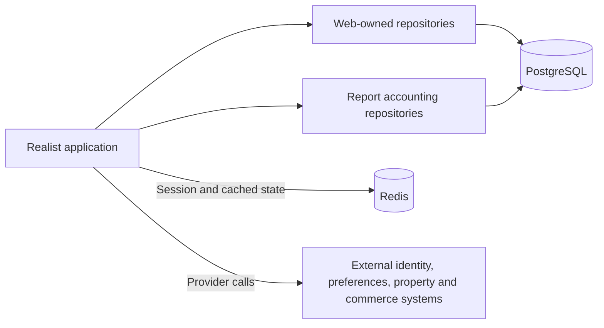
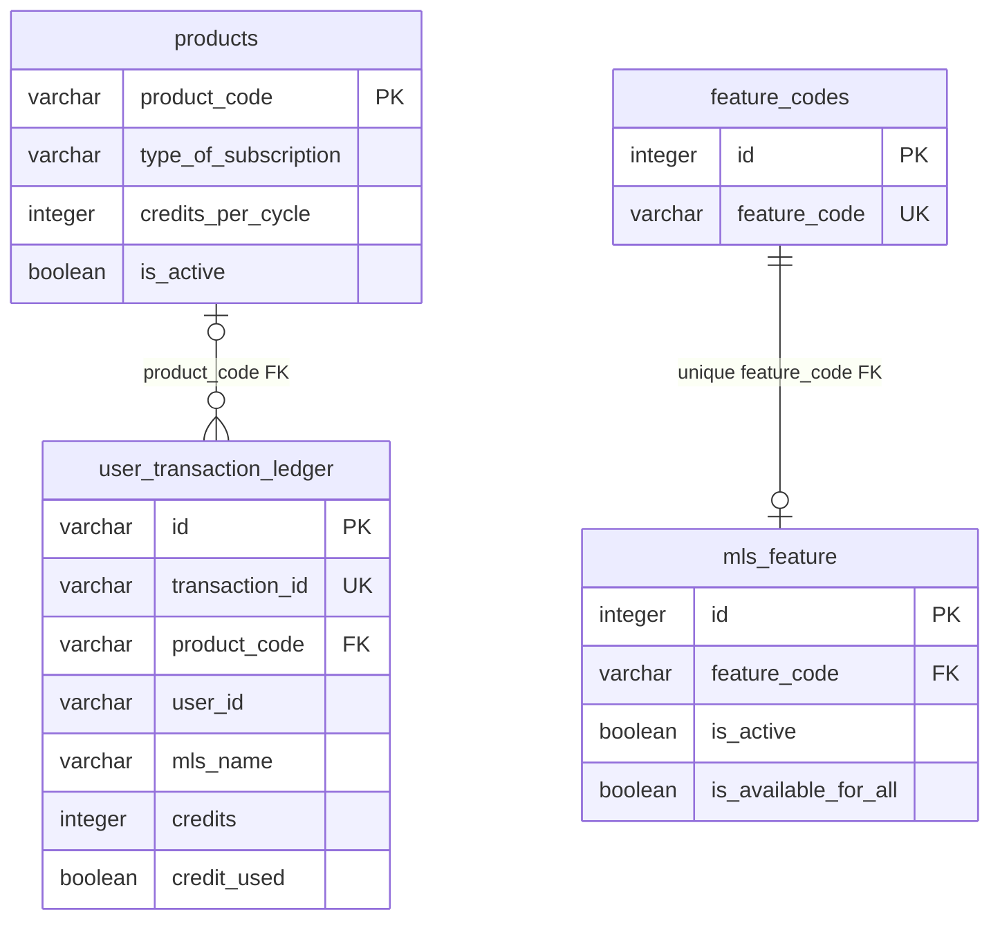
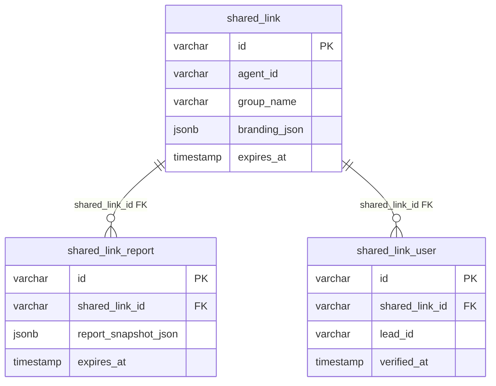

# Database and migrations

[Main project context](../project-context.md) · [Parent: Cross-cutting](index.md) · [Redis](redis-caching-and-sessions.md) · [Commerce](../feature-flows/cart-checkout-and-report-credits.md) · [Shared links](../feature-flows/shared-report-links.md)

**Research baseline:** `RP-10188`, revision `a6f611ae0`, 2026-09-25. **Verified** = source-inspected/Confirmed, not an executed migration or inspected live database; **Inferred** = source-supported interpretation; **Unknown** = unavailable or unreviewed evidence. No database connection, migration, build, or test was run.

**Local citation prefixes:**

- `W/` = `realist\web\src\main\java\com\facl\uaf\realist\`
- `P/` = `uaf-reports\action\src\main\java\com\facl\uaf\report\`
- `SQL/` = `realist\web\src\main\resources\db\migration\`
- `R/` = `realist\web\src\main\resources\`
- `WT/` = `realist\web\src\test\java\com\facl\uaf\realist\`

Append citation suffixes to these repository-relative directories; numbers after `:` are source lines.

## Summary and concepts

PostgreSQL stores application-owned operational records, report accounting, feature configuration, and shared-report snapshots. It is not demonstrated to contain the upstream property-search database or the complete external identity/preference systems.

An **entity** maps Java state to a table; a **repository** defines persistence operations and queries. **Flyway migrations** evolve the physical schema over time. The current schema is the cumulative result of migrations, not whichever entity or original CREATE statement a developer opens first. A foreign key (FK) is an enforced SQL relationship; matching identifiers or a Java comment alone do not create one.

## Ownership

**Verified:** the executable application scans:

- Web entities under `com.facl.uaf.realist.rest.model`.
- Report/accounting entities under `com.facl.uaf.report.entity`.
- Corresponding web and report repository packages.

Source: `W/Application.java:14–21`.

The diagram separates application records from provider-owned information; it does not assert a provider's database technology or a separate deployment for each library. Repository scan evidence is `W/Application.java:14–21`; local-versus-provider cart behavior is `W/rest/service/CartService.java:50–83` and `W/store/StoreApiClient.java:57–68`. Redis ownership is explained in [its chapter](redis-caching-and-sessions.md).

**Verified:** `CartService.saveForLater` uses local `CartRepository`; active cart retrieval calls the external store client. “The cart database” would therefore be an ambiguous description. Similarly, a persisted report snapshot is a captured copy, not the upstream property's authoritative record.

## Entities and repositories: where to change or debug

| Area | Java mapping and repository | Important responsibility |
| --- | --- | --- |
| Saved-for-later items | `W/rest/model/store/entity/Carts.java:20–21`; `W/repository/CartRepository.java:9–12` | Maps `carts`; retrieves saved rows by user ID; not the remote active cart |
| Local commerce records | `W/rest/model/store/entity/Orders.java:17–18`; `W/rest/model/store/entity/UserIdentity.java:22–23`; `W/rest/model/store/entity/PriceProduct.java:17–18` | Maps orders, identity linkage, and group/product pricing; identity linkage is not a local password authority |
| Active feature rules | `W/rest/model/ecom/entity/MlsFeature.java:27–28`; `W/repository/MlsFeatureRepository.java:9–12` | `findAllByIsActiveTrue` supplies feature-rule loading; service/cache interpretation is separate |
| Report limits | `P/entity/ReportLimit.java:13–14`; `P/entity/ReportLimitId.java:14–32`; `P/repository/ReportLimitRepository.java:9` | Composite identity: user, feature, MLS, month, year |
| Report usage | `P/entity/ReportUsage.java:18–19`; `P/repository/ReportUsageRepository.java:12–49` | Looks up usage by user/group/feature/period/APN, with document-search or product-specific variants |
| Products and ledger | `P/entity/Product.java:20–21`; `P/entity/UserTransactionLedger.java:20–42`; `P/repository/ProductRepository.java:13–14`; `P/repository/UserTransactionLedgerRepository.java:15–86` | Active product lookup, transaction history/existence checks, and credit aggregation |
| Shared reports | `W/rest/model/sharedlink/entity/SharedLinkReport.java:21–55`; `W/repository/sharedlink/SharedLinkRepository.java:23–64` | String link IDs, JSONB snapshots, bounded expired-link lookup, metadata archival and deletion |
| Operational/enrichment records | `W/rest/model/announcements/entity/Announcements.java:16–17`; `W/rest/model/outpagepage/entity/OutagePage.java:18–19`; `W/rest/model/report/entity/AiSummary.java:16–17` | Local announcements, outage presentation, and cached summaries, not upstream source databases |

The unusual `outpagepage` package spelling above matches source.

**Verified:** `SharedLinkReport.sharedLinkId` is a scalar `String`, not an ORM parent association; `reportSnapshotJson` uses `@JdbcTypeCode(SqlTypes.JSON)` and `columnDefinition = "jsonb"` (`W/rest/model/sharedlink/entity/SharedLinkReport.java:35–46`). This does **not** remove the SQL FK described below. Java association/cascade semantics and database constraints are distinct.

### Mapping discrepancies worth checking

- **Verified:** `UserTransactionLedger.id` is a `String` and its DDL column is `VARCHAR(255)`, while `UserTransactionLedgerRepository` declares `JpaRepository<UserTransactionLedger, UUID>`. Evidence: `P/entity/UserTransactionLedger.java:23–26`; `P/repository/UserTransactionLedgerRepository.java:15`; `SQL/V20260205120000__create_user_transaction_ledger.sql:1–3`. **Unknown:** which inherited ID-based operations, if any, encounter this mismatch at runtime. Do not infer that all custom ledger queries fail.
- **Verified:** `ReportLimitId.userId` declares length 50, while the later migration widens the SQL column to 100 (`P/entity/ReportLimitId.java:19–20`; `SQL/V20260128120000__alter_report_user_id_to_varchar.sql:1–3`). **Unknown:** deployed schema-validation and input behavior for longer identifiers. Inspect both mappings and migrations before changing limits.

These are documented source discrepancies, not changes made by this documentation task.

## Cumulative schema

**Verified:** migration history contains these current table families:

| Family | Tables | Business meaning and migration evidence |
| --- | --- | --- |
| Commerce support | `carts`, `orders`, `useridentity`, `price_product` | Saved items, local order records, customer identity linkage, group-specific pricing; `SQL/V20211101111820__init.sql:1–39`, `SQL/V20211203143926__create_price_override_table.sql:1–11` |
| Operational content | `outage_page`, `reverse_links`, `announcements`, `users_announcements_tracking`, `agent` | Availability messaging, destination links, announcement/read tracking, agent records; `SQL/V20220524125026__create_outage_page.sql:1`, `SQL/V20220603094537__reverse_links.sql:1–6`, `SQL/V20220607135210__create_announcements.sql:1–40`, `SQL/V20250728101029__create_agent.sql:1–9` |
| Report accounting | `report_limits`, `report_usage`, `user_transaction_ledger`, `products` | Limits, usage evidence, financial/credit transactions, subscription-credit catalogue; `SQL/V20260119090329__report_limits.sql:1–49`, `SQL/V20260205120000__create_user_transaction_ledger.sql:1–18`, `SQL/V20260511205500__create_products_table.sql:1–13` |
| Enrichment/configuration | `ai_summary`, `mls_osn`, `feature_codes`, `mls_feature` | Cached summaries, commerce organization mapping, feature catalogue and availability; `SQL/V20260505120000__create_ai_summary.sql:1–11`, `SQL/V20260525150000__create_mls_osn.sql:1–11`, `SQL/V20260710120000__create_mls_feature_toggle.sql:1–32` |
| Sharing | `shared_link`, `shared_link_report`, `shared_link_user` and their three `_archive` tables | Shared links, report snapshots, recipient records, historical metadata; `SQL/V20260723120000__create_shared_link_tables.sql:18–170` |

Important cumulative changes:

| Change | Source |
| --- | --- |
| `creditcards` and its identity FK were removed; an old class/file name is not evidence of a current table | `SQL/V20230309082834__drop_creditcards.sql:1–7` |
| `price_product` gained a group/product uniqueness constraint | `SQL/V20220406074352__add_constraint_price_product.sql:1–3` |
| `outage_page.enabled` became `outage_active` | `SQL/V20220526173108__update_outage_page_schema.sql:1–2` |
| Agent records gained `UserId`, then an MLS/user index | `SQL/V20250919173729__update_agent.sql:1`; `SQL/V20250925234729__agent_userid_index.sql:1–2` |
| Report user IDs changed from numeric to `VARCHAR(100)` | `SQL/V20260119090329__report_limits.sql:1–39`; `SQL/V20260128120000__alter_report_user_id_to_varchar.sql:1–3` |
| `report_usage.custom_attributes` became JSONB, followed by GIN and expression indexes | `SQL/V20260128151000__alter_custom_attributes_to_jsonb.sql:1`; `SQL/V20260130100000__add_jsonb_indexes_report_usage.sql:1–3`; `SQL/V20260203100000__add_product_id_index_report_usage.sql:1` |
| Ledger records gained property fields, product/credit fields, and `credit_used` | `SQL/V20260425090000__alter_user_transaction_ledger_add_property_fields.sql:1–6`; `SQL/V20260511210000__alter_user_transaction_ledger_add_product_credit_fields.sql:1–19`; `SQL/V20260524210000__alter_user_transaction_ledger_add_credit_used.sql:1–4` |
| `ai_summary.property_id` widened to 50 characters | `SQL/V20260520100000__alter_ai_summary_property_id_length.sql:1–2` |
| Product-data migrations populate/change credit allocations; `products` gained `updated_by` | `SQL/V20260514120000__populate_products_table.sql:1`; `SQL/V20260701000000__update_products_credits.sql:1`; `SQL/V20260701010000__alter_products_add_updated_by.sql:1` |
| Feature seeds introduced `SharedLink`, then `Ecom` and `Branding`, initially disabled | `SQL/V20260710120000__create_mls_feature_toggle.sql:34–40`; `SQL/V20260804120000__add_ecom_branding_mls_feature.sql:1–9` |

These changes mean early CREATE statements alone are not an accurate schema description. Data migrations also affect behavior; their initial values do not prove the current contents of a deployed database.

## Enforced relationships

### Accounting and flags

**Verified:** only the relationships shown below are asserted by the cited DDL. The diagrams are focused subsets, not every column or index.

Ledger `product_code` is nullable; therefore not every ledger row must reference a product. A feature can lack a rule row; a rule must reference one feature, and the unique feature-code constraint prevents multiple rule rows for the same feature. MLS allow/deny lists are interpreted by the service; the ER diagram does not invent one rule row per MLS.

Sources:

- `SQL/V20260205120000__create_user_transaction_ledger.sql:1–13`
- `SQL/V20260511205500__create_products_table.sql:1–13`
- `SQL/V20260511210000__alter_user_transaction_ledger_add_product_credit_fields.sql:1–19`
- `SQL/V20260524210000__alter_user_transaction_ledger_add_credit_used.sql:1–4`
- `SQL/V20260710120000__create_mls_feature_toggle.sql:1–22`

### Shared links

Each report/recipient row has a required parent link; a link can have zero or more of either. **Verified:** `REFERENCES shared_link(id)` appears at migration lines 58 and 82. Comments calling these “logical FK” do not override the actual constraints. The `(shared_link_id, lead_id)` uniqueness constraint is separate from the parent relationship.

This establishes schema capacity for recipient records, not an implemented recipient reader or lead-capture flow. Those execution paths were not found in the inspected local sharing source; see the [sharing evidence boundary](../feature-flows/shared-report-links.md).

Source: `SQL/V20260723120000__create_shared_link_tables.sql:18–89`. No cascading-delete relationship is asserted by this diagram; inspect the service's deletion order before changing cleanup.

## Logical references are not SQL foreign keys

**Verified:**

- Shared-link `agent_id` is explicitly a logical user reference.
- Archive `shared_link_id` columns have no FK.
- Announcement tracking uses `content_id` without an enforced announcement FK.
- Report limits and usage share user/feature/MLS/time identifiers but have no FK between their rows in the inspected migrations.
- APN (Assessor's Parcel Number), CLIP (provider property identifier), county, user, and MLS identifiers do not establish local property/user parent tables.

Archive tables retain primary keys but intentionally omit the heavy branding/report JSON payloads. They are not complete report backups.

Sources: `SQL/V20260723120000__create_shared_link_tables.sql:41,109–170`; `SQL/V20220607135210__create_announcements.sql:22–40`; `SQL/V20260119090329__report_limits.sql:1–49`.

**Verified:** `SharedLinkRepository.archiveById` copies metadata, excluding branding JSON; expired lookup is bounded through `Pageable`. Cleanup selects a bounded batch, delegates each deletion, catches per-link runtime failures, and continues (`W/repository/sharedlink/SharedLinkRepository.java:26–64`; `W/rest/service/sharedlink/SharedLinkCleanupService.java:57–95`). The scheduler's lock is Redis-backed, not a missing SQL lock table; see [distributed scheduling](redis-caching-and-sessions.md#distributed-scheduling).

## Migration/runtime boundaries

**Verified:**

- Flyway and PostgreSQL dependencies are declared in `realist\web\build.gradle:174–177`.
- Local configuration uses Hibernate `validate`, not automatic schema creation.
- Older migrations use `${defaultSchema}`; newer migrations commonly use unqualified names.
- Local configuration sets the placeholder and Hibernate default schema to `public`.

Configuration evidence: `R/application-local.yml:759–770`. SQL examples: `SQL/V20211101111820__init.sql:1`, `SQL/V20260119090329__report_limits.sql:1`.

**Watch point:** setting a placeholder is not itself proof that every unqualified SQL statement uses the intended schema in every deployment. Hibernate validation is not a replacement for applying migrations, and entities do not express every SQL constraint, trigger, or index.

## Debugging and unknowns

| Symptom | First checks, without changing data |
| --- | --- |
| Startup says table/column/type missing | Failing entity mapping, cumulative migration introducing or changing the object, effective schema/search path; ask the database owner for sanitized Flyway history |
| Credit/usage result appears duplicated or absent | Repository predicate and composite identifiers; distinguish ledger, usage evidence, product catalogue, and remote entitlement |
| Saved item exists but active cart does not show it | Local `CartRepository` versus external store ownership; follow the commerce flow |
| Shared-link cleanup fails on a parent delete | Actual child FKs and service deletion order; archive metadata is not a full report restore |
| Feature change is not visible | Persisted active mapping, `FeatureToggleService`, startup-cache eviction, then fresh login/runtime state |

`WT/repository/sharedlink/SharedLinkArchiveQueryTest.java:48` uses H2 PostgreSQL mode. That is not proof of PostgreSQL JSONB, trigger, locking, or migration behavior. Existing tests were not executed.

**Unknown:** deployed Flyway history, applied checksums, schema/search-path settings, PostgreSQL version, actual constraints after any out-of-band changes, and operational restore procedure. The targeted entity/repository examples do not claim an exhaustive ORM audit.

**Recommended follow-up, not performed here:** validate cumulative migrations on the team's supported PostgreSQL version, then upgrade paths, constraints, JSONB queries, mapping discrepancies, and archival behavior. Do not rewrite already-applied migrations or treat application rollback as database rollback.
