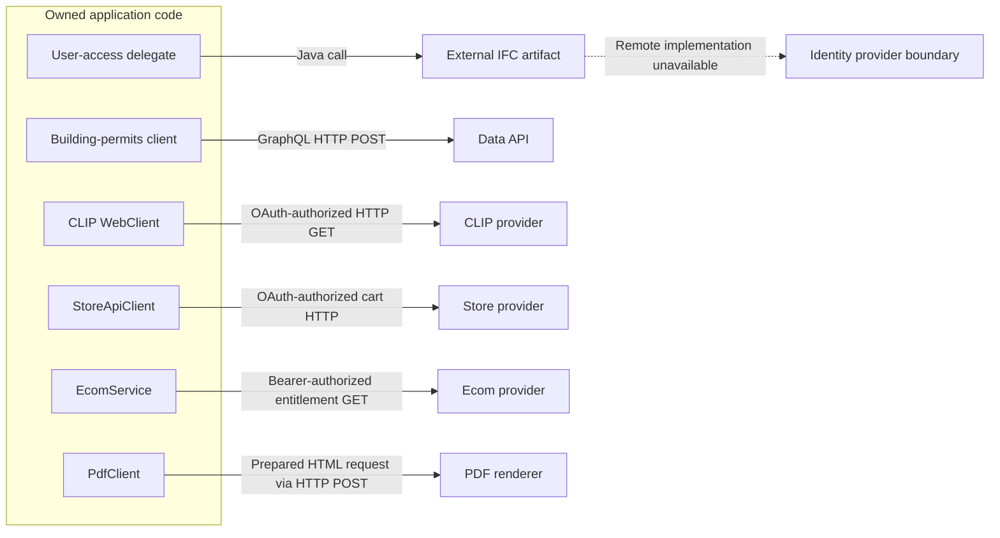
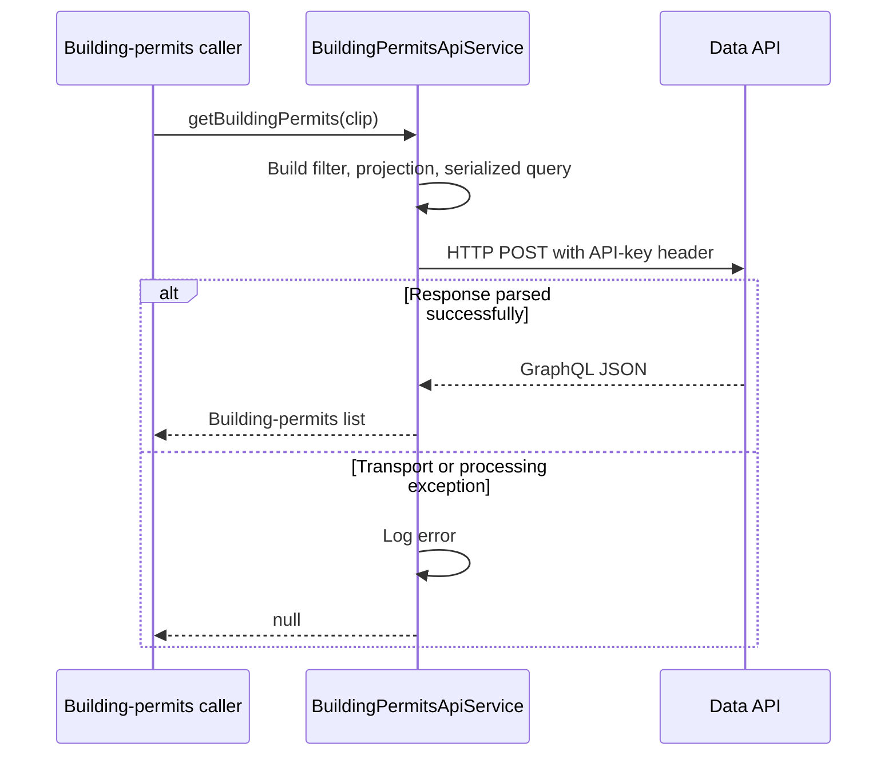

# External integrations

[Main project context](../project-context.md) · [Parent: Cross-cutting](index.md) · [Backend modules](../backend/index.md) · [Configuration](configuration-and-feature-flags.md)

**Research baseline:** `RP-10188`, revision `a6f611ae0`, 2026-09-25. **Verified** = source-inspected/Confirmed, not a successful provider call; **Inferred** = source-supported interpretation; **Unknown** = unavailable or unreviewed evidence. No network call, credential lookup, build, or test was performed.

**Local citation prefixes:**

- `W/` = `realist\web\src\main\java\com\facl\uaf\realist\`
- `C/` = `uaf-common\action\src\main\java\com\facl\uaf\common\shared\`
- `U/` = `uaf-useraccess\action\src\main\java\com\facl\uaf\useraccess\`
- `R/` = `realist\web\src\main\resources\`

Suffixes identify repository-relative files; `:n–m` identifies source lines. Configuration examples below name keys only, never resolved endpoints or credential values.

## Summary

Realist assembles provider information rather than owning every underlying system. Locally running PostgreSQL and Redis do not make identity, property search, mapping, commerce, or PDF generation fully offline.

A **client** is owned code making a provider request. A **delegate** may call an externally supplied Java library rather than implement the remote transport itself. IFC is retained as the artifact/boundary name; this review does not invent its expansion or internals. An OAuth client-credentials grant authenticates the application, not the browser user.

## Representative integration boundaries

This is a representative inventory, **not an exhaustive integration catalogue**. Failure behavior belongs to the named method, not automatically every method in that provider family.

| Integration | Business purpose and caller | Observed protocol and configuration keys | Observed failure boundary / precise unknown |
| --- | --- | --- | --- |
| User-access IFC | Identity and entitlements; `UserAccessDelegate.passportLoginWithEntitlement` | Java call to external `UserAccessBD`; underlying transport and endpoint-key contract **Unknown** from available implementation | Maps provider results into `UserAccessOutput`; local exception handling does not establish provider retry behavior |
| Other IFC artifacts | Preferences, administration, property images, smart search, lookups | External dependencies declared by web build; protocol and effective provider configuration **Unknown** without artifact implementation | Do not infer provider databases, timeout policy, or fallback from artifact names |
| Data API | Building permits and other data products | Outbound GraphQL over HTTP POST; `data-api.url`, `data-api.key`; inspected client sends `x-api-key` | `BuildingPermitsApiService` logs and returns `null` on exception; distinguish this from an empty successful result |
| CLIP lookup | Resolve provider property identifier by address or APN | HTTP GET through `WebClient`; `clp.coreapi.cliplookup.api.url`, `clp.coreapi.cliplookup.api.oauth2.*`; OAuth client credentials | Direct `searchByAddress` has no local catch; `findClipByAddress` and `searchByApn` catch and return `null`; blank APN also yields `null` |
| Store API | Active cart and commerce operations | HTTP through `WebClient`: inspected cart GET/PUT; `storeapiservice.url`, `clpservices.oauth2.client.*` | Cart operations wrap failures in `StoreApiException`; provider-side transaction/rollback semantics **Unknown** |
| Ecom/RCSL | User product entitlements and authenticated commerce navigation | Entitlements HTTP GET with RCSL bearer token; `rcsl.ecom.base-url`, `rcsl.ecom.entitlements-path`, `rcsl.ecom.make-authenticated-ecomm-url-path`; token configuration `rcsl.token.url`, `rcsl.token.client-key`, `rcsl.token.client-secret` | Entitlements return `null` when disabled or organization mapping is absent; initial 401 retries once; failure of retry can escape |
| PDF renderer | Render prepared report HTML into downloadable bytes | HTTP POST to `pdf.url`; `realist.env` affects error logging | Normal inspected error path logs and returns `null`; this is not proof that every malformed request/error-logging branch is safe |
| SAML providers | Incoming federated identity | Browser SAML exchange and registration metadata; `saml.service-provider.*`, `saml.metadata.load-timeout-seconds`, `saml.metadata.cache-reload`, `direct-link.sso.enabled` | Registration lookup and canonical-login conversion may fail independently; deployed metadata/endpoints **Unknown** |
| Ping | Incoming OpenToken authentication | External Ping agent library; `pingfederate.*`, including `login-url`, `logout-url`, `token-name`, `active-directory-group` | Failed token/group check redirects to `/401.html`; do not equate OpenToken with SAML |
| Spatial APIs | Mapping and hazard/flood information | HTTP clients in `SpatialApiService`; token HTTP POST; `spatial-api.base-url`, `spatial-api.authentication.*`, `spatial-api.map.*`, `spatial-api.flood.*` | Token transport failure or empty token body raises `SpatialApiAuthenticationException`; map/hazard endpoint-specific failures are not exhaustively reviewed |

### Evidence map

- IFC: `U/action/delegate/UserAccessDelegate.java:84–174`; `realist\web\build.gradle:119–156`.
- Data API: `C/service/BuildingPermitsApiService.java:38–88`; `C/configuration/DataApiConfig.java:9–14`.
- CLIP: `W/rest/security/configuration/Oauth2Config.java:28–98`; `C/service/ClipService.java:23–84`. APN means Assessor's Parcel Number; the APN client explicitly requests legacy county-source matching.
- Store: `W/store/StoreApiClient.java:57–85`; `W/store/StoreClientStarter.java:23–60`; `W/rest/security/configuration/Oauth2Config.java:44–70`.
- Ecom/RCSL: `W/rest/service/ecommerce/EcomService.java:374–418`; `W/config/EcomProperties.java:9–16`; `C/configuration/properties/RcslProperties.java:22–31`; `C/service/RcslHelper.java:43–117`.
- PDF: `W/service/reports/pdf/PdfClient.java:19–74`.
- SAML: `W/controller/SamlController.java:39,80–154`; `W/rest/security/services/saml2/CustomRelyingPartyRegistrationRepository.java:74–82,126`; `W/rest/security/services/saml2/Saml2AuthenticationManager.java:81–164`.
- Ping: `W/rest/security/filters/PingFederateAuthenticationFilter.java:36–72`; `W/rest/security/configuration/properties/PingFederateProperties.java:15–60`.
- Spatial: `C/configuration/properties/SpatialApiProperties.java:14–43,68–87`; `W/rest/service/SpatialApiService.java:106–147,156–224`.

Key spellings for `@ConfigurationProperties` fields are shown in conventional kebab case; this is a key map, not a statement about resolved configuration values.

## Call direction and ownership

Solid arrows are source-backed calls from the evidence map. The dashed IFC edge marks an **Unknown implementation boundary**: it does not assert a remote protocol, service count, or provider schema. The diagram intentionally omits incoming SAML/Ping, which belong to [authentication](authentication-and-authorization.md). It also does not collapse local saved-for-later rows into the external active cart.

## GraphQL direction

**Verified:** `BuildingPermitsApiService` constructs a GraphQL query, serializes it, and POSTs it to a configured provider. Other matches recorded in the supplied source research include `RamService`, `MarketTrendsService`, and `CountyLookupService`; their individual behavior is not generalized from this one client's catch block.

This establishes **outbound GraphQL client use**. It does not establish an inbound Realist GraphQL endpoint. The host explicitly selects servlet mode even though WebFlux is on the dependency list (`R/application.yml:14–15`).

The local error branch includes response parsing; it does not imply every failure is a provider outage. Source: `C/service/BuildingPermitsApiService.java:38–88`. The caller's final UI behavior must be followed in the relevant feature flow; a returned `null` is not itself a user-facing message.

## IFC boundary

**Verified:** owned delegates call IFC classes whose implementations arrive through dependency artifacts. For example, the user-access boundary is `UserAccessBD.passportLoginWithEntitlement` (`U/action/delegate/UserAccessDelegate.java:84–174`).

**Unknown:** downstream database design, transport, retry policy, and internal service topology for those unavailable implementations. Those details must come from artifact source or the owning team, not inferred diagrams.

For property/template/XML processing and preferences, follow the [property-search module](../backend/modules/uaf-propertysearch.md), [reports module](../backend/modules/uaf-reports.md), and [preference module](../backend/modules/uaf-preference.md). Local transformations before/after an external call do not transfer ownership of provider data to Realist.

## Authentication distinctions

- Browser SAML/Ping/direct-link credentials concern incoming users.
- CLIP/store client credentials concern application-to-provider access.
- RCSL uses a separate token helper and Redis cache.
- Data API uses the inspected API-key header.
- Configuration-server credentials and configuration-decryption material are another independent concern.

See [authentication](authentication-and-authorization.md), [Redis](redis-caching-and-sessions.md), and [configuration](configuration-and-feature-flags.md). A provider 401 should be investigated against the credentials for that provider, not automatically against the browser's login.

## Failure and privacy watch points

**Verified:** Ecom's retry call occurs inside the 401 catch branch; a failure of that retry is not handled by the later sibling catch. Do not document this as guaranteed graceful fallback (`W/rest/service/ecommerce/EcomService.java:400–417`).

**Verified:** the helper's attempted token invalidation inserts `null` into `StartupStorage`, whose null guard returns without deleting (`C/service/RcslHelper.java:111–117`; `C/util/StartupStorage.java:43–47`). **Inferred:** the retry can reuse an age-valid rejected token; occurrence was not runtime-tested.

**Verified:** local PDF error logging can include the prepared request object (`W/service/reports/pdf/PdfClient.java:51–67`). Store update errors can log response bodies and headers (`W/store/StoreApiClient.java:80–85`). Support bundles should be sanitized rather than copied wholesale; never include report/customer data, authentication headers, or tokens.

**Verified:** Spatial token POST uses an explicitly empty body and content length zero, validates its endpoint before exchange, and throws a typed exception for transport failure or an empty response (`W/rest/service/SpatialApiService.java:175–207`). A 411/401 at this boundary should not be mislabeled as “no flood data.”

## Debugging and unknowns

| Symptom | Inspect first | What not to assume |
| --- | --- | --- |
| Building permits return no model | GraphQL filter/projection, response parsing and exception log | `null` proves no property coverage |
| Address lookup differs from APN lookup | `ClipService` method-specific catches and legacy county parameter | All CLIP methods have identical fallback |
| Cart fails while local saved items work | `StoreApiClient`, outbound OAuth registration, local/remote cart split | PostgreSQL availability proves store availability |
| Ecom unavailable for one MLS | Feature switch, organization mapping, token age, first call versus retry | Every `null` is an authentication failure |
| PDF preparation works but download fails | Prepared request/cache lifetime versus renderer HTTP call | Rendering happened during every preparation step |
| SAML/Ping fails | Incoming registration/token/group/session path | Outbound client credentials authenticate that user |

**Unknown:** this inventory does not exhaust every mapping, analytics, email, telemetry, image, or property-data client. Effective endpoint values, provider timeouts/service levels, provider-side retries, and deployment/network policies need owner confirmation. A declaration of a client library is not a guarantee that its provider is reachable.

Feature owners should link detailed provider calls here without inventing missing implementation details. No provider reachability or end-to-end feature success was validated during this documentation task.
