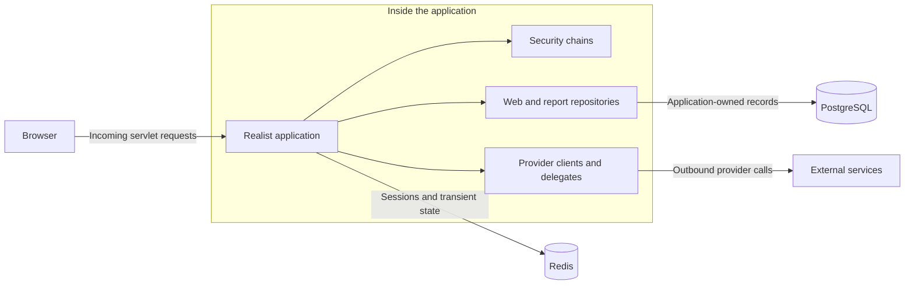

# Cross-cutting concerns

[Main project context / parent](../project-context.md) · [Development](../development/index.md) · [Login journey](../feature-flows/login-and-session-lifecycle.md)

**Research baseline:** `RP-10188`, revision `a6f611ae0`, 2026-09-25. **Verified** (equivalent to **Confirmed**) means source-inspected behavior, not executed or deployed behavior. **Inferred** means a source-supported conclusion needing runtime confirmation. **Unknown** means evidence is unavailable or the named area was not reviewed. No builds, tests, services, or provider calls were run.

**Local citation prefixes:** `W/` = `realist\web\src\main\java\com\facl\uaf\realist\`; `C/` = `uaf-common\action\src\main\java\com\facl\uaf\common\shared\`. Append the cited suffix to obtain the repository-relative source path; numbers after `:` are source lines.

## Summary

Realist combines externally supplied identity, preferences, property information, and commerce services with application-owned PostgreSQL records and Redis state. These chapters explain shared boundaries without duplicating individual business-feature implementations.

| Chapter | Authoritative subject |
| --- | --- |
| [Authentication and authorization](authentication-and-authorization.md) | Incoming login, security profiles, authorization boundaries, cookies |
| [Database and migrations](database-and-migrations.md) | Application-owned records, entities/repositories, cumulative schema, enforced relationships |
| [Redis caching and sessions](redis-caching-and-sessions.md) | Sessions, application caches, SAML correlation, public verification keys, locks |
| [External integrations](external-integrations.md) | Representative outbound clients, unavailable IFC implementations, failure boundaries |
| [Configuration and feature flags](configuration-and-feature-flags.md) | Configuration sourcing, bootstrap, runtime UI settings, database switches |

## Shared boundaries

Read this as a responsibility map, not a deployment inventory. The libraries and repositories run inside the host; the external-services box deliberately does not expose provider databases or internal transports. Redis has multiple independent lifecycles, not just a single application cache.

**Evidence:** host/package scanning in `W/Application.java:11–21`; incoming chains in `W/rest/security/configuration/MultipleLoginSecurityConfig.java:139–246,271–372`; Redis cache setup in `C/configuration/RedisConfiguration.java:39–90`; an outbound HTTP example in `C/service/BuildingPermitsApiService.java:58–88`. The database and Redis chapters provide the detailed ownership evidence.

## Reading rules

**Verified:** the host scans both web and report-library persistence packages. Those libraries therefore participate inside the application; their directory names do not establish separate deployments (`W/Application.java:11–21`).

**Verified:** incoming traffic uses the servlet application type, while inspected GraphQL and OAuth clients make outbound requests. WebFlux on the dependency list does not establish a reactive inbound application or a GraphQL endpoint. See `realist\web\src\main\resources\application.yml:9–15`, `C/service/BuildingPermitsApiService.java:58–77`, and `W/rest/security/configuration/Oauth2Config.java:34–54`.

Authentication identifies a caller; authorization, feature availability, provider coverage, and purchase/credit requirements answer different questions. A visible menu is not evidence of server authorization. A local database row containing a property identifier does not make the application's database the property's authoritative source.

## Where to start debugging

| Symptom | First boundary to inspect | Next chapter |
| --- | --- | --- |
| Login loop or restored page fails | Active security chain, accepted session cookie, post-login preference loading | [Authentication](authentication-and-authorization.md#debugging-and-next-checks) |
| Startup schema validation or credit lookup fails | Applied migration sequence versus entity/repository mapping | [Database](database-and-migrations.md#debugging-and-unknowns) |
| Stale settings, missing correlation, repeated provider 401 | Exact Redis owner, key construction, TTL and invalidation | [Redis](redis-caching-and-sessions.md#debugging-and-next-checks) |
| Feature fails while local storage is healthy | Provider client, protocol, error branch, credential category | [Integrations](external-integrations.md#debugging-and-unknowns) |
| Menu differs by user/group/environment | Runtime response, feature rows/cache, active profiles; then browser build | [Configuration](configuration-and-feature-flags.md#debugging-and-next-checks) |

## Scope and unknowns

**Unknown:** effective deployed configuration, external provider schemas, and shared-pipeline internals. Integration coverage is representative, not an exhaustive audit of every provider. The following chapters preserve precise limitations and known source discrepancies so that a newcomer does not mistake an inference for a tested guarantee.

Related chapters are authored separately; this section owns shared concerns, not all feature implementations. Start at [project context](../project-context.md) for the complete reading path.
