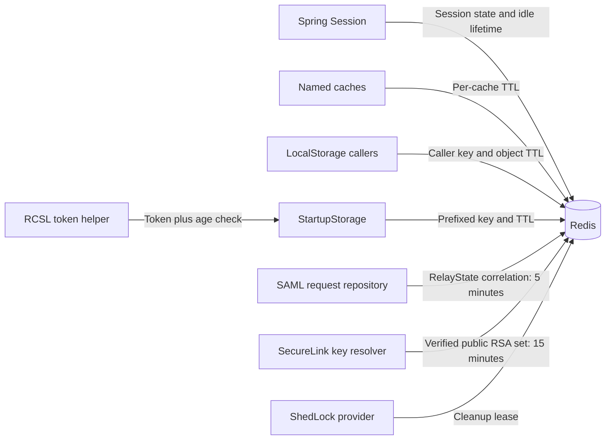

# Redis caching and sessions

[Main project context](../project-context.md) · [Parent: Cross-cutting](index.md) · [Authentication](authentication-and-authorization.md) · [Configuration](configuration-and-feature-flags.md) · [PDF flow](../feature-flows/pdf-generation-and-download.md)

**Research baseline:** `RP-10188`, revision `a6f611ae0`, 2026-09-25. **Verified** = source-inspected/Confirmed, not runtime-tested; **Inferred** = a source-supported conclusion requiring confirmation; **Unknown** = unavailable or unreviewed evidence. No Redis connection, cache mutation, or test was performed.

**Local citation prefixes:**

- `W/` = `realist\web\src\main\java\com\facl\uaf\realist\`
- `C/` = `uaf-common\action\src\main\java\com\facl\uaf\common\shared\`
- `R/` = `realist\web\src\main\resources\`
- `WT/` = `realist\web\src\test\java\com\facl\uaf\realist\`

Append suffixes to obtain repository-relative paths; numbers after `:` are source lines.

## Summary

Redis supports several unrelated lifecycles. A session expiry, an application-cache expiry, a SAML request expiry, and a distributed lock timeout are not interchangeable. A time to live (TTL) is the retention limit for a particular entry; it is not automatically renewed by every read or inherited from the browser session.

## Responsibility map

**Verified:**

| Responsibility | Owner | Expiration or invalidation |
| --- | --- | --- |
| HTTP session | Spring Session configuration | Local `spring.session.timeout`; immediate Redis flush |
| Named application caches | `RedisConfiguration` | Per-cache TTL properties |
| General transient objects | `LocalStorage` | Default or caller-supplied TTL; explicit delete |
| Shared/startup metadata | `StartupStorage` | Startup-storage TTL; explicit removal |
| SAML request correlation | `RedisSaml2AuthenticationRequestRepository` | Five minutes; remove after processing |
| SecureLink JWKS | `RedisJwksResolver` | Fifteen minutes; invalid entries evicted |
| RCSL bearer token | `RcslHelper` and `StartupStorage` | Cache TTL plus helper's age check |
| Scheduled cleanup lock | `SchedulerLockConfig` | ShedLock lease settings |

Sources: `R/application-local.yml:785–789`; `C/configuration/RedisConfiguration.java:39–78`; the specific classes cited in the sections below.

The arrows show separate Redis users, not a shared namespace, a guaranteed common serializer, or a retention dependency between them. For example, retaining a session does not extend a SAML request's correlation window. Evidence: the responsibility table, `W/rest/security/services/saml2/RedisSaml2AuthenticationRequestRepository.java:33–40,99–178`, `W/rest/service/securelink/RedisJwksResolver.java:29–95`, `C/service/RcslHelper.java:43–117`, and `W/config/SchedulerLockConfig.java:19–32`.

## Application cache behavior

**Verified:** named caches include startup storage, local storage, photos, first photo, ecommerce, and products. Most TTL properties use seconds; ecommerce retention uses days.

| Configuration key | Unit/owner |
| --- | --- |
| `cache.local-storage.ttl` | Seconds, local objects/cache |
| `cache.startup-storage.ttl` | Seconds, startup metadata/cache |
| `cache.photos.ttl`, `cache.first-photo.ttl` | Seconds, photo caches |
| `cache.products.ttl` | Seconds, product cache |
| `ecommerce.reports.noOfDaysToRetain` | Days, ecommerce report cache |
| `cache.zip-start-limit` | JSON length threshold for compression, not a TTL |

Evidence: `C/configuration/RedisConfiguration.java:39–78`; `C/util/LocalStorage.java:29–30,62–77`.

`RedisConfiguration` uses string keys and JDK serialization for values (`C/configuration/RedisConfiguration.java:81–90,132–137`). `LocalStorage` and `StartupStorage` first convert objects to JSON, optionally compress them, then write through that Redis template. Do not assume all Redis entries are plain readable JSON, or that this template establishes Spring Session's exact effective serializer.

**Verified caveat:** `LocalStorage.insert(sessionId, key, value)` does **not** automatically scope the key to the session. Its implementation writes the supplied key unchanged. Isolation therefore depends on callers' key construction (`C/util/LocalStorage.java:37–78`).

`StartupStorage` prefixes keys and applies an explicit TTL (`C/util/StartupStorage.java:38–64`). Its name does not mean “permanent until restart.”

**Verified:** `LocalStorage.updateCacheObject` writes only when the key already exists and resets the TTL to its configured default; `removeCacheObject` explicitly deletes the key (`C/util/LocalStorage.java:123–150`). Consequently, insertion, update, read, and removal are different operations—not a generic upsert with uniform expiry.

## Session-bound data

**Verified:** `SessionStateUtil` stores small objects directly in `HttpSession`, but compresses larger JSON representations according to `cache.zip-start-limit`. Reads support those compressed values (`C/util/SessionStateUtil.java:29–68`).

**Inferred:** serialized-class changes across deployments can invalidate existing session/cache values. The repository includes a deserialization-recovery filter, but its cookie-name discrepancy is documented under [authentication](authentication-and-authorization.md#cookies-sessions-restoration-and-logout). This is a compatibility risk, not proof that every deployment loses sessions.

Do not clear all Redis data as a routine login fix: that would also affect correlation state, shared caches, tokens, and locks. First identify the owner and exact namespace. Do not copy cached sessions or bearer tokens into diagnostic notes.

## SAML correlation

SAML is Security Assertion Markup Language; RelayState correlates the browser's federated exchange with a saved authentication request.

**Verified:** requests are stored under a RelayState-derived key with a five-minute TTL. Loading checks that the stored request's RelayState matches. Missing or unreadable values return `null`; removal loads and deletes the entry.

Source: `W/rest/security/services/saml2/RedisSaml2AuthenticationRequestRepository.java:33–40,50–88,99–178`.

**Unknown:** this review did not execute a SAML round trip to verify effective framework selection of the declared primary repository. A missing correlation entry should therefore be investigated separately from assertion validation, provider login, and application session restoration.

## JWKS caching

JWKS means JSON Web Key Set: public verification keys, not the application's private signing material. MLS means Multiple Listing Service; key sets are partitioned by the relevant group and endpoint.

**Verified:**

- Keys are partitioned by a digest of MLS group plus endpoint URI.
- Only public RSA keys are cached.
- A fetched set is cached only after successful signature verification.
- A known cached key ID with an invalid signature does not trigger a refresh.
- Redis read failure falls back to the authorized endpoint.
- Redis write failure does not overturn an already verified signature.
- Reads do not extend the fifteen-minute TTL.

Source: `W/rest/service/securelink/RedisJwksResolver.java:29–68,71–95,125–168`.

This is a deliberately different failure boundary from session restoration: a Redis failure can permit remote public-key retrieval here, but that does not imply a general “Redis is optional” policy for the application.

## Token invalidation discrepancy

**Verified:** `RcslHelper.invalidateToken()` calls `startupStorage.insert(key, null)`. `StartupStorage.insert` returns immediately for null objects and does not delete the existing entry.

Sources: `C/service/RcslHelper.java:111–117`; `C/util/StartupStorage.java:43–47`.

**Inferred:** the Ecom 401 retry may reuse a still-age-valid cached token instead of obtaining a replacement. Runtime occurrence was not tested. A helper named “invalidate” is not evidence of real eviction; follow its implementation.

The [integrations chapter](external-integrations.md#failure-and-privacy-watch-points) also records why failure of the retry is not necessarily covered by the later sibling catch.

## Distributed scheduling

**Verified:** shared-link cleanup uses a Redis-backed ShedLock provider, not a PostgreSQL lock table. Cleanup has configurable maximum/minimum lease durations, an enablement switch, grace period, and bounded batch.

Sources: `W/config/SchedulerLockConfig.java:19–32`; `W/rest/service/sharedlink/SharedLinkCleanupService.java:57–89`.

**Caveat:** a maximum lock duration is a lease, not an unlimited guarantee against overlapping execution. The grace period decides which expired database rows qualify; the batch size limits work; neither is the same as lock lifetime. The cleanup switch is `shared-report-link.cleanup.enabled`, not automatically the same decision as the user-facing `SharedLink` feature rule.

## Debugging and next checks

| Symptom | Check first |
| --- | --- |
| Session disappears after login/redeploy | Effective session timeout, accepted cookie name/attributes, serialization compatibility and recovery filter |
| One user's transient object appears under another request | Caller's `LocalStorage` key construction; the `sessionId` argument alone provides no isolation |
| Metadata/feature rules remain stale | Prefixed startup key, TTL, explicit eviction and the subsequent reload; not merely browser refresh |
| SAML response cannot find its request | RelayState matching and five-minute expiry; distinguish missing state from invalid assertion |
| Repeated commerce 401 despite retry | Cached token age and the null-insertion invalidation discrepancy |
| Cleanup duplicates or stops advancing | Lease versus actual execution duration, enablement, grace/batch settings, per-link exceptions |

Existing tests to inspect, **not executed**:

- `uaf-common\action\src\test\java\com\facl\uaf\common\shared\util\CacheServiceTest.java`
- `WT/rest/service/securelink/RedisJwksResolverTest.java`
- `WT/rest/security/services/saml2/RedisSaml2AuthenticationRequestRepositoryTest.java`
- `WT/rest/service/sharedlink/SharedLinkCleanupServiceTest.java`

**Unknown:** deployed Redis topology, namespace separation between environments, effective session serializer, live TTL overrides, and operational eviction/retention policy. Do not infer these from local defaults.

**Recommended priority, not performed here:** test real token eviction, session-cookie recovery, serialization compatibility, and lock-expiry behavior before changing shared cache infrastructure.
