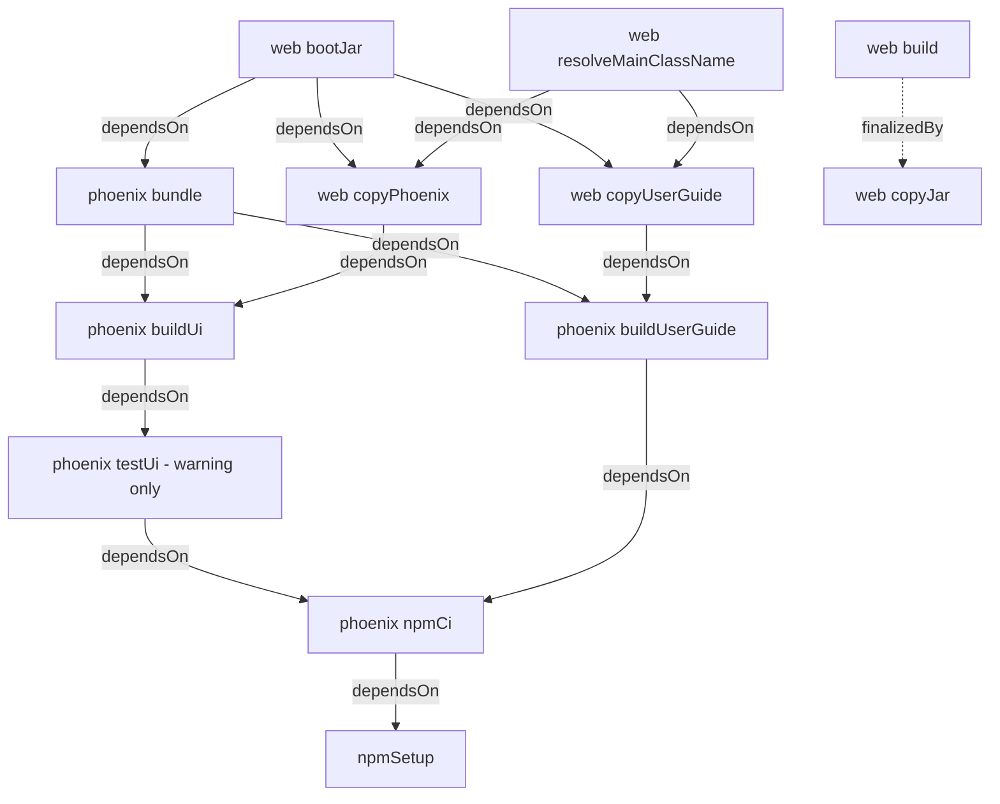
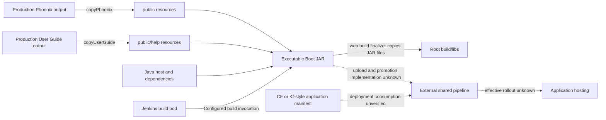

# Build and deployment

[Project context](../project-context.md) · [Development / parent](index.md) · [Testing](testing-and-quality.md) · [Configuration](../cross-cutting/configuration-and-feature-flags.md)

**Research:** 2026-09-25 · branch `RP-10188` · revision `a6f611ae0`.
**Evidence convention:** **Confirmed** = declared in source, not executed; **Inferred** = interpretation; **Unknown** = unavailable evidence. References use repository-relative `path:line` citations.

## Summary

The deployable artifact is a Spring Boot executable JAR containing Java code and both Angular applications. Gradle orchestrates Java and npm tasks; npm scripts specify Angular build/lint behavior. Jenkins build pods and application-hosting manifests describe different boundaries.

Source inclusion does not mean one deployed service per directory: the web host depends on the action projects as libraries (`settings.gradle:21–30`; `realist/web/build.gradle:97–103`). For their responsibilities, see [module dependencies](../backend/module-dependencies.md).

## Declared build task graph



Read solid arrows as **task → prerequisite**, not chronological execution. The dotted edge is a finalizer relationship, not a `bootJar` dependency. These are the explicit custom declarations, not a complete resolved Gradle/plugin task graph. Evidence: `phoenix/build.gradle:43–64,83–111,127–159`; `realist/web/build.gradle:17–21,41–56,68–73`.

Consequences:

- `buildUi` invokes `npm run build:phoenix`: Phoenix lint precedes its production build.
- `buildUserGuide` invokes `npm run build:guide --force`: the script builds the guide with `/help/` as base href. It does **not** include guide lint.
- `testUi` depends on installation but only prints a warning that tests are disabled because Jenkins lacks a Chrome/Chromium binary; it does not invoke Karma.
- `compileTestJava.mustRunAfter` the copy tasks is **ordering only**. It does not itself cause frontend builds when requesting backend tests.
- Main-class resolution depends on both copy tasks; `bootRun` is not an assured frontend-free launch.

Evidence: `phoenix/package.json:9–16`; `phoenix/build.gradle:83–111,127–142`; `realist/web/build.gradle:30–56`. See [testing and quality](testing-and-quality.md) for remaining execution caveats.

## Artifact names and contents

**Confirmed:**

| Item | Declaration |
|---|---|
| Base name | `res-realist-phoenix` |
| Default version | `1.20.1-SNAPSHOT`, unless overridden |
| Primary executable output | `realist\web\build\res-realist-phoenix-1.20.1-SNAPSHOT.jar` for the default version; not the module's `build\libs` |
| Root copy | Web `build` finalizes with `copyJar` into root `build\libs`; invoking `bootJar` alone does not declare that finalizer |
| Main browser resources | `phoenix\dist\phoenix\browser` → web `build\resources\main\public` |
| Guide resources | `phoenix\dist\user-guide\browser` → web `build\resources\main\public\help` |
| Plain web JAR | Disabled; `bootJar` is the executable packaging task |

Evidence: `build.gradle:12–17,88–100`; `realist/web/build.gradle:7–9,17–21,37–50,68–73`.



Here arrows describe artifact flow, unlike the dependency diagram above. Dotted edges explicitly mark unavailable shared-pipeline behavior; neither manifest presence nor build-pod creation proves a deployed topology. Packaging evidence: `realist/web/build.gradle:17–27,41–50,68–73`; pipeline evidence: `Jenkinsfile:61–111`; manifest evidence: `manifests/dev-usw1-kf.yml:2–16`.

### Source-derived commands for later authorized use

Build just the executable package:

```powershell
Set-Location 'C:\Users\dbangoria\AngularUpdate\res-realist-phoenix'
.\gradlew.bat :realist:web:bootJar -PexcludeLocalConfig=true
```

For the broader build, including the web build finalizer:

```powershell
Set-Location 'C:\Users\dbangoria\AngularUpdate\res-realist-phoenix'
.\gradlew.bat build -PexcludeLocalConfig=true
```

Neither command was executed. The property and task names come from `realist/web/build.gradle:15–27,73`; Jenkins supplies the same build/property combination (`Jenkinsfile:42–44`). Do not infer test results from these task definitions.

## Packaging exclusions and configuration boundaries

**Confirmed:**

- `SecureLinkV2Test.html` is excluded from `bootJar`.
- `application-local.yml` is excluded **only** when `excludeLocalConfig=true`.
- The property defaults to false for invocations that do not supply it.
- Jenkins explicitly supplies it as true.

Evidence: `realist/web/build.gradle:15–27`; `Jenkinsfile:42–44`. A locally built JAR must not automatically be treated as equivalent to a CI deployment artifact.

The Angular production configuration and guide base href are **build-time** decisions (`phoenix/package.json:10–11`). Spring profiles/service bindings and user-specific configuration loaded at login are **runtime** decisions; rebuilding a bundle is not a substitute for checking the active runtime property source (`manifests/dev-usw1-kf.yml:9–16`; `realist/web/src/main/java/com/facl/uaf/realist/rest/service/LoginService.java:192–244`).

**Confirmed build-resource nuance:** `processResources` extracts one specifically named configuration-decryption keystore resource from a non-transitive build-only dependency. The starter is not thereby restored to the runtime classpath (`realist/web/build.gradle:59–80,95`). This documents the resource lifecycle only; no keystore contents were inspected or reproduced. Configuration-decryption material must not be confused with SAML identity-provider credentials.

## Jenkins versus application hosting

**Confirmed:** Jenkins uses external shared libraries to provision a build pod, configure a `DeployableType`, and execute the pipeline. `master` selects the production flow; other branches default to preproduction, including the explicit `develop.*` case (`Jenkinsfile:6–25,31–50,61–111`).

The `GradleLibBuilder` declaration requests npm-build and Maven-publish behavior, npmrc-v9 handling, and an upload/archive argument excluding `jar` (`Jenkinsfile:92–105`). These are arguments to external code, not locally inspectable proof of exact upload order, test gates, or archive selection. The scan task declarations also do not prove successful scans or blocking gates (`Jenkinsfile:70–85`).

**Confirmed:** `manifests/dev-usw1-kf.yml` uses `applications`, `buildpacks`, `env`, `path`, and `services`; it declares Java 21, `dev,cloud`, an executable-JAR path containing `${version}`, and service bindings (`manifests/dev-usw1-kf.yml:2–16`).

This is a **Cloud Foundry/Kf-style application manifest**, not a native Kubernetes Deployment/Service manifest. Jenkins' pod is build infrastructure; it does not establish the runtime hosting model. The manifest's version placeholder also requires a deployment-time substitution mechanism whose implementation is not present here.

## Publishing, rollback, and next checks

**Confirmed:** root `publishing.gradle` selects snapshot versus release repositories from the version and publishes `components.java` when no `bootWar` task exists (`publishing.gradle:1–23`; applied by `build.gradle:20`).

**Unknown:** this does not prove how the shared pipeline uploads or promotes the executable Boot JAR. The external builder implementation, substitutions, production topology, rollout strategy, and rollback commands were unavailable.

**Recommended rollback boundary:** preserve the last approved artifact and its configuration contract, but assess database/schema and Redis serialization compatibility separately. No repository-backed one-command production rollback was established; reverting Java code does not reverse Flyway migrations.

Next checks for the delivery owner:

1. Inspect the approved shared-library versions and `GradleLibBuilder` implementation to establish exact build, publish, test, and promotion stages.
2. Confirm manifest selection, `${version}` substitution, runtime profiles, and service bindings for each environment without exposing binding values.
3. Confirm artifact retention, rollout health gates, and an approved rollback/forward-repair procedure with the database and cache owners.
4. Establish actual current build/test/scan results separately from these declarations.
