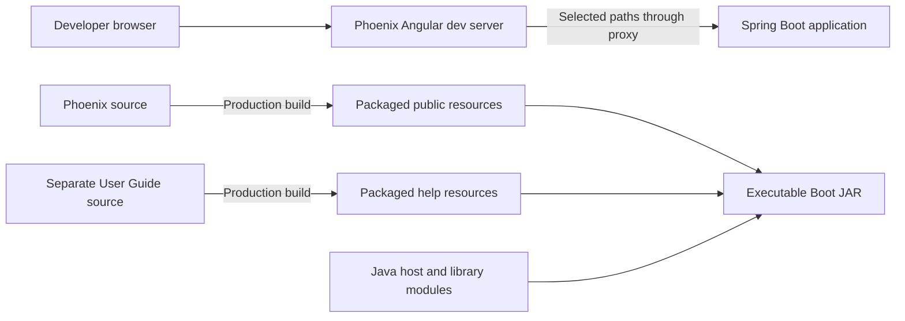

# Development guide

[Project context / parent](../project-context.md) · [Cross-cutting](../cross-cutting/index.md) · [Backend](../backend/index.md) · [Frontend](../frontend/index.md)

**Research:** 2026-09-25 · branch `RP-10188` · revision `a6f611ae0`.
**Evidence convention:** **Confirmed** means supported by source, not executed behavior; **Inferred** means a reasoned interpretation; **Unknown** means evidence or operational confirmation is missing. Citations are repository-relative `path:line` references at this revision.

## Summary

Development uses Gradle for Java/module orchestration and npm/Angular for browser applications. Packaged deployment combines both Angular applications with the Spring Boot host. A frontend development server is therefore not the same thing as the deployable application, and a successful package build is not proof that browser tests ran.

| Page | Use it for |
|---|---|
| [Local setup](local-setup.md) | Windows prerequisites, explicit profiles, startup order, proxying, external dependencies |
| [Build and deployment](build-and-deployment.md) | Declared task graph, artifact naming, CI/hosting boundaries |
| [Testing and quality](testing-and-quality.md) | Actual configured test/lint scope and disabled or legacy tooling |
| [Troubleshooting](troubleshooting.md) | Symptom-to-source diagnosis without exposing private data |
| [Making common changes](making-common-changes.md) | Small, cross-layer change plans and existing tests |

## Understand the two working modes

The left-hand request path is local development; the right-hand arrows describe build inputs, not HTTP requests. The guide can also run on its own development server. Both production browser outputs become resources in one Java executable, rather than two separately deployed browser servers. **Confirmed evidence:** `phoenix/package.json:6–11`; `phoenix/proxy.config.mjs:1–45`; `realist/web/build.gradle:17–27,41–56,97–103`. See the build chapter for the exact dependency graph.

## Declared baseline

**Confirmed:** Java 21, Gradle wrapper 8.14.3, Gradle-managed Node 20.14.0/npm 10.8.2, Spring Boot 3.5.15, and Spring Cloud 2025.0.3 are declared in `build.gradle:5–19,90`, `gradle/wrapper/gradle-wrapper.properties:3`, and `phoenix/build.gradle:3–9`.

These are declarations, not independently verified installed or resolved versions. Shell `npm` does not automatically use Gradle's downloaded Node. `bootRun` does not automatically select the `local` profile and is not an assured backend-only launch; main-class resolution has frontend-copy dependencies (`realist/web/build.gradle:53–56`; `realist/web/src/main/java/com/facl/uaf/realist/Application.java:29–31`).

All commands in this guide are source-derived examples for later authorized use and were **not executed**. No builds, tests, installs, servers, deployments, or external calls were performed for these pages.

## Unknowns and next checks

- **Unknown:** supported local PostgreSQL/Redis versions and provisioning recipe. Obtain the team's approved setup before following the startup sequence.
- **Unknown:** effective developer artifact authorization, external service connectivity, and deployed configuration. Follow [configuration](../cross-cutting/configuration-and-feature-flags.md) and [external integrations](../cross-cutting/external-integrations.md); do not infer availability from checked-in declarations.
- **Unknown:** shared Jenkins pipeline implementation, operational rollback, and current passing-test status. Confirm these with the delivery/test owners; this guide distinguishes declared behavior from runtime results.
- Cross-section documents are independently authored; their navigation is an integration boundary, not a claim that every linked chapter is complete.
