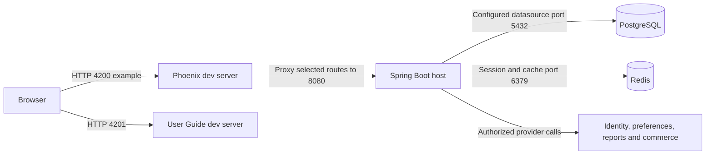

# Local setup

[Project context](../project-context.md) · [Development / parent](index.md) · [Configuration](../cross-cutting/configuration-and-feature-flags.md) · [Build](build-and-deployment.md)

**Research:** 2026-09-25 · branch `RP-10188` · revision `a6f611ae0`.
**Evidence convention:** **Confirmed** = source-backed, not run; **Inferred** = interpretation needing runtime confirmation; **Unknown** = not established. Citations are repository-relative `path:line` references. Commands below are examples for later authorized execution; none were executed.

## Prerequisites

A local workspace needs both build access and runtime access. Resolving dependencies is a different permission from authenticating a Realist user or contacting a property-data provider.

| Prerequisite | Confirmed declaration and practical implication |
|---|---|
| JDK 21 | Java 21 source compatibility is declared; use a JDK, not merely a runtime, for compilation (`build.gradle:19,90–96`). |
| Windows Java selection | The wrapper uses `JAVA_HOME` when set, otherwise `java.exe` on `PATH`. An invalid `JAVA_HOME` fails rather than falling back (`gradlew.bat:39–66`). |
| Gradle wrapper | Use repository `gradlew.bat`; wrapper distribution is 8.14.3. A separate globally installed Gradle is unnecessary (`gradle/wrapper/gradle-wrapper.properties:3`; `gradlew.bat:68–75`). |
| Gradle-managed Node/npm | Node 20.14.0, npm 10.8.2, `download=true`, workspace `build/node`; `NODE_DIST_URL` can override the distribution source (`phoenix/build.gradle:3–9`). |
| Shell Node/npm | Direct `npm` commands use the executable on the terminal's `PATH`, not automatically Gradle's downloaded copy. **Recommendation:** align shell versions with the Gradle declarations. npm scripts invoke the project-local Angular CLI; no global Angular installation is prescribed (`phoenix/package.json:5–18`). |
| Maven/plugin authorization | Private repositories and IFC dependencies require approved access. `settings.gradle` directly opens the developer Gradle properties file during plugin management, before compilation (`settings.gradle:1–15`; `build.gradle:22–46`; `realist/web/build.gradle:119–153`). |
| npm authorization | Private CoreLogic packages are declared. Gradle's `npmCi` copies a root `.npmrc` toward the frontend project and runs `ci --force`; obtain the approved registry/auth setup rather than inventing credentials (`phoenix/package.json:34–35`; `phoenix/build.gradle:43–64`). |
| Installation side effects | `postinstall` executes `node scripts/patch-ensemble.js`; dependency installation is not a read-only check (`phoenix/package.json:18`). |

Obtain authorization through the team's approved process. Gradle property names include `artifactRepoUser` and `artifactRepoPassword`; values do not belong in this document. The source's direct user-home properties read is documented, but no home credential file or keystore contents were inspected.

**Recommended Windows preparation:** set `JAVA_HOME` to the actual approved JDK installation directory, with its `bin` on `PATH`; ensure shell Node/npm are also on `PATH` if using direct npm commands. Restart terminals after environment changes. An illustrative per-terminal Java setup follows; the JDK path is deliberately a placeholder, not a discovered installation:

```powershell
Set-Location 'C:\Users\dbangoria\AngularUpdate\res-realist-phoenix'
$env:JAVA_HOME = 'C:\Tools\jdk-21' # Replace with the approved installed JDK directory.
$env:Path = "$env:JAVA_HOME\bin;$env:Path"
```

The Java selection semantics come from `gradlew.bat:39–66`; the environment assignment is a recommendation, not a repository provisioning script.

## Required local services and dependencies

**Confirmed:** local configuration declares a PostgreSQL datasource on port **5432**, Hibernate schema validation, Redis on **6379**, and Redis-backed HTTP sessions. Flyway placeholder and Hibernate default-schema settings refer to `public` (`realist/web/src/main/resources/application-local.yml:755–789`). Hosts, database names, usernames, and passwords are intentionally omitted.

Hibernate `validate` checks an existing schema; it is not a promise to create one. Prepare the database and approved configuration before application startup. Running Flyway against a shared database is a schema-changing operation, not a harmless connectivity check. Flyway and PostgreSQL dependencies are declared in `realist/web/build.gradle:174–177`.

**Unknown:** authoritative supported PostgreSQL/Redis versions, seed data, and a database-provisioning recipe. This guide therefore does not invent container commands, database accounts, or initialization credentials.

### Recommended startup order

1. Arrange approved JDK, artifact access, developer configuration, and external-service authorization.
2. Provision the approved PostgreSQL database/schema and Redis service. Confirm isolation from shared or production data before allowing migrations.
3. Start the Spring Boot host with an explicitly selected profile; resolve configuration, schema, and Redis errors before diagnosing the browser.
4. Start the Phoenix development server and verify that its API proxy reaches the host.
5. Start the optional User Guide development server when changing help content.

This is an operational recommendation derived from dependencies, not an automated orchestration script.



Arrows show runtime dependencies, not startup commands. Ports 5432/6379 are local declarations; **8080 is the proxy target, not a verified running listener**, and 4200 is explicitly selected below. The guide's 4201 comes from its npm script. Evidence: `phoenix/package.json:6–8`; `phoenix/proxy.config.mjs:1–45`; `realist/web/src/main/resources/application-local.yml:755–789`. External boundaries are detailed under [external integrations](../cross-cutting/external-integrations.md).

## Source-derived commands

Use separate terminals for long-running processes. These examples are not an assertion that dependencies, configuration, or service access are ready.

### Spring Boot host

```powershell
Set-Location 'C:\Users\dbangoria\AngularUpdate\res-realist-phoenix'
.\gradlew.bat :realist:web:bootRun --args="--spring.profiles.active=local"
```

**Confirmed:** `Application.main` invokes `SpringApplication.run`; neither that entry point nor the inspected web build sets `bootRun` to `local` (`realist/web/src/main/java/com/facl/uaf/realist/Application.java:29–31`; `realist/web/build.gradle:1–57`). Select the profile explicitly; profile-dependent security is explained in [authentication](../cross-cutting/authentication-and-authorization.md).

**Important:** this is not a guaranteed backend-only task graph. `resolveMainClassName` depends on both frontend copy tasks, which depend on the respective Angular builds (`realist/web/build.gradle:41–56`). Starting via `bootRun` may therefore require npm access and frontend build prerequisites. Do not present it as a way to bypass the frontend build; an approved alternative IDE/task setup remains to be confirmed.

### Phoenix browser application

```powershell
Set-Location 'C:\Users\dbangoria\AngularUpdate\res-realist-phoenix\phoenix'
npm ci --force
if ($LASTEXITCODE -eq 0) {
    npm start -- --port 4200
}
```

The explicit port avoids relying on an assumed workspace override. Gradle's own installation task also uses `ci --force`; installation runs the configured postinstall script (`phoenix/build.gradle:61`; `phoenix/package.json:6,18`). Direct shell installation must already have the approved npm registry setup; it does not run Gradle's `.npmrc` copy logic.

### Separate User Guide application

After dependencies have been installed, use another terminal:

```powershell
Set-Location 'C:\Users\dbangoria\AngularUpdate\res-realist-phoenix\phoenix'
npm run start:guide
```

This script selects the `user-guide` project and port **4201**; unlike the Phoenix start script, it does not declare the API proxy (`phoenix/package.json:6–8`). Production guide output instead uses `/help/` and is copied into the Boot artifact; see [packaging](build-and-deployment.md).

## Proxy and topology

**Confirmed:** the development proxy targets `http://localhost:8080` for `/api/**` and selected SAML, direct-link, asset, and mapping paths (`phoenix/proxy.config.mjs:1–45`). If the approved backend configuration uses another port, the proxy must agree; this research did not change either setting.

**Confirmed caveat:** the list includes `/saml/sp/**`, while `SamlController` redirects to `/saml2/authenticate/...`. That latter path is not explicitly listed in the inspected proxy configuration (`phoenix/proxy.config.mjs:30–38`; `realist/web/src/main/java/com/facl/uaf/realist/controller/SamlController.java:120–138`). A local single sign-on journey needs route/origin verification; do not assume all SAML traffic is proxied.

**Inferred cookie risk:** local configuration requests `same-site: none` and `secure: true`, while the proxy target is HTTP. Inspect actual cookie names/attributes and browser rejection reasons rather than weakening security by guesswork (`realist/web/src/main/resources/application-local.yml:633–638`; `uaf-common/action/src/main/java/com/facl/uaf/common/shared/util/UAFCommonUtil.java:1444–1469`).

## Offline limits

**Confirmed:** login delegates to external user-access code; preferences, report data, active carts, and PDF rendering have external boundaries. PostgreSQL and Redis alone do not provide a fully functional offline product. Representative evidence: `realist/web/src/main/java/com/facl/uaf/realist/rest/security/services/MlsGroupUserDetailsService.java:33–40`; `realist/web/src/main/java/com/facl/uaf/realist/store/StoreApiClient.java:57–68`; `realist/web/src/main/java/com/facl/uaf/realist/service/reports/pdf/PdfClient.java:29–74`.

See [external integrations](../cross-cutting/external-integrations.md) and [troubleshooting](troubleshooting.md) before interpreting a visible login page as proof of complete readiness.

## Unknowns and next checks

- **Build/platform owner:** confirm supported JDK distribution, shell Node/npm alignment, approved artifact setup, and any approved backend-only launch recipe.
- **Database/platform owner:** supply PostgreSQL/Redis versions, provisioning/seed procedure, and migration permissions; confirm the actual datasource/schema before startup.
- **Application owner:** confirm effective backend port and externally supplied property sources. The proxy's 8080 declaration alone cannot establish these.
- **Identity owner:** verify local HTTP/TLS cookie behavior and a complete SAML return journey without copying tokens or assertions into logs or documentation.
- **Feature owners:** identify which provider-dependent features are expected to work in a developer environment and the authorized test identities/data.
