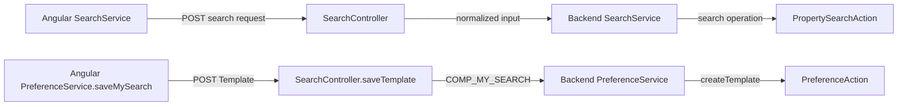
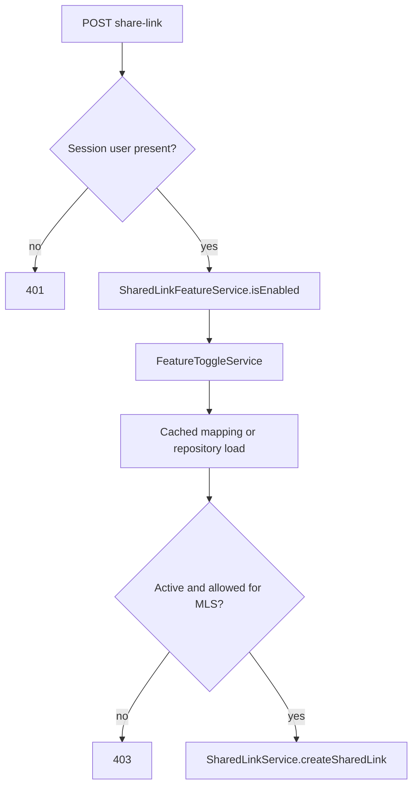

# Making common changes

[Project context](../project-context.md) · [Development](index.md) · [Search](../frontend/search/index.md) · [Reports](../frontend/reports/index.md) · [Preferences](../backend/modules/uaf-preference.md) · [Database](../cross-cutting/database-and-migrations.md)

Research date: **2026-09-25** · Branch: **RP-10188** · Revision: **a6f611ae0**.

**Evidence convention:** **Confirmed** means supported by source, not executed behavior. **Inferred** identifies a source-based conclusion requiring confirmation. **Unknown** identifies a precise remaining boundary. Change steps and new tests are **Recommendations**, not implemented changes. All citations use full repository-relative `path:line` references.

## Summary

Start at the existing user action and follow its actual contract. Search metadata, preferences, report access, and feature flags can be runtime-driven; changing only a template or menu may not change business behavior. This guide preserves the current contracts and explains where to look before making a small, reversible change.

A **template** here is also a runtime data structure describing fields/sections, not just an Angular HTML file. A **preference** can carry user/group settings through an external preference interface rather than a local table. An **MLS group** is a Multiple Listing Service group used in user context and feature eligibility. A feature switch is not interchangeable with user entitlement, property-data availability, or paid report access.

## Compact impact map

The entry points below are **Confirmed** by the detailed references in the following sections. Proposed impact reviews are **Recommendations**.

| Change | Direct artifacts/entry symbols | Indirect impact/risk | Existing test starting point |
|---|---|---|---|
| Search field | `SearchFormListComponent`, `DataElement`, `SearchService.executeQuickSearch/executeMySearch`, `SearchController` | Runtime templates, operators/lookups, saved templates, geography, provider field identifiers, result/count/export consistency | Component and Angular service specs; `SearchControllerTest` |
| Report | Selected component triplet, `ReportsService`, `ReportController`, report-specific service/converter | Entitlements, availability, credits, PDF, sharing snapshots, hidden identifiers | Report-controller serialization/CLIP tests; `ReportServiceTest` |
| API endpoint | Actual Angular caller, controller mapping, input/output models, owning service | Method/path composition, security matcher order, error shape, non-Angular callers | Corresponding service/controller tests; security integration tests if exposure changes |
| Preference | Angular `PreferenceService`, `PreferenceController`, backend `PreferenceService`, `PreferenceAction`/`PreferenceDelegate` | Provider-owned persistence, user/MLS scope, partial success, separate cache/session copies | Angular preference-service spec; `PreferenceControllerTest` |
| Feature flag | `FeatureToggleService`, feature wrapper, `MlsFeature`, runtime DTO/state if exposed in UI | Cached admin data, frontend visibility versus server enforcement, already-open sessions | `FeatureToggleServiceTest`; `SharedLinkFeatureServiceTest` |
| Table | New Flyway migration, owning entity/repository/service | Existing rows, SQL dialect, foreign keys, schema selection, archive/cleanup code | `SharedLinkArchiveQueryTest` is H2 evidence only; real PostgreSQL migration tests are a recommendation |

Selected report/component paths must come from the [report catalogue](../frontend/reports/report-catalogue.md); there is no universal component to edit for every report.

## Changing a search field

### Current contract and entry points

**Confirmed:** `Template.dataElementList` supplies `DataElement` metadata including `fieldCode`, render/lookup identifiers, operators, validation metadata, multiplicity, and geography flags. The component takes `dataElement` and a reactive-form array, emits operator/field events, and chooses controls according to `displayInfo.renderId`.

- Model contract: `phoenix/src/app/store/user/user.model.ts:342–395`.
- `SearchFormListComponent` inputs/events and lookup selection: `phoenix/src/app/search/components/search-form-list/search-form-list.component.ts:25–55,99–151`.
- Template controls, operators, lookup loading, limits, and accessibility labels: `phoenix/src/app/search/components/search-form-list/search-form-list.component.html:1–122`.

The form is not just a text box with a label. For example, fields can be disabled for multiple counties/states, missing lookup values, or shape/geography combinations. A cosmetic field change must not inadvertently change those eligibility rules.

**Confirmed:** `SearchField` carries `fieldCode` and values/operator values. Quick Search's `SearchRequest` includes search/display fields and optional range/export metadata; `MySearchRequest` additionally requires a preference group, selected geography, and a search template (`phoenix/src/app/store/search-board/search-board.model.ts:72–115`).

The Angular service explicitly sends POST:

| Caller | HTTP contract | Backend handler |
|---|---|---|
| `executeQuickSearch(SearchRequest)` | `/api/quick-search` → `SearchResultData` | `SearchController.quickSearch(QuickSearchInput)` → `QuickSearchOutput` |
| `executeMySearch(MySearchRequest)` | `/api/my-search` → `MySearchResponse` | `SearchController.searchDispatcher(MySearchInput)` → `PropertySearchOutput` |
| `getSearchCount(SearchField[])` | `/api/search-count` → count response | `countSearchResults(...)` → `{count}` capped at 10,000 |

Evidence: `phoenix/src/app/search/services/search.service.ts:42–51`; `realist/web/src/main/java/com/facl/uaf/realist/rest/controller/SearchController.java:58–70,96–119`. The distinct TypeScript and Java type names are not interchangeable declarations; verify the serialized shape rather than renaming one to resemble the other.

### Change impact

**Recommendations:**

1. First decide whether the requirement changes provider-supplied metadata, rendering, validation, or the search contract. Preserve `fieldCode`, template codes, and operator meanings unless compatibility is deliberately handled.
2. Review the component's `.ts`, `.html`, and referenced `.scss` together. Test selectable/date/text variants, loading/empty lookups, keyboard access, and disabled explanations—not only the label.
3. Follow `SearchService.getLookUps`/`getLookupsForSearchMultiField` for fields requiring lookups. They POST template/data-element and region information to preference endpoints, rather than obtaining every lookup from a hardcoded browser list (`phoenix/src/app/search/services/search.service.ts:82–93`; `realist/web/src/main/java/com/facl/uaf/realist/rest/controller/PreferenceController.java:164–170`).
4. Preserve controller normalization: Quick Search normalizes APN (Assessor Parcel Number) fields; My Search and counts also normalize lender values. Count behavior must remain consistent with results (`realist/web/src/main/java/com/facl/uaf/realist/rest/controller/SearchController.java:58–65,96–119,137–145`).
5. Follow backend `SearchService.quickSearch`/`mySearch` into the property-search module rather than assuming this controller calls `ServiceHandler` (`realist/web/src/main/java/com/facl/uaf/realist/service/SearchService.java:127–178,240–255,350–370`). Review grid/map display and export consumers when altering result identifiers or fields.
6. Reopen an existing saved template after the change. A saved search is a template operation, not the same object as a saved favorite property.

This is a **confirmed call map**, not a proposed universal architecture: executing a search and saving its template split into different owners even though both enter `SearchController`. Evidence: `phoenix/src/app/search/services/search.service.ts:42–47`; `phoenix/src/app/search/services/preference.service.ts:32–42`; `realist/web/src/main/java/com/facl/uaf/realist/rest/controller/SearchController.java:58–83,96–105`; `realist/web/src/main/java/com/facl/uaf/realist/service/SearchService.java:127–178,240–255,350–370`; `realist/web/src/main/java/com/facl/uaf/realist/rest/service/PreferenceService.java:41–54`.

Related: [dynamic fields and lookups](../frontend/search/dynamic-fields-and-lookups.md) · [property-search flow](../feature-flows/property-search.md).

## Changing a report

**Confirmed example — Property Details, not a rule for every report:**

- Start at `PropertyDetailsReportComponent` and its referenced HTML/SCSS. It consumes selected-property state and separately observes sharing eligibility/snapshot readiness (`phoenix/src/app/reports/components/property-details-report/property-details-report.component.ts:60–63,100–130,148–155`).
- `ReportsService.getPropertyDetailsReport` uses `getReport` to POST `/api/reports/property-details` with `{saveSubjectProperty, requestedFrom, propertyIdentifiers: [propertyIdentifier]}` (`phoenix/src/app/reports/services/reports.service.ts:43–47,83–88,343–349`).
- `ReportController.getPropertyDetailReport(PropertyDetailReportInput)` delegates to `PropertyDetailsService.getReport` (`realist/web/src/main/java/com/facl/uaf/realist/rest/controller/ReportController.java:169–177`).
- `PropertyDetailsService.getReport` generates report data, checks for records, updates last-viewed information, enriches report XML, converts it with `PropertyDetailsConverter`, and applies identifier-display preferences (`realist/web/src/main/java/com/facl/uaf/realist/rest/service/report/PropertyDetailsService.java:128–177`).
- `PropertyDetailsService.generateReport` calls `ServiceHandler.getPropertyDetailReport`; that handler loads report preference groups and `TMPL_REPORTS_PROPERTY_DETAIL`, updates templates, and calls `ReportAction.getPropertyDetailReport`. Usage tracking differs for regeneration (`realist/web/src/main/java/com/facl/uaf/realist/rest/service/report/PropertyDetailsService.java:423–434`; `realist/web/src/main/java/com/facl/uaf/realist/action/ServiceHandler.java:995–1033`).

**Recommendations:** preserve report codes and input property identifiers; review the selected service/converter, section rendering, and no-data/error behavior together. CLIP is the CoreLogic property identifier; APN is the assessor's parcel identifier. Neither should be exposed merely because it exists in the model: serialization tests explicitly distinguish hidden versus displayed identifiers.

A report-data change also requires a separate decision about **availability**, **entitlement**, **purchase/credits**, and **actions**. A visible menu is not backend authorization; a purchased report does not guarantee provider data for every property. Do not add a new report by copying only a route.

PDF and sharing are additional consumers. Property Details download delegates to `SearchDownloadService`, whereas several other reports POST to report-specific PDF endpoints (`phoenix/src/app/reports/services/reports.service.ts:115–149`). Shared reports use captured state, so inspect snapshot compatibility rather than assuming recipients reload the current interactive report. Recommended tests include no-data rendering, hidden identifiers, snapshot stability, denied access, credit duplication, and PDF preparation/download compatibility. These recommendations do not assert that every such test exists.

Related: [report availability](../frontend/reports/availability-and-access-rules.md) · [report rendering/actions](../frontend/reports/report-rendering-and-actions.md) · [PDF flow](../feature-flows/pdf-generation-and-download.md) · [shared links](../feature-flows/shared-report-links.md).

## Changing an API endpoint

**Confirmed:** Quick Search and My Search have explicit POST mappings. Some preference handlers instead use `@RequestMapping` without a method restriction. For example, the browser's `saveRegions` sends POST `/api/preference/save-regions`, but the inspected backend annotation itself is not POST-only (`phoenix/src/app/search/services/preference.service.ts:28–29`; `realist/web/src/main/java/com/facl/uaf/realist/rest/controller/PreferenceController.java:93–98`).

**Recommendations:**

1. Trace the actual caller and composed controller mapping, including any class-level prefix. Capture request fields, identifier normalization, response body, status, and error shape before changing them.
2. Update TypeScript models and Java DTOs/mappers together. A compile-time `Observable<T>` does not validate the server payload. For example, the Angular saved-template update is typed as `TemplateCodeResponse`, while the backend success path returns no content (`phoenix/src/app/search/services/preference.service.ts:41–42`; `realist/web/src/main/java/com/facl/uaf/realist/rest/service/PreferenceService.java:47–49`). Check consumers before relying on a response body.
3. Preserve the actual service boundary. The search handler calls backend `SearchService`; selected preference/report operations use `ServiceHandler`; the shared-link controller calls its own feature/service collaborators. Do not insert a fictitious common chain.
4. Recheck security **matcher order**, not just the `/api` prefix. Profile-specific security chains and earlier permit rules affect exposure (`realist/web/src/main/java/com/facl/uaf/realist/rest/security/configuration/MultipleLoginSecurityConfig.java:139–246,271–372,397–442`). Restricting a formerly unrestricted method also requires checking other callers.
5. Review frontend loading/cancellation/error handling and any direct/shared-link callers. Add contract tests on both sides plus security tests when exposure changes.

Related: [API map](../backend/api-and-feature-map.md) · [authentication and authorization](../cross-cutting/authentication-and-authorization.md).

## Changing a preference

**Confirmed:** saved searches use `saveMySearch`, `updateCustomMySearch`, and `deleteCustomMySearch`, which send a `Template` or `templateId` to search-template endpoints. `SearchController` supplies `COMP_MY_SEARCH`; backend `PreferenceService` calls the preference action. Create succeeds with a response body, update/delete with no content, and failed operations can return 502 (`phoenix/src/app/search/services/preference.service.ts:32–42`; `realist/web/src/main/java/com/facl/uaf/realist/rest/controller/SearchController.java:73–89`; `realist/web/src/main/java/com/facl/uaf/realist/rest/service/PreferenceService.java:41–54`). Favorites instead use a favorite-property input and a preference group/element (`realist/web/src/main/java/com/facl/uaf/realist/rest/controller/PreferenceController.java:145–150`).

For an example of preference-list updates, browser `saveComparablesSearchCriteria(PreferenceElement[])` sends POST `/api/preference/save-comp-search-criteria` and expects `UpdatePreferenceResponse`. The controller converts the elements and calls `ServiceHandler.updatePreferencesList(..., true)`, returning `UpdatePreferenceResults` (`phoenix/src/app/search/services/preference.service.ts:49–54`; `realist/web/src/main/java/com/facl/uaf/realist/rest/controller/PreferenceController.java:115–130`; `realist/web/src/main/java/com/facl/uaf/realist/action/ServiceHandler.java:973–978`).

**Confirmed partial-success boundary:** `PreferenceAction.updatePreferencesList` iterates updates, counts successes, records unsuccessful responses, and can throw an exception carrying the number already saved. It does not implement an all-or-nothing rollback of provider updates (`uaf-preference/action/src/main/java/com/facl/uaf/preference/action/PreferenceAction.java:744–800`). Treat retries accordingly; do not assume a failed HTTP operation saved nothing.

Persistence crosses `PreferenceDelegate.updatePreferenceInfo` into the external `PreferenceServiceBD.updatePreferences` interface. The delegate evicts a group-keyed cache on qualifying successful updates, while the action removes a separate user-keyed preference-group cache (`uaf-preference/action/src/main/java/com/facl/uaf/preference/action/delegate/PreferenceDelegate.java:456–484`; `uaf-preference/action/src/main/java/com/facl/uaf/preference/action/PreferenceAction.java:803–831`). The external provider's database/schema is **Unknown**, not a local table to alter.

**Recommendations:** preserve component/group/element/template codes and user hierarchy. Follow the actual save path, both cache invalidations, browser state updates, and next-login reload; one successful write does not imply all session/browser copies refreshed. Add partial-failure, repeat-save, and old-template compatibility cases. Confirm preference persistence with the provider owner rather than introducing a local entity by assumption.

Related: [preference module](../backend/modules/uaf-preference.md) · [saved searches and favorites](../feature-flows/saved-searches-and-favorites.md).

## Changing a feature flag

**Confirmed:** `FeatureToggleService.isFeatureEnabledForMls` normalizes codes and fails closed for blank input, missing features, or inactive records. Active “available for all” features exclude the blacklist; otherwise membership in the whitelist is required. Mappings are loaded from `MlsFeatureRepository`, cached through `StartupStorage`, and removable with `evictCache()` (`realist/web/src/main/java/com/facl/uaf/realist/rest/service/FeatureToggleService.java:52–115`). `MlsFeature` maps `mls_feature` and its code/status/list fields (`realist/web/src/main/java/com/facl/uaf/realist/rest/model/ecom/entity/MlsFeature.java:27–48`).

**Concrete entry seam:** `SharedLinkFeatureService.isEnabled` wraps the `AdminFeature.SHARED_LINK` code. The share-link endpoint derives identity/group from the session, returns 401 without user context, and returns 403 when the switch is off before calling the creation service (`realist/web/src/main/java/com/facl/uaf/realist/rest/service/sharedlink/SharedLinkFeatureService.java:26–40`; `realist/web/src/main/java/com/facl/uaf/realist/rest/controller/SharedLinkController.java:43–68`).

This **confirmed, feature-specific** decision path is server enforcement, not a browser-menu decision and not a universal report-authorization algorithm. Evidence is the controller/wrapper/service ranges above. Cache eviction causes a later reload; it is not shown as an automatic consequence of every admin update because that wiring was not established.

Browser state has its own contract: `shareReportLinkEnabled` defaults to false in the reducer, is copied from the payload, and is read by `selectIsShareReportLinkEnabled` (`phoenix/src/app/store/user/user.model.ts:47,271`; `phoenix/src/app/store/user/user.reducer.ts:35,144`; `phoenix/src/app/store/user/user.selector.ts:214–216`). The Property Details component consumes that selector (`phoenix/src/app/reports/components/property-details-report/property-details-report.component.ts:100–109`).

**Recommendations:** for a new flag, coordinate its stable code/data migration, wrapper, backend checks, runtime DTO mapping, reducer/selector, and UI consumers. For a data-only change, arrange deliberate cache eviction and decide how already-open sessions refresh. Do not replace server checks with hidden buttons. **Unknown:** deployed switch values and whether every external admin update invokes eviction; obtain admin-owner evidence before promising immediate propagation.

Related: [configuration and flags](../cross-cutting/configuration-and-feature-flags.md) · [Redis responsibilities](../cross-cutting/redis-caching-and-sessions.md).

## Changing a database table

**Confirmed example — shared links:** `SharedLink` maps `shared_link`, stores branding as JSONB, and uses the row ID as the opaque shared-link identifier. `agent_id` is a logical user reference, not a declared foreign key (`realist/web/src/main/java/com/facl/uaf/realist/rest/model/sharedlink/entity/SharedLink.java:18–82`).

The consolidated migration creates active and archive tables. Active report/user rows have real `REFERENCES shared_link(id)` clauses even though some comments call them “logical FK”; archive link references are not enforced foreign keys. Branding/report JSON is deliberately absent from archives (`realist/web/src/main/resources/db/migration/V20260723120000__create_shared_link_tables.sql:18–37,56–89,109–170`). Prefer executable DDL over a contradictory comment.

**Recommendations:**

1. Add a new versioned Flyway migration rather than editing a migration already applied to an environment. Review cumulative history and effective schema selection with the database owner; don't infer deployment schema solely from unqualified table names.
2. Review existing-row backfill/default/nullability behavior, indexes, foreign keys, and application compatibility across deployment order. This migration's timestamp trigger depends on `set_updated_at()` from an earlier migration (`realist/web/src/main/resources/db/migration/V20260505120000__create_ai_summary.sql:13–23`; `realist/web/src/main/resources/db/migration/V20260723120000__create_shared_link_tables.sql:35–37`).
3. Update the entity and repository contract, but also inspect explicit copy lists. `SharedLinkRepository.archiveById` names each archived field, excludes `brandingJson`, and has separate expiry-selection and delete operations (`realist/web/src/main/java/com/facl/uaf/realist/repository/sharedlink/SharedLinkRepository.java:26–64`). Adding an entity field will not automatically add it to archival SQL.
4. Decide deliberately whether a field belongs in active records, retained metadata, or neither. Review cleanup ordering/transactions, report snapshots, DTOs, and recipient rendering when the change affects them.
5. Validate the cumulative migration and archive lifecycle on PostgreSQL in an approved environment. The existing archive test uses H2 PostgreSQL mode, not PostgreSQL (`realist/web/src/test/java/com/facl/uaf/realist/repository/sharedlink/SharedLinkArchiveQueryTest.java:27–79`). A PostgreSQL migration/constraint/concurrency suite is a **recommendation**, not an existing suite established by this research.

The authoritative schema/history explanation belongs in [database and migrations](../cross-cutting/database-and-migrations.md); this section is a change checklist, not an exhaustive schema inventory.

## Existing tests versus recommended additions

**Confirmed existing tests**, with limited scopes:

| Change | Existing test reference | What it establishes from source |
|---|---|---|
| Search field | `phoenix/src/app/search/components/search-form-list/search-form-list.component.spec.ts:21–79`; `phoenix/src/app/search/services/search.service.spec.ts:50–87`; `realist/web/src/test/java/com/facl/uaf/realist/rest/controller/SearchControllerTest.java:19–63` | Component/form fixture and HTTP request assertions; backend lender parsing via a private-method test, **not** a public endpoint integration test. |
| Report | `realist/web/src/test/java/com/facl/uaf/realist/rest/controller/ReportControllerClipSerializationTest.java:75–102`; `realist/web/src/test/java/com/facl/uaf/realist/rest/controller/ReportControllerBuildingPermitsClipTest.java:73–112`; `realist/web/src/test/java/com/facl/uaf/realist/rest/service/report/ReportServiceTest.java:49–100` | Hidden/displayed CLIP/APN serialization, Building Permits identifier resolution, and map-generation request/response behavior with mocked imagery service. Not universal report/credit/PDF coverage. |
| API exposure | `realist/web/src/test/java/com/facl/uaf/realist/rest/controller/SecurityConfigIntegrationTest.java:60–142` | Selected security-profile and MockMvc/session behavior; review when matchers change. |
| Preference | `phoenix/src/app/search/services/preference.service.spec.ts:34–65`; `realist/web/src/test/java/com/facl/uaf/realist/rest/controller/PreferenceControllerTest.java:58–110`; `phoenix/src/app/store/user/user.reducer.spec.ts:376–394` | Browser save contracts, lender/region lookup handling, and adding a saved search to state. Not end-to-end provider persistence or atomic update guarantees. |
| Feature flag | `realist/web/src/test/java/com/facl/uaf/realist/rest/service/FeatureToggleServiceTest.java:53–146`; `realist/web/src/test/java/com/facl/uaf/realist/rest/service/sharedlink/SharedLinkFeatureServiceTest.java:35–75` | Eligibility and cached-mapping reuse; the wrapper passes the intended feature code and returns the toggle answer. Boundaries are mocked; live admin invalidation is not proved. |
| Table/archive | `realist/web/src/test/java/com/facl/uaf/realist/repository/sharedlink/SharedLinkArchiveQueryTest.java:27–79,82–146` | Real HQL archive-copy queries on H2; does not establish PostgreSQL trigger/JSONB/migration/concurrency behavior. |

**Recommended priorities, not claims of implemented coverage:**

- **P1:** contract serialization, authenticated/unauthenticated access, and feature-off behavior.
- **P1:** compatibility with existing saved preferences/templates and partial-update/retry behavior.
- **P1:** PostgreSQL cumulative migrations, constraints, triggers, and archival lifecycle for table changes.
- **P2:** duplicate credit/accounting operations and report availability.
- **P2:** frontend error/empty states, keyboard operation, and refresh restoration.

See [testing and quality](testing-and-quality.md) for tooling and later-use commands. No builds, tests, lint, installations, network calls, or services were executed for this documentation.

## Small, reversible change sequence

1. **Capture current behavior.** Record route, request shape, returned metadata, user/MLS conditions, and error branch without retaining sensitive payloads.
2. **Locate ownership.** Decide whether the change belongs in browser code, provider configuration, application service, or database data.
3. **Preserve identifiers.** Review saved templates/preferences and external field/report codes before renaming.
4. **Change one contract boundary at a time.** Add/update unit tests before widening exposure.
5. **Test integration conditions.** Include denied, unavailable, expired, and partial-failure cases in the approved validation plan.
6. **Validate the visible journey.** Check the selected component's template, styles, accessibility, and loading/error states.
7. **Document rollback.** Keep application and schema compatibility distinct.

## Rollback plan

These are **recommendations**, not a verified production runbook:

- **UI/API:** revert the isolated change while preserving old request/response compatibility where needed.
- **Feature:** restore prior switch data and deliberately evict the relevant cache; account for stale browser/session state.
- **Database:** use an approved forward repair or tested restore procedure. An application rollback does not reverse Flyway migrations.
- **Cache/session model:** assess old/new serialized data before rolling versions backward.

## Unknowns and next checks

| Unknown | Impact and precise next check |
|---|---|
| Effective runtime search/report templates for a target MLS/user | Local component changes may not expose a field/report. Obtain sanitized metadata for the intended group from the preference/provider owner; compare `Template`/`DataElement` codes and access fields with the cited models. |
| External preference/provider implementation and transactional behavior | Local code demonstrates partial updates, not a downstream rollback protocol. Ask the provider owner about supported identifiers, retry safety, persistence scope, and compatibility. |
| New report's actual entitlement/availability/credit path | The Property Details example is not universal. Follow the selected report's catalogue entry, browser caller, controller, availability handler, and action before choosing files to modify. |
| Flag propagation through all admin and login-response paths | The cache API and frontend payload consumer are confirmed, but full external admin invalidation and every response producer were not traced here. Check the admin write path and the target login/initialization DTO mapper; test an already-open session. |
| Effective PostgreSQL schema, migration history, and approved restore procedure | Get migration-history/schema evidence and the database owner's deployment/repair procedure. Do not infer these from H2 or change a deployed migration in place. |
| Current test results and complete coverage | Obtain revision-specific reports and identify missing cases. Existing tests above were inspected, not executed; no passing status is claimed. |

No source, configuration, or tests were changed during this research.
