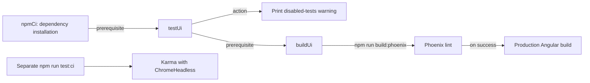

# Testing and quality

[Project context](../project-context.md) · [Development](index.md) · [Build](build-and-deployment.md) · [Common changes](making-common-changes.md)

Research date: **2026-09-25** · Branch: **RP-10188** · Revision: **a6f611ae0**.

**Evidence convention:** **Confirmed** means supported by inspected source, not a successful execution. **Inferred** means a conclusion from that evidence requiring confirmation. **Unknown** means evidence was not established; the final section gives next checks. References are full repository-relative `path:line` citations. This is representative test research, not an exhaustive inventory or a clean-working-tree certification.

## Summary

The repository contains Java and Angular tests, but configured tooling is not evidence that every test runs in continuous integration (CI). In particular, Gradle's current frontend test task is disabled. A passing packaging job must not be described as proof of browser-test coverage.

For a newcomer, distinguish three questions: **what a test asserts**, **which dependencies it replaces**, and **whether it actually ran**. A unit test isolates logic; an HTTP contract test checks request/response shape; a Spring-wired integration test checks collaboration among selected beans. None automatically proves a complete browser-to-provider journey. The examples below show these different boundaries.

## Current tooling

**Confirmed — declarations, not execution results:**

| Tool | Actual declaration and limitation | Evidence |
|---|---|---|
| Java tests | Subproject `test` tasks use JUnit Platform; Spring Boot test support and the platform launcher are declared. This does not establish the number of discovered or passing tests. | `build.gradle:233–242` |
| Angular unit tests | Phoenix's Angular test target uses Karma. Karma configures Jasmine, Chrome, and coverage reporting; npm `test:ci` explicitly requests ChromeHeadless and disables watch mode. | `phoenix/angular.json:140–173`; `phoenix/src/karma.conf.js:4–45`; `phoenix/package.json:12–14` |
| Gradle `testUi` | Depends on `npmCi`, then **only prints a disabled-tests warning**. The warning attributes the pause to missing Chrome/Chromium on Jenkins agents; that is the source's stated reason, not an independently checked agent inventory. | `phoenix/build.gradle:83–94` |
| Phoenix lint | `build:phoenix` runs `ng lint` before the production Angular build. Angular declares the ESLint builder. Lint success is not unit-test execution. | `phoenix/package.json:9–10,15`; `phoenix/angular.json:174–177` |
| User Guide lint | Separate `lint:guide` script/target; `build:guide` does not invoke it. | `phoenix/package.json:11,16`; `phoenix/angular.json:322–323` |
| Checkstyle | Plugin applied at the root. A configuration block inside `subprojects` selects the rules/suppressions, version `8.23`, and `ignoreFailures = false`; the inspected subproject plugin application applies Java and dependency management, not Checkstyle. Configuration alone does **not** prove per-module Checkstyle tasks or enforcement. | `build.gradle:1–6,49–51,123–128` |
| Protractor | Legacy end-to-end builders remain for Phoenix and User Guide. Their presence is not evidence of a working/current end-to-end suite or compatibility with the current toolchain. | `phoenix/angular.json:190–195,330–335` |

The Checkstyle version above is a **declared** version, not a verified resolved installation. Do not claim that `build` runs frontend unit tests or that Checkstyle enforces every Java module.

### Why a UI build can proceed without unit tests



Arrows on the left show Gradle prerequisites and script ordering, **not observed execution**. The separate Karma branch has no edge from `testUi`: that task does not run it. **Confirmed:** `phoenix/build.gradle:83–111`; `phoenix/package.json:10–15`. **Inferred:** the declared build path can package frontend code without testing its behavior; whether a separate external pipeline stage compensates is **Unknown**.

## Commands for later use

**Not executed during this documentation task.** These commands are derived from included Gradle projects and current npm scripts, not copied from a historical setup guide. Use only after obtaining the approved dependencies, browser, and environment described in [local setup](local-setup.md).

PowerShell, **working directory: repository root**:

```powershell
Set-Location 'C:\Users\dbangoria\AngularUpdate\res-realist-phoenix'
.\gradlew.bat :realist:web:test
.\gradlew.bat :uaf-common:action:test
```

The module names are included by `settings.gradle:21–30`; their Java test configuration is `build.gradle:233–242`. These are selected module tests, not a claim to run every module.

PowerShell, **working directory: `phoenix`**:

```powershell
Set-Location 'C:\Users\dbangoria\AngularUpdate\res-realist-phoenix\phoenix'
npm run test:ci
npm run test:cover
npm run lint
npm run lint:guide
```

Definitions: `phoenix/package.json:12–16`. `test:cover` requests coverage but does not turn off watch mode; Karma defaults to Chrome and `singleRun: false` (`phoenix/src/karma.conf.js:28–42`). `test:ci` needs a usable ChromeHeadless browser. Coverage configuration is not a measured coverage percentage. These commands are not instructions to bypass approved artifact access or change shared CI agents.

## Representative existing tests

**Confirmed — existing test source.** Mock-based tests are useful evidence of specific contracts; they are not live-provider checks.

| Concern | Existing evidence and actual scope |
|---|---|
| Login form dispatch and displayed errors | `phoenix/src/app/login/components/login/login.component.spec.ts:47–129`: dialog handling, login action dispatch, and form error behavior with a mocked store. |
| NgRx user lifecycle | `phoenix/src/app/store/user/user.effects.spec.ts:119–181,233–300,375–440`: login success/failure, initialization actions, logout, and expiration-dialog decisions. The `keepSession` test block at lines 391–399 is commented out. `phoenix/src/app/store/user/user.reducer.spec.ts:27–114,236–325` checks login state/error mapping and logout clearing. NgRx is the browser's action/effect/reducer state-management mechanism. |
| Return URL/session restoration guard | `phoenix/src/app/shared/guards/auth.guard.spec.ts:50–68,115–140,171–193`: unauthenticated navigation, stored return URL, and restored-navigation handling. This is not a real browser-cookie round trip. |
| Search/preference HTTP contracts | `phoenix/src/app/search/services/search.service.spec.ts:50–87` and `phoenix/src/app/search/services/preference.service.spec.ts:34–65`: browser service requests against Angular HTTP mocks, not the Spring handlers. |
| Security profiles and session cookie | `realist/web/src/test/java/com/facl/uaf/realist/rest/controller/SecurityConfigIntegrationTest.java:60–142`: selected security configurations and MockMvc/session-cookie assertions. Representative profiles do not exhaust every profile combination. |
| SAML mapping and correlation | `realist/web/src/test/java/com/facl/uaf/realist/rest/security/services/saml2/Saml2AuthenticationManagerTest.java:62–172` covers principal/attribute mapping. `realist/web/src/test/java/com/facl/uaf/realist/rest/security/services/saml2/RedisSaml2AuthenticationRequestRepositoryTest.java:60–166,173–210` covers request correlation, missing/mismatched state, errors, and expiry arguments with mocked Redis. SAML is the single-sign-on assertion protocol; these tests do not prove identity-provider connectivity. |
| Bootstrap property mapping | `realist/web/src/test/java/com/facl/uaf/realist/config/LocalConfigKeystoreEnvironmentPostProcessorTest.java:19–78` and `realist/web/src/test/java/com/facl/uaf/realist/config/KeystoreCfEnvProcessorTest.java:25–80`: environment fallback/binding behavior. They do not establish valid deployed configuration or credentials. No credential values are reproduced here. |
| Feature switches | `realist/web/src/test/java/com/facl/uaf/realist/rest/service/FeatureToggleServiceTest.java:53–146`: inactive/missing features, allow/deny-list logic, and cached mapping reuse with mocked boundaries. |
| JSON Web Key Set (JWKS) cache | `realist/web/src/test/java/com/facl/uaf/realist/rest/service/securelink/RedisJwksResolverTest.java:42–80`: group-and-URL cache-key isolation with mocked Redis/retrieval. |
| Shared-link archival queries | `realist/web/src/test/java/com/facl/uaf/realist/repository/sharedlink/SharedLinkArchiveQueryTest.java:27–79,82–146`: actual repository HQL annotations and entity mappings on H2, with archive-copy assertions. HQL is Hibernate's entity-oriented query language. |
| Spring-wired credit collaboration | `realist/web/src/test/java/com/facl/uaf/realist/rest/service/ecommerce/D2ACreditSpringBootIntegrationTest.java:66–95,140–195`: real `EcomService` and `CreditProcessingService`, with external/infrastructure boundaries mocked. |

For report serialization, lender parsing, and preference lookup tests, see the change-specific test map in [making common changes](making-common-changes.md#existing-tests-versus-recommended-additions).

## Test boundaries

### H2 PostgreSQL mode is not PostgreSQL

**Confirmed:** `SharedLinkArchiveQueryTest` starts H2 with PostgreSQL compatibility mode and constructs its Hibernate test schema (`realist/web/src/test/java/com/facl/uaf/realist/repository/sharedlink/SharedLinkArchiveQueryTest.java:27–79`). It exercises archive inserts and copied scalar data; it is not a cumulative Flyway migration test.

**Inferred boundary:** passing these assertions would not validate PostgreSQL JSONB/index behavior, PL/pgSQL triggers, migration ordering, transaction races, or production concurrency. For example, the real shared-link migration declares JSONB, foreign keys, and a trigger that depends on an earlier function (`realist/web/src/main/resources/db/migration/V20260723120000__create_shared_link_tables.sql:13–16,18–37,56–89`; `realist/web/src/main/resources/db/migration/V20260505120000__create_ai_summary.sql:13–23`). An H2-created schema does not establish that this migration chain succeeds.

### Spring wiring is not provider connectivity

**Confirmed:** the credit integration test uses real collaborating Spring services but replaces the ecommerce HTTP client, database collaborators, Redis storage, and token-helper boundaries (`realist/web/src/test/java/com/facl/uaf/realist/rest/service/ecommerce/D2ACreditSpringBootIntegrationTest.java:140–195`). It can catch wiring/collaboration regressions without proving provider authentication, network availability, real PostgreSQL behavior, or distributed accounting under contention.

Similarly, Angular HTTP-mock tests and controller unit tests cover opposite sides of a contract separately. **Recommendation:** review both when changing the payload; neither alone establishes that the deployed browser and server agree.

## Prioritized additions

**Recommendations, not implemented changes or claims of existing coverage:**

1. Real PostgreSQL cumulative-migration and archival tests, including constraints, triggers, JSONB behavior, and concurrent cleanup.
2. RCSL token-cache eviction plus HTTP 401 retry regression tests; RCSL is the integration name used in source, not an expanded acronym here.
3. Session-cookie recovery and missing-session initialization tests across browser and server boundaries.
4. A security-profile matrix, including unintended combinations and matcher-order regressions.
5. Browser smoke tests for standard login, SAML return, restoration, timeout, and logout.

Restore and verify CI browser support before re-enabling `testUi`; do not simply remove the warning without supplying a browser and an actual test invocation. This is an engineering follow-up, not a change made here.

## Unknowns and next checks

| Unknown | Why it matters | Precise next check |
|---|---|---|
| Current passing status, discovery count, and coverage percentages | Test source/configuration is not a run report. | Obtain approved reports for revision `a6f611ae0`, with module/browser scope and skipped tests identified. |
| Whether an external pipeline runs frontend tests separately | The local Gradle `testUi` path does not. | Ask the CI owner for the effective job/shared-pipeline stages and Chrome provisioning evidence; compare with `phoenix/build.gradle:83–111`. |
| Effective Checkstyle task coverage across modules | Root plugin/configuration is insufficient evidence of module enforcement. | In an approved execution context, inspect the effective task graph and module Checkstyle reports; reconcile against `build.gradle:49–51,123–128`. |
| Resolved tooling compatibility and legacy Protractor execution | Declared builders may be stale or incompatible. | Have the frontend owner verify resolved dependencies and the two Protractor configurations referenced by `phoenix/angular.json:192–195,332–335`; identify the supported browser-test strategy. |
| Real PostgreSQL migration/concurrency coverage elsewhere | The inspected archive test only uses H2. | Ask the database/QA owner for the actual PostgreSQL suite and migration-chain evidence. No existing PostgreSQL test suite is asserted by this page. |

Related: [database and migrations](../cross-cutting/database-and-migrations.md) · [authentication and authorization](../cross-cutting/authentication-and-authorization.md) · [troubleshooting](troubleshooting.md).
