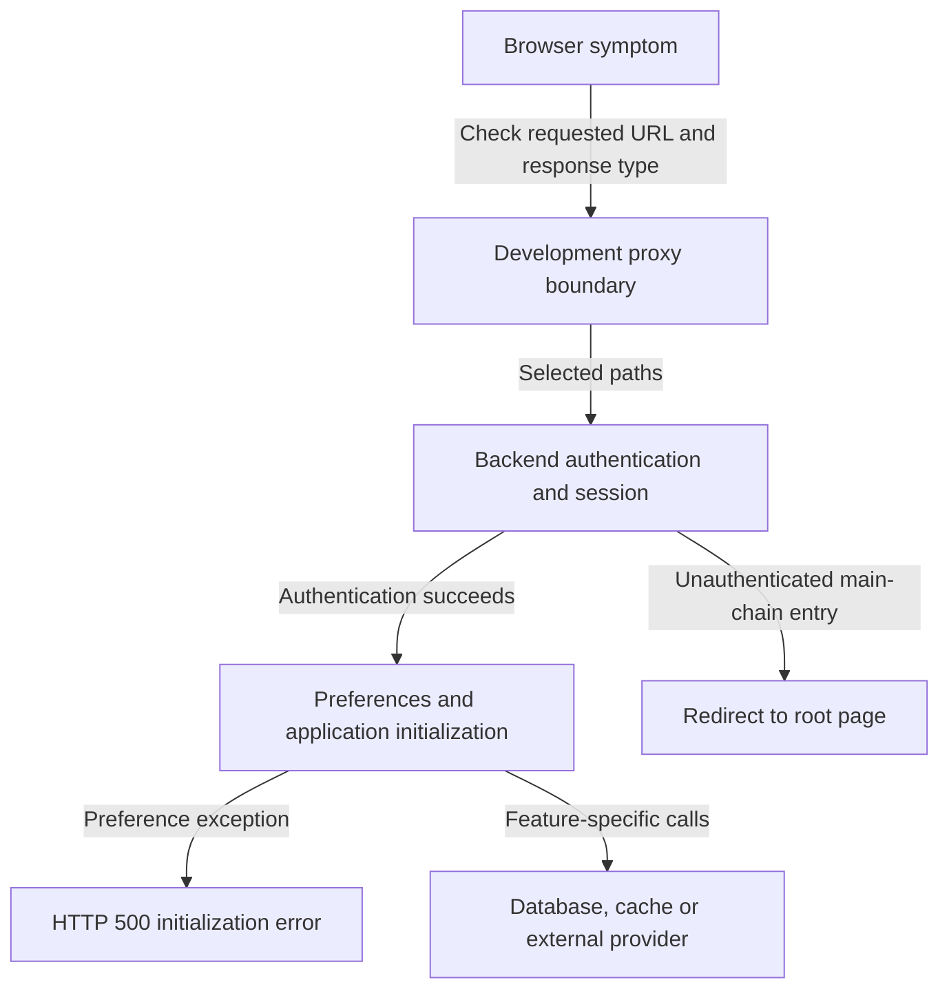

# Troubleshooting

[Project context](../project-context.md) · [Development / parent](index.md) · [Local setup](local-setup.md) · [Authentication](../cross-cutting/authentication-and-authorization.md)

**Research:** 2026-09-25 · branch `RP-10188` · revision `a6f611ae0`.
**Evidence convention:** **Confirmed** = source-backed behavior, not a reproduced incident; **Inferred** = diagnostic hypothesis; **Unknown** = unverified cause or environment. References are repository-relative `path:line` citations.

## Summary

Diagnose the first failing boundary. A login page, blank report, or missing feature can arise from configuration, session state, provider access, or application logic—not necessarily the visible Angular component. Authentication establishes identity; initialization still has to obtain preferences and runtime configuration before the browser can render the expected product.

This is a focused diagnostic view of the local/login path, not a universal claim that every endpoint initializes preferences. Redirect HTML and failed preference loading require different investigations. **Confirmed evidence:** `phoenix/proxy.config.mjs:1–45`; `realist/web/src/main/java/com/facl/uaf/realist/rest/security/configuration/MultipleLoginSecurityConfig.java:233–238,359–364`; `realist/web/src/main/java/com/facl/uaf/realist/rest/security/handlers/PhoenixAuthenticationSuccessHandler.java:40–53`; `realist/web/src/main/java/com/facl/uaf/realist/rest/service/LoginService.java:192–244`.

## Symptom map

Source behavior is **Confirmed**; the “likely layer” column is **Inferred**, not a confirmed incident cause. Inspect only authorized, sanitized log metadata.

| Symptom | Likely layer | Source and diagnostic evidence to inspect |
|---|---|---|
| Gradle fails before compiling | Java selection or plugin/artifact access | Wrapper errors distinguish missing Java from invalid `JAVA_HOME` (`gradlew.bat:39–66`). Settings directly load credential-property names before compilation (`settings.gradle:1–15`); repository declarations are in `build.gradle:22–46`. Check approved access, not application controllers. |
| Shell npm fails while Gradle npm works | Different Node/npm or registry setup | Managed download/version in `phoenix/build.gradle:3–9`; `.npmrc` copy and `ci --force` in `phoenix/build.gradle:43–64`. Compare executable selection and authorization without displaying auth values. |
| Startup has missing properties | Wrong/missing profile or external configuration | `Application.main` does not select `local` (`realist/web/src/main/java/com/facl/uaf/realist/Application.java:29–31`). Compare active profile names and required property keys with [configuration sources](../cross-cutting/configuration-and-feature-flags.md). |
| Database connection or schema validation fails | Datasource, provisioning, migration/schema mismatch | Local datasource, Flyway placeholder and Hibernate validation declarations: `realist/web/src/main/resources/application-local.yml:755–770`; dependencies: `realist/web/build.gradle:174–177`. Check approved target and migration history, not guessed credentials or schema recreation. |
| Configuration decryption fails | Bootstrap binding/resource lifecycle | `realist/web/src/main/java/com/facl/uaf/realist/config/KeystoreCfEnvProcessor.java:35–74`; build-time extraction: `realist/web/build.gradle:59–80`. Verify expected resource location and binding key names without reading keystore/private-key contents. |
| Login succeeds but initialization fails | Preference/configuration loading | `realist/web/src/main/java/com/facl/uaf/realist/rest/security/handlers/PhoenixAuthenticationSuccessHandler.java:40–48` maps preference failure to HTTP 500. Follow `loadUserSettings` in `realist/web/src/main/java/com/facl/uaf/realist/rest/service/LoginService.java:192–244`. |
| API returns HTML/redirect instead of JSON | Authentication entry point or wrong proxy route | Main chains redirect unauthenticated callers to `/`: `realist/web/src/main/java/com/facl/uaf/realist/rest/security/configuration/MultipleLoginSecurityConfig.java:233–238,359–364`. Compare original status/redirect chain and proxy context (`phoenix/proxy.config.mjs:1–45`). |
| Login loops locally | Cookie acceptance or proxy routing | Cookie helper: `uaf-common/action/src/main/java/com/facl/uaf/common/shared/util/UAFCommonUtil.java:1444–1469`; local attributes: `realist/web/src/main/resources/application-local.yml:633–638`; proxy: `phoenix/proxy.config.mjs:1–45`. Record rejection reason, not cookie value. |
| Session failures after deployment | Serialization compatibility or recovery-cookie mismatch | Redis serializer: `uaf-common/action/src/main/java/com/facl/uaf/common/shared/configuration/RedisConfiguration.java:81–90,132–137`; recovery filter: `realist/web/src/main/java/com/facl/uaf/realist/rest/security/filters/PreSessionDeserializationErrorFilter.java:24–48`. Compare cookie handling against `realist/web/src/test/java/com/facl/uaf/realist/rest/controller/SecurityConfigIntegrationTest.java:121–134`. |
| SAML callback cannot correlate | Expired/missing Redis request or route/configuration issue | Correlation repository: `realist/web/src/main/java/com/facl/uaf/realist/rest/security/services/saml2/RedisSaml2AuthenticationRequestRepository.java:33–40,50–88,99–178`. Compare callback timing and route, never paste assertions or RelayState values. |
| Unknown SAML MLS registration | Metadata/registration resolution | `realist/web/src/main/java/com/facl/uaf/realist/controller/SamlController.java:147–154`. Inspect sanitized registration outcome; for local redirects also compare `phoenix/proxy.config.mjs:30–38` with controller redirects at lines 120–138. |
| Feature remains disabled after database edit | Cached switch map or wrong MLS group | `realist/web/src/main/java/com/facl/uaf/realist/rest/service/FeatureToggleService.java:52–104`: active flag, normalized code/group, allow/deny lists, and explicit cache eviction are distinct checks. MLS means Multiple Listing Service here. |
| Ecom repeats 401 | Token refresh/invalidation | `uaf-common/action/src/main/java/com/facl/uaf/common/shared/service/RcslHelper.java:111–117` inserts null to invalidate, while `uaf-common/action/src/main/java/com/facl/uaf/common/shared/util/StartupStorage.java:43–47` ignores null. Reuse of a still-valid-age token is an inference, not a reproduced failure. |
| Active cart differs from saved items | Different data owners | Remote active-cart client: `realist/web/src/main/java/com/facl/uaf/realist/store/StoreApiClient.java:57–68`; local saved-for-later persistence: `realist/web/src/main/java/com/facl/uaf/realist/rest/service/CartService.java:50–83`. Do not compare them as one database query. |
| PDF generation returns nothing | Remote renderer or prepared request | `realist/web/src/main/java/com/facl/uaf/realist/service/reports/pdf/PdfClient.java:29–74` posts the request and returns null after caught failures. Separate request preparation from rendering/download using the [PDF flow](../feature-flows/pdf-generation-and-download.md). |
| Build passes without UI test results | Disabled task | `phoenix/build.gradle:83–94` prints a warning rather than running frontend tests. See [test boundaries](testing-and-quality.md). |
| Shared-link cleanup does nothing | Enable flag, expiry/grace, lease, batch | `realist/web/src/main/java/com/facl/uaf/realist/rest/service/sharedlink/SharedLinkCleanupService.java:57–89`. Confirm sanitized schedule/enable/cutoff/batch evidence and lock configuration before manually invoking deletion. |

## Safe diagnostic sequence

1. Record sanitized route, HTTP method/status, response content type, active profile names, and artifact version. A browser screenshot alone cannot locate the failed boundary.
2. Separate browser routing/proxy failure from backend authentication, initialization, and provider failure. A redirect followed by HTTP 200 HTML is not a successful JSON API response.
3. Inspect cookie **names and attributes**, not token values. Compare actual browser acceptance with configured attributes before changing security settings.
4. Compare runtime feature/configuration sources with the relevant consumer. A database row, cached feature map, and login response are different observations.
5. Inspect targeted cache behavior rather than flushing all Redis keys. Sessions, SAML correlation, shared metadata, tokens, and distributed locks have different lifecycles; see [Redis responsibilities](../cross-cutting/redis-caching-and-sessions.md).
6. Escalate provider failures with sanitized timing, status, and operation details. Do not infer the provider's internal database or transport implementation.

**Confirmed privacy caveat:** SAML handlers log identity attributes, and local PDF error logging may include report content. Do not attach raw logs, assertions, session headers, or request bodies to general documentation.

Evidence: `realist/web/src/main/java/com/facl/uaf/realist/rest/security/services/saml2/CustomSaml2AuthenticationSuccessHandler.java:55–59`; `realist/web/src/main/java/com/facl/uaf/realist/rest/security/services/saml2/Saml2AuthenticationManager.java:51–55`; `realist/web/src/main/java/com/facl/uaf/realist/service/reports/pdf/PdfClient.java:51–67`.

## Unknowns and next checks

No live incident was reproduced. Production log access, effective configuration, network connectivity, and operational recovery procedures remain outside this investigation.

- **Local setup owner:** verify actual listener/proxy ports and approved service readiness using [local setup](local-setup.md), rather than treating declarations as measurements.
- **Security/session owner:** check the actual failing profile and cookie/recovery path with sanitized evidence; do not assume every deserialization problem has the same cause.
- **Integration owner:** confirm provider authorization/availability and correlation procedures. Local PostgreSQL/Redis health cannot prove external provider health.
- **Operations/database owner:** approve any targeted eviction, cleanup, migration repair, or rollback. This chapter supplies investigation entry points, not permission to mutate shared environments.
