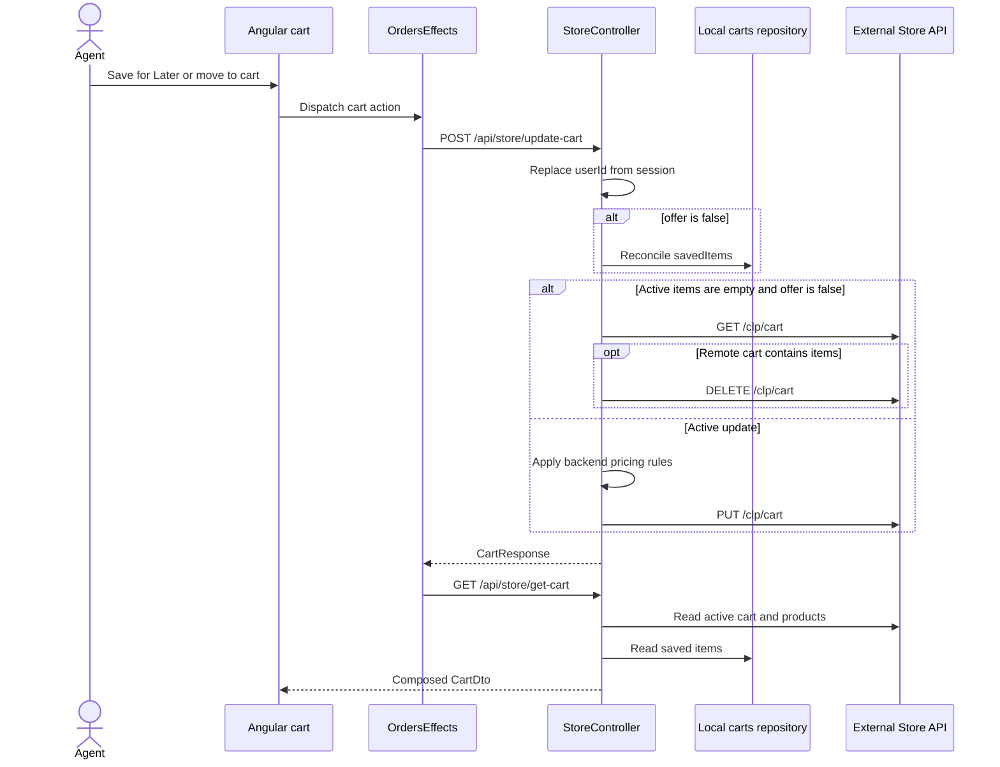
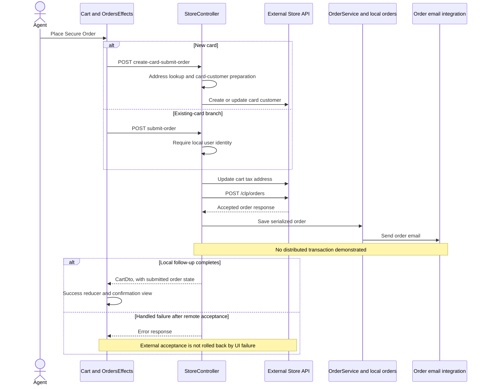
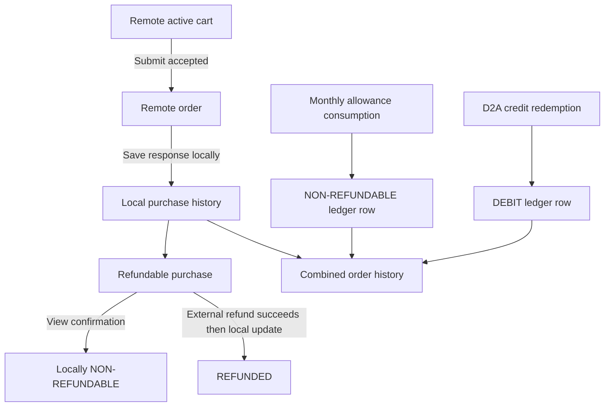
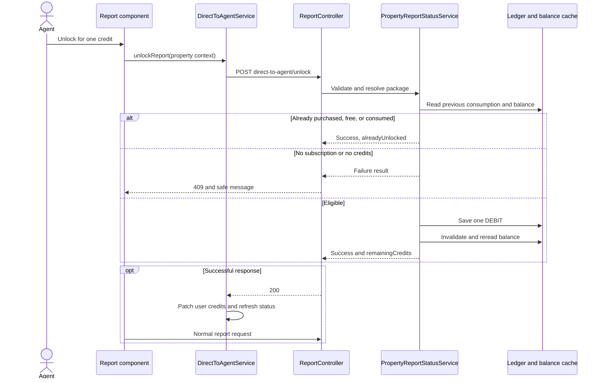

# Cart, Checkout, and Report Credits

[Project context](../project-context.md) | [Feature flows](index.md) | [Commerce UI](../frontend/commerce-and-sharing.md)

Research: 2026-09-25; branch RP-10188; revision a6f611ae0 (HEAD independently checked by coordinating author). Documentation-only source review; no runtime verification.

## Summary

Realist supports three distinct mechanisms: purchasing individual reports through an external commerce service, consuming monthly report allowances, and redeeming Direct-to-Agent subscription credits. Order history combines purchase records and credit-consumption records, but these records do not share one payment or accounting transaction.

**Evidence labels:** **Confirmed** means directly supported by inspected source; **Inferred** identifies consequences not demonstrated at runtime; **Unknown** marks unavailable evidence.

## 1. Purpose and ownership

| Mechanism | User purpose | Authoritative state | Evidence |
|---|---|---|---|
| Active cart | Collect reports for checkout | External Store API | `realist/web/src/main/java/com/facl/uaf/realist/rest/controller/StoreController.java:337-359,478-487`; `realist/web/src/main/java/com/facl/uaf/realist/store/StoreApiClient.java:57-100` |
| Saved for Later | Retain unpurchased selections | Local `carts` records | `realist/web/src/main/java/com/facl/uaf/realist/rest/service/CartService.java:50-99`; `realist/web/src/main/java/com/facl/uaf/realist/rest/model/store/entity/Carts.java:19-58` |
| Purchased orders | View purchases and request eligible returns | External order submission plus local serialized order records | `realist/web/src/main/java/com/facl/uaf/realist/rest/service/OrderService.java:55-77,230-239` |
| Monthly report allowance | Access eligible reports without a separate purchase | Remote feature usage, or local `report_limits`/`report_usage`, depending on configuration | `uaf-reports/action/src/main/java/com/facl/uaf/report/service/ReportLimitUsageService.java:49-113,115-197` |
| Direct-to-Agent credits | Redeem subscription credits for report access | `user_transaction_ledger` CREDIT/DEBIT/EXPIRED rows | `uaf-reports/action/src/main/java/com/facl/uaf/report/service/CreditProcessingService.java:333-346`; `uaf-reports/action/src/main/java/com/facl/uaf/report/service/TransactionLedgerService.java:113-156` |

**Confirmed:** "Saved for Later" here means saved commerce selections, not favorite properties or saved-search templates.

An APN is an assessor parcel number. A Federal Information Processing Standards (FIPS) county code supplies geographic context; MLS means Multiple Listing Service, whose group identifies configuration and entitlement context here. Direct-to-Agent (D2A) denotes the subscription/package experience. Their treatment is not uniform across commerce and accounting: some matching paths include county, while others compare APN without county.

## 2. Entry points and browser state

**Confirmed:** Orders routes are lazy-loaded and guarded by `AuthGuard`. The feature module supplies cart, history, details, and return screens.

- Root registration: `phoenix/src/app/app-routing.module.ts:79-98`.
- Child routes: `phoenix/src/app/orders/orders-router.module.ts:9-38`.
- Registered state/effects: `phoenix/src/app/app-state.module.ts:49-64,134-137`.
- Cart actions: `phoenix/src/app/orders/components/cart/cart.component.ts:227-290`.
- HTTP service: `phoenix/src/app/orders/services/orders.services.ts:17-117`.

`OrdersReducer` stores the current cart, summary, item count, offers, selected order, order history, and payment-related UI state. Successful checkout replaces `cart` and `order`, then sets the cart count to zero.

Evidence: `phoenix/src/app/store/orders/orders.reducer.ts:4-25,28-41,63-76,120-138`.

## 3. Cart update contract

### Sanitized request shape

```json
{
  "items": [
    {
      "productId": "<report-product>",
      "skuId": "<sku>",
      "quantity": 1,
      "price": 0,
      "dynamicPrice": false,
      "requestPayloadPartial": "<display-address>",
      "requestPayloadFull": "<serialized-property-context>"
    }
  ],
  "savedItems": [
    {
      "productId": "<saved-report-product>",
      "price": 0,
      "requestPayloadPartial": "<display-address>",
      "requestPayloadFull": "<serialized-property-context>"
    }
  ],
  "coupons": ["<promotion-code>"],
  "offer": false
}
```

This is a structural example, not a runnable purchase request: zero prices are numeric placeholders, not free-report promises. `requestPayloadFull` is JSON serialized into a **string**; `savedItems` contains objects, not serialized object strings.

`UpdateCartDto` extends the repository's external-facing `UpdateCartRequest` model with `offer` and `savedItems`; omitted `offer` defaults to false. `savedItems` binds to `List<Carts>`. This DTO is not evidence of a separate deployed service or an unavailable library implementation.

Evidence: `realist/web/src/main/java/com/facl/uaf/realist/rest/model/store/dto/UpdateCartDto.java:8-31`; `realist/web/src/main/java/com/facl/uaf/realist/store/dto/cart/UpdateCartRequest.java:23-38`; `realist/web/src/main/java/com/facl/uaf/realist/rest/model/store/entity/Carts.java:37-58`.

### Actual update flow

**Confirmed:**

1. Cart actions combine the selected item with current NgRx cart state.
2. Angular posts the full desired collections to `POST /api/store/update-cart`.
3. `StoreController.updateCart()` replaces the supplied user identifier with the session-derived commerce identity.
4. When `offer == false`, `CartService.saveForLater()` updates local saved rows.
5. If the active collection is empty, the controller reads the remote cart and deletes it if populated.
6. Otherwise, backend pricing adjustments run before `StoreApiClient.updateCart()` sends `PUT /clp/cart`.
7. Most effects subsequently dispatch `GetCart`, rebuilding browser state from the composed server response.

Evidence:

- `phoenix/src/app/store/orders/orders.effects.ts:605-629,699-755,758-801`.
- `realist/web/src/main/java/com/facl/uaf/realist/rest/controller/StoreController.java:337-359`.
- `realist/web/src/main/java/com/facl/uaf/realist/store/StoreApiClient.java:71-100`.



### Storage and matching details

**Confirmed:**

- Saved rows are matched using exact `productId` and exact serialized `requestPayloadFull` equality.
- Existing matching rows are retained; removed rows are deleted; new rows are inserted.
- Saved rows store user/product/price and property payloads. Product metadata is enriched when reading.
- `offer:true` bypasses `saveForLater()`, even when the frontend sends a filtered `savedItems` collection.
- Angular normalizes returned active and saved item quantities to one.
- Active-cart price selection prefers dynamic price, then sale price, then list price.
- The displayed cart combines remote items and totals with locally saved items.

Evidence: `realist/web/src/main/java/com/facl/uaf/realist/rest/service/CartService.java:50-89,95-99,134-179`; `phoenix/src/app/orders/services/orders.services.ts:17-31`; `phoenix/src/app/store/orders/orders.effects.ts:447-455`.

**Inferred:** Equivalent property JSON with different serialization can be treated as a different saved item. A local saved-item update can remain committed when the later remote cart request fails.

### Pricing is not solely client-controlled

**Confirmed:** `getUpdatedCartRequest()` handles Direct-to-Agent pricing, package discounts, MLS price overrides, and bundle pricing.

For an incoming dynamic-price item, an active Direct-to-Agent context with a resolved backend `pricePerReport` replaces the client price. Otherwise, the method clears the dynamic-price flag and continues through normal pricing rules.

Evidence: `realist/web/src/main/java/com/facl/uaf/realist/rest/controller/StoreController.java:490-582`.

Do not infer deployed prices from code defaults or documentation examples.

## 4. Checkout and external payment boundary

### Browser-to-server chain

**Confirmed:**

- `StripePaymentComponent` mounts provider card elements and requests a provider token after card elements and the customer form are valid.
- It dispatches `SetCurrentStripeCard` and emits the token to its parent.
- `CartComponent` separately calls the tax-address endpoint and enables checkout only when the required UI conditions are satisfied.
- `placeSecureOrder()` dispatches `SaveCard` for a new card or `SubmitOrder` otherwise.
- `saveCard$` builds the new-card request, serializing `taxAddress` as JSON text.
- A successful response with cart state `SUBMITTED` switches the screen to "Purchase Confirmed."

Evidence:

- `phoenix/src/app/shared/components/stripe-payment/stripe-payment.component.ts:88-115,137-161`.
- `phoenix/src/app/orders/components/cart/cart.component.ts:120-127,176-205,257-290`.
- `phoenix/src/app/orders/components/cart/cart.component.html:141-153`.
- `phoenix/src/app/store/orders/orders.effects.ts:805-821,848-895`.

No real payment values are needed to understand this boundary.

### Sanitized checkout inputs and outputs

The existing-card browser branch posts this projection to `POST /api/store/submit-order`:

```json
{
  "chargeToken": "<provider-token-placeholder>",
  "customerEmail": "<email-placeholder>",
  "orderId": "<cart-id-placeholder>"
}
```

`CartComponent.registerValueForOrder()` constructs these fields; the backend binds them to `Orders`, whose payment/customer fields are transient. The controller obtains commerce identity from the session-derived service and submits the ID returned by its cart-update operation, rather than treating the supplied `orderId` as authoritative.

The new-card branch posts card metadata and a provider token to `POST /api/store/create-card-submit-order`. Its `taxAddress` is **JSON text**, whereas `/api/store/update-tax-address` receives a nested `taxAddress` **object**. Do not substitute one endpoint's shape for the other, send raw card numbers, or copy real tokens into diagnostic examples.

| Contract | Important runtime shape |
|---|---|
| Update cart response | `CartResponse` from the Store API model; this is not the composed display cart |
| Read cart / successful checkout response | `CartDto`: `cartId`, `state`, numeric `total`/`subtotal`/`tax`/`discount`, `cartItems`, `savedItems`; checkout also supplies submitted/eligible return dates |
| `cartItems` entry | Object with product, display/property context, price and order-item/refund information as populated by the mapper |
| `savedItems` on read cart | Locally persisted Saved for Later selections |
| `savedItems` on mapped order | Refunded order items, **not** local saved-cart rows |
| History response | Array of mapped `CartDto` entries, including selected credit-ledger entries |

Angular's `HttpClient` generic names (`CartInfo`, `Order`, `CartOrder`) do not perform runtime schema validation or change the Java handler's response shape. The effects reload the composed cart after updates; checkout uses its returned order/cart projection directly.

Evidence: `phoenix/src/app/orders/components/cart/cart.component.ts:257-290`; `phoenix/src/app/store/orders/orders.effects.ts:848-895`; `phoenix/src/app/orders/services/orders.services.ts:76-94,108-116`; `realist/web/src/main/java/com/facl/uaf/realist/rest/model/store/entity/Orders.java:24-36`; `realist/web/src/main/java/com/facl/uaf/realist/rest/model/store/dto/CartDto.java:24-39`; `realist/web/src/main/java/com/facl/uaf/realist/rest/service/CartService.java:285-357`; `realist/web/src/main/java/com/facl/uaf/realist/rest/controller/StoreController.java:337-356,681-705`.

### Server contracts

| Endpoint | Processing | Principal result/error branches |
|---|---|---|
| `POST /api/store/update-tax-address` | Session user -> remote cart tax-address update -> composed cart reload | 200 `CartDto`; remote 422 becomes local 400 invalid-address message; other handled failures become 400 |
| `POST /api/store/create-card-submit-order` | Address lookup -> remote card-customer creation/update -> remote cart update -> remote order submission -> local order save/email -> identity save | 200 `CartDto`; empty address lookup gives 424 and empty `CartDto`; handled order failures give 400 or 500 |
| `POST /api/store/submit-order` | Require local user identity -> update remote tax address -> submit remote order -> local save/email | 200 `CartDto`; missing identity or handled failure gives 400 |
| `GET /api/get-credit-cards` | Returns empty collection | 200 `[]`; comment explicitly says cards are no longer stored |
| `GET /api/get-store-cards` | Calls external card-customer lookup | External-client behavior applies |

Evidence: `realist/web/src/main/java/com/facl/uaf/realist/rest/controller/StoreController.java:227-304,322-335,362-381,681-713`.

The remote submission shape contains `userId`, optional `customerId`, `id`, and `payment`. The controller supplies the cart ID as `id`.

Evidence: `realist/web/src/main/java/com/facl/uaf/realist/store/dto/order/SubmitOrderRequest.java:16-24`; `realist/web/src/main/java/com/facl/uaf/realist/rest/controller/StoreController.java:279-289`.

### External integration

**Confirmed:**

- `StoreApiClient.submitOrder()` sends `POST /clp/orders`.
- The configured client uses OAuth registration `clp-services`.
- Configuration consumers include `storeapiservice.url` and `clpservices.oauth2.client`.
- These controller/service calls are direct Java calls. `ServiceHandler` is not inserted between the cart controller and Store API.

Evidence: `realist/web/src/main/java/com/facl/uaf/realist/store/StoreApiClient.java:103-114`; `realist/web/src/main/java/com/facl/uaf/realist/store/StoreClientStarter.java:22-60`.

**Unknown:** External payment authorization, settlement, order deduplication, and refund guarantees are outside this repository.

### Atomicity and retry warning

**Confirmed:** Remote submission occurs before local `OrderService.saveOrder()`. That method saves serialized `OrderResponse` and then sends an order email.

Evidence: `realist/web/src/main/java/com/facl/uaf/realist/rest/controller/StoreController.java:289-300`; `realist/web/src/main/java/com/facl/uaf/realist/rest/service/OrderService.java:55-68`.

**Inferred:** A failure after remote acceptance can produce a frontend failure despite an accepted external purchase. There is no distributed transaction demonstrated across payment, local persistence, and email.

**Unknown:** The inspected submission method and DTO expose no dedicated idempotency key, but the external service may deduplicate using the order/cart identifier. Do not claim either guaranteed safe retries or guaranteed duplicate charging.



This sequence shows the successful remote-submission path and its later failure boundary, not every early address/card error; those branches are in the contract table. New-card success additionally saves local user identity. Evidence: `realist/web/src/main/java/com/facl/uaf/realist/rest/controller/StoreController.java:227-304,681-713`; `realist/web/src/main/java/com/facl/uaf/realist/rest/service/OrderService.java:55-68`; `phoenix/src/app/store/orders/orders.reducer.ts:120-138`.

## 5. Order history, viewing, and refunds

### History is locally composed

**Confirmed:** The normal Angular history call is `GET /api/store/orders`, not `/api/store/order-history`.

The server:

1. Loads locally stored `orders.orderObject` JSON.
2. Deserializes it into order responses.
3. Converts purchases to `CartDto`.
4. Appends eligible ledger transactions converted into zero-priced order-like entries.

Evidence:

- `phoenix/src/app/orders/services/orders.services.ts:88-94`.
- `realist/web/src/main/java/com/facl/uaf/realist/rest/controller/StoreController.java:715-727,994-1010`.
- `realist/web/src/main/java/com/facl/uaf/realist/rest/service/OrderService.java:70-77`.
- `realist/web/src/main/java/com/facl/uaf/realist/rest/service/StoreService.java:62-105`.

Ledger history selects rows whose status is `NON-REFUNDABLE` **or** whose accounting type is `DEBIT`. It does not show every CREDIT or EXPIRED accrual record.

Evidence: `uaf-reports/action/src/main/java/com/facl/uaf/report/repository/UserTransactionLedgerRepository.java:17-23`; `uaf-reports/action/src/main/java/com/facl/uaf/report/service/TransactionLedgerService.java:206-222`.

### Purchased is not the same as viewed

**Confirmed:**

- `isReportPurchased()` recognizes a matching, non-refunded purchase.
- `isProductPurchasedAndViewed()` requires local `NON_REFUNDABLE` status.
- `isPurchasePendingConfirmation()` identifies refundable purchases.
- `POST /api/store/set-non-refundable` updates the first matching local serialized order item.
- Several Angular effects perform this operation before requesting the report.

Evidence: `realist/web/src/main/java/com/facl/uaf/realist/rest/service/OrderService.java:80-113,168-218`; `realist/web/src/main/java/com/facl/uaf/realist/rest/controller/StoreController.java:770-774`; `phoenix/src/app/store/orders/orders.effects.ts:84-225`.

The inspected `setAsNonRefundable()` path does **not** update the external order.

Matching accepts product ID or SKU and removes hyphens from APNs. County is not part of that comparison.

### Refund flow

**Confirmed:**

1. Return UI selects items not marked `NON-REFUNDABLE`.
2. It posts `{orderId, items:[{itemId, reason}]}` to `/api/store/cancel-order`.
3. The controller calls external `POST /clp/refunds`.
4. It marks matching local order items `REFUNDED`.
5. It returns refreshed history.
6. Angular displays a return-submitted message with estimated refund timing.

Evidence:

- `phoenix/src/app/orders/components/order-return/order-return.component.ts:36-77`.
- `phoenix/src/app/store/orders/orders.effects.ts:824-843`.
- `realist/web/src/main/java/com/facl/uaf/realist/rest/controller/StoreController.java:744-753`.
- `realist/web/src/main/java/com/facl/uaf/realist/store/StoreApiClient.java:353-364`.
- `realist/web/src/main/java/com/facl/uaf/realist/rest/service/OrderService.java:230-239`.

`CartService.fillOrder()` places refunded items in `savedItems`. In this response context, that field means canceled/refunded items--not Saved for Later commerce rows.

A return date is exposed only when at least one item is refundable and `submittedDate + flood.map.return.numberOfDays` remains in the future.

Evidence: `realist/web/src/main/java/com/facl/uaf/realist/rest/service/CartService.java:285-325,348-357`.

**Unknown:** External enforcement of refund eligibility and timing. The inspected cancellation handler forwards the request rather than rechecking the entire UI eligibility calculation.



This diagram deliberately separates purchase/refund state from credit accounting.

## 6. Monthly report allowances

### Read paths

**Confirmed:** `realist.report.limits.enabled` selects the accounting path.

- **Disabled:** `getReportUsage()` delegates to `UserAccessAction.getFeatureUsageInfo()`.
- **Enabled:** it reads the current UTC month's `ReportLimit`.
- If absent, it fetches remote usage and persists a baseline.
- `current_limit` is treated by Java as **remaining availability**; `total_limit - current_limit` is used usage.

Evidence: `uaf-reports/action/src/main/java/com/facl/uaf/report/service/ReportLimitUsageService.java:49-113`.

The migration comment describing `current_limit` as "Current usage count" conflicts with the service's operational meaning.

Evidence: `realist/web/src/main/resources/db/migration/V20260119090329__report_limits.sql:25-26`.

`GET /api/reports/usage-summary` is different: it batches reads and uses transient fallback objects without persisting missing limit rows.

Evidence: `phoenix/src/app/reports/services/reports.service.ts:105-112`; `realist/web/src/main/java/com/facl/uaf/realist/rest/controller/ReportController.java:858-890`; `uaf-reports/action/src/main/java/com/facl/uaf/report/service/ReportLimitUsageService.java:365-468`.

Do not confuse that monthly summary with `GET /api/reports/property-status?apn=…` (per-feature unlock metadata) or `GET /api/reports/property-status/mls-credit?apn=…` (feature-to-boolean consumed/free status). Both property-status handlers reject a blank APN with 400. Angular uses GET for these reads and POST only for the separate D2A unlock operation. These handlers have explicit `@GetMapping`/`@PostMapping`; their method labels are not inferred from unrestricted mappings.

Evidence: `phoenix/src/app/reports/services/reports.service.ts:105-112,635-642`; `realist/web/src/main/java/com/facl/uaf/realist/rest/controller/ReportController.java:862-903`.

### Consumption path

**Confirmed:** With local tracking enabled, `updateReportUsage()`:

1. Checks for usage by user, MLS, feature, UTC month/year, and APN.
2. Returns false when a matching record exists.
3. Saves a usage row.
4. Saves a zero-amount `NON-REFUNDABLE` ledger row.
5. Finds the monthly limit and decrements it by one if present.

Document images add `documentSearchKey`; Community Insights adds `productId` to the usage lookup.

Evidence: `uaf-reports/action/src/main/java/com/facl/uaf/report/service/ReportLimitUsageService.java:115-197,200-281,285-320`; `uaf-reports/action/src/main/java/com/facl/uaf/report/repository/ReportUsageRepository.java:14-56`.

**Confirmed:** County is stored but omitted from these duplicate predicates.

### Accounting timing differs by report

| Caller | Accounting timing |
|---|---|
| Premium Flood | After report retrieval, only when report exists and payment is not required |
| Building Permits | Before `buildingPermitsService.getBuildingPermits()` in the allowance branch |
| Community Insights | Before requesting the provider PDF links |
| Hazard | After conversion, when XML is non-null and `trackUsage` is true |
| Document Image | After non-null image bytes, with ecommerce/free-report branches |

Evidence:

- `realist/web/src/main/java/com/facl/uaf/realist/rest/controller/ReportController.java:374-388,723-740,795-805`.
- `realist/web/src/main/java/com/facl/uaf/realist/rest/service/report/HazardService.java:101-129`.
- `uaf-reports/action/src/main/java/com/facl/uaf/report/documentimage/DocumentImageService.java:211-255`.

**Inferred:** A later provider failure can leave usage recorded for paths that debit before fetching data. There is no universal "debit only after successful rendering" rule.

### Eligibility is not consumption

`GET /api/reports/eligible-for-free-credit?featureCode=...&apn=...&productId=...` returns:

```json
{
  "eligible": true,
  "availableLimit": "<number>",
  "totalLimit": "<number>"
}
```

**Confirmed:** Eligibility is false when the report is already purchased, free by preference, or already represented in the ledger; otherwise it depends on positive availability. Consequently, `eligible:false` does not necessarily mean access denied.

Evidence: `realist/web/src/main/java/com/facl/uaf/realist/rest/service/ReportService.java:520-565`; `realist/web/src/main/java/com/facl/uaf/realist/rest/controller/ReportController.java:840-845`.

## 7. Direct-to-Agent subscription credits

### Accrual and expiry

**Confirmed:** Login package refresh calls `CreditProcessingService.processEntitlementCredits()`.

- Entitlements not explicitly allowed are skipped.
- Products must exist and be active.
- Monthly accrual starts at the assignment date, then advances using `plusMonths(1)`.
- Yearly accrual inserts one row at assignment date; this method does not implement an annual-renewal loop.
- Missing assignment dates fall back to current UTC date.
- Revocation is recognized when its date is strictly before today.
- Revocation processing backfills eligible accrual and inserts an EXPIRED row, including a zero-credit marker when necessary.

Evidence:

- `realist/web/src/main/java/com/facl/uaf/realist/rest/service/LoginService.java:395`.
- `realist/web/src/main/java/com/facl/uaf/realist/rest/service/ecommerce/EcomService.java:235-291`.
- `uaf-reports/action/src/main/java/com/facl/uaf/report/service/CreditProcessingService.java:58-124,137-216,227-279,364-403,430-439`.

Available credits are:

```text
max(0, sum(CREDIT) - sum(DEBIT) - sum(EXPIRED))
```

The inspected sum queries filter user, MLS, product, and accounting type--not effective-date cutoff.

The balance cache uses `CREDIT_AVAIL_<mls>_<user>_<product>` and `cache.credit-available.ttl`, whose code default is 3600 seconds.

Evidence: `uaf-reports/action/src/main/java/com/facl/uaf/report/service/CreditProcessingService.java:43-44,296-325,333-357,481-483`; `uaf-reports/action/src/main/java/com/facl/uaf/report/repository/UserTransactionLedgerRepository.java:85-93`.

### Unlock contract

`POST /api/reports/direct-to-agent/unlock`

```json
{
  "featureCode": "<supported-feature>",
  "apn": "<property-apn>",
  "countyId": "<county-code>",
  "address": "<display-address>",
  "requestPayloadPartial": "<display-address>",
  "productId": "<required-for-community-insights>"
}
```

Success shape:

```json
{
  "success": true,
  "unlockStatus": "UNLOCKED",
  "alreadyUnlocked": false,
  "featureCode": "<feature>",
  "apn": "<apn>",
  "remainingCredits": "<number>",
  "partialProgress": null,
  "message": null
}
```

**Confirmed:**

1. Validate feature/APN and Community Insights product ID.
2. Resolve session identity and supported report product.
3. Resolve package and available balance.
4. If purchased, free, or already consumed, return success without a debit.
5. Otherwise require an active subscription and at least one credit.
6. Write one `DEBIT`, status `NON-REFUNDABLE`, amount zero, linked to the subscription product.
7. Invalidate the balance cache, reread balance, and build response.

Community Insights can return `PARTIAL` because its feature aggregates multiple report products.

Evidence: `realist/web/src/main/java/com/facl/uaf/realist/rest/service/ecommerce/PropertyReportStatusService.java:156-323`; `uaf-reports/action/src/main/java/com/facl/uaf/report/service/TransactionLedgerService.java:113-156`.

**Confirmed supported mappings:** Premium Flood `FCFLDPREM` -> `FMK`; Hazard `FCHAZRD` -> `HZR`; Building Permits `FCBLDGPRMT` -> `BPR`; Community Insights `FCCMYNSGTS` uses the supplied product ID, with status aggregation expecting `REST`, `SCHOOL`, `ECDEM`, and `TRFO`. The unlock resolver's nonblank Community Insights product-ID handling is not itself an explicit allowlist of those four values.

**Configuration caveat:** `realist.report.limits.enabled` defaults false in this service; a false value logs a warning but does **not** unconditionally disable D2A redemption. Separately, `ecom.d2a.debug.enabled` defaults false. When enabled, package resolution bypasses Ecom, treats the constructed package as active, and uses `ecom.d2a.debug.package-product-code`; balance still comes from the ledger. These are code paths/defaults, not claims about deployed settings.

Evidence: `realist/web/src/main/java/com/facl/uaf/realist/rest/service/ecommerce/PropertyReportStatusService.java:53-76,161-172,230-267`.

| Outcome | HTTP result |
|---|---|
| Successful or already unlocked | 200 |
| Blank feature code or APN | 400 |
| Other returned failure, including insufficient credits, inactive subscription, unsupported type, missing Community Insights product, or service-level unauthorized result | 409 |
| Exception before/after the handled service region | Not fully characterized here |

Evidence: `realist/web/src/main/java/com/facl/uaf/realist/rest/controller/ReportController.java:893-903`.

General authentication filters may reject requests before this method; see the security chapter.

Failure bodies set `success:false`, `unlockStatus:"FAILED"`, `alreadyUnlocked:false`, the feature/APN, nullable `remainingCredits`, `partialProgress:null`, an `errorCode`, and a user-facing `message`. Codes include `INVALID_REQUEST`, `PRODUCT_ID_REQUIRED`, `UNAUTHORIZED`, `UNSUPPORTED_REPORT_TYPE`, `NO_ACTIVE_SUBSCRIPTION`, `INSUFFICIENT_CREDITS`, and `UNLOCK_FAILED`. An `UNLOCK_FAILED` result can follow a saved debit; it is not proof that nothing changed.

Evidence: `realist/web/src/main/java/com/facl/uaf/realist/rest/service/ecommerce/PropertyReportStatusService.java:43-50,208-226,313-324`.

### Browser response

**Confirmed:** `DirectToAgentService.unlockReport()` patches the user credit count and refreshes the property-status stream after success. Report components then issue their normal report requests.

Example: Building Permits confirms redemption, calls `unlockReport()`, and dispatches `GetBuildingPermitsReport` only after the successful HTTP result.

Evidence: `phoenix/src/app/shared/services/direct-to-agent.service.ts:96-108`; `phoenix/src/app/reports/components/building-permits/building-permits.component.ts:326-356`.



## 8. Exact atomicity findings

### Monthly accounting

**Confirmed:**

- `ReportLimitUsageService` does not declare an enclosing transaction for usage-save -> ledger-save -> limit-decrement.
- The inspected methods use read-then-write operations.
- `ReportLimit` has no optimistic-lock `@Version`.
- Usage lookup indexes are not uniqueness constraints.
- No conditional "decrement only if positive" update appears in the inspected service.

Evidence: `uaf-reports/action/src/main/java/com/facl/uaf/report/service/ReportLimitUsageService.java:37-40,146-190`; `uaf-reports/action/src/main/java/com/facl/uaf/report/entity/ReportLimit.java:11-29`; `uaf-reports/action/src/main/java/com/facl/uaf/report/entity/ReportUsage.java:16-53`; relevant migrations listed below.

**Inferred:** Concurrent consumption can duplicate usage, lose a decrement, or leave partial accounting after a failure. Source does not establish atomic consumption.

### Direct-to-Agent debit

**Confirmed:**

- Unlock checks existing access and cached/computed balance before a separate ledger save.
- `PropertyReportStatusService` and `TransactionLedgerService.storeDirectToAgentDebit()` do not declare a surrounding transaction or locking operation.
- Ledger uniqueness is on generated `transaction_id`, not the report-redemption business identity.
- Duplicate lookup ignores county and date; Community Insights additionally checks product ID.

Evidence: `realist/web/src/main/java/com/facl/uaf/realist/rest/service/ecommerce/PropertyReportStatusService.java:36-39,191-226`; `uaf-reports/action/src/main/java/com/facl/uaf/report/service/TransactionLedgerService.java:113-156,245-266`; `uaf-reports/action/src/main/java/com/facl/uaf/report/repository/UserTransactionLedgerRepository.java:25-64`; `uaf-reports/action/src/main/java/com/facl/uaf/report/entity/UserTransactionLedger.java:23-29`.

**Inferred:** Concurrent unlock requests can both pass the checks. Sequential repeat protection is not proof of concurrent exactly-once redemption. A post-save cache/status failure can return failure after the debit was stored.

### Accrual

**Confirmed:** Accrual has `@Transactional`, but duplicate prevention remains an existence check followed by insertion. The inspected schema does not enforce uniqueness on user/MLS/product/type/effective date.

The entitlement loop catches exceptions internally; it is not a separate transaction per entitlement. Cache changes are not shown as transactionally coupled to database commit.

Evidence: `uaf-reports/action/src/main/java/com/facl/uaf/report/service/CreditProcessingService.java:58-59,116-120,369-403`.

Relevant cumulative schema evidence:

- `realist/web/src/main/resources/db/migration/V20260119090329__report_limits.sql:1-49`
- `realist/web/src/main/resources/db/migration/V20260128120000__alter_report_user_id_to_varchar.sql:1-3`
- `realist/web/src/main/resources/db/migration/V20260128151000__alter_custom_attributes_to_jsonb.sql:1`
- `realist/web/src/main/resources/db/migration/V20260130100000__add_jsonb_indexes_report_usage.sql:1-3`
- `realist/web/src/main/resources/db/migration/V20260203100000__add_product_id_index_report_usage.sql:1`
- `realist/web/src/main/resources/db/migration/V20260205120000__create_user_transaction_ledger.sql:1-18`
- `realist/web/src/main/resources/db/migration/V20260511210000__alter_user_transaction_ledger_add_product_credit_fields.sql:1-19`

## 9. Debugging reading path

| Symptom | Start here |
|---|---|
| Saved selection remains after adding from an offer | `offer:true` branch in `StoreController.updateCart()`; then effect request construction |
| Cart quantity remains stale at zero | `OrdersEffects.getCartSize$`, `phoenix/src/app/store/orders/orders.effects.ts:256-269`: `filter(Boolean)` drops zero |
| Product cache repeatedly misses | `realist/web/src/main/java/com/facl/uaf/realist/rest/service/StoreService.java:47-59`: write key includes `":"`; read construction does not |
| Purchase confirmed externally but absent locally | Remote submit -> `OrderService.saveOrder()` -> email ordering |
| Report appears unlocked but is awaiting purchase confirmation | Compare `isReportPurchased()` with `isProductPurchasedAndViewed()` |
| Balance differs from monthly availability | Determine whether screen uses report limits or Direct-to-Agent ledger balance |
| Credit consumed despite later failure | Check debit timing and cache/status failures after save |
| Same APN in different counties behaves unexpectedly | Compare frontend county-aware removal with backend APN-only matching |

## 10. Tests and next checks

**Confirmed existing test sources, not executed:**

- `phoenix/src/app/store/orders/orders.effects.spec.ts`: cart matching/removal cases.
- `realist/web/src/test/java/com/facl/uaf/realist/rest/controller/StoreControllerTest.java`.
- `uaf-reports/action/src/test/java/com/facl/uaf/report/service/ReportLimitUsageServiceTest.java`.
- `uaf-reports/action/src/test/java/com/facl/uaf/report/service/CreditProcessingServiceTest.java`.
- `uaf-reports/action/src/test/java/com/facl/uaf/report/service/TransactionLedgerServiceTest.java`.

The Spring-wired D2A integration test mocks ledger/product repositories and caches. It therefore does not establish PostgreSQL concurrency behavior.

Evidence: `realist/web/src/test/java/com/facl/uaf/realist/rest/service/ecommerce/D2ACreditSpringBootIntegrationTest.java:140-175`.

**Prioritized next checks:**

1. Exercise concurrent same-report redemption and last-credit redemption against PostgreSQL.
2. Inject failures between monthly usage, ledger, and limit writes.
3. Establish the external Store API's idempotency and reconciliation contract before recommending retry behavior.
4. Verify purchase-success/local-save-failure and refund-success/local-save-failure handling.
5. Review cross-county APN identity consistently across cart, order, usage, and ledger paths.

No implementation changes or data corrections were made; rollback is not applicable to this research.

## Related documentation

- [Report availability](../frontend/reports/availability-and-access-rules.md)
- [Report catalogue](../frontend/reports/report-catalogue.md)
- [Reports backend module](../backend/modules/uaf-reports.md)
- [Database and migrations](../cross-cutting/database-and-migrations.md)
- [Authentication and authorization](../cross-cutting/authentication-and-authorization.md)
- [External integrations](../cross-cutting/external-integrations.md)
