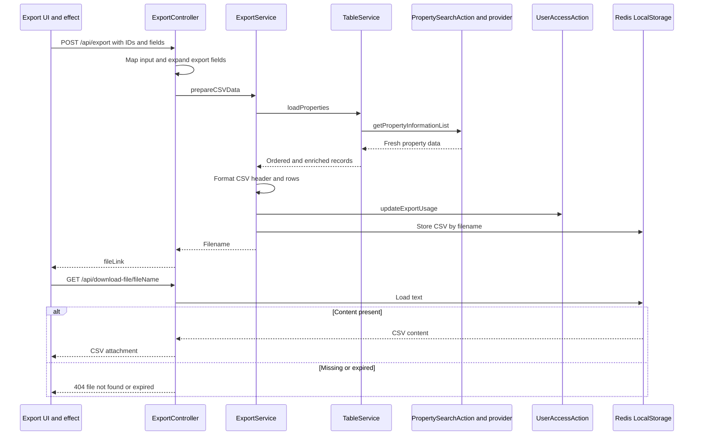
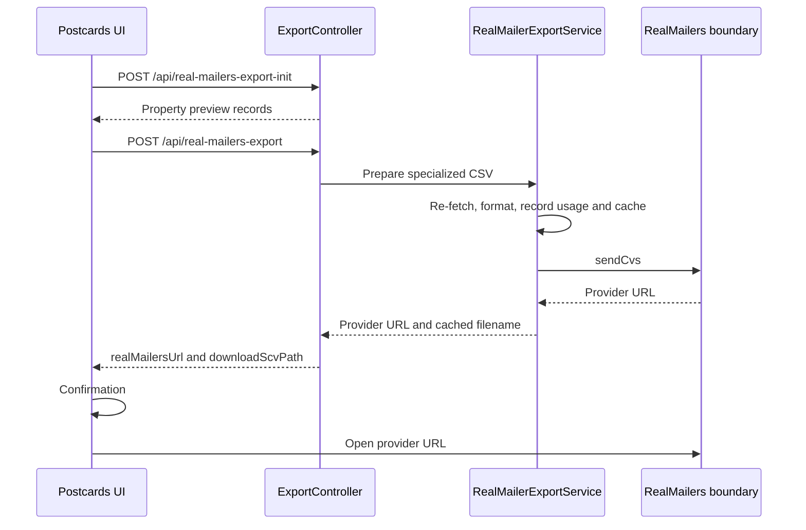

# CSV exports, mailing labels and postcards

[Project context](../project-context.md) · [Feature flows](index.md) · [Reports](../frontend/reports/index.md) · [Search](../frontend/search/index.md)

## Purpose and distinct outputs

CSV export re-fetches property data using identifiers and field definitions, formats it locally, records usage and caches the result for download. Mailing labels produce **RTF**, through a separate address-processing path. Postcards produce a specialized CSV and hand off to external RealMailers.

**Confirmed baseline:** `RP-10188` / `a6f611ae0`, 2026-09-25. No builds/tests, installations, external calls or services were performed.

Repository-relative source abbreviations:

- `F` = `phoenix\src\app`
- `W` = `realist\web\src\main\java\com\facl\uaf\realist`
- `S` = `uaf-propertysearch\action\src\main\java\com\facl\uaf\propertysearch`
- `C` = `uaf-common\action\src\main\java\com\facl\uaf\common`

Controller citations below are under `W\rest\controller`. Server `ExportService` and `RealMailerExportService` are under `W\service`; `TableService` is under `W\service\dashboard\table`; `FileService` is under `W\rest\service`. Frontend `ExportService` is a separate TypeScript class.

## Contract map

| Browser method | Browser request | Backend handler |
|---|---|---|
| `ExportService.getGridExport` | GET `/api/start-export-label-limits` | `PreExportLabelController.getLabelInfo` |
| `getCustomExport` | GET `/api/start-custom-grid-export` | `PreCustomExportController.getCustomExportGridInfo` |
| `generateExportLink` | POST `/api/export` | `ExportController.quickExport` |
| `generateExportLabelsLink` | POST `/api/print-mail-labels` | `PrintLabelController.printMailLabels` |
| `postCardPropertyDetails` | POST `/api/real-mailers-export-init` | `ExportController.getRealMailersInitTable` |
| `postCard` | POST `/api/real-mailers-export` | `ExportController.realMailers` |
| Open returned file link | GET `/api/download-file/{fileName}` | `ExportController.downloadFile` |

Sources: `F\search\services\export.service.ts:26–39,84–99`; `ExportController.java:57–80,168–171`; `PrintLabelController.java:44–48`; `PreCustomExportController.java:23–24,47–78`.

**Method distinction:** both setup endpoints use unrestricted `@RequestMapping`; the browser sends GET. Do not document those server mappings as GET-only. `PreExportLabelController.java:19–21`.

Custom setup combines usage limits, available templates/columns/categories, last-selected template/columns, saved forms and Premium Search additions when entitled. `totalSelectableFields` is the available column count, **not a fixed numeric cap**.

Evidence: `PreCustomExportController.java:47–78`; `W\rest\model\ExportCustomGridInfo.java:35–39,126–127`; `F\store\search-board\search-board.selector.ts:217–220`.

## CSV export

### User action, inputs and selection

User chooses Quick Export or Custom Export and selected fields/properties. Sanitized input:

```text
POST /api/export
{
  "propertyIdentifiers": [
    { "parcelId": "<id>", "fipsCode": "<county>", "apn": "<apn>" }
  ],
  "dataElements": [
    { "fieldCode": "<field>", "label": "<column>", "displayInfo": { ... } }
  ]
}
```

`ExportMapper` maps identifiers/field definitions to `PropertySearchInput`/`SmartSearchInData`. Compound and MLS-related supporting fields expand the display-field list. These are explanatory shapes, not a complete schema.

Evidence: `W\rest\mapper\ExportMapper.java:36–100`.

- Selected-record custom export slices checked properties to the requested range and builds identifiers.
- Whole-result export can dispatch Quick Search/My Search again with `exportResults`, range and export request type.
- Backend then re-fetches export-specific property data. This is **not** merely serializing the visible grid page.

Evidence: `F\store\export\export.effects.ts:89–134`.

### End-to-end sequence



Sources: `W\service\ExportService.java:75–102,133–176,200–220`; `W\service\dashboard\table\TableService.java:64–83,139–172`; `W\rest\service\FileService.java:36–59`; `FileBaseController.java:61–64,107–110`. Provider implementation and downstream quota atomicity are outside this locally verified chain.

### Transformations

- Controller maps `LENDER_CODE` to `LAST_SALE_1ST_MTG_LENDER_CD`.
- AVM (automated valuation model) range adds low/high fields.
- Composite tax exemption adds individual exemption fields.
- Table service adds formula/compound/supporting fields and restores requested property order.
- Ownership/mortgage ages are formatted into buckets.
- CSV uses formatting metadata and server Do Not Mail preference.
- AVM range and tax-exemption fields have specialized formatting.
- Selected data-element labels become CSV headers.

Sources: `ExportController.java:85–138`; `W\service\dashboard\table\TableService.java:75–83,139–172`; `W\service\ExportService.java:105–130,178–288`.

### Usage and empty data

- Usage updates during **preparation, before download**.
- Count is requested identifier count, not necessarily returned/retained rows.
- Cache write follows the usage call.
- Ordinary CSV returns header plus body; header-only content may still be nonempty and enter usage/cache handling.
- Reopening download does not repeat this preparation usage call.

Source: `W\service\ExportService.java:94–102,200–220`. **Unknown:** downstream hard quota enforcement and transactional atomicity; no local equivalence to browser limits is established.

## Browser limits and server distinctions

| Surface | Confirmed validation / bounds |
|---|---|
| Quick Export | Available quota covers checked count; at least one field; current-grid headers premium-filtered; no range picker |
| Custom Export | Name `maxlength="30"`; at least one attribute; valid range; inclusive count cannot exceed available quota |
| Shared range picker | Digits only, required, bounds `1..recordsNumber`, input `maxlength="4"` |
| Equal range endpoints | Valid, despite error text saying “less than” |
| Search-wide range count | Largest offered `PREF_MAX_RECORDS_TO_SEARCH` option capped by result count, not necessarily selected preference |
| Custom initial upper range | `min(availableLimit, maximum-search-option-or-checked-count)` |
| Server quota | Local entry/services do not prove independent hard-quota enforcement; downstream boundary unknown |

Sources: `F\shared\components\action-bar\quick-export-modal\quick-export-modal.component.ts:41–65`, `.html:23–34`; `F\search\components\customize-export\customize-export.component.html:22–28,56–68,103–112`, `.ts:145–158,284–301,395–397`; `F\shared\components\export-options\export-options.component.ts:36–70,82–87`, `.html:20–39`; `F\shared\validators\validators.ts:630–641`.

The four-digit input constraint is a UI constraint, not proof of a server-wide maximum export size. Runtime quota/search preference values remain **Unknown**.

## Mailing labels

### Inputs, options and output

```text
POST /api/print-mail-labels
{
  "propertyIdentifiers": [ ... ],
  "labelType": "<layout>",
  "addressType": "<property-or-mailing>",
  "barcodeIncluded": false,
  "fontCase": "<case-option>",
  "currentOwnerVisible": true,
  "foriegnAddressIncluded": false,
  "duplicateLabelsAllowed": false,
  "customSalutation": "<optional>",
  "printRangeFrom": 1,
  "printRangeTo": 10
}
```

**`foriegnAddressIncluded` is the actual misspelled contract field.** Output is cached `labels_<timestamp>.rtf`, downloaded as `application/rtf`.

Sources: `PrintLabelController.java:80–109`; `W\rest\service\FileService.java:84–90`.

UI options include Avery 5160/5161/5162, mixed/capital case, tax-billing/property address, owner/foreign-address/duplicate-elimination/custom-label controls. Textarea `cols="22" rows="2"` is layout, not a salutation character limit; no such validator was shown in the inspected modal.

Evidence: `F\shared\components\action-bar\labels-modal\labels-modal.component.ts:28–32,72–118`, `.html:28–77`.

### Address re-fetch, filtering, accounting and RTF

```mermaid
sequenceDiagram
    participant UI as Labels UI and effect
    participant API as PrintLabelController
    participant Action as PropertySearchAction
    participant Delegate as PropertySearchDelegate
    participant Provider as Property provider
    participant Format as Mailing label and RTF utilities
    participant Cache as Redis
    UI->>API: POST /api/print-mail-labels
    API->>API: Map options; override Do Not Mail preference
    API->>Action: getAddressLabelDataForRTF
    Action->>Delegate: getAddressLabelData
    Delegate->>Delegate: Clone request; choose fields and range
    Delegate->>Provider: Re-fetch property information
    Provider-->>Delegate: Property records
    Delegate->>Format: Validate, filter and format addresses
    Format-->>Action: MailingLabel list
    opt Produced labels are nonempty
        Action->>Action: Record usage by produced count
    end
    Action->>Format: Generate RTF
    Format-->>API: RTF content through action result
    API->>Cache: Store RTF
    API-->>UI: fileLink
    UI->>API: GET /api/download-file/fileName
    API->>Cache: Load text
    API-->>UI: RTF attachment or missing-cache 404
```

Sources: `PrintLabelController.java:50–76`; `S\action\PropertySearchAction.java:275–304`; `S\action\delegate\PropertySearchDelegate.java:1188–1225`; `FileBaseController.java:61–64,107–110`.

### Address rules and contract traps

- Controller overrides browser `displayDNM` with server preference.
- Action requests mailing-label/detail-order data with `KEYSTONE_MLS`.
- Delegate applies range slicing when the requested upper bound fits identifier count.
- Utility handles property versus mailing addresses, foreign-address inclusion, owner/salutation/case and optional barcode.
- Opted-out properties are skipped when `displayDNM` is false.
- Usage is based on produced label count when nonzero, unlike requested-ID accounting for CSV.
- **Counterintuitive name:** in the inspected mailing-address branch, `duplicateLabelsAllowed=true` uses a set to suppress duplicates; false adds them. Describe actual behavior, not the English field name.

Sources: `PrintLabelController.java:56–65`; `S\action\PropertySearchAction.java:280–289`; `S\util\MailingLabelUtil.java:40–130`, particularly `122–125`.

### Selection/range and failure differences

- Labels effects have checked-selection and re-search branches.
- **Selected custom CSV** slices requested range in the effect; **selected labels** sends all checked identifiers at that stage. Delegate range handling is a later, separate step.
- Some re-search paths slice to requested range/allowance.
- `maxNumberRecordsToSearch` initializes through `getCheckedPropertiesCount()`, bypassed in checked-count mode; default/limit logic still references it, and closing dereferences `this.range.from`.
- **Inferred risk:** checked-count/all-remaining range behavior needs runtime verification; do not document it as identical to Custom Export.
- Controller catches generation exceptions and returns null. Labels effect catches failures to an undefined result rather than displaying CSV's error ribbon.

Sources: `F\store\labels\labels.effects.ts:72–136`; `F\store\export\export.effects.ts:111–134`; labels modal `.ts:63–65,135–150,195–214`; `PrintLabelController.java:72–76`.

Client-supplied `remainingExports`/`allowedExportLimit` are not independently verified server authorization merely because fields are mapped. Complete external hard-limit enforcement remains **Unknown**.

## Postcards / RealMailers

Produces provider-specific CSV, not labels RTF or report PDF:

1. Browser requests initial property preview table.
2. Submits identifiers, data elements, capitalization/deduplication options.
3. `ExportController.realMailers` maps inputs.
4. `RealMailerExportService` reuses export retrieval/usage/cache behavior but overrides formatting.
5. `RealMailersApiService.sendCvs` sends CSV externally.
6. Controller returns provider URL and cached-download URL.
7. Browser asks confirmation and opens the provider URL.

Sources: `ExportController.java:57–76`; `W\service\RealMailerExportService.java:24–98`; `W\service\ExportService.java:94–100`; `F\store\export\export.effects.ts:71–85,273–284`.



`downloadScvPath` and `sendCvs` preserve implementation spelling. This browser confirmation happens after server preparation/provider submission, not before all external processing.

### Specialized formatting and branches

- Header is `Name,Address,City,State,Zip`.
- Missing-address rows skipped.
- Optional deduplication and uppercase conversion.
- Mailing city/state separated.
- Equals signs removed from resulting text.

Source: `W\service\RealMailerExportService.java:26–27,43–98`.

Watch points:

- `/real-mailers-export-init` calls `exportService.getProperties` twice.
- Empty specialized output may omit the expected provider-URL/filename delimiter; controller substring assumptions warrant a future test.
- Usage/cache can happen before external send succeeds.

Evidence: `ExportController.java:63–76`; `W\service\ExportService.java:94–102`.

**Unknown:** provider ordering, printing, payment, fulfillment and retention. No provider call was made for this documentation.

## Download cache and isolation

- GET `/api/download-file/{fileName}` loads cached text by filename.
- Missing cache → 404 “not found or expired.”
- CSV/RTF keys in this path are timestamp-based filenames.
- Redis-backed `LocalStorage` does not automatically add session identity to supplied keys.
- PDF report keys explicitly include user identity, so these cache contracts are not interchangeable.
- TTL is configuration-driven; effective deployment value unknown.

Sources: `W\rest\service\FileService.java:24,41–59`; `FileBaseController.java:61–64,107–110`; `C\shared\util\LocalStorage.java:26–30,37–77`; [PDF cache](pdf-generation-and-download.md#cache-identity-contents-and-lifetime).

**Inferred risks to validate:** same-second filename collisions and cross-user isolation. No collision or unauthorized access was demonstrated. Authentication matcher ordering is a separate concern: [report authentication boundary](../frontend/reports/availability-and-access-rules.md#authentication-versus-report-entitlement).

## Debugging and future test map

| Symptom / scenario | Primary code / question |
|---|---|
| Export differs from grid | `ExportMapper`, `TableService`, export-specific fields and re-fetch |
| Wrong order/compound values | `TableService` order restoration and formatter inputs |
| Count charged differs from rows | CSV requested IDs versus labels produced count |
| Header-only/empty postcard output | `ExportService`, `RealMailerExportService`, controller delimiter handling |
| Do Not Mail mismatch | Server preference override and `MailingLabelUtil` |
| Duplicate option surprising | Actual boolean branch, not label wording |
| Selected labels range wrong | Modal initialization → labels effect → delegate slicing |
| Download link expired/cross-user concerns | `FileService`, exact supplied Redis key and TTL |
| Provider failed after usage | Preparation ordering and `RealMailersApiService` boundary |
| Client quota denied / server quota uncertain | Setup limits, modal checks, external usage enforcement |

Future authorized tests should cover selection/re-search ranges, header-only usage, true/false duplicate semantics, DNM filtering, filename uniqueness/ownership and provider failure after accounting. **None were executed.** No application behavior was changed.

Related: [property search flow](property-search.md), [search results/actions](../frontend/search/results-grid-map-and-actions.md), [property-search module](../backend/modules/uaf-propertysearch.md), [Redis caching](../cross-cutting/redis-caching-and-sessions.md), [external integrations](../cross-cutting/external-integrations.md).
