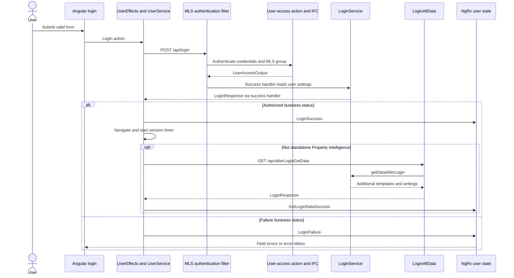
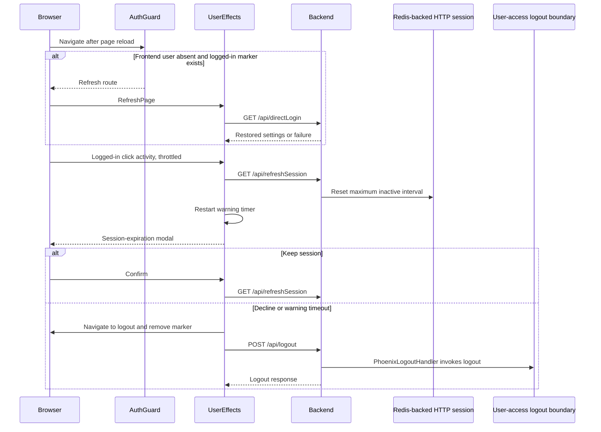

# Login and session lifecycle

[Project context](../project-context.md) · [Feature flows (parent)](index.md) · [Authentication](../cross-cutting/authentication-and-authorization.md) · [Redis](../cross-cutting/redis-caching-and-sessions.md) · [Runtime configuration](../cross-cutting/configuration-and-feature-flags.md)

**Research baseline:** `RP-10188`, `a6f611ae0`, 2026-09-25. **Confirmed** means source-inspected, not runtime-tested; **Inferred** identifies a deduction; **Unknown** identifies unavailable evidence. No application commands, authentication exchanges, builds, or tests were executed.

## Purpose and concepts

Login does more than establish identity: it loads the user's permitted geography, preferences, search templates, navigation, and feature settings. MLS means Multiple Listing Service; the MLS group selects the user's organizational context. Entitlements describe granted capabilities, not whether data exists for a particular property.

Browser state can be restored from an existing server session, but a browser “logged in” marker is not an authentication credential. Angular holds presentation state in NgRx; Spring Security owns incoming authentication; HTTP session data is persisted through Redis in the local configuration. External user-access and preference implementations remain provider boundaries.

Incoming SAML (Security Assertion Markup Language), Ping OpenToken, password login, and direct-link paths are separate from **outgoing OAuth client credentials**. See the authoritative [security chapter](../cross-cutting/authentication-and-authorization.md) for profile-specific matchers, cookies, CSRF, and outbound credentials.

## Standard login

**Confirmed execution path:**

1. `LoginComponent` creates a reactive form with required username, password, and MLS group.
2. Valid submission dispatches `UserActions.Login`.
3. `UserEffects.login$` calls `UserService.login`.
4. The browser POSTs JSON to `/api/login`.
5. `MlsGroupAuthenticationFilter` constructs an MLS authentication token.
6. `MlsAuthenticationProvider` delegates to `MlsGroupUserDetailsService`, then `UserAccessAction`.
7. Owned user-access code calls the external IFC boundary for identity/entitlements. IFC is retained as a repository term; its unavailable internals are not inferred.
8. `PhoenixAuthenticationSuccessHandler` calls `LoginService.loadUserSettings`.
9. Angular maps the response's business status into success/navigation or failure actions.
10. Successful login normally triggers the secondary `/api/afterLoginGetData` request and additional feature initialization. Standalone Property Intelligence skips that ordinary initialization branch.

Sources:

- `phoenix/src/app/login/components/login/login.component.ts:36–69`
- `phoenix/src/app/store/user/user.effects.ts:70–79,191–223,282–292,531–552`
- `phoenix/src/app/login/services/user.service.ts:14–39`
- `realist/web/src/main/java/com/facl/uaf/realist/rest/security/filters/MlsGroupAuthenticationFilter.java:24–46`
- `realist/web/src/main/java/com/facl/uaf/realist/rest/security/providers/MlsAuthenticationProvider.java:19–41`
- `realist/web/src/main/java/com/facl/uaf/realist/rest/security/services/MlsGroupUserDetailsService.java:33–40`
- `uaf-useraccess/action/src/main/java/com/facl/uaf/useraccess/action/delegate/UserAccessDelegate.java:114–137`
- `realist/web/src/main/java/com/facl/uaf/realist/rest/security/handlers/PhoenixAuthenticationSuccessHandler.java:40–53`



Read this as a logical caller chain; the security success handler mediates the first response. The IFC transport beyond the Java call is **Unknown**. The second HTTP call is handled by `LoginAllData`, not directly by a service. Diagram evidence is the standard-login sources above and `realist/web/src/main/java/com/facl/uaf/realist/rest/controller/LoginAllData.java:131–135`.

### Inputs, outputs, and state

Sanitized request shape (field names only; never record actual values):

```text
POST /api/login
{ username, password, mlsGroup }
```

**Confirmed:** login responses include business status and user/configuration data. The reducer consumes `userAccessOutput`, `prefAndTempData`, geography, access maps, navigation, and user-experience information. The second response supplies additional templates, grid headers, limits, and session timing in milliseconds.

Sources: `phoenix/src/app/store/user/user.reducer.ts:58–148`; `realist/web/src/main/java/com/facl/uaf/realist/rest/service/LoginService.java:399–447`.

On `LoginSuccess`, the effect sets the browser marker, initializes telemetry, and normally starts map/preferences/saved-property/usage loading alongside the secondary settings request. This is not one atomic initialization transaction (`phoenix/src/app/store/user/user.effects.ts:191–223`).

**Confirmed distinction:** HTTP success alone is insufficient. `mapLoginStatusCode` checks `LoginStatus.AUTHORIZED`. Preference-loading failure can produce HTTP 500 after authentication (`phoenix/src/app/store/user/user.effects.ts:531–552`; `realist/web/src/main/java/com/facl/uaf/realist/rest/security/handlers/PhoenixAuthenticationSuccessHandler.java:40–48`).

### HTTP methods versus backend mappings

| Browser operation | Method sent | Backend entry point |
|---|---|---|
| Standard login | POST `/api/login` | `MlsGroupAuthenticationFilter`, security-filter processing |
| Restore/direct login | GET `/api/directLogin` | `LoginAllData.getLoginResponse`, unrestricted `@RequestMapping` |
| Secondary settings | GET `/api/afterLoginGetData` | `LoginAllData.getDataAfterLogin`, unrestricted `@RequestMapping` |
| Keep session | GET `/api/refreshSession` | `LoginController.refreshSession` |
| Logout | POST `/api/logout` | Security logout configuration with `PhoenixLogoutHandler` |

The browser's GET does **not** narrow an unrestricted server mapping to GET only. Sources: `phoenix/src/app/login/services/user.service.ts:14–39`; `realist/web/src/main/java/com/facl/uaf/realist/rest/controller/LoginAllData.java:99–135`; `realist/web/src/main/java/com/facl/uaf/realist/controller/LoginController.java:110–117`; `realist/web/src/main/java/com/facl/uaf/realist/rest/security/configuration/MultipleLoginSecurityConfig.java:233–243`.

## SAML journey

```mermaid
sequenceDiagram
    actor Browser
    participant Entry as SamlController
    participant SP as Spring SAML processing
    participant Redis as Request correlation repository
    participant IdP as External identity provider
    participant Canonical as Canonical login conversion
    participant Session as HTTP session
    participant UI as Angular direct-link login
    participant API as LoginAllData and LoginService

    Browser->>Entry: GET /saml/sp/{mlsGroup}
    Entry->>Entry: Check outage and registered provider
    Entry-->>Browser: Redirect to /saml2/authenticate/{registrationId}
    Browser->>SP: Start SAML authentication
    Note over SP,Redis: Declared primary repository; effective runtime selection untested
    SP->>Redis: Save request by RelayState, five-minute TTL
    SP-->>Browser: Identity-provider redirect
    Browser->>IdP: Authenticate
    IdP-->>Browser: SAML response
    Browser->>SP: Submit response to configured processing URL
    SP->>Redis: Load and remove correlation request
    SP->>Canonical: Convert validated principal
    Canonical->>Canonical: Map MLS and user attributes; direct authentication
    Canonical->>Session: Save canonical security context
    Canonical-->>Browser: Redirect /login/directLink
    Browser->>UI: Open direct-link route
    UI->>API: GET /api/directLogin via UserService
    API-->>UI: Session-derived application settings
```

The identity provider proves identity; local canonical conversion then establishes the application's expected principal/session representation. A valid assertion can still fail local conversion. The Redis exchange depicts the declared implementation, with its untested framework selection explicitly noted.

**Confirmed:** the main chain configures the callback URL as `/saml/sp/SSO/alias/` plus the service-provider identifier. The canonical mapper supports several MLS attribute names and configurable translations.

Sources:

- `realist/web/src/main/java/com/facl/uaf/realist/controller/SamlController.java:80–154`
- `realist/web/src/main/java/com/facl/uaf/realist/rest/security/configuration/MultipleLoginSecurityConfig.java:223–229`
- `realist/web/src/main/java/com/facl/uaf/realist/rest/security/services/saml2/Saml2AuthenticationManager.java:81–164`
- `realist/web/src/main/java/com/facl/uaf/realist/rest/security/services/saml2/CustomSaml2AuthenticationSuccessHandler.java:61–90`
- `realist/web/src/main/java/com/facl/uaf/realist/rest/security/services/saml2/RedisSaml2AuthenticationRequestRepository.java:33–40,50–88,99–178`

**Unknown:** effective identity-provider metadata, mappings, callback origin, and the end-to-end runtime exchange. The development proxy explicitly lists `/saml/sp/**` but not `/saml2/authenticate/**`; confirm route/origin handling before assuming local SSO works. See [local setup](../development/local-setup.md).

### Ping and other incoming paths

**Confirmed:** the ordered Ping chain covers `/ping/**` and `/success` under its declared profiles. At `/success`, `PingFederateAuthenticationFilter` uses the Ping agent's OpenToken and checks configured directory-group membership; failure redirects to `/401.html`. This is not the SAML canonical conversion shown above. A complete browser-to-Ping-provider logout/federation round trip remains **Unknown**.

Sources: `realist/web/src/main/java/com/facl/uaf/realist/rest/security/configuration/MultipleLoginSecurityConfig.java:139–168`; `realist/web/src/main/java/com/facl/uaf/realist/rest/security/filters/PingFederateAuthenticationFilter.java:36–72`.

The `/spring/propertylink` entry processes incoming property links, outage rules, secure-link preferences, and token validation. GET `/pdf/report` has its own direct-link authentication-filter attachment. Do not equate these with password login or with the [shared-report link workflow](shared-report-links.md), whose recipient-facing reader and anonymous-access rules were not established in local source.

Sources: `realist/web/src/main/java/com/facl/uaf/realist/controller/LoginController.java:119–245`; `realist/web/src/main/java/com/facl/uaf/realist/rest/security/configuration/MultipleLoginSecurityConfig.java:116–125`.

## Direct-link restoration

**Confirmed:**

- `DirectLinkLoginComponent.ngOnInit` dispatches a direct-link action using the route's search type.
- `UserService.directLogin` GETs `/api/directLogin`.
- `LoginAllData` optionally consumes cached direct-link items, deletes that cache item, and routes to direct-report processing with entitlement refresh or ordinary restoration.
- Ordinary restoration calls `LoginService.directLogin`, which loads settings from session-derived user access.

Sources: `phoenix/src/app/login/components/direct-link-login/direct-link-login.component.ts:18–20`; `phoenix/src/app/login/services/user.service.ts:18–20`; `realist/web/src/main/java/com/facl/uaf/realist/rest/controller/LoginAllData.java:99–128`; `realist/web/src/main/java/com/facl/uaf/realist/rest/service/LoginService.java:347–350`.

This does not mean the publicly permitted endpoint grants identity without prior validated state.

**Watch point:** `SpringSecurityAuthenticationService.getUserAccess` contains `true || isAuthenticated()`, so the helper always attempts session lookup. Missing-session behavior requires explicit regression coverage rather than assumptions (`realist/web/src/main/java/com/facl/uaf/realist/rest/security/services/SpringSecurityAuthenticationService.java:26–30`).

## Session refresh, expiry, and logout



The timer is a user-experience warning, not an authority granting session validity. The diagram separates browser cleanup from the server/provider operation; it does not assert that the provider request always succeeds or that every identity provider is globally signed out.

**Confirmed:**

- `AuthGuard` uses frontend state and the browser marker to choose login versus refresh.
- Click activity is throttled at ten seconds before dispatching timer restart.
- The refresh handler resets the existing session's maximum inactive interval using `spring.session.timeout`.
- Browser warning timing uses server-returned values, with service defaults.
- Logout navigation and marker removal occur before the HTTP logout request completes.
- The effect suppresses logout HTTP errors with `EMPTY`, so failure can leave the browser on the logout route without dispatching `LogoutSuccess`.

Sources:

- `phoenix/src/app/shared/guards/auth.guard.ts:22–50`
- `phoenix/src/app/app.component.ts:68–74`
- `phoenix/src/app/store/user/user.effects.ts:167–175,242–259,350–405`
- `phoenix/src/app/shared/services/session-timer.service.ts:4–17`
- `realist/web/src/main/java/com/facl/uaf/realist/controller/LoginController.java:110–117`
- `realist/web/src/main/java/com/facl/uaf/realist/rest/security/handlers/PhoenixLogoutHandler.java:24–31`
- `realist/web/src/main/java/com/facl/uaf/realist/rest/security/configuration/MultipleLoginSecurityConfig.java:239–243`

**Caveats:**

- Refresh assumes an existing session; it is not a login endpoint.
- Redis-backed sessions and correlation/cache entries have separate expirations; do not equate or clear them together.
- The expiration effect combines a configurable timer with a default-delay `setTimeout`.
- Session-related effects contain direct nested subscriptions; they are not a uniformly composed RxJS pipeline.
- The inspected logout configuration uses Spring Security logout plus the custom handler. Actual cookie deletion, session invalidation, and external-provider termination should be verified together in an authorized environment; the diagram does not claim a tested distributed logout transaction.

## Authorization, EULA, and error branches

The EULA (End User License Agreement) guard loads the agreement and asks for acceptance. Refusal dispatches logout. Frontend guards, report entitlement, feature switches, property coverage, and purchase/credit requirements remain different decisions; neither an accepted agreement nor a visible route proves server authorization.

Sources: `phoenix/src/app/shared/guards/eula.guard.ts:28–54`; `phoenix/src/app/store/user/user.effects.ts:262–267`. Server-wide EULA enforcement is **Unknown**; see [availability rules](../frontend/reports/availability-and-access-rules.md).

| Branch | Observed behavior and debugging point |
|---|---|
| Invalid form | Required controls prevent normal valid submission; inspect `LoginComponent.logIn` and template errors |
| Business login failure | `LoginFailure` removes marker and navigates to login; inspect status mapping, not HTTP status alone |
| Preferences fail after authentication | Success handler can return HTTP 500; inspect settings/provider boundary rather than retrying passwords |
| Secondary settings fail | Effect catches to an empty value and filters it out: additional state need not initialize, without treating the whole login as failed |
| Unauthenticated protected request | Main-chain entry point redirects to `/`; an HTML response is not necessarily a JSON contract error |
| Keep-session call fails from modal | Catch dispatches logout; timer restart's direct subscription is a separate path |
| Logout HTTP failure | Error suppressed; browser navigation/marker change already happened |
| Stale serialized session | Recovery filter clears `JSESSIONID`, while security integration tests expect `SESSION`; inspect cookie names and serialization before blaming credentials |

Evidence: `phoenix/src/app/login/components/login/login.component.ts:36–89`; `phoenix/src/app/store/user/user.effects.ts:226–259,282–292,350–405`; `realist/web/src/main/java/com/facl/uaf/realist/rest/security/configuration/MultipleLoginSecurityConfig.java:237–243`; `realist/web/src/main/java/com/facl/uaf/realist/rest/security/handlers/PhoenixAuthenticationSuccessHandler.java:40–48`; `realist/web/src/main/java/com/facl/uaf/realist/rest/security/filters/PreSessionDeserializationErrorFilter.java:24–48`; `realist/web/src/test/java/com/facl/uaf/realist/rest/controller/SecurityConfigIntegrationTest.java:121–134`.

## Angular component checklist

**Confirmed:**

- **Architecture:** NgModule-declared components, not standalone login components.
- **Surface:** no inspected Inputs/Outputs; public `logIn()` and form controls are used by the template.
- **Bindings:** reactive `formGroup`, `formControlName`, `ngSubmit`, disabled-button binding, error interpolations.
- **Structural directives:** `*ngIf` for required/backend errors; no list requiring `trackBy`.
- **Change detection:** `OnPush`; error subscription calls `markForCheck`.
- **Cleanup:** login error subscription uses `untilDestroyed`.
- **State:** NgRx actions/effects/reducer; template does not use an async pipe for errors.
- **Accessibility:** explicit labels, required semantics, password input, submit button; no inspected error `aria-describedby`/live-region association.
- **Styles:** imported variables/mixins and background modifier classes; no `::ng-deep` in the inspected login stylesheet.
- **Tests:** adjacent component tests cover action dispatch, field errors, dialog closing, and generic error ribbon.

Sources: `phoenix/src/app/login/login.module.ts:7–14`; `phoenix/src/app/login/components/login/login.component.ts:14–89`; `phoenix/src/app/login/components/login/login.component.html:6–57`; `phoenix/src/app/login/components/login/login.component.scss:1–30`; `phoenix/src/app/login/components/login/login.component.spec.ts:47–129`.

## Debugging and remaining checks

Start with a sanitized HTTP method/status, business status, active profile names, and cookie names/attributes. Follow the table above to the first failed boundary. Never attach passwords, assertion payloads, session values, or raw identity/report logs.

Existing targeted coverage includes `phoenix/src/app/store/user/user.effects.spec.ts`, `phoenix/src/app/store/user/user.reducer.spec.ts`, `phoenix/src/app/shared/guards/auth.guard.spec.ts`, and `realist/web/src/test/java/com/facl/uaf/realist/rest/controller/SecurityConfigIntegrationTest.java:60–142`. Their existence is not a passing-test claim.

**Unknown / owner confirmation needed:**

- Identity/platform owners: effective SAML/Ping registrations, callback origins, group mappings, and approved browser flows.
- Backend/security owners: missing/expired-session responses, cookie recovery, backend EULA enforcement, and external logout failure behavior.
- Operations: deployed profiles, session timeout values, proxy/TLS cookie behavior, and serialization compatibility during upgrades.
- Documentation work and remaining evidence questions are recorded in [completion status](../completion-status.md) and [team questions](../onboarding/known-gaps-and-team-questions.md).

**Recommended next action:** in an authorized environment, validate standard login, SAML return, restoration, timeout, and logout separately, including secondary-settings failure and missing-session branches. No runtime validation was performed for this documentation.

Related: [User-access module](../backend/modules/uaf-useraccess.md), [Frontend routing](../frontend/bootstrap-and-routing.md), [Testing](../development/testing-and-quality.md), [Troubleshooting](../development/troubleshooting.md).
