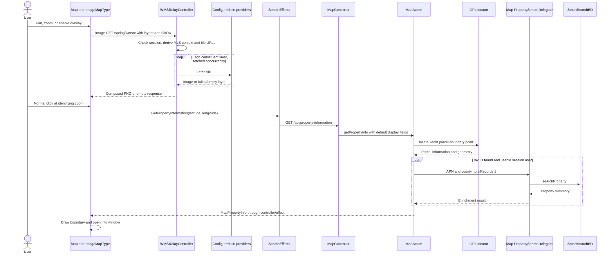

# Maps: WMS images versus property identification

[Project context](../project-context.md) | [Feature flows](index.md) | [Search results](../frontend/search/results-grid-map-and-actions.md)

**Confirmed:** `a6f611ae0`, 2026-09-25. No map/provider requests were made.

## Two different operations on the same map

- **Image overlay:** the browser map asks for Web Map Service (WMS) tiles. Output is image bytes, not property summaries.
- **Property identification:** clicking a location asks the application for parcel/property metadata, using a locator then SmartSearch enrichment. Output is JSON, not a tile.

Ordinary search-result markers are a third input: they are built from the existing property-search result list and checked/focused state. A working basemap or WMS image proves neither locator availability nor property-report access.

## Browser overlays and server relay

`MapComponent` creates Google `ImageMapType` overlays for trends, premium, boundaries, distressed properties, sales values, MLS listings, location information, and property characteristics. Zoom flags filter out unusable layers; overlay creation is debounced one second.

`createBoundariesWmsOverlay` derives comma-separated layer/style names and zoom ranges. It normally targets `/spring/wmsrc`; a supplied premium URL can override that. `createWmsOverlay` constructs `GetMap`, WMS 1.1.1, transparent PNG, SRS, width/height, styles, layers, optional filters, and a tile bounding box. Ordinary tiles convert coordinates to spherical Mercator (default `EPSG:3857`); premium tiles use longitude/latitude BBOX and premium SRS/dimensions when specified.

These image requests originate from the map browser API, **not Angular `SearchService` or a search NgRx effect**. The helper’s ability to accept a premium URL is not evidence that any particular deployed layer bypasses the application relay.

Evidence: `phoenix/src/app/search/components/map/map.component.ts:730-783,1621-1642`; `phoenix/src/app/shared/utils/map-wms.ts:87-198`.



The two paths share a screen but not their controller/delegate. The map delegate is specifically qualified as `mapPropertySearchDelegate`, distinct from the similarly named property-search-module delegate.

## Relay behavior and partial failures

`WMSRelayController.handleRequest` returns `DeferredResult<Void>`. It reads session/entitlement context and request parameters before launching reactive tile fetches. `fetchCompositeLayerImageForTileAsync` builds URLs from configured tile-server base and WMS path, fetches each constituent tile through shared `WebClient`, and composes images on bounded-elastic scheduling.

A constituent layer’s error is logged and leaves its image slot empty instead of failing the whole composite. `fetchTile` accepts successful 2xx PNG/octet-stream responses; unexpected content types become empty. Deferred timeout and several synchronous/reactive failure branches resolve null without necessarily setting the HTTP error status quoted in log messages. Therefore a blank/partial tile can occur without a clear browser 502/503.

Evidence: `uaf-map/action/src/main/java/com/facl/uaf/map/action/WMSRelayController.java:219-276,289-363,384-465`. Provider URLs, credentials, and deployment routing values are intentionally omitted. Detailed module configuration belongs to [uaf-map](../backend/modules/uaf-map.md).

## Property lookup contract and branches

Browser request:

```text
GET /api/property-information
    ?latitude=<decimal>&longitude=<decimal>&displayFields=<optional comma-separated field codes>
```

Sanitized output projection (names intentionally preserve source spelling):

```typescript
{
  latitude: "0.0", longitude: "0.0",
  countyId: "00000", taxId: "EXAMPLE-APN",
  parcelId: "EXAMPLE-PARCEL", parcelSeq: "1",
  hasMultipleProperties: false, multiplePropertyAPN: [],
  parcelGoemetry: [/* coordinate sequences */],
  provisionedProperty: true,
  address: "Example address", ownerName: "Example owner",
  bedroomCount: "...", bathroomCount: "..."
}
```

This is not a full model and does not assert every field is populated. Java initializes many string fields to empty strings, `parcelGoemetry` to an empty list, and the provisioned flag to true; `multiplePropertyAPN` may be null. Model evidence: `uaf-map/action/src/main/java/com/facl/uaf/map/model/MapPropertyInfo.java:12-57`.

1. Normal click identification requires zoom **15 or higher**. Annotation mode takes precedence. CTRL+click with selected trends/flood takes the respective thematic-popup branch instead of parcel identification.
2. `SearchEffects.getPropertyInformation$` may add the selected premium field plus `PREM_SELL_SCORE` when premium preference is `Y`, My Search is selected, and a layer exists. Browser HTTP has a **10-second timeout**; errors map to null, then `GetPropertyInformationSuccess(null)`.
3. `MapController.getMapPropertyInformation` adds default display fields and invokes `MapAction.getPropertyInfo`.
4. `getLocationInfo` converts coordinate strings to a GPL point and calls `IGplLocatorService.locateGeom` with filter ID `parcel-boundary`. No locator result returns a coordinate-only `MapPropertyInfo`. Multiple results set `hasMultipleProperties` and collect APNs; the first property supplies details. County ID concatenates state/county codes. First returned geometry is formatted for highlighting.
5. `getPropertyInfo` adds `MLS_STATUS`, prepares county/APN search with `totalRecords=1`, and enriches through the map-specific delegate. This is not the broader APN-expansion/retry flow used by Quick Search.
6. `addToMapPropertyInfo` copies tax/MLS facts, photos, owner, identity, foreclosure and premium fields from the first SmartSearch summary. The browser maps the result to a marker, draws `parcelGoemetry`, and opens an info window; null produces `EMPTY_AGM_MARKER`.

Evidence: `phoenix/src/app/search/models/map.constants.ts:8-9`; `phoenix/src/app/search/components/map/map.component.ts:794-830,893-936`; `phoenix/src/app/store/search/search.effects.ts:460-481`; `phoenix/src/app/search/services/search.service.ts:59-67`; `realist/web/src/main/java/com/facl/uaf/realist/rest/controller/MapController.java:83-91`; `uaf-map/action/src/main/java/com/facl/uaf/map/action/MapAction.java:130-170,180-256,805-832,941-1007`; `uaf-map/action/src/main/java/com/facl/uaf/map/action/delegate/PropertySearchDelegate.java:47-89`.

**Important error nuance:** although `getPropertyInfo` comments/checks intend to skip enrichment when session user is absent, `getSmartSearchInputData` dereferences `userInfo` before that condition. Do not promise graceful expired-session handling from that check alone. A coordinate-only locator result is also not equivalent to HTTP null: the frontend maps any truthy result to an open marker, so missing fields can surface downstream rather than as a dedicated “no parcel” panel.

## Other map interactions

| Operation | Browser endpoint | Distinction |
| --- | --- | --- |
| Parcel dimensions | POST `/api/get-lot-dimensions` | Browser `{latLong,countyId,parcelId,parcelSeq}`; server DTO additionally supports `simplifyLogicSet`; `MapAction.getLotDimensions` |
| Legend ranges | POST `/api/map-legend` | `RegionValue → RangeInfo[]` |
| CTRL-click trends | POST `/api/reports/market-trends-popup` | Thematic value popup, not property-identification JSON |
| CTRL-click flood | POST `/api/reports/flood-map-info-popup` | Flood popup, not purchase/availability of a full flood report |

The thematic payload uses source spelling `lattitude`, plus `longitude`, `trendsLayerEnabled`, `floodZoneEnabled`, `layerStyle`, and `layerId`. Lot-dimension errors show “Lot dimensions are not available for this property”; legend errors become an empty array; trend/flood errors become null and are filtered rather than emitting a success action.

Drawing shapes are local search criteria: My Search serializes them as MAP/POLYGON operator values. This does not mean every drawn shape is a WMS request. Shape UI advertises five maximum; related search extraction is at `phoenix/src/app/search/components/my-search/my-search.component.ts:287-299` and `.html:31-45`.

Additional server `/api/map/spatial-*` endpoints exist and have explicit `TooManySpatialRequests` handling, but they are **not** the `/spring/wmsrc` or `/api/property-information` chain above. Keep their request/429 diagnostics separate (`MapController.java:176-248`).

Evidence: `phoenix/src/app/search/services/search.service.ts:54-80`; `phoenix/src/app/store/search/search.effects.ts:447-458,483-514`; `MapController.java:98-104,170-174`.

## Debugging and test evidence

| Symptom | Inspect |
| --- | --- |
| Basemap works, overlay absent | Layer zoom flags, `/spring/wmsrc` request, per-layer image/content-type errors |
| Overlay works, click does nothing | Zoom, annotation/CTRL branch, lookup timeout |
| Wrong parcel / several APNs | GPL multiple-property response and first-result policy |
| Partial property card | Locator-only fields versus SmartSearch enrichment; requested display fields |
| No pins after deselection | Checked-ID marker visibility, not tile availability |
| Missing premium values | `Y` request condition versus overlay’s not-`N` visibility condition |

Inspected tests, not executed:

- `uaf-map/action/src/test/java/com/facl/uaf/map/action/MapActionCharacterizationTest.java:60-145`: single/multiple/empty locator results and wrapped locator failure.
- `uaf-map/action/src/test/java/com/facl/uaf/map/action/WMSRelayControllerTest.java:72-160`: pooled/reused client, PNG, failed status, redirect rejection, content-type fallback, timeout.
- UI outcome is grounded in `phoenix/src/app/search/components/map/info-window/info-window.component.html:1-96`: favorite star, conditional photo/link controls, premium `N/A`, dimensions, and Report action.

**Unknown:** actual provider parcel geometry/coverage, external tile generation, deployed timeout values, and effective premium URLs. Related: [property search](property-search.md), [reports](property-details-and-reports.md), [external integrations](../cross-cutting/external-integrations.md).
