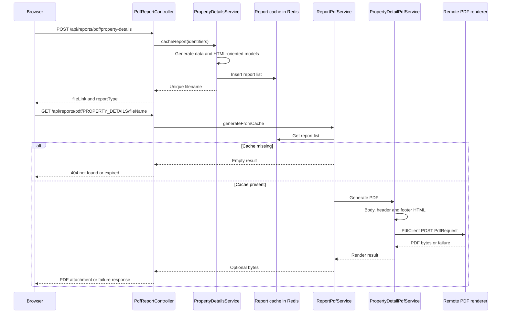
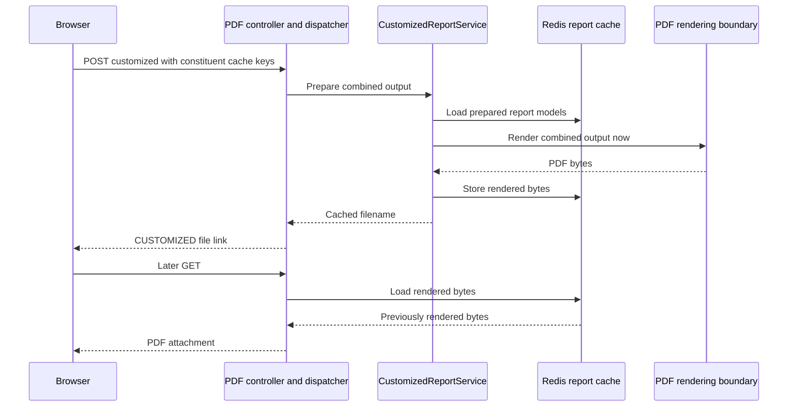

# PDF preparation and download

[Project context](../project-context.md) · [Feature flows](index.md) · [Reports](../frontend/reports/index.md)

## Purpose and lifecycle

Ordinary report PDF generation is usually **two-phase**: POST prepares/caches report models and returns a link; later GET loads them, creates HTML locally and sends a request to a remote renderer. Customized reports render during preparation; Community Insights returns provider PDFs. “Print” in the normal report UI often means downloading a PDF, not immediate browser printing.

**Confirmed baseline:** `RP-10188` / `a6f611ae0`, 2026-09-25. Source abbreviations:

- `F` = `phoenix\src\app`
- `W` = `realist\web\src\main\java\com\facl\uaf\realist`
- `C` = `uaf-common\action\src\main\java\com\facl\uaf\common`

Controllers below are under `W\rest\controller`; ordinary report services under `W\rest\service\report`; PDF services under `W\service\reports\pdf` unless otherwise qualified.

## Property Details prepare contract

`ReportsService.downloadPropertyDetailsReport` → `SearchDownloadService.downloadPropertyDetailsReports`:

```text
POST /api/reports/pdf/property-details
[
  { "parcelId": "<id>", "fipsCode": "<county>", "apn": "<apn>" }
]
```

The body is a **bare identifier array**, unlike the ordinary Property Details request object. `PdfReportController.generatePropertyDetailReport` declares nonempty input and **maximum 25** identifiers, calls `PropertyDetailsService.cacheReport`, and returns:

```text
{
  "fileLink": "<same-origin>/api/reports/pdf/PROPERTY_DETAILS/<unique-name>.pdf",
  "reportType": "PROPERTY_DETAILS"
}
```

The route string `property-details` and enum `PROPERTY_DETAILS` are not interchangeable.

Sources: `F\reports\services\reports.service.ts:115–116`; `F\search\services\search-download.service.ts:46–48`; `PdfReportController.java:127–134`; `W\rest\service\FileService.java:62–70`.

## Two-phase sequence



Evidence: `PropertyDetailsService.java:272–278,345–361`; `ReportPdfService.java:72–100`; `template_service\PropertyDetailPdfService.java:34–57`; `FileBaseController.java:67–70,90–110`. A failed renderer may ultimately produce the same not-found response as absent cache; the diagram's success branch is not unconditional.

## Preparation by family

All POST suffixes below are beneath `/api/reports/pdf/`, except dashboard outputs.

| Suffix | Input / prepared model | Processing |
|---|---|---|
| `property-details` | Identifier array, 1–25 | Re-fetch/generate reports, HTML-oriented conversion, cache list |
| `comparables-detail-report` | Selected identifiers, map style | Generate comparison XML/model; optional map; cache report |
| `neighbors` | Identifiers/preferences/map style | `NeighborsService.cacheReport` |
| `neighborhood-profile` | Current report and property data | Mark report type and cache supplied model |
| `sdp-market-trends` | Current report, property data, non-disclosure flag | `SdpMarketTrendsService.cacheReport` |
| `foreclosure` | Identifiers/property data | Purchase-aware `cacheOccReport` |
| `building-sketch` | Identifiers and dimensions | Dimensions validation plus purchase-aware caching |
| `floodmap` | Identifiers, flood type/info, captured content | Standard/premium branch; distinct admission rules |
| `hazard` | Identifiers and hazard information | Wildfire PDF enrichment then ecommerce cache |
| `building-permits` | `BuildingPermitsReport` | Cache supplied report model |
| `customized` | Report-type→cache-key map plus property data | Load models, render combined PDF now, cache bytes |

Sources: `F\reports\services\reports.service.ts:123–196`; `PdfReportController.java:122–254`; `W\rest\service\report\CustomizedReportService.java:49–76`.

Thus PDF preparation is not universally “re-run the on-screen report endpoint.” Some families regenerate, some accept models/captured content, and some read previously prepared caches.

**Client type mismatch:** the customized Neighborhood Profile effect prepares `downloadNeighborhoodProfileReport(...)` but passes `ReportType.NEIGHBORS` to `handleCustomizedReport`; its missing-data failure uses `NEIGHBORHOOD_PROFILE`. This is the actual dispatch mismatch, not evidence that these report families are equivalent. Runtime impact on combined output was not tested. Source: `F\store\reports\reports.effects.ts:650–655`.

### Important enforcement differences

- Premium Flood PDF preparation checks free preference, viewed purchase, ledger, pending purchase and remaining allowance.
- Its allowance branch does **not** make the same usage-update call as ordinary Premium Flood generation.
- Hazard PDF adds enrichment and delegates to ecommerce caching; it does not reproduce the normal Hazard handler's full admission ladder.
- Permits PDF accepts a supplied report model; no entitlement predicate is visible in that handler.
- No universal PDF authorization conclusion follows: these are handler differences, not proof of a bypass or absence of downstream checks.

Source: `PdfReportController.java:153–223,252–254`; compare [per-report access decisions](../frontend/reports/availability-and-access-rules.md). A fix, if desired, requires separate review; this task only documents.

## Cache identity, contents and lifetime

`ReportCachingService` constructs keys as:

```text
REPORT_PREFIX + ":" + currentPassportUserId + uniqueFileName
```

Models are serialized through Redis-backed Java `LocalStorage`, whose expiration uses `cache.local-storage.ttl` seconds. The `sessionId` parameter **does not automatically scope the supplied key**; caller key construction matters.

| Cached content | Example |
|---|---|
| `List<Report>` | Property Details batch |
| Single report model | Comparables / neighborhood / other family |
| Specialized DTO | Building Permits |
| Rendered bytes | Customized PDF |
| Captured imagery/model | Search/map outputs, according to dispatcher |

Sources: `ReportCachingService.java:32–71,99–114`; `C\shared\util\LocalStorage.java:26–30,37–77`.

**Unknown:** effective deployed TTL/cache topology. Model caches and rendered-byte caches must not be confused with report XML/session subject state or [CSV/RTF filename caches](exports-and-mailing-labels.md#download-cache-and-isolation).

## Local HTML versus remote rendering

Property Details PDF:

1. Load cached report list.
2. Resolve current-user branding.
3. Build `PdfRequest`.
4. Create body HTML from report PDF template.
5. Create header/footer HTML.
6. `PdfClient.generate` posts to configured `pdf.url` and expects PDF bytes.

`PdfTemplateService.buildHtml` delegates to the template engine. Conversion/template logic is local; rendering is remote.

Sources: `template_service\PropertyDetailPdfService.java:34–69`; `template_service\PdfTemplateService.java:17–18`; `PdfClient.java:19–34`.

**Unknown:** renderer engine, hosting, retention, internal storage and service limits. A `pdf.url` consumer is not evidence of a particular vendor or deployment topology.

## Browser preparation and capture

Shared Print confirmation downloads the returned PDF link. Neighborhood Profile and Market Trends can provide current report data; Flood and Hazard include capture-derived content. A browser map/chart capture failing is a separate failure mode from XML/report generation.

Email preparation timing differs: Property Details/Profile prepare after modal confirmation; Flood captures first but prepares after confirmation; Hazard/Permits prepare before the modal and reuse the link afterward. Confirmed sending dispatches `SendEmail(fileName, reportType)`. This is not the [shared-link artifact](shared-report-links.md), and final mail attachment/link delivery is outside the verified flow here.

Evidence: `F\store\reports\reports.effects.ts:378–383,661–668,834–916,2122–2151,2191–2239`; `F\reports\services\reports.service.ts:508–534`. See [rendering/actions](../frontend/reports/report-rendering-and-actions.md).

## Exceptions

### Customized reports



Source: `W\rest\service\report\CustomizedReportService.java:49–54`; `ReportPdfService.java:75–76`. Unlike normal reports, rendering has already happened when the link is returned.

### Community Insights and map files

- Community Insights uses provider PDF links from `/api/reports/community-insights-url`; `LocationApiService` parses provider `pdf_report` results. No local report→HTML→`PdfClient` path is established.
- Assessor downloads map files; Zoning opens returned map-sheet URLs, not ordinary report PDF handlers.

Sources: `C\shared\service\LocationApiService.java:127–213`; [catalogue](../frontend/reports/report-catalogue.md), [map-file access](../frontend/reports/availability-and-access-rules.md#map-file-serving-is-a-separate-boundary).

### Search-result outputs

`/api/dashboard/pdf/` has POST `map`, `table`, `cards`, `map-table`, `property-photos` plus later GET. Table/card data is loaded into report sections; map/photo inputs differ.

**Client mismatch:** `SearchDownloadService.downloadMap()` posts to `/api/dashboard/png/map-image`, not the PDF `map` endpoint. Do not describe every browser map download as PDF.

Sources: `PdfDashboardController.java:39–97`; `W\rest\service\ReportService.java:126–245`; `F\search\services\search-download.service.ts:13–51`.

### Direct-report output

Standalone `/spring/directReportAction` accepts servlet parameters and can produce inline PDF, a plain-text PDF link, server HTML or JSON. Direct Comparables PDF uses ordinary `COMPARABLES`; direct Neighborhood Profile explicitly uses `DIRECT_NEIGHBORHOOD_PROFILE`. Direct Premium Flood/Hazard JSON branches execute before the PDF/HTML switch. Condensed Property Details is selected by display type and its Print control links through `/spring/propertylink`.

Sources: `W\controller\DirectReportController.java:261–271,544–653`; `ComparablesService.java:112–148`; `NeighborhoodProfileService.java:174–247`; `W\service\reports\html\HtmlService.java:81–110`. See [direct catalogue](../frontend/reports/report-catalogue.md#direct-entry-and-condensed-variants). Remaining specialized token/PDF dispatch reachability must not be inferred from enum presence.

## Errors, limits and contract mismatches

| Condition | Confirmed behavior |
|---|---|
| Empty or more than 25 Property Details IDs | Declared validation rejects input |
| One batch item throws `ReportException` | Item can become null and be filtered out; not necessarily all-or-nothing |
| Cache absent/expired | 404 JSON “file not found or expired” |
| Remote renderer exception | `PdfClient` logs and returns null |
| Optional render result null | Can collapse to empty result and same not-found response |
| Premium Flood pending confirmation | PDF handler returns 204 |
| Premium Flood no-access fallthrough | Handler falls through to 500 |
| Browser preparation fails | PDF-generation error feedback in effects |
| Link prepared successfully | Does not prove later render/download succeeds |

Sources: `PropertyDetailsService.java:345–381`; `FileBaseController.java:67–110`; `PdfClient.java:29–74`; `PdfReportController.java:192–215`; `F\store\reports\reports.effects.ts:2150`.

Report-specific admission, generic security matchers and cache ownership are separate concerns. Consult [availability/authentication](../frontend/reports/availability-and-access-rules.md#authentication-versus-report-entitlement), especially extension matcher ordering, before asserting every PDF URL has identical protection.

## Debugging and future verification

1. Locate failure phase: POST versus later GET.
2. Check enum `reportType`, exact array/object contract and prepared model type.
3. Check user-derived cache key/TTL without exporting sensitive cached content.
4. Compare browser converter versus HTML converter/template.
5. Inspect captured maps/charts separately from ordinary report data.
6. Check `PdfClient` error and nullable result; a 404 may not mean only cache expiry.
7. For paid families, compare ordinary generation and PDF admission/usage separately.

Future tests: 25-property boundary/partial failures; missing cache versus renderer failure; premium admission parity; supplied permit model validation; branding/dynamic sections; flood capture including Shadow DOM. **No tests were run.** Renderer internals/deployed configuration are external unknowns; exhaustive specialized PDF/token-route coverage is not claimed.

Related: [report backend](../backend/modules/uaf-reports.md), [Redis/session responsibilities](../cross-cutting/redis-caching-and-sessions.md), [external integrations](../cross-cutting/external-integrations.md).
