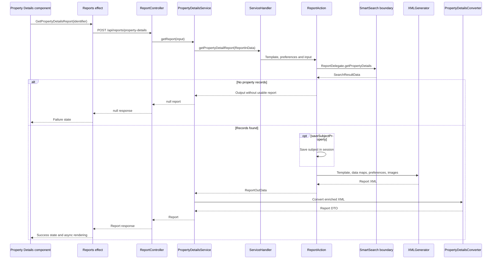
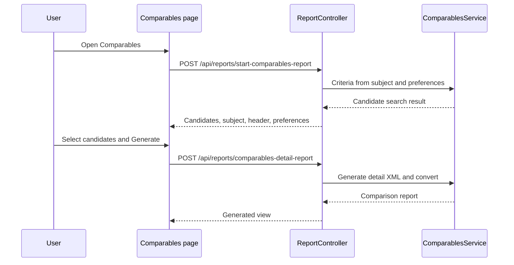

# Opening Property Details and related reports

[Project context](../project-context.md) · [Feature flows](index.md) · [Reports](../frontend/reports/index.md)

## Purpose and preconditions

Property Details retrieves authoritative property data, turns runtime templates into XML, then converts XML into a browser report model. Related reports may reuse the selected property and server-session subject; they do not all share that processing chain.

**Confirmed baseline:** `RP-10188` / `a6f611ae0`, 2026-09-25. References use repository-relative shorthand:

- `F` = `phoenix\src\app`
- `W` = `realist\web\src\main\java\com\facl\uaf\realist`
- `R` = `uaf-reports\action\src\main\java\com\facl\uaf\report`

`PropertyDetailsService` / `ComparablesService` / `NeighborhoodProfileService` below are under `W\rest\service\report`; `ReportController` is under `W\rest\controller`.

Entry conditions:

1. User opens `/reports/property-details` for the selected property.
2. Parent auth/EULA guards apply; Property Details has no child report-entitlement guard.
3. Report shell resolves direct-link loading where applicable.
4. Component consumes selected property state and dispatches `GetPropertyDetailsReport` when report data is not loaded.

Sources: `F\app-routing.module.ts:68–73`; `F\reports\reports-router.module.ts:9–27`; `F\reports\components\property-details-report\property-details-report.component.ts:148–173`.

## Sanitized request and response

```text
POST /api/reports/property-details
{
  "requestedFrom": "",
  "saveSubjectProperty": true,
  "propertyIdentifiers": [{
    "parcelId": "<parcel-id>",
    "fipsCode": "<county-code>",
    "apn": "<parcel-number>",
    "clip": "<optional-property-id>",
    "latitude": "<numeric latitude>",
    "longitude": "<numeric longitude>"
  }]
}
```

Explanatory response shape:

```text
{
  "header": {
    "address": "<display address>",
    "apn": "<parcel-number>",
    "clip": "<property-id>",
    "showClipApn": true
  },
  "sections": [
    { "templateCode": "<section-code>", "title": "<title>",
      "multiColumn": [], "dataGrid": [] }
  ],
  "footer": { ... }
}
```

Placeholders are sanitized; these are not exhaustive schemas or executable samples. Coordinates are numeric in the real contract. Caller evidence: `F\reports\services\reports.service.ts:83–89,343–348` (`getPropertyDetailsReport`/`getReport`). Response evidence: `W\rest\converter\PropertyDetailsConverter.java:27–40`; `PropertyDetailsService.java:159–176`.

## Execution sequence



The XML arrow represents the cache-miss branch. Cached XML may be reused, but when its `resultData` argument is null, the inspected action still retrieves property data. `ServiceHandler`, report action, converter and XML generation are local/in-process calls; SmartSearch implementation is outside this repository's established boundary. The sequence does not invent downstream storage or deployment.

## Step-by-step transformation

### 1. Browser state and HTTP

The effect uses `filterCached` to skip already-loaded report state, wraps loading with `spinnerOverlayService`, converts HTTP errors into failure actions and stores successful responses with `isLoaded: true`.

Evidence: `F\store\reports\reports.effects.ts:246–259,2179–2187`; `reports.reducer.ts:251–305` in the same directory.

### 2. Report input construction

`PropertyDetailsService.getPropertyDetailReportInData` copies identifiers to `SmartSearchInData`, adds price-per-square-foot preference information, requests complete rather than owner-only mortgage history, sets sales-history years, report title and direct-link flag.

Evidence: `PropertyDetailsService.java:326–342,437–447`.

### 3. Runtime template and preferences

`W\action\ServiceHandler.getPropertyDetailReport` obtains preference groups and `TMPL_REPORTS_PROPERTY_DETAIL`, updates API templates and delegates to `ReportAction`.

Evidence: `W\action\ServiceHandler.java:1001–1033`. Two users may therefore receive different section/field behavior through the same endpoint; an endpoint name does not imply fixed report content.

### 4. External property data

`ReportAction` validates input/key/template/preferences. `ReportDelegate.getPropertyDetails` calls `SmartSearchBD.getPropertyDetail` and selects `KEYSTONE_MLS` in this path.

Evidence: `R\action\ReportAction.java:319–368`; `R\action\delegate\ReportDelegate.java:148–164`.

**Unknown:** SmartSearch's internal storage, service topology and provider implementation. The Java business-delegate call is the verified external boundary, not proof of an invented HTTP route or database.

### 5. XML preparation

- Optionally saves subject under `ReportConstants.SAVED_SUBJECT_PROPERTY`.
- Loads maps/photos and lot-dimension maps according to preferences.
- Populates `ReportData` with property maps, building-card data, template and preferences.
- Preserves APN/parcel spaces with nonbreaking-space entities.
- Calls `XMLGenerator.generateXmlReportString(false)`.

Evidence: `R\action\ReportAction.java:417–431,478–543,989–1043,1107–1115`.

### 6. XML to browser DTO and enrichment

`PropertyDetailsConverter` parses header address, selected sections, summary `subSection` content, map sections by template code, special rental sections, indicators and footer.

`PropertyDetailsService` also updates last-viewed properties, enriches footnotes/reverse links, applies CLIP/APN visibility and valuation/MLS presentation, and conditionally adds AI summary metadata.

Evidence: `W\rest\converter\PropertyDetailsConverter.java:27–91`; `PropertyDetailsService.java:128–202,220–245`.

AI summary is embedded enrichment, not another report route. Its separate sanitized contract is:

```text
POST /api/reports/ai-summary
{
  "propertyId": "<property-id>",
  "propertyDetailsJson": "<serialized property-details JSON>"
}

200: { "summary": "<summary text or empty string>" }
500: { "error": "Failed to fetch summary content. Please try again later." }
```

The handler calls `aiSummaryHelper.getSummaryContent`, normalizes null summary to `""`, and applies `Cache-Control: no-cache` to success. Provider internals are not established by this handler. Evidence: `ReportController.java:179–192`.

All specialized enrichment internals are not exhaustively catalogued here; [rendering](../frontend/reports/report-rendering-and-actions.md) identifies the body where returned section codes are consumed.

### 7. Browser sections

Parent binds through `async`; body groups sections by building/global context and switches on `templateCode`. It renders generic tables/grids plus dedicated cards/charts, including optional embedded permits/community/rental sections.

Evidence: parent `property-details-report.component.html:1–19`; `F\reports\shared\components\property-details-body\property-details-body.component.ts:40–68`, `.html:60–160`.

An embedded section does not establish entitlement to a separately named premium route.

## State and storage effects

| State | Owner / role |
|---|---|
| Selected property and report load state | Browser NgRx; effect caching can avoid repeat fetch |
| Saved subject | Server session `SAVED_SUBJECT_PROPERTY`; reused by related reports |
| Report XML | Report-action cache path; not equivalent to later PDF model cache |
| Last-viewed property | Service updates viewing history |
| Runtime template/preferences | Obtained through service handler, not fixed Angular markup |
| Authoritative property data | External SmartSearch boundary |

Do not conflate server report XML caching with [PDF preparation cache](pdf-generation-and-download.md) or browser storage.

## Comparables: candidates then generated details

1. `startComparablesReport` posts subject plus criteria/preferences.
2. `ComparablesService.getCompsReportInput` loads saved subject and builds criteria.
3. `ReportAction.getComparablesReport` returns candidates/subject.
4. User chooses properties; **Generate** requires a selection.
5. `getComparablesReport` posts subject plus selected identifiers to `/comparables-detail-report`.
6. `ComparablesService.generateReport` delegates to `ServiceHandler.getComparablesDetailReport`.
7. XML becomes the generated comparison model.

Sources: `F\reports\services\reports.service.ts:212–234`; `ReportController.java:251–301`; `ComparablesService.java:157–174,219–232`; `F\reports\components\comparables-report\comparables-report.component.ts:328–338`.



### Criteria, limits and rendering distinctions

- Candidate request count is `min(COMPS_PREF_TOTAL_RECORDS, maximum.number.comparables)`. Configured value is **Unknown**, not necessarily 20.
- Radius uses `COMPS_PREF_SEARCH_RADIUS`; sorting defaults ascending but sale date uses descending, with optional recording-date substitution.
- Living area/lot area support percentage, range or manual criteria; date/geography/distressed-sale/site-influence rules also participate.
- Browser selected-comparable cap is **20**; excess grid selection is undone. Customized generation truncates initial candidates to 20.
- Criteria Submit applies without saving; Save and Submit persists.
- Generated screen uses `DefaultConverter`; PDF uses `HtmlComparablesConverter`, with map and preference-dependent search-criteria/statistics filtering.
- Section titles/field order are runtime data. Angular special-cases map and photo-styled detail grids, renders only `dataGrid[0]`, then multi-column/footnotes/footer.

Sources: `W\rest\util\ComparablesReportUtil.java:95–150,228–395`; `F\reports\shared\constants\reports.constants.ts:43`; Comparables child `comparables-report-edit\comparables-report-edit-grid\comparables-report-edit-grid.component.ts:183–200`; `F\store\reports\reports.effects.ts:430–442,1394–1407`; `F\reports\shared\components\report-search-criteria-modal\report-search-criteria-modal.component.ts:35–59`; `ComparablesService.java:96–109,177–208`; Comparables child `comparables-report-view\comparables-report-view.component.html:1–26`.

## Other branches and direct entry

- **Neighbors:** report + result data + subject + preference groups; neighboring parcels/cards.
- **Neighborhood Profile:** XML plus demographics and neighborhood criteria; population/housing characteristics.
- **Maps, hazard, permits, Community Insights:** separate family services/coverage/payment; do not force them into the Property Details sequence.

Sources: `ReportController.java:201–242`; `NeighborhoodProfileService.java:136–157`; [catalogue](../frontend/reports/report-catalogue.md) and [availability matrix](../frontend/reports/availability-and-access-rules.md).

Application direct entry uses `DirectLinkReportService` to store `DIRECT_LINK_REPORT`, redirects to frontend login, then `/api/reports/direct-link` returns and removes that object. Standalone `/spring/directReportAction` instead supports parameter-based JSON/HTML/PDF dispatch. Condensed Property Details is a display variant; direct hazard has an application fallback exception. See the [direct-variant catalogue](../frontend/reports/report-catalogue.md#direct-entry-and-condensed-variants).

Evidence: `W\rest\service\DirectLinkReportService.java:195–231,299–418,463–495`; `W\rest\controller\DirectApiReportController.java:21–49`; `W\controller\DirectReportController.java:205–271,544–653`.

## Errors, limits and debugging

| Condition | Source-backed outcome / first inspection |
|---|---|
| First property identifier null | Controller returns null |
| Identifier list empty | Handler accesses index zero; no local empty-list check shown |
| Invalid key/template/preferences | Action returns without normal report generation |
| No property records | Early return; service returns null |
| Retrieval exception | Action logs and returns incomplete output |
| Frontend HTTP failure/null | Failure action and error report state |
| Low/missing valuation confidence | AVM (automated valuation model) multi-column content can be cleared |
| Stale related-report subject | Check saved subject identity as well as browser selection |
| Missing section | Compare XML, converter result, template code and frontend body |
| Already loaded stale view | Inspect `filterCached`, state reset and property identity |

Evidence: `ReportController.java:169–176`; `R\action\ReportAction.java:319–449`; `PropertyDetailsService.java:138–140,220–245`; report effects/reducer cited above.

**Inferred risk:** session subject state makes simultaneous tabs/property switching important regression cases; no concurrency defect is demonstrated.

## Verification boundaries and related reading

Future tests should cover empty IDs/no records, subject identity changes, multi-building grouping, template changes versus XML cache, CLIP display versus downstream use, and selected Comparables versus PDF. **No tests were run.**

External templates/metadata/provider implementation and full specialized enrichment/Neighbors library internals remain bounded research areas, not invented behavior. See [report module](../backend/modules/uaf-reports.md), [property search module](../backend/modules/uaf-propertysearch.md), [PDF lifecycle](pdf-generation-and-download.md), [rendering/actions](../frontend/reports/report-rendering-and-actions.md).
