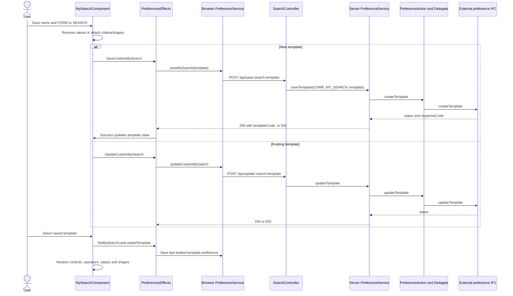
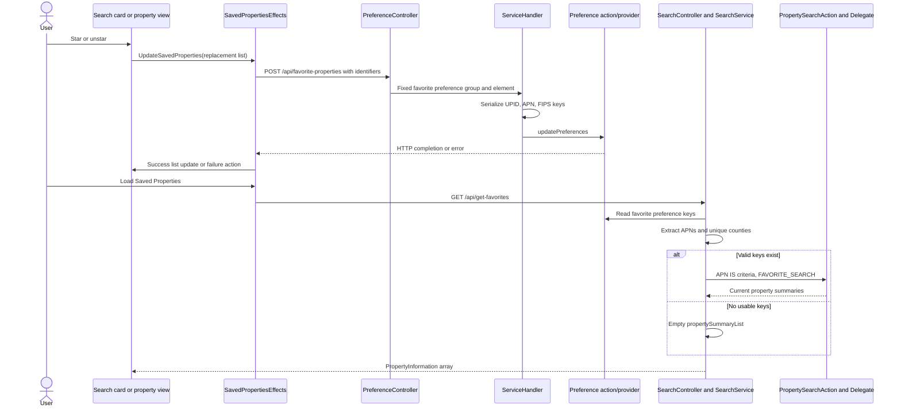

# Saved searches and favorite properties

[Project context](../project-context.md) | [Feature flows](index.md) | [Search](../frontend/search/index.md)

**Confirmed:** `a6f611ae0`, 2026-09-25.

## Three different kinds of “saved”

| Kind | What persists | Reopening means |
| --- | --- | --- |
| My Search **FORM** template | Field configuration, without saved criterion values for the new-form branch | Rebuild an empty configured form |
| My Search **SEARCH** template | Field configuration plus operator values and optional map shape metadata | Restore criteria; execute a new property search |
| Favorite property | Structured identifiers converted into preference combination keys | Fetch current summaries for those properties |

Neither a saved template nor a favorite is an immutable snapshot of property data. Browser retained field values and `localStorage.recentSearches` are separate from either server-persisted object. PI named comparisons are also separate [geographic preferences](../frontend/property-intelligence/features-and-navigation.md).

## Save and reopen a template

`MySearchComponent.save` opens a confirmation modal with name/type, existing template names, template code, and whether values exist. `updateOrSaveTemplate` selects create versus update from the name/type/code and overwrite choice. For a new FORM it removes MAP and clears each `operatorValueList`; for value-bearing saves `addShapeSearchFieldToTemplate` copies current operators and writes normalized MAP criteria plus serialized drawing metadata in `customAttributeInfo.customAttrib2`.

Save is disabled for inherited templates or invalid forms in the template. Switching searches checks unsaved state and can prompt rather than immediately discard edits. Opening a selected saved search sets `SetSelectedMySearch` and `SetMySearchLastLoadedTemplate`; the latter persists the template code as a My Search preference. Form rebuilding and value retention are explained in [Quick/My Search](../frontend/search/quick-search-and-my-search.md).

Evidence: `phoenix/src/app/search/components/my-search/my-search.component.ts:403-495,609-723`; corresponding `.html:16-21`; `phoenix/src/app/store/preferences/preferences.effects.ts:213-236`.



This is template persistence, not the execution of a saved query on the server. The later Submit follows [property search](property-search.md).

### Template HTTP details and failure behavior

Create sends a `Template` with `templateCode:null` and returns `{templateCode:"<assigned-code>"}`. Update sends the existing template and returns **204 without a body**, despite the Angular service’s `Observable<TemplateCodeResponse>` declaration. Delete sends `DELETE /api/delete-search-template?templateId=...` and returns 204. The server maps unsuccessful provider status to 502.

Create effects show a success ribbon and dispatch the returned template code; their error handler emits null. Update/delete effects show a failure ribbon and suppress success processing on an error. Delete success restores the default template selection. These are not a single local database transaction.

Sources: `phoenix/src/app/search/services/preference.service.ts:32-43`; `phoenix/src/app/store/preferences/preferences.effects.ts:99-189`; `realist/web/src/main/java/com/facl/uaf/realist/rest/controller/SearchController.java:73-90`; `realist/web/src/main/java/com/facl/uaf/realist/rest/service/PreferenceService.java:41-66`; `uaf-preference/action/src/main/java/com/facl/uaf/preference/action/PreferenceAction.java:376-392,450-467`; `uaf-preference/action/src/main/java/com/facl/uaf/preference/action/delegate/PreferenceDelegate.java:87-95,117-124,270-277`.

## Star/unstar and reopen favorite properties

`SearchComponent.toggleSaved` removes an already-saved property by combined identity, or prepends a new one if the current saved list is below the 50-property UI limit. It dispatches the **whole replacement property list**. A success ribbon is opened at dispatch time in this component, before HTTP success, so a ribbon alone is not proof of persistence.

`SavedPropertiesEffects` extracts identifiers and POSTs `{propertyIdentifiers:[...]}` to `/api/favorite-properties`. The controller fixes the preference group/element to `PG_RL_FAVORITE_PROPERTIES` / `PREF_FAVORITE_PROPERTIES`. `ServiceHandler.updatePreferenceData` serializes each identifier with a nonempty APN:

```text
universalParcelId|apn|fipsCode
```

Sanitized HTTP projection:

```typescript
{propertyIdentifiers:[{
  universalParcelId:"EXAMPLE-UPID", apn:"EXAMPLE-APN", fipsCode:"00000",
  parcelId:"EXAMPLE-PARCEL"
}]}
```

Other identifier fields may be present; the three-part persisted preference key is the important distinction. A recently viewed entry uses the same helper but can append a date; favorites do not automatically get that fourth segment.

The browser's favorite-equality key is **different**: `parcelId|fipsCode|parcelSeqNumber` (`phoenix/src/app/shared/utils/property-util.ts:151-162`). Do not substitute this key for the server's UPID/APN/FIPS persistence format.



Readback splits keys, uses segment 1 as APN and segment 2 as county, deduplicates counties, then builds APN `IS` criteria through `PropertySearchAction.mySearch(..., FAVORITE_SEARCH)`. It does not simply deserialize stored full property objects. Changing provider data or lookup coverage can therefore change what reappears.

Evidence: `phoenix/src/app/search/components/search/search.component.ts:559-575`; `phoenix/src/app/saved-properties/services/saved-properties.service.ts:13-18`; `phoenix/src/app/store/saved-properties/saved-properties.effects.ts:25-46`; `realist/web/src/main/java/com/facl/uaf/realist/rest/controller/PreferenceController.java:145-150`; `realist/web/src/main/java/com/facl/uaf/realist/action/ServiceHandler.java:1702-1750`; `realist/web/src/main/java/com/facl/uaf/realist/service/SearchService.java:466-509,536-580`.

## UI outcomes, tests, and troubleshooting

Favorite GET and POST backend mappings are method-unrestricted `@RequestMapping`; the browser explicitly sends GET and POST respectively. Update success replaces saved state and clears checked saved rows. Failure actions have no corresponding cases in the inspected saved-properties reducer, leaving prior state unchanged. The page renders property cards and a checked-properties action bar with map reports disabled.

Sources: `SearchController.java:125-129`; `phoenix/src/app/store/saved-properties/saved-properties.reducer.ts:18-23,54-63`; `phoenix/src/app/saved-properties/components/saved-properties/saved-properties.component.html:1-17`.

For a lost save inspect create response code versus update’s empty body, the success action, and persisted last-loaded template preference. For a missing favorite inspect APN presence and all three key segments, then readback search result/coverage. Distinguish row `_id` used for temporary grid selection from persistent property identity; `PropertyUtil.getPropertySummaryList` generates new local IDs (`phoenix/src/app/shared/utils/property-util.ts:18-35`).

Existing tests, not executed: `phoenix/src/app/saved-properties/services/saved-properties.service.spec.ts:48-75` covers HTTP list retrieval/update; `phoenix/src/app/search/components/search/search.component.spec.ts:428-445` covers star/unstar dispatch.

**Unknown:** external preference storage implementation, cross-session conflict resolution, and server/provider enforcement of the frontend 50-favorite limit. Consult [preference module](../backend/modules/uaf-preference.md) rather than assuming local PostgreSQL owns these records.
