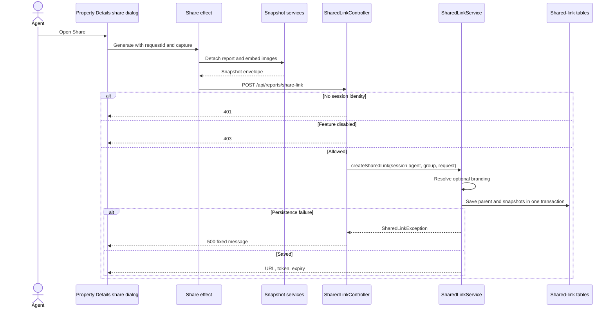
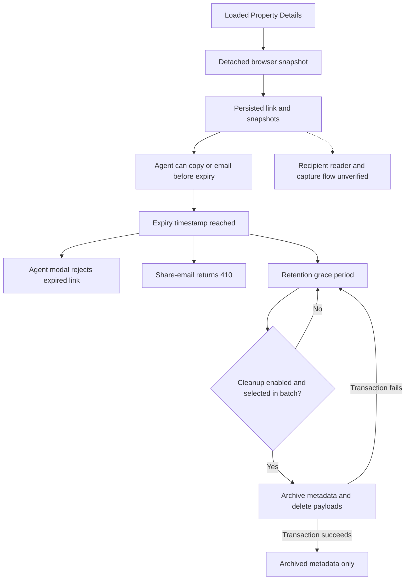

# Shared Report Links

[Project context](../project-context.md) | [Feature flows](index.md) | [Sharing UI](../frontend/commerce-and-sharing.md)

Research: 2026-09-25; branch RP-10188; revision a6f611ae0 (HEAD independently checked by coordinating author). Documentation-only source review; no runtime verification.

## Summary

The implemented agent flow captures the currently loaded Property Details report, embeds image artifacts, persists an expiring snapshot link, and offers copying or email delivery.

**Important boundary:** agent-side creation, email validation, and archival cleanup are implemented. A recipient-facing report reader and lead-capture execution flow were **not found** in the inspected source. Existing entities and comments are not evidence that those flows are operational.

**Evidence labels:** **Confirmed** describes inspected source; **Inferred** describes consequences not demonstrated at runtime; **Unknown** identifies an unresolved boundary. MLS means Multiple Listing Service; APN means assessor parcel number; the FIPS county code supplies geography; CLIP is the CoreLogic property identifier used by this request.

## 1. User entry and feature gates

**Confirmed:**

- The Property Details report uses `selectIsShareReportLinkEnabled`.
- The selector reads `userInfo.shareReportLinkEnabled`, defaulting false.
- Login populates this field through `SharedLinkFeatureService`.
- Backend creation and share-email independently recheck the MLS feature.
- `SharedLinkFeatureService` delegates to `FeatureToggleService` with `AdminFeature.SHARED_LINK`.

Evidence:

- `phoenix/src/app/reports/components/property-details-report/property-details-report.component.ts:104-130,254,336-350`.
- `phoenix/src/app/store/user/user.selector.ts:214-217`.
- `realist/web/src/main/java/com/facl/uaf/realist/rest/service/LoginService.java:518-519`.
- `realist/web/src/main/java/com/facl/uaf/realist/rest/service/sharedlink/SharedLinkFeatureService.java:36-40`.

A visible Share button is not the server authorization decision.

### Snapshot readiness

**Confirmed:** The capture selector requires:

- Property Details is the active report tab.
- Report loaded successfully.
- No required payment.
- Report not explicitly nonexistent.
- Property identifier present.
- At least one section with a template code.

It captures report display format and Property Details Community Insights configuration.

Evidence: `phoenix/src/app/store/property-details-share/property-details-share.selector.ts:26-58`.

## 2. Snapshot preparation

**Confirmed:** `PropertyDetailsSnapshotService.prepareSnapshot()` creates an envelope with:

```json
{
  "reportId": "property-details",
  "schemaVersion": "1",
  "capturedAt": "<ISO-timestamp>",
  "renderContext": {
    "reportDisplayFormat": "<format>",
    "pdrCommunityInsightsConfiguration": {}
  },
  "data": {
    "report": {
      "sections": []
    },
    "propertyData": {
      "MLS_PHOTO_IND": "<indicator>"
    }
  },
  "artifacts": {
    "<artifact-key>": "<embedded-image-data-uri>"
  }
}
```

This abbreviated shape illustrates object boundaries only: the actual `data.report` is the detached loaded report, including its populated sections, rather than an empty report or a JSON string.

Processing:

1. Reject missing property identifier or unavailable report.
2. JSON-round-trip the envelope to detach it from application state.
3. Remove report indicators.
4. Remove loading, failed, empty, or placeholder AI summaries.
5. For retained AI summary sections, remove the additional action rows.
6. Traverse nested sections, groups, summaries, grids, and image collections.
7. Replace image sources with artifact keys.
8. Deduplicate identical image sources.
9. Fetch/validate images and store data URIs in `artifacts`.

Evidence: `phoenix/src/app/shared-report-platform/services/property-details-snapshot.service.ts:21-147`.

`SharedReportArtifactService` accepts supported embedded images or root-relative/HTTP(S) image URLs. It validates MIME/type and nonempty content, rejects malformed data, and aborts a pending `FileReader` during teardown.

Evidence: `phoenix/src/app/shared-report-platform/services/shared-report-artifact.service.ts:10-99`.

**Confirmed:** This is a client-supplied report snapshot, not a backend re-fetch or server-generated PDF.

**Unknown:** Independent verification of snapshot authenticity, content ownership, or a server-enforced size limit was not established in this creation path.

## 3. Creation API and persistence

### Request and response

`POST /api/reports/share-link`

```json
{
  "county": "<FIPS-code>",
  "address": "<display-address>",
  "clip": "<property-identifier>",
  "apn": "<APN>",
  "reports": [
    {
      "reportName": "property-details",
      "reportSnapshotJson": {
        "reportId": "property-details",
        "schemaVersion": "1",
        "capturedAt": "<ISO-timestamp>",
        "renderContext": {},
        "data": {
          "report": {},
          "propertyData": {}
        },
        "artifacts": {}
      }
    }
  ]
}
```

Response:

```json
{
  "token": "<opaque-link-id>",
  "url": "<configured-origin>/shared/report/<opaque-link-id>",
  "expiresAt": "<ISO-timestamp>"
}
```

**Confirmed:** Frontend transformation uses identifier FIPS as `county`, builds the address, and prefers `propertyData.APN` over identifier APN.

The nested object above is abbreviated to show types, not a complete renderable snapshot. Despite its name, `reportSnapshotJson` is a **JSON object** (`Map<String,Object>` on the backend), not JSON text inside a string. The `data.report` object contains the captured report model described in the preceding section. Do not confuse this with commerce's serialized `requestPayloadFull` string.

Evidence: `phoenix/src/app/shared-report-platform/services/shared-link-api.service.ts:18-45`; `realist/web/src/main/java/com/facl/uaf/realist/rest/model/sharedlink/ReportSnapshotDto.java:11-17`.

### Actual server chain

1. `SharedLinkController.createShareLink()` reads agent/group from session.
2. Missing session user-access object or nested user-info object returns **401**. This handler does not separately reject blank agent/group strings before the feature/service calls.
3. Disabled MLS feature returns **403**.
4. `SharedLinkService.createSharedLink()` resolves branding.
5. It saves and flushes the parent link.
6. It saves and flushes each report snapshot.
7. It returns the parent UUID as both link identity and bearer token.
8. URL construction appends `/shared/report/<id>` to `shared-report-link.base-url`; blank base produces a relative path.

Treat the returned link/token as sensitive access material; never use real links in documentation or troubleshooting output. The bearer-token terminology describes the generated identifier's intended use, not a verified recipient authorization implementation.

Evidence:

- `realist/web/src/main/java/com/facl/uaf/realist/rest/controller/SharedLinkController.java:43-68`.
- `realist/web/src/main/java/com/facl/uaf/realist/rest/service/sharedlink/SharedLinkService.java:70-119,133-165`.
- `realist/web/src/main/java/com/facl/uaf/realist/rest/service/sharedlink/SharedLinkUrlBuilder.java:37-56`.

**Confirmed:** No `ServiceHandler` orchestration sits between this controller and sharing service. Branding preference resolution does use it internally.

### Transaction and failure behavior

**Confirmed:** Parent and snapshots are written inside `@Transactional`. Persistence runtime failures are wrapped in `SharedLinkException`; the dedicated handler returns **500** with a fixed `errorMessage`.

Evidence: `realist/web/src/main/java/com/facl/uaf/realist/rest/service/sharedlink/SharedLinkService.java:70-108`; `realist/web/src/main/java/com/facl/uaf/realist/exception/handler/SharedLinkExceptionHandler.java:24-31`.

**Confirmed:** The Java service permits null or empty report lists and creates a link without snapshots. The Angular API service refuses an empty envelope list. `ShareLinkRequest` has no field-validation annotations, and the controller parameter is not annotated `@Valid`.

Evidence: `realist/web/src/main/java/com/facl/uaf/realist/rest/model/sharedlink/ShareLinkRequest.java:11-27`; `realist/web/src/main/java/com/facl/uaf/realist/rest/controller/SharedLinkController.java:43-44`; `realist/web/src/main/java/com/facl/uaf/realist/rest/service/sharedlink/SharedLinkService.java:133-136`; `phoenix/src/app/shared-report-platform/services/shared-link-api.service.ts:23-28`.

Each creation invocation produces a new link. Browser request IDs correlate UI responses; they are not server-side creation idempotency keys.



## 4. Branding is captured at creation

**Confirmed:** Branding is obtained server-side, not trusted from the share request.

`BrandingContextService.getBrandingForCurrentUser()` requires:

- Session identity and passport MLS group.
- MLS branding feature enabled.
- User preference `PG_RL_BRANDING / PREF_RL_BRANDING_ENABLED == "Y"`.
- A resolvable MLS-to-OSN mapping.

It fetches branding and agent profile concurrently and converts them to a DTO. Missing prerequisites or caught failures return null, allowing an unbranded link.

Evidence: `realist/web/src/main/java/com/facl/uaf/realist/rest/service/BrandingContextService.java:48-75,99-159`.

`SharedLinkService` converts that DTO to a generic map stored on the link.

**Inferred:** Existing links retain the creation-time branding payload rather than automatically following subsequent branding edits.

## 5. Copying and emailing

### Copy behavior

**Confirmed:** The URL modal permits copying only for a ready response with a valid HTTP(S) URL and future expiry.

It calls the browser clipboard API in the click gesture. Successful copying displays "Copied!" for five seconds. Unsupported or rejected clipboard operations leave a manually selectable URL and an explanatory error.

Evidence: `phoenix/src/app/shared-report-platform/components/share-url-modal/share-url-modal.component.ts:95-123,132-166,193-205`.

The browser resolves relative URLs against its current origin. That does not establish that a reader exists at the resulting route.

### Share-email contract

`POST /api/send-email`

```json
{
  "toAddress": "<recipient-list>",
  "ccAddress": "<optional-recipient-list>",
  "bccAddress": "<optional-recipient-list>",
  "subject": "<subject>",
  "sharedLinkContext": {
    "sharedLinkId": "<opaque-link-id>",
    "sharedLinkUrl": "<exact-generated-url>",
    "plainMessage": "<message-with-url-alone-on-one-line>"
  }
}
```

Evidence: `phoenix/src/app/shared-report-platform/components/share-email-modal/share-email-modal.component.ts:139-165`; `phoenix/src/app/search/services/email.service.ts:16-17`.

**Confirmed:** This is URL email, not PDF attachment email. The server rejects conflicting legacy fields including `message`, `fileName`, `pdfURL`, `reportType`, and true `reportInaccuracy`.

### Server validation and delivery

`EmailController` selects the share-email branch when `sharedLinkContext` is present.

`EmailService.sendShareLinkEmail()`:

1. Requires session identity and enabled share feature.
2. Rejects conflicting legacy fields.
3. Checks the existing per-user/group email limiter.
4. Loads the persisted link using canonical UUID syntax.
5. Requires exact agent and group ownership.
6. Requires a future expiry.
7. Reconstructs a canonical absolute URL from server configuration.
8. Requires the supplied URL to match exactly.
9. Requires exactly one occurrence of that URL, alone on its line.
10. Builds one server-controlled HTML anchor; sanitizes and HTML-escapes surrounding text.
11. Derives sender/reply-to server-side.
12. Sends via `EmailDelegate.sendEmailSensitive()` without attachment fields.

Evidence:

- `realist/web/src/main/java/com/facl/uaf/realist/rest/controller/EmailController.java:24-28,62-83`.
- `realist/web/src/main/java/com/facl/uaf/realist/rest/service/EmailService.java:89-165`.
- `realist/web/src/main/java/com/facl/uaf/realist/rest/service/sharedlink/SharedLinkEmailContentService.java:88-150,162-209`.

The limiter increments before later link-content validation. Its comparison is `limit > EMAIL_LIMIT`, not `>=`; the allowed path writes a 60-second TTL.

### Email outcomes

| Status | Meaning in share-email flow |
|---|---|
| 200 | Delegate reports successful delivery |
| 400 | Invalid/conflicting request, altered URL, or invalid message placement |
| 401 | Missing/incomplete session identity |
| 403 | Feature disabled |
| 404 | Link missing **or not owned** |
| 410 | Link expired |
| 429 | Email limiter rejected request |
| 502 | Delivery unavailable, unsuccessful provider result, or mapped unexpected runtime failure |
| 503 | No usable configured public URL |

Evidence: `realist/web/src/main/java/com/facl/uaf/realist/exception/SharedLinkEmailException.java:19-51`; `realist/web/src/main/java/com/facl/uaf/realist/rest/controller/EmailController.java:62-83`.

**Confirmed:** Empty `shared-report-link.base-url` can still permit relative link creation, but prevents share-email's canonical absolute-URL validation.

**Unknown:** Provider delivery, mailbox receipt, and duplicate-send handling after ambiguous network failures.

## 6. Recipient public access: implemented boundary versus reserved model

### What is confirmed

- Generated URLs target `/shared/report/<id>`.
- The inspected Angular root route table has no matching shared-report route and ends in a login wildcard.
- Searches for sharing repository consumers found creation, email validation, and cleanup--not a recipient report controller.
- `SharedLinkUser` explicitly describes itself as reserved for downstream lead capture.
- Repository methods exist for link/lead lookup and link/verification-token lookup.

Evidence:

- `realist/web/src/main/java/com/facl/uaf/realist/rest/service/sharedlink/SharedLinkUrlBuilder.java:37-56`.
- `phoenix/src/app/app-routing.module.ts:14-114`.
- `realist/web/src/main/java/com/facl/uaf/realist/rest/model/sharedlink/entity/SharedLinkUser.java:15-19`.
- `realist/web/src/main/java/com/facl/uaf/realist/repository/sharedlink/SharedLinkUserRepository.java:13-38`.

The reserved entity contains link ID, lead ID, email, verification token, token expiry, verification time, and creation time. It declares uniqueness for link/lead.

### What remains unknown

- The deployed recipient application or service.
- Public endpoint paths, input contracts, and response statuses.
- Recipient identity capture and external lead-creation calls.
- Cookie recognition.
- Verification-token issuance and checking.
- Reader-side expiry enforcement and expired-page UX.
- Public authorization/filter-chain exceptions.

The repository comment saying unauthenticated access uses `findById()` describes an intended consumer; no corresponding caller was found.

Do **not** document email's **410** as a confirmed recipient-page status. Do **not** interpret expiry timestamps or cleanup as proof of reader authorization enforcement.

## 7. Expiry, cleanup, archives, and locks

**Confirmed code defaults:**

| Configuration | Default |
|---|---|
| `shared-report-link.expiration-time` | 7 days |
| `shared-report-link.cleanup.enabled` | false |
| `shared-report-link.cleanup.cron` | Hourly |
| `shared-report-link.cleanup.grace-period` | 24 hours |
| `shared-report-link.cleanup.batch-size` | 500 |
| `shared-report-link.cleanup.lock-at-most-for` | 30 minutes |
| `shared-report-link.cleanup.lock-at-least-for` | 1 minute |

Evidence: `realist/web/src/main/java/com/facl/uaf/realist/config/SharedReportLinkProperties.java:15-61`.

These are source defaults, not confirmed deployment settings.

### Cleanup chain

1. Scheduler invokes `SharedLinkCleanupService.purgeExpired()`.
2. Disabled cleanup exits without processing.
3. Compute cutoff `now - gracePeriod`.
4. Fetch one bounded batch with `expiresAt < cutoff`, oldest first.
5. For each link, invoke a separate bean's `REQUIRES_NEW` transaction.
6. Archive parent/report/user metadata.
7. Delete report children, user children, then parent.
8. Log failure and continue when an individual link fails.

Evidence: `realist/web/src/main/java/com/facl/uaf/realist/rest/service/sharedlink/SharedLinkCleanupService.java:57-94`; `realist/web/src/main/java/com/facl/uaf/realist/rest/service/sharedlink/SharedLinkCleanupDeleter.java:40-51`.

**Confirmed:** Archive contents are intentionally asymmetric:

- Link archive excludes `brandingJson`.
- Report archive excludes `reportSnapshotJson`.
- User archive copies its listed lead/verification fields.

Evidence:

- `realist/web/src/main/java/com/facl/uaf/realist/repository/sharedlink/SharedLinkRepository.java:37-53`.
- `realist/web/src/main/java/com/facl/uaf/realist/repository/sharedlink/SharedLinkReportRepository.java:29-45`.
- `realist/web/src/main/java/com/facl/uaf/realist/repository/sharedlink/SharedLinkUserRepository.java:40-54`.

Thus archived metadata is **not** a restorable report snapshot.

A Redis-backed ShedLock provider protects the scheduled job. This is a scheduling lock--not a recipient-access or credit-accounting lock.

Evidence: `realist/web/src/main/java/com/facl/uaf/realist/config/SchedulerLockConfig.java:19-32`.

**Constraint:** `lock-at-most-for` is a finite lease, not an unlimited mutual-exclusion guarantee. The source shows no renewal mechanism in this job. Do not promise no overlapping cleanup if execution outlasts the lease, nor treat a scheduler lock as a database row lock. Per-link archive/delete atomicity belongs to the separate transaction described above. A failed oldest record remains eligible and can recur in the next bounded batch.

Evidence: `realist/web/src/main/java/com/facl/uaf/realist/rest/service/sharedlink/SharedLinkCleanupService.java:57-89`; `realist/web/src/main/java/com/facl/uaf/realist/config/SharedReportLinkProperties.java:54-61`.



The dotted edge marks an unverified integration.

## 8. Browser cancellation is not server rollback

**Confirmed:** The creation effect uses `switchMap`, one-value consumption, and cancellation on matching request ID or logout. Reducers ignore stale request IDs.

Evidence: `phoenix/src/app/store/property-details-share/property-details-share.effects.ts:59-80`; `phoenix/src/app/store/property-details-share/property-details-share.reducer.ts:11-31`.

**Inferred:** Closing the dialog can suppress a late UI result without deleting a link already committed by the backend. Similarly, canceling observation of an email request does not prove that delivery was canceled.

## 9. Debugging reading path

| Symptom | Reading path |
|---|---|
| Share button hidden | Login flag -> user selector -> Property Details button state |
| Share disabled despite loaded screen | Capture selector's tab, sections, payment, and error conditions |
| Link generation fails before POST | Snapshot traversal -> image URL/MIME/data validation |
| 401/403 on creation | Session identity -> `SharedLinkFeatureService` |
| Copy works but email gives 503 | `shared-report-link.base-url` -> URL builder validation |
| Email gives 400 | Legacy fields -> exact URL equality -> one standalone URL line |
| Link not found for email | Parent row existence and exact ownership; non-owned deliberately maps to 404 |
| Expired records remain | Cleanup flag, grace, batch bound, schedule, Redis lock, per-record failures |
| Recipient URL does not render | Establish reader deployment first; no matching Angular route was found |

## 10. Tests and next checks

Existing focused sources include:

- `phoenix/src/app/shared-report-platform/services/property-details-snapshot.service.spec.ts`
- `phoenix/src/app/shared-report-platform/services/shared-link-api.service.spec.ts`
- `phoenix/src/app/shared-report-platform/components/share-url-modal/share-url-modal.component.spec.ts`
- `phoenix/src/app/shared-report-platform/components/share-email-modal/share-email-modal.component.spec.ts`
- `phoenix/src/app/store/property-details-share/property-details-share.effects.spec.ts`
- `phoenix/src/app/store/shared-report-email/shared-report-email.effects.spec.ts`
- Backend `SharedLinkServiceTest`, `SharedLinkControllerTest`, `SharedLinkEmailContentServiceTest`, `SharedLinkCleanupServiceTest`, `SharedLinkCleanupDeleterTest`, and `SharedLinkArchiveQueryTest`.

**Not executed.**

Priorities:

1. Identify the recipient-reader owner, source, deployment, and public contract.
2. Confirm rollback behavior with a snapshot insert failure against the actual database.
3. Verify disabled cleanup, exact expiry/grace boundaries, failed-record retry, and payload exclusion from archives.
4. Review missing/empty snapshots and oversized snapshot server handling.
5. Verify copy/email expiry behavior and ambiguous delivery retries end to end.

## Related documentation

- [Report rendering](../frontend/reports/report-rendering-and-actions.md)
- [PDF generation](pdf-generation-and-download.md)
- [Authentication and authorization](../cross-cutting/authentication-and-authorization.md)
- [Database and migrations](../cross-cutting/database-and-migrations.md)
- [Redis and sessions](../cross-cutting/redis-caching-and-sessions.md)
- [Configuration and feature flags](../cross-cutting/configuration-and-feature-flags.md)
