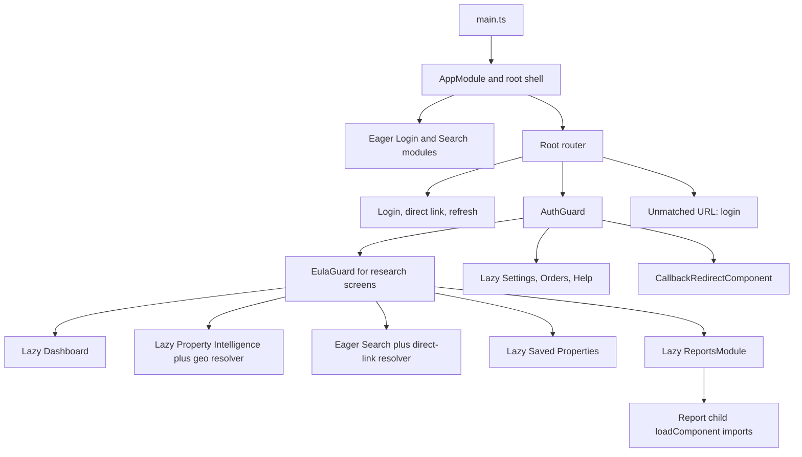
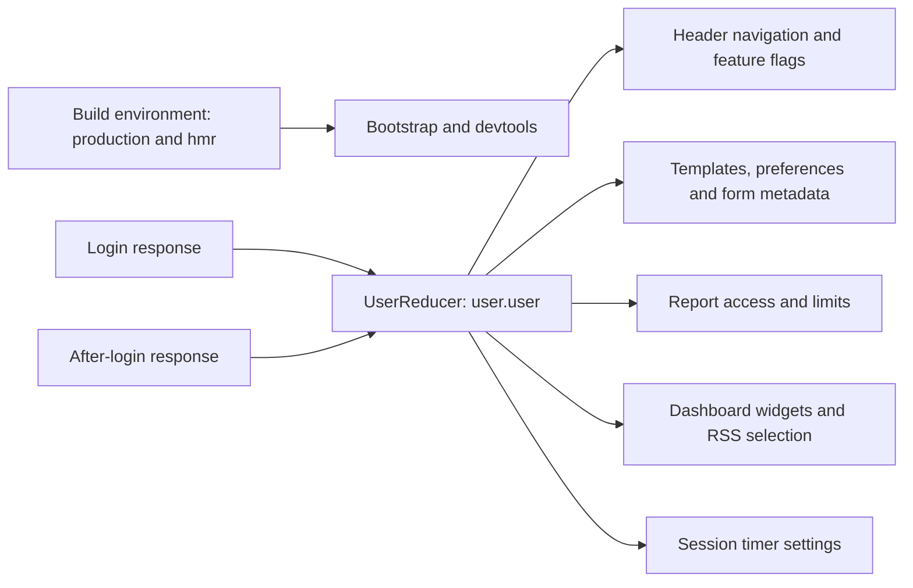

# Bootstrap, shell and routing

[Frontend](index.md) | [Project context](../project-context.md)

**Baseline:** 2026-09-25, `RP-10188` / `a6f611ae0`. **Confirmed** means source-confirmed; browser execution and deployed routing were not tested.

## Why startup is more than displaying a login form

The same browser bundle supports manual login, server-initiated direct links, session restoration, Dashboard, Search and report workflows. A successful login provides both identity and configuration: which starting screen to choose, which navigation items to display, preferences, search metadata and report access information. A route can therefore exist even when its menu item is hidden.

### Bootstrap and shell

`phoenix\src\main.ts:1-24` imports Ensemble web components, assigns the Ensemble icon asset path, registers Swiper elements, enables Angular production mode when the build environment says so, and bootstraps **`AppModule`**, not a standalone `bootstrapApplication`.

`AppModule` declares `AppComponent` and `CallbackRedirectComponent`; imports routing, `AppStateModule.forRoot()`, shared UI, Search, Login, animations, Angular Split and Quill; and permits custom elements. Search and Login are eager module imports (`phoenix\src\app\app.module.ts:19-46`). The root does not fetch a single universal configuration file before bootstrap.

The actual shell is small:

- Header only while `selectIsLoggedIn` is true.
- A `router-outlet` for the active page.
- A global spinner whose cancel event dispatches `CancelRequest`.

Evidence: `phoenix\src\app\app.component.html:1-6`; `phoenix\src\app\app.component.ts:49-109`. The root SCSS file is empty at this revision: do not attribute all page layout to root-component styles.

The shell also observes responsive breakpoints, dispatches `SetMobile`, starts Mixpanel, loads unread announcements after user/group identifiers exist, opens the first nonempty announcement dialog, and selects the newer header theme on Dashboard/Property Intelligence. Root click events are throttled to ten seconds before dispatching `RestartSessionTimer` for an authenticated user. Not every activity event (for example keyboard-only activity) is covered by that click listener. Most subscriptions use `untilDestroyed`; the user/group `combineLatest` subscription at lines 52-57 does not.

## Route and loading map

All paths below are relative to the main application base. Source: `phoenix\src\app\root-routes.ts:1-19` and `phoenix\src\app\app-routing.module.ts:14-120`.

| URL | Loading/entry | Guards and resolver |
| --- | --- | --- |
| `/login/directLink` | Eager `DirectLinkLoginComponent` | No root guard; dispatches direct-login action with query `searchType` |
| `/mobilelogin` | Redirect to `/login` | No separate mobile application |
| `/login` | Eager `LoginComponent` | No root guard |
| `/logout` | Lazy `LogoutModule` | No root guard |
| `/refresh` | Eager shared `RefreshComponent` | Dispatches `RefreshPage` |
| `/dashboard` | Lazy `DashboardModule` | `AuthGuard`, `EulaGuard`; always rerun guards/resolvers |
| `/property-intelligence` | Lazy `PropertyIntelligenceModule` | Same guards; `PropertyIntelligenceResolver`; always rerun |
| `/search` | Eager `SearchComponent` | Same guards; `DirectLinkDataResolverService`; always rerun |
| `/saved-properties` | Lazy `SavedPropertiesModule` | Same guards; always rerun |
| `/reports` | Lazy `ReportsModule` | Same guards; always rerun |
| `/settings` | Lazy `SettingsModule` | `AuthGuard` only; feature child has `PendingChangesGuard` on deactivation |
| `/orders`, `/orders/history`, `/orders/details`, `/orders/return` | Root entries all lazy-load `OrdersModule` | `AuthGuard` only; inspect child routes for the effective match |
| `/support` | Lazy main-app `HelpModule` | `AuthGuard` only |
| `/redirect`, `/redirect/:reportCode/:fipsCode/:apn` | Eager `CallbackRedirectComponent` | `AuthGuard`; callback lifecycle is owned by commerce/sharing docs |
| Anything else, including unmatched empty URL | Wildcard redirect to `/login` | Not an unconditional Dashboard redirect |

No preloading strategy is passed to `RouterModule.forRoot(routes, {})`. A lazy route declaration is not proof that every imported dependency waits for that navigation: feature modules also import shared/other feature modules. Search's eager module already imports Grid and Map (`phoenix\src\app\search\search.module.ts:55-65`).

Arrows describe navigation/loading, not authorization granted by a backend. Evidence is the root route table above. Reports add an empty child redirect to Property Details, a direct-link resolver on their shell and `loadComponent` imports for individual report components; most other children add `ReportsGuard` and `reportCode` data. Property Details has no child `ReportsGuard`. See `phoenix\src\app\reports\reports-router.module.ts:9-150` and [report availability](reports/availability-and-access-rules.md); the catalogue owns per-report details.

## Manual login and configuration staging

`LoginComponent` creates three required controls: `username`, `password`, `mlsGroup`. It submits only a valid form, removes `hmrState` from session storage and dispatches `Login`. Field-level backend status is translated to form errors; a generic login error opens a ribbon. The template has explicit labels, password input, ARIA required attributes and a disabled invalid submit button.

Evidence: `phoenix\src\app\login\components\login\login.component.ts:36-89`; `phoenix\src\app\login\components\login\login.component.html:6-57`.

1. `UserEffects.login$` calls `UserService.login` (`POST /api/login`) through the spinner wrapper.
2. `mapLoginStatusCode` checks the response's business `statusCode`, not merely HTTP success. Authorized responses emit `LoginSuccess` and normally `LoginNavigation`.
3. `UserReducer` merges initial user information, preferences, access map, Dashboard widgets/flags, geography and navigation configuration into `user.user`.
4. `loginSuccess$` writes the `loggedIn` marker, initializes analytics and restarts the session timer. In normal mode it also dispatches `GetLoginData`, map configuration/region actions, saved-property retrieval and report-usage loading.
5. `GetLoginData` calls `GET /api/afterLoginGetData`; its reducer adds metadata, limits, session settings and more preferences. Template/preference lists are concatenated rather than replacing the entire user object.
6. Standalone Property Intelligence skips that normal initialization action list except the timer. Its geography is requested separately.

Evidence: `phoenix\src\app\login\services\user.service.ts:14-44`; `phoenix\src\app\store\user\user.effects.ts:70-79,191-224,282-306,531-553`; `phoenix\src\app\store\user\user.reducer.ts:58-149`.

**Important:** “logged in” and “all metadata loaded” are separate states. `selectIsLoggedIn` checks `LoginStatus.AUTHORIZED`; `GET_LOGIN_DATA_SUCCESS` is what clears `isLoginInProgress` on the normal path. A failed post-login metadata request is caught and filtered out, so absence of metadata is not necessarily a failed login. See `phoenix\src\app\store\user\user.selector.ts:47-55` and `user.effects.ts:282-292`.

## Guards, refresh and direct links

### Authentication guard is a browser gate, not server enforcement

`AuthGuard` checks NgRx login status. If absent, it records an allowed internal return URL and routes to `/refresh` when session storage has a `loggedIn` marker, otherwise `/login`. The marker does **not** establish a live server session.

The return-URL allowlist includes `unlock`, Dashboard, Search, saved properties, Orders, Settings, Reports, plus a three-segment report redirect. It omits `/support` and `/property-intelligence`; a bare `/search?…` also does not match the non-redirect regex. `/unlock` in this allowlist is not a root route declaration. A restored three-segment `/redirect` navigation with `extras.state.restoredReturnUrl` is explicitly allowed even while the store is not authenticated, to avoid a restoration loop.

Evidence: `phoenix\src\app\shared\guards\auth.guard.ts:22-61`. These source branches must not be described as backend security exceptions.

`RefreshComponent` dispatches `RefreshPage`, which uses `GET /api/directLogin`. `DirectLinkLoginComponent` uses the same service request but carries the incoming `searchType` into navigation. The backend handler is `LoginAllData.getLoginResponse`, which can consume cached direct-link metadata or call `LoginService.directLogin`.

Evidence: `phoenix\src\app\shared\components\refresh\refresh.component.ts:17-19`; `phoenix\src\app\login\components\direct-link-login\direct-link-login.component.ts:18-20`; `phoenix\src\app\store\user\user.effects.ts:167-189,409-418`; `realist\web\src\main\java\com\facl\uaf\realist\rest\controller\LoginAllData.java:99-139`. The backend uses unrestricted `@RequestMapping`; **GET is the frontend's method**, not the only method specified by those annotations.

### Where successful login goes

`loginNavigation$` first consumes a validated return URL. Otherwise a direct-link `searchType` chooses a report or property map; direct report navigation sets `state.fromRedirect`. For the default/main-application case, the order is standalone Property Intelligence → enabled Dashboard → Search. These decisions use the login state, not build environment constants (`phoenix\src\app\store\user\user.effects.ts:420-488,567-586`).

### EULA and resolver waiting

EULA means End User License Agreement. `EulaGuard` waits for a defined EULA status, opens the agreement only for `DisplayOptions.NO`, retrieves text by runtime filename and dispatches acceptance/rejection. A load failure shows an error ribbon and rejects navigation; missing status or filename can leave the observable waiting. Acceptance dispatches an update; rejection dispatches logout. Text retrieval is a **direct guard/service request**, not an effect-only architecture.

Evidence: `phoenix\src\app\shared\guards\eula.guard.ts:28-54`; `phoenix\src\app\shared\services\eula.service.ts:16-30`; `phoenix\src\app\store\user\user.effects.ts:262-268,335-341`.

`DirectLinkDataResolverService` only loads data when `searchType` exists in query parameters. It waits until direct-link loading becomes false, then removes query parameters using `Location.replaceState` so Back does not repeat the fetch. `PropertyIntelligenceResolver` instead dispatches `GetGeoData` and waits for truthy geography. Its effect swallows errors without emitting a failure state, so a failed request can leave route resolution pending.

Evidence: `phoenix\src\app\shared\services\direct-link-data-resolver.service.ts:17-36`; `phoenix\src\app\property-intelligence\resolvers\property-intelligence.resolver.ts:18-24`; `phoenix\src\app\store\user\user.effects.ts:294-306,490-511`.

## Runtime configuration versus build settings

This is a browser consumption diagram; the server's configuration origins belong to [configuration and feature flags](../cross-cutting/configuration-and-feature-flags.md). Build environment evidence: `phoenix\src\environments\environment.ts:5-8`, `phoenix\src\main.ts:18-24`, `phoenix\src\app\app-state.module.ts:117-121`. Runtime merge evidence: `user.reducer.ts:58-149`.

`NavigationService` starts with Dashboard, Search, Property Intelligence and action defaults. Contrary to its “fetch configuration” comment, it reads `selectUserInfo` once with `take(1)`; it does not make an HTTP call. If instantiated before `navigationConfig` exists, that subscription returns without waiting for later configuration. Navigation arrays are normalized to leading slashes, Dashboard/Property Intelligence are filtered by flags, and breakpoint filtering controls handset items. Named actions such as Help are separate from route links.

Evidence: `phoenix\src\app\shared\services\navigation.service.ts:47-109,128-151,190-208`. **Inferred risk:** service construction timing can determine whether defaults remain; source does not establish the actual timing in every entry flow.

## Deep-link server boundary

Client navigation and a hard browser reload are different operations. Spring's `FrontendRoutesController.index` forwards an explicit list of main routes to `/index.html`; `redirectToHelp` redirects `/support` and legacy `/user-guide` routes to `/help`; `helpIndex` forwards guide routes to `/help/index.html`.

Evidence: `realist\web\src\main\java\com\facl\uaf\realist\controller\FrontendRoutesController.java:9-57`. Consequently main-app client navigation to `/support` and a server request for `/support` do not share the same destination. `/refresh` and `/mobilelogin` are not in the explicit main forward list. The list contains `/property-intelligence/*`, not an explicit bare `/property-intelligence` entry; effective matching/security for that root needs verification in the deployed stack.

Development proxying is another separate boundary: `phoenix\proxy.config.mjs:1-47` forwards `/api/**` and selected SAML, asset, map and legacy paths to the local backend. It is not a universal external-service proxy. See [User Guide](user-guide-application.md) and [local setup](../development/local-setup.md).

## Debugging, test evidence and remaining questions

| Symptom | Inspect first |
| --- | --- |
| Login succeeds but expected landing page is absent | `loginNavigation$`, stored return URL, standalone/Dashboard flags |
| Reload goes to login/refresh unexpectedly | `AuthGuard`, session-storage marker, `GET /api/directLogin` outcome |
| URL changes but screen never resolves | EULA status/path; geography success state; direct-link loading flag |
| Menu differs from routes | `NavigationService` timing, runtime menu arrays and flag filters |
| Client link works but pasted URL differs | Server forward/redirect rules and proxy, not just Angular routes |
| Old data remains after logout | Unregistered `storeClear`; see [state/API](state-management-and-api-flow.md) |

Representative tests read: `phoenix\src\app\shared\guards\auth.guard.spec.ts:50-219` covers login/refresh selection and restored redirect behavior; its logged-in test at lines 31-48 is commented out. `phoenix\src\app\login\services\user.service.spec.ts:35-69` asserts POST login, GET direct login and POST logout. They were not run and do not prove server sessions or production deep links.

**Unknown:** effective deployed navigation configuration, public/direct-link security behavior, third-party script readiness and runtime provider composition. The return-URL omissions, metadata waiting and navigation `take(1)` are source observations, not fixes performed by this documentation task.

Related: [state/API](state-management-and-api-flow.md), [feature map](feature-map.md), [login/session end-to-end](../feature-flows/login-and-session-lifecycle.md), [authentication](../cross-cutting/authentication-and-authorization.md), [commerce/sharing callbacks](commerce-and-sharing.md).
