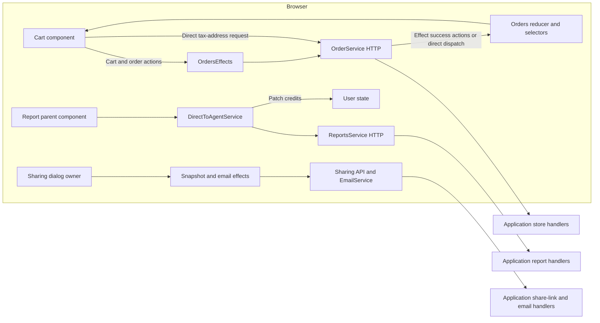
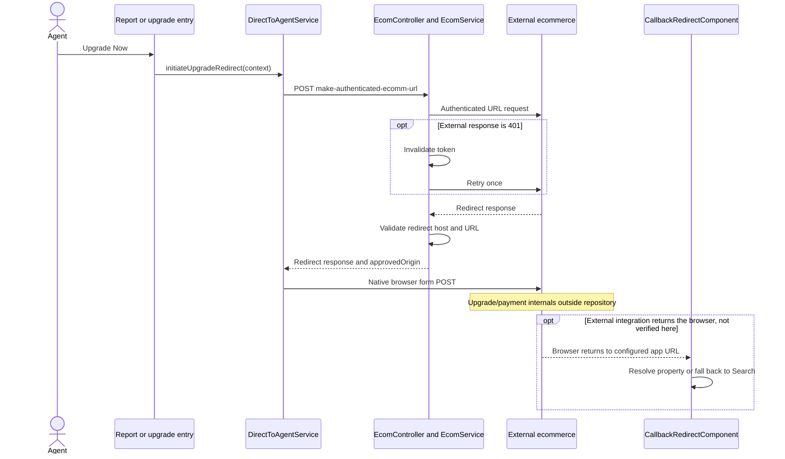
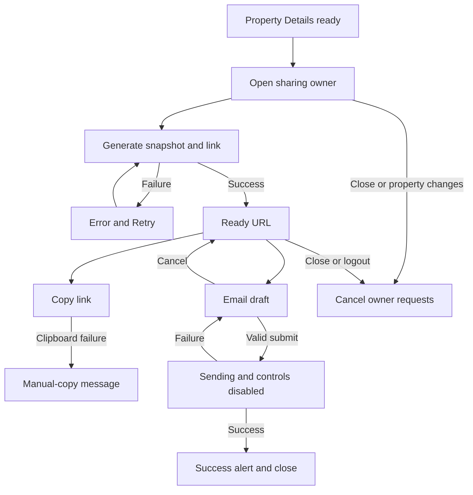

# Frontend Commerce and Sharing

[Project context](../project-context.md) | [Frontend](index.md) | [Cart and accounting](../feature-flows/cart-checkout-and-report-credits.md) | [Shared-link flow](../feature-flows/shared-report-links.md)

Research: 2026-09-25; branch RP-10188; revision a6f611ae0 (HEAD independently checked by coordinating author). Documentation-only source review; no runtime verification.

## Summary

Commerce combines NgRx-managed cart/order operations with direct service calls for address validation and Direct-to-Agent redemption/redirects. Sharing uses dedicated NgRx request state around standalone, OnPush dialogs and a detached Property Details snapshot.

This page owns browser architecture. The linked feature-flow pages own backend contracts, persistence, accounting, and lifecycle details.

**Evidence labels:** **Confirmed** describes inspected source; **Inferred** is not runtime-proven; **Unknown** requires confirmation. Direct-to-Agent (D2A) is the subscription/package experience; APN means assessor parcel number; MLS means Multiple Listing Service. OSN is the external mapping identifier used by the ecommerce integration; no expansion is assumed here.

## 1. Feature composition

| Surface | Entry/owner | State or service | Visible purpose |
|---|---|---|---|
| Cart/checkout | `orders/components/cart/CartComponent` | Orders actions/effects/reducer | Active items, Saved for Later, promotions, checkout |
| History | `orders/components/orders/OrdersComponent` | Orders state | Purchase and credit-consumption history |
| Return | `orders/components/order-return/OrderReturnComponent` | Selected order + `CancelOrder` | Select eligible items to return |
| Provider card fields | `StripePaymentComponent` | Provider elements + Orders card state | Tokenize payment input |
| D2A overlay | `DirectToAgentUpgradeOverlayComponent` | Inputs/outputs only | Redeem, purchase, go to cart, or upgrade |
| D2A orchestration | `DirectToAgentService` | Direct HTTP + user state + APN status streams | Redeem credits and leave for upgrade |
| Property Details sharing | `PropertyDetailsShareDialogComponent` | `propertyDetailsShare`, `sharedReportEmail` | Generate, copy, and email snapshot link |

**Confirmed:** Orders and both sharing slices/effect classes are registered in `phoenix/src/app/app-state.module.ts:49-64,134-137`.



Arrows show browser request/state responsibilities, not database transactions. The tax-address and D2A paths bypass OrdersEffects, while still updating application state. The sharing effects have their own request-ID reducers; they do not reuse the orders slice.

Evidence: `phoenix/src/app/orders/components/cart/cart.component.ts:176-205`; `phoenix/src/app/store/orders/orders.effects.ts:805-895`; `phoenix/src/app/shared/services/direct-to-agent.service.ts:69-108`; `phoenix/src/app/store/property-details-share/property-details-share.effects.ts:59-80`; `phoenix/src/app/store/shared-report-email/shared-report-email.effects.ts:45-59`.

## 2. Cart component and template

### Component surface

**Confirmed:** `CartComponent` is OnPush and uses `@UntilDestroy`.

Template-facing methods include:

- `setCurrentView()`
- `saveForLater()`
- `addToCart()`
- `removeItem()`
- `registerValueForOrder()`
- `placeSecureOrder()`
- `proceedPromo()`
- `openHistory()`

Evidence: `phoenix/src/app/orders/components/cart/cart.component.ts:47-77,102-111,227-306`.

Child bindings include:

```html
<!-- Child emits validated payment form/token context to the cart owner. -->
<rlst-payment-info
  (formValue)="registerValueForOrder($event)"
  [isMobile]="isMobile$ | async"
  [cards]="userCards">
</rlst-payment-info>
```

Source: `phoenix/src/app/orders/components/cart/cart.component.html:33-36`.

### State and transformations

**Confirmed:**

- The component dispatches `GetCart` and `GetAllCards` on initialization.
- `cartData$` groups items using serialized property context and parcel identity.
- `cart.state === 'SUBMITTED'` selects confirmation.
- Promotion input uses an `UntypedFormControl`.
- Several selector subscriptions assign class fields and call `markForCheck()`.
- Tax-address validation bypasses OrdersEffects and subscribes directly to `OrderService.setTaxAddress()`.

Evidence: `phoenix/src/app/orders/components/cart/cart.component.ts:113-209`.

The direct tax-address call dispatches `GetCartSuccess` when successful. Thus a reducer update does not imply the request originated in an NgRx effect.

### Visible outcomes

**Confirmed:**

- Empty cart: "Your Cart is empty."
- Saved-for-later section appears only when populated.
- Checkout requires active items.
- Place-order buttons require a current card state and valid tax address.
- Address validation displays a progress message.
- Promotion errors appear both as ribbon feedback and template error text.

Evidence: `phoenix/src/app/orders/components/cart/cart.component.html:106-153,162-204`; `phoenix/src/app/store/orders/orders.effects.ts:699-723`.

### Angular checklist

| Concern | Observed behavior |
|---|---|
| Structural directives | Nested `*ngIf`, `*ngFor`, and `ng-container`; inspected cart loops do not specify `trackBy` |
| Observable consumption | Mix of `async` pipe and class subscriptions |
| Change detection | OnPush; explicit marking/detection after imperative updates |
| Forms | Reactive promotion control; child payment form emits values |
| RxJS cleanup | Many subscriptions use `untilDestroyed`; tax-address request is a nested subscription without its own explicit teardown |
| Accessibility | Promotion input has label; cart close uses clickable `<i>`; mobile expansion uses clickable `<div>` |
| Styling | Sass variables/mixins, nested BEM-like selectors, mobile mixins |
| Template complexity | Repeated async expressions and nested item grouping; document-number parsing called from template |

Evidence: `phoenix/src/app/orders/components/cart/cart.component.ts:113-205`; `phoenix/src/app/orders/components/cart/cart.component.html:7,109-118,176-211`; `phoenix/src/app/orders/components/cart/cart.component.scss:1-94`.

**Unknown:** Full keyboard/focus behavior and reduced-motion coverage were not established through runtime testing.

## 3. Orders effects: behavior to preserve

**Confirmed:**

- Most cart mutations send the desired active/saved collections, then reload the composed cart.
- Several mutation error handlers return `of(void 0)` rather than a dedicated failure action.
- `getCartSize$` filters responses using `filter(Boolean)`, dropping a legitimate zero.
- Checkout and refund effects have explicit ribbons/alerts.
- Report-view effects can mark a purchase non-refundable before requesting report content.

Evidence: `phoenix/src/app/store/orders/orders.effects.ts:84-225,256-269,605-629,729-843`.

**Watch point:** Some cart effects map a response into `UpdateCartSuccess` and immediately map again into `GetCart`; the intermediate action object is not separately dispatched by that chain.

Example: `phoenix/src/app/store/orders/orders.effects.ts:618-624`.

### Payment component boundary

**Confirmed:** `StripePaymentComponent` is OnPush, takes `userForm`, and emits `createToken`. It creates/mounts provider card elements, listens for changes, and tokenizes when fields and form are complete.

Evidence: `phoenix/src/app/shared/components/stripe-payment/stripe-payment.component.ts:25-38,88-161`.

Its form-value subscription uses `untilDestroyed`. The `combineLatest(fromEvent(...))` subscription does not show the same teardown operator, although destruction explicitly destroys provider elements.

**Unknown:** Whether provider destruction alone releases all registered observable listeners. No memory profiling was performed.

## 4. Direct-to-Agent overlay and redemption

### Presentational contract

**Confirmed:** `DirectToAgentUpgradeOverlayComponent` is standalone and OnPush.

Inputs:

- `reportName`
- `package`
- `showPurchaseActions`
- `visible`
- `showCloseButton`
- `addedToCart`

Outputs:

- `redeemConfirmed`
- `closed`
- `addToCart`
- `goToCart`
- `upgradeNow`

Evidence: `phoenix/src/app/shared/components/direct-to-agent-upgrade-overlay/direct-to-agent-upgrade-overlay.component.ts:6-29`.

The component performs no HTTP operation. Its parent supplies state and handles emitted actions.

### Template decisions

**Confirmed:**

- Positive credits on an active subscription expose "Unlock for 1 Credit."
- Redemption is disabled when already added to cart.
- Zero credits expose upgrade.
- Purchase buttons depend on `showPurchaseActions`.
- In-cart state exposes "In cart" and "Go to cart."
- No-subscription mode exposes upgrade and optional purchase actions.

Evidence: `phoenix/src/app/shared/components/direct-to-agent-upgrade-overlay/direct-to-agent-upgrade-overlay.component.html:62-115`.

The overlay uses positioned `<div>` elements, not the sharing dialog's `en-modal`. The inspected template does not supply an explicit dialog role, focus trap, or Escape handling.

Styling combines Sass tokens/mobile mixins and Ensemble CSS custom properties.

Evidence: `phoenix/src/app/shared/components/direct-to-agent-upgrade-overlay/direct-to-agent-upgrade-overlay.component.html:1-19`; `phoenix/src/app/shared/components/direct-to-agent-upgrade-overlay/direct-to-agent-upgrade-overlay.component.scss:1-85`.

### Direct service state

**Confirmed:** `DirectToAgentService`:

- Reads package data from the user selector.
- Caches property-status observable instances by trimmed APN.
- Uses a per-APN `BehaviorSubject` to trigger refresh.
- Uses `shareReplay({bufferSize:1, refCount:true})`.
- Converts status-request errors to `{}`.
- Updates remaining credits and refreshes property status after successful redemption.

Evidence: `phoenix/src/app/shared/services/direct-to-agent.service.ts:60-115,175-188,279-280`.

**Watch point:** The cache key is APN only; no county is included. No eviction or logout clearing appears in this service's inspected implementation.

## 5. Direct-to-Agent upgrade redirect

This is a browser navigation/form integration, not cart checkout.

### Request chain

**Confirmed:**

1. Parent invokes `initiateUpgradeRedirect(context)`.
2. Service takes one MLS-group/user selection.
3. Missing identity produces a warning and completes without HTTP.
4. Return URL comes from explicit context or `/redirect/<reportCode>/<fipsCode>/<apn>`.
5. Dashboard return URLs are rewritten to Search.
6. Browser posts to `/api/ecom/make-authenticated-ecomm-url`.
7. Backend maps MLS group to OSN and calls the configured external authentication-URL endpoint.
8. An external 401 triggers token invalidation and one retry.
9. Backend validates the returned redirect and supplies `approvedOrigin`.
10. Browser validates HTTPS and exact origin agreement, sanitizes the form action, creates hidden inputs, and submits a native POST form.

Evidence:

- `phoenix/src/app/shared/services/direct-to-agent.service.ts:117-159,191-215,218-276`.
- `realist/web/src/main/java/com/facl/uaf/realist/rest/controller/EcomController.java:23,93-104`.
- `realist/web/src/main/java/com/facl/uaf/realist/rest/service/ecommerce/EcomService.java:466-528`.

Sanitized request shape:

```json
{
  "osn": "<MLS-group-before-server-mapping>",
  "memberMlsId": "<session-user-selection>",
  "returnUrl": "<application-return-route>",
  "returnToApplicationName": "Realist",
  "resProductId": "<optional-product>"
}
```

The response carries a redirect URL, short-lived authentication material, return metadata, and approved origin. Values must not be logged or copied into documentation.

### Important validation detail

**Confirmed:** Backend validation requires an absolute HTTPS URL, no user info or fragment, port 443, and a trusted host suffix. It validates configured base-URL syntax but does **not** compare the returned host to the configured base host in the inspected rejection method.

Evidence: `realist/web/src/main/java/com/facl/uaf/realist/rest/service/ecommerce/EcomService.java:513-604`.

The browser's exact-origin check compares against the server-returned `approvedOrigin`.

Do not describe this as an exact configured-origin backend allowlist.



The external return is an integration expectation; actual deployed completion behavior was not exercised.

### Callback processing

**Confirmed:** The callback validates report code and FIPS/APN context, normalizes numeric or state-prefixed county codes, dispatches `SetUpProperties`, and races a success action against a 29-second timeout.

Invalid context, timeout, or empty resolution navigates to Search. Success navigates to the report with `fromRedirect:true`.

Evidence: `phoenix/src/app/callback-redirect.component.ts:53-128`.

It uses `DestroyRef` and `takeUntilDestroyed()`.

**Watch point:** The inspected success-action listener does not correlate the action with the requested property. Whether unrelated concurrent setup actions can reach it requires targeted testing.

## 6. Sharing component architecture

### Ownership layers

**Confirmed:**

1. Property Details decides readiness and opens/closes the sharing owner.
2. `PropertyDetailsShareDialogComponent` owns request IDs, capture, and share-versus-email view.
3. `PropertyDetailsShareEffects` prepares the snapshot and calls the API.
4. `ShareUrlModalComponent` renders URL, expiry, copy, retry, and email controls.
5. `ShareEmailModalComponent` validates the draft and emits a send request.
6. `SharedReportEmailEffects` invokes the existing Angular `EmailService`.
7. Reducers accept results only for the active request.

Evidence:

- `phoenix/src/app/shared-report-platform/adapters/property-details/property-details-share-dialog.component.ts:34-58,73-118,121-201,235-239`.
- `phoenix/src/app/store/property-details-share/property-details-share.effects.ts:59-80`.
- `phoenix/src/app/store/shared-report-email/shared-report-email.effects.ts:45-59`.

### URL modal surface

**Confirmed:** Standalone, OnPush, `CUSTOM_ELEMENTS_SCHEMA`, and Ensemble `en-modal`.

Inputs: `viewState`, heading, description, `enableEmail`.

Outputs: opened, retry requested, closed, email requested.

It waits for the Lit component's `updateComplete` before `showModal()`.

Evidence: `phoenix/src/app/shared-report-platform/components/share-url-modal/share-url-modal.component.ts:18-37,73-80`.

### Email modal surface and forms

**Confirmed:** The email modal internally creates a reactive `FormGroup`, but its web-component template uses `[value]` and `(input)` through an `update()` method rather than `formControlName` or `ngModel`.

Validation includes:

- Required recipient list.
- Semicolon-separated email validation.
- Required subject/message.
- Message maximum length.
- Exact shared URL placement.

During send, controls and cancel are disabled. Failure re-enables the unchanged draft for explicit retry. Cancel returns to the already-generated link without generating another.

Evidence:

- `phoenix/src/app/shared-report-platform/components/share-email-modal/share-email-modal.component.ts:62-73,129-177,208-222`.
- `phoenix/src/app/shared-report-platform/components/share-email-modal/share-email-modal.component.html:1-48`.
- `phoenix/src/app/shared-report-platform/adapters/property-details/property-details-share-dialog.component.ts:159-168`.



### Accessibility and styling

**Confirmed:**

- URL input has label, readonly value, and expiry description.
- Both dialogs expose busy state and polite live status.
- Clipboard failure retains manual-copy access.
- Modal open waits for the underlying web component.
- Email send blurs the active element when controls become disabled.
- URL styles use Ensemble variables and no `::ng-deep` in the inspected file.

Evidence:

- `phoenix/src/app/shared-report-platform/components/share-url-modal/share-url-modal.component.html:1-39`; `phoenix/src/app/shared-report-platform/components/share-url-modal/share-url-modal.component.scss:1-89`.
- `phoenix/src/app/shared-report-platform/components/share-email-modal/share-email-modal.component.html:1-48`.
- `phoenix/src/app/shared-report-platform/components/share-email-modal/share-email-modal.component.ts:208-216`.

**Unknown:** Actual focus restoration, keyboard trapping, and reduced-motion behavior inside the imported modal implementation were not verified.

## 7. Error-state mapping

| Operation | Browser behavior |
|---|---|
| Cart load | Error ribbon; no success state update |
| Cart mutation | Several paths swallow errors into an undefined emission |
| Promotion | Error ribbon plus promotion-error state |
| New-card checkout | Distinct messages for 400, 424, 500, 503 and fallback |
| D2A status read | Empty status map on error |
| D2A redemption | Report component displays server/fallback warning |
| Upgrade initiation | Warning alert; completes without redirect |
| Share generation | Fixed messages for connectivity, session, permission, size, and rate-limit errors |
| Share email | Fixed messages for altered/missing/expired link, session, permission, rate limit, and temporary unavailability |
| Clipboard | Manual-copy guidance |

Evidence:

- `phoenix/src/app/store/orders/orders.effects.ts:65-79,719-723,875-889`.
- `phoenix/src/app/shared/services/direct-to-agent.service.ts:76-83,123-155`.
- `phoenix/src/app/store/property-details-share/property-details-share.effects.ts:16-54`.
- `phoenix/src/app/store/shared-report-email/shared-report-email.effects.ts:17-40`.

Frontend handling of 413 or 429 does not prove that the sharing creation controller itself implements payload-size or rate-limit enforcement.

## 8. Focused review map

| Artifact | Role | Risk/next check | Tests to review |
|---|---|---|---|
| `phoenix/src/app/store/orders/orders.effects.ts` | Cart and order orchestration | Rapid replacement requests, zero counts, failure actions | `phoenix/src/app/store/orders/orders.effects.spec.ts` |
| `phoenix/src/app/orders/components/cart/cart.component.ts`, `phoenix/src/app/orders/components/cart/cart.component.html`, `phoenix/src/app/orders/components/cart/cart.component.scss` | Checkout owner | Nested tax validation, keyboard controls, stale state | Component coverage not fully inventoried |
| `phoenix/src/app/shared/components/stripe-payment/stripe-payment.component.ts` | Provider elements | Listener teardown and repeated tokenization | Focused tests not established |
| `phoenix/src/app/shared/services/direct-to-agent.service.ts` | Redemption/status/redirect | APN-only cache, redirect contract | Service coverage not fully inventoried |
| `phoenix/src/app/callback-redirect.component.ts` | Return navigation | Timeout and unrelated success-action handling | Callback coverage requires review |
| `phoenix/src/app/store/property-details-share/*` | Snapshot request lifecycle | Cancel/logout/stale completion | Existing selector/reducer/effect specs |
| `phoenix/src/app/shared-report-platform/components/share-*-modal/*` | Reusable dialogs | Expiry, keyboard, double submit, clipboard failure | Existing component specs |

**Recommended validation order:**

1. Checkout and redemption failure/retry scenarios.
2. Rapid cart mutations and cross-county property identity.
3. D2A redirect rejection and callback timeout.
4. Sharing close/logout/property-change races.
5. Keyboard-only dialog/cart interactions.

These are recommendations for subsequent authorized testing, not claims of passing coverage. No source changes were proposed or applied in this research.

## 9. Unknowns and handoff

- External checkout and D2A upgrade completion behavior remain external boundaries.
- Recipient shared-report reading/user capture has no confirmed implementation in the inspected source.
- Full commerce E2E coverage and runtime accessibility were not established.
- Saved Properties and general Settings were not researched deeply enough to justify the optional extra chapter.

## Related documentation

- [Frontend state/API flow](state-management-and-api-flow.md)
- [Shared UI patterns](shared-components-and-ui-patterns.md)
- [Cart, checkout, and accounting](../feature-flows/cart-checkout-and-report-credits.md)
- [Shared report links](../feature-flows/shared-report-links.md)
- [Report availability](reports/availability-and-access-rules.md)
- [Login/session lifecycle](../feature-flows/login-and-session-lifecycle.md)
- [Security](../cross-cutting/authentication-and-authorization.md)
