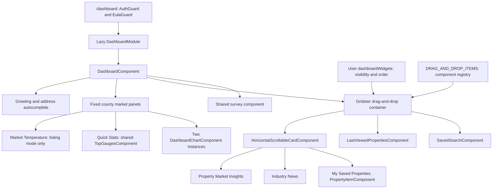

# Insights Dashboard

[Frontend](../index.md) | [Project context](../../project-context.md)

**Research:** 2026-09-25; branch `RP-10188`, revision `a6f611ae0654e2bf62deec0a7d5c1d333348d6be`.
**Scope:** source inspection only, including component TypeScript, HTML, SCSS and representative test source. No builds, tests, services or external requests were executed. **Confirmed** below means confirmed in this revision, not verified in a deployed session.

## What this page does for the user

The Insights Dashboard is a starting point for real-estate research: check county market conditions, search an address, resume a saved search, reopen a saved or recently viewed property, and read industry news. It is **not** the separate Property Intelligence application area and is not a property report itself.

Three concepts prevent common misunderstandings:

- A **saved search** is a reusable search template, not a frozen result set.
- A **saved property** is a favorite property; **Last Viewed Properties** is a separate history source.
- County statistics and charts are fixed page sections. The five movable widgets below them are selected from runtime preferences and a frontend component registry.

MLS means Multiple Listing Service. APN means Assessor's Parcel Number. County FIPS codes identify counties in requests; property cards also carry property identifiers. `isPinMember` is a source-defined eligibility flag; this chapter does not infer an expansion of “PIN.”

## Read next

| Page | What it owns |
| --- | --- |
| [Widgets and data flow](widgets-and-data-flow.md) | Every registry entry, fixed statistics, HTTP-to-handler map, loading sequence, empty/error states and navigation |
| [Configuration and personalization](configuration-and-personalization.md) | Runtime flags, county selection, visibility/order, news selection, preference persistence and failure caveats |

## Route and application shell

**Confirmed:** `RootRoutes.Dashboard` is `dashboard`. The root router lazily loads `DashboardModule` for `/dashboard`, runs `AuthGuard` and `EulaGuard`, and specifies `runGuardsAndResolvers: 'always'`. The feature's empty child path renders `DashboardComponent`; the dashboard route does not declare a geography resolver.

- `phoenix\src\app\root-routes.ts:7` — `RootRoutes.Dashboard`.
- `phoenix\src\app\app-routing.module.ts:38-43` — dashboard route.
- `phoenix\src\app\dashboard\dashboard-routing.module.ts:5-10` — child route.
- `phoenix\src\app\dashboard\dashboard.module.ts:28-58` — declarations and shared/search/report imports.
- `phoenix\src\app\app.component.html:1-6` — logged-in header, routed content and application spinner.

Login navigation is conditional, not an unconditional redirect to Dashboard. In the main-application branch, standalone Property Intelligence takes precedence; otherwise `dashBoardEnabled` selects Dashboard, with Search as the fallback. A restored return URL has earlier priority. The shared navigation service also filters Dashboard menu entries when the flag is false. The route itself has authentication/EULA guards, **not a dashboard-feature guard**; menu visibility must not be treated as server authorization.

Evidence: `phoenix\src\app\store\user\user.effects.ts:420-484` — `loginNavigation$`; `phoenix\src\app\store\user\user.selector.ts:196-206` — dashboard and membership selectors; `phoenix\src\app\shared\services\navigation.service.ts:190-198` — `filterByFeatureFlags`.

## Composition

Arrows show composition/configuration, not HTTP calls. The application header and spinner sit outside this feature in the root shell. The dynamic container creates component instances using `ViewContainerRef.createComponent`, then assigns feed/property inputs where the registry entry supplies `data$`. The saved-search and last-viewed components load their own data.

Evidence:

- `phoenix\src\app\dashboard\components\dashboard\dashboard.component.html:1-85` — actual composition, fixed sections and survey.
- `phoenix\src\app\dashboard\constants\dashboard.constants.ts:14-59` — all five dynamic registry entries.
- `phoenix\src\app\shared\components\drag-and-drop-container\drag-and-drop-container.component.ts:52-80` — dynamic creation and input wiring.

**Not active in this composition:** `TwitterWidgetComponent` remains declared and has an implementation, but has no registry entry or dashboard-template use. The login widget mapper explicitly excludes `PREF_TWITTER_FEED`. Do not infer a current X/Twitter dashboard widget from older screenshots or the class's presence.

Evidence: `phoenix\src\app\dashboard\dashboard.module.ts:29-36`; `phoenix\src\app\dashboard\components\twitter-widget\twitter-widget.component.ts:24-41`; `realist\web\src\main\java\com\facl\uaf\realist\rest\service\LoginService.java:711-724` — `processWidgetManagement`.

## Initialization and ownership of state

`DashboardComponent.ngOnInit`:

1. Dispatches `RemoveCurrentPropertyIndex` to clear the report-navigation index.
2. Requests geography or post-login metadata if prerequisites are absent.
3. Builds the address form and subscribes to selected counties, membership, greeting and feed configuration.
4. Loads county report sections **directly** through `DashboardService`, storing them in component-local `sections`.
5. Connects RSS observables and saved-property selectors to the registry.
6. Builds visible dynamic items and subscribes to reordered layouts.

Evidence: `phoenix\src\app\dashboard\components\dashboard\dashboard.component.ts:73-163,231-240,291-305`.

There is **no dashboard NgRx reducer/state slice** in `AppStateModule`. The feature consumes `user` and `savedProperties`, uses `searchBoard` for search navigation, and interacts with `reports` when clearing/opening a property. `reportData$` is assigned `selectSdpMarketTrends` but is not bound in the dashboard template; the displayed statistics come from the direct service response, not that selector.

Evidence: `phoenix\src\app\app-state.module.ts:43-65`; `phoenix\src\app\dashboard\components\dashboard\dashboard.component.ts:119,231-249`; `phoenix\src\app\dashboard\components\dashboard\dashboard.component.html:28-78`.

## User journeys

| Action | Result |
| --- | --- |
| Enter/select an address | `/search`, Quick Search tab, with navigation state containing `isDashboardSearch` and `address` |
| Open a saved search | `/search`, My Search tab, with the selected template in navigation state |
| Create new search | `/search`, My Search edit/create flow; does not create a template immediately in Dashboard |
| Click saved property or recent-property row | Shared search `NavigationService.openSingleReport`, then `/reports` with report property state |
| Read More / See More on news | `window.open` for article/site URL; not an internal report route |
| Select County | Shared county dialog; saving updates the same region preferences used by Search |
| Widget menu | Hide, enable drag, manage visibility, or select an industry-news source |

The concrete handoffs and receiving components are documented in [Widgets and data flow](widgets-and-data-flow.md#navigation-handoffs).

## Rendering, styling and accessibility observations

Most dashboard components use `OnPush`. The parent explicitly calls `detectChanges` after direct data and widget changes; subscriptions commonly use `untilDestroyed`. The horizontal-scroll card deliberately uses default change detection so scroll-button state follows the rendered width.

The SCSS supplies a light-gray page, white rounded statistics panels, and two flex charts that stack on mobile. Gridster uses twelve columns with a fixed vertical layout; its items have content-fitting height overrides and mobile spacing. Horizontal cards use a flex row with hidden horizontal overflow, snap alignment, and full-width content items; arrow buttons drive scrolling. Address input has an ARIA label, and the management dialog has a labeled close button. Several interactions are click-bound icons/table rows, so this inspection is **not** an accessibility certification.

Evidence: `phoenix\src\app\dashboard\components\dashboard\dashboard.component.ts:34-40,102-109,146-158`; `phoenix\src\app\shared\components\horizontal-scrollable-card\horizontal-scrollable-card.component.ts:21-28`; `phoenix\src\app\dashboard\components\dashboard\dashboard.component.scss:5-46,138-156`; `phoenix\src\app\shared\components\drag-and-drop-container\drag-and-drop-container.component.scss:4-28`; `phoenix\src\app\dashboard\components\saved-search\saved-search.component.html:22-29`; `phoenix\src\app\dashboard\components\last-viewed-properties\last-viewed-properties.component.html:26-28`.

Card-style evidence: `phoenix\src\app\shared\components\horizontal-scrollable-card\horizontal-scrollable-card.component.scss:41-59`; scroll behavior: `phoenix\src\app\shared\components\horizontal-scrollable-card\horizontal-scrollable-card.component.ts:60-75`.

## First code-reading and debugging path

| Question | Start here |
| --- | --- |
| Why is a panel absent? | `DashboardComponent.checkMarketTrendsData` and template conditions; then widget flags/registry |
| Where does a movable widget get its data? | `DRAG_AND_DROP_ITEMS`, `setWidgetDataSource`, then the dynamically created component |
| Why did a drag/hide appear to save but disappear after login? | `UpdateDashboardWidgets` reducer/effect and preference endpoint; UI updates before HTTP success |
| Why did changing counties affect Search? | Shared `SaveRegionsAction` / `PreferencesEffects`, not a dashboard-only preference |
| Why is a widget blank? | Compare request outcome with the local empty/error behavior; several widgets have no dedicated error view |

## Representative tests and known gaps

The inspected specs are creation-only scaffolds:

- `phoenix\src\app\dashboard\components\dashboard\dashboard.component.spec.ts:5-21`.
- `phoenix\src\app\dashboard\components\saved-search\saved-search.component.spec.ts:5-22`.
- `phoenix\src\app\dashboard\components\last-viewed-properties\last-viewed-properties.component.spec.ts:5-22`.
- `phoenix\src\app\dashboard\components\manage-widget\manage-widget.component.spec.ts:5-22`.

They do not establish behavior for endpoint failures, drag persistence, county races, news changes or navigation. Several configure only component declarations despite injected dependencies. **Unknown:** whether these specs currently pass; none were run.

Other explicit boundaries:

- **Unknown:** deployed widget preference lists, available RSS options, actual county coverage, and effective user flags. Source configuration contracts are not proof of deployment values.
- **Inferred risk:** overlapping county requests can finish out of order, because the parent uses `mergeMap`; details are in the data-flow page.
- **Confirmed limitation:** widget preference saving has no dashboard-specific rollback. See the personalization page for news and unknown-widget edge cases.
- Backend internals, provider calculations and persistence implementations belong to backend authors; this section matches frontend calls to handlers without claiming an exhaustive downstream trace.
- **Documentation integration:** the frontend index links `dashboard/index.md`; this page's main-context link is `../../project-context.md`. Global navigation and completion tracking remain coordinator-owned.

### Chapter validation and integration handoff

All three dashboard files were persisted and their source paths/starting line numbers and Markdown fence pairing checked locally. Diagrams were reviewed against the cited call paths, not rendered with an installed Mermaid tool. No application build/test was run.

Integration review confirmed the frontend index backlink, three dashboard sibling links, core state/API chapter, Search/Property Intelligence chapters, main context, web/preferences backend pages and saved-items flow. Reports index/availability, the property-search backend module and configuration/feature-flags chapter were still pending at that check. They are separately owned integration dependencies, not placeholder pages created by this author.

## Related documentation

- [Search](../search/index.md) and [Property Intelligence](../property-intelligence/index.md).
- [Reports](../reports/index.md), especially [availability and access](../reports/availability-and-access-rules.md).
- [Frontend state/API patterns](../state-management-and-api-flow.md).
- [Web host and API ownership](../../backend/modules/realist-web.md) and [preferences module](../../backend/modules/uaf-preference.md).
- [Saved-search/favorites flow](../../feature-flows/saved-searches-and-favorites.md).
