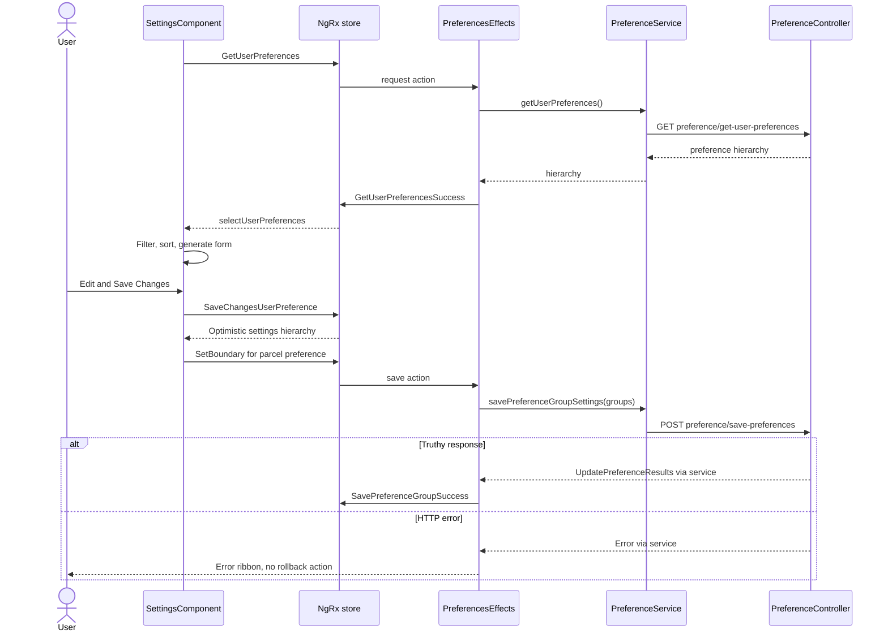

# Feature-to-code map

[Frontend](index.md) | [Project context](../project-context.md)

**Research:** 2026-09-25, `RP-10188`, revision `a6f611ae0`. Source inspection only. This is a browser-oriented navigation map, not a replacement for the detailed feature/backend chapters.

## Translate a user request into a code path

Begin with what the user is trying to accomplish, then identify its browser entry point, state/service and HTTP boundary. A saved search is a **template of criteria**, not a saved property list. A favorite is a **property identifier**, not a report snapshot. Dashboard market panels, standalone Property Intelligence and Market Trends reports are related experiences but not interchangeable routes.

MLS means Multiple Listing Service; APN means Assessor's Parcel Number; FIPS is the county identifier carried in these property/geography contracts. Property/report requests may also carry CLIP, the property's cross-system identifier. Do not substitute an address string for these structured identifiers.

## Browser feature inventory

| User capability | Frontend entry / state or service | Ownership and reading path |
| --- | --- | --- |
| Login, direct links, refresh, logout | `/login`, `/login/directLink`, `/refresh`, `/logout`; `UserEffects`, `UserService`, `user` | [Bootstrap and routing](bootstrap-and-routing.md); [login/session flow](../feature-flows/login-and-session-lifecycle.md) |
| Dashboard / resume work | `/dashboard`; `DashboardComponent`, dynamic widget registry, `DashboardService`; shared `user`/`savedProperties` plus local fields | [Dashboard](dashboard/index.md), [widget data](dashboard/widgets-and-data-flow.md), [personalization](dashboard/configuration-and-personalization.md) |
| Quick Search and My Search | `/search`; eager `SearchComponent`, `QuickSearchComponent`, `MySearchComponent`; `SearchEffects`, `searchBoard`, user templates | [Search](search/index.md), [dynamic controls](search/dynamic-fields-and-lookups.md) |
| Maps, grid and selected property actions | Search's `MapModule` and `GridModule`; `searchBoard` selection/layout and `SearchService` | [Results/grid/map](search/results-grid-map-and-actions.md); [map flow](../feature-flows/maps-and-property-lookup.md) |
| Saved searches | My Search controls and Dashboard `SavedSearchComponent`; templates in `user`, `PreferencesEffects`, `PreferenceService` | [Saved-search/favorites flow](../feature-flows/saved-searches-and-favorites.md) |
| Favorites / saved properties | `/saved-properties`, header Favorites action, Dashboard saved-property widget; `SavedPropertiesEffects`, `SavedPropertiesService`, `savedProperties` | [Search results actions](search/results-grid-map-and-actions.md), [saved flow](../feature-flows/saved-searches-and-favorites.md) |
| Property details and report tabs | `/reports` shell and child `loadComponent` routes; `reports`, `ReportsEffects`, report services | [Report catalogue](reports/report-catalogue.md), [availability rules](reports/availability-and-access-rules.md), [rendering/actions](reports/report-rendering-and-actions.md) |
| Market/listing/rental/HPI analytics | `/property-intelligence`; `PropertyIntelligenceService`, geography resolver, user preferences and component data | [Property Intelligence](property-intelligence/index.md), [analytics data flow](property-intelligence/analytics-and-data-flow.md). HPI means Home Price Index in this feature vocabulary. |
| Exports, mailing labels, postcards | Search/result/report action surfaces; `ExportEffects`, `LabelsEffects`, `ExportService`; no separate root export/labels slice | [Exports and mailing labels](../feature-flows/exports-and-mailing-labels.md) |
| Settings, email signature, map defaults, report preferences | `/settings`; `SettingsComponent`, `settings` plus `user`, `PreferencesEffects`, `PreferenceService` | [Settings walkthrough below](#settings-and-branding-a-concrete-change-path) |
| Branding | Settings' branding subcomponent and report consumers; `PREF_RL_BRANDING_ENABLED`; browser launch of Branding Center | [Branding below](#email-value-map-and-branding-are-specialized-sections); [external integrations](../cross-cutting/external-integrations.md) |
| Cart, checkout, orders/history/return | `/orders` feature children; `OrderService`, `OrdersEffects`, `orders` | [Commerce and sharing](commerce-and-sharing.md); [cart/credits flow](../feature-flows/cart-checkout-and-report-credits.md) |
| Direct-to-Agent / report unlock / upgrade return | Report access UI and `/redirect/:reportCode/:fipsCode/:apn`; `DirectToAgentService`, `CallbackRedirectComponent`, user credit fields | [Commerce and sharing](commerce-and-sharing.md); this is not another root reducer or a universal report entitlement |
| Shared-report link and email | Report action UI; `SharedLinkApiService`, `propertyDetailsShare`, `sharedReportEmail` | [Shared-report flow](../feature-flows/shared-report-links.md); distinct from favorites |
| Help, legal/support, User Guide | Main `/support` feature versus separate `/help/` application; `UserService` contacts versus guide-local content | [User Guide application](user-guide-application.md) |
| What's New announcements | Root auto-open modal and header/help entry points; `WhatIsNewEffects`, `WhatIsNewService`, `whatIsNew` | [State/API](state-management-and-api-flow.md); announcement entry evidence below |

Route/state inventory evidence: `phoenix\src\app\app-routing.module.ts:14-115`; `phoenix\src\app\search\search.module.ts:33-74`; `phoenix\src\app\app-state.module.ts:43-65,122-138`; `phoenix\src\app\orders\orders-router.module.ts:9-38`; `phoenix\src\app\reports\reports-router.module.ts:9-150`. Feature-specific internals remain in the linked owners' pages.

## Representative HTTP-to-handler map

Methods here are those **sent by the frontend**. Some handlers use unrestricted `@RequestMapping`; that is not a declaration of GET-only or POST-only acceptance. All backend controller paths in the evidence list are under `realist\web\src\main\java\com\facl\uaf\realist\rest\controller\`, unless stated otherwise.

| Capability | Browser service and HTTP contract | Matched backend entry | Owning module / data boundary |
| --- | --- | --- | --- |
| Restore login/configuration | `UserService.directLogin`: GET `/api/directLogin`; `getLoginData`: GET `/api/afterLoginGetData` | `LoginAllData.getLoginResponse` / `getDataAfterLogin` | `realist:web`; user-access/preferences and server session; [login flow](../feature-flows/login-and-session-lifecycle.md) |
| Search | `SearchService`: POST `/api/quick-search`, `/api/my-search` | `SearchController` | `realist:web` and property-search integration; [property search flow](../feature-flows/property-search.md) owns payload transformation and external boundary |
| Property map lookup | `SearchService.getPropertyInformation`: GET `/api/property-information` | `MapController` | `realist:web` / map integration; [map flow](../feature-flows/maps-and-property-lookup.md) |
| Favorite retrieval/update | `SavedPropertiesService`: GET `/api/get-favorites`; POST `/api/favorite-properties` with `{ propertyIdentifiers }` | `SearchController` / `PreferenceController` | Search retrieval versus preference mutation; [saved flow](../feature-flows/saved-searches-and-favorites.md) owns persistence trace |
| Preference editing | `PreferenceService`: GET `/api/preference/get-user-preferences`; POST `/api/preference/save-preferences` with group/element list | `PreferenceController.getUserPreferences` / `updatePreferences` | `realist:web` and `uaf-preference:action`; user preferences, not property ownership |
| Restore preferences | GET `/api/preference/restore-default-preferences` | `PreferenceController.restoreDefaultPreferences` | A mutating operation exposed as GET; backend returns preference hierarchy |
| Analytics | `PropertyIntelligenceService`: POST `/api/property-intelligence/landing-page` and trend-chart paths; GET `/api/property-intelligence/geo-data` | `PropertyIntelligenceController` | `realist:web`; provider/calculation boundary in [analytics](property-intelligence/analytics-and-data-flow.md) |
| Export, labels, postcards | `ExportService`: POST `/api/export`, `/api/print-mail-labels`, `/api/real-mailers-export` | `ExportController`, `PrintLabelController` | `realist:web`; export data and external mailing boundary, not simply serializing the visible grid |
| Cart read/update | `OrderService`: GET `api/store/get-cart`; POST `api/store/update-cart` (source URLs are base-relative) | `StoreController` | `realist:web`; remote cart and local saved-for-later are distinct in [commerce flow](../feature-flows/cart-checkout-and-report-credits.md) |
| Upgrade handoff | `DirectToAgentService`: POST `/api/ecom/make-authenticated-ecomm-url`, then browser form submission | `EcomController` | `realist:web`, external commerce redirect; do not reproduce returned credentials/tokens |
| Shared snapshot link | `SharedLinkApiService.createSharedLink`: POST `/api/reports/share-link` | `SharedLinkController` | `realist:web`; report snapshot sharing, not live store sharing |
| Branding Center | Browser GET `/api/branding/center` in a new tab | `BrandingController.redirectToBrandingCenter` | `realist:web`; session-derived external redirect |
| Help contacts | `UserService.getHelpPageContactInfo`: GET `/api/contacts` | `PassportUserController.getContacts` | `realist:web` calls `UserAccessAction` directly; do not insert `ServiceHandler` into this path |

### Contract evidence

- Login: `phoenix\src\app\login\services\user.service.ts:18-44`; `LoginAllData.java:99-139`.
- Search/map: `phoenix\src\app\search\services\search.service.ts:42-64`; `SearchController.java:58,96`; `MapController.java:83`.
- Favorites: `phoenix\src\app\saved-properties\services\saved-properties.service.ts:13-19`; `SearchController.java:125`; `PreferenceController.java:145`.
- Preferences: `phoenix\src\app\search\services\preference.service.ts:57-70`; `PreferenceController.java:318-368,383-403`.
- Analytics: `phoenix\src\app\property-intelligence\services\property-intelligence.service.ts:21-62`; `PropertyIntelligenceController.java:32-83`.
- Exports: `phoenix\src\app\search\services\export.service.ts:26-39,84-89`; `ExportController.java:57,79`; `PrintLabelController.java:44`.
- Cart: `phoenix\src\app\orders\services\orders.services.ts:17-31,76-89`; `StoreController.java:337,478`.
- Upgrade: `phoenix\src\app\shared\services\direct-to-agent.service.ts:117-159,233-269`; `EcomController.java:93`.
- Sharing: `phoenix\src\app\shared-report-platform\services\shared-link-api.service.ts:18-46`; `SharedLinkController.java:43`.
- Branding: `phoenix\src\app\settings\components\branding-settings\branding-settings.component.ts:39-44`; `BrandingController.java:24,67-98`.
- Contacts: `phoenix\src\app\login\services\user.service.ts:34-36`; `PassportUserController.java:25-30,74-78`.

For complete backend module participation, storage ownership and provider implementation limits, use [backend API map](../backend/api-and-feature-map.md) and the linked feature flows. A matched endpoint is not itself proof of an end-to-end provider contract.

## Settings and branding: a concrete change path

Settings lets users customize defaults used by later searches, map views, emails and reports. It is not a fixed list of hard-coded Angular routes for every setting. The backend returns a hierarchical list of `UserPreferences`; the browser filters it by group access, sorts by `displayOrder`, converts nested groups into forms, and renders the active group.

**Entry:** the root lazy route requires `AuthGuard` but not `EulaGuard`. The empty feature route renders `SettingsComponent` and applies `PendingChangesGuard` on exit (`phoenix\src\app\app-routing.module.ts:74-78`; `phoenix\src\app\settings\settings-router.module.ts:6-14`).

### Load, edit and save

1. `SettingsComponent.ngOnInit` dispatches `GetUserPreferences`.
2. `PreferencesEffects.getUserPreferences$` calls the preference service, shows an error ribbon on failure and emits `GetUserPreferencesSuccess` plus `ClearReportsPreferenceGroups` on a truthy response.
3. The component filters groups using `hasAccess`, explicitly excluding `PG_REPORTS_MARKET_TRENDS_SEARCH_CRITERIA`. Parent groups with children are recursively retained; metadata determines visible settings.
4. `createForm` builds an `UntypedFormArray`; each top-level setting has a form group keyed by preference code. `PreferenceUtils.generateFormGroup` supplies controls, and `PreferenceFormService.extractValue` converts form values back into preference element values.
5. Save acts when the overall form is dirty. It extracts all groups, dispatches `SaveChangesUserPreference`, and immediately dispatches the parcel-boundary state change.
6. `SettingsReducer` updates the editable hierarchy **on that request action**, before persistence completes. The component's subscription can refresh/mark the form pristine immediately.
7. The effect maps groups into `{ prefGroupCode, preferenceElementsList }` and POSTs them. On a truthy response it emits `SavePreferenceGroupSuccess` for the user preference state; on failure it shows a ribbon without rollback.

Evidence: `phoenix\src\app\settings\components\settings\settings.component.ts:89-109,128-145,191-211,272-300,313-390`; `phoenix\src\app\store\preferences\preferences.effects.ts:331-375`; `phoenix\src\app\store\settings\settings.reducer.ts:8-20`.

HTTP paths in the diagram are under `/api/`. Evidence is the component/effect/reducer chain above and `PreferenceController.java:318-368,383-389`.

**Contract caveat:** the Angular save service types its response as `Observable<void>`, but the backend returns `UpdatePreferenceResults`. The effect uses `filter(Boolean)` and does not inspect that result's per-update outcomes. The frontend therefore does not establish atomic all-or-nothing persistence or interpret partial success. A genuinely empty response would also suppress its success branch. See [preferences module](../backend/modules/uaf-preference.md) for the backend's authoritative result semantics.

Restore Default opens a confirmation dialog warning that **all** preferences will revert. It calls the GET restore endpoint and replaces the hierarchy/clears report preference groups on success; load/restore failures have separate ribbon messages (`settings.component.ts:111-122`; `preferences.effects.ts:309-329`). The backend payment-settings addition is commented out in both load and restore handlers (`PreferenceController.java:383-402`): a `"Payments"` string in the component is not evidence of an active payment-settings panel.

### Email, Value Map and branding are specialized sections

The template substitutes dedicated components for general email preferences, Value Map and branding; other groups are `rlst-preference-renderer` instances inside expandable sections (`phoenix\src\app\settings\components\settings\settings.component.html:25-59`).

- **Email signature:** `EmailSettingsComponent` receives the parent's form, selects the general-preference group, initializes the signature control and binds the shared rich-text editor with a character counter. It does not independently send mail (`phoenix\src\app\settings\components\email-settings\email-settings.component.ts:18-50`; `.html:1-14`).
- **Value Map:** receives a boolean registration flag and selects the generated registration link. Its markup is informational plus a new-tab registration link, not an embedded valuation workflow (`phoenix\src\app\settings\components\value-map-settings\value-map-settings.component.ts:13-21`; `.html:1-32`).
- **Branding:** reads `PREF_RL_BRANDING_ENABLED` from the form at initialization; toggle events support both `event.detail.checked` and `event.target.checked`, update/dirty the parent control, and track analytics. Saving uses the common preference path. Editing the branding profile opens `/api/branding/center` separately (`phoenix\src\app\settings\components\branding-settings\branding-settings.component.ts:19-44`).

The Branding Center endpoint derives user/group from the server session and returns 302 to the external destination. Its explicit branches return 401 for no user session, 400 for missing identifiers and 500 on an exception (`BrandingController.java:67-98`). Because it is a browser navigation, these failures are not mapped into the settings component's save ribbon.

### Rendering, exit and failure caveats

Settings uses OnPush plus `untilDestroyed` subscriptions. `refreshForm` calls `markForCheck`; the template uses Ensemble side navigation and buttons, shared expandable sections and preference renderers. SCSS supplies a flex layout with a scrollable content pane and fixed action area; mobile side-nav state comes from `selectIsMobile`, not a separate route.

Evidence: `settings.component.ts:25-31,97-108,272-281`; `phoenix\src\app\settings\components\settings\settings.component.scss:6-55,70-99`; `settings.component.html:1-19,61-66`.

Confirmed source observations, with runtime impact not reproduced:

- `PendingChangesGuard` delegates to `canDeactivate`. For dirty forms, Save initiates persistence but returns false for that navigation; only “confirm without action” returns true. Close navigates to Search (`settings.component.ts:124-126,235-251`; `phoenix\src\app\shared\guards\pending-changes.guard.ts:13-15`).
- The `beforeunload` handler treats `canDeactivate()` as a boolean even though the dirty case returns an Observable. It is therefore not a dependable native unload warning (`settings.component.ts:254-258`).
- Save's disabled attribute checks the active group's validity, while extraction traverses all groups (`settings.component.html:65`; `settings.component.ts:313-348`).
- The state reducer has no default return; see the [state chapter](state-management-and-api-flow.md#source-level-caveats-and-test-evidence). No settings regression test was executed.
- Branding initializes its local toggle only in `ngOnInit`, so a later form reset is not explicitly synchronized by `ngOnChanges`. Its “Branding Center” link is a click-bound span without a keyboard/link contract in the template (`branding-settings.component.html:13-24`).
- Value Map nests an anchor inside a disabled-capable button. Do not assume button disable is a complete accessibility/navigation restriction (`value-map-settings.component.html:23-25`).

These are documentation findings, not source changes or a completed accessibility audit.

## Help and announcements: two different content channels

Main-app `HelpComponent` stores contact results in the `user` slice. It dispatches `GetHelpPageContactInfo` when absent and marks OnPush for check when they arrive; legal content is authored in that component. The separate guide searches its own bundled topic titles without this HTTP/store flow.

Evidence: `phoenix\src\app\help\components\help\help.component.ts:31-55,258-283`; `phoenix\src\app\store\user\user.effects.ts:514-523`; [User Guide](user-guide-application.md) covers route and content caveats.

What's New is a separate announcement channel. Root user/group availability triggers `GetAllUnreadAnnouncements`, then a one-time nonempty selection opens the modal. `WhatIsNewService` provides GET all/enabled/unread/read/by-content-ID and POST mark-read endpoints; none is a separate User Guide content source.

Evidence: `phoenix\src\app\app.component.ts:52-57,77-89`; `phoenix\src\app\shared\services\whatIsNew.service.ts:12-51`; `phoenix\src\app\store\what-is-new\what-is-new.reducer.ts:11-39`; `AnnouncementsController.java:48-63`. Server persistence belongs to [web host](../backend/modules/realist-web.md).

## Where to change and what remains unknown

| Requested change | Start with | Cross-check |
| --- | --- | --- |
| New/changed menu item | `NavigationService` and login `navigationConfig` consumer | Flag filters, named action registration, root route, server deep-link mapping |
| New preference control | Settings form construction plus `PreferenceRendererComponent` | Metadata/validation, parent-child form shape, server save filtering and result semantics |
| New Dashboard widget | `DRAG_AND_DROP_ITEMS` and backend widget preference list | Visible flag/order/data source; [personalization](dashboard/configuration-and-personalization.md) |
| New report button/action | Report-owning chapter, then shared control | Entitlement, property availability, purchase/unlock and output actions are distinct |
| New guide article/category | Guide `PAGE_CONTENT`, home/header links | `/help/` base path and server category allowlist |

**Unknown:** deployed preference hierarchy/MLS flags, externally owned content and property coverage, effective test/build health, and runtime behavior of the documented source anomalies. Contract references here are representative; report/search/commerce internals and full backend ownership are explained in the linked authoritative chapters. See [completion status](../completion-status.md) for documentation work state.

Related: [shared UI/forms](shared-components-and-ui-patterns.md), [backend map](../backend/api-and-feature-map.md), [configuration](../cross-cutting/configuration-and-feature-flags.md), [making common changes](../development/making-common-changes.md), [testing and quality](../development/testing-and-quality.md).
