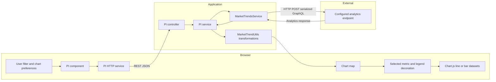

# PI analytics contracts and chart transformations

[Project context](../../project-context.md) | [Property Intelligence](index.md) | [Features](features-and-navigation.md)

**Confirmed source baseline:** `a6f611ae0`, 2026-09-25. Provider statistical semantics and deployed data availability remain **Unknown** unless explicitly represented by local code.

## Request and response shapes

The browser service uses the following methods under `/api/property-intelligence`:

| Method / suffix | Input | Output |
| --- | --- | --- |
| GET `geo-data` | None | `GeoData` (CBSA map/list and ZIP options) |
| POST `landing-page` | One geography filter | `Section[]`, selected by `templateCode` |
| POST `market-trends-charts` | `PropertyIntelligenceSearch` | Metric-keyed `Record<string,Chart>` |
| POST `listing-trends-charts` | Same | Same |
| POST `rental-trends-charts` | Same | Bedroom-keyed chart map |
| POST `hpi-trends-charts` | Same | HPI-name-keyed chart map |
| POST `hpi-forecast-trends-charts` | Same | Forecast-name-keyed chart map |
| POST `generate-chart-pdf` | Chart/PDF request | File-link map |
| POST `share-pdf` | Search plus chart selection | `Chart` |

These browser methods match explicit server `@PostMapping`/`@GetMapping`, not guessed HTTP verbs. Sources: `phoenix/src/app/property-intelligence/services/property-intelligence.service.ts:21-58`; `realist/web/src/main/java/com/facl/uaf/realist/rest/controller/PropertyIntelligenceController.java:32-83`.

Sanitized projections:

```typescript
{
  propertyIntelligenceSearchFilters: [{
    searchName: "Example area", county: "00000", state: "XX",
    cbsaCode: null, zipCode: null, yearRange: 1,
    isSelected: true, isActive: true
  }],
  // Optional, used by selected-chart/share requests:
  chartKey: "...", searchType: "..."
}
// One value in the returned chart map:
{
  labels: ["Example month"],
  propertyIntelligenceChartItems: [{
    title: "Example area", label: "Geography description",
    color: "#123456", verticalAxisId: "y", values: [123.0]
  }]
}
```

Contracts: `phoenix/src/app/property-intelligence/models/property-intelligence-filter.model.ts:1-13`, `property-intelligence-search.model.ts:3-7`; server assembly in `PropertyIntelligenceService.java:379-399`. Named comparison filters are persisted PI preferences, not property-search `Template` objects.

## Data flow and external boundary



The component subscribes directly to HTTP data after selecting filters from NgRx. It does not dispatch a generic chart-load effect. Java uses generated query/projection types and DGS `CustomGraphQLClient`; the client adapter calls `RestTemplate.exchange(..., POST, ...)` and parses `MarketTrendsResponse`. This is **outbound GraphQL**, while the application’s PI endpoints are REST.

Configuration key names are `market-trends.property-url`, `market-trends.county-lookup-url`, `market-trends.clip-url`, `market-trends.key`, and `market-trends.cbsa-label`; values are intentionally omitted. The client adds an `x-api-key` header. No downstream database or vendor ranking/aggregation algorithm is established here.

Evidence: `uaf-common/action/src/main/java/com/facl/uaf/common/shared/service/MarketTrendsService.java:125-240,484-489`; `uaf-common/action/src/main/java/com/facl/uaf/common/shared/configuration/MarketTrendsConfig.java:11-19`.

## Geography and period selection

Server preparation selects the most specific nonblank geography in this order: ZIP, county FIPS, CBSA, state. Provider filters use corresponding `AnalyticsGeographyType` values. Geographic options come from entitled counties and county lookup; eligible listing CBSAs are cached per group for 86,400 seconds.

Market/listing/rental query time ranges fetch extra history: unspecified/zero years becomes two years; otherwise the request is `yearRange + 1` years back. Visible market/listing/rental series are subsequently restricted to `yearRange * 12 + 1` points and reversed to display order.

HPI fetch preparation overrides its query range to 12 years and fetches both historical and forecast datasets. The provider historical filter requests the previous 12 years; forecast requests the current month through current year + requested years (12 after that override). Display limits are a later transformation, not the provider-fetch interval.

Evidence: `realist/web/src/main/java/com/facl/uaf/realist/rest/service/PropertyIntelligenceService.java:175-267,365-376,408-469,517-529,590-602`; `uaf-common/action/src/main/java/com/facl/uaf/common/shared/service/MarketTrendsService.java:421-480`; `realist/web/src/main/java/com/facl/uaf/realist/rest/service/MarketTrendUtils.java:1131-1169`.

## Transformations by family

### Landing summary

`getPropertyIntelligenceHome` fetches market and listing responses, calls `isMlsData`, calculates tax or listing values, adds corresponding gauges/charts, and adds `TMPL_REPORTS_MARKET_HEADER_DETAILS`. The frontend extracts its first paragraph’s period and checks for the new-construction-tax template code to identify tax-only layout.

Landing chart helpers take at most 13 points and reverse them. Listing summary calculations use recent versus prior three-month buckets from six records, then average over counties and three months. For example, the locally labelled average sale price reads `soldListings.listPriceMean`; the actual source field matters more than an intuitive interpretation of the UI label.

Evidence: `PropertyIntelligenceService.java:85-173`; `MarketTrendUtils.java:342-434`; `phoenix/src/app/property-intelligence/components/property-intelligence-home/property-intelligence-home.component.ts:57-69`.

### Market and listing detail

The service constructs one chart per configured metric. Each chosen area contributes a series titled by `searchName`, with a geography label, palette color, axis ID, and metric values. Labels are set when the chart is first created; later comparison series reuse those labels. There is no date-key join in this assembly, so verify returned periods when areas have different coverage.

Listing’s sales-price-versus-days chart adds **two** items per area: price on `y`, days on `y1`, with a shared color. Market/listing components additionally decorate price legends from county `isNondisclosure` and configured `legendText`.

Evidence: `PropertyIntelligenceService.java:342-405,558-647`; `MarketTrendUtils.java:678-697`; `phoenix/src/app/property-intelligence/components/property-intelligence-listing-trends-charts/property-intelligence-listing-trends-charts.component.ts:55-88,137-148`.

Representative exact mappings help distinguish product labels from source measures:

| Chart measure | Provider response field selected locally |
| --- | --- |
| Market total sales count / mean / median | `totalSales.salesCount / salesPriceMean / salesPriceMedian` |
| New construction count / mean / median | `newConstructionSales.salesCount / salesPriceMean / salesPriceMedian` |
| Transaction volume | `residentialMarketSales.salesPriceYearlyTotal` |
| Average price per square foot | `residentialMarketSales.salesPricePerSquareFootMean` |
| Median LTV | `equity.totalLtvMedian` |
| 90+ delinquency / preforeclosure / foreclosure | `foreclosure.ninetyDayPlusDelinquency / preForeclosureFilings / foreclosures` |
| REO / REO sales count | `reoSales.loanCount / salesCount` respectively |
| Loan count | Top-level `loanCount` |
| Resale / short-sale price | `resale.salesPriceMean` / `shortSales.salesPriceMean` (short-sale median also available) |
| Listing “sales-to-list price ratio” | `allListings.listPricePercentChangeMean` |
| Listing average sales price / sold activity | `soldListings.listPriceMean / inventoryCount` |
| Listing monthly supply | `activeListings.monthsSupply` |
| Listing days on market | Respective active/all/closed/pending/sold `domMean` (some also expose `domMedian`) |
| Buyer/seller indicator | `marketIndicator.buyerSellerMarketIndicatorMean / ...Median` |

The detail monthly-supply field differs from the landing summary's locally calculated active/sold ratio. Unknown metric keys fall through to `0.0`; do not interpret every plotted zero as a measured zero. Source: `MarketTrendUtils.java:805-915`. External definitions of these provider fields remain outside the local implementation.

### Rental

`setUpRentalTrendsChart` filters detail rows to `SINGLE_FAMILY_COMBINED`, takes `rentMean`, and groups values by bedroom count (null count maps to zero). It does not plot every returned rental field: the outbound projection also requests median rent and capitalization rates, but those are not the chosen values in this renderer’s backend transform.

Evidence: `MarketTrendUtils.java:514-530`; `MarketTrendsService.java:166-179`; `PropertyIntelligenceService.java:502-555`.

The frontend offers one-, two-, three-, and four-bedroom chart keys; a backend zero-bedroom group does not imply an exposed “zero bedrooms” tab (`phoenix/src/app/property-intelligence/constants/property-intelligence.constants.ts:292-309`).

### HPI and forecasts: important label/arithmetic distinction

The local transform chooses the `SINGLE_FAMILY_COMBINED_DISTRESSED_EXCLUDED_CODE` tier. For successive qualifying records, it computes:

```text
(current index - previous index) * 100 / previous index
```

with four-decimal HALF_UP division. A missing current value or a previous value equal to `BigDecimal.ZERO` leaves the computed change at zero. That equality is scale-sensitive: it is not a reliable guard for every representation of zero. It populates both “Year Change” and the range-limited “Month Change” lists from this **same adjacent-record calculation**. Historical lists are reversed afterward; forecast input is reversed before transformation.

**Confirmed discrepancy:** the frontend says “Year Over Year Change,” but the inspected loops do not compare against an index 12 months earlier. Do not document a conventional year-over-year formula as current behavior. **Unknown:** intended product interpretation/provider ordering; the analytics owner should reconcile labels, time spacing, and formula before relying on the chart as a validated annual-change measure.

Evidence: `MarketTrendUtils.java:437-511`; `PropertyIntelligenceService.java:408-499`; `phoenix/src/app/property-intelligence/components/property-intelligence-hpi/property-intelligence-hpi.component.ts:164-174`.

Label helpers track the preceding qualifying record's `yearMonth` alongside the prior index value. Historical labels are reversed; forecast labels are not. They are not independently joined to values by date, making provider ordering particularly important (`MarketTrendUtils.java:726-789`).

## Final browser chart transformation

`LineChartComponent.getChartSetUp` turns `labels` into thinned axis labels through `ChartService.skipLabels`, preserves `actualLabels`, and maps each PI item to a dataset: `title → label`, `values → data`, `color → borderColor`, `verticalAxisId → yAxisID`. Secondary-axis lines are dashed. The bar renderer has its own equivalent dataset setup.

Evidence: `phoenix/src/app/reports/shared/components/charts/line-chart/line-chart.component.ts:96-116`; `phoenix/src/app/reports/shared/components/charts/vbar-chart/vbar-chart.component.ts:138-152`.

## Limits, loading, no data, and errors

| Condition | Actual behavior |
| --- | --- |
| More than four/empty filters, market or listing | Service returns an empty map; `PI_SEARCH_LIMIT=4` |
| No listing coverage, invalid geography, or no listing rows | Adds title-only items to every listing chart; line legend says “Selected county has no data” when label is absent |
| No market/rental/HPI series | Most branches skip the series rather than synthesize a listing-style placeholder |
| No `chartData` | Family template omits the chart child; this is not necessarily an explicit error state |
| Provider/client exception | Java client logs and returns null, not a guaranteed failed future or uniform no-data response |
| Preference update/loading | Preference effect uses spinner wrapping; ordinary chart subscriptions do not have matching local catch/error UI |

Evidence: `uaf-reports/action/src/main/java/com/facl/uaf/report/util/PropertyIntelligenceConstants.java:11`; `PropertyIntelligenceService.java:346-362,408-555,562-664`; `MarketTrendsService.java:152-164,230-243`; `phoenix/src/app/reports/shared/components/charts/line-chart/line-chart.component.html:8-25`.

**Source caveats:** several paths assume first response/analytics entries exist. Landing `prepareMarkets`/`prepareListings` call `.get(0)` and the UI assumes a header section. Null-returning provider calls can break `CompletableFuture` composition. Returned futures are already completed after synchronous HTTP in the inspected client; do not claim the `allOf`/`anyOf` syntax proves parallel network requests. HPI/rental methods do not repeat market/listing’s explicit four-filter guard.

## Debugging, tests, and remaining questions

Trace selected geography/years → provider filter → raw period order → transformed metric arrays → map key → dataset axis/legend. Compare lengths and periods across areas before assuming the renderer is wrong. Separate provider errors from deliberately empty listing items. Never attach actual API keys or customer geography/search payloads to documentation.

Inspected test example: `phoenix/src/app/property-intelligence/components/property-intelligence-hpi/property-intelligence-hpi.component.spec.ts:5-23` is a component-creation test, not a verified metric calculation test. No tests were executed. Remaining external questions: provider data order/completeness, metric definitions, membership/coverage configuration, and the HPI annual-change discrepancy.

Related: [external integrations](../../cross-cutting/external-integrations.md), [uaf-common](../../backend/modules/uaf-common.md), [web host](../../backend/modules/realist-web.md), [PDF lifecycle](../../feature-flows/pdf-generation-and-download.md).
