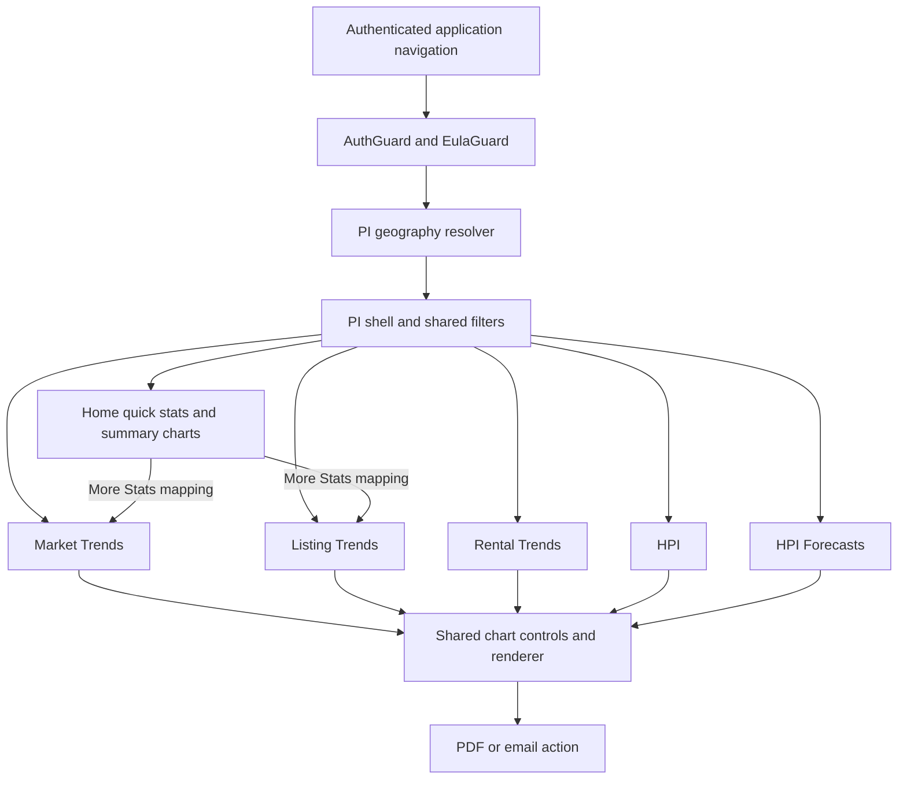

# PI features, navigation, and access conditions

[Project context](../../project-context.md) | [Property Intelligence](index.md)

**Confirmed:** `a6f611ae0`, 2026-09-25.

## Entry and composition

The root `property-intelligence` route is lazy-loaded with `AuthGuard` and `EulaGuard`; `PropertyIntelligenceResolver` dispatches `GetGeoData` and waits for truthy geographic data. The child module redirects its empty path to `home`. The root route shown here does not add a PI-specific flag guard.

The diagram separates the landing summary from detailed families. Listing-tab visibility is conditional; an arrow here means a declared route, not universal entitlement. Evidence: `phoenix/src/app/app-routing.module.ts:44-51`; `phoenix/src/app/property-intelligence/property-intelligence-routing.module.ts:11-46`; `resolvers/property-intelligence.resolver.ts:18-24`; `constants/property-intelligence.constants.ts:20-85` within the PI directory.

## Feature catalogue

All paths below are under `/property-intelligence/`. Detailed chart metadata lives in `phoenix/src/app/property-intelligence/constants/property-intelligence.constants.ts`, not in the router.

| Child path | Purpose / metrics | Browser component |
| --- | --- | --- |
| `home` | Latest-period quick stats, average sale price, change in sales activity, MLS price/days comparison; tax versus MLS content differs | `PropertyIntelligenceHomeComponent` |
| `market-trends` | Tax sale mean/median/count, new construction, resale, volume, loans/LTV, delinquency, foreclosure/REO/short-sale metrics | `PropertyIntelligenceMarketTrendsComponent` with `PropertyIntelligenceMarketTrendsChartsComponent` |
| `listing-trends` | MLS inventory, days on market, supply, price measures, pending/sold/active series, price-versus-days dual axis | `PropertyIntelligenceListingTrendsComponent` with `PropertyIntelligenceListingTrendsChartsComponent` |
| `rental-trends` | Rental averages grouped by bedroom count | `PropertyIntelligenceRentalTrendsComponent` |
| `hpi` | Historical index change charts labelled month-over-month and year-over-year | `PropertyIntelligenceHpiComponent` |
| `hpi-forecasts` | Corresponding forward-looking index-change charts | `PropertyIntelligenceHpifComponent` |

LTV means loan-to-value, DOM means days on market, and REO means real-estate-owned. Do not treat index-change values as sale prices. The [data-flow page](analytics-and-data-flow.md) distinguishes the HPI UI labels from the implemented arithmetic.

## Filters and periods

The shared filter form has State, Metro, County, and ZIP dropdowns. Their choices cascade through entitled states/counties and the resolver’s CBSA/ZIP map. The Apply button uses `isFilterEmpty`, not `filtersForm.valid`: although each control declares `required`, any chosen supported geography can enable Apply.

Home uses the first filter. Detailed pages support named comparisons; Add Search is disabled when the list length equals four and the first comparison cannot be deleted through the template. `isActive` identifies the edited filter, while `isSelected` controls whether it contributes a plotted series. They are not interchangeable.

The shared chart shell offers 1, 2, or 3 years and “Searches displayed.” Changing the period updates all stored filters; chart requests send selected filters only. HPI year-over-year tabs hide the period selector and label the chart “Last 10 years”; forecast equivalents say “Next 10 years.” Those display labels do not prove how the provider or backend computes an annual change.

Evidence: `phoenix/src/app/property-intelligence/components/property-intelligence-filters/property-intelligence-filters.component.ts:50-110,143-280`; corresponding `.html:5-35`; `components/property-intelligence-chart/property-intelligence-chart.component.ts:82-123`; `components/property-intelligence-hpi/property-intelligence-hpi.component.ts:164-174`; `components/property-intelligence-hpif/property-intelligence-hpif.component.ts:168-178`.

## State, navigation, and sharing

Chart components use user-state filter/selection selectors but fetch chart data **directly through the PI service**, not a dedicated PI chart NgRx effect. `switchMap` replaces outstanding filter-driven subscriptions. Selected metric/type is stored using `UpdatePropIntelChartSelections`; `shouldNotFetchData` retains filter-array identity to avoid unnecessary data refetching. Preference persistence uses `PUT /api/property-intelligence-pref`.

Market/listing charts default to a sorted metric and line view. Rental/HPI/forecast use their configured list and remembered selection. Chart controls switch renderer; shared chart markup only instantiates a chart when `chartData` exists. Share actions prepare chart/legend data and dispatch report actions for PDF or email; standalone shell sharing uses a separate modal.

Evidence: `phoenix/src/app/store/user/user.effects.ts:112-154`; `phoenix/src/app/property-intelligence/services/property-intelligence.service.ts:49-62`; `components/property-intelligence-market-trends-charts/property-intelligence-market-trends-charts.component.ts:51-129,132-170`; corresponding `.html:1-25`; `components/property-intelligence/property-intelligence.component.ts:89-114`.

## Access, coverage, and empty states are separate

- `propertyIntelligenceDashboardEnabled` and `isPinMember` are login/user flags (`phoenix/src/app/store/user/user.selector.ts:200-206`). The shell removes **Listing Trends** from its tab list for non-PIN users; no expansion of the internal PIN term is assumed.
- Server `MarketTrendUtils.isMlsData` checks the authenticated group’s PIN membership and county coverage, cached CBSA membership, or excluded-state rules. A visible tab is not evidence that every selected geography has listing data.
- Price-chart legends can be highlighted for `Region.isNondisclosure`; the frontend does not simply discard those series. Legends may say estimated sales price.
- Home chooses tax/MLS section codes and hides its home chart when tax-only. The page has no explicit error/empty panel in its own template; it relies on returned sections and child renderers.
- The geography resolver has no failure alternative in its own code. If no truthy geography reaches state, its condition is never satisfied. Inspect the geography effect before assuming the route loaded successfully.

Evidence: `components/property-intelligence/property-intelligence.component.ts:42-49`; `realist/web/src/main/java/com/facl/uaf/realist/rest/service/MarketTrendUtils.java:1097-1169`; `components/property-intelligence-market-trends-charts/property-intelligence-market-trends-charts.component.ts:71-83`; `components/property-intelligence-home/property-intelligence-home.component.ts:34-70` and `.html:1-23`.

## Debugging and related reading

For missing navigation compare login flags with tab filtering and root guards. For wrong comparisons inspect `searchName`, `isSelected`, saved `yearRange`, and the actual REST payload. For a wrong chart compare the constant’s **key** to the server map key, not just its label. For a blank page inspect missing chart/section data and HTTP errors separately.

See [analytics and transformations](analytics-and-data-flow.md), [configuration/flags](../../cross-cutting/configuration-and-feature-flags.md), [PDF lifecycle](../../feature-flows/pdf-generation-and-download.md), and [report catalogue](../reports/report-catalogue.md). **Unknown:** deployed membership/flags and actual provider geographic coverage.
