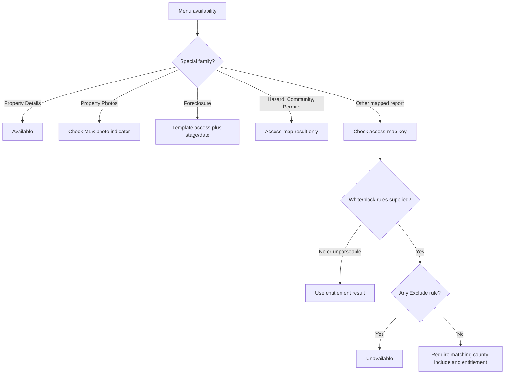
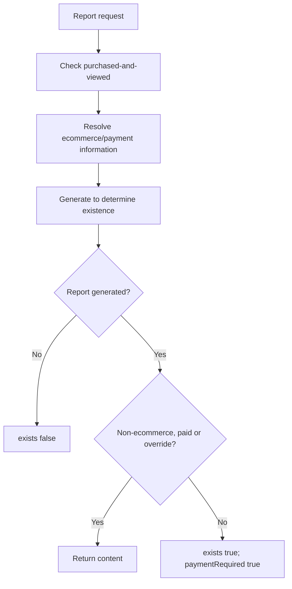
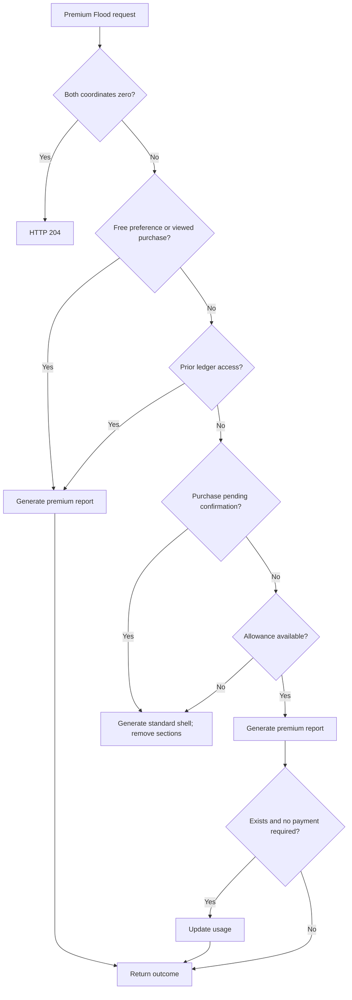
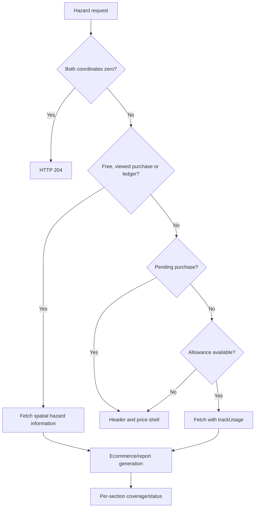
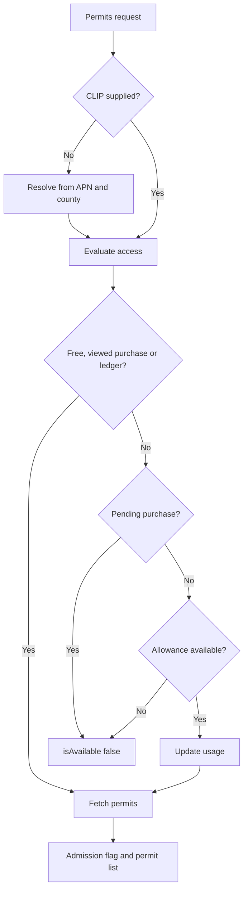
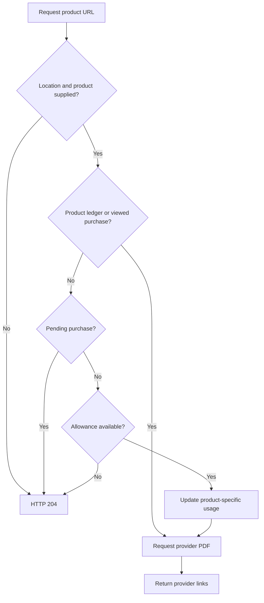

# Report availability and access rules

[Project context](../../project-context.md) · [Reports](index.md) · [Catalogue](report-catalogue.md) · [Authentication](../../cross-cutting/authentication-and-authorization.md)

## Independent questions, not one boolean

**Confirmed baseline:** `RP-10188` / `a6f611ae0`, 2026-09-25. Availability combines route exposure, runtime feature/MLS configuration, user entitlement, geography/property coverage, payment/unlock and provider results. A menu item, guard success, purchase or `exists` flag cannot substitute for all of them.

Source abbreviations, repository-relative:

- `F` = `phoenix\src\app`; `RC` = `F\reports\components`
- `W` = `realist\web\src\main\java\com\facl\uaf\realist`
- `R` = `uaf-reports\action\src\main\java\com\facl\uaf\report`

In the matrix, `Controller` means `W\rest\controller\ReportController.java`; report services are under `W\rest\service\report`; component paths are identified in the [catalogue](report-catalogue.md#routecomponent-comparison).

## Browser controls

### Login access map

Login obtains template/preference access through `PreferenceAction.getHasAccessForTemplatesAndPreferenceGroups`; Angular reads `userInfo.hasAccessMap[code]`. Community Insights additionally defaults enabled at login unless its returned preference explicitly supplies a different value.

Evidence: `W\rest\service\LoginService.java:665–681,1069–1089`; `uaf-preference\action\src\main\java\com\facl\uaf\preference\action\PreferenceAction.java:961–969`; `F\store\user\user.selector.ts:57–60`.

**Unknown:** deployed values and external preference implementation. A preference consumer proves configurability, not effective availability in an MLS or environment.

### Route guard

`ReportsGuard`:

1. Allows navigation carrying `fromRedirect`.
2. Allows routes without `data.reportCode`.
3. Otherwise waits for login completion.
4. Allows normal access or Direct-to-Agent access where the route explicitly permits it.

Premium Flood, Hazard and Permits set `allowDirectToAgent: true`. Community Insights uses the guard but its report-code data is commented out, so the guard allows it. Property Details has no child `ReportsGuard`; parent auth/EULA guards still apply.

Evidence: `F\shared\guards\reports.guard.ts:19–39`; `F\reports\reports-router.module.ts:23–149`; `F\app-routing.module.ts:68–73`.

### Menu availability

`ReportsPermissionsService` is a different decision:

- Property Details: always available.
- Property Photos: `MLS_PHOTO_IND === YES`.
- Foreclosure: template access plus stage/date rules.
- Hazard, Community Insights, Permits: access-map lookup.
- Other mapped families: access map plus white/black-list rules.

**Exact behavior:** `applyWhiteBlackListingRules` returns false if **any** rule has type `Exclude`, without first matching its county. Otherwise, a supplied rule list requires a matching county `Include`. Missing/unparseable rules fall through to true. Do not describe this as conventional matched-county deny-list logic.

Evidence: `F\reports\services\reports-permissions.service.ts:16–95`; `F\shared\utils\report-utils.ts:33–59`.

## Per-report availability matrix

**Legend:** `A(key)` = runtime access-map entry; `W(key)` = corresponding `PG_REPORTS_WHITE_BLACK_LISTING` rule. Ecommerce means server `EcommerceService.checkEcommerceForReport`, not merely a cart button. “No explicit handler check” means no such predicate in the cited path, **not** proof that all application/provider authorization is absent. Matrix rows describe confirmed source behavior; effective external configuration remains unknown.

| Report | Feature flag / MLS condition | User entitlement | Property / data condition | Purchase / credit requirement | Unavailable UI behavior | Backend enforcement | Evidence |
|---|---|---|---|---|---|---|---|
| Property Details | Runtime templates/preferences; not one feature flag | No child report guard; parent auth/EULA | Property lookup returns records | No purchase branch in handler | Failure report; actions disabled | Action validates key/template/preferences; no records means no report | Controller `169–176`; `R\action\ReportAction.java:319–368,417–449` |
| Comparables | W(`PREF_REPORTS_COMPARABLES_WHITE_BLACK_LISTING`) | A(`PG_REPORTS_COMPARABLE`) | Subject/candidates; selected properties needed | No explicit purchase branch | Empty report / disabled Generate | Criteria and report services; no mirrored menu predicate in handler | Controller `251–301`; Comparables HTML `15–58` |
| Comparable Details | Same family as Comparables | Same route entitlement | Selected IDs plus saved subject context | Same as Comparables | Generated-view error | `ComparablesService` generation; separate selected-detail operation | `ComparablesService.java:219–232`; Controller `287–301` |
| Neighbors | W(`PREF_REPORTS_NEIGHBORS_WHITE_BLACK_LISTING`) | A(`PREF_REPORTS_NEIGHBOR`) | Subject and neighbor results | No explicit purchase branch | Empty-neighbors component | XML/result handling; provider entitlement unknown | Controller `201–223`; Neighbors HTML `93–95` |
| Neighborhood Profile | W(`PREF_REPORTS_NEIGHBORHOOD_WHITE_BLACK_LISTING`) | A(`PREF_REPORTS_NEIGHBOURHOOD_PROFILE`) | Geographic/demographic response | No explicit purchase branch | Report error state | XML+demographics service; no explicit menu mirror | `NeighborhoodProfileService.java:136–157` |
| Assessor Map | W(`PREF_REPORTS_ASSESSOR_MAP_WHITE_BLACK_LISTING`) | Menu A(`PG_REPORTS_ASSESSOR_MAP`); route A(`TMPL_REPORTS_ASSESSORMAP`) | Map ID/sheet count/results; object may have no links | Ecommerce; purchased-and-viewed override | Cart/view/no-report; empty links possible | `getOCCReport` payment decision; file serving is separate | Controller `304–310`; `W\rest\service\AssessorMapService.java:214–275` |
| Zoning Map | W(`PREF_REPORTS_ZONING_WHITE_BLACK_LISTING`) | A(`TMPL_REPORTS_ZONINGMAP_DETAIL`) | Township/APN/FIPS; positive sheet count | No explicit payment path in handler | Null/error/no links | Provider sheet count; file handler differs from metadata | `W\rest\service\ZoningMapService.java:33–77` |
| Standard Flood | W(`PREF_REPORTS_FLOOD_MAP_WHITE_BLACK_LISTING`) | A(`PG_REPORTS_FLOOD_MAP`) | Both coordinates zero → 204; provider/map status | Ecommerce; not universally free | Location ribbon; rate-limit timer | `getReport(FLOODMAP)` may return payment-required | Controller `407–419`; `F\store\reports\reports.effects.ts:1215–1234` |
| Premium Flood | W(`PREF_REPORTS_PREMIUM_FLOODMAP_WHITE_BLACK_LISTING`); free-report preference | A(`PG_REPORTS_PREMIUM_FLOODMAP`) or route D2A allowance | Coordinates; generated report exists | Free/viewed purchase/ledger/MLS allowance or D2A unlock | Redeem/offer/cart/view; stripped sections when not admitted | Ordered checks then ecommerce generation; usage conditional on success | Controller `322–404`; Premium Flood TS `620–698` |
| Foreclosure | `PG_HIDE_FORECLOSURE_FLAGS`; stage/date display rules | Menu A(`TMPL_REPORTS_FORECLOSURE`); route A(`PG_REPORTS_FORECLOSURE`) | Stage/date; generation/probe results | Ecommerce; purchased-and-viewed override | Hidden/unavailable navigation; purchase/no-report | Payment/generator checks; preference-driven section filtering | Controller `313–319,853–855`; `ForeclosureService.java:92–113`; `F\shared\utils\report-utils.ts:63–145` |
| Market Trends | W(`PREF_REPORTS_MARKET_TRENDS_WHITE_BLACK_LISTING`); geography/non-disclosure presentation | A(`PREF_REPORTS_MARKET_TRENDS`) | ZIP/geographic analytics; selected month | No explicit purchase branch | Gauges-only fallback or error | Analytics service; no explicit access-map predicate in handler | Controller `561–563`; `SdpMarketTrendsService.java:134–161` |
| Building Sketch | W(`PREF_REPORTS_BUILDING_SKETCH_WHITE_BLACK_LISTING`) | A(`PG_REPORTS_BUILDING_SKETCH`) | Existing sketch/XML; dimensions validation | Ecommerce; purchased-and-viewed override | Purchase/no-report; data-no-longer-updated warning | Validation and generator/probe | Controller `422–429,848–850`; `BuildingSketchService.java:45–86` |
| Hazard | Runtime access; `PREF_REPORT_HAZARD_FREE` | A(`PG_REPORTS_HAZARD`) or route D2A allowance | Coordinates; per-section coverage | Free/viewed purchase/ledger/MLS allowance or D2A | Redeem/upgrade offer; individual unavailable tabs | Controller admission then ecommerce; usage inside report service | Controller `575–659`; `HazardService.java:115–129` |
| Community Insights `REST` | Login preference override; runtime offer list | Menu A(`PG_REPORTS_COMMUNITY_INSIGHTS`); guard has no code | Address/coordinates and provider PDF | Product-specific purchase/ledger/allowance/unlock | Offer/redeem/no URL | URL handler checks first product; pending/no allowance → 204; PDF handler differs | Controller `662–743` |
| Community Insights `ECDEM` | Same family, separately offered product | Same family access behavior | Same provider boundary | Independent product ledger/allowance | Product-specific unavailable state | Same URL handler; distinct product ledger key | Controller `688–743`; status service `121–147` |
| Community Insights `SCHOOL` | Same family, separately offered product | Same family access behavior | Same provider boundary | Independent product ledger/allowance | Product-specific unavailable state | Same URL handler; distinct product ledger key | Controller `688–743`; status service `121–147` |
| Community Insights `TRFO` | Same family, separately offered product | Same family access behavior | Same provider boundary | Independent product ledger/allowance | Product-specific unavailable state | Same URL handler; distinct product ledger key | Controller `688–743`; status service `121–147` |
| Building Permits | `PREF_REPORT_BUILDING_PERMITS_FREE`; runtime access | A(`PG_REPORTS_BUILDING_PERMITS`) or route D2A allowance | CLIP or APN/county resolution; provider list | Free/viewed purchase/ledger/MLS allowance or D2A | Offer/report/redeem | Returns admission `isAvailable`; coverage only checks non-null list; usage may precede fetch | Controller `746–837` |

Common browser evidence: `F\reports\reports-router.module.ts:23–149`; `F\reports\services\reports-permissions.service.ts:16–95`. Status service above is `W\rest\service\ecommerce\PropertyReportStatusService.java`.

### Extra types and embedded sections

| Type(s) | Feature / entitlement | Data / payment / unavailable behavior | Server boundary and evidence |
|---|---|---|---|
| `PROPERTY_PHOTOS` | Browser photo indicator; no new report-router entitlement | Photo data needed; not a separate purchase ladder | Dashboard PDF handler; `W\rest\controller\PdfDashboardController.java:90–97`; permissions service `16–95` |
| `TABLE`, `CARD`, `MAP_TABLE`, `MAP`, `MAP_IMAGE` | Search-output operations; not report tabs | Search/property fields or captured map; output generation errors/cache expiry, not premium admission | Dashboard handlers and download services; `PdfDashboardController.java:39–89`; `F\search\services\search-download.service.ts:13–55` |
| `CUSTOMIZED` | Previously prepared constituent reports; no universal new grant | Cache keys needed; missing/expired constituents matter | Loads models and renders combined PDF; `W\rest\service\report\CustomizedReportService.java:49–76` |
| `PROPERTY_DETAILS_CONDENSED` | Direct-property entitlement and direct-session validation | Property records; same template data; display variant | `DirectReportValidator.java:81–109,144–165`; direct HTML mapping below |
| `DIRECT_COMPARABLES`, `DIRECT_NEIGHBORHOOD_PROFILE`, `DIRECT_PREMIUM_FLOODMAP`, `DIRECT_HAZARD` | Direct feature codes, session/access output; returned county validation in standalone flow | Ordinary family data and family-specific purchase/usage; validation/error or limited shell | Direct validator/controller/service; details below |
| `DIRECT_FLOODMAP` | Application display only; login checks `PG_REPORTS_FLOOD_MAP_CONFIG` | Standard/premium selection based on free/purchase/allowance/history | No dedicated feature-code branch in direct validator; login separately checks access |
| PI enums and `PROPERTY_INTELLIGENCE_CHART` | Separate Property Intelligence rules; not inherited from this matrix | Geography/period/chart data; exact family rules owned by PI chapter | [PI feature/access documentation](../property-intelligence/features-and-navigation.md); `W\rest\model\report\ReportType.java:41–46,65` |
| Embedded Community Insights, permits, AI summary, `FLASH_FLOOD_RISK` | Containing report and section-specific behavior | Section presence does not authorize the separately named premium route | Property body/template and family services; [catalogue](report-catalogue.md) |

## Distinct decision families

### Template/geography navigation

This is **browser navigation**, not server authorization. Evidence: permissions service `16–95`; `report-utils.ts:33–145`.

### Ecommerce: Assessor, Foreclosure, Building Sketch

Source: `W\rest\service\ecommerce\EcommerceReportsService.java:69–104`. Assessor's generator can return an object without map links; object existence is not usable-sheet coverage.

### Premium Flood

Source: Controller `322–404`. The corresponding PDF handler has different usage/error behavior; see [PDF enforcement](../../feature-flows/pdf-generation-and-download.md#important-enforcement-differences).

### Hazard

Usage occurs **inside `HazardService` when XML exists and `trackUsage` is set**, not at Premium Flood's controller-side `exists/paymentRequired` condition. Sources: Controller `575–659`; `HazardService.java:115–129`.

### Building Permits

The allowance branch updates usage **before fetching permits**. Admission can be true with an empty list. Source: Controller `746–820`.

### Community Insights product download

Source: Controller `688–743`. **Exception:** `/community-insights-pdf` calls the provider and attaches usage/free flags without the same ordered ladder as `/community-insights-url`. Product-list input must not imply that all supplied products receive identical checks: the URL handler examines the first product.

## Status, eligibility and unlock are different

| Operation | Meaning |
|---|---|
| GET `/api/reports/usage-summary` | Read summary; no generation |
| GET `/api/reports/property-status?apn=…` | Feature locked/unlocked; Community Insights may be partial |
| GET `/api/reports/property-status/mls-credit?apn=…` | Whether expected products are consumed/free |
| GET `/api/reports/eligible-for-free-credit` | Whether a **new** MLS allowance consumption is eligible |
| POST `/api/reports/direct-to-agent/unlock` | Explicit D2A unlock |

Eligibility false may mean already purchased/free/consumed, not simply denied. Status uses `isReportPurchased`, whereas report handlers often require `isProductPurchasedAndViewed` and distinguish pending confirmation.

`PropertyReportStatusService.unlockDirectToAgentReport` checks fields, session user, supported product, prior access, active subscription and remaining credits. It returns structured failure reasons. The controller returns 400 for missing feature/APN and 409 for other unsuccessful outcomes.

Evidence: Controller `840–903`; `W\rest\service\ReportService.java:520–565`; `W\rest\service\ecommerce\PropertyReportStatusService.java:156–226`. See [commerce/credits](../../feature-flows/cart-checkout-and-report-credits.md).

## Direct entry is not ordinary router authorization

`W\controller\DirectReportController.java:211–255,364–380` requires session user/access output; when a SecureLink token is present, expiry validation can clear the security context. `W\service\validation\DirectReportValidator.java:81–109,144–165` checks direct feature codes and standalone returned-county access. Condensed uses ordinary direct-property entitlement.

Standard direct flood has no dedicated feature-code branch in that validator. `W\controller\LoginController.java:780–793` separately checks `PG_REPORTS_FLOOD_MAP_CONFIG`; display is restricted to application (`DirectReportValidator.java:54–57`).

`/api/reports/direct-link` returns/removes a session handoff object without another report-specific predicate (`W\rest\controller\DirectApiReportController.java:39–49`). It is not a regeneration endpoint. The catalogue records the direct-hazard application fallback and condensed display/key mismatch; direct types cannot inherit ordinary route checks merely by sharing a title.

## Map-file serving is a separate boundary

| Boundary | Confirmed checks and behavior | Do not infer |
|---|---|---|
| Assessor metadata `/api/reports/assessor-map` | Authenticated API plus ecommerce handler | Metadata payment checks automatically protect each returned URL |
| `/assessor-map-viewer` | GET HTML viewer; parameters map APN/county/APN/sheet | No dedicated authenticated matcher in inspected security rules; effective rendering/auth outcome unknown |
| `/parcelmapviewer/*` | Security matcher authenticated; servlet also checks non-null `UAFUserInfo`, fetches/validates TIFF and serves attachment with `nosniff` | No explicit purchase/report-feature/county recheck in servlet |
| `/zoningMap` | Unrestricted method mapping; reads township/page/APN, calls session-Passport-dependent report action and provider, streams TIFF | Session lookup is not a deliberate authorization check; no explicit handler denial/recheck |

Assessor missing-user branch writes “session invalidated” XML without explicitly setting 401/403. Zoning's file handler does not show Assessor's structural TIFF validation. `/zoningMap` and assessor viewer fall through the inspected security matchers; anonymous runtime success/failure and provider enforcement remain **Unknown**, not demonstrated vulnerabilities.

Sources: `W\rest\controller\AssessorMapViewerController.java:20–31`; `R\configuration\ParcelMapViewerConfiguration.java:20–26`; `R\util\ParcelMapViewerServlet.java:80–173,206–221`; `R\util\ZoningMapController.java:36–68`; `R\action\ReportAction.java:4551–4574`; `W\rest\security\configuration\MultipleLoginSecurityConfig.java:210–221,337–348`.

## Authentication versus report entitlement

The security configuration contains authenticated `/api/**` rules, but **matcher order/profile matters**: an earlier static-extension matcher permits matching resources. Do not summarize all report-related URLs as unconditionally protected by `/api/**`, especially generated file links.

Evidence: `W\rest\security\configuration\MultipleLoginSecurityConfig.java:108–113,140,171–221,272,336–348`. See [authentication/authorization](../../cross-cutting/authentication-and-authorization.md). Inspected report handlers do not universally re-evaluate browser white/black-list rules.

## Existing tests and follow-up boundaries

Existing source, **not executed**:

- `F\shared\guards\reports.guard.spec.ts:36–101`: no-code, redirect, entitlement, D2A and login wait.
- `RC\premium-flood-map-report\premium-flood-map-report.component.spec.ts:94–140`: MLS versus D2A state.
- `realist\web\src\test\java\com\facl\uaf\realist\rest\controller\ReportControllerBuildingPermitsClipTest.java:73–101`: supplied CLIP versus resolution.

Source-backed priorities for future authorized testing: menu/guard disagreement; purchased-not-viewed versus ledger; empty provider result before/after debit; partial Community Insights products; direct/API/PDF admission differences; map-file authentication and returned-content validation.

**Unknown external boundaries:** deployed configuration, actual remaining credits/prices, provider coverage and downstream entitlement/quota atomicity. No change or exploit is claimed by documenting these contract differences.
