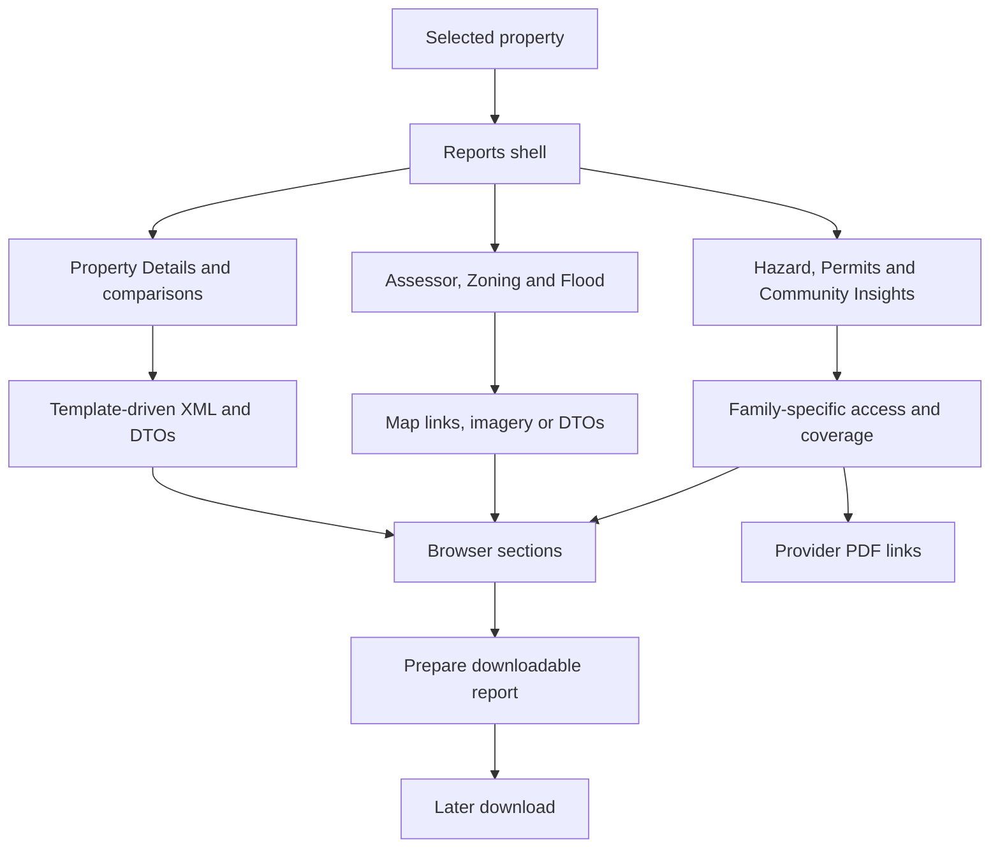

# Reports: orientation and reading guide

[Project context](../../project-context.md) · [Frontend](../index.md) · [Feature flows](../../feature-flows/index.md)

## Purpose

Reports turn a selected property into property facts, comparable-property analysis, neighborhood information, maps, risk information and purchasable data products. They **do not share one universal availability check or rendering pipeline**.

**Baseline:** `RP-10188`, revision `a6f611ae0`, researched/written 2026-09-25. These pages consolidate the supplied current-source research with targeted contract checks. **Confirmed** means supported by the cited source; **Inferred** identifies an interpretation; **Unknown** marks an external boundary or unverified behavior. No application changes, builds, tests, installations, network calls or services were performed.

## Concepts to know first

- **Subject property:** the property being investigated; several related reports reuse its server-session representation.
- **APN:** assessor parcel number, frequently used for purchase/status calls.
- **FIPS:** the geographic/county code carried as `fipsCode`, `countyFipsCode` or `countyId`, depending on the contract.
- **CLIP:** another property identifier; Building Permits uses it directly or resolves it from APN and county. Its expansion is not established here.
- **MLS:** multiple listing service; MLS/user preferences can change templates, entitlements and allowance behavior.
- **Template:** runtime metadata describing report fields/sections, distinct from Angular HTML and server PDF templates.
- **Entitlement:** permission to access a preference group/template/feature.
- **Credit:** an allowance consumed through a particular mechanism. MLS allowances and Direct-to-Agent (D2A) package credits are not interchangeable.
- **DTO:** data-transfer object returned to the browser.

### Source-reference conventions

The detailed pages define their own abbreviations. Here, repository-relative Windows paths use:

- `F` = `phoenix\src\app`
- `W` = `realist\web\src\main\java\com\facl\uaf\realist`
- `R` = `uaf-reports\action\src\main\java\com\facl\uaf\report`
- `C` = `uaf-common\action\src\main\java\com\facl\uaf\common`

## Where the feature lives

| Layer | Responsibility | Source |
|---|---|---|
| Application routing | Reports beneath `/reports`; parent `AuthGuard` and `EulaGuard` | `F\app-routing.module.ts:68–73`; `F\root-routes.ts:10` |
| Report routing | Shell, direct-link resolver, 14 child report routes | `F\reports\reports-router.module.ts:9–150` |
| Report shell | Navigation, availability observables, premium badges | `F\reports\components\reports\reports.component.ts:747–849,1046–1109` |
| Browser contracts | Fetch, PDF preparation, coverage/status/unlock | `F\reports\services\reports.service.ts:44–48,83–407,597–642` |
| Browser state | Actions/effects/reducers/selectors | `F\store\reports\reports.effects.ts:246–259`; `reports.reducer.ts:251–305` in the same directory |
| HTTP host | Report and PDF handlers | `W\rest\controller\ReportController.java:169–903`; `PdfReportController.java:114–254` in the same directory |
| In-process report library | Retrieval coordination, template-driven XML, usage | `R\action\ReportAction.java:307–543,982–1109` |
| PDF boundary | Cached models → local HTML → remote rendering | `W\service\reports\pdf\template_service\PropertyDetailPdfService.java:34–57`; `W\service\reports\pdf\PdfClient.java:29–74` |

## Feature families

The diagram deliberately does not force map files, Building Permits or Community Insights through the Property Details XML path. Evidence: `W\rest\controller\ReportController.java:468–492,662–837`; `W\rest\service\report\PropertyDetailsService.java:128–157`.

## Reading paths

| Page | What it owns |
|---|---|
| [Report catalogue](report-catalogue.md) | All discovered report identities, active routes, stages, variants, contracts, visible content and actions |
| [Availability and access](availability-and-access-rules.md) | Per-report matrix; menu versus guard versus data/payment/server enforcement |
| [Rendering and actions](report-rendering-and-actions.md) | State, section rendering, command bindings and visible outcomes |
| [Property Details and related reports](../../feature-flows/property-details-and-reports.md) | Browser → remote property data → XML → DTO, then Comparables |
| [PDF generation and download](../../feature-flows/pdf-generation-and-download.md) | Prepare/link/cache/download, local HTML and remote renderer |
| [Exports, labels and postcards](../../feature-flows/exports-and-mailing-labels.md) | Data re-fetch, formatting, usage, cache and download/handoff |

Related ownership: [report backend module](../../backend/modules/uaf-reports.md), [cart/checkout/credits](../../feature-flows/cart-checkout-and-report-credits.md), [shared links](../../feature-flows/shared-report-links.md), [Property Intelligence](../property-intelligence/index.md), [search results and actions](../search/results-grid-map-and-actions.md), [authentication](../../cross-cutting/authentication-and-authorization.md).

## Important distinctions

- Fourteen active report routes; Comparable Details is a stage within Comparables. `new-market-trends` is a constant, not a registered report route.
- Community Insights is labelled **Premium Neighborhood Reports** and contains four separately tracked products. It and Building Permits also appear as embedded Property Details sections.
- A visible menu item is not authorization. `ReportsGuard` does not check property coverage or payment; Community Insights has no active guard report code.
- Standard Flood can enter ecommerce logic. Do not call it universally free.
- Premium Flood route `flood-map-premium`, server type `FLOOD_MAP_PREMIUM`, feature `FCFLDPREM` and product `FMK` are different identifiers.
- Ordinary PDF preparation usually caches models; customized preparation renders and caches bytes. Assessor/Zoning use map files; Community Insights uses provider PDF URLs.
- Java `LocalStorage` is Redis-backed, not browser storage. Passing a session ID does not automatically scope its supplied cache keys.
- Building Sketch warns that existing data is no longer updated.

Sources: `F\shared\guards\reports.guard.ts:19–39`; `F\reports\reports-router.module.ts:85–149`; `W\rest\model\report\ReportType.java:19–65`; `C\shared\util\LocalStorage.java:37–77`; `F\reports\components\building-sketch-report\building-sketch-report.component.html:1–54`.

## Boundaries and related caveats

**Unknown:** effective deployed MLS preferences, candidate limits, prices, provider coverage, cache TTL and downstream enforcement. These require authorized configuration/provider owners, not guesses from enum names.

The detailed chapters explain menu/guard/API/PDF differences, map-file checks, direct-hazard application fallback, Neighborhood Profile customized-output `NEIGHBORS` mismatch, label duplicate/range semantics and cache-key differences. These are current-source observations, not tested exploits or application fixes.

Effective MLS/templates/limits/TTL, provider coverage/semantics and downstream quota/enforcement require external confirmation. Final mail-delivery semantics and specialized direct PDF dispatch reachability are explicitly bounded in the relevant flow pages. Use [completion status](../../completion-status.md) for documentation progress and [team questions](../../onboarding/known-gaps-and-team-questions.md) for unresolved evidence ownership.
