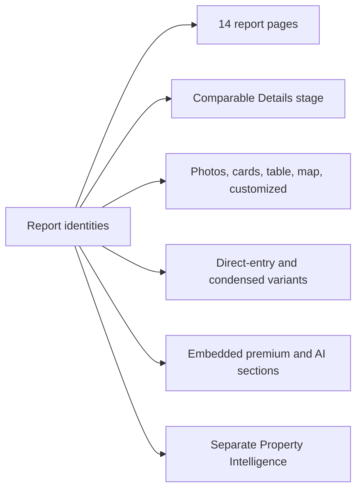

# Report catalogue

[Project context](../../project-context.md) · [Reports](index.md) · [Availability](availability-and-access-rules.md) · [Rendering/actions](report-rendering-and-actions.md)

## Scope and identity rules

**Confirmed baseline:** `RP-10188` / `a6f611ae0`, 2026-09-25. Fourteen active report child routes are implemented. Comparable Details is a generated stage within Comparables, not a fifteenth route. Additional types are output formats, direct-entry variants, embedded sections or separate Property Intelligence analytics.

Repository-relative source abbreviations:

- `F` = `phoenix\src\app`; `RC` = `F\reports\components`
- `W` = `realist\web\src\main\java\com\facl\uaf\realist`
- `R` = `uaf-reports\action\src\main\java\com\facl\uaf\report`
- `C` = `uaf-common\action\src\main\java\com\facl\uaf\common`

Unqualified report component filenames below are in the corresponding `RC` directory from the route table. Controller names are under `W\rest\controller`; ordinary report services are under `W\rest\service\report`, except where explicitly qualified.

| Identifier | Premium Flood example | Meaning |
|---|---|---|
| Browser route | `flood-map-premium` | Angular navigation |
| Access-map key | `PG_REPORTS_PREMIUM_FLOODMAP` | Browser entitlement lookup |
| Feature code | `FCFLDPREM` | Usage/status/unlock accounting |
| Product code | `FMK` | Commerce product |
| Server report type | `FLOOD_MAP_PREMIUM` | Service/PDF dispatch |
| Template code | `TMPL_REPORTS_PREMIUM_FLOOD_MAP` | Runtime report definition |

Sources: `F\reports\reports-router.module.ts:85–93`; `F\store\user\user.model.ts:417–431`; `W\rest\service\ecommerce\PropertyReportStatusService.java:54–57,260–265`; `W\rest\model\report\ReportType.java:21–40`.

No literal `ReportCodes` definition was found in the supplied research's frontend/Java search. Actual identities use `ReportsRoutes`, frontend/server `ReportType`, `PreferenceCode`, `TemplateCode` and feature/product mappings.

## Route/component comparison

All active routes below begin `/reports/`; component paths are relative to `RC`.

| Report | Route suffix | Entry component; file |
|---|---|---|
| Property Details | `property-details` | `PropertyDetailsReportComponent`; `property-details-report\property-details-report.component.ts` |
| Comparables | `comparables` | `ComparablesReportComponent`; `comparables-report\comparables-report.component.ts` |
| Neighbors | `neighbors` | `NeighborsReportComponent`; `neighbors-report\neighbors-report.component.ts` |
| Neighborhood Profile | `neighborhood-profile` | `NeighborhoodProfileComponent`; `neighborhood-profile\neighborhood-profile.component.ts` |
| Assessor Map | `assessor-map` | `AssessorMapReportComponent`; `assessor-map-report\assessor-map-report.component.ts` |
| Zoning Map | `zoning-map` | `ZoningMapReportComponent`; `zoning-map-report\zoning-map-report.component.ts` |
| Standard Flood Map | `flood-map` | `StandardFloodMapReportComponent`; `standard-flood-map-report\standard-flood-map-report.component.ts` |
| Premium Flood Map | `flood-map-premium` | `PremiumFloodMapReportComponent`; `premium-flood-map-report\premium-flood-map-report.component.ts` |
| Foreclosure | `foreclosure` | `ForeclosureReportComponent`; `foreclosure-report\foreclosure-report.component.ts` |
| Market Trends | `market-trends` | `MarketTrendsReportComponent`; `market-trends-report\market-trends-report.component.ts` |
| Building Sketch | `building-sketch` | `BuildingSketchReportComponent`; `building-sketch-report\building-sketch-report.component.ts` |
| Hazards & Risks | `hazard` | `HazardReportComponent`; `hazard-report\hazard-report.component.ts` |
| Premium Neighborhood Reports / Community Insights | `premium-neighborhood-reports` | `CommunityInsightsComponent`; `community-insights\community-insights.component.ts` |
| Building Permits | `building-permits` | `BuildingPermitsComponent`; `building-permits\building-permits.component.ts` |

Source: `F\reports\reports-router.module.ts:23–149`; `RC\reports-routes.ts:1–17`. `ReportsRoutes.NewMarketTrends = 'new-market-trends'` exists but is not registered in this router.

## HTTP contracts, inputs and ownership

Unless specified otherwise, the browser sends **POST** beneath `/api/reports`, to matching `ReportController` `@PostMapping` handlers.

`PI` in this table means **PropertyIdentifier**, not Property Intelligence. Relevant fields include `parcelId`, `fipsCode`, `apn`, `clip`, `latitude`, `longitude`, `parcelSeqNumber` and building identifiers. These are a family of inputs, not a claim that every endpoint requires every field.

| Report / code | Browser method → endpoint → handler | Inputs | Owner / data path |
|---|---|---|---|
| Property Details / `PROPERTY_DETAILS` | `getPropertyDetailsReport` → `/property-details` → `getPropertyDetailReport` | `{propertyIdentifiers:[PI], requestedFrom, saveSubjectProperty}` | `PropertyDetailsService` → `W\action\ServiceHandler` → `R\action\ReportAction` |
| Comparables / `COMPARABLES` | `startComparablesReport` → `/start-comparables-report` → `getComparablesReport` | Subject PI; common preferences; `compsSearchCriteriaPG` | `ComparablesService` → `ReportAction` |
| Comparable Details / `COMPARABLES` | `getComparablesReport` → `/comparables-detail-report` → `getComparablesDetailReport` | Subject plus selected IDs; saved subject context | `ComparablesService` → `ServiceHandler` |
| Neighbors / `NEIGHBORS` | `getNeighborsReport` → `/neighbors` → `getNeighborsReport` | Subject PI; common/search-criteria preference groups | `NeighborsService` → `ServiceHandler` → report library |
| Neighborhood Profile / `NEIGHBORHOOD_PROFILE` | `getNeighborhoodProfile` → `/neighborhood-profile` → `getNeighborhoodProfileReport` | PI; optional `searchCriteriaPreferenceGroups` | `NeighborhoodProfileService` |
| Assessor / `ASSESSOR_MAP` | `getAssessorMapReport` → `/assessor-map` → `getAssessorMapReport` | PI; optional transaction ID | `W\rest\service\ecommerce\EcommerceReportsService` → `W\rest\service\AssessorMapService` |
| Zoning / `TMPL_REPORTS_ZONINGMAP_DETAIL` | `getZoningMapReport` → `/zoning-map` → `getZoningMapReport` | PI; server derives township/map fields | `SubjectPropertyService` → `W\rest\service\ZoningMapService` |
| Standard Flood / `FLOODMAP` | `getStandardFloodMapReport` → `/standard-floodmap` → `getStandardFloodMapReport` | PI with coordinates; optional transaction ID | `EcommerceReportsService` → `FloodMapService` |
| Premium Flood / `FLOOD_MAP_PREMIUM` | `getFloodMapReport` → `/floodmap` → `getFloodMapReport` | PI with coordinates | Controller admission → `PremiumFloodMapService` |
| Foreclosure / `FORECLOSURE` | `getForeclosureReport` → `/foreclosure` → `getForeclosureReport` | PI; optional transaction ID | `EcommerceReportsService` → `ForeclosureService` |
| Market Trends / `MARKET_TRENDS` | `getSdpMarketTrends` → `/sdp-market-trends` → `getSdpMarketTrendsReport` | ZIP, state, city, county FIPS, CLIP, APN, year/month | `SdpMarketTrendsService` → common `MarketTrendsService` |
| Sketch / `BUILDING_SKETCH` | `getBuildingSketch` → `/building-sketch` → `getBuildingSketchReport` | PI; image width/height; optional transaction ID | `EcommerceReportsService` → `BuildingSketchService`; `@BuildingSketchValidation` |
| Hazard / `HAZARD` | `getHazardReport` → `/hazard` → `getHazard` | Flat address/state/coordinates/parcel/APN; optional section-retry flags | `SpatialApiService` → `HazardService` → report library |
| Community Insights / four products below | `getCommunityInsightsReport` → `/community-insights-pdf`; `downloadCommunityInsightsReport` → `/community-insights-url` | Address or coordinates, FIPS, APN, product list; optional PI | `C\shared\service\LocationApiService` plus usage services |
| Permits / `BUILDING_PERMITS` | `getBuildingPermits` → **GET `/api/building-permits`** → `getBuildingPermits` | Query `clip`, `apn`, `countyId` | `BuildingPermitsService` → `BuildingPermitsApiService`; `ClipService` fallback |

Caller evidence: `F\reports\services\reports.service.ts:83–89,199–277,319–407,597–616`. Handler evidence: `ReportController.java:169–177,201–301,304–429,468–502,561–564,575–837`.

## Per-report content, transformations and actions

### Property Details

The central factual report: summary/photos, owner information/transfers, valuation, maps/location, tax/assessment, mortgage/sale history, property features, listing and foreclosure history. Embedded AI summary, rental/sell-score, Community Insights and building-permit sections are also supported. **The section set is runtime-driven, not guaranteed for every property/user.**

- **Source/transformation:** external SmartSearch property details → runtime template/preferences → XML → `PropertyDetailsConverter` → section renderer.
- **Actions:** PDF/print workflow, email, customized output, saved-property toggle, photo viewer, conditional Transaction Desk/ValueMap and feature-gated shared-link dialog.
- Embedded document-image links have separate access/credit calls.
- See the [full Property Details flow](../../feature-flows/property-details-and-reports.md); embedded sections do not automatically confer access to similarly named premium routes.

Evidence: `PropertyDetailsService.java:128–202`; `W\rest\converter\PropertyDetailsConverter.java:27–83`; `F\reports\shared\components\property-details-body\property-details-body.component.html:15–160,246–596`; `RC\property-details-report\property-details-report.component.html:1–55`.

### Comparables and Comparable Details

First finds candidate properties; then the user selects comparable properties and generates a comparison. The generated report remains on `/reports/comparables`.

- **Candidate view:** configurable criteria, selection grid and map. Generation is disabled without selection.
- **Generated sections:** `TMPL_REPORTS_COMPARABLES_MAP` projects a map. Other sections are expandable panels using runtime `section.title`; grids render **only `dataGrid[0].rows`**. `TMPL_REPORTS_COMPARABLES_DETAIL` adds photo styling. Multi-column tables, footnotes and Comparables footer render when present.
- **Statistics:** subject/high/low/median/average; comparable zero values are excluded; projected assessment/SqFt values depend on options.
- **Data:** saved subject and preferences construct search criteria; generated details use XML and `DefaultConverter`. PDF caching instead uses `HtmlComparablesConverter`, can prepare a map, and removes search-criteria/statistics sections when their preferences are `N`. That removal is not frontend filtering.
- **Limits:** candidate count is `min(COMPS_PREF_TOTAL_RECORDS, maximum.number.comparables)`; the frontend selection cap is **20**, a different limit. Over-selection is undone. Customized generation also truncates initial candidates to 20.
- **Actions:** Edit, Generate, criteria Submit versus Save and Submit, Customize View, quick/customized PDF/print and email.

Evidence: `RC\comparables-report\comparables-report.component.html:15–59`, `.ts:174–236,259–291,328–338`; child `comparables-report-view\comparables-report-view.component.html:1–26`; `ComparablesService.java:96–109,157–232`; `R\xml\data\ComparablesData.java:106–149,178–229`; `W\rest\util\ComparablesReportUtil.java:95–150,228–395`; `F\reports\shared\constants\reports.constants.ts:43`; child `comparables-report-edit\comparables-report-edit-grid\comparables-report-edit-grid.component.ts:183–200`.

**Unknown:** deployed section names/order/field inventory and configured candidate maximum; these are runtime template/preference/configuration data.

### Neighbors

Answers “what properties are nearby?” rather than describing population demographics.

- **Content:** nearby property cards/photos, summary values, detail rows/links and optional parcel-boundary map; configurable search criteria.
- **Data:** XML-derived report plus `resultData` and `subjectProperty`.
- **Actions:** customize, criteria editing, PDF/print and email.
- **No results:** dedicated empty-neighbors component.

Evidence: `ReportController.java:201–223`; `RC\neighbors-report\neighbors-report.component.html:1–101`; `F\reports\services\reports.service.ts:138–145,199–209`.

### Neighborhood Profile

Describes the surrounding population, housing and quality of life rather than individual parcels.

- **Sections:** population/households, age, gender, marriage, housing summary/occupancy, rent, workforce/industry, income, commute and weather.
- **Data:** report XML plus demographic information consumed by `NeighborhoodProfileConverter`; browser tables, charts and progress circles depend on template codes.
- **Actions:** criteria, Customize View, quick/customized print/PDF and email. PDF preparation takes current report model plus property data.

Evidence: `RC\neighborhood-profile\neighborhood-profile.component.html:1–180`, `.ts:120–173,232–272`; `NeighborhoodProfileService.java:128–157`.

### Assessor Map

Displays legal block/lot context and map-sheet imagery.

- **Data:** derive `CD_MAP_LINK`, count sheets, call `ReportAction.getAssessorMapInfo`. A generated report can have an empty map-link list; `exists=true` does not prove usable sheets.
- **Actions:** purchase/view prompt and download all map files. Normal print/custom print/email are hidden. Component fetches each map URL as a blob; fallback extension is `.tif`.
- **Serving:** `GET /assessor-map-viewer` returns HTML from map/APN/county/sheet query parameters. File links use `/parcelmapviewer?type=getfile&mapapn=…&countycode=…&sheet=…`, supported by servlet GET/POST. The servlet checks session user, fetches provider imagery, validates TIFF structure and serves a TIFF attachment.
- Viewer template resolution is present in source, but the targeted search did not locate `map-viewer` template content; successful viewer rendering is **Unknown**. File authorization differs from metadata ecommerce admission; see [access rules](availability-and-access-rules.md#map-file-serving-is-a-separate-boundary).

Evidence: `W\rest\service\AssessorMapService.java:156–180,214–275,302–314,407–413`; `RC\assessor-map-report\assessor-map-report.component.html:1–24`, `.ts:210–259`; `AssessorMapViewerController.java:20–31`; `R\util\ParcelMapViewerServlet.java:64–173,206–221`.

### Zoning Map

Lists zoning-map sheets and download links with legal block/lot context.

- **Data:** subject APN, municipality/township and FIPS → `ReportAction.getZoningMapInfo`. Zero sheets returns `null`.
- **Actions:** open `/zoningMap?...` per-sheet links in a new tab; no ordinary PDF preparation endpoint in the inspected report PDF controller.
- **Serving:** unrestricted `@RequestMapping("/zoningMap")` reads `townshipCode`, `pageNo`, `apn`; default page is `0`. Generated links also send `countycode` and `totalSheet`, but this handler does not consume them. `ReportAction.getZoningMapImage` → delegate → `apigeeService.retrieveZoningMapBySheet` → TIFF attachment. Authentication/entitlement behavior must not be inferred from the metadata endpoint.

Evidence: `W\rest\service\ZoningMapService.java:33–77`; `RC\zoning-map-report\zoning-map-report.component.html:9–34`; `R\util\ZoningMapController.java:36–68`; `R\action\ReportAction.java:4551–4574`; `R\action\delegate\ReportDelegate.java:825–843`.

### Standard Flood Map

- **Content:** flood-zone determination, map/legend and determination details.
- **Data:** `SpatialApiService.fillFloodMapInformation` → report-library XML → `FloodMapConverter`.
- Both coordinates zero gives HTTP 204; report and map-tile rate limits have separate UI states.
- **Actions:** desktop quick Print/PDF and Email using captured map information, `type: 'Flood Map'`, `isStandard: true`. Customized subscriptions exist but their buttons are hidden. Mobile email is explicitly disabled.
- Standard does **not** mean universally free; server ecommerce logic still applies.

Evidence: `RC\standard-flood-map-report\standard-flood-map-report.component.html:1–96`, `.ts:253–267,310–335,409–416`; `FloodMapService.java:60–100`; `ReportController.java:407–419`.

### Premium Flood Map

- **Identity:** `FCFLDPREM` / `FMK` / `FLOOD_MAP_PREMIUM`.
- **Content:** standard flood information plus Flood Risk Score, Flash Flood Risk Score and risk-score details; unavailable scores may display `N/A`.
- **Data:** premium spatial information → XML → report DTO. Flash Flood Risk is embedded, not a separate report route.
- **Actions:** credit redemption/unlock or purchase/view; desktop quick PDF/print and email with `type: 'PremiumFloodMap'`, `isStandard: false`. Custom buttons and mobile email are hidden/disabled as for Standard Flood.
- Admission and usage differ between ordinary report and PDF preparation handlers.

Evidence: `RC\premium-flood-map-report\premium-flood-map-report.component.html:24–175`, `.ts:354–368,411–435,542–559,620–698`; `PremiumFloodMapService.java:131–169`; [PDF enforcement distinctions](../../feature-flows/pdf-generation-and-download.md#important-enforcement-differences).

### Foreclosure

- **Content:** foreclosure tables/grids and document-image link actions.
- **Data:** `ServiceHandler.getForeClosureReport` → XML → `ForeclosureConverter`; server removes sections disabled by display preferences.
- **Actions:** purchase/view, customize, PDF/print, email and document-image access.
- Navigation additionally depends on foreclosure stage/date-related rules, not just report entitlement.

Evidence: `RC\foreclosure-report\foreclosure-report.component.html:1–52`; `ForeclosureService.java:60–138`; `F\shared\utils\report-utils.ts:63–145`.

### Market Trends

- **Purpose/content:** selected property's geographic market overview; sales/listing gauges, charts and geographic comparisons with month selector.
- **Data:** ZIP/state/city/county, CLIP/APN and optional year/month → `SdpMarketTrendsService` → market/listing analytics. Not the Property Details XML path.
- **Limits:** browser date input spans `twelveMonthsAgo` to `oneMonthBefore`; service declares a 13-month data limit.
- **Actions:** month/chart selection and Quick Print/PDF from current report data. Normal UI hides email/customized actions; disabled error-state email controls do not establish email support.
- Distinct from `/property-intelligence/market-trends`; see [Property Intelligence](../property-intelligence/index.md).

Evidence: `RC\market-trends-report\market-trends-report.component.html:14–42`, `.ts:180–259,335–350`; `SdpMarketTrendsService.java:97–111,134–180`; `F\reports\services\reports.service.ts:152–153,404–407`.

### Building Sketch

- **Content:** building-sketch images and reactive image-size form.
- **Data:** subject → `ServiceHandler.getBuildingSketchReport` → XML → sketch converter.
- **Actions:** purchase/view, size selection, PDF/print and email.
- **Visible warning:** building-sketch data is no longer being acquired; existing data will not be updated.

Evidence: `RC\building-sketch-report\building-sketch-report.component.html:1–54`; `BuildingSketchService.java:45–86`.

### Hazards & Risks

- **Identity:** `HAZARD`, feature `FCHAZRD`, product `HZR`; displayed as “Premium Hazards & Risks.”
- **Sections:** summary, Crime Risk, Earthquake Risk, Wind & Storm Risk, Wildfire Risk, Distance to Fire Station, Region Specific Risk and Roof Age.
- **Data:** spatial information → `HazardService` → XML/converter. Regional/provider no-content status may disable one section, not the whole report.
- **Actions:** redemption/unlock/purchase; desktop quick Print/PDF and Email using captured hazard/map information. Upgrade view hides actions; mobile email is disabled. No universal shared-link action is established.

Evidence: `RC\hazard-report\hazard-report.component.html:1–75`, `.ts:309–311,343–362,375–451`; `hazard-report.strategies.ts:17–66`; `HazardService.java:101–142`.

### Premium Neighborhood Reports / Community Insights

A collection of provider PDF products, **not** one locally section-rendered report.

| Product | Code | Purpose / visible surface |
|---|---|---|
| Real Estate | `REST` | Real-estate information product offer/sample/download |
| Economics and Demographics | `ECDEM` | Economic/demographic product offer/sample/download |
| Schools | `SCHOOL` | School-information product offer/sample/download |
| Trends and Forecasts | `TRFO` | Trend/forecast product offer/sample/download |

All four share the Community Insights route/component and endpoints in the contract table, feature `FCCMYNSGTS`, location/APN/product-list inputs and `LocationApiService` data source. The provider owns actual PDF sections; product titles/sample filenames do not establish every live section.

- Provider response parsing reads `data_products.location.pdf_report`.
- Actions: product-specific **Download Sample**, **Download**, purchase/view and credit/unlock. No report-level Print or Email buttons.
- Availability/unlock can be partial across products. Offer cards filter runtime `premiumProductId` and selected APN.
- `/community-insights-pdf` and `/community-insights-url` have different enforcement branches; do not substitute one for the other.

Evidence: `ReportController.java:662–743`; `W\rest\service\ecommerce\PropertyReportStatusService.java:54–57,121–147`; `RC\community-insights\community-insights.component.ts:87–96,109–146`; child `community-insights-offer-card\community-insights-offer-card.component.ts:47–50,96–119,392–419`, `.html:61–80`; `C\shared\service\LocationApiService.java:127–213`.

### Building Permits

- **Identity:** `BUILDING_PERMITS`, feature `FCBLDGPRMT`, product `BPR`.
- **Content:** permit count and expandable records with permit, contractor and additional information.
- **Data:** supplied CLIP or resolution from APN/county → `BuildingPermitsApiService`.
- **Actions:** purchase/redemption/unlock, quick/customized Print/PDF and Email. Quick preparation contains permits, availability, footer, property information, free-report status and limits.
- `isAvailable` means admission, not necessarily nonempty permit results. Coverage tests provider list `!= null`, not `!list.isEmpty()`.
- PDF preparation caches a supplied report model; it is not the same admission path as GET.

Evidence: `RC\building-permits\building-permits.component.html:1–49`, `.ts:206–276`; `ReportController.java:746–837`; `BuildingPermitsService.java:28–37`; `PdfReportController.java:252–254`.

## Extra output and presentation types

These types are implemented output operations or identity variants, not additional report tabs.

| Type | Entry / component context | Endpoint and input | Content, source and actions |
|---|---|---|---|
| `PROPERTY_PHOTOS` | Search/report photo output; `SearchDownloadService` | POST `/api/dashboard/pdf/property-photos`; property-data map plus frontend `outputFlag` | Address header + `ImagesSection`; property photo data; PDF download |
| `TABLE` | Search result output | POST `/api/dashboard/pdf/table`; `ExportInput` | Re-fetched property data → table sections; PDF |
| `CARD` | Search result output | POST `/api/dashboard/pdf/cards`; `ExportInput` | Card groups; server appends fixed card-template fields; PDF |
| `MAP_TABLE` | Search map + table output | POST `/api/dashboard/pdf/map-table`; `MapTableDto` | Captured map plus loaded table sections; PDF |
| `MAP` | Server search-map output | POST `/api/dashboard/pdf/map`; `{map}` | Map image plus footer; PDF. Browser `downloadMap()` does not use this endpoint |
| `MAP_IMAGE` | Browser search-map output | POST `/api/dashboard/png/map-image`; captured map | PNG download rather than PDF; map is browser input |
| `CUSTOMIZED` | Shared report customization dialogs, no separate report route | POST `/api/reports/pdf/customized`; report-type→cache-key map plus property data | Combine cached constituent models; render PDF during prepare and cache bytes |
| Frontend `FLASH_FLOOD_RISK` | Embedded Premium Flood section | Frontend uses `/api/reports/floodmap`; premium-flood data | Risk score/details; no independent route or separate proven endpoint/action |

Evidence: `W\rest\model\report\ReportType.java:19–65`; `F\search\services\search-download.service.ts:13–55`; `PdfDashboardController.java:39–97`; `W\rest\service\ReportService.java:126–245`; `W\rest\service\report\CustomizedReportService.java:49–76`. Exact dashboard Angular caller components beyond the common service are not established in this report scope; see [search results/actions](../search/results-grid-map-and-actions.md).

## Direct-entry and condensed variants

Direct keys are not new Angular report-router pages. Two deliveries exist:

1. `/spring/directReportAction` uses unrestricted `@RequestMapping`, servlet parameters (not a JSON body), session identity, validation and property search. Depending on type/display it returns JSON, inline PDF, plain-text PDF link or server HTML.
2. Application direct links generate session `DIRECT_LINK_REPORT`, redirect to frontend login, then retrieve it through `/api/reports/direct-link`. That unrestricted handler returns `DirectReportOutputInfo` and **removes the session object**. It does not itself regenerate the report.

Relevant inputs include `searchType`, `displayType`, county/property search criteria, `hideButtons`, `framedHtml`. `DirectReportService` builds search input/criteria labels; it is not the renderer.

| Type / incoming search key | Actual implementation and inputs | Content/data/actions |
|---|---|---|
| `DIRECT_COMPARABLES` / `DirectComparableSearch` | Application `DirectLinkReportService` obtains candidates and invokes detail controller; standalone `pdfReport` calls `ComparablesService.getPdfReport(subject,"Road")` | Same runtime comparisons/map/statistics as ordinary family; XML/converters; inline PDF uses **`COMPARABLES`**, not a distinct direct generator |
| `DIRECT_FLOODMAP` / `DirectFloodMapSearch` | Validator restricts to `displayType=application`; direct service chooses standard/premium using preferences, purchase, usage and transaction history | Spatial flood information → ordinary `FLOODMAP` or `FLOOD_MAP_PREMIUM`; payload `floodMapReport`; ordinary application actions after handoff |
| `DIRECT_PREMIUM_FLOODMAP` / `ApiPremiumFloodReport` | Standalone returns JSON **before** PDF/HTML format switch; application also populates `floodMapReport` | Premium spatial/report data, ordinary `FLOOD_MAP_PREMIUM`, allowance fields; exceptions yield empty `Report`; enum presence does not establish direct PDF generation |
| `DIRECT_HAZARD` / `ApiHazardReport` | Standalone JSON before format switch; APN/coordinates drive spatial request and free/purchased/allowance checks | Ordinary `HAZARD` risk sections or limited APN/CLIP/status/price shell. Application login accepts key, but single-property direct-link dispatch has no hazard case and falls back to property-map redirect |
| `DIRECT_NEIGHBORHOOD_PROFILE` / `DirectNeighborhoodSearch` | Application XML+demographics conversion into wrapper; standalone PDF explicitly uses direct enum | Same neighborhood tables/charts; PDF service generates bar, pie, horizontal-bar and dial charts despite a stale controller warning |
| `PROPERTY_DETAILS_CONDENSED` / shared `AutoPropertySearch` | Not independently selected by key: `PROPERTY_DETAILS` occurs first in `fromKey`. Selected through `displayType=htmlCondensedReport` and `HtmlService.createView` | Same property XML/converter; shared property-details fragment with `responsive=false`, footer; conditional Launch Realist/Comparables/Profile links and unconditional Print. Template does not check model `hideAll` |

Sources: `W\rest\model\report\ReportType.java:24–38,48–61,112–116`; `W\controller\LoginController.java:667–726,740–800`; `W\controller\DirectReportController.java:205–271,342–397,482–509,544–653`; `W\rest\service\DirectReportService.java:34–160`; `W\rest\service\DirectLinkReportService.java:245–418,463–628,761–845`; `DirectApiReportController.java:21–49`; `W\service\validation\DirectReportValidator.java:54–57`; `W\service\reports\html\HtmlService.java:36–110`; `NeighborhoodProfileService.java:174–247`; `realist\web\src\main\resources\templates\reports\html\property-details-condensed.html:11–25`.

**Qualification:** PDF dispatcher retains `DIRECT_COMPARABLES` / `DIRECT_HAZARD` cases (`W\service\reports\pdf\ReportPdfService.java:87–98`), but all their callers/reachability are not established. Do not label retained cases dead or assume every direct enum is independently downloadable.

## Property Intelligence identities

These belong to [Property Intelligence](../property-intelligence/features-and-navigation.md), not the report tabs. The following maps enum identities to their related analytics families; it does **not** claim the browser transmits each direct search key. Browser routes begin `/property-intelligence/`; POST endpoints begin `/api/property-intelligence/`.

| Type; direct key; template stem | Route / component | POST endpoint / inputs | Visible content, source and actions |
|---|---|---|---|
| `PROP_INTEL_LANDING`; `ApiPropIntelLanding`; `pi-landing` | `home`; `PropertyIntelligenceHomeComponent` | `landing-page`; one `PropertyIntelligenceSearchFilter` | Latest-period quick stats, gauges, sale/activity and tax-versus-MLS sections from market/listing data; filters and More Stats navigation; shell sharing |
| `PROP_INTEL_MARKET`; `ApiPropIntelMarket`; `pi-market` | `market-trends`; `PropertyIntelligenceMarketTrendsComponent` plus Charts child | `market-trends-charts`; selected geography/period filters | Tax sale counts/prices, construction, loans/LTV, volume, delinquency/foreclosure/REO charts; metric/period/comparison/view selection, PDF/email |
| `PROP_INTEL_RENTAL`; `ApiPropIntelRental`; `pi-rental` | `rental-trends`; `PropertyIntelligenceRentalTrendsComponent` | `rental-trends-charts`; same search wrapper | Single-family combined mean rents by bedrooms; one-to-four-bedroom choices, comparisons/period, PDF/email |
| `PROP_INTEL_HPI`; `ApiPropIntelHPI`; `pi-hpi` | `hpi`; `PropertyIntelligenceHpiComponent` | `hpi-trends-charts`; same search wrapper | Historical home-price-index changes, month/year-labelled tabs, comparisons and PDF/email; local “year” formula is adjacent-record change, not established conventional annual change |
| `PROP_INTEL_HPIF`; `ApiPropIntelHPIF`; `pi-hpif` | `hpi-forecasts`; `PropertyIntelligenceHpifComponent` | `hpi-forecast-trends-charts`; same search wrapper | Forecast index-change charts with corresponding tabs/actions; provider ordering/formula semantics need care |
| `SEARCH_TYPE_PROP_INTEL_LISTING`; `ApiPropIntelListing`; empty stem | `listing-trends`; `PropertyIntelligenceListingTrendsComponent` plus Charts child | `listing-trends-charts`; same search wrapper | MLS inventory, days on market, supply, prices, pending/sold/active and dual-axis charts; filters/PDF/email; PIN-conditioned tab visibility |
| `PROPERTY_INTELLIGENCE_CHART`; empty key; `property-intelligence-chart` | Shared `PropertyIntelligenceChartComponent` and chart controls; no separate route | `generate-chart-pdf`; chart title/category/data, legend maps, filename, standalone flag/title/geography | Caches supplied chart-PDF request; returns file link for PDF output/email workflow. `share-pdf` takes search/metric and returns a `Chart`, not PDF bytes |

Components live beneath `F\property-intelligence\components` in matching kebab-case directories. `PropertyIntelligenceController` delegates to `W\rest\service\PropertyIntelligenceService`; geographic analytics come through `C\shared\service\MarketTrendsService` and outbound GraphQL, then local `MarketTrendUtils` transformations. The browser maps chart labels/items into chart-renderer datasets. Provider definitions and deployed geographic coverage remain external unknowns.

The common search wrapper contains `propertyIntelligenceSearchFilters[]` (named State/Metro/County/ZIP geography, `yearRange`, selected/active flags), with optional `chartKey` and `searchType`. Chart-map responses contain labels and series values/colors/axis IDs. These are not subject-property identifier requests.

Evidence: `W\rest\model\report\ReportType.java:41–46,65,97–104`; `F\property-intelligence\property-intelligence-routing.module.ts:11–46`; `F\property-intelligence\services\property-intelligence.service.ts:21–62`; `PropertyIntelligenceController.java:32–83`; `W\rest\service\PropertyIntelligenceService.java:85–173,342–647,666–696`; `C\shared\model\propertyintelligence\PropertyIntelligencePdfRequest.java:8–20`; `C\shared\service\MarketTrendsService.java:125–240,484–489`.

Detailed transformations, access and chart limitations remain authoritative in [PI analytics/data flow](../property-intelligence/analytics-and-data-flow.md). An empty enum template stem is not proof of a usable direct HTML/PDF template.

Read the diagram as a classification, not a runtime call graph.

## Boundaries and debugging

- Missing tab/locked content: [availability matrix](availability-and-access-rules.md), not just route inventory.
- Browser/PDF differences: [rendering/actions](report-rendering-and-actions.md) and [PDF flow](../../feature-flows/pdf-generation-and-download.md).
- CSV is a separate re-fetch/format operation, not “export any report section”: [exports/labels](../../feature-flows/exports-and-mailing-labels.md).
- **Unknown external data:** effective runtime templates/sections, provider PDF contents, coverage/prices and deployment values.
- **Local integration follow-up:** detailed PI behavior belongs to the linked analytics chapter; dashboard caller-component inventory belongs to search; final mail transport/attachment semantics belong to sharing/email ownership. These limits do not imply absent implementations.
