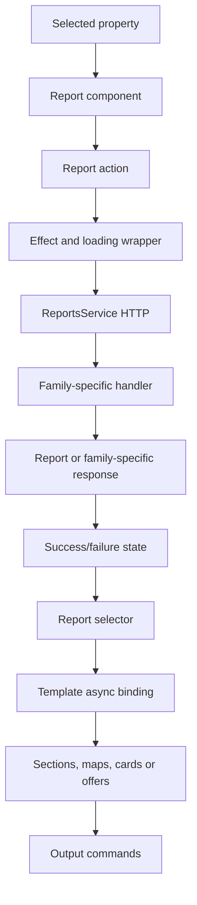
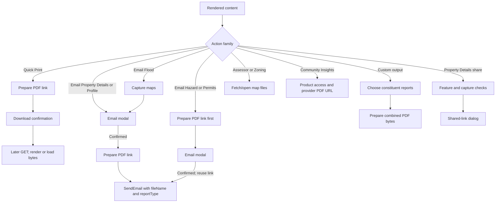

# Report rendering and actions

[Project context](../../project-context.md) · [Reports](index.md) · [Catalogue](report-catalogue.md) · [Availability](availability-and-access-rules.md)

## Purpose and evidence

Most report pages consume NgRx report models, but map-file downloads, provider PDFs, permit records and template-generated sections are distinct mechanisms. This page owns browser rendering/actions; the linked flows own cross-layer details.

**Confirmed baseline:** `RP-10188` / `a6f611ae0`, 2026-09-25. Source shorthand: `F` = `phoenix\src\app`; `RC` = `F\reports\components`; `W` = `realist\web\src\main\java\com\facl\uaf\realist`; `C` = `uaf-common\action\src\main\java\com\facl\uaf\common`. Component paths follow the [catalogue route table](report-catalogue.md#routecomponent-comparison).

## State to visible report



Representative evidence: `RC\property-details-report\property-details-report.component.ts:166–187`; `F\store\reports\reports.effects.ts:246–259`; `reports.reducer.ts:251–305` in the same directory. This is not a claim that every family uses every step; direct `HttpClient` map-blob downloads bypass report effects.

## Property Details component contract

`PropertyDetailsReportComponent` is standalone and `OnPush`. It reads selected property/report state, dispatches `GetPropertyDetailsReport`, and subscribes to shared Subjects for email, print, customization, Transaction Desk and ValueMap. Shown subscriptions use `untilDestroyed(this)`; manual updates call `markForCheck`.

`PropertyDetailsBodyComponent` is also `OnPush`:

| Binding/state | Purpose |
|---|---|
| `reportData` input setter | Stores report and rebuilds presentation |
| `propertyData` input setter | Determines photo availability |
| `openPictureViewer` output | Requests photo viewer |
| `groups` | Sections grouped by building/global context |
| `navigableSections` | Sections eligible for sidebar navigation |

Sources: parent `.ts:60–70,100–244`; `F\reports\shared\components\property-details-body\property-details-body.component.ts:32–70`.

The parent binds `reportData$ | async`, header/footer and body inputs, and exposes conditional mobile actions. The body iterates groups and switches on runtime `templateCode`, using generic grids/tables and specialized cards/charts.

Sanitized structural shape, **not a complete schema**:

```text
Report
  header
  sections[]
    templateCode
    title
    multiColumn / dataGrid / summary / images / charts
    footNotes / buttons
  footer
```

Not every section has every field. Sources: parent `.html:1–55`; body `.html:15–160,246–596`. See [remote data → XML → DTO flow](../../feature-flows/property-details-and-reports.md).

## Family-specific rendering and commands

| Family | Renderer / state | Actual actions and exceptions | Evidence |
|---|---|---|---|
| Property Details | Grouped runtime sections, specialized embedded cards | PDF/print, email, customization, saved toggle, photos; conditional feature-gated shared link | Parent TS `100–244`; parent HTML `1–55` |
| Comparables | Edit/candidate versus generated view; runtime panels; first grid only, photo styling for detail code | Select/edit/generate, criteria, Customize View, quick/customized print/email; 20 selected cap | Comparables HTML `15–59`; TS `174–236,259–291`; child view HTML `1–26` |
| Neighbors | Map + derived neighbor cards; explicit empty state | Criteria/customize, PDF/print/email | Neighbors HTML `18–101` |
| Neighborhood Profile | Template-code branches, tables/charts/progress circles | Criteria/customize, quick/customized PDF/print/email | Profile HTML `15–180`; TS `120–173,232–272` |
| Foreclosure | Dynamic section titles, table/grid selection, document-image events | Purchase/view, customize, PDF/print/email, document-image access | Foreclosure HTML `1–52` |
| Assessor | Per-sheet imagery and links | Normal print/email hidden; direct blob downloads, purchase/view | Assessor HTML `1–24`; TS `190–259` |
| Zoning | Server-supplied sheet URLs | Open map-file links; not ordinary PDF preparation | Zoning HTML `9–34` |
| Standard/Premium Flood | Map, determination/risk cards; separate report/map timers | Desktop quick print/email; custom subscriptions exist but buttons hidden; mobile email disabled | Standard TS `253–267,310–335,409–416`; Premium TS `354–368,411–435,542–559` |
| Market Trends | Gauges/charts and month selection | Quick PDF/print only in normal configuration; no normal email/custom buttons | Market Trends TS `180–259`; HTML `14–42` |
| Building Sketch | Image-size reactive form, sketch images, historical-data warning | Purchase/view, size selection, PDF/print/email | Sketch HTML `1–54` |
| Hazard | Strategy-selected risk component, per-tab no-content | Quick print/email with capture; upgrade hides actions; mobile email disabled | Hazard HTML `1–75`; TS `309–451`; strategies `17–66` |
| Permits | Expandable records; offer/report/redeem overlay | Quick/customized print and email from supplied permit report | Permits HTML `1–49`; TS `206–276` |
| Community Insights | Product offer cards/external PDFs, not local section renderer | Sample/Download/purchase/unlock; **no report-level print/email** | Community TS `87–146`; offer-card HTML `61–80`; `C\shared\service\LocationApiService.java:194–213` |

Family-specific codes, data sources and endpoints are in the [catalogue](report-catalogue.md), not inferred from these controls.

## Actions are not interchangeable



This diagram separates output operations; it is not a promise every report exposes each branch. Evidence: Property Details TS `100–130,222–227`; `F\store\reports\reports.effects.ts:2122–2151,2191–2239`; Assessor TS `210–259`; Community offer-card TS `392–419`; `W\rest\service\report\CustomizedReportService.java:49–76`.

### Print/PDF

Property Details `printQuick` calls `downloadPropertyDetailsReport`, preparing a link rather than calling browser `window.print()`. Shared confirmation says “Click the print button to download the PDF report.” A prepared link does not guarantee later rendering succeeds.

Ordinary PDFs cache models; customized output renders during preparation. Flood/hazard can capture maps/charts separately from report data. See [PDF lifecycle](../../feature-flows/pdf-generation-and-download.md).

### Email

Ordering is family-specific. Property Details and Neighborhood Profile open the modal, then prepare the PDF only after confirmation. Flood captures images before the modal but prepares the PDF after confirmation. Hazard and Permits prepare their PDF link **before** opening the modal, then reuse it on confirmation. Cancelling the latter modal therefore does not undo preparation.

The shared `emailReport` helper invokes its supplied projection after a truthy modal result; the projection may perform preparation or merely return an already-prepared `FileLink`. `SendEmail` carries `fileName` and `reportType`. This proves bindings, **not** final attachment-versus-link mail delivery semantics.

Evidence: `F\store\reports\reports.effects.ts:378–383,661–668,834–916,2191–2239`. Final mail transport is outside this chapter's verified scope. Email is distinct from [shared report links](../../feature-flows/shared-report-links.md).

### Shared links

Property Details checks `selectIsShareReportLinkEnabled` and capture readiness. The share dialog closes when selected-property identity changes. Do not mark every report “shared-link supported” because it has Email.

Evidence: Property Details TS `100–130`; HTML `55`.

### Map downloads and exports

Assessor downloads each URL as a blob, creates a temporary anchor and revokes the object URL. Zoning opens supplied map URLs. File-serving authorization differs from metadata generation: [map boundaries](availability-and-access-rules.md#map-file-serving-is-a-separate-boundary).

CSV receives identifiers/field definitions and re-fetches properties; it does not serialize arbitrary displayed report sections. See [exports/labels/postcards](../../feature-flows/exports-and-mailing-labels.md).

## Loading, restricted, empty, expired and error outcomes

| Condition | Actual behavior |
|---|---|
| Property Details HTTP error/null | Effect produces failure; reducer uses `reportWithErrors` |
| Success | Reducer sets `isLoaded: true`; effects can skip cached report state |
| Empty neighbors | Explicit empty-report component |
| Flood null response | Missing-location ribbon |
| Flood body `header.status === '429'` | Delay then redispatch; distinguish report versus tile timers |
| Hazard partial provider result | Per-section `NO_CONTENT`, `LOADED`, or unchanged `NOT_REQUESTED` |
| Payment required | Offer/upgrade/redeem or limited shell, not equivalent to no data |
| Permits `isAvailable=true` | Admitted, not proof of nonempty permits |
| PDF cache missing / expired | Download 404; preparation and later GET are separate |
| Property changed while sharing | Dialog closed; capture identity matters |

Sources: `F\store\reports\reports.effects.ts:246–259,1192–1234,2154–2187`; `reports.reducer.ts:251–305`; `W\rest\controller\ReportController.java:746–837`; `W\rest\controller\FileBaseController.java:67–110`.

## Angular/template observations

These are representative source observations, **not a full accessibility or frontend audit**:

- Async bindings coexist with class subscriptions. Parent uses `untilDestroyed`; body also uses `takeUntilDestroyed`.
- Building Sketch uses reactive forms; Market Trends uses `[(ngModel)]` with a datepicker.
- `*ngIf`, `*ngFor`, `ngSwitch` and nested containers render runtime sections.
- Neighbors/Foreclosure have explicit `trackBy`; several other inspected loops do not.
- Property Details parent/body are `OnPush`; manual changes notify the change detector.
- Map/sketch images have alternative text. Market Trends month button has an ARIA label and restores focus after closing the datepicker.
- Property Details SCSS uses shared variables/mixins and `fadeIn`.
- Templates call some button-state/presentation methods during binding evaluation.
- Report capture uses DOM selectors; Assessor creates an anchor.

Evidence: Property Details TS/HTML and `.scss`; `F\reports\services\reports.service.ts:508–534`; Market Trends HTML `16–27`; Neighbors HTML `36–67`. Full keyboard/contrast/reduced-motion behavior and E2E coverage remain **Unknown**.

## Debugging/change map

| Symptom | Inspect first |
|---|---|
| Missing menu item | `ReportsPermissionsService`, access key, runtime rules |
| URL opens but content locked | Family handler payment/usage branch, not just guard |
| Missing section | Runtime XML/template → converter → `templateCode` branch |
| Loaded but stale view | Selector emission, mutation, `OnPush` and `markForCheck` |
| Comparables screen/PDF differs | `DefaultConverter` versus `HtmlComparablesConverter` and PDF preference filtering |
| PDF differs from browser | HTML converter/template and map/chart capture |
| Assessor `exists` but no images | `AssessorMapService.prepareMapLinks`, not `exists` alone |
| Hazard tab disabled | Per-section status and strategy `disabled` function |

Future authorized testing should cover section-code compatibility, multi-building grouping, empty arrays, selection limits, command visibility, OnPush updates and focus. No tests were executed for this documentation task. Runtime template data and frontend code must remain compatible when changing the renderer.
