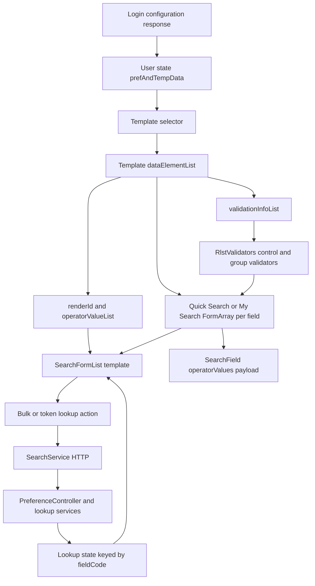

# Dynamic fields, operators, lookups, and validation

[Project context](../../project-context.md) | [Search](index.md)

**Confirmed:** inspected source at `a6f611ae0`, 2026-09-25. Runtime configuration determines which of these mechanisms a particular user actually sees.

## From login configuration to a visible field

`UserReducer.LOGIN_SUCCESS` stores `payload.prefAndTempData`, `gridHeaders`, provisioned geographies, and access information in user state (`phoenix/src/app/store/user/user.reducer.ts:58-88`). `selectTemplate` feeds the search components. A `Template` carries `dataElementList`, optional child templates, identity/type, and access/inheritance metadata. A `DataElement` carries field code, display metadata, default/allowed operators, lookup token, validation rules, and geography/multiplicity flags.



Read top-to-bottom: metadata controls both form construction and rendering; lookup data is a separate asynchronous input, not embedded in every field definition. Evidence: `phoenix/src/app/store/user/user.model.ts:342-395`; `phoenix/src/app/search/components/quick-search/quick-search.component.ts:60-102`; `phoenix/src/app/search/components/my-search/my-search.component.ts:725-865`; `phoenix/src/app/search/components/search-form-list/search-form-list.component.ts:99-172`.

## The three shapes are different

Sanitized structural examples, not a full login response or deployed field configuration:

```typescript
// Metadata
{
  label: "Example search", templateCode: "TMPL_MY_SEARCH_DEFAULT",
  dataElementList: [{
    fieldCode: "SITE_ADDRESS", label: "Address",
    displayInfo: { renderId: 1, elementMask: "" },
    defaultOperator: "IS",
    operatorValueList: [{ operator: "IS", operatorLabel: "Is", values: [] }],
    numberOfSearchValues: 1, validationInfoList: []
  }]
}
// Reactive form group within that field's FormArray
{ operator: "IS", values: { valueFrom: "Example address", valueTo: "" } }
// Submitted SearchField (operatorValues, not metadata's operatorValueList)
{ fieldCode: "SITE_ADDRESS",
  operatorValues: [{ operator: "IS", values: ["Example address"] }] }
```

Metadata can contain additional optional properties; neither this sample nor a TypeScript interface establishes a server-required validation schema.

## Render identifiers and visible behavior

`RENDER_ID` is declared in `phoenix/src/app/store/search-board/search-board.model.ts:26-35`.

| ID | Symbol | Actual shared-template branch |
| --- | --- | --- |
| 1 | `TYPEAHEAD_SINGLE_INPUT` | Default text input; address autocomplete or recent-value suggestions |
| 2 / 3 | `DROPDOWN_MENU` / `SINGLE_SELECT` | Load-list button, spinner, then single/multi-select depending on `numberOfSearchValues` |
| 4 | `CALENDAR_TOOL` | Datepicker; `BETWEEN` uses two values and the date-range modal |
| 5 / 8 | `DIALOGBOX_LOOKUP` / `DIALOGBOX_LOOKUP_WITH_DATA_LOAD` | Load-list button then modal multi-select |
| 6 / 7 | `AUTO_SUGGEST` / `LOCAL_CACHE_SUGGEST` | No dedicated switch branch here; fall through to default input |
| 9 | `MULTI_SELECT_SEARCH_LOOKUP` | Immediate searchable modal with stable empty lookup array; does not wait for bulk data |

The template uses `operatorValueList` (or My Search’s default-operator override) for menus, displays `valueTo` for `BETWEEN`, honors `maxLength`/masks, and renders validation messages. Add/remove controls support repeated criteria. `numberOfSearchValues === 1` is single-value; `0` means unlimited. Do not describe declared enum names as distinct implemented widgets when the template has no distinct branch.

Evidence: `phoenix/src/app/search/components/search-form-list/search-form-list.component.html:1-163`; corresponding `.ts:181-219`.

## Bulk lookup versus typed lookup

- `POST /api/preference/get-lookup` sends `{searchTemplates:[{dataElementList:[...]}], selectedRegions:[...]}` and returns a map of field code to `{code,label}` lookup entries.
- `SearchEffects.filterOnlyLookupsAttributes` permits render IDs 2, 3, 5, 8, 9, but deliberately excludes **LENDER_CODE**. Render ID 9 is **not globally excluded**: premium sell/rent fields can still use bulk lookup.
- Server `PreferenceController.getAllLookups` handles tokens without lookup IDs first; render ID 3 separates MLS IDs (`>10000 && <10204`) from ordinary IDs; IDs 5/8/9 use field-code lookups except lender.
- `POST /api/preference/get-lookup-by-token` sends `{tokenNo, countyType, searchText, maxLimit}` and returns `string[]`; the effect turns each string into `{code:item,label:item}`.
- Region changes trigger a fresh lookup request for the selected template. Field availability can therefore change without changing the field’s label.

Evidence: `phoenix/src/app/search/services/search.service.ts:82-93`; `phoenix/src/app/store/search/search.effects.ts:521-605`; `realist/web/src/main/java/com/facl/uaf/realist/rest/controller/PreferenceController.java:164-210,307-315`.

Address suggestions are a different path: `SITE_ADDRESS` waits 100 ms and at least three characters, then directly calls `SearchService.searchAddress`; responses are cached in browser session storage by address text. Other text fields filter retained recent values with `startsWith`. This bypasses the search NgRx request effect (`search-form-list.component.ts:160-172`; `search.service.ts:113-118`).

## Validation and disabled/no-data conditions

`RlstValidators` has separate group and single-field maps. Numeric rule IDs select number/date/ZIP/currency/range/length/required/regex/phone/year validators. Unknown group rule IDs produce “Unknown data type”; missing single-field mappings are simply not added. `BETWEEN` adds `baseRangeValidator`. My Search resets `valueTo` and replaces group validators on operator changes; Quick Search adds/removes required validation on the upper value.

Evidence: `phoenix/src/app/shared/validators/validators.ts:33-98`; `my-search.component.ts:858-878,950-966`; `quick-search.component.ts:237-245,278-287`.

The shared control disables attributes for multiple states with a state-specific token, unsupported multi-county selection, unloaded/empty selectable values, or a geography attribute conflicting with drawn shapes. A typed lookup is deliberately allowed before values have loaded. Premium cross-field exclusions can additionally disable it from the parent.

HTTP error behavior is not uniform: bulk lookup catches errors as `{}`; region reload catches as `null`; token lookup catches as `null` but then unconditionally calls `.map`. **Confirmed source caveat:** that last branch can itself fail rather than gracefully display an empty lookup list. This documentation does not change the implementation.

Evidence: `search-form-list.component.ts:120-151`; `search.effects.ts:521-559`; `my-search.component.html:59-80`.

## Tests and debugging

Inspected, not executed:

- `phoenix/src/app/store/search/search-lookups.effects.spec.ts:19-113` tests render-ID-9 inclusion and lender exclusion for normal and region-change bulk loads.
- `phoenix/src/app/search/components/search-form-list/search-form-list.component.spec.ts:126-200` asserts immediate ID-9 rendering, stable empty fallback, propagated disabled state, and retained bulk loaders for IDs 3/5/8.
- `phoenix/src/app/search/components/my-search/my-search.component.spec.ts:22-96` tests changed field structure and MAP exclusion. Much of the older suite below it is commented out.
- `phoenix/src/app/search/components/quick-search/quick-search.component.spec.ts:11` begins a commented-out suite; its presence is not execution coverage.

For a missing field inspect login metadata, selected template, form control keys, then template conditions. For a disabled field inspect county/state/shape flags before investigating the server. For lender timeouts confirm the request uses the token endpoint. See [property search](../../feature-flows/property-search.md) for subsequent normalization and [preference module](../../backend/modules/uaf-preference.md) for provider ownership.
