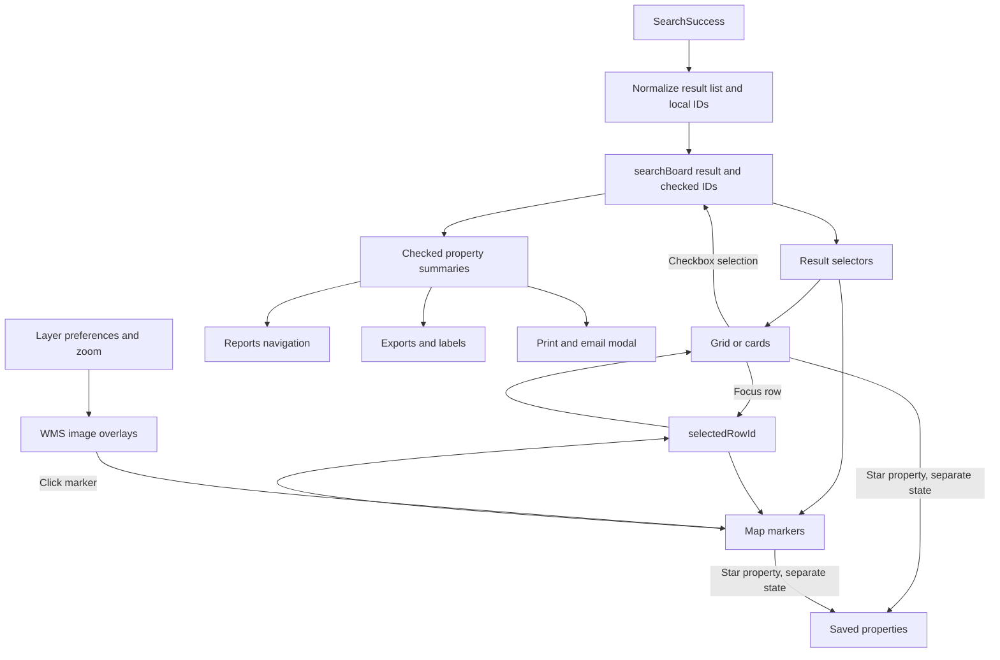

# Results, grid/map synchronization, and actions

[Project context](../../project-context.md) | [Search](index.md)

**Confirmed:** source at `a6f611ae0`, 2026-09-25.

## First understand three independent states

1. **Result list:** returned property summaries, normalized for display.
2. **Checked properties:** records included in batch actions and, on desktop, visible result pins.
3. **Focused row:** the currently highlighted property/info window; this is not the entire checked selection.

`PropertyUtil.getPropertySummaryList` generates local `_id` values and copies identifier fields into `propertyData`. Search selection uses those temporary `_id`s. Favorite comparison uses `parcelId|fipsCode|parcelSeqNumber` instead; server favorite persistence uses yet another combination explained in [saved items](../../feature-flows/saved-searches-and-favorites.md).

Evidence: `phoenix/src/app/shared/utils/property-util.ts:18-55,139-162`; `phoenix/src/app/store/search-board/search-board.reducer.ts:226-248,358-375`.

## Result branching before rendering

`SearchEffects.handleSearchResults$` handles export requests first. It then auto-opens a single result if the preference permits, checks list length `>= currentLimit`, and finally chooses suggestion or ordinary success.

- **Ordinary success:** reducer normalizes the returned list, initially checks all its rows, resets page to zero, and stores the list length as result total. That displayed total is not necessarily the provider’s original total.
- **Mobile:** limit is 500; success closes the side panel and unchecks all when there is more than one result.
- **Limit dialog:** Show Results slices to the limit; Create Labels/Export starts those flows; Refine or dismissal does not replace the grid with that response.
- **Suggestions:** opens a selection modal; accepting identifiers launches Quick Search again with no text criteria.
- **Empty list:** execution effect shows a warning; ordinary success can install an empty list.
- **Failure:** My Search failure only clears `submitFormTrigger`, not the old result list. Quick Search’s failure effect shows a ribbon without dispatching SearchFailure. Do not mistake previous rows for a successful new query.

Evidence: `phoenix/src/app/store/search/search.effects.ts:128-224,265-445`; `phoenix/src/app/store/search-board/search-board.reducer.ts:358-400`; `phoenix/src/app/store/search-board/search-board.model.ts:15-20`.

## Interaction diagram

Result pins and WMS overlays share the map surface but do not share the same retrieval flow. Evidence: selectors at `phoenix/src/app/store/search-board/search-board.selector.ts:81-163`; grid handlers at `phoenix/src/app/search/components/grid/grid.component.ts:208-265`; map subscriptions at `phoenix/src/app/search/components/map/map.component.ts:442-520`.

## Layout, selection, and map behavior

The search shell supports split/map/list proportions, desktop table/card choice, column/card customization, and mobile cards. It passes checked summaries to the map and action bar and checked IDs/focused row to the table. “Show Only Selected Rows” changes a selector; it does not send another search.

`selectCheckedSearchResult` resolves checked IDs back to actual summaries, dropping unmatched IDs. `selectSearchResult` switches between all and checked rows. Desktop pagination slices the selected view; mobile additionally filters by photo/status and applies its sort preference.

AG Grid’s selection callback dispatches `ChangePropertySelection` after comparing IDs to avoid redundant feedback. Focus dispatches `SelectRow`; double-click emits a property-details request. Map marker clicks also dispatch `SelectRow`, so focus works both directions.

Map result construction filters properties with a truthy latitude **or** longitude; it is not a strict both-coordinate validation. Desktop marker visibility follows checked IDs. The mobile selector named `selectCheckedPropertyIdsForMobile` returns all result IDs, a deliberate distinction from desktop checkbox-driven pin visibility in this implementation.

Evidence: `phoenix/src/app/search/components/search/search.component.html:39-218`; `phoenix/src/app/store/search-board/search-board.selector.ts:101-159`; `phoenix/src/app/search/components/grid/grid.component.ts:230-265`; `phoenix/src/app/search/components/map/map.component.ts:442-450,477-519,1067`.

## Overlays and map controls

Trends use overlay slot 0, premium tools slot 1, and boundary/distressed/sales/MLS/location/property-characteristic layers subsequent slots. Premium overlays require My Search plus the preference/access checks. `getWmsOverlay` debounces one second and excludes layers that require zooming in/out. Opacity is applied separately.

Clicking open map space at zoom 15 or above can identify a parcel; CTRL-click with a selected trend or flood layer takes a different popup path. An info window displays address/owner/tax ID, summary values, premium values or `N/A`, photos where available, parcel dimensions, reverse MLS link where available, favorite star, and Report action.

Evidence: `phoenix/src/app/search/components/map/map.component.ts:730-783,893-936,1621-1642`; `phoenix/src/app/search/models/map.constants.ts:8-9`; `phoenix/src/app/search/components/map/info-window/info-window.component.html:1-96`. Full transport and no-data behavior belongs to [maps and property lookup](../../feature-flows/maps-and-property-lookup.md).

## What action buttons actually do

| Action | Browser handoff | Important condition |
| --- | --- | --- |
| Reports | `NavigationService.openReports` sets report properties and navigates to `/reports` with route state/query type | Requires checked records; report availability still evaluated separately |
| Double-click / single-result auto-open | `openSingleReport` / property-details event | Can select one property without representing a batch operation |
| Quick/custom export | `StartQuickExport` / `StartCustomExport` | No checked rows disables export; not merely CSV serialization of rendered cells |
| Labels | `StartLabelsExport` | Hidden if label preference is `N`; requires selection |
| Print/email | `OpenActionBarModal` with identifiers and map-disabled flag | Modal distinguishes map/table/cards/property-detail output and preference limits |
| Postcards | `OpenPostcardsModal` | Feature preference and nonempty selection |
| Favorite star | `UpdateSavedProperties` in separate saved state | 50-property UI limit; not the grid checked set |

Evidence: `phoenix/src/app/shared/components/action-bar/action-bar.component.ts:55-145` and `.html:1-65`; `phoenix/src/app/search/services/navigation.service.ts:49-58,116-123`; `phoenix/src/app/search/components/search/search.component.ts:554-575`.

Print/email enablement is not a blanket “selection required” rule: its computed condition is `mapDisabled && (selectedRecords === 0 || selectedRecords > maxLimit)`, allowing map-oriented output in other layouts. `SearchBoardActionBarEffects` branches into map capture, table/cards with requested fields and identifiers, map+table, or property reports; premium fields can be filtered from table output.

Purchasable reports are downstream of report navigation/availability, not an automatic search purchase or a generic button in this action bar. See [report availability](../reports/availability-and-access-rules.md), [commerce/credits](../../feature-flows/cart-checkout-and-report-credits.md), [exports and labels](../../feature-flows/exports-and-mailing-labels.md), and [PDF flow](../../feature-flows/pdf-generation-and-download.md).

Evidence: `phoenix/src/app/shared/components/action-bar/action-bar.component.ts:78-99`; `phoenix/src/app/store/search-board-action-bar/search-board-action-bar.effects.ts:104-145,170-240`.

## Debugging and test evidence

| Symptom | First checks |
| --- | --- |
| Rows but missing map pins | Coordinates, desktop checked IDs, show-selected selector, mobile selector difference |
| Clicking pin focuses wrong row | `_id` propagation and `selectedRowId`, not just APN |
| Results visible after failed search | Failure branch preserves old list |
| Missing layer but valid result cards | Layer zoom/access and WMS response, not property-search HTTP |
| Export/report includes unexpected rows | `selectCheckedSearchResult` and payload identifiers |
| Save star differs from selection | Favorite combined identity versus generated row `_id` |

Existing source tests include `phoenix/src/app/search/components/grid/grid.component.spec.ts:206` for row-focus dispatch, `phoenix/src/app/store/search-board/search-board.reducer.spec.ts:198-205,349` for selection/result handling, and `phoenix/src/app/search/components/search/search.component.spec.ts:428-445` for favorite dispatch. They were inspected as evidence, not run.

**Unknown:** effective user grid/card templates, action limits, and deployed report entitlements. This page describes representative search-result interactions, not every report-action implementation.
