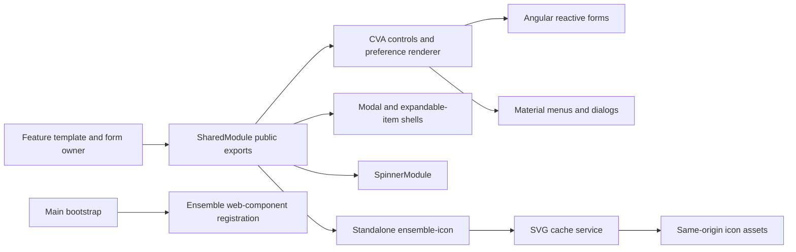

# Shared components and UI patterns

[Frontend index](index.md) | [Project context](../project-context.md) | [Separate User Guide](user-guide-application.md)

**Research baseline:** 2026-09-25, branch `RP-10188`, revision `a6f611ae0654e2bf62deec0a7d5c1d333348d6be` (`a6f611ae0`). **Method:** static inspection of TypeScript, HTML, SCSS, module declarations, and representative test source; no builds, tests, installations, or browser checks performed. Paths below are Windows repository-relative paths, followed by source line numbers. **Confirmed** means directly supported by source; **Inferred** identifies a likely consequence not reproduced at runtime.

## Purpose and boundary

Shared UI supplies the recurring controls, dialogs, headers, preference fields, loading indicators, and visual language that make Realist screens consistent. It is **not a separately built, dependency-free design-system library**: several shared controls import application store models, selectors, services, or feature components. For example, `EmailFormComponent` injects `Store<AppState>`, while `ModalMultiSelectComponent` imports two search-owned dialog components. Reusing these classes outside Phoenix requires their dependencies, not just their templates.

Evidence: `phoenix\src\app\shared\components\email-form\email-form.component.ts:1-13,58-79`; `phoenix\src\app\shared\components\modal-multi-select\modal-multi-select.component.ts:1-10,124-148`.

This page owns reusable UI contracts and representative implementation patterns. Search-field generation, report rendering, analytics, and commerce behavior belong to their feature chapters, not this catalogue.

## Module and rendering map

| Entry point | Actual responsibility and boundary |
| --- | --- |
| `phoenix\src\app\shared\shared.module.ts:103-165,166-273` — `SharedModule` | Declares application UI, exports a selected public surface, and imports Angular common/reactive forms, CDK drag/drop, Material, Quill, Bootstrap-related modules, router directives, and `NgOptimizedImage`. Declaration does not automatically mean export: `UserGuideMenuComponent` is declared but not in the export list. |
| `phoenix\src\app\shared\shared.module.ts:8-24,90-101` | Material imports mix legacy dialog/menu/tooltip/form controls with non-legacy expansion/date/badge controls. Both ngx-bootstrap and ng-bootstrap facilities appear. Do not treat this as an all-MDC Material migration or one uniform widget toolkit. |
| `phoenix\src\app\shared\shared.module.ts:237-271` | Uses `CUSTOM_ELEMENTS_SCHEMA`; registers `CustomDateProvider`, `DATE_FORMATS`, legacy-dialog defaults `{ hasBackdrop: false }`, `ApplicationRef`, and `provideHttpClient(withInterceptorsFromDi())`. Importing the module is not provider-free. Per-dialog options can override defaults. |
| `phoenix\src\app\shared\spinner.module.ts:7-20` — `SpinnerModule` | Small module declaring/exporting spinner and spinner-circle, imported/exported by `SharedModule`. |
| `phoenix\src\app\shared\components\ensemble-icon\ensemble-icon.component.ts:20-44`; `phoenix\src\app\shared\shared.module.ts:233,266` | `EnsembleIconComponent` is standalone and imported/exported, rather than declared, by `SharedModule`. |
| `phoenix\src\main.ts:5`; `phoenix\src\app\shared\components\header\header.component.html:1-21,110-135` | Main bootstrap imports `@ensemble/components`; the current header uses `en-navbar`, `en-menu`, `en-tooltip`, and the Angular `ensemble-icon` wrapper. `CUSTOM_ELEMENTS_SCHEMA` alone does not register web components. |
| `phoenix\src\app\app.module.ts:13,31`; `phoenix\src\app\help\help.module.ts:5,13` | Root and Help feature modules are concrete consumers of `SharedModule`. |

**Version caveat:** `phoenix\package.json:22-33` declares Angular core/forms/router `^18.2.14` and Material/CDK `^16.2.14`. These are declared ranges, not a claim about installed or resolved versions or compatibility.



Arrows show template/module dependencies and the icon asset request, not a universal NgRx or backend request pipeline. Evidence: module map above; icon cache at `phoenix\src\app\shared\components\ensemble-icon\ensemble-icon-cache.service.ts:57-80`.

## Component contracts: inputs, outputs, and projection

| Component | Input/output contract | What the parent still owns |
| --- | --- | --- |
| `BaseModalComponent` / `rlst-modal` | Inputs `header`, `isNewModal`, `hideCloseButton`, `rlstTooltip`; output `closeModal: EventEmitter<void>`. Projects body content. Uses **Default** change detection. | Opening/closing a dialog and committing data. The close button emits; this component does not inject a dialog reference or close itself. |
| `ExpandableItemComponent` / `rlst-expandable-item` | Inputs include `title`, `panelClass`, `expanded`, `disabled`, `noTitlecase`, `index`, `isPremium`; output `toggleOpen<boolean>` from actual Material opened/closed events. Projects `.js-panel-header` into the header and other content into the body. | Expanded-state policy and content. The setter opens/closes a `MatExpansionPanel` when available; this is not an `expandedChange` two-way binding. |
| `SpinnerComponent` / `rlst-spinner` | Output `cancelRequest<void>`; visibility comes from `SpinnerOverlayService`. `showCancelableSpinner` is true only for the two named search request action types. | Meaning of cancellation and the handler. An output declaration does not itself cancel HTTP work. |
| `EmailFormComponent` / `rlst-email-form` | Inputs `subject`, `body`, `isNewTheme`, `hideSignature`; parent-facing methods `getValue()` and `isValid()`. Internally composes rich-text controls. | Sending the message and presenting submission failures; this is not a CVA or an output-driven submit component. |

Evidence:

- `phoenix\src\app\shared\components\base-modal\base-modal.component.ts:3-17`; `phoenix\src\app\shared\components\base-modal\base-modal.component.html:1-17`.
- `phoenix\src\app\shared\components\expandable-item\expandable-item.component.ts:6-44`; `phoenix\src\app\shared\components\expandable-item\expandable-item.component.html:1-11`.
- `phoenix\src\app\shared\components\spinner\spinner.component.ts:7-30`.
- `phoenix\src\app\shared\components\email-form\email-form.component.ts:25-61,120-139`; `phoenix\src\app\shared\components\email-form\email-form.component.html:67-87`.

**Concrete existing composition:** Help loops over legal/support sections and projects paragraphs and links into `<rlst-expandable-item [title]="section.label" panelClass="report-section">`, without handling `toggleOpen`. See `phoenix\src\app\help\components\help\help.component.html:39-48`. It demonstrates an uncontrolled panel consumer rather than an invented universal container pattern.

**Caveat:** `ExpandableItemComponent.ngOnChanges()` has a special `index` branch that calls `this.panel.toggle()` immediately and again via `setTimeout`, unlike the guarded `expanded` setter. The branch has no panel-presence guard or timer teardown (`...expandable-item.component.ts:15-25,37-43`). An early matching input can therefore be problematic; this was not reproduced.

## Forms and control-value accessors

A **control-value accessor (CVA)** bridges an Angular form control and a custom UI. Here `NG_VALUE_ACCESSOR` providers connect model writes (`writeValue`), registered change/touched callbacks, and optional disabled-state handling. These implementations differ materially; do not assume textbook CVA behavior across the shared directory.

| Control | Data shape and current behavior | Important caveat |
| --- | --- | --- |
| `FormDropdownComponent` | `options: PreferenceOption[]` with `optionCode`/`optionValue`; value is a string code. `selectValue()` emits the selected code. `setDisabledState()` and `writeValue()` call `markForCheck()`. Trigger blur calls `onTouched()`. | `writeValue()` **also calls `onChange()`**, including when a code has no matching option. `options` must exist before initialization/writes; width is calculated only at initialization. |
| `SelectComponent` | `lookUpData: LookUpData[]` with `code`/`label`; adds a `Select one` sentinel with `code: null`. Keeps `defaultValue` so a later input setter can resolve the selected item. | `writeValue()` calls `onChange(code)`; touched callback is registered but not invoked in its class/template. Disabled writes do not explicitly mark OnPush for checking. |
| `ToggleComponent` | Two `LabelValue` inputs, `defaultOption` and `switchedOption`; value is string/boolean. Initialization writes the default; clicks call `writeValue()`. | Unknown values normalize to default. `writeValue()` emits; no `setDisabledState`, no touched invocation, and neither button declares `type="button"` or `aria-pressed`. |
| `ModalMultiSelectComponent` | Form value is `string[]`; accepts raw codes or code/label strings separated by `MULTI_MODAL_MY_SEARCH`. Lookup arrival fills display labels. Combines input disable and form-control disable in `isDisabled`. | Not a generic independent dialog: imports search-owned selectors. Empty selection is encoded as `['']`; `writeValue()` assumes an array and does not explicitly clear previous selections for an empty array. Check this contract before changing reset behavior. |

Evidence:

- `phoenix\src\app\shared\components\forms\form-dropdown\form-dropdown.component.ts:18-86` and `.html:1-26`.
- `phoenix\src\app\shared\components\select\select.component.ts:17-60` and `.html:1-22`.
- `phoenix\src\app\shared\components\forms\toggle\toggle.component.ts:18-41` and `.html:1-10`.
- `phoenix\src\app\shared\components\modal-multi-select\modal-multi-select.component.ts:26-121`.

**Inferred integration risk:** because several `writeValue()` implementations call the registered change callback, programmatic form writes can re-enter form change handling. Toggle initialization can normalize a previously written value back to the default. These are source-visible behaviors to preserve or deliberately review, not claims that every caller currently fails.

### Real preference-renderer example

`PreferenceRendererComponent` accepts an existing `UntypedFormGroup` plus `PreferenceElement` metadata. It does **not** create the form tree. The template checks `visible`/`displayInfo`, switches on `displayInfo.renderId`, and chooses native inputs, dropdowns, radios, list selection, or range controls. Conditional children receive the appropriate nested group recursively.

An actual dropdown binding is:

```html
<rlst-form-dropdown
  [options]="preferenceElement.prefOptions"
  [formControlName]="preferenceElement.prefCode">
</rlst-form-dropdown>
```

Source: `phoenix\src\app\shared\components\preference-renderer\preference-renderer.component.html:1-23,44-65,126-166`; inputs and initialization at `phoenix\src\app\shared\components\preference-renderer\preference-renderer.component.ts:21-58`.

The surrounding `[formGroup]="form"` must already contain `prefCode`; range branches expect `valueFrom`/`valueTo`. Date-picker results set that nested value; touched/error inspection reads `validationError` and `matDatepickerParse` (`...preference-renderer.component.ts:61-86`). `additionalInfo` is parsed with plain `JSON.parse` and no catch (`:40-43`); malformed metadata is not rendered as a friendly validation message.

Do not equate a CSS-disabled wrapper with a disabled Angular control: the renderer input adds a class and influences child presentation. The separate `rlstDisableFormControl` directive actually invokes `NgControl.control.disable()`/`enable()` when its input changes. Evidence: `...preference-renderer.component.html:5-7,60-65`; `phoenix\src\app\shared\directives\disable-form-control.ts:4-17`.

### Validation and email composition

`RlstValidators.getValidators()` maps numeric metadata identifiers to validator factories; unknown types produce `{ validationError: { message: 'Unknown data type' } }`. `BETWEEN` adds the base range validator. `getSingleFieldValidator()` uses a different mapping and skips unrecognized types; the two methods are not interchangeable. See `phoenix\src\app\shared\validators\validators.ts:33-98`.

The email form illustrates a mixed update policy: form-level `updateOn: 'blur'`, but body/signature update on change. It combines Angular email/required validators with `RlstValidators.multiStringValidator`. Reply-to information is store-backed, and signature initialization uses `take(1)`. Labels, inline error blocks, readonly reply-to, and rich-text control bindings are in the HTML. Evidence: `phoenix\src\app\shared\components\email-form\email-form.component.ts:38-47,63-95`; `.html:2-55,67-87`. This documents form composition only, not mail-delivery implementation.

## Change detection and subscription lifetime: actual patterns

**Confirmed: there is no single cleanup convention.**

| Representative code | Actual lifecycle |
| --- | --- |
| `HeaderComponent` | Store, router-event, navigation-data, and breakpoint subscriptions use Angular `takeUntilDestroyed(this.destroyRef)`. Navigation/breakpoint updates call `markForCheck()`; the username subscription shown does not. Evidence: `phoenix\src\app\shared\components\header\header.component.ts:113-173`. |
| `EmailFormComponent`, `PreferenceRendererComponent`, `SpinnerComponent` | Use `@UntilDestroy()` plus `untilDestroyed(this)` from `@ngneat/until-destroy`. Email signature's `take(1)` is separately a one-emission subscription. Evidence: email `:25,63-91`, preference renderer `:14,55-58,72-76`, spinner `:7,24-29` in the component paths above. |
| `EnsembleIconComponent` | Manual `Subject<void>` signals cancel instance subscriptions when name/fill changes and when destroyed; destroy emits and completes both subjects. Success, fallback, and error paths call `markForCheck()`. Evidence: `phoenix\src\app\shared\components\ensemble-icon\ensemble-icon.component.ts:54-118`. |
| `TimerComponent` | `interval(1000)` stops via a time-based `takeUntil(timer(...))`, **not** component destruction. `resetTimer()` starts another interval without cancelling an existing one. Evidence: `phoenix\src\app\shared\components\timer\timer.component.ts:12-37`. |
| `FormDropdownComponent` | Adds a DOM scroll listener to the first `.no-scroll-events` overlay on menu open and removes it on close. No null guard or `ngOnDestroy` fallback is present. Evidence: `phoenix\src\app\shared\components\forms\form-dropdown\form-dropdown.component.ts:74-86`. |

A template `async` pipe, an explicit `markForCheck()`, and a component subscription solve different problems. For example, the current header renders observable values through `async` while its navigation array arrives through a manual subscription (`...header.component.html:3-6,50-64`; `.ts:142-173`). An OnPush annotation alone does not prove all asynchronous assignments refresh correctly.

### Icon loading is a direct-service exception

`ensemble-icon` validates names against a lowercase/digit/hyphen allowlist, chooses an optional `-fill` suffix, and requests `/assets/ensemble-icons/<name>.svg`. Size is integer-clamped to 1–512, otherwise 24. The cache uses `HttpClient.get(..., { responseType: 'text' })`, regex-based SVG preparation, and `shareReplay(1)`; the component injects size and explicitly trusts the resulting HTML. Failed/invalid icons get a circle fallback. This does not dispatch an NgRx action.

Evidence: `phoenix\src\app\shared\components\ensemble-icon\ensemble-icon.component.ts:16,41-51,78-125`; `phoenix\src\app\shared\components\ensemble-icon\ensemble-icon-cache.service.ts:8-43,57-80`.

**Caveats:** cancellation of a component subscription is not proof of cancelling the underlying HTTP request: the cache uses `shareReplay(1)` without ref-count configuration. The regex preparation plus `bypassSecurityTrustHtml` is a reviewed-static-asset trust boundary, not evidence of a general-purpose sanitizer safe for arbitrary uploaded SVG. No icon security tests were found alongside these two files.

## Styling and accessibility

**Confirmed styling stack:** `phoenix\src\styles.scss:1` imports `scss/styles`; `phoenix\src\scss\styles.scss:1-32` composes base/typography/forms/Material/modal/tooltip styles and then Ensemble styles, compatibility variables, and Realist fixups. Workspace styles also load Bootstrap and CoreLogic UI (`phoenix\angular.json:49-60`). Component SCSS uses shared `vars`/`mixins`, utility classes, and responsive mixins; dropdown sizes and disabled appearance are concrete examples (`phoenix\src\app\shared\components\forms\form-dropdown\form-dropdown.component.scss:1-60`).

Positive source examples and review caveats:

- Modal close has `aria-label="Close"`, `type="button"`, and screen-reader text (`...base-modal.component.html:5-14`). Dialog focus management is the enclosing dialog's responsibility.
- Dropdown trigger/options are native buttons with Material menu directives; decorative chevrons use `aria-hidden` (`...form-dropdown.component.html:1-24`). The trigger does not explicitly set button type; check form submission behavior in a real form.
- Tooltip defaults are 600 ms show, 200 ms hide/touch-end, and `touchGestures: 'off'` (`phoenix\src\app\shared\directives\tooltip.directive.ts:4-25`). A tooltip is not a substitute for an accessible control name.
- Email native fields have explicit `for`/`id` pairs (`...email-form.component.html:5-9,21-24,35-51`).
- Preference checkbox markup hard-codes `id="exampleId"` and `aria-labelledby="exampleId"` inside a reusable renderer (`...preference-renderer.component.html:26-34`). Multiple instances can duplicate the label target. Its dropdown label targets the preference code, but the basic dropdown instance does not pass that identifier into its native trigger (`:14-19`).
- Global styles suppress outlines with `!important` (`phoenix\src\scss\styles.scss:71-84`). Other focus styles may compensate in some controls, but this is **not** evidence of keyboard-accessibility compliance.
- Toggle selected state is expressed through CSS `.active`, not `aria-pressed` (`...forms\toggle\toggle.component.html:1-10`; `.scss:7-15`).

These are source observations, not a completed keyboard/screen-reader, contrast, or responsive audit.

## Representative tests and safe change locations

Existing tests were **read, not run**:

| Test source | What it actually asserts |
| --- | --- |
| `phoenix\src\app\shared\components\base-modal\base-modal.component.spec.ts:9-34` | Component creation and default/overridden tooltip label; not close-output emission, focus trapping, or accessibility. |
| `phoenix\src\app\shared\components\modal-multi-select\modal-multi-select.component.spec.ts:12-29,48-100` | Reactive-form host retains raw and encoded preselection with a stable empty lookup array through repeated detection; disabled removal remains disabled and does not emit. |
| `phoenix\src\app\shared\validators\validators.spec.ts:13-139` | Representative numeric validation: negative/decimal/grouped input, min/max errors, precision, custom separators, and invalid separators. This is not an exhaustive summary of the full test file. |

For a small UI change:

1. Identify the declared/exported class in `SharedModule`; do not update `old-header` merely because the filename matches. Active header imports are `shared.module.ts:30,85,87`.
2. Read TS **and** HTML to identify whether the public contract is a CVA, an output, projection, or a parent-called method.
3. Follow disabled, touched, reset, and asynchronous lookup behavior before changing form values; use the multi-select host test as a regression-test pattern.
4. For visual changes, inspect global Material/Ensemble overrides as well as component SCSS. For icons, inspect both the wrapper and its asset cache.
5. For dialogs/listeners/streams, establish the actual teardown mechanism rather than adding another convention blindly.

These are recommended review steps; this documentation task changed no application code.

## Known gaps and integration handoff

- **Confirmed scope limit:** representative controls were researched deeply; custom calendar internals, every pipe/directive, every modal, and all style overrides were not exhaustively audited.
- **Unknown:** rendered keyboard behavior, actual focus visibility, third-party web-component internals, and whether the CVA/timer edge cases affect deployed workflows. Reproduce under the owning UI team's normal validation process.
- **Documentation integration:** this page is linked from the frontend index. Main navigation and the completion ledger remain coordinator-owned.
- **Validation:** core/frontend sibling links and the related Search chapter resolve. The separately owned testing/quality chapter was still pending during integration checking. Full-path source citations were checked for file existence and line bounds; diagrams were reviewed as source text, not rendered.

Related chapters: [Bootstrap and routing](bootstrap-and-routing.md), [State and API flow](state-management-and-api-flow.md), [Feature map](feature-map.md), [Search controls](search/dynamic-fields-and-lookups.md), [Testing and quality](../development/testing-and-quality.md), and [User Guide application](user-guide-application.md). Cross-chapter destinations may be pending in the concurrently authored documentation set.
