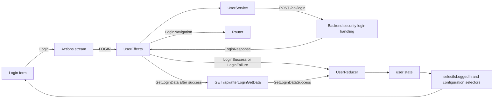
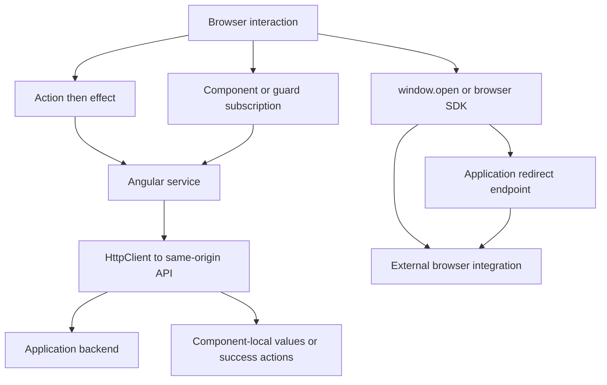

# State management and API flow

[Frontend](index.md) | [Project context](../project-context.md)

**Baseline:** source inspected 2026-09-25 at `RP-10188` / `a6f611ae0`. No application execution. **Confirmed** denotes source evidence; **Inferred** denotes a consequence requiring runtime verification.

## The mental model

NgRx is the browser's shared coordination mechanism, not the only data-access layer. A component dispatches an **action** describing an event; a **reducer** updates a state object; an **effect** reacts asynchronously, often calling an Angular service; a **selector** derives the values components display. Services generally supply HTTP contracts. Some components, guards and browser integrations bypass effects, and some requests never update the store.

The store contains client snapshots, selection state and request status. It is not the system of record for server sessions, saved preferences, property data or purchases.

## What is actually registered

The authoritative inventory is `phoenix\src\app\app-state.module.ts:43-65`, not the list of folders under `store`. These **nine keys** are passed to `StoreModule.forRoot`.

| Root key | Reducer and responsibility | Representative source |
| --- | --- | --- |
| `searchBoard` | `SearchBoardReducer`: search results/fields, selected and checked rows, grid/map layout, map overlays, lookup and search UI state | `phoenix\src\app\store\search-board\search-board.reducer.ts:50-135` |
| `user` | `UserReducer`: nested `user` identity/config/preferences, login state/errors, mobile and help state | `phoenix\src\app\store\user\user.reducer.ts:21-44,58-149` |
| `reports` | `ReportsReducer`: report data and per-report UI/loading/download state | `phoenix\src\app\store\reports\reports.reducer.ts:20-71` |
| `savedProperties` | `SavedPropertiesReducer`: favorite property list and checked property identifiers | `phoenix\src\app\store\saved-properties\saved-properties.reducer.ts:8-63` |
| `settings` | `SettingsReducer`: editable preference hierarchy | `phoenix\src\app\store\settings\settings.reducer.ts:4-22` |
| `orders` | `OrdersReducer`: cart/offers, order history/detail, payment UI selections | `phoenix\src\app\store\orders\orders.reducer.ts:4-85` |
| `whatIsNew` | `WhatIsNewReducer`: all/enabled/read/unread announcements and content selection | `phoenix\src\app\store\what-is-new\what-is-new.reducer.ts:4-44` |
| `propertyDetailsShare` | `propertyDetailsShareReducer`: request identifier, idle/loading/ready/error, response/error message | `phoenix\src\app\store\property-details-share\property-details-share.model.ts:3-15` |
| `sharedReportEmail` | `sharedReportEmailReducer`: request identifier, idle/sending/sent/error and error message | `phoenix\src\app\store\shared-report-email\shared-report-email.model.ts:1-11` |

The sharing keys are optional in the TypeScript `AppState` interface but **are registered** in the reducer map. No root `dashboard`, `search`, `preferences`, `export`, `labels`, `purchase`, `customHeaders` or `propertyIntelligence` slice is registered. No `StoreModule.forFeature` call was found under `phoenix\src`; UI areas can still store data in existing slices or component fields.

### Effect families are a different inventory

`EffectsModule.forRoot` registers fifteen families (`phoenix\src\app\app-state.module.ts:122-138`):

| Families | Coordination responsibility |
| --- | --- |
| `UserEffects` | Login/configuration, session, EULA, help contacts, Dashboard and Property Intelligence preferences |
| `SearchEffects`, `SearchBoardEffects`, `SearchBoardActionBarEffects` | Searching and shared results/map/action orchestration |
| `PreferencesEffects`, `CustomHeadersEffects` | Preference/template changes and custom output configuration |
| `ExportEffects`, `LabelsEffects`, `PurchaseEffect` | Export, labels and purchase-related side effects |
| `ReportsEffects`, `SavedPropertiesEffects`, `OrdersEffects` | Report loading/actions, favorites, cart/orders |
| `WhatIsNewEffects` | Announcement loading/read state |
| `PropertyDetailsShareEffects`, `SharedReportEmailEffects` | Shared link generation and email request lifecycles |

Settings has a reducer but its HTTP work is in **`PreferencesEffects`**, not a `SettingsEffects`. `ReportsModule` also declares `EffectsModule.forFeature([ReportsEffects])` while that class is already root-registered (`phoenix\src\app\reports\reports.module.ts:1-34`). This duplicate declaration is confirmed; do not infer duplicate network requests without inspecting NgRx's effective registration/deduplication at runtime.

Root runtime checks enable strict state/action serializability and immutability. Development-only store devtools retain 25 actions; this is debugging history, not persistent application storage (`app-state.module.ts:109-121`).

## Representative action/request loop

Evidence: `phoenix\src\app\login\components\login\login.component.ts:52-57`; `phoenix\src\app\store\user\user.effects.ts:70-79,191-224,282-292,420-488,531-553`; `phoenix\src\app\store\user\user.selector.ts:47-55`. The backend login URI is handled by security configuration/filter wiring, not an assumed `LoginController.postLogin` method: `realist\web\src\main\java\com\facl\uaf\realist\rest\security\configuration\MultipleLoginSecurityConfig.java:57,129-135,234-244`.

`UserService` sends `{ username, password, mlsGroup }` for manual login. Do not log real values. The response is a configuration-rich `LoginResponse`; the reducer flattens `userAccessOutput.userInfo` into the nested user object and maps many other fields explicitly. Selectors read that transformed shape, not the raw response.

Other flows are less uniform. For example, `PreferencesEffects.saveRegion$` joins current preferences, sends regions, then emits several actions for user regions, new lookups and result counts (`phoenix\src\app\store\preferences\preferences.effects.ts:52-97`). One user action need not equal one HTTP call or one reducer update.

## Direct-service and browser exceptions

The second and third branches are intentional descriptions of current code, not recommendations.

| Path outside the usual effect loop | Actual behavior and evidence |
| --- | --- |
| Dashboard county statistics | Parent subscribes to `DashboardService`; displayed `sections` are local component state. [Dashboard data flow](dashboard/widgets-and-data-flow.md) owns endpoint matching. |
| Recently viewed Dashboard properties | Widget calls its service directly rather than requiring a root history slice. See the same Dashboard chapter. |
| EULA route gate | `EulaGuard.confirmEula` calls `EulaService.getEulaText`, then a dialog (`phoenix\src\app\shared\guards\eula.guard.ts:39-54`). |
| Session keep-alive | `restartSessionTimer` starts a nested `UserService.keepSession().subscribe()` inside an effect tap, separate from the timer stream (`phoenix\src\app\store\user\user.effects.ts:350-367`). |
| Branding Center | `window.open('/api/branding/center', '_blank')`, not HttpClient; server returns a redirect (`phoenix\src\app\settings\components\branding-settings\branding-settings.component.ts:39-44`; `realist\web\src\main\java\com\facl\uaf\realist\rest\controller\BrandingController.java:67-98`). |
| Google Maps script | Loader uses `HttpClient.jsonp` against the external Maps script with a runtime-selected key (`phoenix\src\app\dashboard\components\google-map\services\google-map-loader.ts:1-23`). Values are deliberately omitted here. |
| Mixpanel | Browser SDK initialization/tracking; project selection is currently hostname-derived in service source, not exclusively the login token (`phoenix\src\app\shared\services\mixpanel.service.ts:15-21,40-65`). |
| Pendo | Login success calls `window.pendo.initialize`; no readiness guard is present in that method (`phoenix\src\app\store\user\user.effects.ts:588-603`). |

Thus the earlier project-context claims “no direct API calls from components” and “frontend never calls external APIs directly” do not describe this revision.

## HTTP provider and interceptor caveats

**Confirmed registrations:**

1. `AppModule` adds `MockBackendInterceptor` to the `HTTP_INTERCEPTORS` multi-token (`phoenix\src\app\app.module.ts:36-42`).
2. `SharedModule` provides `provideHttpClient(withInterceptorsFromDi())` (`phoenix\src\app\shared\shared.module.ts:266-272`).
3. `MapModule` imports Shared and provides `provideHttpClient(withJsonpSupport())` (`phoenix\src\app\search\components\map\map.module.ts:15-32`).
4. Eager Search imports Map, while multiple lazy modules import Shared.

**Inferred/unknown:** overlapping providers and injector boundaries can change which configured client a consumer receives. Do not state either “all HTTP is intercepted” or “the interceptor never runs” based only on provider text. Root and lazy consumer injection contexts were not executed. JSONP and browser SDK traffic are also different from same-origin API requests.

The interceptor's cache path is currently inert: `MockBackendService.enabled` returns hardcoded `false`, so `shouldCache` returns false and requests pass through. Its constructor still initializes a localStorage flag and exposes console controls; their “enabled” message does not override the hardcoded getter. The separately defined subheader mock meta-reducer also is not active by registration.

Evidence: `phoenix\src\app\shared\interceptors\mock-backend.interceptor.ts:11-31`; `phoenix\src\app\shared\services\mock-backend.service.ts:17-32,52-57,86-92`; `phoenix\src\app\app-state.module.ts:85-102,141-149`.

Most service URLs are `/api/...`. `PreferenceService.saveEmailSignature` uses `api/preference/save-email-sig` without the leading slash (`phoenix\src\app\search\services\preference.service.ts:45-47`), so URL resolution also depends on the document base. Development forwarding is defined in `phoenix\proxy.config.mjs:1-47`; it is not a server-side authorization layer. No general auth/error interceptor is registered in the inspected application source.

## Loading, cancellation and failure are per-flow

`SpinnerOverlayService` tracks an array of action names, permitting overlapping requests (including repeated names). Its `wrapRequest` uses `switchMap`, subscribes to an optional cancellation stream with `takeUntil`, and removes the spinner entry in `finalize`. The default cancellation observable is `NEVER`.

Evidence: `phoenix\src\app\shared\services\spinner-overlay.service.ts:12-51`.

- A new value through the **same wrapped pipeline** unsubscribes its previous inner request. This is not a global cancellation policy.
- Cancellation only applies to requests wired to that stream. Search explicitly passes `CANCEL_MY_SEARCH_REQUEST`; root `CancelRequest` is not proof that every dashboard, SDK or backend operation is cancelled.
- Unsubscribing a browser HTTP observable does not guarantee a server operation has been rolled back.
- Direct Dashboard requests can have their own spinner and concurrency choices.

Search examples illustrate inconsistency rather than a universal failure pattern: My Search produces `SearchFailure` and an error ribbon; Quick Search catches to `undefined` and filters it out. Both warn on empty results. Evidence: `phoenix\src\app\store\search\search.effects.ts:103-168,170-225`; [Search](search/index.md) owns the full search lifecycle.

Other important outcomes:

| Operation | Source behavior |
| --- | --- |
| Post-login metadata/geography | Errors become `undefined` and are filtered; no success state arrives. Geography resolver can continue waiting. `user.effects.ts:282-306`. |
| Logout HTTP failure | Error becomes `EMPTY`, so no `LogoutSuccess` is emitted after the storage marker was removed. `user.effects.ts:242-260`. |
| EULA update | Browser reducer marks accepted on action; failed server update is swallowed. `user.reducer.ts:202-212`; `user.effects.ts:335-341`. |
| Dashboard widget order | Store update is optimistic; persistence effect has no local rollback. [Personalization](dashboard/configuration-and-personalization.md). |
| RSS / analytics preference errors | Some callbacks use `catchError(() => void(0))`, not an observable recovery value; this is not a valid “silent success” policy. `user.effects.ts:81-90,148-157`. |
| Settings save | Editable hierarchy changes before HTTP success; effect shows an error ribbon but no rollback. See [settings](feature-map.md#settings-and-branding-a-concrete-change-path). |

Paths abbreviated in this table are under `phoenix\src\app\store\user\`.

## Session, logout and browser storage

`BrowserStorageService` is a wrapper over **sessionStorage**, not localStorage. Its defined keys are `loggedIn` and `returnUrl` (`phoenix\src\app\shared\services\browser-storage.service.ts:8-22`; `phoenix\src\app\shared\models\browser-storage.model.ts:1-4`). Restoration requests current server data; it does not rehydrate all reducers from that marker.

`SessionTimerService` defaults to a 30-minute timeout and a five-minute warning period, then schedules the warning at `timeout - warningDelay`. User effects refresh the session, replace the timer on restart, and race the expiration dialog against its timer. The warning also has a five-minute fallback `setTimeout`. Keep-session confirmation triggers another backend call; errors can dispatch logout. Source: `phoenix\src\app\shared\services\session-timer.service.ts:4-18`; `phoenix\src\app\store\user\user.effects.ts:350-407`. These timers are browser UX; the server owns actual session validity.

### `storeClear` is not registered

`storeClear` would replace the whole state with `undefined` and remove `hmrState` on `LOGOUT_SUCCESS`. However, `StoreModule.forRoot` has no `metaReducers`, and the `forRoot` providers array has only a commented subheader-mock registration. No other application registration was found. Therefore **a global logout reset must not be claimed**.

`UserReducer` independently handles `LOGOUT_SUCCESS` by setting `state.user` to null. The root auth selector then becomes false. That is different from clearing reports, orders, favorites and all browser storage.

Evidence: `phoenix\src\app\app-state.module.ts:67-76,105-149`; `phoenix\src\app\store\user\user.reducer.ts:214-218`; `phoenix\src\app\store\user\user.selector.ts:47-55`.

Local storage has separate uses: navigation-panel collapsed state (`phoenix\src\app\shared\services\navigation.service.ts:211-235`), mock cache controls, and subheader snapshots. Raw session/local storage access also appears outside `BrowserStorageService`, so the older “always use the wrapper” assumption is false.

## Source-level caveats and test evidence

`SettingsReducer` has no default branch/return at all (`phoenix\src\app\store\settings\settings.reducer.ts:8-22`). Unhandled actions can therefore return `undefined`, contrary to the usual reducer contract. This is a confirmed source anomaly and an inferred runtime risk, not a bug fixed during this docs-only task.

Representative tests were read, not run:

- `phoenix\src\app\login\services\user.service.spec.ts:13-69`: separate HTTP testing providers; assertions for login/direct-login/logout method and body. This does not validate application injector composition.
- `phoenix\src\app\shared\services\spinner-overlay.service.spec.ts:22-111`: repeated spinner names, inner replacement and cancellation/finalization.
- `phoenix\src\app\shared\guards\auth.guard.spec.ts:50-219`: browser restoration and return URL cases.

**Unknown:** current test pass rate; effective root/lazy HTTP clients; deployed session durations; external SDK availability. No new tools were installed to resolve these. Debug state ownership first, then action/effect, then service URL, then the matching backend handler—not a presumed universal pipeline.

Related: [bootstrap](bootstrap-and-routing.md), [shared UI](shared-components-and-ui-patterns.md), [feature map](feature-map.md), [backend API map](../backend/api-and-feature-map.md), [login/session flow](../feature-flows/login-and-session-lifecycle.md), [external integrations](../cross-cutting/external-integrations.md), [testing and quality](../development/testing-and-quality.md).
