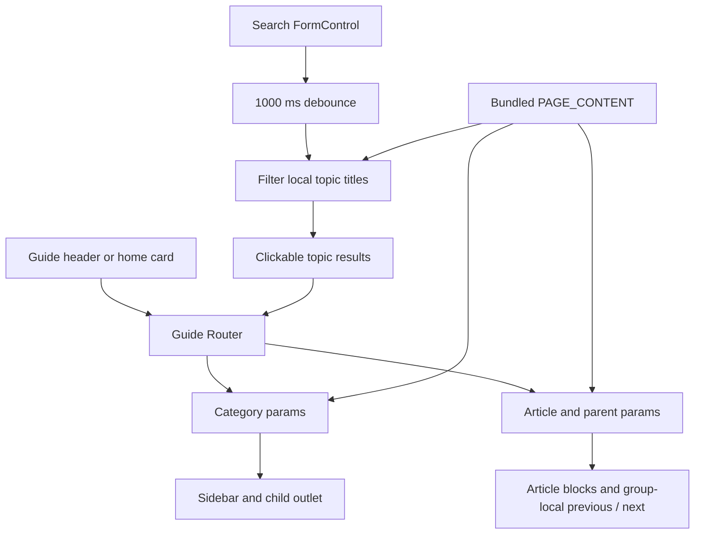
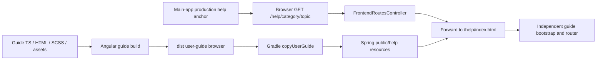

# Separate User Guide application

[Frontend index](index.md) | [Project context](../project-context.md) | [Shared UI patterns](shared-components-and-ui-patterns.md)

**Research baseline:** 2026-09-25, branch `RP-10188`, revision `a6f611ae0654e2bf62deec0a7d5c1d333348d6be` (`a6f611ae0`). **Method:** source/build-definition inspection only; no builds, tests, installations, network requests, or servers. Paths are Windows repository-relative with line references. **Confirmed** denotes direct source evidence; **Inferred** denotes an unexecuted consequence; **Unknown** denotes an unresolved runtime/deployment boundary.

## What users get, and what this application is not

The User Guide is a separately bootstrapped Angular application containing authored instructions, screenshots, and video links. Users browse categories or search topic titles. It is not the main application's guarded support/contact screen, despite both being reachable through the main header's Help menu.

| Surface | Entry and responsibility |
| --- | --- |
| Main-app Help menu | `UserGuideMenuComponent` lists popular topics, opens the guide in a new tab, and separately offers an in-app Help action. |
| User Guide | Production-style path `/help/`; independent Angular `AppModule`, router, and static `PAGE_CONTENT`. |
| Main-app support | Angular route `RootRoutes.Help`, whose value is **`support`**, guarded by `AuthGuard` and lazy-loading `HelpModule`. Contains contacts and legal/privacy content. |

Evidence: `phoenix\src\app\shared\components\header\user-guide-menu\user-guide-menu.component.ts:15-75` and `.html:7-19`; `phoenix\src\app\root-routes.ts:16`; `phoenix\src\app\app-routing.module.ts:99-103`; `phoenix\src\app\help\help-router.module.ts:5-15`.

## Bootstrap and application boundary

**Confirmed bootstrap chain:**

1. `phoenix\projects\user-guide\src\index.html:1-13` supplies its own document, title, `<base href="/">`, and `<app-root>`.
2. `phoenix\projects\user-guide\src\main.ts:1-12` imports the guide's own `environment`, optionally calls `enableProdMode()`, and runs `platformBrowserDynamic().bootstrapModule(AppModule)` with console-error handling.
3. `phoenix\projects\user-guide\src\app\app.module.ts:15-34` declares root/header/search/navigation/home/category components; imports only `BrowserModule`, `AppRoutingModule`, and `ReactiveFormsModule`; has an empty `providers` array.
4. `phoenix\projects\user-guide\src\app\app.component.html:1-2` renders a guide-specific header and root router outlet. It does not render Phoenix's main shell.

### Does it share state or runtime configuration?

**Confirmed:** the guide module does not import Phoenix `AppStateModule`, `SharedModule`, NgRx store modules, or HTTP providers/interceptors. Its category/search/header code imports the local `PAGE_CONTENT` constant. Its development and production environment files contain only `production: false`/`true` (`phoenix\projects\user-guide\src\environments\environment.ts:5-7`; `environment.prod.ts:1-3`).

A scoped scan of the guide's TypeScript sources found no `HttpClient`, `Store`, `AppState`, `localStorage`, `sessionStorage`, `APP_INITIALIZER`, or `fetch(...)` consumer. The relevant environment consumer is its bootstrap. Thus there is **no source-supported sharing of the main app's live NgRx state, user configuration, login response, or interceptors**. The main menu shares a **URL**, not an application-store instance.

It does share a workspace/dependency installation, build packaging, and some compile-time styling inputs. Its style include paths include main `src\assets`/`src\scss`, and its styles load Bootstrap/CoreLogic UI (`phoenix\angular.json:208-254`). This is build-time reuse, not shared application state.

**Unknown:** effective authentication for `/help/**`, reverse-proxy behavior, and deployed cookie/security policy. Being hosted under the same origin can cause browser cookies to accompany asset requests; that does not establish guide code consuming session state. No claim of anonymously accessible production help is made here. Video iframes and external social links are separate browser integrations, not content API calls.

## Routing and navigation

`AppRoutingModule` has only these route shapes:

| Angular route | Component | Behavior |
| --- | --- | --- |
| `''`, `pathMatch: 'full'` | `HomePageComponent` | Welcome/search area plus hand-authored category cards. |
| `:id` | `CategoryComponent` | Finds `PAGE_CONTENT` by `category.url` and renders category navigation. |
| `:id/:item` | Child `SubCategoryComponent` | Finds the article within that category's page groups and renders its blocks. |

There are **no guards, resolvers, lazy modules, wildcard route, or default article redirect in this route declaration**. The category names are content keys, not individually declared route entries. Evidence: `phoenix\projects\user-guide\src\app\app-routing.module.ts:8-30`; `root-routes.ts:1-7`.

Content category status:

| Key | Source content / navigation status |
| --- | --- |
| `getting-started` | Populated category, `phoenix\projects\user-guide\src\app\shared\content.ts:44-55`. |
| `feature-guide` | Populated category begins at `...shared\content.ts:295-297`. |
| `tutorials` | Populated category uses the key at `...shared\content.ts:4261`. |
| `faq` | Key exists, but `pageContent: []` at `...shared\content.ts:4656-4660`; it is not a populated FAQ feature. |

The header derives its links from `PAGE_CONTENT`, skips categories with empty `pageContent`, and chooses the first topic of the first group as the destination. Thus FAQ is omitted from that header. The home-page cards, by contrast, are maintained separately in `homeItems`; they are not generated from the same constant.

Evidence: `phoenix\projects\user-guide\src\app\shared\components\header\header.component.ts:9-26`; header `.html:3-7`; `phoenix\projects\user-guide\src\app\home-page\home-page.component.ts:20-99`; `home-item\home-item.component.html:6-11`.

### Category and article selection

`CategoryComponent.pageData$` maps `ActivatedRoute.params` to a matching category and sets `collapsed = true` during that lookup. In its template, **true means the navigation list is displayed**, despite the field name. Topic links are relative router links; the child article renders inside the category's router outlet.

`SubCategoryComponent.categoryData$` combines its own `:item` with the parent's `:id`. It locates the containing `PageContent` group, then the article, and assigns previous/next links within **that group only**. It does not implement global next-topic navigation across all groups/categories.

Evidence: `phoenix\projects\user-guide\src\app\category\category.component.ts:13-23`; `.html:1-27`; `phoenix\projects\user-guide\src\app\category\sub-category\sub-category.component.ts:23-46`; `.html:29-36`.

### Topic search is local, title-only filtering

`SearchComponent.searchControl.valueChanges` waits 1,000 ms, then scans category topic titles if the original string length is at least two. Matching is case-insensitive and trims the string for comparison. Results contain `url`, `subUrl`, `title`, and `subTitle`; clicking one calls `router.navigate([url, subUrl])` and clears the control. There is no backend search endpoint, full-text indexing, pagination, or body-text search in this implementation.

Evidence: `phoenix\projects\user-guide\src\app\shared\components\search\search.component.ts:14-44`; `.html:1-9`. **Inferred edge case:** two or more spaces pass the pre-trim length check, then match every title through an empty substring. Clearing results is also subject to the debounce.



All arrows describe browser-local navigation/data lookup. Images and videos load separately through their template URLs. The source evidence is the routing, search, category, and sub-category files cited above.

## Content model, rendering, and trust boundary

`PAGE_CONTENT` is a TypeScript-authored hierarchy, not a Markdown folder or remote content-management service:

```text
Category { title, url, pageContent[] }
  PageContent { pageTitle, categories[] }
    SubCategories { categoriesTitle, categoriesUrl, data?[] }
      block { type, data, imgSize?, startAt? }
```

`BlockType` supports text, title, image, bullet list, numbered list, table, and video. `IMG_SIZE` supports `xs`, `s`, `m`, and `l`. Evidence: `phoenix\projects\user-guide\src\app\shared\content.ts:3-44`.

- Titles/text/list items/table cells use Angular `[innerHTML]`; no custom trust bypass is applied to those text blocks in the template.
- Images resolve as `assets/img/` plus the authored filename; alt text is the article's URL slug.
- Numbered lists honor positive `startAt`, otherwise 1.
- “Table” blocks are rendered as nested `<div>` cells, not semantic HTML `<table>` elements.
- Video blocks create an iframe and call `trustResourceUrl()`, which uses `bypassSecurityTrustResourceUrl`. The content author therefore controls a trusted resource URL; do not accept arbitrary user-entered video URLs into this pipeline without reviewing that boundary.

Evidence: `phoenix\projects\user-guide\src\app\category\sub-category\sub-category.component.html:1-26`; `.ts:49-50`.

**Styling:** the guide has its own global `styles.scss`, which imports shared-named typography/mixins/icons and adds body, focus-shadow, and screen-reader-only rules (`phoenix\projects\user-guide\src\styles.scss:1-42`). Article SCSS uses shared `vars`/`mixins`; fixed image widths are overridden to 100% under the mobile mixin (`...sub-category.component.scss:1-34`). This does not mean it imports the full main-app stylesheet or main `SharedModule`.

**Accessibility caveats:** search results are click-only `<li>` elements with no keyboard handler/tabindex in this template; the search input relies on a placeholder rather than an explicit label. Category collapse uses arrow text without `aria-expanded`; video iframe has no title; image alternatives are slugs. Header social links do have alt/screen-reader text. Evidence: search `.html:3-8`; category `.html:20-23`; sub-category `.html:6-12,24-26`; `phoenix\projects\user-guide\src\app\shared\components\header\header.component.html:9-25`. No accessibility compliance claim is warranted.

## Main-app help entry points

The active shared module imports the header and guide menu from `components\header`, not `components\old-header` (`phoenix\src\app\shared\shared.module.ts:30,85`). Follow this current path:

1. `NavigationService.defaultActionItems` includes `Help` with action `openHelp` (`phoenix\src\app\shared\services\navigation.service.ts:53-58`).
2. Current desktop/mobile header templates render action items and call `handleMenuItemClick`; the handler delegates actions to `NavigationService.executeAction` (`phoenix\src\app\shared\components\header\header.component.html:50-70,110-135`; `.ts:322-335`).
3. Registered `openHelp` avoids duplicate instances and opens `UserGuideMenuComponent` as a dialog with `{ asPopup: true }` (`phoenix\src\app\shared\services\navigation.service.ts:95-108`).
4. Popular-topic links and “Go to User Guide” use anchors with `target="_blank"` (`phoenix\src\app\shared\components\header\user-guide-menu\user-guide-menu.component.html:7-19`).
5. `getUserGuideLink()` chooses **main-app build-time** `environment.production`: production uses `window.location.origin + '/help'`; development uses `http://localhost:4201`. `goToExactPage()` appends the article path (`...user-guide-menu.component.ts:59-66`).
6. The separate menu “Help” entry calls `close()` and Angular navigation to `RootRoutes.Help` (`support`), not the guide URL (`...user-guide-menu.component.ts:69-75`).

The support screen is stateful in a way the guide is not: `HelpComponent` selects `selectHelpPageContactInfo`, dispatches `GetHelpPageContactInfo` when absent, and marks for check when received. That is a **main-app** store subscription, not evidence that the separate guide shares the store. Evidence: `phoenix\src\app\help\components\help\help.component.ts:258-274`; contact rendering at `.html:23-37`.

## Build declaration and Spring host handoff

These are **declared commands, not executed commands**, with working directory `phoenix`:

| Command | Definition and boundary |
| --- | --- |
| `npm run start:guide` | `ng serve --project=user-guide --port 4201`; separate dev server. No main-app proxy option in this script. |
| `npm run build:guide` | `ng build --configuration production --project=user-guide --base-href=/help/`. The script supplies the help base path; source `index.html` retains `/`. |
| `npm run build` | Runs `build:phoenix` and then `build:guide`. |
| `npm run lint:guide` | Explicit guide lint target; the guide build script itself does not chain it. |

Evidence: `phoenix\package.json:4-17`.

`angular.json` declares `user-guide` as an **application**, using `@angular-devkit/build-angular:application`, base output `dist/user-guide`, its own main/index/assets/SCSS, and production environment replacement. Production sets optimization and output hashing, but **keeps source maps enabled**. It declares separate Karma/lint/Protractor targets; declarations do not prove they work with the installed toolchain. Evidence: `phoenix\angular.json:208-284,305-345`.

Gradle `buildUserGuide` depends on `npmCi`, declares the guide app source directory plus `angular.json` as inputs, declares `dist/user-guide` output, and invokes `npm run build:guide --force`. Its shown input list does not include the guide's assets, global stylesheet, or environment files; do not assume those alone necessarily invalidate Gradle's up-to-date check. Evidence: `phoenix\build.gradle:127-155`.

The host `copyUserGuide` task copies **`dist\user-guide\browser`**, not the base output directory, into `realist\web\build\resources\main\public\help`, and depends on the guide build. `resolveMainClassName` depends on both frontend copy tasks. This is a packaging relationship, not evidence of two deployed backend services. Evidence: `realist\web\build.gradle:41-57`.



Top arrows are declared build/copy dependencies; lower arrows are controller/browser routing. No executed artifact or deployment is implied. Evidence: build declarations above and `realist\web\src\main\java\com\facl\uaf\realist\controller\FrontendRoutesController.java:42-56`.

### Server deep links are an explicit allowlist

`FrontendRoutesController.helpIndex()` forwards `/help`, `/help/`, and the four known category paths with one topic wildcard to `/help/index.html`. It is not a universal `/help/**` SPA fallback. Adding a category to `PAGE_CONTENT` can therefore make client navigation work while a fresh deep-link request has no equivalent controller mapping.

The same controller redirects `/user-guide`, `/user-guide/*`, `/support`, and `/support/*` to `/help` (`FrontendRoutesController.java:31-56`).

**Confirmed integration discrepancy:** client-side navigation to `/support` resolves to Phoenix's guarded support module, while a server GET of `/support` is declared to redirect to the separate guide. **Inferred user impact:** refreshing or directly opening support may show the guide instead of the contact screen, assuming the request reaches this controller and no earlier security/proxy rule changes it. Effective deployed behavior remains unverified.

## Failure behavior and source-backed caveats

| Condition | Observed implementation / expected consequence |
| --- | --- |
| Unknown category `:id` | Category lookup can return `undefined`, but breadcrumb reads `(pageData$ \| async).title` without optional chaining. Article lookup also dereferences `itemPage.pageContent` without checking the parent. **Inferred:** invalid links can throw instead of displaying a not-found page. Category HTML `:2`; sub-category TS `:25-28`. |
| Unknown article in a valid category | Article lookup returns `null` and resets footer navigation; template renders no article blocks. No explicit not-found message. Sub-category TS `:29-45`; HTML `:1-3`. |
| Bare category or FAQ | No child default redirect; category shell may have no article. FAQ content is empty and header skips it. Routing `:14-23`; content `:4656-4660`; header TS `:10-24`. |
| Last article in a page group | Next-link expression checks `index === categories.length`, although final index is length minus one; out-of-range lookup yields `undefined`, which template `*ngIf` hides. No cross-group advance. Sub-category TS `:31-34`; HTML `:35-36`. |
| “Understanding Searching” menu topic | Points to `/feature-guide/understanding-realist-map-tools`, the same URL as the following map-tools topic. This is a label/destination mismatch, not missing routing evidence. Main menu TS `:32-39`. |
| “Creating Mailing Addresses” home tutorial | Authored URL is `/`, so it returns to guide home, not a tutorial. Guide home TS `:88-91`. |
| Missing image or unavailable video | Template directly references the asset/iframe; no custom error UI is shown in the renderer. Runtime availability and content freshness were not checked. Sub-category HTML `:6-26`. |

Abbreviated paths in this table refer to the guide category/sub-category/header/home files and main menu file cited fully in preceding sections.

## Existing test evidence and content-change checklist

No `*.spec.ts` files were found under `phoenix\projects\user-guide`. The project nevertheless declares a Karma target and has `src\test.ts:3-16`, which initializes Angular testing with `destroyAfterEach: false`.

The existing Protractor source is a scaffold: `phoenix\projects\user-guide\e2e\src\app.e2e-spec.ts:11-21` expects **“Welcome to user-guide!”** and checks severe console logs. Its page object queries `app-root h1` (`app.po.ts:8-9`), while current home markup says **“Welcome to the Realist User Guide!”** (`phoenix\projects\user-guide\src\app\home-page\home-page.component.html:1-5`). This is a source-visible stale assertion, not a reported executed test failure. Main `npm test` scripts explicitly target Phoenix, not the guide (`phoenix\package.json:12-14`).

For a content/navigation change, the owning team should:

1. Update the relevant `PAGE_CONTENT` category/group/article and assets; preserve stable slugs used by deep links.
2. Check both generated header navigation and separately authored home/menu links.
3. For a new category, review `FrontendRoutesController.helpIndex()` as well as Angular routing.
4. Keep the `/help/` build base and Gradle `browser` copy location aligned.
5. Review trusted video URLs, title-search behavior, missing-topic handling, and keyboard interaction.
6. Validate with the existing project tooling after resolving stale test expectations; none was run for this documentation task.

## Known gaps and documentation integration

- **Confirmed:** separate bootstrap, local content navigation/search, build declarations, packaging destination, and controller mappings are source-backed.
- **Unknown:** production availability, anonymous/authenticated access, external video availability, accessibility behavior, and whether all historical topic instructions match current product features. This page deliberately does not validate feature internals owned by other chapters.
- **Integration issues to assign:** `/support` client/server discrepancy; misleading/placeholder help links; empty FAQ; missing invalid-route UX; stale Protractor expectation; Gradle guide input coverage.
- **Documentation integration:** the frontend index links this page; main-context and completion-status integration remain coordinator-owned.
- **Validation:** frontend siblings, main context and authentication chapter resolve. Build/deployment and testing/quality chapters were still pending during integration checking. Full-path source citations were checked for file existence and line bounds; diagrams were reviewed as source text, not rendered.

Related: [Bootstrap and routing](bootstrap-and-routing.md), [State management](state-management-and-api-flow.md), [Shared UI](shared-components-and-ui-patterns.md), [Build and deployment](../development/build-and-deployment.md), [Testing and quality](../development/testing-and-quality.md), and [Authentication and authorization](../cross-cutting/authentication-and-authorization.md). Related destinations may still be pending in the concurrently authored documentation set.
