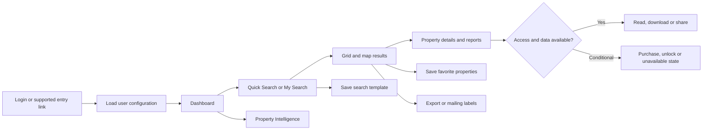

# Business Overview

[Project context](../project-context.md) | [System architecture](system-architecture.md) | [Glossary](glossary.md)

## What the product does

Realist Phoenix is a property-research application. A user searches for properties, compares candidates on a grid or map, opens detailed property and area reports, and turns the research into saved searches, favorite properties, downloadable material, or shared reports. Some content and actions depend on the user's organization, access configuration, property coverage, or purchase/credit conditions.

This is a source-based description of the application's visible workflows, not a contractual product catalogue. Routes and service calls establish implemented capabilities; deployed availability and commercial terms require the owning team.

## People and access

| Actor or context | What the code establishes | Important distinction |
| --- | --- | --- |
| Authenticated user associated with an MLS group | Login resolves user access; subsequent configuration supplies preferences, templates and access information | Organization membership, authentication and report entitlement are separate concepts |
| User entering through an SSO/direct-link path | Separate login/navigation paths converge on the application session and user data | A different entry path does not imply all reports are available |
| User purchasing or unlocking content | Commerce, report availability, and usage/credit operations exist | A purchase, available credits, and provider data coverage are not interchangeable |
| Intended shared-report recipient | Creation/email contracts produce a recipient link, but no recipient-facing reader or lead-capture execution path was found in the inspected source | Do not infer reader authorization or public-page expiry behavior from creation/email/cleanup code |
| Application operator/developer | Security and diagnostics configuration contain operational paths | An end-user administrator persona and authority-assignment process are not fully established merely by those paths |

The exact customer personas and contractual roles are **Unknown** from source alone. The table describes application interactions rather than marketing segmentation.

## Main user journey

Read this as a navigation/business map, not one mandatory transaction. Individual reports and actions use different eligibility rules. The source-backed starting points are `phoenix\src\app\app-routing.module.ts:14-118`, `phoenix\src\app\reports\reports-router.module.ts:9-149`, and the feature services listed below.

## Feature families and their business meaning

| Area | User goal | Start reading |
| --- | --- | --- |
| Dashboard | Return to recent work and personalized widgets | [Dashboard](../frontend/dashboard/index.md) |
| Search | Describe a property or a set of criteria and find matching properties | [Search](../frontend/search/index.md) |
| Saved searches | Reuse a definition of search criteria | [Saved searches versus favorites](../feature-flows/saved-searches-and-favorites.md) |
| Saved properties | Keep a collection of property identifiers | [Saved searches versus favorites](../feature-flows/saved-searches-and-favorites.md) |
| Maps | Understand location, parcels, overlays and nearby property context | [Map flow](../feature-flows/maps-and-property-lookup.md) |
| Reports | View property, comparable, neighborhood and specialist information | [Report catalogue](../frontend/reports/report-catalogue.md) |
| Property Intelligence | Explore aggregate market and valuation-related trends | [Property Intelligence](../frontend/property-intelligence/index.md) |
| Exports and labels | Move selected information into files, mailing labels or supported mailing integrations | [Export flow](../feature-flows/exports-and-mailing-labels.md) |
| Commerce and usage | Purchase eligible products and manage access/usage mechanisms | [Commerce and credits](../feature-flows/cart-checkout-and-report-credits.md) |
| Sharing | Create a report snapshot/link and request email delivery; the recipient reader remains an unverified boundary | [Shared report links](../feature-flows/shared-report-links.md) |
| User Guide | Learn product features through the separately built help application | [User Guide application](../frontend/user-guide-application.md) |

## Five distinctions to learn first

1. **Saved search is not saved results.** Search-template operations persist a reusable definition; favorite-property operations persist property identifiers.
2. **Property Intelligence is not simply a property report.** Its own route hierarchy and service requests support analytics pages. A similarly named report may have a different contract.
3. **The UI is partly configured at runtime.** Login data includes templates, access information, preferences and navigation/widget settings. Two users need not see identical forms or menus.
4. **The application does not own all property data.** UAF action/delegate code calls dependency-provided interfaces. The local PostgreSQL schema is not evidence of a complete property-data warehouse.
5. **Visibility is not authorization or coverage.** A menu item, a frontend route, a server permission, a purchased product and provider data availability are different checks.

## Where responsibility changes hands

The frontend translates user interaction into navigation, local state changes and API calls. The backend combines application state, user configuration and external data. External providers own the implementation behind many property, map, commerce, analytics and PDF boundaries.

Use the [system architecture](system-architecture.md) to locate these boundaries. For commercial definitions or provider coverage, consult the [team questions](../onboarding/known-gaps-and-team-questions.md); do not infer business guarantees from method names.

## Evidence and useful entry points

- `phoenix\src\app\app-routing.module.ts:14-118`: principal application routes and guards.
- `phoenix\src\app\store\user\user.model.ts:243-287` and `user.reducer.ts:58-145`: user/runtime configuration shapes and hydration.
- `phoenix\src\app\search\services\search.service.ts:42-93`: search and lookup contracts.
- `phoenix\src\app\search\services\preference.service.ts:32-43`: saved search-template operations.
- `phoenix\src\app\saved-properties\services\saved-properties.service.ts:13-18`: favorite-property contracts.
- `phoenix\src\app\property-intelligence\property-intelligence-routing.module.ts:11-45`: analytics navigation.
- `phoenix\src\app\orders\services\orders.services.ts:17-124`: commerce requests.

## Scope and unknowns

**Confirmed:** the named route/service families exist in the investigated revision. **Inferred:** the user journey groups these source-backed capabilities into a learning order. **Unknown:** customer-specific configuration, contractual entitlements, actual provider coverage, and which optional features are enabled in a particular deployment.
