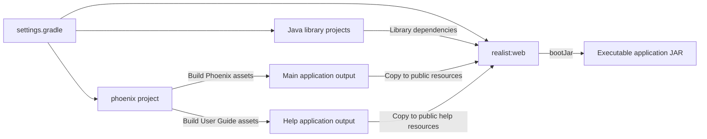

# Repository and Technology Map

[Project context](../project-context.md) | [System architecture](system-architecture.md) | [Code-reading path](../onboarding/code-reading-path.md)

## Annotated repository map

```text
res-realist-phoenix
|-- settings.gradle             Included projects and plugin repository setup
|-- build.gradle                Shared Java/dependency/build configuration
|-- gradle\wrapper              Repository-pinned Gradle distribution
|-- phoenix                    Angular workspace and frontend Gradle tasks
|   |-- src\app                 Main application routes, features and shared UI
|   |   |-- store               Actions/effects/reducers/selectors
|   |   |-- dashboard           Widget-based starting page
|   |   |-- search              Forms, grid/map and search services
|   |   |-- property-intelligence
|   |   |-- reports             Report routes, components and service contracts
|   |   `-- shared              Shared UI, guards, services and utilities
|   `-- projects\user-guide     Separate help application
|-- realist\web                Spring Boot application host
|   `-- src
|       |-- main\java           Controllers, orchestration, security and clients
|       |-- main\resources      Configuration, static/report resources, migrations
|       `-- test                Existing Java tests and test configuration
|-- uaf-common\action           Shared action foundation and integrations
|-- uaf-useraccess\action       User-access and usage integration
|-- uaf-preference\action       Preferences and template operations
|-- uaf-propertysearch\action   Property-search preparation and delegation
|-- uaf-map\action              Mapping/geocoding/property lookup integration
|-- uaf-reports\action          Report data/XML and report-related state
|-- uaf-activity\action         Activity payloads and delegation
|-- uaf-faresmodel\action       Included project; verify source/runtime relevance
|-- uaf-support                Support artifacts; not an included Gradle project
|-- config                    Build-quality configuration
|-- manifests                 Application deployment contract
|-- Jenkinsfile               Shared-pipeline orchestration
|-- docs, bmad-docs            Existing documentation, not automatically current
|-- _bmad, .agents             Assistant/workflow support, not application features
`-- kt-docs                   This newcomer documentation set
```

This is an annotated learning map, not every file. Generated build output, caches, dependency directories and vendored code are intentionally omitted.

Evidence: `settings.gradle:19-30`; root directory inventory; `phoenix\angular.json:6-24,208-254`; `realist\web\src\main\java\com\facl\uaf\realist\Application.java:11-31`.

## Responsibility and entry-point table

| Area | Responsibility | First entry point | When to use it |
| --- | --- | --- | --- |
| Workspace/build | Included projects and common dependency policy | `settings.gradle`, root `build.gradle` | Understanding packaging or build dependencies |
| Angular startup | Browser bootstrap and shell | `phoenix\src\main.ts`, `app.module.ts` | Following initial application loading |
| Angular navigation | Route composition and access guards | `app-routing.module.ts`, feature routing modules | Locating a visible page |
| State | Registered stores and effect families | `app-state.module.ts` | Following dispatch, response and UI state |
| Web host | Process startup and scan boundaries | `Application.main` | Understanding what participates in the application |
| HTTP contracts | REST/MVC entry points | `rest\controller`, plus other controller packages | Matching a browser request |
| Orchestration | Business preparation and conversion | `service`, `rest\service`, `action\ServiceHandler` | Understanding what occurs before/after integrations |
| UAF modules | Action/delegate responsibilities | Each module's build and action/delegate classes | Locating library ownership and external boundaries |
| Persistence | Entities, repositories and schema history | Migration directory and repository packages | Changing application-owned data |
| Delivery | Build/publish/platform handoff | `Jenkinsfile`, `manifests` | Explaining deployment evidence and gaps |

Paths in the table are relative to the area being described; detailed chapters provide complete path-and-line references.

## Technology declarations

These are source declarations, not a claim that dependencies were resolved, installed, built or executed during this documentation task.

| Category | Declared technology | Evidence |
| --- | --- | --- |
| Java | Java 21 compatibility | `build.gradle:19,90` |
| Application framework | Spring Boot `3.5.15` | `build.gradle:5,13` |
| Spring Cloud | `2025.0.3` BOM setting | `build.gradle:14,55-56` |
| Gradle | Wrapper distribution `8.14.3` | `gradle\wrapper\gradle-wrapper.properties:3` |
| Angular | Core declarations `^18.2.14`; CLI/build tooling `^18.2.21` | `phoenix\package.json:21-96` |
| TypeScript/RxJS | TypeScript `~5.4.5`; RxJS `7.5.0` | `phoenix\package.json:21-96` |
| State | NgRx `17.2.0` declarations | `phoenix\package.json:21-96` |
| UI libraries | Material/CDK `^16.2.14`, Angular Google Maps `^17.3.10`, AG Grid `34.3.1`, plus internal UI libraries | `phoenix\package.json:21-96` |
| Frontend build runtime | Gradle-managed Node `20.14.0`, npm `10.8.2` | `phoenix\build.gradle:3-9` |
| Application persistence | PostgreSQL, JPA and Flyway | `realist\web\build.gradle:174-177`; `Application.java:14-21` |
| Sessions/caching | Redis with distinct session/cache/coordination consumers | [Redis](../cross-cutting/redis-caching-and-sessions.md) |
| Frontend tests | Karma/Jasmine definitions; legacy E2E configuration requires separate interpretation | `phoenix\angular.json:140-205`; `phoenix\package.json:64-96` |
| Backend tests | JUnit Platform configuration | `build.gradle:240-242` |
| Quality configuration | Checkstyle declaration/configuration; do not assume every subproject task is wired identically | `build.gradle:1-8,123-128` |

Different declared Angular-related major versions are a fact of the manifest, not proof of compatibility or a recommendation to upgrade. See [testing and quality](../development/testing-and-quality.md).

## Build relationship



This is a build/artifact graph, not the application's HTTP request sequence. Evidence: `settings.gradle:21-30`, `realist\web\build.gradle:17-28,41-73,97-103`. The [delivery chapter](../development/build-and-deployment.md) owns the complete build/deploy explanation.

## Common navigation mistakes

- A store directory is not necessarily a registered root state slice.
- A controller may call a service, action, facade or client directly; find its actual constructor fields and call sites.
- `PropertySearchDelegate` appears in more than one module; package identity matters.
- `uaf-faresmodel` inclusion does not establish active domain-model implementation.
- `uaf-support` presence does not establish a Gradle dependency.
- The separate User Guide application is product help, not an automatically accurate architecture reference.

See [backend modules](../backend/index.md) and [frontend state](../frontend/state-management-and-api-flow.md) for source-specific explanations.

## Unknowns and change guidance

No installed-version audit, runtime compatibility claim, current CI outcome or global source census is implied here. When source changes, update the owning chapter first and then adjust the overview/version table if its facts changed.
