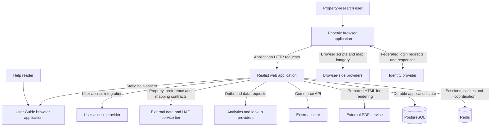

# System Architecture

[Project context](../project-context.md) | [Business overview](business-overview.md) | [Repository map](repository-and-technology-map.md)

## The central mental model

The repository builds a modular application with one Spring Boot web host and multiple in-process Java libraries. It also builds two Angular applications: Phoenix and the User Guide. The web packaging copies their output into the executable application. This is not evidence of separately deployed `uaf-*` microservices.

**Confirmed:** `settings.gradle:19-30` declares the projects; `realist\web\build.gradle:7-28` configures the executable JAR; `realist\web\build.gradle:41-73` connects frontend outputs to packaging; `Application.java:11-31` starts the host.

The number of deployed replicas and external service topology are **Unknown** from these build definitions.

## System context

Arrows label interaction categories, not a claim that all use the same protocol. Federated login uses browser redirects/responses and returns through server security endpoints; outbound clients are a separate concern. External IFC implementations may hide transport details. Browser integrations must remain visible: the frontend is not exclusively a thin client of `/api`.

Evidence: `phoenix\src\index.html:10-40`; `phoenix\src\app\dashboard\components\google-map\services\google-map-loader.ts:12-21`; `uaf-common\action\src\main\java\com\facl\uaf\common\shared\service\RamService.java:53-93`; `realist\web\src\main\java\com\facl\uaf\realist\store\StoreApiClient.java:57-111`; `realist\web\src\main\java\com\facl\uaf\realist\service\reports\pdf\PdfClient.java:19-34`. Federation redirects: `realist\web\src\main\java\com\facl\uaf\realist\rest\controller\PingSsoController.java:27-43` and `realist\web\src\main\java\com\facl\uaf\realist\controller\SamlController.java:116-143`.

## Runtime boundaries inside the application

```mermaid
flowchart LR
    subgraph Browser["Browser"]
        Component["Components and routes"]
        State["NgRx state and effects"]
        Http["Angular services"]
        Component -->|Dispatch / select| State
        State -->|Request| Http
        Component -->|Some direct calls| Http
    end
    subgraph App["Single web-application process"]
        Security["Security filters and session"]
        Controller["REST and MVC controllers"]
        Services["Services, mappers and clients"]
        Facade["ServiceHandler where used"]
        Libraries["UAF action libraries and delegates"]
        Security --> Controller
        Controller --> Services
        Controller -->|Selected paths| Facade
        Services -->|Selected paths| Facade
        Facade --> Libraries
        Services -->|Direct action/client paths| Libraries
    end
    Http -->|HTTP| Security
    Libraries -->|Dependency contract boundary| External["External implementations"]
    Services -->|HTTP / client calls| External
```

This is a responsibility map rather than a universal call stack. Search, commerce, login and report preparation each have their own concrete chain. Read the [feature flows](../feature-flows/index.md) before adding a layer to an explanation.

Evidence: `ServiceHandler.java:112-166,276-295`, `PreferenceController.java:54-85`, and `StoreController.java:337-355`, all beneath `realist\web\src\main\java\com\facl\uaf\realist`.

## Development versus packaged execution

| Concern | Separate frontend development | Packaged application |
| --- | --- | --- |
| Phoenix assets | Angular development server; the defined start script enables the proxy | Copied into the web application's public resources |
| User Guide | Separate workspace app and start command | Built for `/help/` and copied to public help resources |
| API routing | Development proxy forwards configured paths to the backend | Browser application and backend can be served by the packaged host |
| Build tools | npm/Angular tasks and Java/Gradle tasks have separate concerns | Web `bootJar` depends on the frontend asset-producing tasks |
| Configuration | Build environment flags are not the complete user configuration | Login and subsequent runtime responses still supply templates/access/preferences |
| External services | A local server does not replace external property/identity/provider systems | Provider configuration remains environment-dependent |

See [local setup](../development/local-setup.md) for exact commands and prerequisites, and [build/deployment](../development/build-and-deployment.md) for artifact names and packaging behavior.

Evidence: `phoenix\package.json:4-18`, `phoenix\proxy.config.mjs:1-45`, `phoenix\angular.json:208-254`, `realist\web\build.gradle:41-73`.

## Data ownership is not module naming

PostgreSQL stores application-owned state such as commerce-related records, report usage/limits, feature configuration and sharing data. External interfaces supply much of the property/report source data. Redis has several distinct jobs rather than being one generic cache.

Some persisted report/usage entities are in `uaf-reports`; application repository/entity scanning includes those packages. Therefore neither all persistence nor all business logic lives under `realist\web`.

Read [database/migrations](../cross-cutting/database-and-migrations.md) and [Redis responsibilities](../cross-cutting/redis-caching-and-sessions.md). Evidence: `Application.java:14-21`; the migration directory `realist\web\src\main\resources\db\migration`; `uaf-reports\action\src\main\java\com\facl\uaf\report\entity`.

## Deployment evidence boundary

The checked-in application manifest is Cloud Foundry/Kf-style. Jenkins also provisions a build pod/container. Those facts must not be collapsed into "the application is defined by Kubernetes Deployment YAML."

**Confirmed:** `Jenkinsfile:61-64,88-111` and `manifests\dev-usw1-kf.yml:1-21` show the local delivery contract. **Unknown:** the full shared-pipeline implementation, production route/replica configuration, approval process and rollback behavior.

## How to trace a change

Choose a user action first. Locate its component/route, follow its effect or direct service, match the HTTP method and composed backend path, and follow the actual service/action/client chain. Stop at an unavailable implementation boundary and identify its owner rather than guessing.

Use the [backend responsibility map](../backend/application-architecture.md), [module dependencies](../backend/module-dependencies.md), and [feature-to-code map](../backend/api-and-feature-map.md). Build dependency graphs and runtime call graphs answer different questions.

## Known limits

These diagrams describe source-backed responsibilities, not a live-system trace. Effective deployed settings, service health, provider topology and customer entitlements are not established by this read-only research.
