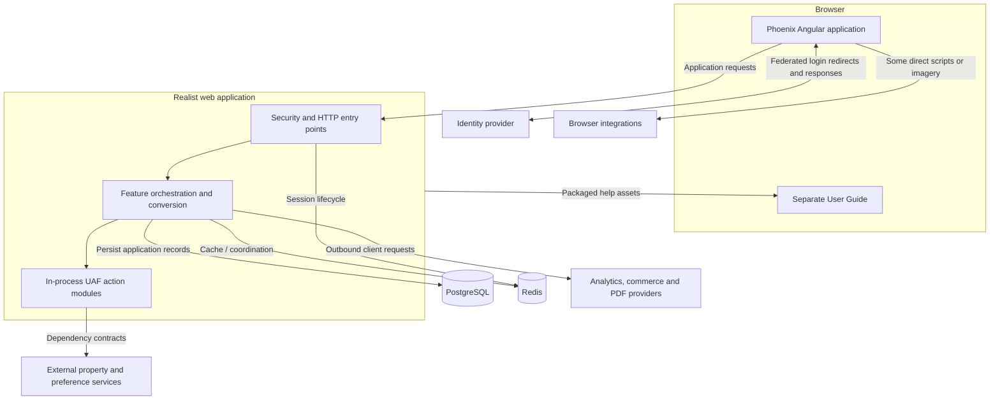

# Realist Phoenix: Project Context and KT Guide

[Repository home](../README.md) | [Browse the documentation library](README.md)

[Completion status](completion-status.md) | [Glossary](overview/glossary.md) | [Local setup](development/local-setup.md) | [90-minute KT agenda](onboarding/kt-session-agenda.md)

## Purpose and scope

Start here if you are new to the product or repository. This guide explains current-source architecture and the user journeys connecting the Angular frontend, Spring Boot application, UAF modules, local state, and external services.

**Research baseline:** 2026-09-25, branch `RP-10188`, revision `a6f611ae0654e2bf62deec0a7d5c1d333348d6be`. The pre-existing `.gitignore` change is outside this work. The [completion checkpoint](completion-status.md) is authoritative for current chapter status and later updates.

This is source-backed documentation, not evidence of a successful runtime, current deployed entitlements, or provider availability. Unknowns are documented rather than filled with assumptions.

**Standalone publication:** this private repository contains documentation only. Source-file links point to the [application source at the research revision](https://github.com/corelogic-private/real_estate_us-realist-phoenix/tree/a6f611ae0654e2bf62deec0a7d5c1d333348d6be) and require access to that repository. Plain source paths and development commands refer to the application checkout. README landing pages provide GitHub directory navigation; Mermaid diagrams render in their owning Markdown chapters.

## Contents

- [Understand the project in five minutes](#understand-the-project-in-five-minutes)
- [System overview](#system-overview)
- [Documentation navigation](#documentation-navigation)
- [Choose a reading path](#choose-a-reading-path)
- [Evidence and boundaries](#evidence-and-boundaries)

## Understand the project in five minutes

Realist Phoenix supports property research. Users search, inspect results on a grid/map, open property and specialist reports, explore market intelligence, save work, export information, and use supported purchase/sharing actions.

The repository contains two Angular applications: the main product and the User Guide. A Spring Boot web application hosts the backend and packages the built browser assets. The `uaf-*` action projects are library modules, not automatically separate microservices.

The UI is partly runtime-configured. Login data, preferences, templates, access settings and feature conditions can change the form fields, navigation and reports that a user sees.

Backend behavior combines local orchestration with external property, identity, preference, mapping, analytics, commerce and rendering contracts. PostgreSQL stores application-owned records; it should not be mistaken for the complete source property database. Redis supports several distinct session, cache and coordination concerns.

To understand a feature, follow the actual chain: component -> effect or direct service -> HTTP request -> controller/filter -> service/action/client -> local or external boundary -> returned data -> UI. Do not force every path through NgRx or `ServiceHandler`.

## System overview

Read the application box as a process boundary, not a list of independent deployments. External arrows identify contracts, not unavailable provider internals. Federated login is browser-mediated and enters the security endpoints; it is not the same path as outbound API clients.

Evidence: `settings.gradle:19-30`; `realist\web\build.gradle:7-73`; `realist\web\src\main\java\com\facl\uaf\realist\Application.java:11-31`; `phoenix\src\app\app-state.module.ts:43-75,105-149`. Browser-mediated identity evidence: `realist\web\src\main\java\com\facl\uaf\realist\rest\controller\PingSsoController.java:27-43` and `realist\web\src\main\java\com\facl\uaf\realist\controller\SamlController.java:116-143`. See [system architecture](overview/system-architecture.md) for finer boundaries.

## Documentation navigation

| Section | What you will learn | Start here |
| --- | --- | --- |
| Business | User goals, feature families and access distinctions | [Business overview](overview/business-overview.md) |
| Architecture | Runtime, build, storage and provider boundaries | [System architecture](overview/system-architecture.md) |
| Repository and stack | Directories, entry points and declared technologies | [Repository map](overview/repository-and-technology-map.md) |
| Frontend foundations | Bootstrap, routes, NgRx, services and shared UI | [Frontend index](frontend/index.md) |
| Dashboard | Widgets, data loading, layout and preferences | [Dashboard](frontend/dashboard/index.md) |
| Search | Quick/My Search, dynamic controls, grid/map and actions | [Search](frontend/search/index.md) |
| Property Intelligence | Analytics navigation, charts and data flow | [Property Intelligence](frontend/property-intelligence/index.md) |
| Reports | Types, routes, sections, actions and availability rules | [Reports](frontend/reports/index.md) |
| Backend | Host architecture, module responsibilities and dependencies | [Backend index](backend/index.md) |
| Feature execution | Concrete browser-to-backend-to-provider journeys | [Feature-flow index](feature-flows/index.md) |
| Shared platform concerns | Security, data, caching, integration and configuration | [Cross-cutting index](cross-cutting/index.md) |
| Development | Setup, delivery, existing tests, troubleshooting and changes | [Development index](development/index.md) |
| Learning and KT | Session agenda, first week, reading path and team questions | [Onboarding index](onboarding/index.md) |
| Progress | Completion states, evidence boundaries and exact resume point | [Completion status](completion-status.md) |

## Choose a reading path

**Complete newcomer:** [business](overview/business-overview.md) -> [glossary](overview/glossary.md) -> [architecture](overview/system-architecture.md) -> [repository](overview/repository-and-technology-map.md) -> [first week](onboarding/first-week-learning-plan.md).

**Frontend developer:** [frontend](frontend/index.md) -> [routing](frontend/bootstrap-and-routing.md) -> [state/API](frontend/state-management-and-api-flow.md) -> [Dashboard](frontend/dashboard/index.md) -> [Search](frontend/search/index.md) -> [Property Intelligence](frontend/property-intelligence/index.md) -> [Reports](frontend/reports/index.md).

**Backend developer:** [backend architecture](backend/application-architecture.md) -> [dependencies](backend/module-dependencies.md) -> [module index](backend/index.md) -> [API/feature map](backend/api-and-feature-map.md) -> [data](cross-cutting/database-and-migrations.md) -> [security](cross-cutting/authentication-and-authorization.md).

**Trace a feature end to end:** [search flow](feature-flows/property-search.md) -> [property report](feature-flows/property-details-and-reports.md) -> [PDF](feature-flows/pdf-generation-and-download.md) -> [commerce/credits](feature-flows/cart-checkout-and-report-credits.md). Use the [flow index](feature-flows/index.md) to choose a different journey.

**Prepare or present KT:** [90-minute agenda](onboarding/kt-session-agenda.md) -> [code-reading path](onboarding/code-reading-path.md) -> [known gaps](onboarding/known-gaps-and-team-questions.md).

## Evidence and boundaries

- **Confirmed** means directly supported by cited source/configuration.
- **Inferred** means an interpretation of that evidence, with the reasoning stated.
- **Unknown** means evidence is unavailable or a specific path remains unresolved.
- Source citations refer to the research baseline; confirm them when the code changes.
- Source-level feature conditions do not establish which customers have a feature enabled today.
- Existing project documentation contains stale claims; the detailed pages reconcile them against build/source evidence.

The [known-gaps page](onboarding/known-gaps-and-team-questions.md) identifies evidence owners. The [generation prompt](kt-generation-prompt.md) preserves the documentation requirements; [completion status](completion-status.md) preserves the work state.
